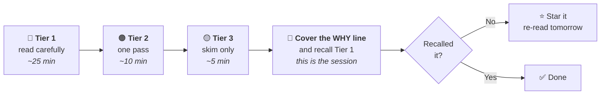

# 📰 CURRENT AFFAIRS — START HERE

**Target: CSE 2027.** Started 3 Aug 2026. Window that matters: **Jan 2026 → Mar 2027**.
Budget: **45 min/day**, per [00_MASTER_SCHEDULE.md](../00_MASTER_SCHEDULE.md). That number is a ceiling, not a target to beat.

---

## ⚠️ Read this before anything else

**Current affairs is not news. It is the static syllabus, wearing a costume.**

UPSC almost never asks "what happened." It asks about the *concept the event sits on top of*:

| The news said | UPSC actually asked about |
|---|---|
| RBI cut the repo rate | Composition and voting rules of the **Monetary Policy Committee** |
| A Governor sat on a state bill | **Article 200** — assent, withholding, reservation for the President |
| A new tiger reserve was notified | **Wildlife Protection Act 1972** schedules, and where the reserve *is* |
| India signed a defence pact | The **grouping's** members, HQ, and founding year |

So the daily job is **not** "read the news." It is: *read the news, throw 95% of it away, and convert the remaining 5% into a syllabus entry linked back to the static folder.*

Everything in this folder exists to enforce that one conversion.

---

## 📂 The structure

```
Current Affairs/
├── 00_START_HERE.md          ← you are here
├── 00_SOURCES.md             🏛️ REGISTRY     PIB, ministries, official bodies by theme
│
├── 01_Daily/                 ✍️ CAPTURE      raw weekly notes, Mon–Sun
├── 02_Themes/                📚 REVISE       8 running theme files ← THE REAL MATERIAL
├── 03_Monthly_Digest/        🗜️ COMPRESS     one file per month
├── 04_Prelims_Factsheets/    🎯 CRAM         running tables of pure factual bait
├── 05_Mains_Material/        📝 WRITE        issues, data, examples, quotes
└── 06_Quiz_MCQ/              ✅ TEST         weekly CA quizzes
```

**Read the folders left to right as a funnel.** Raw news enters at 01 and gets progressively compressed until, in April 2027, the only thing you revise is 03 and 04.

> 🔑 **`01_Daily/` is dated; nothing after it is.**
> One file per calendar day (`2026-08-01.md`) — that's the *study unit*, and dating it is what makes "one day per session, in order, never skipping" checkable at a glance.
> But nobody opens "August, second week" in April 2027. So everything downstream is organised by **syllabus topic** instead: the day-file feeds `02_Themes/` and `04_Prelims_Factsheets/`, and from then on the date is gone.

---

## 🚪 The six doors

| Folder | What's inside | Open it when |
|---|---|---|
| **[01_Daily](01_Daily/)** ⭐ | **One file per calendar day**, tiered 🔴🟠🟡, every item sourced. This is what you actually read | Every day, 45 min |
| **[02_Themes](02_Themes/00_INDEX.md)** | 8 files mapped to GS Papers I–III. Every item lands here with a link back to the static folder | Weekly review, and every revision |
| **[03_Monthly_Digest](03_Monthly_Digest/00_INDEX.md)** | One compressed file per month. ~2 hrs | Month end, then monthly forever after |
| **[04_Prelims_Factsheets](04_Prelims_Factsheets/00_INDEX.md)** | Schemes · Reports & Indices · Appointments & Awards · Places · Species. Pure tables | Whenever a fact appears; cram from here in May 2027 |
| **[05_Mains_Material](05_Mains_Material/00_INDEX.md)** | [Answer architecture](05_Mains_Material/01_Answer_Architecture.md), [the eight lenses](05_Mains_Material/02_The_Eight_Lenses.md), [issue bank](05_Mains_Material/03_Issue_Bank.md), [data pool](05_Mains_Material/Quotes_and_Data.md) | The weekly writing drill |
| **[06_Quiz_MCQ](06_Quiz_MCQ/README.md)** | Weekly 15-Q quizzes, same engine as Polity/History | Every weekly review |

---

## ⏱️ The daily 45 minutes

**You do not read news. You read the compiled brief.** The filtering — the part that eats two hours and produces nothing by itself — is done for you. Your 45 minutes go entirely into *retention*, which is the part that actually scores.



> 🔑 **The recall step is the session.** Reading a compiled brief is dangerously comfortable — it *feels* like studying and, on its own, retains almost nothing. Cover the **Why it's asked** line. If you can't produce the testable fact, you don't have the item.

### 📶 Coverage is complete. Depth is rationed.

**There is no cap on items.** Everything of consequence on the day gets compiled — a fixed quota would mean deciding in advance that the day's 9th story doesn't matter, which is unknowable at compile time and occasionally wrong in an expensive way.

Volume is controlled by **tiering** instead, which is the honest version of the same discipline:

| Tier | What qualifies | Your treatment | Phase C |
|---|---|---|---|
| 🔴 **1** | A Prelims question could be built on it as it stands — named scheme, body, judgment, number | **Read carefully, recall actively** | ✅ Revised again |
| 🟠 **2** | Real syllabus relevance, unlikely to be asked directly. Context, or Mains-only | One pass | Skim |
| 🟡 **3** | Appears in compilations, almost certainly won't be asked | Skim | ❌ Never revisited |

**Tier 3 exists so that skipping is a decision rather than an accident.** You'll have seen it once and can say "not worth it" — which is a different mental state from "nobody told me."

**When a call is close, it goes lower.** Tier inflation is the failure mode: if everything is Tier 1, nothing is.

---

## 🕒 The three-day lag — *we are deliberately behind*

**On day D, we compile day D-3.** On 4 August we studied **1 August**. On 5 August, 2 August. One day per session, in order, never skipping.

This is not a compromise. It's better than compiling live, for three reasons:

1. **Sources are thin on the day and thick by D+3.** PIB summaries, coaching compilations and analysis all appear over the following 48–72 hours. Compiling live means working from raw wire copy
2. **Facts settle.** A story that runs three days gets its numbers corrected. Compiling on day 1 means occasionally learning the wrong figure and having to unlearn it — the most expensive kind of error
3. **You get free spaced repetition.** You read it here first, then bump into the same story in the wild — a headline, a conversation, a video. That second exposure is unplanned revision at zero cost, and it only works if we're *behind* the news rather than level with it

The lag stays constant, so coverage is complete — just shifted. The last three days before Prelims are irrelevant anyway; UPSC's current-affairs window closes months earlier.

---

## 📅 The weekly and monthly rhythm

| When | Time | Do this |
|---|---|---|
| **Daily** | 45 min | Read the day's brief — Tier 1 carefully, 2 once, 3 skimmed. Recall Tier 1 |
| **Sunday** | 45 min | Move the week's items into `02_Themes/` under their topic. Take that week's 15-Q quiz. Anything you got wrong gets a ⭐ |
| **Last Sunday of month** | 2 hrs *(borrow from the subject block)* | Write `03_Monthly_Digest/2026-08.md`. Update all five factsheets. The month's week-files can then be ignored forever |
| **Quarterly** | 2 hrs | Re-read the 3 monthly digests back-to-back. Delete what turned out to be noise |

Sunday is the load-bearing step. A week captured but never filed is a week wasted — that's the current-affairs equivalent of reading a chapter and skipping the PYQs.

---

## 📚 Sources — one spine, nothing else

The single biggest failure in current affairs is **source overload**: three newspapers, five YouTube channels, two magazines, endless PDFs, and no revision. More input is not more marks; past a point it is strictly fewer, because revision time is fixed.

**Your spine (pick the row that matches the day you're having):**

| Priority | Source | Time | Why |
|---|---|---|---|
| 🥇 **Spine** | **One monthly compilation** (Vision IAS / InsightsIAS / ForumIAS monthly) | ~3 hrs, once a month | Already filtered by people who do this full-time. For a working professional this is the highest marks-per-minute source that exists |
| 🥈 **Daily** | **One newspaper — *The Hindu* OR *Indian Express*, not both** | 25 min | Pages 1, editorial, and the national/economy pages. **Skip** sports, crime, city, party politics |
| 🥉 **Primary** | **PIB + the ministry/body's own site** — see the full registry in **[00_SOURCES.md](00_SOURCES.md)** | 5 min | Official wording. UPSC sets questions from the ministry's page, not from the newspaper's paraphrase of it |
| Optional | **RSTV/Sansad TV big-picture**, *Yojana*/*Kurukshetra* | 1 hr/week | Only in Phase B, only for Mains depth on 2–3 issues |

### ✅ Decided, 3 Aug 2026 — *no newspaper*

You work full-time and have ~45 min in the evening. **You read no newspaper.** Sourcing is entirely Claude's job; the table above describes what *Claude* reads, not what you read.

| | |
|---|---|
| **You read** | The weekly compiled brief in [01_Daily/](01_Daily/), one day's portion at a time. Nothing else |
| **Claude reads** | The week's news + **PIB and the official body pages in [00_SOURCES.md](00_SOURCES.md)** — primary sources preferred over reportage on every item |
| **Monthly compilation** | Optional now. If a Vision/Insights/Forum PDF is ever dropped in, it gets used as a **cross-check** against the compiled weeks — a way to catch what was missed, not a second thing to read |

**Is this a worse strategy than reading a newspaper?** For **Prelims, no** — a curated compilation is pre-filtered and arguably better, and many selected candidates never read a daily paper.

For **Mains**, the apparent cost is exposure to how an argument gets built. But the honest diagnosis is that **the gap was never really "editorials"** — it's that constructing a GS answer in nine minutes is a *skill*, and reading is a slow, indirect way to acquire it. A well-argued column teaches you that good arguments exist; it does not teach you to produce one under time pressure, and it never once tells you your own answer was one-sided.

**So it's closed directly, in [05_Mains_Material/](05_Mains_Material/00_INDEX.md):**

| | |
|---|---|
| [**Answer Architecture**](05_Mains_Material/01_Answer_Architecture.md) | Directive verbs, word/time budgets, the intro–body–conclusion shape, what separates a 6 from an 11 |
| [**The Eight Lenses**](05_Mains_Material/02_The_Eight_Lenses.md) ⭐ | Run any issue through 8 fixed angles in 60 seconds, keep 4, and the body paragraphs write themselves. **This is the file that replaces editorials** |
| [**Issue Bank**](05_Mains_Material/03_Issue_Bank.md) | The weekly issues, a 5-criterion rubric, and a score log that shows *which* criterion is your weak column |
| [**Quotes & Data**](05_Mains_Material/Quotes_and_Data.md) | Sourced numbers and constitutional phrases — raid it while writing |

**The weekly drill costs no new time:** 20 min inside the existing Sunday slot. You write 150 words *before* seeing my version, then I mark it. Reading a model answer before attempting is worth almost nothing — you recognise every point and conclude you knew it.

**A missed day is recoverable. A missed week is not** — the brief is written whether or not it's read, and unread briefs stack up silently.

**Explicitly do NOT:** subscribe to a second newspaper, follow daily-CA Telegram channels, watch daily news analysis videos, or hoard PDFs "for later." If a source doesn't get read the week it arrives, it is a liability.

---

## 🤝 How we split the work

**Decided 3–4 Aug 2026: compilation is my job, one day per session, at a 3-day lag.**

| | You | Claude |
|---|---|---|
| **Each session** | 45 min. Read that day's brief — Tier 1 carefully, Tier 2 once, Tier 3 skimmed — then **recall Tier 1** | Compile **one calendar day** (D-3) in full from news **and the primary sources in [00_SOURCES.md](00_SOURCES.md)**. Tier every item, write the *why it's asked* line, push rows to the factsheets |
| **Weekly review** | 45 min. Quiz (15) · **write the Issue of the Week, 150 words, by hand, timed** (20) · skim the week's Tier 1 (10) | File the week into [02_Themes/](02_Themes/00_INDEX.md), build the 15-Q quiz, set the Issue drill — **and mark your answer against the rubric** |
| **Month end** | Read the digest | Write the digest, publish the month's quiz |
| **Phase B** | Answer writing | Mains material, full-length CA tests |

**Your entire commitment is 45 min/day of reading and recall.** No hunting, no filtering, no note-making, no file management. That is the deal, and it only breaks if the recall step gets skipped — at which point this becomes a very well-organised folder that teaches nothing.

> ⚠️ **The honest constraint, worth knowing:** my training data ends around **May 2026**. I cannot write August 2026 current affairs from memory — I have to search the web for it, and I will. What this means for you: **every item I compile carries its source link.** If an item ever appears here without one, don't trust it, and tell me. In current affairs a confident wrong ministry or rank is worth negative marks, and this is the one subject where that failure mode is live.

---

## 🗑️ What to skip — a real list

Beginners lose most of their time here. **Skip entirely:**

- Party politics, elections, cabinet reshuffles, state political drama — *unless* a constitutional provision is invoked (Art. 356, anti-defection, Governor's discretion). Then it's a Polity item, not a politics item.
- Crime, accidents, communal incidents, celebrity, obituaries of non-eminent persons
- Sport — except: an Olympic/CWG/Asian Games *host city*, a new event added, or an Indian first
- Bilateral visit *itineraries*. Keep only the **outcomes**: agreements signed, corridors named, joint exercises
- Daily market movements, rupee levels, individual company news
- Op-ed opinions as opinions. Keep the **argument structure**, never the columnist's conclusion

**Never skip:** schemes (name + ministry + beneficiary + year), reports & indices (publisher + India's rank + what it measures), constitutional/statutory bodies in the news, new species/protected areas, space & defence missions, international groupings, and **anything with a number in it**.

---

## 🔗 The step that makes this folder worth more than a coaching PDF

Every item gets a **static hook** — a link to the chapter in your own folders where the concept lives:

> **Governor returned the state bill without assent** *(4 Aug)*
> → **Static hook:** [Polity/02_Laxmikanth](../Polity/02_Laxmikanth/00_INDEX.md) — Art. 200, State Legislature
> → **Prelims:** Governor has *no* time limit under Art. 200; "as soon as possible" is directory, not mandatory
> → **Mains:** GS-II federalism — pocket veto vs. reserved-for-President

That third line is the exam question. The news was just the excuse to ask it.

This is also the fastest diagnostic you have: **if you can't name the static hook, you haven't finished studying that subject yet.** Current affairs will keep telling you where the holes are, for free, every single day.

---

## 🎓 Prelims CA vs Mains CA — different notes, different formats

| | **Prelims** | **Mains** |
|---|---|---|
| Wants | Facts, names, numbers, rankings | Arguments, causes, consequences, examples |
| Format | Table row → `04_Prelims_Factsheets/` | Bullet with a data point → `05_Mains_Material/` |
| Test | "Which ministry runs it?" | "Critically examine…" |
| Volume | High — hundreds of rows | Low — ~40 issues carry all of GS I–III |

Most items are one or the other. A few are both. **Don't write a paragraph where a table row will do**, and don't reduce a genuine debate to a factoid.

---

## 🗓️ The three phases

| Phase | Window | Current affairs looks like |
|---|---|---|
| **A — Foundation** *(now)* | Aug 2026 → Jan 2027 | 45 min/day. Build the habit and the buckets. Thin layer, wide net. Static subjects are still the priority |
| **B — Integration** | Feb → Mar 2027 | 1–1.5 hr/day. Merge CA into static revision. Backfill the analytical layer. Full-length CA tests |
| **C — Compression** | Apr → May 2027 | **No new sources.** Only `03_Monthly_Digest/` + `04_Prelims_Factsheets/` + a final 60-day sheet |

**On backfilling Jan–Jul 2026** *(the seven months before this folder existed)*: don't read it now. Anything analytical you backfill in August will be gone by May. **Do this instead** — fill only the *factual* layer now (schemes launched, reports published, appointments, awards from Jan–Jul 2026) straight into `04_Prelims_Factsheets/` as table rows. That's a few sessions, and those facts are durable. The analytical backfill happens in Phase B, once, from a single year-end compilation.

---

## 📊 Where things stand

| | Status |
|---|---|
| Structure | ✅ Built, 3 Aug 2026 |
| Week 1 brief | 🔵 **Mon + Tue portions written and sourced.** Wed–Sat compiled as the week happens. Issue of the Week: delimitation / the 131st Amendment defeat |
| Theme files | ⬜ 8 buckets created, empty |
| Factsheets | ⬜ 5 tables created, empty. **Jan–Jul 2026 backfill pending** |
| Monthly digests | ⬜ First one due Sun 30 Aug 2026 |
| Quizzes | ✅ Engine copied, audit passes clean. First bank `2026-08` due Sun 9 Aug |
| Source decision | ✅ **No newspaper.** Claude compiles from news + primary sources |
| Operating model | ✅ Claude compiles and files; you read 45 min/day and take the Sunday quiz |

**Next three things, in order:**
1. **Tonight, 45 min.** Open [Week_01_Aug03-09.md](01_Daily/2026-08_August/Week_01_Aug03-09.md), read **Mon 3 Aug only**, then cover the right column and recall it
2. **Wed 5 Aug** — RBI MPC decision lands; Wednesday's portion leads with it
3. **Sunday 9 Aug** — first 15-Q quiz + Week 2 brief

---

## ⚠️ One caution on this folder's contents

Anything written here that came from a model rather than a source **must be verified against the source before you write it in an exam.** Current affairs is the one area where a confident-sounding wrong date, rank, or ministry is worth negative marks. Items sourced from a compilation or PIB should carry the source; items that don't are flagged ⚠️ until checked.

---

*Companion to [Polity/00_START_HERE.md](../Polity/00_START_HERE.md) and [00_MASTER_SCHEDULE.md](../00_MASTER_SCHEDULE.md). Created 3 August 2026.*
