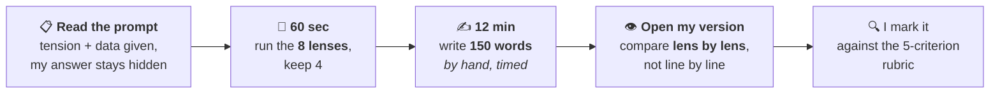

# 📝 05_MAINS_MATERIAL — arguments, data, examples

**Prelims current affairs is wide and shallow. Mains current affairs is narrow and deep.**

Roughly **40 issues** carry all of GS I–III. You don't need hundreds — you need forty, each argued from four angles with two numbers and one example, ready to deploy under time pressure.

---

## Why this folder got bigger on 3 Aug 2026

The original plan said "start writing in Phase B." That was too passive, and it left a real gap unaddressed: **not reading editorials costs you exposure to how arguments are built.**

The honest diagnosis is that the gap was never really "editorials." It's that **answer construction under time pressure is a skill, and reading — editorials or anything else — is a slow, indirect way to acquire it.** Reading a well-argued piece teaches you that good arguments exist. It does not teach you to produce one in nine minutes.

So the gap gets closed directly instead:

| File | What it does |
|---|---|
| **[01_Answer_Architecture.md](01_Answer_Architecture.md)** | The directive verbs, the word/time budget, the intro–body–conclusion shape, and what separates a 6 from an 11. **Structure, which is where most marks are actually lost** |
| **[02_The_Eight_Lenses.md](02_The_Eight_Lenses.md)** ⭐ | The generation algorithm — run any issue through 8 fixed angles, keep 4, and the body paragraphs write themselves. *This is the file that replaces editorials* |
| **[03_Issue_Bank.md](03_Issue_Bank.md)** | The running list of weekly issues, the 10-mark rubric, and the score log that shows which of the five criteria is your weak column |
| **[Quotes_and_Data.md](Quotes_and_Data.md)** | The ammunition pool — sourced numbers, constitutional phrases, committee recommendations |

---

## The weekly drill — 20 min, no new time

Inside the Sunday slot that already exists:

> 🔑 **Write before you read mine.** A model answer read *before* attempting is worth almost nothing — you will recognise every point and conclude you knew it. You didn't. That recognition-vs-recall confusion is the single most common way people fool themselves in Mains prep.

**Write by hand and on a timer.** The exam is handwritten under time pressure, and both of those are separate skills from knowing the content. Typing an untimed answer trains neither.

---

## What to write in Phase A vs Phase B

**Phase A (now → Jan 2027):** one issue a week, 150 words. That's it. ~22 issues by January, each argued and marked. No volume, no full-length papers — the static base isn't there yet, and answers written on a thin base come out generic, which trains the wrong instinct.

**Phase B (Feb → Mar 2027):** volume. Full 250-word answers, then sectional papers, then full-length. The 22 issues you already argued become the example bank that makes those answers specific instead of generic.

**The one thing to do continuously:** whenever a quotable number appears anywhere, it goes straight to [Quotes_and_Data.md](Quotes_and_Data.md). This is cheap now and expensive later.

---

## The thing I can't replace, and the thing I can

**Can't replace:** the physical act of writing 150 words in 12 minutes by hand. Nobody can do that for you, and it's the part that most directly moves the score.

**Can replace:** everything else editorials were doing — argument structure ([01](01_Answer_Architecture.md)), multi-angle generation ([02](02_The_Eight_Lenses.md)), the counter-argument reflex (the drill), examples and data ([Quotes_and_Data](Quotes_and_Data.md)), and evaluation against a rubric. That last one is something editorials never gave you at all: **a newspaper never tells you your answer was one-sided.**

---

## Files that come later

Created in Phase B when the volume starts, not scaffolded empty now:
`GS1_Society.md` · `GS2_Polity_Governance.md` · `GS2_IR.md` · `GS3_Economy.md` · `GS3_Environment.md` · `GS3_SciTech_Security.md`

---

*Created 3 August 2026, rebuilt the same day around active practice.*
