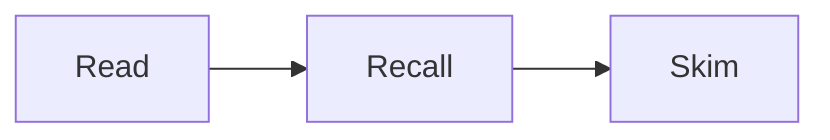
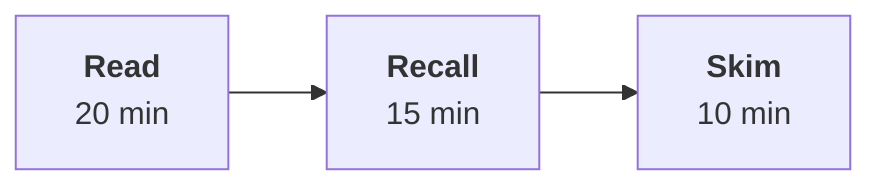
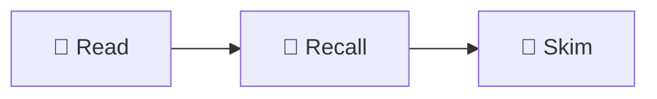
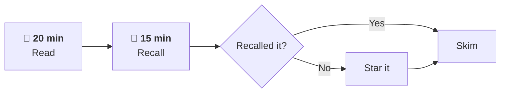
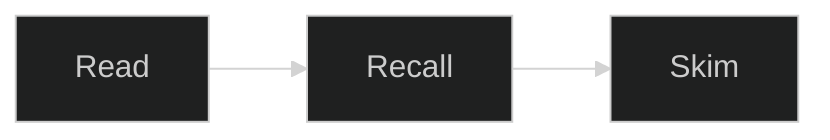

# Mermaid diagnostic — delete this file once we know the answer

Open this in the **same preview** where the blank gap appeared, and tell me **which of the four boxes below you can see**. Each test adds one ingredient, so the first one that goes blank is the cause.

---

## Test A — bare minimum (no HTML, no emoji, no quotes)



**See a diagram?** → Mermaid works at all.
**Blank?** → the extension is rendering but its output is invisible (theme/contrast), or it isn't rendering at all.

---

## Test B — adds HTML tags



**A works but B is blank?** → `htmlLabels` is disabled (strict security mode). The `<b>` and `<br/>` tags are the problem.

---

## Test C — adds emoji



**B works but C is blank?** → emoji/font issue in the renderer.

---

## Test D — adds a decision node and edge labels



**C works but D is blank?** → the `{"..."}` decision node or the `-- label -->` edge syntax.

---

## Test E — forced dark theme

If **A–D are all blank**, try this one. It pins the theme instead of inheriting it:



**Only this one shows?** → the others were rendering in Mermaid's **light** theme: dark text and dark lines on your dark background, i.e. drawn correctly but invisible. That's the single most likely cause given you're seeing reserved space rather than raw code.

---

## Before any of that — try the cheap fix first

A known VS Code quirk: Mermaid diagrams render blank until the preview is refreshed.

1. Close the preview tab, reopen it (`Ctrl+Shift+V`)
2. Or run **Developer: Reload Window** from the Command Palette (`Ctrl+Shift+P`)

If the diagrams appear after that, nothing is wrong with the files at all.

---

## Also worth confirming

Which extension is installed? The usual one is **`bierner.markdown-mermaid`** ("Markdown Preview Mermaid Support"). Check with:

```
code --list-extensions | findstr /i mermaid
```

If that returns nothing, the extension isn't installed — but then you'd be seeing raw code rather than a blank gap, which would itself be informative.

---

**Tell me the letter of the first test that goes blank, and I'll fix the real cause across all the files at once.**
