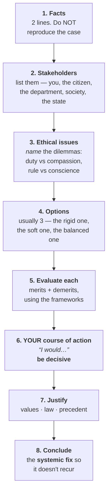

# ⚖️ ETHICS (GS PAPER IV) — START HERE

**General Studies Paper IV — Ethics, Integrity and Aptitude.** 250 marks · 3 hours · Mains only.

> 🔑 **The one-line summary:** it is the **smallest syllabus and the highest-scoring paper** in the whole Mains, it is **worth zero marks in Prelims**, and it is won or lost on **case studies written by hand under time pressure** — not on how much theory you read.

Created 7 August 2026.

---

## 📋 The basics, in one table

| | |
|---|---|
| **Full name** | General Studies Paper IV — Ethics, Integrity and Aptitude |
| **Introduced** | 2013 (Mains restructuring). PYQs therefore run **2013 → present**, ~13 papers |
| **Marks** | **250** |
| **Duration** | **3 hours** (180 min) → **~43 seconds per mark**. This is the binding constraint |
| **Where it counts** | Mains merit only. **Nothing in Prelims** |
| **Share of Mains merit** | 250 / 1750 ≈ **14.3%** |
| **Share of final total** | 250 / 2025 ≈ **12.3%** (Mains 1750 + Interview 275) |
| **Language** | Answer in your Mains medium; questions are bilingual |
| **Sibling papers** | Essay (250) and the Interview (275) both feed off the same material — see [the overlap section](#-the-hidden-return-essay--interview) |

### Paper structure

| Section | What | Typical marks |
|---|---|---|
| **Section A** | **Theory.** Sub-parts of 10 marks / 150 words, some 20 marks / 250 words | ~**130** |
| **Section B** | **Case studies.** Usually **6 × 20 marks**, ~250 words each | ~**120** |

⚠️ The exact sub-question split shifts year to year — some years Section A is 12 × 10-markers, others mix in 20s. Treat the table as the shape, not the law, and confirm against the actual papers once they're in `03_PYQ_Mains/`.

**Section B is where the paper is decided.** Six case studies in roughly 100 minutes is ~17 minutes each *including reading the case*. Most candidates who score badly did not write badly — they ran out of time and left the last two case studies half-done or blank.

---

## 📖 The syllabus — all of it

UPSC's own framing first, because it tells you what the paper actually tests:

> *"This paper will include questions to test the candidates' **attitude and approach to issues relating to integrity, probity in public life** and his **problem solving approach** to various issues and conflicts faced by him in dealing with society. Questions may utilise the case study approach to determine these aspects."*

Read that twice. It does **not** say "test the candidate's knowledge of moral philosophy." It says *attitude*, *approach*, *problem solving*. That single sentence is why philosophy-essay answers score 8/20 and decisive administrative answers score 14/20.

The eight listed topics:

| # | Topic | What's really in it |
|---|---|---|
| **1** | **Ethics and Human Interface** | Essence, determinants and consequences of ethics in human action; dimensions of ethics; ethics in private and public relationships. Human values — lessons from the lives and teachings of great leaders, reformers, administrators; role of **family, society and educational institutions** in inculcating values |
| **2** | **Attitude** | Content, structure, function; influence on and relation with thought and behaviour; **moral and political attitudes**; social influence and persuasion |
| **3** | **Aptitude & foundational values for civil service** | Integrity, impartiality and non-partisanship, objectivity, dedication to public service, empathy, tolerance, compassion towards the weaker sections |
| **4** | **Emotional Intelligence** | Concepts, utilities and **application in administration and governance** |
| **5** | **Moral thinkers and philosophers** | From India *and* the world |
| **6** | **Public/Civil service values & ethics in public administration** | Status and problems; ethical concerns and dilemmas in government *and private* institutions; **laws, rules, regulations and conscience as sources of ethical guidance**; accountability; ethical governance; ethics in **international relations and funding**; **corporate governance** |
| **7** | **Probity in Governance** | Concept of public service; philosophical basis of governance and probity; information sharing and transparency, **RTI**; **Codes of Ethics vs Codes of Conduct**; **Citizen's Charters**; work culture; quality of service delivery; utilisation of public funds; **challenges of corruption** |
| **8** | **Case Studies** on all of the above | Section B |

**Topics 2, 3 and 4 are psychology, not philosophy.** That's the part most people get wrong — they read Kant for Attitude when the correct source is a psychology textbook. See the books section.

**Topics 6 and 7 are public administration and are the most "factual" part of the paper** — RTI, Lokpal, Citizen's Charter, 2nd ARC recommendations, Prevention of Corruption Act. These are the easiest marks in GS IV because they're concrete, and they overlap directly with GS-II governance.

---

## 🎯 Why this paper is worth more than its 250 marks suggest

**1. The score spread is enormous.** On the same paper, candidates score anywhere from ~60 to ~150. That ~80-mark gap is larger than what most optional subjects produce between an average and a good performance — and it comes from a syllabus you can finish in a month.

**2. It is the best marks-per-hour paper in the exam.**

| Paper | Rough prep hours for a competent first pass | Ceiling |
|---|---|---|
| History / Economy / Geography | 200–300 hrs each | GS answers stay ~55-60% at best for most |
| **GS IV Ethics** | **~80–120 hrs total** | Regularly 50-58%, and it is the paper where 130+ is genuinely achievable |

**3. There is no "unknown" in it.** You cannot be blindsided by an unread fact. Every question is answerable from a framework you already carry, which is not true of any other GS paper.

**4. It is the most *learnable* paper.** Your own [00_TARGET_Topper_Marks.md](../00_TARGET_Topper_Marks.md) already flags this — GS IV at ~123/250 (49%) for the benchmark topper, marked 🟢 *"best GS paper, most learnable."*

### 🎁 The hidden return: Essay + Interview

GS IV prep pays out three times:

| Where | How it pays |
|---|---|
| **GS IV** (250) | Directly |
| **Essay** (250) | Philosophical essays are a standing Section-A option ("Values are not what humanity is, but what humanity ought to be"). Your thinkers, quotes and examples bank *is* the essay bank |
| **Interview** (275) | The board's situational questions — "you're a DM and X happens" — are case studies asked out loud. So are the integrity questions. Same muscle |

So the effective value of GS IV prep is closer to **~400 marks of influence for ~100 hours of work.** Nothing else in this exam has that ratio.

---

## ⏱️ How long it takes, and when to start

### The honest sequencing answer for you

**Ethics contributes nothing to Prelims.** Your Prelims is ~May 2027; Mains would be ~Sept 2027. The strictly optimal plan is:

> **Full Ethics block: after Prelims, in the May → Sept 2027 window.** That window is ~14 weeks and Ethics needs ~4-6 of them. It fits perfectly, and every hour spent on it before Prelims is an hour stolen from a subject that could keep you from reaching Mains at all.

**But there is a cheap exception worth taking now**, because part of GS IV doesn't decay:

| Do now (Phase A, low intensity) | Defer to post-Prelims |
|---|---|
| **Thinkers bank** — 20 thinkers, one page each. Timeless, also feeds Essay | All case study practice |
| **Quotes bank** — accumulates naturally, costs nothing | Theory reading (Attitude, EI, Aptitude) |
| **Definitions sheet** — grows as you read anything | Answer writing drills |
| **Administrator examples** — collect from current affairs as they appear ⭐ | Full PYQ analysis |

That last row is the real prize: **your Current Affairs folder is already generating GS IV examples every single day** — a probity story, a bureaucrat who did something right, a conflict-of-interest case, an RTI ruling. Capturing them as they pass costs zero extra minutes. Reconstructing them in 2027 costs hours.

### The full block, once you start it

| Stage | Time | What |
|---|---|---|
| **1. First pass — theory** | **3–4 weeks @ 2 hrs/day (~50 hrs)** | One book cover to cover. Make your own notes as you go — 30-50 pages total, no more |
| **2. PYQ analysis** | **1 week** | All papers 2013→present. Sort by syllabus topic. You'll find the same ~25 themes recycle |
| **3. Answer writing** | **6–8 weeks, in parallel** | 2 case studies + 2 theory answers per week, **by hand, timed**. Target ~50 case studies written before the exam |
| **4. Revision** | **3–4 days** | Your own notes only. Nothing new |

**Total: ~80–120 hours.** Anyone who tells you Ethics needs six months is padding.

> ⚠️ **The most common failure is finishing stage 1 and stopping.** Reading the theory feels like preparation and produces almost nothing on its own — exactly the same trap as reading a Polity chapter and skipping the PYQs. Stage 3 is the paper.

---

## 📚 Books — pick ONE core, add the free stuff

### Tier 1 — the core book (choose one, not three)

| Book | Verdict |
|---|---|
| **Ethics, Integrity and Aptitude** — *G. Subba Rao & P.N. Roy Chowdhury* (McGraw Hill / Access) | 🥇 **The best-written option.** Actual explanation of concepts, decent case studies. If you're starting from zero, start here |
| **Lexicon for Ethics, Integrity & Aptitude** — *Niraj Kumar* (Chronicle) | 🥈 **The most popular**, dictionary-style. Excellent for **terminology and crisp definitions**, which is a real need. Weakness: dry, badly organised, some errors — it's a reference, not a teacher |
| **Ethics, Integrity and Aptitude** — *M. Karthikeyan* (McGraw Hill) | 🥉 Newer, well-structured, exam-oriented. A fine primary if you prefer it |

**The genuine recommendation: one primary (Subba Rao or Karthikeyan) + Lexicon used only as a dictionary.** Do not read three books. Ethics prep collapses under source overload faster than any other subject because the content is repetitive — the third book teaches you nothing the first two didn't and eats the answer-writing time that actually scores.

### Tier 2 — free, official, and disproportionately valuable

| Source | Why it matters |
|---|---|
| **2nd ARC — 4th Report: "Ethics in Governance"** ⭐ | **The single highest-value free document for this paper.** UPSC questions are drafted from its vocabulary. Read the summary + recommendations chapters, not all 400 pages |
| **2nd ARC — 10th Report: "Refurbishing of Personnel Administration"** | Civil service values, code of ethics vs code of conduct |
| **2nd ARC — 12th Report: "Citizen Centric Administration"** | Citizen's Charter, service delivery, Sevottam |
| **NCERT Class 11 & 12 Psychology** ⭐ | **The correct source for Attitude, Aptitude and Emotional Intelligence.** Ch. on *Self and Personality*, *Attitude and Social Cognition*, *Human Strengths and Meeting Life Challenges*. Gives you the technical vocabulary — ABC model, cognitive dissonance, Goleman's five components — that examiners look for. Skipping this is why most Attitude answers are vague |
| **Nolan Committee — Seven Principles of Public Life** (UK) | Selflessness · Integrity · Objectivity · Accountability · Openness · Honesty · Leadership. Two-page read, quotable in a dozen answers |

### Tier 3 — the legal/institutional layer

Not "books", but you must be able to name and date these:

**RTI Act 2005** · **Lokpal and Lokayuktas Act 2013** · **Whistle Blowers Protection Act 2014** · **Prevention of Corruption Act 1988 (amended 2018)** · **Central Civil Services (Conduct) Rules 1964** · **All India Services (Conduct) Rules 1968** · **Citizen's Charter / Sevottam** · **Central Vigilance Commission** · **Companies Act 2013 §135 (CSR)** · **UN Convention Against Corruption (India ratified 2011)**

Most of these you already meet in Polity and Current Affairs. Cross-link rather than re-learn.

### ❌ What NOT to read

- **Academic moral philosophy.** No Kant primary texts, no *Nicomachean Ethics*. You need Kant in three sentences, not three hundred pages
- **A second and third guidebook.** See above
- **Long "value education" books.** Zero exam return
- **Bulk case-study PDFs you'll never write out.** A case study you read is worth ~5% of a case study you wrote

---

## 🧠 The frameworks that answer almost every question

Three ethical lenses cover the overwhelming majority of GS IV. Learn them properly once and you can construct an answer to anything.

| Framework | Core question | Key names | Use it when |
|---|---|---|---|
| **Deontology** | *Is the act itself right? What is my duty?* Rules and means matter regardless of outcome | **Kant** — categorical imperative, "treat humanity as an end, never merely as a means", universalisability | Rule-vs-outcome dilemmas; anything about following procedure |
| **Consequentialism / Utilitarianism** | *What produces the greatest good for the greatest number?* | **Bentham** (quantitative), **J.S. Mill** (higher/lower pleasures) | Resource allocation, public health, displacement-for-development |
| **Virtue ethics** | *What would a person of good character do?* Focus on the agent, not the act | **Aristotle** — golden mean, eudaimonia; **Gandhi** | Integrity questions, personal conduct, "what should you do" |

Plus two you should carry:

- **Justice as fairness** — **Rawls**: veil of ignorance, difference principle (inequality is justified only if it benefits the worst-off). Perfect for anything on affirmative action, welfare, weaker sections
- **Ethics of care** — **Gilligan**: relationships and context over abstract rules. Useful when a case involves a vulnerable individual

> 🔑 **The move that gets marks:** in a case study, don't pick one framework and preach it. Show the tension — *"A purely utilitarian reading favours option 2, but it treats the displaced families as a means to an end, which Kantian duty forbids"* — and then resolve it. Showing you can see the conflict is the skill being tested.

### Thinkers — ~20 is enough, not 100

**Indian:** Gandhi (means-ends unity, satyagraha, trusteeship, the Talisman) · Buddha (Eightfold Path, Middle Path) · Kautilya (*Arthashastra*, rajadharma, "in the happiness of his subjects lies the king's happiness") · Ambedkar (constitutional morality, annihilation of caste) · Vivekananda · Tagore · Thiruvalluvar (*Thirukkural*) · Sri Aurobindo · Amartya Sen (capability approach) · Kalam

**Western:** Socrates (the examined life) · Plato (justice, cardinal virtues) · Aristotle · Kant · Bentham · Mill · Rawls · Machiavelli · Hannah Arendt (banality of evil) · Martin Luther King Jr. · Mandela · Mother Teresa

**Format for each: one page maximum** — core idea in 3 lines, 2 quotes, 1 administrative application. A thinker you can't apply to a case study is decoration.

---

## 🗂️ The case study template — the single most important thing in this folder

Every case study, every time. Deviating loses marks; the examiner is scanning for these components.



### The five rules that separate a 14 from an 8

| Rule | Why |
|---|---|
| **1. Be decisive.** Pick an option and own it | Fence-sitting is the #1 mark-killer. "Both options have merit" is a non-answer |
| **2. Stay legal and stay in the system** | Never propose anything unlawful. Never resign as a first resort — a resigning officer solves nothing and the examiner knows it. Never play martyr |
| **3. Be practical, not saintly** | The answer should be something a real officer could actually do on Monday morning |
| **4. Never moralise** | You are not lecturing on right and wrong. You are making an administrative decision under constraints |
| **5. Always end with the systemic fix** | Solving the case gets you the pass mark. Recommending the reform that prevents the next one gets you the top band |

### Answer-writing rules for Section A theory

- **Open with a definition.** Crisp, one sentence, your own words. This is why the Lexicon is useful
- **Use the terminology.** Probity · integrity · objectivity · impartiality · non-partisanship · conflict of interest · moral turpitude · ethical dilemma vs ethical lapse · discretion · **accountability vs responsibility** · constitutional morality · whistleblowing · transparency
- **Every abstract claim gets an example.** Generic answers cap out around 45%
- **Diagrams and flowcharts help.** A stakeholder map or a 3-column option table is faster to write than prose and easier to mark. Toppers use them heavily in this paper specifically
- **Quotes: one per answer, maximum.** Two quotes in one answer reads as padding

### 🇮🇳 The examples bank you must build

Answers live or die on these. Start collecting now:

**Administrators:** E. Sreedharan (Delhi Metro, deadlines and integrity) · T.N. Seshan (electoral reform, institutional spine) · Armstrong Pame (the "people's road") · Ashok Khemka · Satyendra Dubey and S. Manjunath (whistleblowers who were killed — the case *for* the Whistle Blowers Act) · S.R. Sankaran · Kiran Bedi

**Events:** Bhopal gas tragedy (corporate ethics) · the Vyapam scam · the 2015 Chennai / 2018 Kerala floods (administrative response) · COVID-19 migrant crisis · Uphaar

**Personal:** one or two from your own life or work. A software engineer's examples — a bug you disclosed, a deadline vs quality call, handling a colleague's shortcut — are *more* credible than a recycled Gandhi anecdote, and almost nobody uses them.

---

## ⏰ Exam-hall time management

180 minutes, 250 marks. This paper is failed on the clock more than on the content.

| Block | Time | Note |
|---|---|---|
| Reading / planning | 5 min | Scan Section B first — decide the order |
| **Section A** (~130) | **70–75 min** | ~11 min per 10-marker. Move on ruthlessly |
| **Section B** (~120) | **100–105 min** | **~17 min per case study**, reading included |

**A defensible strategy: attempt Section B first.** Case studies are longer, harder to rush, and are where marks are actually earned. Theory answers can be compressed at the end; a half-written case study cannot. Test this in a mock before committing to it.

**Never leave a case study blank.** Even the template's skeleton — stakeholders, issues, three options, a decision — scores something. A blank scores zero, and in a 6-question section a single blank is 20 marks.

---

## 🏆 How toppers actually prepared — the patterns

Ignore the mark screenshots; the *methods* are what transfer. These patterns recur across essentially every high-scoring account:

| # | Pattern | The detail |
|---|---|---|
| **1** | **One book, own notes** | Universal. Everyone condensed to a personal 30–50 page notebook and revised *only* that. Nobody revised the guidebook |
| **2** | **A fixed case-study template, internalised** | Not improvised in the hall. Written the same way 50 times until it was automatic |
| **3** | **~40–60 case studies written by hand, timed** | This is the real differentiator, and it's the step almost everyone skips. Reading model answers before attempting is worth close to nothing — you recognise every point and conclude you knew it |
| **4** | **A keywords and definitions sheet** | One page. Revised the morning of the exam |
| **5** | **A personal quotes bank** | 2–3 per theme, no more. Doubles as the Essay bank |
| **6** | **A personal examples bank** | Built over months from newspapers, not crammed in a week |
| **7** | **Diagrams and flowcharts** | Used far more heavily in GS IV than in other papers. Stakeholder maps, option-evaluation tables, dilemma trees |
| **8** | **Started late, finished fast** | Most did the whole thing in the 6–10 weeks between Prelims and Mains. Ethics is not a year-long subject and treating it as one is a misallocation |
| **9** | **Psychology from NCERT, not from the guidebook** | The ones who scored highest on Attitude / EI questions used correct psychological terminology |
| **10** | **Wrote answers before reading model answers** | Always in that order |

> ⚠️ **On topper mark figures:** specific scores circulate widely online and are often wrong or misattributed. Treat any number you see — including in coaching material — as unverified unless it's from the official UPSC mark sheet. The *methods* above are consistent across accounts and are the part worth copying.

---

## 📂 Proposed structure for this folder

GS IV doesn't fit the standard subject skeleton — there's **no NCERT spine and no Prelims PYQ folder**, because it's a Mains-only paper. So:

```
Ethics/
├── 00_START_HERE.md          ← you are here
│
├── 01_Syllabus_Notes/        📗 THEORY      one file per syllabus topic (8 files)
├── 02_Thinkers/              🧠 BANK        ~20 thinkers, one page each
├── 03_PYQ_Mains/             📝 PATTERN     2013→present, year-wise + theme index
├── 04_Case_Studies/          ⚖️ THE PAPER   the template + a written case bank
└── 05_Banks/                 🗃️ RAID IT     quotes · definitions/keywords · examples
```

**05_Banks is the one to start first**, because it's the only part that benefits from being built slowly over months rather than fast in one block — and because Current Affairs is already producing its raw material daily.

---

## 📊 Where things stand

| | Status |
|---|---|
| Folder | 🔵 Created 7 Aug 2026. This file is the only content |
| Theory notes | ⬜ Not started |
| Thinkers bank | ⬜ Not started |
| PYQs 2013→present | ⬜ Not started — **needs the official UPSC GS IV papers dropped in** |
| Case study bank | ⬜ Not started |
| Quotes / definitions / examples | ⬜ Not started |
| Core book | ⬜ **Not chosen.** Decide between Subba Rao and Karthikeyan |

### ⚠️ The scheduling decision this folder is waiting on

Ethics is **not in the subject rotation** in [00_MASTER_SCHEDULE.md](../00_MASTER_SCHEDULE.md) — that list runs Polity → History → Geography → Economy → Environment → S&T → CSAT, all Prelims-bearing subjects. Opening this folder is a deviation, and it should be a deliberate one.

**The recommendation:**

| | |
|---|---|
| **Now (Aug 2026 → May 2027)** | **Passive collection only.** Add a GS IV line to the Current Affairs weekly filing step — probity stories, administrator examples, conflict-of-interest cases, RTI/Lokpal news — straight into `05_Banks/`. **Zero extra study time.** Optionally, the thinkers bank as light filler on days when the main block is short |
| **May → Sept 2027 (post-Prelims)** | **The real block.** 4 weeks theory + 6-8 weeks answer writing. This is where Ethics belongs, and the window is exactly the right size |

The reasoning: every hour on Ethics before May 2027 is an hour not spent on a subject that determines whether you reach Mains at all. Geography, Economy, Environment and S&T are all still at zero. Those come first.

**Next three things, in order:**
1. **Decide the core book** — Subba Rao or Karthikeyan — so it can be bought and shelved for 2027
2. **Add the GS IV collection line to the Current Affairs Sunday routine**, and create `05_Banks/` with the three empty bank files
3. **Source the GS IV PYQ papers 2013→present** from the official UPSC site and drop them in `03_PYQ_Mains/` — free to do now, and PYQ analysis is what makes the 2027 block efficient

---

## ⚠️ Before you trust anything here

- **The section-marks split (130/120) and question counts vary by year.** Confirm against the actual papers once they're in `03_PYQ_Mains/`
- **Topper mark figures circulating online are frequently wrong.** Methods transfer; numbers often don't
- **My training data ends around May 2026** — book editions, any post-2024 legal change (amendments to the PoCA, new Lokpal developments), and current administrative examples need verifying before you write them in an exam

---

*Companion to [00_MASTER_SCHEDULE.md](../00_MASTER_SCHEDULE.md), [00_TARGET_Topper_Marks.md](../00_TARGET_Topper_Marks.md), [Polity/00_START_HERE.md](../Polity/00_START_HERE.md) and [Current Affairs/00_START_HERE.md](../Current%20Affairs/00_START_HERE.md). Created 7 August 2026.*
