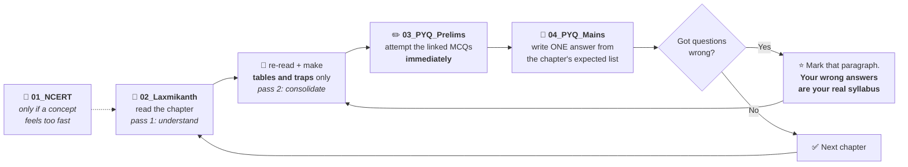

# 🏛️ POLITY — START HERE

**Everything for UPSC Polity, in one place.** This is the front door — open this file first, every time.

---

## 📂 The structure

```
Polity/
├── 00_START_HERE.md      ← you are here
│
├── 01_NCERT/             📗 FOUNDATION      Class 6–12 · 40 notes + 61 PDFs
├── 02_Laxmikanth/        📘 CORE            Part I complete (Ch 1–11) · 19 diagrams
├── 03_PYQ_Prelims/       ✏️ TEST YOURSELF   147 MCQs with answer keys · 2013–2023
└── 04_PYQ_Mains/         📝 TEST YOURSELF   299 descriptive questions · 2000–2026
                             + upsc-polity-pyq.html (browsable version)
```

**The numbering is the reading order.** 01 builds the vocabulary → 02 is the real syllabus → 03 and 04 are how you find out whether any of it stuck.

---

## 🚪 The four doors

| Folder | What's inside | Open it when |
|---|---|---|
| **[01_NCERT](01_NCERT/)** | Class 6–12 Political Science. Chapter notes for Classes 6–10 (in each class's `Notes/` folder), original PDFs for Classes 7–12, plus `READING_GUIDE.txt` with the 10-week plan | You're starting cold, or a Laxmikanth concept moves too fast and you need it explained simply |
| **[02_Laxmikanth](02_Laxmikanth/00_INDEX.md)** ⭐ | **Your primary study material.** Part I complete — 11 chapters with plain-language explanation, real incidents, mermaid diagrams, memory hooks, 43 expected Mains questions with skeletons, 60-second revision blocks. The index also maps **all ~79 chapters** with priority and timeline | Every study session. This is the main track |
| **[03_PYQ_Prelims](03_PYQ_Prelims/00_INDEX.md)** | 147 objective PYQs, 2013–2023, four options + answer keys, answers collapsed for self-testing | After finishing a chapter — always, not "later" |
| **[04_PYQ_Mains](04_PYQ_Mains/00_INDEX.md)** | 299 descriptive PYQs, 2000–2026, one file per year + theme cross-index + repeat chains | To see how a topic is *actually* asked, and for answer-writing practice |

---

## ▶️ If you have 10 minutes right now

1. Open **[02_Laxmikanth/00_INDEX.md](02_Laxmikanth/00_INDEX.md)**
2. Install the Mermaid extension (30 seconds — instructions at the top of that file) so diagrams render
3. Read the **priority table** — it tells you which chapters carry the marks, derived from counting the actual PYQs in folders 03 and 04
4. Start **[Chapter 1](02_Laxmikanth/Part_I_Constitutional_Framework/01_Historical_Background.md)**

---

## 🔁 The loop that actually works



> 🔑 **The step everyone skips is D.** Reading a chapter and moving on *feels* like progress and produces almost none. One chapter done properly with its PYQs beats three chapters read.

---

## 📊 Where things stand

| | Status |
|---|---|
| **NCERT notes** | Classes 6, 7, 8, 9, 10 done. **Classes 11 & 12 notes pending** *(PDFs are there)* |
| **Laxmikanth** | ✅ **Part I complete** — Ch 1–11. **Part II (Ch 12–16) next** |
| **Prelims PYQs** | **2013–2023 done** (147 Qs). 2024–2026 and 2000–2012 pending — blocked on sources, see that folder's index |
| **Mains PYQs** | ✅ **Complete, 2000–2026** (299 Qs). 2026 is a placeholder — Mains 2026 is on 22 Aug 2026 |

**Next three things worth doing, in order:**
1. **Laxmikanth Part II** — Ch 14 (Centre–State) and Ch 16 (Emergency) are among the highest-yield chapters in the whole book
2. **Prelims 2024–2026** — drop the official UPSC PDFs into `03_PYQ_Prelims/` and they can be added properly
3. **NCERT Class 11 & 12 notes** — Class 11 *Indian Constitution at Work* is Tier 1 in your reading guide

---

## ⚠️ Two things to know before you trust anything here

**1. Year labels here differ from coaching handouts — deliberately.** The popular topic-wise PYQ compilations misdate questions in both directions. Eleven confirmed corrections are tabled in [04_PYQ_Mains/00_INDEX.md](04_PYQ_Mains/00_INDEX.md). Everything here is keyed to the **year-wise question papers**, which are the authority.

**2. Anything dated after mid-2024 needs verification** before you write it in an exam — recent judgments, new amendments, and running counts (number of articles, amendments to date). These are flagged with ⚠️ where they appear.

---

## 🗺️ The one connection worth seeing early

Four Laxmikanth chapters tell **one story**, not four:

> **Champakam** (1951) → **1st Amendment** → **Golaknath** (1967) → **24th Amendment** → **Kesavananda** (1973) → **42nd Amendment** → **Minerva Mills** (1980) → **NJAC** (2015)

It runs through Ch 7 (Fundamental Rights), Ch 8 (DPSP), Ch 10 (Amendment) and Ch 11 (Basic Structure). Learn it **once as a narrative** and all four chapters get easier. The rhythm to memorise: **"yes, yes, no, yes, yes-but, unlimited, no."**

Ch 11 has it as a diagram — including the part most notes leave out: the three judges superseded the day after *Kesavananda*, and the 1975 attempt to erase the doctrine that was dissolved after two days.

---

*Reorganised 29 July 2026. Nothing was deleted — the four folders were renamed and moved under `Polity/`, and every internal link was rewritten and verified.*
