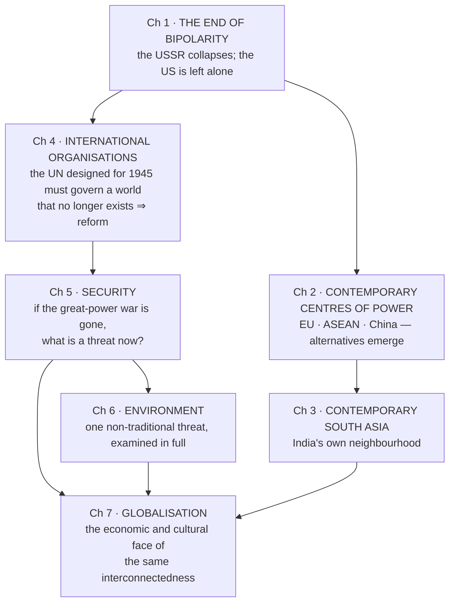

# Class 12 — Contemporary World Politics — Complete Notes

Notes for all **7 chapters** of the current NCERT edition (**Reprint 2026–27**), each written by reading the actual chapter PDF in full.

> **Companion book:** [Politics in India Since Independence](../../Class_12_Politics_in_India_Since_Independence/Notes/00_Index.md) — the domestic counterpart. This book asks **how India acts in the world**; that one asks **how India governs itself**.

---

## ⚠️ File names DO NOT match content — read this first

Every PDF in this folder carries a **legacy name from the pre-rationalisation edition**. The rationalised book **dropped two chapters** — *The Cold War Era* and *US Hegemony in World Politics* — so **every filename is shifted by exactly one** relative to its true content.

| PDF file | What the PDF actually contains |
|---|---|
| `01_The_Cold_War_Era.pdf` | ❌ **Ch 1 — The End of Bipolarity** |
| `02_The_End_of_Bipolarity.pdf` | ❌ **Ch 2 — Contemporary Centres of Power** |
| `03_US_Hegemony_in_World_Politics.pdf` | ❌ **Ch 3 — Contemporary South Asia** |
| `04_Alternative_Centres_of_Power.pdf` | ❌ **Ch 4 — International Organisations** |
| `05_Contemporary_South_Asia.pdf` | ❌ **Ch 5 — Security in the Contemporary World** |
| `06_International_Organisations.pdf` | ❌ **Ch 6 — Environment and Natural Resources** |
| `07_Security_in_the_Contemporary_World.pdf` | ❌ **Ch 7 — Globalisation** |

**The `.md` files in this folder are named by TRUE content.** If you ever open a PDF directly, check the chapter heading on its first page — never trust the filename.

---

## 🎯 Chapter outcomes at a glance

| # | The one thing this chapter exists to teach |
|---|---|
| 1 | The Cold War ended **"not by military means but as a result of mass actions by ordinary men and women"** — the USSR was destroyed by **its own internal weaknesses** |
| 2 | No single power replaced the USSR — the EU, ASEAN and China each became **a different *kind* of power** |
| 3 | South Asia's democratic experience **"expanded the global imagination of democracy"** by disproving that democracy needs prosperity |
| 4 | An international organisation **"is not a super-state… It is created by and responds to states"** — every frustration with the UN follows from that |
| 5 | Security means only threats that would damage core values **"beyond repair"** — the argument is about **whose** values and **which** threats |
| 6 | Environment is politics because it decides **who causes degradation, who pays, who corrects it, and who uses the resources** — i.e. **"who wields how much power"** |
| 7 | Globalisation is **flows** — ideas, capital, commodities, people — producing **"worldwide interconnectedness"**; it is not merely economic and not the same as westernisation |

---

## Chapters

| # | Chapter | One-line theme |
|---|---|---|
| 1 | [The End of Bipolarity](01_The_End_of_Bipolarity.md) | Soviet system and its five causes of collapse; **nationalism strongest in the *prosperous* republics**; **shock therapy** and "the largest garage sale in history"; India–Russia and the **multipolar world order** |
| 2 | [Contemporary Centres of Power](02_Contemporary_Centres_of_Power.md) | The EU as an **economic, political and military** power; ASEAN's method; China's phased reforms; each a different model of rising power |
| 3 | [Contemporary South Asia](03_Contemporary_South_Asia.md) | Seven countries, **"one geo-political space"**; the SDSA survey; Pakistan's four factors; **SAARC and SAFTA**; the **Indus Waters Treaty** surviving every war |
| 4 | [International Organisations](04_International_Organisations.md) | Why states build IOs at all; UN founding chain and **51 founding members**; the **1992 three complaints**; the **veto and why it survives**; India's case and the case against it; **IMF · World Bank · WTO · IAEA** |
| 5 | [Security in the Contemporary World](05_Security_in_the_Contemporary_World.md) | Deterrence · defence · balance of power · alliances; **disarmament vs arms control vs CBMs**; the **referent** question; **"more people killed by their own governments than by foreign armies"**; India's four-part strategy |
| 6 | [Environment and Natural Resources](06_Environment_and_Natural_Resources.md) | Rio 1992 and **Agenda 21**; the **four global commons**; ⭐ **common but differentiated responsibilities**; sacred groves; **resource geopolitics** — timber → oil → water; indigenous peoples and **land** |
| 7 | [Globalisation](07_Globalisation.md) | Four flows ⇒ **worldwide interconnectedness**; the **three** political effects on the state; **"re-colonisation"** vs "inevitable"; **homogenisation *and* heterogenisation**; India's 1991 turn and the **shared-benefits test** |

---

## How the chapters connect (the architecture of the book)

The book has a single narrative spine: **the bipolar world ends → who fills the space → how the world is governed now → what "security", "environment" and "economy" mean once it has.**

---

## ⭐ Threads that run across chapters — this is where the marks are

| Thread | Where it appears |
|---|---|
| **The North–South asymmetry** *(the single biggest thread in the book)* | Security Council composition and the criteria for membership **Ch 4** → who bears the brunt of environmental damage, CBDR, the global commons **Ch 6** → who may cross a border, and "re-colonisation" **Ch 7** |
| **Formal equality vs real power** | UN General Assembly one-vote-each, but the **veto**; IMF **weighted votes**; WTO **unanimity** — all three still dominated **Ch 4** → global commons open in law, reachable only with technology **Ch 6** |
| **The state is not a super-state's subject** | "The UN is a creature of its members" **Ch 4** → "no acknowledged central authority… each country has to be responsible for its own security" **Ch 5** → but the state is **strengthened** by surveillance technology **Ch 7** |
| **Interdependence makes borders "less meaningful"** | Epidemics and refugee flows **Ch 5** → transboundary pollution and shared rivers **Ch 6** → flows of capital, commodities and ideas **Ch 7** |
| **India's consistent negotiating logic** | Non-alignment and a multipolar order **Ch 1** → permanent-seat claim and "development must be central to the UN's agenda" **Ch 4** → non-discriminatory non-proliferation, rejecting the NPT's **1967 cut-off** **Ch 5** → historical responsibility and per-capita emissions **Ch 6** |
| **Resistance is itself globalised** | Indigenous peoples' international networks and the **World Council of Indigenous Peoples, 1975** **Ch 6** → the World Social Forum and Seattle **Ch 7** |
| **Cooperation is possible but hard** | "Recognising the need for cooperation and actually cooperating are two different things" **Ch 4** → confidence building and arms control **Ch 5** → consensus "on the basis of vague scientific evidence" **Ch 6** |

---

## ⭐ The highest-value items in the book (if you revise nothing else)

1. **The UN's founding chain and numbers** — Atlantic Charter → Declaration by United Nations → Tehran → Yalta → San Francisco; **50 signed, 51 founding members**; founded **24 October**; **India joined 30 October 1945**; Council **5 + 10**, expanded **11 → 15 in 1965**, permanent membership **never changed since**.
2. **Why the veto survives** — abolishing it risks the great powers losing interest and acting outside the body: **the League of Nations' fate**.
3. **The three cooperative instruments** — **disarmament** (give up a class: BWC 1972, CWC 1997) · **arms control** (regulate acquisition: ABM 1972, NPT 1968) · **confidence building** (share information). The **NPT's 1967 cut-off** is why India refuses it.
4. **"Secure states do not automatically mean secure peoples"** — plus *"in the last 100 years, more people have been killed by their own governments than by foreign armies."*
5. **Common but Differentiated Responsibilities** — Rio Declaration 1992 and UNFCCC, resting on **two** grounds: unequal historical contribution **and** unequal technological/financial capability.
6. **The four global commons** — atmosphere, Antarctica, ocean floor, outer space (*res communis humanitatis*).
7. **Globalisation's three political effects** — capacity **erodes**, primacy **continues**, capacity is **boosted** by information technology. Say all three.
8. **Homogenisation *and* heterogenisation** — "uniform culture is not a global culture, it is the imposition of Western culture" **and** the **khadi kurta over jeans, exported back to America**.
9. **The asymmetry of flows** — commodities, capital and ideas were liberalised; **people were not** (visa policies).
10. **The shared-benefits test** — *"the ultimate test is not high growth rates as making sure that the benefits of growth are shared so that everyone is better off."*

---

## Suggested revision order

**If you have three sittings:**
1. **Ch 1 → Ch 2 → Ch 3** — the post-Cold-War narrative, ending in India's own region
2. **Ch 4 → Ch 5** — institutions, then what they are supposed to secure
3. **Ch 6 → Ch 7** — the two issue-areas that define present-day global politics

**If you have one sitting:** read the **60-second revision** blocks of all seven chapters in order, then the **threads table** above.

**If you have twenty minutes before an exam:** the ten items in *"The highest-value items in the book"*.

---

## Companion material in this repo

| Where | What |
|---|---|
| [`../../Class_12_Politics_in_India_Since_Independence/Notes/`](../../Class_12_Politics_in_India_Since_Independence/Notes/00_Index.md) | The domestic counterpart — 8 chapters, complete |
| [`../../Class_11_Indian_Constitution_at_Work/Notes/`](../../Class_11_Indian_Constitution_at_Work/Notes/00_Index.md) | Constitutional machinery |
| [`../../../02_Laxmikanth/00_INDEX.md`](../../../02_Laxmikanth/00_INDEX.md) | Laxmikanth notes — the primary Polity source |
| [`../../../03_PYQ_Prelims/00_INDEX.md`](../../../03_PYQ_Prelims/00_INDEX.md) | Prelims PYQs, 2013–2026 |
| [`../../../04_PYQ_Mains/00_INDEX.md`](../../../04_PYQ_Mains/00_INDEX.md) | Mains PYQs, 2000–2026 |

---

*Chapters 1–3 were written earlier; **chapters 4–7 completed 19 August 2026**, each read from the actual PDF in full. All seven chapters of the current edition are now covered.*
