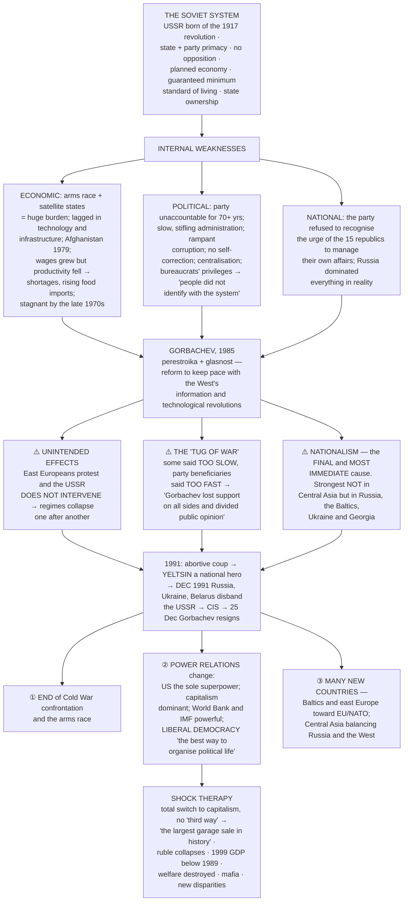
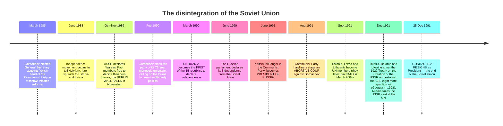

# Chapter 1: The End of Bipolarity

> ⚠️ **Filename note:** in this folder every PDF carries a **legacy name from the pre-rationalisation edition**. `01_The_Cold_War_Era.pdf` actually contains **Chapter 1, "The End of Bipolarity."** See [`00_Index.md`](00_Index.md) for the full mapping.

## 🎯 Chapter Outcome — what you should walk away with

> **The one thing this chapter exists to teach:** the Cold War ended **"not by military means but as a result of mass actions by ordinary men and women"** — and the superpower that lost was destroyed by **its own internal weaknesses**, not by defeat in war.

**After reading it, here is what you now understand:**

1. **What the Soviet system actually was** — the biggest attempt in human history **"to abolish the institution of private property and consciously design a society based on principles of equality"**, giving primacy to **the state and the party**, with **no opposition permitted** and a **planned economy**.
2. **Its genuine achievements and its real failures side by side** — a complex communications network, vast energy resources, a **minimum standard of living guaranteed for all**, subsidised health, education and childcare — against **bureaucratic authoritarianism**, technological backwardness, and consumer shortages.
3. **The five causes of disintegration** — economic stagnation and the burden of the **arms race and satellite states**; **political stagnation** and an unaccountable party; **Gorbachev's reforms setting loose forces nobody could control**; the **"tug of war"** in which he lost support on all sides; and — the immediate cause — **the rise of nationalism and the desire for sovereignty**.
4. **The counter-intuitive fact about that nationalism** — it was strongest **not** in the Central Asian republics, as everyone expected, but **in the more "European" and prosperous parts: Russia, the Baltics, Ukraine and Georgia.**
5. **The three consequences** — the end of Cold War confrontation; a change in **power relations**, making the US the sole superpower and **liberal democracy and capitalism dominant**; and the **emergence of many new countries**.
6. **What shock therapy was and what it did** — total, immediate transition to capitalism with **no "third way"**; **"the largest garage sale in history"**; the ruble's collapse; the **1999 real GDP below the 1989 level**; the destruction of social welfare; and the rise of a **mafia**.
7. **Why democracy fared no better than the economy** — **"the construction of democratic institutions was not given the same attention and priority as the demands of economic transformation"**; constitutions drafted in a hurry with **strong presidents and weak parliaments**.
8. **What India and Russia share** — a vision of **a multipolar world order**, defined in the chapter as **co-existence of several powers, collective security, greater regionalism, negotiated settlements, independent foreign policies, and a strengthened and democratised UN.**

**Self-check — answer these three without looking:**
1. Where was nationalist dissatisfaction strongest in the USSR, and why is that surprising?
2. What does "shock therapy" mean, and name three of its consequences.
3. Give the chapter's definition of a multipolar world order.

**Where this leads:** Ch 2 asks who fills the space left by the USSR — the EU, ASEAN, China — and Ch 4 examines the international organisations that survived it.

---

## 🗺️ The chapter in one picture



---

## The Big Idea

**The Berlin Wall** — built **in 1961** at the height of the Cold War to separate East from West Berlin, **more than 150 kilometres long**, standing for **28 years** — **"was finally broken by the people on 9 November 1989."** This marked **the unification of the two parts of Germany and the beginning of the end of the communist bloc.**

> ⭐ **The sentence that carries the chapter's whole argument:** "One after another, the eight East European countries that were part of the Soviet bloc replaced their communist governments in response to mass demonstrations. **The Soviet Union stood by as the Cold War began to end, not by military means but as a result of mass actions by ordinary men and women.** Eventually the Soviet Union itself disintegrated."

---

## PART 1 — WHAT WAS THE SOVIET SYSTEM?

### Origins and design
- **The USSR came into being after the socialist revolution in Russia in 1917**, inspired by **the ideals of socialism, as opposed to capitalism, and the need for an egalitarian society.**
- **⭐ "This was perhaps the biggest attempt in human history to abolish the institution of private property and consciously design a society based on principles of equality."**
- In doing so, its makers **"gave primacy to the state and the institution of the party."**
- **The political system centred around the communist party, and no other political party or opposition was allowed.** The economy was **planned and controlled by the state.**

### The bloc
After the Second World War, the **east European countries that the Soviet army had liberated from the fascist forces came under the control of the USSR.** Their political and economic systems **were modelled after the USSR.**
- This group was called **the Second World** or the **"socialist bloc"**.
- **The Warsaw Pact, a military alliance, held them together.** The **USSR was the leader of the bloc.**

### ⚖️ The balance sheet — strengths and weaknesses together

| ✅ What the Soviet system had | ❌ What it lacked |
|---|---|
| **The economy was more developed than the rest of the world except for the US** | **Very bureaucratic and authoritarian**, "making life very difficult for its citizens" |
| **A complex communications network** | **Lack of democracy and absence of freedom of speech** — dissent expressed **"in jokes and cartoons"** |
| **Vast energy resources** including oil, iron and steel, and machinery production | **The one-party system had tight control over all institutions and was unaccountable to the people** |
| **A transport sector connecting its remotest areas with efficiency** | **The party refused to recognise the urge of people in the fifteen republics to manage their own affairs, including their cultural affairs** |
| **A domestic consumer industry producing everything "from pins to cars"** — though **quality did not match Western capitalist countries** | **⭐ "Although, on paper, Russia was only one of the fifteen republics… in reality Russia dominated everything, and people from other regions felt neglected and often suppressed"** |
| **A guaranteed minimum standard of living for all citizens**; government subsidised **health, education, childcare and other welfare schemes** | |
| **State ownership was the dominant form** — land and productive assets owned and controlled by the state | |

> 😄 **The joke the chapter prints — and it is not decoration; it is evidence of how dissent survived:** A Communist Party bureaucrat drives to a collective farm to register the potato harvest. *"Comrade farmer, how has the harvest been this year?"* — *"Oh, by the grace of God, we had mountains of potatoes."* — *"But there is no God."* — *"Huh. **And there are no mountains of potatoes either.**"*

### The economic decline
- **In the arms race the Soviet Union managed to match the US from time to time, but at great cost.**
- It **lagged behind the West in technology, in infrastructure (transport, power), and most importantly, in fulfilling the political or economic aspirations of citizens.**
- **⚠️ "The Soviet invasion of Afghanistan in 1979 weakened the system even further."**
- **"Though wages continued to grow, productivity and technology fell considerably behind that of the West."** This led to **shortages in all consumer goods**, and **food imports increased every year.**
- **"The Soviet economy was faltering in the late 1970s and became stagnant."**

---

## PART 2 — GORBACHEV AND THE DISINTEGRATION

### The reforms and why they were needed
**Mikhail Gorbachev became General Secretary of the Communist Party of the Soviet Union in 1985** and **sought to reform this system**. **"Reforms were necessary to keep the USSR abreast of the information and technological revolutions taking place in the West."**

His two policies: ***perestroika* (restructuring)** and ***glasnost* (openness)**.

> ⚠️ **The crucial point about consequences:** "Gorbachev's decision to normalise relations with the West and democratise and reform the Soviet Union had some other effects that **neither he nor anyone else intended or anticipated**."

### The chain reaction
1. **People in the East European countries started to protest against their own governments and Soviet control.**
2. **⭐ "Unlike in the past, the Soviet Union, under Gorbachev, did not intervene when the disturbances occurred, and the communist regimes collapsed one after another."**
3. These developments were accompanied by **"a rapidly escalating crisis within the USSR"**.
4. **Gorbachev's reforms were opposed by leaders within the Communist Party.**
5. **A coup took place in 1991, encouraged by Communist Party hardliners.** But **"the people had tasted freedom by then and did not want the old-style rule of the Communist Party."**
6. **Boris Yeltsin emerged as a national hero in opposing this coup.** The Russian Republic, where Yeltsin had won a popular election, **began to shake off centralised control.**
7. **Power began to shift from the Soviet centre to the republics, especially in the more Europeanised part**, which **saw themselves as sovereign states.**
8. **⚠️ "The Central Asian republics did not ask for independence and wanted to remain with the Soviet Federation."**
9. **In December 1991, under Yeltsin's leadership, Russia, Ukraine and Belarus — three major republics — declared that the Soviet Union was disbanded.** **The Communist Party of the Soviet Union was banned.** **Capitalism and democracy were adopted as the bases for the post-Soviet republics.**

### 📅 Timeline of disintegration



### The CIS and the succession
- **The declaration on disintegration and the formation of the Commonwealth of Independent States came as a surprise to the other republics, especially the Central Asian ones.** **Their exclusion "was an issue that was quickly solved by making them founding members of the CIS."**
- **Russia was accepted as the successor state**: it **inherited the Soviet seat in the UN Security Council**, **accepted all international treaties and commitments of the Soviet Union**, **took over as the only nuclear state of the post-Soviet space**, and **carried out some nuclear disarmament measures with the US.**

### 👤 The leaders of the Soviet Union

| Leader | What to know |
|---|---|
| **Vladimir Lenin (1870–1924)** | Founder of the **Bolshevik Communist party**; leader of the **Russian Revolution of 1917** and founder-head of the USSR **during the most difficult period following the revolution (1917–24)**; a practitioner of Marxism and **"a source of inspiration for communists all over the world"** |
| **Joseph Stalin (1879–1953)** | Successor to Lenin; led the USSR during its **consolidation (1924–53)**; began **rapid industrialisation and forcible collectivisation of agriculture**; credited with **Soviet victory in the Second World War**; **held responsible for the Great Terror of the 1930s**, authoritarian functioning and **elimination of rivals within the party** |
| **Nikita Khrushchev (1894–1971)** | Leader **1953–64**; **denounced Stalin's leadership style** and introduced some reforms in **1956**; suggested **"peaceful coexistence"** with the West; **involved in suppressing popular rebellion in Hungary** and in the **Cuban missile crisis** |
| **Leonid Brezhnev (1906–82)** | Leader **1964–82**; proposed the **Asian Collective Security system**; associated with the **détente** phase; **involved in suppressing a popular rebellion in Czechoslovakia and in invading Afghanistan** |
| **Mikhail Gorbachev (born 1931)** | Last leader, **1985–91**; introduced ***perestroika*** and ***glasnost***; **stopped the arms race with the US**; **withdrew Soviet troops from Afghanistan and eastern Europe**; **helped in the unification of Germany**; **ended the Cold War**; **blamed for the disintegration** |
| **Boris Yeltsin (1931–2007)** | **First elected President of Russia (1991–99)**; rose through the Communist Party and was **made Mayor of Moscow by Gorbachev**; later joined his critics and left the party; **led the protests against the Soviet regime in 1991**; played a key role in dissolving the USSR; **blamed for the hardships suffered by Russians in the transition from communism to capitalism** |

---

## PART 3 — WHY DID THE SOVIET UNION DISINTEGRATE?

> **"How did the second most powerful country in the world suddenly disintegrate? This is a question worth asking not just to understand the Soviet Union and the end of communism but also because *it is not the first and may not be the last political system to collapse*."**

### ① Economic causes
- **"There is no doubt that the internal weaknesses of Soviet political and economic institutions, which failed to meet the aspirations of the people, were responsible for the collapse."**
- **"Economic stagnation for many years led to severe consumer shortages and a large section of Soviet society began to doubt and question the system and to do so openly."**
- **The burden:** the economy **"used much of its resources in maintaining a nuclear and military arsenal and the development of its satellite states in Eastern Europe and within the Soviet system (the five Central Asian Republics in particular). This led to a huge economic burden that the system could not cope with."**
- **⭐ The psychological blow:** ordinary citizens **"became more knowledgeable about the economic advance of the West. They could see the disparities… After years of being told that the Soviet system was better than Western capitalism, the reality of its backwardness came as a political and psychological shock."**

### ② Political and administrative causes
**"The Soviet Union had become stagnant in an administrative and political sense as well."** The Communist Party had ruled **for over 70 years and was not accountable to the people.** Ordinary people were alienated by:
- **slow and stifling administration**
- **rampant corruption**
- **the inability of the system to correct mistakes it had made**
- **the unwillingness to allow more openness in government**
- **the centralisation of authority in a vast land**
- **⚠️ and "worse still, the party bureaucrats gained more privileges than ordinary citizens."**

> **"People did not identify with the system and with the rulers, and the government increasingly lost popular backing."**

### ③ The reforms themselves — the paradox
**"The most basic answer seems to be that when Gorbachev carried out his reforms and loosened the system, he set in motion forces and expectations that few could have predicted and became virtually impossible to control."**

### ④ The "tug of war" — why he satisfied nobody

```
   GORBACHEV CAUGHT BETWEEN TWO CRITICISMS
   ┌────────────────────────────┬────────────────────────────┐
   │  "TOO SLOW"                │  "TOO FAST"                │
   │  Sections of society who    │  Members of the Communist  │
   │  felt he should have moved  │  Party and those served    │
   │  much faster; disappointed  │  by the system, who felt   │
   │  and impatient; they "did   │  "their power and          │
   │  not benefit in the way     │  privileges were eroding"  │
   │  they had hoped, or         │                            │
   │  benefited too slowly"      │                            │
   └────────────────────────────┴────────────────────────────┘
   ⇒ "In this 'tug of war', GORBACHEV LOST SUPPORT ON ALL SIDES
      and divided public opinion. Even those who were with him
      became disillusioned as they felt that HE DID NOT
      ADEQUATELY DEFEND HIS OWN POLICIES."
```

### ⑤ Nationalism — "the final and most immediate cause"

> ⭐⭐ **"The rise of nationalism and the desire for sovereignty within various republics including Russia and the Baltic Republics (Estonia, Latvia and Lithuania), Ukraine, Georgia, and others proved to be the final and most immediate cause for the disintegration of the USSR."**

**The chapter gives two competing interpretations, and a good answer gives both:**
- **View 1:** nationalist urges were **"very much at work throughout the history of the Soviet Union"**, and **"whether or not the reforms had occurred there would have been an internal struggle."** This is **"a 'what-if' of history, but surely it is not an unreasonable view given the size and diversity of the Soviet Union and its growing internal problems."**
- **View 2:** **"Gorbachev's reforms speeded up and increased nationalist dissatisfaction to the point that the government and rulers could not control it."**

**⭐ And the fact that surprised everyone — this is the most examinable single point in the chapter:**
> **"Ironically, during the Cold War many thought that nationalist unrest would be strongest in the Central Asian republics given their ethnic and religious differences with the rest of the Soviet Union and their economic backwardness. However, as things turned out, nationalist dissatisfaction with the Soviet Union was strongest in the more 'European' and prosperous part — in Russia and the Baltic areas as well as Ukraine and Georgia."**

**Why?** Because ordinary people there **"felt alienated from the Central Asians and from each other and concluded also that they were paying too high an economic price to keep the more backward areas within the Soviet Union."**

---

## PART 4 — THE CONSEQUENCES OF DISINTEGRATION

**"Three broad kinds of enduring changes":**

### ① The end of Cold War confrontations
**"The ideological dispute over whether the socialist system would beat the capitalist system was not an issue any more."** Since this dispute **"had engaged the military of the two blocs, had triggered a massive arms race and accumulation of nuclear weapons, and had led to the existence of military blocs, the end of the confrontation demanded an end to this arms race and a possible new peace."**

### ② Changed power relations — and the ideas that came with them

> **"The end of the Cold War left open only two possibilities: either the remaining superpower would dominate and create a *unipolar* system, or different countries or groups of countries could become important players… thereby bringing in a *multipolar* system where no one power could dominate."**

**As it turned out:**
- **The US became the sole superpower.**
- **"Backed by the power and prestige of the US, the capitalist economy was now the dominant economic system internationally."**
- **⭐ "Institutions like the World Bank and International Monetary Fund became powerful advisors to all these countries since they gave them loans for their transitions to capitalism."**
- **"Politically, the notion of liberal democracy emerged as the best way to organise political life."**

### ③ The emergence of many new countries
**"All these countries had their own independent aspirations and choices":**
- **The Baltic and east European states wanted to join the European Union and become part of NATO.**
- **The Central Asian countries wanted to take advantage of their geographical location** and **continue close ties with Russia** while **also establishing ties with the West, the US, China and others.**
- **"Thus, the international system saw many new players emerge, each with its own identity, interests, and economic and political difficulties."**

---

## PART 5 — SHOCK THERAPY IN POST-COMMUNIST REGIMES

### What it was
The collapse of communism was followed **"by a painful process of transition from an authoritarian socialist system to a democratic capitalist system."** The model of transition in **Russia, Central Asia and east Europe**, **influenced by the World Bank and the IMF**, came to be known as **"shock therapy"**. It **"varied in intensity and speed amongst the former second world countries, but its direction and features were quite similar."**

**Its three components:**

| Component | What it required |
|---|---|
| **① Total shift to a capitalist economy** | **"Rooting out completely any structures evolved during the Soviet period."** **Private ownership** was to be the dominant pattern; **privatisation of state assets and corporate ownership patterns immediately brought in**; **collective farms replaced by private farming and capitalism in agriculture.** **⭐ "This transition ruled out any alternate or 'third way', other than state-controlled socialism or capitalism."** |
| **② A drastic change in external orientation** | **Development now envisaged through more trade**, so **"a sudden and complete switch to free trade was considered essential."** **Free trade and foreign direct investment were to be "the main engines of change"**, involving **openness to foreign investment, financial deregulation and currency convertibility** |
| **③ Break-up of existing trade alliances** | Among the countries of the Soviet bloc. **"Each state from this bloc was now linked directly to the West and not to each other in the region"**, to be **gradually absorbed into the Western economic system.** **"The Western capitalist states now became the leaders and thus guided and controlled the development of the region"** |

> 💬 **The margin question the chapter itself asks, and it is the right one:** *"I can see the shock. But where is the therapy? Why do we talk in such euphemisms?"*

### 💥 The consequences of shock therapy

> ⭐ **"The shock therapy administered in the 1990s did not lead the people into the promised utopia of mass consumption. Generally, it brought ruin to the economies and disaster upon the people of the entire region."**

```
   RUSSIA AFTER SHOCK THERAPY
   ═══════════════════════════════════════════════════════════
   INDUSTRY      The large state-controlled industrial complex
                 almost collapsed — about 90% of its industries
                 were put up for sale to private individuals
                 and companies
   ───────────────────────────────────────────────────────────
   THE SALE      Restructuring done through MARKET FORCES, not
                 government-directed industrial policy ⇒ "the
                 virtual disappearance of entire industries".
                 ⭐ Called "THE LARGEST GARAGE SALE IN HISTORY" —
                 valuable industries UNDERVALUED and sold at
                 THROWAWAY PRICES. Citizens got vouchers to
                 take part, but MOST SOLD THEM IN THE BLACK
                 MARKET because they needed the money
   ───────────────────────────────────────────────────────────
   CURRENCY      The RUBLE declined dramatically; inflation so
                 high that PEOPLE LOST ALL THEIR SAVINGS
   ───────────────────────────────────────────────────────────
   FOOD          The collective farm system disintegrated,
                 leaving people without FOOD SECURITY —
                 Russia STARTED TO IMPORT FOOD
   ───────────────────────────────────────────────────────────
   OUTPUT        ⚠️ The real GDP of Russia in 1999 was BELOW
                 what it was in 1989
   ───────────────────────────────────────────────────────────
   WELFARE       The old system of social welfare was
                 systematically destroyed; withdrawal of
                 subsidies pushed large sections INTO POVERTY;
                 the MIDDLE CLASSES pushed to the periphery;
                 academic and intellectual manpower
                 DISINTEGRATED OR MIGRATED
   ───────────────────────────────────────────────────────────
   CRIME         A MAFIA emerged in most of these countries and
                 started controlling many economic activities
   ───────────────────────────────────────────────────────────
   INEQUALITY    Privatisation led to new disparities; post-Soviet
                 states divided between RICH AND POOR REGIONS;
                 "unlike the earlier system, there was now great
                 economic inequality between people"
   ═══════════════════════════════════════════════════════════
```

**The banking illustration the chapter gives:** as a result of shock therapy **"about half of Russia's 1,500 banks and other financial institutions went bankrupt"** — including **Inkombank, Russia's second largest bank, which went bankrupt in 1998**, losing the money of **10,000 corporate and private shareholders** along with customers' deposits.

### ⚠️ Why the democratic transition also failed

> ⭐ **"The construction of democratic institutions was not given the same attention and priority as the demands of economic transformation."**

- **The constitutions of all these countries were drafted in a hurry**, and most — **including Russia** — had **"a strong executive president with the widest possible powers that rendered elected parliaments relatively weak."**
- **In Central Asia the presidents had great powers, and several became very authoritarian.** **The presidents of Turkmenistan and Uzbekistan appointed themselves to power first for ten years and then extended it for another ten years**, allowing **no dissent or opposition**.
- **"A judicial culture and independence of the judiciary was yet to be established in most of these countries."**

### The recovery, and what drove it
**"Most of these economies, especially Russia, started reviving in 2000, ten years after their independence."** The reason was **"the export of natural resources like oil, natural gas and minerals."**
- **Azerbaijan, Kazakhstan, Russia, Turkmenistan and Uzbekistan are major oil and gas producers.**
- **Other countries have gained because of the oil pipelines that cross their territories, for which they get rent.**
- **"Some amount of manufacturing has restarted."**

---

## PART 6 — TENSIONS AND CONFLICTS

> **"Most of the former Soviet Republics are prone to conflicts, and many have had civil wars and insurgencies. Complicating the picture is the growing involvement of outside powers."**

| Where | The conflict |
|---|---|
| **Russia — Chechnya and Dagestan** | **Violent secessionist movements.** **⚠️ "Moscow's method of dealing with the Chechen rebels and indiscriminate military bombings have led to many human rights violations but failed to deter the aspirations for independence"** |
| **Tajikistan** | **A civil war that went on for ten years, till 2001** |
| **Central Asia generally** | **Many sectarian conflicts** |
| **Azerbaijan — Nagorno-Karabakh** | **Some local Armenians want to secede and join Armenia** |
| **Georgia** | **Demand for independence from two provinces, resulting in civil war** |
| **Ukraine, Kyrgyzstan, Georgia** | **Movements against the existing regimes** |
| **Across the region** | **Countries and provinces fighting over river waters** — "all this has led to instability, making life difficult for the ordinary citizen" |
| **Czechoslovakia** | **Split peacefully into two**, the Czechs and Slovaks forming independent countries |
| **⚠️ Yugoslavia — the most severe** | After 1991 it **broke apart**, with **Croatia, Slovenia and Bosnia and Herzegovina declaring independence.** **Ethnic Serbs opposed this, and a massacre of non-Serb Bosnians followed. The NATO intervention and the bombing of Yugoslavia followed the inter-ethnic civil war** |

> 💬 **The margin question worth an essay:** *"What is the difference between nationalism and secessionism? If you succeed, you are celebrated as a nationalist hero, and if you fail you are condemned for crimes of secessionism."*

### 🛢️ Central Asia as a zone of competition
The Central Asian Republics have **vast hydrocarbon resources**, which have brought economic benefit — and made the region **"a zone of competition between outside powers and oil companies."** It is **next to Russia, China, Afghanistan and Pakistan, and close to West Asia.**
- **After 11 September 2001, the US wanted military bases in the region and paid the governments of all Central Asian states to hire bases and to allow airplanes to fly over their territory during the wars in Afghanistan and Iraq.**
- **⚠️ "However, Russia perceives these states as its 'Near Abroad' and believes that they should be under Russian influence."**
- **China has interests here because of the oil resources**, and **"the Chinese have begun to settle around the borders and conduct trade."**

---

## PART 7 — INDIA AND THE POST-COMMUNIST COUNTRIES

**"India has maintained good relations with all the post-communist countries. But the strongest relations are still those between Russia and India."**

> ⭐ **"Indo-Russian relations are embedded in a history of trust and common interests and are matched by popular perceptions."** Indian heroes **from Raj Kapoor to Amitabh Bachchan** are household names in Russia and many post-Soviet countries; **"one can hear Hindi film songs all over the region, and India is part of the popular memory."**

### 🔙 Flashback — India and the USSR during the Cold War
**"India and the USSR enjoyed a special relationship which led critics to say that India was part of the Soviet camp. It was a multi-dimensional relationship":**

| Dimension | What it meant |
|---|---|
| **Economic** | The USSR **assisted India's public sector companies at a time when such assistance was difficult to get** — aid and technical assistance for steel plants at **Bhilai, Bokaro, Visakhapatnam**, and machinery plants like **Bharat Heavy Electricals Ltd.** **⭐ "The Soviet Union accepted Indian currency for trade when India was short of foreign exchange"** |
| **Political** | **Supported India's positions on the Kashmir issue in the UN**; supported India **during its major conflicts, especially the war with Pakistan in 1971.** **"India too supported Soviet foreign policy in some crucial but indirect ways"** |
| **Military** | India **received most of its military hardware from the Soviet Union at a time when few other countries were willing to part with military technologies**; agreements allowed India **to jointly produce military equipment** |
| **Cultural** | **Hindi films and Indian culture were popular in the Soviet Union**; a large number of Indian writers and artists visited the USSR |

**🎬 The Uzbek report the chapter reproduces (BBC, Louise Hidalgo):** seven years after the collapse, the Uzbek passion for Indian films continued — pirate copies on sale in Tashkent within months of release. **Mohammed Sharif Pat**, an Afghan bringing videos from **Peshawar**, says **"at least 70% of the people in Tashkent buy them. We sell about 100 videos a day."** An Indian embassy official notes that **Raj Kapoor** is a household name and that **"almost all my neighbours can sing and play Hindi songs."**

### 🌍 The shared vision of a multipolar world order

> ⭐⭐ **The chapter's definition — reproduce it exactly, it is directly examinable:** a multipolar world order means **"the co-existence of several powers in the international system, collective security (in which an attack on any country is regarded as a threat to all countries and requires a collective response), greater regionalism, negotiated settlements of international conflicts, an independent foreign policy for all countries, and decision making through bodies like the UN that should be strengthened, democratised, and empowered."**

**More than 80 bilateral agreements have been signed between India and Russia as part of the Indo-Russian Strategic Agreement of 2001.**

### What each side gains

| **India benefits from Russia on** | **Russia benefits from India because** |
|---|---|
| **Kashmir** | **India is the second largest arms market for Russia** — "the Indian military gets most of its hardware from Russia" |
| **Energy supplies** — Russia **"has repeatedly come to the assistance of India during its oil crises"**; India imports oil from **Russia, Kazakhstan and Turkmenistan**, with **partnership and investment in oilfields** | |
| **Sharing information on international terrorism** | |
| **Access to Central Asia** | |
| **Balancing its relations with China** | |
| **Nuclear energy plans**, and space — Russia **"assisted India's space industry by giving, for example, the cryogenic rocket when India needed it"**; the two **"have collaborated on various scientific projects"** | |

---

## Key Words (Glossary)

| Term | Meaning |
|---|---|
| **Second World / socialist bloc** | The USSR and the east European countries modelled on it, held together by the **Warsaw Pact** |
| **Warsaw Pact** | The military alliance started by the USSR, binding the socialist bloc |
| ***Perestroika*** | **Restructuring** — Gorbachev's economic reform policy |
| ***Glasnost*** | **Openness** — Gorbachev's political reform policy |
| **CIS** | **Commonwealth of Independent States**, formed December 1991; the Central Asian republics, initially excluded, were **quickly made founding members** |
| **Successor state** | **Russia** — inherited the **UN Security Council seat**, all Soviet treaties and commitments, and sole nuclear status |
| **Shock therapy** | The World Bank/IMF-influenced model of **immediate, total transition to capitalism**, ruling out **"any alternate or 'third way'"** |
| **"The largest garage sale in history"** | The privatisation of about **90% of Russian industry** at **throwaway prices** |
| **Near Abroad** | Russia's term for the Central Asian states, which it believes **should be under Russian influence** |
| **Unipolar vs multipolar** | The two possibilities the end of the Cold War left open — **one dominant superpower**, or **several important players with none able to dominate** |
| **Multipolar world order** | Co-existence of several powers; **collective security**; greater regionalism; negotiated settlements; independent foreign policies; and a **strengthened, democratised and empowered UN** |

---

## Quick Recap (14 points)

1. **The Berlin Wall** — built **1961**, over **150 km**, stood **28 years**, **broken by the people on 9 November 1989** → German unification and the beginning of the end of the communist bloc.
2. **The Cold War ended "not by military means but as a result of mass actions by ordinary men and women."**
3. **The USSR (1917)** was **"perhaps the biggest attempt in human history to abolish the institution of private property"**; primacy to **state and party**; **no opposition**; **planned economy**; **Second World** held together by the **Warsaw Pact**.
4. **Strengths:** more developed than anywhere but the US; complex communications; vast energy; efficient transport; consumer industry **"from pins to cars"**; a **guaranteed minimum standard of living** with subsidised health, education and childcare.
5. **Weaknesses:** bureaucratic and authoritarian; no democracy or free speech (dissent survived in **jokes and cartoons**); a party **unaccountable for 70+ years**; refusal to let the **fifteen republics** manage their own affairs; **Russia dominated everything in reality**.
6. **Economic decline:** matched the US in the arms race **"but at great cost"**; lagged in technology and infrastructure; **Afghanistan 1979 weakened it further**; **wages grew while productivity fell** → shortages and rising food imports; **stagnant from the late 1970s**.
7. **Gorbachev (1985)** — ***perestroika*** and ***glasnost*** — reforms needed **to keep pace with the West's information and technological revolutions**; effects **"neither he nor anyone else intended or anticipated."**
8. **The chain:** East Europeans protest → **the USSR does not intervene** → regimes collapse one after another → crisis inside the USSR → **1991 hardliners' coup** → **Yeltsin a national hero** → power shifts to the republics → **December 1991: Russia, Ukraine and Belarus disband the USSR**; the party banned; **capitalism and democracy adopted**.
9. **Timeline:** Lithuania's movement **June 1988**; Warsaw Pact freed and **Berlin Wall falls 1989**; monopoly on power ended **February 1990**; **Lithuania first to declare independence, March 1990**; Yeltsin President **June 1991**; **coup August 1991**; **CIS December 1991**; **Gorbachev resigns 25 December 1991**.
10. **Five causes of collapse:** economic stagnation plus the **burden of the arsenal and satellite states**; the **psychological shock** of learning the West was ahead; **political stagnation, corruption and party privilege**; **reforms setting loose uncontrollable forces** and the **"tug of war"** in which Gorbachev **lost support on all sides**; and **nationalism as the final and most immediate cause.**
11. **⭐ The surprise:** nationalist dissatisfaction was strongest **not in Central Asia** but **in Russia, the Baltics, Ukraine and Georgia** — where people felt they were **"paying too high an economic price to keep the more backward areas within the Soviet Union."**
12. **Three consequences:** end of Cold War confrontation and the arms race; **the US as sole superpower**, capitalism dominant, **World Bank and IMF as powerful advisors**, **liberal democracy** as the accepted political form; and **many new countries** with their own aspirations.
13. **Shock therapy:** total capitalist transition with **no third way**; free trade, FDI, deregulation, convertibility; break-up of intra-bloc trade. **Results:** ~90% of Russian industry sold — **"the largest garage sale in history"**; vouchers sold in the **black market**; ruble collapse and lost savings; **collective farms gone and food imported**; **1999 GDP below 1989**; welfare destroyed; **mafia**; new inequality; **half of Russia's 1,500 banks bankrupt**. **Democracy was neglected** — hurried constitutions, **strong presidents and weak parliaments**, self-extending presidents in **Turkmenistan and Uzbekistan**. **Revival from 2000, driven by oil, gas and minerals.**
14. **India–Russia:** a Cold War relationship across **economic (Bhilai, Bokaro, Visakhapatnam, BHEL; rupee trade), political (Kashmir at the UN; 1971), military and cultural** dimensions; today **80+ agreements** under the **Indo-Russian Strategic Agreement of 2001**; a shared vision of a **multipolar world order**; India gains on **Kashmir, energy, terrorism, Central Asia, balancing China, nuclear and space (the cryogenic rocket)**, and Russia gains because **India is its second largest arms market.**

---

## 60-Second Revision

**BERLIN WALL: built 1961, >150 KM, stood 28 YEARS, broken 9 NOV 1989 → German unification. Cold War ended "NOT BY MILITARY MEANS BUT AS A RESULT OF MASS ACTIONS BY ORDINARY MEN AND WOMEN."** **USSR 1917: "the biggest attempt in human history to ABOLISH THE INSTITUTION OF PRIVATE PROPERTY"; primacy to STATE + PARTY; no opposition; planned economy; SECOND WORLD/socialist bloc held by the WARSAW PACT.** **STRENGTHS: 2nd most developed after the US; complex communications; vast energy (oil, iron, steel); efficient transport to remotest areas; consumer industry "FROM PINS TO CARS" (quality below the West); MINIMUM STANDARD OF LIVING GUARANTEED; subsidised health, education, childcare; state ownership dominant. WEAKNESSES: bureaucratic + authoritarian; no democracy or free speech (dissent in JOKES AND CARTOONS); party unaccountable for 70+ years; refused to let the 15 REPUBLICS manage their own affairs; on paper Russia was one of 15, IN REALITY RUSSIA DOMINATED EVERYTHING.** **DECLINE: matched the US in the arms race "BUT AT GREAT COST"; lagged in technology + infrastructure; AFGHANISTAN 1979 weakened it further; WAGES GREW BUT PRODUCTIVITY FELL → shortages in all consumer goods, FOOD IMPORTS ROSE EVERY YEAR; stagnant from the late 1970s.** **GORBACHEV 1985: PERESTROIKA (restructuring) + GLASNOST (openness), to keep pace with the West's information and technological revolutions. Effects "NEITHER HE NOR ANYONE ELSE INTENDED OR ANTICIPATED."** **CHAIN: East Europeans protest → USSR DOES NOT INTERVENE → regimes collapse one after another → 1991 HARDLINERS' COUP → YELTSIN national hero → power shifts to republics (Central Asians did NOT ask for independence) → DEC 1991 RUSSIA + UKRAINE + BELARUS disband the USSR; CPSU BANNED; capitalism + democracy adopted.** **TIMELINE: Mar 1985 Gorbachev GS · Jun 1988 LITHUANIA movement · Oct 1989 Warsaw Pact members freed, NOV Berlin Wall falls · Feb 1990 72-year monopoly ended via the DUMA · Mar 1990 LITHUANIA FIRST to declare independence · Jun 1990 Russian parliament declares independence · Jun 1991 YELTSIN President · Aug 1991 ABORTIVE COUP · Sep 1991 Baltics join the UN (NATO in MARCH 2004) · Dec 1991 CIS annuls the 1922 Treaty; Georgia joins 1993; Russia takes the UN seat · 25 DEC 1991 GORBACHEV RESIGNS.** **SUCCESSOR STATE = RUSSIA: UNSC seat, all treaties and commitments, ONLY nuclear state of the post-Soviet space, disarmament measures with the US.** **WHY IT COLLAPSED: (1) ECONOMIC — resources drained by the NUCLEAR/MILITARY ARSENAL + development of SATELLITE STATES (esp. the five Central Asian republics); stagnation → consumer shortages → open questioning; and the PSYCHOLOGICAL SHOCK of discovering Western advance after years of being told the Soviet system was better. (2) POLITICAL — party unaccountable; slow stifling administration; RAMPANT CORRUPTION; inability to self-correct; no openness; centralisation; PARTY BUREAUCRATS' PRIVILEGES → "people did not identify with the system". (3) THE REFORMS THEMSELVES — loosening the system "set in motion forces and expectations that few could have predicted and became VIRTUALLY IMPOSSIBLE TO CONTROL". (4) THE 'TUG OF WAR' — some said TOO SLOW, party beneficiaries said TOO FAST → "GORBACHEV LOST SUPPORT ON ALL SIDES"; even supporters felt "he did not adequately defend his own policies". (5) ⭐ NATIONALISM = "THE FINAL AND MOST IMMEDIATE CAUSE" — two views: it was always there vs. the reforms accelerated it.** **⭐⭐ THE IRONY: everyone expected unrest in CENTRAL ASIA (ethnic/religious difference + backwardness). In fact it was strongest in the MORE "EUROPEAN" AND PROSPEROUS parts — RUSSIA, the BALTICS, UKRAINE, GEORGIA — who felt they were "PAYING TOO HIGH AN ECONOMIC PRICE to keep the more backward areas within the Soviet Union."** **THREE CONSEQUENCES: ① end of Cold War confrontation + the arms race ② POWER RELATIONS — either UNIPOLAR or MULTIPOLAR was possible; the US became the SOLE SUPERPOWER; capitalism dominant; WORLD BANK + IMF "powerful advisors" because they gave transition loans; LIBERAL DEMOCRACY "the best way to organise political life" ③ MANY NEW COUNTRIES — Baltics/east Europe toward EU + NATO; Central Asians balancing Russia with the West, US and China.** **SHOCK THERAPY (World Bank + IMF model): total capitalist shift, PRIVATE OWNERSHIP dominant, immediate privatisation, collective farms → private farming, ⭐ "RULED OUT ANY ALTERNATE OR 'THIRD WAY'"; external reorientation — free trade, FDI, deregulation, CURRENCY CONVERTIBILITY; break-up of intra-bloc trade so each state linked DIRECTLY TO THE WEST.** **CONSEQUENCES: ~90% of Russian industry sold = "THE LARGEST GARAGE SALE IN HISTORY", undervalued at throwaway prices; vouchers SOLD IN THE BLACK MARKET; RUBLE collapsed, savings wiped out by inflation; collective farms disintegrated → NO FOOD SECURITY, Russia IMPORTED FOOD; ⚠️ REAL GDP IN 1999 BELOW 1989; welfare destroyed, subsidies withdrawn → poverty; middle classes to the periphery; intellectuals migrated; MAFIA controlled economic activity; rich/poor REGIONS; HALF of Russia's 1,500 BANKS bankrupt (INKOMBANK, 2nd largest, 1998, 10,000 shareholders).** **DEMOCRACY NEGLECTED: "not given the same attention and priority as the demands of economic transformation"; constitutions drafted IN A HURRY; STRONG EXECUTIVE PRESIDENTS, WEAK PARLIAMENTS; TURKMENISTAN + UZBEKISTAN presidents gave themselves 10 years then 10 more, no dissent; judicial independence not yet established. REVIVAL FROM 2000 via OIL, GAS, MINERALS (Azerbaijan, Kazakhstan, Russia, Turkmenistan, Uzbekistan) + PIPELINE RENT.** **CONFLICTS: CHECHNYA + DAGESTAN (indiscriminate bombing → human rights violations but "failed to deter the aspirations"); TAJIKISTAN civil war TEN YEARS to 2001; NAGORNO-KARABAKH (Armenians in Azerbaijan); GEORGIA two provinces; movements in Ukraine, Kyrgyzstan, Georgia; RIVER WATER disputes. CZECHOSLOVAKIA split PEACEFULLY. ⚠️ WORST = YUGOSLAVIA: Croatia, Slovenia, Bosnia-Herzegovina declare independence → Serbs oppose → MASSACRE OF NON-SERB BOSNIANS → NATO intervention and bombing.** **CENTRAL ASIA: vast hydrocarbons; a "ZONE OF COMPETITION"; after 11 SEPT 2001 the US PAID for bases and overflight for Afghanistan and Iraq; RUSSIA calls them its "NEAR ABROAD"; CHINA wants oil and its people settle near the borders to trade.** **INDIA–USSR (Cold War): ECONOMIC — public sector aid when unavailable elsewhere: BHILAI, BOKARO, VISAKHAPATNAM steel, BHEL; ⭐ ACCEPTED INDIAN CURRENCY when India lacked forex. POLITICAL — backed India on KASHMIR at the UN and in 1971. MILITARY — most hardware + JOINT PRODUCTION agreements. CULTURAL — Hindi films; Raj Kapoor to Amitabh Bachchan household names; BBC report from TASHKENT: "at least 70% of the people… buy them", 100 videos a day.** **TODAY: 80+ agreements under the INDO-RUSSIAN STRATEGIC AGREEMENT 2001. ⭐ MULTIPOLAR WORLD ORDER = co-existence of several powers + COLLECTIVE SECURITY (an attack on any country is a threat to all, requiring a collective response) + greater REGIONALISM + NEGOTIATED SETTLEMENTS + INDEPENDENT FOREIGN POLICY for all + decisions through a UN that is STRENGTHENED, DEMOCRATISED AND EMPOWERED. INDIA GAINS: Kashmir, energy, terrorism intelligence, access to Central Asia, balancing China, nuclear energy, SPACE — the CRYOGENIC ROCKET. RUSSIA GAINS: India is its SECOND LARGEST ARMS MARKET.**

---

## NCERT Exercises — with answers

**1. Which statement about the Soviet economy is wrong?**
**(c) People enjoyed economic freedom.** They did not: the economy was **planned and controlled by the state**, **state ownership was the dominant form**, and land and productive assets were **owned and controlled by the Soviet state**. (a), (b) and (d) are all accurate.

**2. Arrange in chronological order.**
**(d) Russian Revolution — 1917** → **(a) Soviet invasion of Afghanistan — 1979** → **(b) Fall of the Berlin Wall — 9 November 1989** → **(c) Disintegration of the Soviet Union — December 1991.**

**3. Which is NOT an outcome of the disintegration of the USSR?**
**(d) Crises in the Middle East.** The three genuine outcomes the chapter names are the **end of the ideological war**, changed **power relations in the world order**, and the emergence of new countries including the **CIS**. Crises in the Middle East have their own, older causes.

**4. Match the following.**

| | |
|---|---|
| i. **Mikhail Gorbachev** | **c. Introduced reforms** |
| ii. **Shock Therapy** | **d. Economic model** |
| iii. **Russia** | **a. Successor of USSR** |
| iv. **Boris Yeltsin** | **e. President of Russia** |
| v. **Warsaw** | **b. Military pact** |

**5. Fill in the blanks.**
**(a) socialist** (communist) ideology · **(b) The Warsaw Pact** · **(c) The Communist Party of the Soviet Union** · **(d) Mikhail Gorbachev** · **(e) Berlin Wall**

**6. Three features distinguishing the Soviet economy from a capitalist one like the US.**
1. **Ownership.** In the USSR **state ownership was the dominant form** — "land and productive assets were owned and controlled by the Soviet state" — whereas in a capitalist economy **private ownership** predominates.
2. **Planning versus the market.** The Soviet economy was **"planned and controlled by the state"**; a capitalist economy allocates resources through **market forces and private investment decisions**.
3. **Guaranteed minimum welfare.** **"The Soviet state ensured a minimum standard of living for all citizens, and the government subsidised basic necessities including health, education, childcare and other welfare schemes"** — a guarantee capitalist economies do not make as a matter of system design.
*(A fourth, if needed: the absence of competition meant **consumer goods were available but of lower quality**, "though their quality did not match that of the Western capitalist countries".)*

**7. The factors that forced Gorbachev to initiate reforms.**
1. **Technological backwardness.** Reforms were **"necessary to keep the USSR abreast of the information and technological revolutions taking place in the West"** — the Soviet Union had fallen behind in technology and infrastructure.
2. **Economic stagnation.** The economy **"was faltering in the late 1970s and became stagnant"**; productivity fell while wages grew, producing **shortages in all consumer goods** and **rising food imports every year**.
3. **The unsustainable burden of empire and arms.** Resources went into **maintaining a nuclear and military arsenal** and **developing satellite states in Eastern Europe and the Central Asian republics** — "a huge economic burden that the system could not cope with." The **invasion of Afghanistan in 1979 weakened the system even further.**
4. **Political stagnation and lost legitimacy.** A party **unaccountable for over 70 years**, **rampant corruption**, an inability to correct its own mistakes, **centralisation**, and **bureaucrats with more privileges than ordinary citizens** — so **"people did not identify with the system and with the rulers, and the government increasingly lost popular backing."**
5. **Popular awareness.** Citizens **"became more knowledgeable about the economic advance of the West"** and could see the disparities, so the system's claims no longer persuaded them.

**8. Major consequences of the disintegration of the Soviet Union for countries like India.**
1. **The loss of a reliable strategic patron.** India lost the state that had **backed it on Kashmir at the UN**, **supported it in 1971**, supplied **most of its military hardware** when others would not, and **accepted rupee payment** when India lacked foreign exchange.
2. **A changed international structure.** With the **US as sole superpower** and **capitalism the dominant economic system**, India — like other developing countries — had to deal with **the World Bank and IMF as "powerful advisors"**. India's own **new economic policy of 1991** belongs to this moment.
3. **The weakening of non-alignment's original logic.** With one bloc gone, non-alignment had to be **reinterpreted as strategic autonomy** rather than balancing between two camps.
4. **New partners and new opportunities.** The emergence of **many new countries** opened relations with the **Central Asian republics** — energy, oilfield investment, and a strategic interest in access to the region.
5. **A continuing, redefined relationship with Russia.** India kept its strongest ties with Russia — **80+ agreements under the 2001 Strategic Agreement** — around a **shared vision of a multipolar world order**, energy, arms, nuclear power and space cooperation.

**9. What was shock therapy? Was it the best way to make the transition?**
**What it was:** the World Bank- and IMF-influenced model of transition in Russia, Central Asia and east Europe — an **immediate and total shift to capitalism**, requiring **private ownership as the dominant pattern**, **instant privatisation of state assets**, **private farming in place of collective farms**, a **sudden and complete switch to free trade** with **FDI, deregulation and currency convertibility**, and the **break-up of intra-bloc trade** so each state linked directly to the West. Crucially, it **"ruled out any alternate or 'third way'."**
**Was it the best way? No — and the chapter's own verdict is unambiguous:** it **"did not lead the people into the promised utopia of mass consumption. Generally, it brought ruin to the economies and disaster upon the people of the entire region."**
**The evidence against it:** about **90% of Russian industry sold off** in **"the largest garage sale in history"**, valuable assets **undervalued and sold at throwaway prices**; ordinary citizens' **vouchers sold in the black market** because they needed cash; the **ruble collapsed** and **inflation wiped out savings**; the **collective farm system disintegrated**, leaving **no food security** and forcing **food imports**; **real GDP in 1999 was below 1989**; the **welfare system was systematically destroyed**, pushing large sections **into poverty** and the middle classes **to the periphery**; a **mafia** took over economic activity; and **half of Russia's 1,500 banks went bankrupt.**
**And the deeper failure:** **"the construction of democratic institutions was not given the same attention and priority as the demands of economic transformation"** — producing hurried constitutions, **strong presidents and weak parliaments**, and outright authoritarianism in Turkmenistan and Uzbekistan.
**What would have been better:** a **gradual, sequenced transition** that built market institutions — property law, courts, regulation, a functioning banking system — *before* mass privatisation; that **retained a social safety net** during the adjustment; and that treated **democratic institution-building as equally urgent**. The recovery that did come after **2000** owed less to shock therapy than to **exports of oil, gas and minerals** — which suggests the therapy was not what cured the patient.

**10. Essay for or against: "With the disintegration of the second world, India should change its foreign policy and focus more on friendship with the US rather than with traditional friends like Russia."**
**The case FOR shifting toward the US.** The structural argument is strong: the disintegration left the **US as the sole superpower**, backed by the dominant economic system and by institutions like the **World Bank and IMF**. Russia, though "an important friend", **lost its global pre-eminence**; a foreign policy **"always dictated by ideas of national interest"** should follow power. The contemporary international situation is **more influenced by economic interests than military ones**, and the US offers the larger market, the deeper capital pool and the advanced technology India needs. India's own economic reforms of 1991 pointed the same way.
**The case AGAINST abandoning Russia — which is the stronger case.** First, **the relationship delivers what the US has not offered on the same terms**: Russia supplies **most of India's military hardware**, has **repeatedly come to India's assistance during oil crises**, is central to India's **nuclear energy plans**, and **gave the cryogenic rocket when India needed it** — precisely the technology the US had blocked. Second, it rests on **"a history of trust and common interests… matched by popular perceptions"**, tested in **1971** and on **Kashmir at the UN**. Third, the two share a **vision of a multipolar world order** — collective security, regionalism, negotiated settlements, **an independent foreign policy for all countries**, and a **strengthened and democratised UN** — which serves India better than a unipolar order in which India is a junior partner. Fourth, Russia is India's route to **Central Asia** and its counterweight in **balancing China.**
**The position I would take.** The choice is a false one. Non-alignment was never neutrality, and its successor — **strategic autonomy** — means **adding partners rather than exchanging them**. India should deepen ties with the US in trade, technology and counter-terrorism while **retaining Russia** for defence, energy, nuclear and space cooperation, precisely because **dependence on any single power is what non-alignment existed to prevent.** A country that swaps one patron for another has changed its address, not its condition.

---

## Extra UPSC-style questions

1. *"The Soviet Union was defeated by its own citizens' knowledge, not by its rivals' weapons."* Examine. **(250 words)**
2. Why was nationalist dissatisfaction strongest in the prosperous "European" republics rather than in Central Asia? What does this suggest about the relationship between economic development and separatism?
3. Evaluate shock therapy as a model of economic transition, with reference to sequencing and institution-building.
4. "The end of the Cold War left open two possibilities — unipolarity or multipolarity." Assess which the world actually got, and where India stands on the question.
5. **Prelims trap check:** Which is/are correct? (i) Lithuania was the first Soviet republic to declare independence. (ii) The Central Asian republics led the demand for the dissolution of the USSR. (iii) Russia inherited the Soviet seat in the UN Security Council. → **(i) and (iii) only.** *(The Central Asian republics **did not ask for independence** and wanted to remain in the Soviet Federation.)*

---

*Source: written by reading `01_The_Cold_War_Era.pdf` in full — which in the current NCERT edition (Reprint 2026–27) actually contains **Chapter 1, The End of Bipolarity**. Covers the overview and Berlin Wall notes, the full account of the Soviet system, all six "Leaders of the Soviet Union" profiles, the potato-harvest joke, the complete timeline of disintegration, the shock therapy sections, the tensions and conflicts survey, the "Flashback: India and the USSR" box, the BBC Uzbekistan report, the multipolar-world definition, all margin questions and all ten exercises.*
