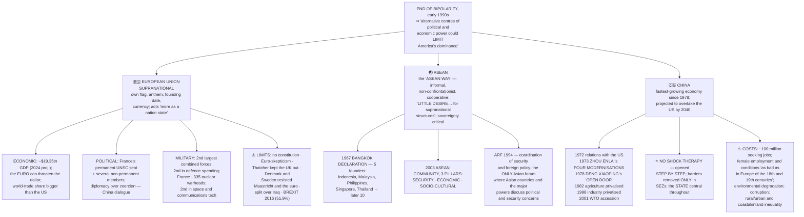
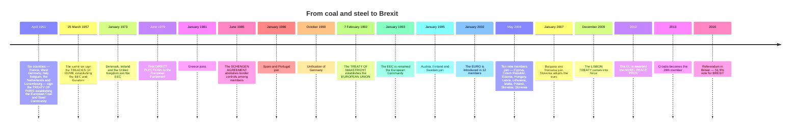
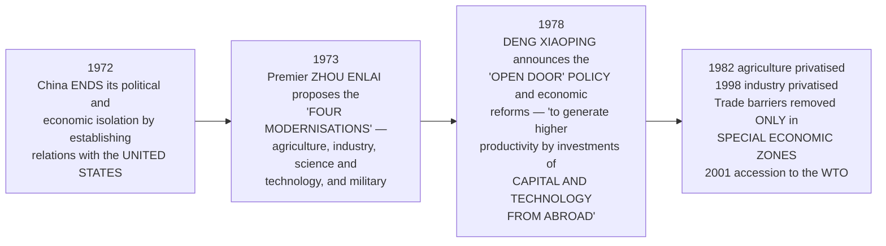
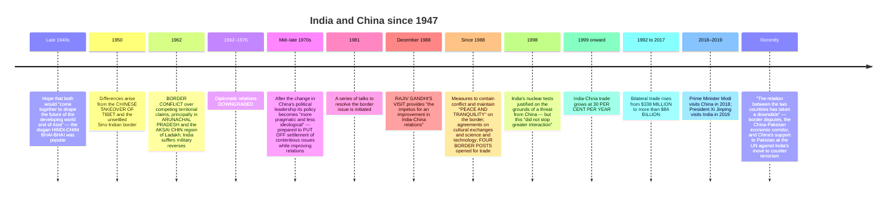

# Chapter 2: Contemporary Centres of Power

> ⚠️ **Filename note:** `02_The_End_of_Bipolarity.pdf` actually contains **Chapter 2, "Contemporary Centres of Power."** See [`00_Index.md`](00_Index.md).

## 🎯 Chapter Outcome — what you should walk away with

> **The one thing this chapter exists to teach:** after bipolarity ended, **"alternative centres of political and economic power could limit America's dominance"** — and both the EU and ASEAN got there by **evolving regional solutions to their own historical enmities and weaknesses.**

**After reading it, here is what you now understand:**

1. **The "Question of Europe"** — should Europe **"revert to its old rivalries"** or be reconstructed on principles and institutions contributing to **"a positive conception of international relations"**? And the paradox: **European integration after 1945 was *aided by the Cold War*** — the **Marshall Plan**, the **OEEC (1948)** and **NATO**.
2. **The EU's four kinds of influence** — economic (GDP projected at about **$19.35 trillion in 2024**; the **euro** as a threat to the dollar), political and diplomatic (**France's permanent UNSC seat** plus several non-permanent members), military (**second largest combined armed forces**, second in defence spending, **France's ~335 warheads**), and technological (**world's second most important source of space and communications technology**).
3. **Its real limits** — no constitution; **"Euro-skepticism"**; **Thatcher kept the UK out of the European Market**; **Denmark and Sweden resisted Maastricht and the euro**; and members split over Iraq — **Blair with the US, Germany and France against**.
4. **The "ASEAN Way"** — **informal, non-confrontationist and cooperative**, with **respect for national sovereignty critical to its functioning**, and **"little desire in ASEAN for supranational structures"** — the exact opposite of the EU.
5. **The three pillars of the ASEAN Community (2003)** — **Security, Economic, and Socio-Cultural** — plus the **ARF (1994)** for security and foreign-policy coordination.
6. **Why China's transition worked where Russia's failed** — **China did not go for shock therapy.** It **opened step by step**: relations with the US in **1972**, Zhou Enlai's **"four modernisations" (1973)**, Deng Xiaoping's **"open door" policy (1978)**, **privatisation of agriculture in 1982**, **of industry in 1998**, trade barriers removed **only in SEZs**, and throughout, **"the state played and continues to play a central role in setting up a market economy."**
7. **The costs China has paid** — nearly **100 million** looking for jobs; female employment and working conditions **"as bad as in Europe of the eighteenth and nineteenth centuries"**; environmental degradation; corruption; and inequality **rural vs urban, coastal vs inland**.
8. **The arc of India–China relations** — Tibet 1950 → the **1962 conflict over Arunachal Pradesh and Aksai Chin** → relations **downgraded until 1976** → talks from **1981** → **Rajiv Gandhi's 1988 visit** as the impetus → trade from **$338 million (1992) to over $84 billion (2017)** → and the recent **downslide** over border disputes, CPEC and China's UN support to Pakistan.

**Self-check — answer these three without looking:**
1. What is the "ASEAN Way", and how does it differ from the EU's approach?
2. Name the four steps of China's opening, with years.
3. Give three limits on the EU's ability to act as a single power.

**Where this leads:** Ch 3 turns to **South Asia** and asks why SAARC has not achieved what ASEAN did; Ch 4 examines the UN and the demand to reform it.

---

## 🗺️ The chapter in one picture



---

## PART 1 — THE EUROPEAN UNION

### The "Question of Europe"
As the Second World War ended, Europe's leaders grappled with it: **"Should Europe be allowed to revert to its old rivalries or be reconstructed on principles and institutions that would contribute to a positive conception of international relations?"**

**"The Second World War shattered many of the assumptions and structures on which the European states had based their relations."** In 1945 they confronted **"the ruin of their economies and the destruction of the assumptions and structures on which Europe had been founded."**

### ⭐ The paradox: integration was *aided by the Cold War*

| Step | What it did |
|---|---|
| **The Marshall Plan** | **"America extended massive financial help for reviving Europe's economy"** |
| **NATO** | The US **"created a new collective security structure"** |
| **OEEC, 1948** | The **Organisation for European Economic Cooperation**, established under the Marshall Plan **"to channel aid to the west European states"**. It became **"a forum where the western European states began to cooperate on trade and economic issues"** |
| **Council of Europe, 1949** | **"Another step forward in political cooperation"** |
| **EEC, 1957** | Economic integration proceeded **step by step**, leading to the **European Economic Community** |
| **European Parliament** | Gave the process **a political dimension** |
| **EU, 1992** | **"The collapse of the Soviet bloc put Europe on a fast track"** → the European Union, laying the foundation for **a common foreign and security policy, cooperation on justice and home affairs, and the creation of a single currency** |

### 📅 Timeline of European integration



**🏳️ The EU flag:** the circle of gold stars stands for **solidarity and harmony between the peoples of Europe**, with **twelve stars**, since twelve **"is traditionally the symbol of perfection, completeness and unity."**

**🛂 Schengen:** under the agreement, **"you have to get a visa from just one of the EU countries and that allows you entry in most of the other European Union countries."**

### The EU as a would-be state
**"The European Union has evolved over time from an economic union to an increasingly political one. The EU has started to act more as a nation state."** **While attempts to have a Constitution for the EU have failed, it has its own flag, anthem, founding date, and currency**, and **some form of a common foreign and security policy.**

**⚠️ But expansion has been difficult:** **"people in many countries are not very enthusiastic in giving the EU powers that were exercised by the government of their country. There are also reservations about including some new countries within the EU."**

### 💪 The four kinds of EU influence

| Kind | The evidence |
|---|---|
| **Economic** | **GDP projected at approximately $19.35 trillion in 2024.** **"Its currency, the euro, can pose a threat to the dominance of the US dollar."** Its **share of world trade is much larger than that of the United States**, allowing it to be **"more assertive in trade disputes with the US and China."** Economic power gives it influence over **its closest neighbours as well as in Asia and Africa**, and it functions as **an important bloc in the WTO** |
| **Political and diplomatic** | **One member, France, holds a permanent seat on the UN Security Council**, and the EU **"includes several non-permanent members of the UNSC."** This **"has enabled the EU to influence some US policies such as the current US position on Iran's nuclear programme."** **⭐ Its method matters:** "its use of **diplomacy, economic investments, and negotiations rather than coercion and military force** has been effective as in the case of its **dialogue with China on human rights and environmental degradation**" |
| **Military** | **"The EU's combined armed forces are the second largest in the world."** Its **total spending on defence is second after the US.** **France has nuclear arsenals of approximately 335 nuclear warheads** |
| **Technological** | **"The world's second most important source of space and communications technology"** |

### ⚠️ The limits — do not present the EU as a unified power

> **"As a supranational organisation, the EU is able to intervene in economic, political and social areas. *But in many areas its member states have their own foreign relations and defence policies that are often at odds with each other.*"**

**The evidence the chapter gives:**
- **Britain's Prime Minister Tony Blair was America's partner in the Iraq invasion**, and **many of the EU's newer members made up the US-led "coalition of the willing"** — **whereas Germany and France opposed American policy.**
- **"There is also a deep-seated 'Euro-skepticism' in some parts of Europe about the EU's integrationist agenda."**
- **Margaret Thatcher kept the UK out of the European Market.**
- **Denmark and Sweden have resisted the Maastricht Treaty and the adoption of the euro.**
- **"This limits the ability of the EU to act in matters of foreign relations and defence."**

**🎨 The cartoon (Ares, 2003):** published when **the EU's initiative to draft a common constitution failed**, using **the image of the ship *Titanic*** to represent the EU — a large, confident vessel undone by something it did not see coming.

---

## PART 2 — ASEAN

### Why Southeast Asia needed something new
**Before and during the Second World War the region "suffered the economic and political consequences of repeated colonialisms, both European and Japanese."** At the end of the war it confronted:
- **problems of nation-building**
- **the ravages of poverty and economic backwardness**
- **"the pressure to align with one great power or another during the Cold War"**

**⭐ "This was a recipe for conflict, which the countries of Southeast Asia could ill afford."** And crucially: **"Efforts at Asian and Third World unity, such as the Bandung Conference and the Non-Aligned Movement, were ineffective in establishing the conventions for informal cooperation and interaction."** Hence a **Southeast Asian alternative** was needed.

### Founding and growth
- **Established in 1967** by **five countries — Indonesia, Malaysia, the Philippines, Singapore and Thailand** — by signing the **Bangkok Declaration**.
- **The objectives were primarily to accelerate economic growth and through that "social progress and cultural development."** A **secondary objective was to promote regional peace and stability based on the rule of law and the principles of the United Nations Charter.**
- Over the years **Brunei Darussalam, Vietnam, Lao PDR, Myanmar (Burma) and Cambodia** joined, **"taking its strength to ten."**

**🏳️ The ASEAN flag:** the **ten stalks of paddy (rice)** represent the ten Southeast Asian countries **"bound together in friendship and solidarity"**; the **circle symbolises the unity of ASEAN.**

### ⭐⭐ The "ASEAN Way" — the contrast with the EU

> **"Unlike the EU there is little desire in ASEAN for supranational structures and institutions. ASEAN countries have celebrated what has become known as the 'ASEAN Way', a form of interaction that is *informal, non-confrontationist and cooperative*. The respect for national sovereignty is critical to the functioning of ASEAN."**

```
   TWO MODELS OF REGIONALISM
   ┌─────────────────────────────┬─────────────────────────────┐
   │  EUROPEAN UNION             │  ASEAN                      │
   ├─────────────────────────────┼─────────────────────────────┤
   │  SUPRANATIONAL — members    │  SOVEREIGNTY-RESPECTING —   │
   │  cede powers to the union   │  "little desire… for        │
   │                             │  supranational structures"  │
   │  Formal treaties, a         │  INFORMAL, NON-CONFRONTA-   │
   │  Parliament, a court, a     │  TIONIST and COOPERATIVE    │
   │  common currency            │  interaction                │
   │  Acts "more as a nation     │  Principally an ECONOMIC    │
   │  state"                     │  ASSOCIATION                │
   └─────────────────────────────┴─────────────────────────────┘
```

### The three pillars (2003)
**"In 2003, ASEAN moved along the path of the EU by agreeing to establish an ASEAN Community comprising three pillars":**

| Pillar | Content |
|---|---|
| **ASEAN Security Community** | Based on the conviction that **"outstanding territorial disputes should not escalate into armed confrontation."** By 2003 ASEAN had **several agreements by which member states promised to uphold peace, neutrality, cooperation, non-interference, and respect for national differences and sovereign rights.** The **ASEAN Regional Forum (ARF), established in 1994**, **"carries out coordination of security and foreign policy"** |
| **ASEAN Economic Community** | Objectives: **to create a common market and production base within ASEAN states**, and **to aid social and economic development in the region.** It also wants to **improve the existing ASEAN Dispute Settlement Mechanism** to resolve economic disputes, and has focused on creating a **Free Trade Area (FTA) for investment, labour, and services.** **"The US and China have already moved fast to negotiate FTAs with ASEAN"** |
| **ASEAN Socio-Cultural Community** | — |

### Why ASEAN matters
- **"ASEAN was and still remains principally an economic association."** While the region **"as a whole is a much smaller economy compared to the US, the EU, and Japan, its economy is growing much faster than all these"** — which accounts for its growing influence.
- **Vision 2020 has defined an outward-looking role for ASEAN in the international community**, building on the existing policy of **encouraging negotiation over conflicts in the region.**
- **⭐ It has mediated: "the end of the Cambodian conflict, the East Timor crisis, and meets annually to discuss East Asian cooperation."**
- **⭐⭐ Its unique standing: "It is the only regional association in Asia that provides a political forum where Asian countries and the major powers can discuss political and security concerns."**

> **"ASEAN's strength, however, lies in its policies of interaction and consultation with member states, with dialogue partners, and with other non-regional organisations."**

### 🇮🇳 India and ASEAN
- **"During the Cold War years Indian foreign policy did not pay adequate attention to ASEAN. But in recent years, India has tried to make amends."**
- It **signed trade agreements with three ASEAN members — Malaysia, Singapore and Thailand.**
- **The ASEAN-India FTA came into effect in 2010.**
- **⭐ "India's 'Look East' Policy since the early 1990s and 'Act East' Policy since 2014 have led to greater economic interaction with the East Asian nations (ASEAN, China, Japan and South Korea)."**
- Leaders released postal stamps to commemorate the **silver jubilee of India–ASEAN partnership in New Delhi on 25 January 2018.**

> 💬 **The margin question that is a full essay in itself:** *"Why did ASEAN succeed whereas SAARC did not?"* *(Ch 3 gives you the material to answer it.)*

---

## PART 3 — THE RISE OF THE CHINESE ECONOMY

### Why China counts
**"China's economic success since 1978 has been linked to its rise as a great power."** It has been **the fastest growing economy since the reforms began**, and **"is projected to overtake the US as the world's largest economy by 2040."** Its **economic integration into the region makes it the driver of East Asian growth**, giving it enormous influence in regional affairs — reinforced by **population, land mass, resources, regional location and political influence.**

### The command economy phase, 1949–1978
After the **People's Republic was established in 1949** following the communist revolution under **Mao**, the economy **was based on the Soviet model**:
- **"The economically backward communist China chose to sever its links with the capitalist world."** It had **"little choice but to fall back on its own resources and, for a brief period, on Soviet aid and advice."**
- **The model:** create a **state-owned heavy industries sector from capital accumulated from agriculture.**
- Short of foreign exchange, **China decided to substitute imports by domestic goods.**

**What it achieved:** the model **"allowed China to use its resources to establish the foundations of an industrial economy on a scale that did not exist before."** **Employment and social welfare were assured to all citizens**, and **China moved ahead of most developing countries in educating its citizens and ensuring better health for them.** The economy grew at **5–6 per cent**.

**⚠️ Why it stalled:** an **annual population growth of 2–3 per cent** meant **"economic growth was insufficient to meet the needs of a growing population."** **Agricultural production was not sufficient to generate a surplus for industry.** Then, as in the USSR: **"its industrial production was not growing fast enough, international trade was minimal and per capita income was very low."**

### 🚪 The opening — four steps, and the contrast with Russia



> ⭐⭐ **The single most important comparison in the chapter — and the answer to why China's outcome differed from Russia's:**
> **"China followed its own path in introducing a market economy. The Chinese *did not go for 'shock therapy'* but opened their economy *step by step*… In China, **the state played and continues to play a central role in setting up a market economy**."**

### The results
- **Privatisation of agriculture led to "a remarkable rise in agricultural production and rural incomes."**
- **High personal savings in the rural economy led to "an exponential growth in rural industry."**
- **New trading laws and the creation of SEZs led to "a phenomenal rise in foreign trade."**
- **⭐ "China has become the most important destination for foreign direct investment anywhere in the world."**
- It has **large foreign exchange reserves that now allow it to make big investment in other countries.**
- **Accession to the WTO in 2001** was **"a further step in its opening to the outside world."** The country **"plans to deepen its integration into the world economy and shape the future world economic order."**

### ⚠️ The costs — never write about China's rise without these

> **"While the Chinese economy has improved dramatically, not everyone in China has received the benefits of the reforms."**

| Cost | Detail |
|---|---|
| **Unemployment** | **"Unemployment has risen in China with nearly 100 million people looking for jobs"** |
| **Labour conditions** | **⭐ "Female employment and conditions of work are as bad as in Europe of the eighteenth and nineteenth centuries"** |
| **Environment** | **Environmental degradation has increased** |
| **Corruption** | **Has increased** |
| **Inequality** | **Between rural and urban residents, and between coastal and inland provinces** |

### How economic power translates into political influence
**"The integration of China's economy and the inter-dependencies that this has created has enabled China to have considerable influence with its trade partners."**
- **"Hence, its outstanding issues with Japan, the US, ASEAN, and Russia have been tempered by economic considerations."**
- **It hopes to resolve its differences with Taiwan — "which it regards as a renegade province" — by integrating it closely into its economy.**
- **"Fears of China's rise have also been mitigated by its contributions to the stability of the ASEAN economies after the 1997 financial crisis."**
- **Its more outward-looking investment and aid policies in Latin America and Africa "are increasingly projecting it as a global player on the side of developing economies."**

---

## PART 4 — INDIA–CHINA RELATIONS

### The historical background — why they did not know each other
- **"India and China were great powers in Asia before the advent of Western imperialism."** China had influence on the periphery of its borders through **"its unique tributary system"** — at different times **Mongolia, Korea, parts of Indo-China, and Tibet accepted China's authority.** Indian kingdoms and empires **also extended their influence beyond their borders**; in both cases the influence was **political, economic and cultural.**
- **⭐ "However, the regions where India and China exercised influence rarely ever overlapped. Thus, there was limited political and cultural interaction between the two. The result was that neither country was very familiar with the other."** So in the twentieth century, **"when both nations confronted each other, they had some difficulty evolving a foreign policy to deal with each other."**

### The arc of the relationship



### The current relationship — cooperation and friction together

**Cooperation:**
- **"Their relations now have a strategic as well as an economic dimension. Both view themselves as rising powers in global politics, and both would like to play a major role in the Asian economy and politics."**
- **"Both countries have agreed to cooperate with each other in areas that could otherwise create conflict between the two, such as bidding for energy deals abroad."**
- **"At the global level, India and China have adopted similar policies in international economic institutions like the World Trade Organisation."**
- **Talks on the boundary question "have continued without interruption and military-to-military cooperation is increasing."** Leaders and officials **visit Beijing and New Delhi with greater frequency**, and **"both sides are now becoming more familiar with each other."**

**Friction:**
- **China was seen as contributing to the build-up of Pakistan's nuclear programme.**
- **"China's military relations with Bangladesh and Myanmar were viewed as hostile to Indian interests in South Asia."**
- Recently: **border disputes**, the **China-Pakistan economic corridor**, and **China's support to Pakistan at the UN against India's move to counter terrorism.**

> ⭐ **The chapter's guarded optimism:** "However, none of these issues is likely to lead to conflict between the two… **Increasing transportation and communication links, common economic interests and global concerns should help establish a more positive and sound relationship between the two most populous countries of the world.**"

---

## PART 5 — JAPAN AND SOUTH KOREA

### 🇯🇵 Japan

| Fact | Detail |
|---|---|
| **Brands** | Sony, Panasonic, Canon, Suzuki, Honda, Toyota, Mazda — **"a reputation for making high-technology products"** |
| **The paradox** | **"Japan has very few natural resources and imports most of its raw materials. Even then it progressed rapidly after the end of the Second World War"** |
| **OECD** | Became a member in **1964** |
| **Economy** | **Third largest in the world (2017)**; the **only Asian member of the G-7**; **eleventh most populous** nation |
| **Nuclear history** | **"The only nation that suffered the destruction caused by nuclear bombs"** |
| **UN** | **Second largest contributor to the regular budget, contributing almost 10 per cent of the total** |
| **Security** | **A security alliance with the US since 1951** |
| **⭐ Article 9** | **"The Japanese people forever renounce war as a sovereign right of the nation and the threat or use of force as means of settling international disputes"** |
| **Military** | **Expenditure only one per cent of GDP — yet the seventh largest in the world** |

**🤖 The illustration the chapter uses:** **ASIMO, "the world's most advanced humanoid robot"**, walking with a person while holding hands.

> 💬 **The question the chapter puts to you: "Keeping all this in mind, do you think Japan can effectively function as an alternative centre of power?"** — the tension being between **enormous economic and technological weight** on one side and a **constitutional renunciation of war plus dependence on the US security alliance** on the other.

### 🇰🇷 South Korea

- The **Korean peninsula was divided into South Korea (Republic of Korea) and North Korea (Democratic People's Republic of Korea) at the end of the Second World War along the 38th Parallel.**
- **The Korean War of 1950–53 and the dynamics of the Cold War further intensified the rivalries.**
- **Both Koreas became members of the UN on 17 September 1991.**
- **⭐ Between the 1960s and the 1980s South Korea rapidly developed into an economic power — "the Miracle on the Han River."**
- **Became a member of the OECD in 1996.** In 2017 its economy was the **eleventh largest** and its **military expenditure the tenth largest**.
- **HDI rank 18** (Human Development Report 2016).

**⭐ The factors behind its high human development — a very quotable list:** **"successful land reforms, rural development, extensive human resources development and rapid equitable economic growth"**, plus **export orientation, strong redistribution policies, public infrastructure development, effective institutions and governance.**

**Brands like Samsung, LG and Hyundai "have become renowned in India"**, and numerous agreements signify growing **commercial and cultural ties.**

---

## Key Words (Glossary)

| Term | Meaning |
|---|---|
| **Question of Europe** | Whether post-war Europe should **revert to old rivalries** or be reconstructed on institutions serving **"a positive conception of international relations"** |
| **Marshall Plan** | Massive US financial help for reviving Europe's economy, under which the **OEEC (1948)** was established |
| **Schengen Agreement (1985)** | Abolished border controls among members — one visa gives entry to most EU countries |
| **Maastricht Treaty (7 Feb 1992)** | Established the **European Union** |
| **Euro-skepticism** | Deep-seated resistance in parts of Europe to the EU's **integrationist agenda** |
| **Brexit** | The **2016 referendum** in which **51.9%** voted for Britain to leave the EU |
| **Bangkok Declaration (1967)** | Founded ASEAN — **Indonesia, Malaysia, the Philippines, Singapore, Thailand** |
| **The "ASEAN Way"** | Interaction that is **informal, non-confrontationist and cooperative**, with **respect for national sovereignty critical** |
| **ARF (1994)** | **ASEAN Regional Forum** — carries out coordination of security and foreign policy; **the only Asian political forum where Asian countries and the major powers discuss political and security concerns** |
| **ASEAN Community (2003)** | Three pillars — **Security, Economic and Socio-Cultural** |
| **Vision 2020** | ASEAN's declaration of **an outward-looking role in the international community** |
| **Look East / Act East** | India's policies **since the early 1990s** and **since 2014** for greater economic interaction with ASEAN, China, Japan and South Korea |
| **Four modernisations** | **Zhou Enlai, 1973** — agriculture, industry, science and technology, and military |
| **"Open door" policy** | **Deng Xiaoping, 1978** — higher productivity through **capital and technology from abroad** |
| **SEZ** | **Special Economic Zone** — the only areas where **trade barriers were eliminated** and foreign investors could set up enterprises |
| **"Miracle on the Han River"** | South Korea's rapid development into an economic power between the 1960s and 1980s |
| **Article 9** | Japan's constitutional renunciation of **war as a sovereign right** and of **the threat or use of force** to settle international disputes |

---

## Quick Recap (14 points)

1. **After bipolarity ended, "alternative centres of political and economic power could limit America's dominance"** — the EU in Europe, ASEAN in Asia, and the rise of China.
2. **The "Question of Europe":** revert to old rivalries, or rebuild on institutions serving a positive conception of international relations?
3. **⭐ Integration was aided by the Cold War** — the **Marshall Plan**, the **OEEC (1948)**, **NATO**, the **Council of Europe (1949)**, the **EEC (1957)**, and then the **collapse of the Soviet bloc putting Europe "on a fast track"** to the **EU in 1992**.
4. **Key dates:** **Treaty of Paris 1951 (ECSC, six countries)**; **Treaties of Rome 1957**; **UK, Denmark, Ireland join 1973**; **first direct elections 1979**; **Schengen 1985**; **German unification 1990**; **Maastricht 7 Feb 1992**; **euro 2002**; **ten new members 2004**; **Lisbon Treaty 2009**; **Nobel Peace Prize 2012**; **Croatia 28th member 2013**; **Brexit referendum 2016 (51.9%)**.
5. **EU power:** **~$19.35 trillion GDP (2024 projection)**; the **euro** a threat to the dollar; **world-trade share larger than the US**; **France's permanent UNSC seat**; **second largest combined armed forces and defence spending**; **France's ~335 warheads**; **second most important source of space and communications technology**.
6. **⚠️ EU limits:** no constitution; **Euro-skepticism**; **Thatcher kept the UK out of the European Market**; **Denmark and Sweden resisted Maastricht and the euro**; and members split over Iraq — **Blair with the US, Germany and France against.**
7. **ASEAN's origin:** the region had suffered **repeated colonialisms**, then faced nation-building, poverty and **pressure to align during the Cold War** — **"a recipe for conflict"** — and **Bandung and NAM had been ineffective** at creating conventions for cooperation.
8. **Founded 1967 by five states** under the **Bangkok Declaration**, now **ten**; primary objective **economic growth and through it "social progress and cultural development"**, secondary **regional peace and stability based on the rule of law and the UN Charter**.
9. **⭐ The "ASEAN Way"** — informal, non-confrontationist, cooperative, with **sovereignty critical** and **"little desire… for supranational structures"**. Contrast this with the EU in every answer.
10. **Three pillars (2003)** — **Security** (with the **ARF, 1994**), **Economic** (common market, dispute settlement, FTA), **Socio-Cultural**. **Vision 2020** gives an outward-looking role; ASEAN mediated **Cambodia** and **East Timor**; it is **the only Asian political forum where Asian countries and the major powers discuss security.**
11. **India and ASEAN:** neglected during the Cold War; trade agreements with **Malaysia, Singapore and Thailand**; **ASEAN-India FTA in 2010**; **Look East (early 1990s)** and **Act East (2014)**.
12. **China's command phase:** Soviet model, links with the capitalist world severed, **heavy industry funded from agriculture**, **import substitution**; achieved an industrial base, **assured employment and welfare**, and **5–6% growth** — but **2–3% population growth**, no agricultural surplus, minimal trade and low per capita income stalled it.
13. **⭐ The opening, step by step:** **US relations 1972** → **Zhou Enlai's four modernisations 1973** → **Deng's "open door" 1978** → **agriculture privatised 1982, industry 1998**, barriers removed **only in SEZs** → **WTO 2001**. **No shock therapy**; **the state central throughout.** Results: rural incomes and rural industry up, **the world's top FDI destination**, huge reserves. **Costs:** ~**100 million** seeking work; female employment and conditions **"as bad as in Europe of the eighteenth and nineteenth centuries"**; environmental degradation; corruption; **rural/urban and coastal/inland inequality.**
14. **India–China:** influence zones **rarely overlapped**, so neither knew the other; **Tibet 1950**; **1962 conflict over Arunachal Pradesh and Aksai Chin**; relations **downgraded till 1976**; **talks from 1981**; **Rajiv Gandhi's December 1988 visit** the turning point; **"peace and tranquility" agreements, four border posts**; trade **$338 million (1992) → $84 billion+ (2017)**, growing **30% a year since 1999**; recent **downslide** over the border, **CPEC** and **China's UN support to Pakistan**. **Japan:** third largest economy, only Asian **G-7** member, **Article 9**, **US alliance since 1951**, **military spending 1% of GDP yet seventh largest**. **South Korea:** **"Miracle on the Han River"**, **OECD 1996**, **HDI rank 18**, built on **land reforms, rural development, human resources and equitable growth.**

---

## 60-Second Revision

**End of bipolarity ⇒ "alternative centres… could LIMIT America's dominance": EU, ASEAN, CHINA.** **EU — "QUESTION OF EUROPE": old rivalries or new institutions? ⭐ Integration was AIDED BY THE COLD WAR: MARSHALL PLAN → OEEC 1948 (channel aid, forum for trade cooperation) + NATO; COUNCIL OF EUROPE 1949; EEC 1957; European Parliament adds a political dimension; SOVIET COLLAPSE put Europe "ON A FAST TRACK" → EU 1992 (common foreign and security policy, justice and home affairs, single currency).** **TIMELINE: 1951 TREATY OF PARIS (ECSC — France, W.Germany, Italy, Belgium, Netherlands, Luxembourg) · 1957 TREATIES OF ROME (EEC + Euratom) · 1973 Denmark, Ireland, UK · 1979 first DIRECT elections · 1981 Greece · 1985 SCHENGEN · 1986 Spain, Portugal · 1990 German unification · 7 FEB 1992 MAASTRICHT = EU · 1993 EEC→EC · 1995 Austria, Finland, Sweden · 2002 EURO in 12 · 2004 TEN new members · 2007 Bulgaria, Romania · 2009 LISBON · 2012 NOBEL PEACE PRIZE · 2013 CROATIA 28th · 2016 BREXIT referendum 51.9%.** **FLAG: 12 gold stars = perfection, completeness, unity. EU "acts MORE AS A NATION STATE" — flag, anthem, founding date, currency — but CONSTITUTION ATTEMPTS FAILED.** **EU POWER: GDP ~$19.35 TRILLION (2024 proj.); EURO "can pose a threat to the dominance of the US dollar"; world-trade share LARGER than the US → assertive in disputes with the US and China; important bloc in the WTO. POLITICAL: FRANCE permanent UNSC seat + several non-permanent members → influenced US policy on IRAN's nuclear programme; uses "DIPLOMACY, ECONOMIC INVESTMENTS, AND NEGOTIATIONS RATHER THAN COERCION" — e.g. dialogue with CHINA on human rights and environment. MILITARY: 2nd largest combined armed forces; 2nd in defence spending; FRANCE ~335 WARHEADS; 2nd most important source of SPACE AND COMMUNICATIONS TECHNOLOGY.** **⚠️ EU LIMITS: members have their own foreign and defence policies "often at odds with each other" — BLAIR joined the IRAQ invasion and newer members formed the "COALITION OF THE WILLING" while GERMANY AND FRANCE OPPOSED; deep-seated EURO-SKEPTICISM; THATCHER kept the UK out of the European Market; DENMARK + SWEDEN resisted Maastricht and the euro. Cartoon: the TITANIC (2003, when the constitution initiative failed).** **ASEAN — the region suffered "REPEATED COLONIALISMS, both European and Japanese"; then nation-building + poverty + Cold War alignment pressure = "A RECIPE FOR CONFLICT"; BANDUNG and NAM were "INEFFECTIVE in establishing the conventions for informal cooperation". FOUNDED 1967, BANGKOK DECLARATION, FIVE: INDONESIA, MALAYSIA, PHILIPPINES, SINGAPORE, THAILAND → +Brunei, Vietnam, Laos, Myanmar, Cambodia = TEN. Primary objective ECONOMIC GROWTH and through it "social progress and cultural development"; secondary REGIONAL PEACE AND STABILITY based on the rule of law and the UN Charter. FLAG: 10 stalks of PADDY + a circle for unity.** **⭐⭐ "ASEAN WAY" = INFORMAL, NON-CONFRONTATIONIST, COOPERATIVE; RESPECT FOR NATIONAL SOVEREIGNTY CRITICAL; "LITTLE DESIRE… FOR SUPRANATIONAL STRUCTURES" — the OPPOSITE of the EU.** **2003 ASEAN COMMUNITY, THREE PILLARS: SECURITY (disputes must not escalate into armed confrontation; agreements on peace, neutrality, cooperation, NON-INTERFERENCE, respect for national differences and sovereign rights; ARF 1994 coordinates security and foreign policy) · ECONOMIC (common market and production base; improve the DISPUTE SETTLEMENT MECHANISM; FTA for investment, labour, services — the US and China moved fast to negotiate FTAs) · SOCIO-CULTURAL. VISION 2020 = outward-looking role. MEDIATED: CAMBODIA conflict, EAST TIMOR crisis; meets annually on East Asian cooperation. ⭐ "The ONLY regional association in Asia that provides a POLITICAL FORUM where Asian countries and the MAJOR POWERS can discuss political and security concerns."** **INDIA–ASEAN: neglected in the Cold War; trade agreements with MALAYSIA, SINGAPORE, THAILAND; ASEAN-INDIA FTA 2010; LOOK EAST (early 1990s) → ACT EAST (2014); silver jubilee stamps 25 JAN 2018.** **CHINA — command phase from 1949 (Mao, Soviet model): severed links with the capitalist world; HEAVY INDUSTRY from capital accumulated from AGRICULTURE; IMPORT SUBSTITUTION for want of forex. Achieved an industrial base, ASSURED EMPLOYMENT AND WELFARE, ahead of most developing countries in EDUCATION and HEALTH, growth 5–6%. STALLED because POPULATION grew 2–3%, agriculture generated NO SURPLUS, industrial production too slow, trade minimal, per capita income very low.** **⭐ OPENING STEP BY STEP: 1972 relations with the US · 1973 ZHOU ENLAI's FOUR MODERNISATIONS (agriculture, industry, science and technology, military) · 1978 DENG XIAOPING's "OPEN DOOR" — higher productivity via CAPITAL AND TECHNOLOGY FROM ABROAD · 1982 AGRICULTURE privatised · 1998 INDUSTRY privatised · barriers removed ONLY in SEZs · 2001 WTO. ⭐⭐ "The Chinese DID NOT GO FOR 'SHOCK THERAPY' but opened their economy STEP BY STEP… the STATE played and continues to play a CENTRAL ROLE in setting up a market economy."** **RESULTS: agricultural production + rural incomes up; high rural savings → EXPONENTIAL growth in rural industry; SEZs → phenomenal foreign trade; "THE MOST IMPORTANT DESTINATION FOR FDI ANYWHERE IN THE WORLD"; large reserves enabling outward investment. ⚠️ COSTS: ~100 MILLION looking for jobs; "FEMALE EMPLOYMENT AND CONDITIONS OF WORK ARE AS BAD AS IN EUROPE OF THE 18th AND 19th CENTURIES"; environmental degradation; corruption; inequality RURAL vs URBAN and COASTAL vs INLAND.** **CHINA'S INFLUENCE: interdependence tempers issues with JAPAN, the US, ASEAN and RUSSIA; hopes to absorb TAIWAN ("a renegade province") economically; fears mitigated by supporting ASEAN economies after the 1997 CRISIS; investment and aid in LATIN AMERICA and AFRICA project it "on the side of developing economies".** **INDIA–CHINA: both great powers before Western imperialism (China's TRIBUTARY SYSTEM — Mongolia, Korea, parts of Indo-China, Tibet), but their zones of influence "RARELY EVER OVERLAPPED" ⇒ neither was familiar with the other. HINDI-CHINI BHAI-BHAI → TIBET 1950 → 1962 conflict over ARUNACHAL PRADESH + AKSAI CHIN → relations DOWNGRADED UNTIL 1976 → China's policy becomes "more pragmatic and less ideological", prepared to PUT OFF contentious issues → TALKS FROM 1981 → RAJIV GANDHI DEC 1988 = the impetus → "PEACE AND TRANQUILITY" agreements, cultural + science and technology accords, FOUR BORDER POSTS opened → trade +30% A YEAR SINCE 1999, $338 MILLION (1992) → $84 BILLION+ (2017) → cooperation on ENERGY BIDS ABROAD and common positions in the WTO; 1998 nuclear tests justified by the China threat "DID NOT STOP GREATER INTERACTION". FRICTION: China and PAKISTAN's nuclear programme; military ties with BANGLADESH and MYANMAR; recently a DOWNSLIDE — border disputes, CPEC, China backing Pakistan at the UN against India's counter-terrorism move. Modi to China 2018; Xi to India 2019.** **JAPAN: few natural resources, imports most raw materials, yet progressed rapidly; OECD 1964; 3rd LARGEST economy (2017); ONLY ASIAN G-7 member; 11th most populous; the ONLY nation to suffer nuclear bombing; 2nd largest contributor to the UN regular budget (~10%); US SECURITY ALLIANCE SINCE 1951; ⭐ ARTICLE 9 — "forever renounce war as a sovereign right… and the threat or use of force"; military spending just 1% of GDP yet 7th LARGEST. ASIMO the humanoid robot.** **SOUTH KOREA: peninsula divided at the 38th PARALLEL; KOREAN WAR 1950–53; both Koreas joined the UN 17 SEPT 1991; "MIRACLE ON THE HAN RIVER" between the 1960s and 1980s; OECD 1996; 11th largest economy, 10th largest military spending (2017); HDI RANK 18 — due to "SUCCESSFUL LAND REFORMS, RURAL DEVELOPMENT, EXTENSIVE HUMAN RESOURCES DEVELOPMENT AND RAPID EQUITABLE ECONOMIC GROWTH", plus export orientation, REDISTRIBUTION policies, public infrastructure, effective institutions and governance. Samsung, LG, Hyundai.**

---

## NCERT Exercises — with answers

**1. Arrange in chronological order.**
**(b) Establishment of the EEC — 1957** → **(c) Establishment of the EU — 1992** → **(d) Birth of ARF — 1994** → **(a) China's accession to WTO — 2001.**

**2. The "ASEAN Way" is —**
**(b) A form of interaction among ASEAN members that is informal and cooperative.** The full definition adds **non-confrontationist**, and that **respect for national sovereignty is critical to its functioning.**

**3. Which nation adopted an "open door" policy?**
**(a) China** — announced by **Deng Xiaoping in 1978**.

**4. Fill in the blanks.**
**(a)** Arunachal Pradesh **and** Aksai Chin **(b)** 1994 **(c)** the United States **(d)** Marshall **(e)** The ASEAN Regional Forum (ARF) — within the ASEAN Security Community pillar.

**5. The objectives of establishing regional organisations.**
1. **To accelerate economic growth** and, through it, **social progress and cultural development** — ASEAN's stated primary objective.
2. **To promote regional peace and stability** based on the rule of law and the principles of the UN Charter, so that **"outstanding territorial disputes should not escalate into armed confrontation."**
3. **To overcome historical enmities** — both the EU and ASEAN exist to evolve **"regional solutions to their historical enmities and weaknesses."**
4. **To create larger markets** — a common market and production base, free trade areas, and mechanisms to **settle economic disputes**.
5. **To gain collective bargaining power** — the EU's world-trade share lets it be **"more assertive in trade disputes with the US and China"**, and ASEAN's economic weight makes it an attractive partner to India and China.
6. **To resist domination by any single power** — the chapter's opening claim that alternative centres **"could limit America's dominance."**

**6. How does geographical proximity influence the formation of regional organisations?**
**Proximity supplies both the problems and the solution.** Neighbours share **borders, rivers, sea lanes and ethnic populations**, so their disputes are unavoidable — which is precisely why ASEAN was founded on the conviction that territorial disputes **must not escalate into armed confrontation**, and why **non-interference and respect for sovereign rights** are written into its agreements. Proximity also makes cooperation cheap and natural: **transport costs are low, trade is easy, labour moves, and a common market and production base become feasible** — hence Schengen's abolition of border controls and ASEAN's FTA. It creates **shared vulnerabilities** — a financial crisis, a refugee flow or an environmental problem in one country reaches its neighbours first, as China's support to ASEAN economies after the **1997 financial crisis** shows. And it produces **shared history and culture**, which supplies the sense of common identity an organisation needs — the EU's flag standing for **"solidarity and harmony between the peoples of Europe"**, ASEAN's ten paddy stalks **"bound together in friendship and solidarity."** Finally, proximity gives collective **strategic weight**: a bloc of neighbours can bargain with distant great powers as none of them could alone.

**7. The components of ASEAN Vision 2020.**
Vision 2020 **"has defined an outward-looking role for ASEAN in the international community."** Its components are: an **outward orientation**, engaging the wider world rather than only its members; building on **the existing ASEAN policy of encouraging negotiation over conflicts in the region** — as it did in ending the **Cambodian conflict** and the **East Timor crisis**; **annual meetings to discuss East Asian cooperation**; and the deepening of **interaction and consultation with member states, with dialogue partners, and with other non-regional organisations**, which the chapter identifies as ASEAN's real strength.

**8. The pillars and objectives of the ASEAN Community.**
Agreed in **2003**, comprising **three pillars**:
- **ASEAN Security Community** — based on the conviction that **outstanding territorial disputes should not escalate into armed confrontation**; by 2003 several agreements bound members to uphold **peace, neutrality, cooperation, non-interference, and respect for national differences and sovereign rights**. The **ASEAN Regional Forum (1994)** carries out **coordination of security and foreign policy**.
- **ASEAN Economic Community** — to **create a common market and production base** within ASEAN states; to **aid social and economic development** in the region; to **improve the ASEAN Dispute Settlement Mechanism** for economic disputes; and to create a **Free Trade Area for investment, labour and services**.
- **ASEAN Socio-Cultural Community.**

**9. How does the present Chinese economy differ from its command economy?**

| | **Command economy (1949–1978)** | **Present economy** |
|---|---|---|
| **Ownership** | State-owned heavy industry; collective agriculture | **Agriculture privatised 1982, industry 1998** |
| **External links** | **Severed links with the capitalist world**; import substitution; minimal international trade | **"Open door"** — capital and technology from abroad; **the world's top FDI destination**; **WTO member from 2001** |
| **Capital source** | Accumulated from agriculture | **Foreign direct investment** and high domestic savings |
| **Trade rules** | Closed | Barriers eliminated **in Special Economic Zones**, where foreign investors could set up enterprises |
| **Growth** | **5–6%**, outpaced by 2–3% population growth | **Fastest growing economy since 1978**; projected to **overtake the US by 2040** |
| **Welfare and equity** | **Employment and social welfare assured to all**; ahead of most developing countries in education and health | **Nearly 100 million seeking jobs**; harsh conditions especially for women; **rising inequality rural/urban and coastal/inland** |
| **What did NOT change** | The state directed everything | **"The state played and continues to play a central role in setting up a market economy"** |

**10. How did European countries resolve their post-war problem? Outline the attempts leading to the EU.**
They faced **"the ruin of their economies and the destruction of the assumptions and structures on which Europe had been founded"**, and answered the **"Question of Europe"** by choosing reconstruction on **shared institutions** rather than a return to old rivalries. The steps:
1. **The Marshall Plan** — massive American financial help to revive Europe's economy.
2. **The OEEC, 1948** — created to channel that aid, and becoming **"a forum where the western European states began to cooperate on trade and economic issues."**
3. **NATO, as a new collective security structure** created by the US.
4. **The Council of Europe, 1949** — "another step forward in political cooperation."
5. **The Treaty of Paris, 1951** — six states establishing the **European Coal and Steel Community**, pooling exactly the industries that make war possible.
6. **The Treaties of Rome, 1957** — the **EEC** and **Euratom**.
7. **The European Parliament**, giving the process a political dimension, with **direct elections from 1979**.
8. **Schengen, 1985**, abolishing internal border controls.
9. **The collapse of the Soviet bloc**, which **"put Europe on a fast track"**.
10. **The Treaty of Maastricht, 7 February 1992**, establishing the **European Union** and laying the foundation for **a common foreign and security policy, cooperation on justice and home affairs, and a single currency** — the euro, introduced in **2002**.

**11. What makes the EU a highly influential regional organisation?**
Four sources of power, and one method.
**Economic:** a projected **GDP of about $19.35 trillion (2024)**; a currency, the **euro**, that **"can pose a threat to the dominance of the US dollar"**; a **share of world trade much larger than the United States'**, letting it be assertive in disputes with the US and China; influence over **its neighbours and in Asia and Africa**; and weight as a bloc in the **WTO**.
**Political and diplomatic:** **France's permanent seat** on the Security Council plus **several non-permanent members**, which **"enabled the EU to influence some US policies such as… Iran's nuclear programme."**
**Military:** the **second largest combined armed forces in the world**, the **second largest defence spending**, and **France's roughly 335 nuclear warheads**.
**Technological:** the **world's second most important source of space and communications technology**.
**And the method, which is itself a source of influence:** the EU's **"use of diplomacy, economic investments, and negotiations rather than coercion and military force"** — effective in its **dialogue with China on human rights and environmental degradation**.
**The honest qualification:** its influence is limited by members' **divergent foreign and defence policies**, **Euro-skepticism**, and the failure of the constitutional project — so it is influential as **a bloc**, not as a single actor.

**12. "The emerging economies of China and India have great potential to challenge the unipolar world." Do you agree?**
**Yes, substantially — but the challenge is economic and structural rather than confrontational.**
**The case for agreement.** China has been **the fastest growing economy since 1978** and is **"projected to overtake the US as the world's largest economy by 2040"**; it is **the most important destination for FDI anywhere in the world**, holds **large foreign exchange reserves allowing big investments abroad**, is **the driver of East Asian growth**, and through investment and aid in **Latin America and Africa** is **"increasingly projecting it as a global player on the side of developing economies."** India, with a comparable population, a fast-growing economy and a nuclear arsenal, is the other. Both **"view themselves as rising powers in global politics, and both would like to play a major role in the Asian economy and politics"**, and both push in the same direction — **a multipolar world order** (Ch 1). Crucially, they **coordinate**: adopting **similar policies in the WTO** and cooperating even where they might compete, as in **bidding for energy deals abroad**.
**The case against.** Neither alone matches American military reach; China's rise carries heavy internal burdens — **~100 million seeking work**, environmental degradation, corruption and sharp inequality; India's economy is far smaller; and **the two are rivals as well as partners**, with an unsettled border, the **CPEC**, and **China's backing of Pakistan at the UN**. A challenge divided against itself is weaker than the sum of its parts.
**Conclusion.** They have **great potential**, and the direction of change is unmistakable — but the unipolar order is being **eroded by the emergence of several centres** (EU, ASEAN, Japan, South Korea, China, India) rather than replaced by any single rival. That is precisely the chapter's thesis: **"alternative centres of political and economic power could limit America's dominance."** *Limit* — not supplant.

**13. "The peace and prosperity of countries lay in the establishment and strengthening of regional economic organisations." Justify.**
**Peace.** Both the EU and ASEAN were built on the recognition that their regions had been **theatres of war** — Europe twice in thirty years, Southeast Asia under **"repeated colonialisms, both European and Japanese."** The remedy in both cases was institutional: the **ECSC pooled coal and steel**, the industries of war; ASEAN's Security Community rests on the conviction that **territorial disputes must not escalate into armed confrontation**, backed by agreements on **peace, neutrality, non-interference and respect for sovereign rights**. The **EU was awarded the Nobel Peace Prize in 2012** for exactly this. And economic interdependence itself pacifies: China's **"outstanding issues with Japan, the US, ASEAN, and Russia have been tempered by economic considerations."**
**Prosperity.** Regional organisations create **common markets and production bases**, **free trade areas for investment, labour and services**, and **dispute settlement mechanisms** — while collective weight brings better terms with outside powers, as the EU's assertiveness in trade disputes shows. ASEAN, though smaller than the US, EU or Japan, has an economy **"growing much faster than all these"**, which is why the US, China and India all sought FTAs with it.
**The qualification.** Regional organisations succeed where the political conditions exist — **respect for sovereignty, willingness to negotiate, and a shared interest in stability.** Where those are absent, form does not deliver substance, which is the point behind the chapter's question **"Why did ASEAN succeed whereas SAARC did not?"** So the proposition is right about the *instrument*, provided the *will* is present.

**14. Contentious issues between China and India, and suggestions for resolving them.**
**The issues:**
1. **The boundary.** Competing claims **principally in Arunachal Pradesh and the Aksai Chin region of Ladakh**, unresolved since the **1962 conflict**, and recently the cause of a **downslide** in relations.
2. **Tibet**, the original source of difference from **1950**, and the continuing presence of Tibetan refugees in India.
3. **Pakistan.** China was **"seen as contributing to the build up of Pakistan's nuclear programme"**; the **China-Pakistan economic corridor**; and **China's support to Pakistan at the UN against India's move to counter terrorism**.
4. **India's neighbourhood.** China's **military relations with Bangladesh and Myanmar** viewed as hostile to Indian interests in South Asia.
5. **Competition for the same resources and status** — energy deals abroad, and the ambition of both to lead in Asia.
**Suggestions, drawn from what has already worked:**
- **Continue the boundary talks without linking them to other disputes.** The chapter notes approvingly that these **"have continued without interruption"** even after the 1998 tests — the pattern set in the late 1970s of being **"prepared to put off the settlement of contentious issues while improving relations."**
- **Expand military-to-military cooperation and confidence-building** on the border, extending the **"peace and tranquility"** framework of 1988.
- **Deepen economic interdependence**, which has already **tempered China's disputes with others** — trade has grown from **$338 million to over $84 billion**, and interdependence raises the cost of conflict for both.
- **Institutionalise cooperation where interests already coincide** — **joint bidding rather than competitive bidding for energy abroad**, and the **common positions India and China already take in the WTO**.
- **Increase people-to-people contact.** The chapter's diagnosis of the original problem was that the two civilisations' zones of influence **"rarely ever overlapped"**, so **"neither country was very familiar with the other"** — hence the value of **cultural exchange agreements, more border trade posts, and greater transportation and communication links**, which "should help establish a more positive and sound relationship between the two most populous countries of the world."

---

## Extra UPSC-style questions

1. *"The EU is supranational; ASEAN is sovereignty-respecting. Each model fits its region."* Examine. **(250 words)**
2. Why did China's gradual transition succeed where Russia's shock therapy failed? Discuss with reference to sequencing and the role of the state.
3. "Regional integration in Europe was a product of the Cold War as much as of European idealism." Comment.
4. Assess whether Japan can function as an alternative centre of power, given Article 9 and the US security alliance.
5. **Prelims trap check:** Which is/are correct? (i) The Maastricht Treaty established the European Economic Community. (ii) The ASEAN Regional Forum was established in 1994. (iii) China privatised industry before agriculture. → **(ii) only.** *(Maastricht established the **European Union**; the EEC came from the 1957 Treaties of Rome. China privatised **agriculture in 1982 and industry in 1998** — agriculture first.)*

---

*Source: written by reading `02_The_End_of_Bipolarity.pdf` in full — which in the current NCERT edition (Reprint 2026–27) actually contains **Chapter 2, Contemporary Centres of Power**. Covers the overview, the EU flag and Schengen notes, the complete timeline of European integration, all four dimensions of EU influence and its limits, the *Titanic* cartoon, the ASEAN founding and flag, the three pillars and Vision 2020, the China sections including the four modernisations and SEZs, the "China then and now" bicycle cartoons, the full India-China treatment, the Japan and South Korea boxes and all fourteen exercises.*
