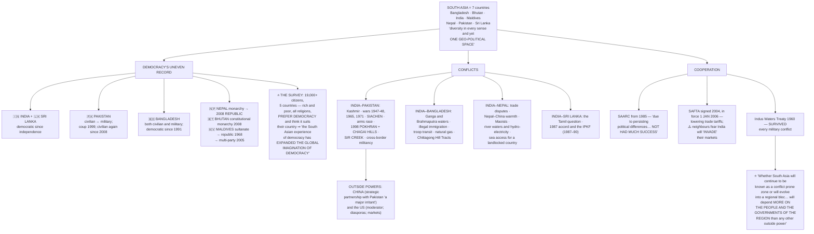

# Chapter 3: Contemporary South Asia

> ⚠️ **Filename note:** `03_US_Hegemony_in_World_Politics.pdf` actually contains **Chapter 3, "Contemporary South Asia."** See [`00_Index.md`](00_Index.md).

## 🎯 Chapter Outcome — what you should walk away with

> **The one thing this chapter exists to teach:** South Asia is **"a region where rivalry and goodwill, hope and despair, mutual suspicion and trust coexist"** — and its democratic experience has **"expanded the global imagination of democracy"**, because it disproved the belief that democracy needs prosperity.

**After reading it, here is what you now understand:**

1. **What "South Asia" means and why the definition is contested** — the **seven countries** (Bangladesh, Bhutan, India, Maldives, Nepal, Pakistan, Sri Lanka), bounded by **the Himalayas, the Indian Ocean, the Arabian Sea and the Bay of Bengal**, giving a **natural insularity**. Boundaries are **clear in the north and south, not in the east and west** — **Afghanistan and Myanmar are often included**, and **China is an important player but not part of the region.**
2. **⭐ The survey finding that overturns an old assumption** — across five countries and **more than 19,000 citizens**, **"ordinary citizens, rich as well as poor and belonging to different religions, view the idea of democracy positively"**, prefer it to any other form, and think it suitable for their country. **"It was earlier believed that democracy could flourish and find support only in prosperous countries of the world."**
3. **The four factors behind Pakistan's failure to build a stable democracy** — the **social dominance of the military, clergy and landowning aristocracy**; **conflict with India strengthening pro-military groups**; the pro-military argument that **parties and democracy are "flawed"** and that army rule is therefore justified; and **the lack of genuine international support for democratic rule.**
4. **Bangladesh's route** — resentment of **West Pakistani domination and the imposition of Urdu**; **Sheikh Mujib's Awami League winning all East Pakistani seats in 1970**; the refusal to convene the assembly; the 1971 war; then the **1975 shift to a presidential system and one party**, assassinations, **Ershad**, and **representative democracy since 1991**.
5. **Nepal's triangular conflict** — **monarchists, democrats and Maoists**; the king abolishing parliament in **2002**; the **April 2006 pro-democracy movement led by the Seven Party Alliance, the Maoists and social activists**; a **democratic republic in 2008** and a **new constitution in 2015**.
6. **Sri Lanka's paradox** — a serious challenge **"not from the military or monarchy but rather from ethnic conflict"**, yet the country **controlled population growth first, liberalised first, had the highest per capita GDP for many years right through the civil war, and maintained a democratic political system.**
7. **The India–Pakistan file in full** — Kashmir and the 1947–48 and 1965 wars; **Siachen**; the arms race; **Pokhran and Chagai Hills in 1998**; the **Indus Waters Treaty (1960)** that survived every war; and **Sir Creek**.
8. **Why SAARC has underachieved and what SAFTA was meant to do** — **"due to persisting political differences, SAARC has not had much success"**; SAFTA was **signed in 2004 and came into effect on 1 January 2006** to lower trade tariffs, but neighbours fear it is **"a way for India to 'invade' their markets."**

**Self-check — answer these three without looking:**
1. Why does the chapter say South Asia's experience "expanded the global imagination of democracy"?
2. Give the four factors behind Pakistan's failure to build a stable democracy.
3. What is SAFTA, when did it come into effect, and what is the objection to it?

**Where this leads:** the closing sentence sets up the rest of the book — whether South Asia becomes a regional bloc **"will depend more on the people and the governments of the region than any other outside power."**

---

## 🗺️ The chapter in one picture



---

## PART 1 — WHAT IS SOUTH ASIA?

### The definition, and its fuzziness
**"South Asia" usually includes: Bangladesh, Bhutan, India, the Maldives, Nepal, Pakistan and Sri Lanka.**

- **The mighty Himalayas in the north** and **the vast Indian Ocean, the Arabian Sea and the Bay of Bengal** in the south, west and east **"provide a natural insularity to the region, which is largely responsible for the linguistic, social and cultural distinctiveness of the sub-continent."**
- **⚠️ "The boundaries of the region are not as clear in the east and the west, as they are in the north and the south."** **Afghanistan and Myanmar are often included** in discussions of the region as a whole.
- **⚠️ "China is an important player but is not considered to be a part of the region."**
- **⭐ "Thus defined, South Asia stands for diversity in every sense and yet constitutes one geo-political space."**

**The opening image the chapter chooses:** the cricket match — **"the gripping tension during an India-Pakistan cricket match"** alongside **"the goodwill and hospitality shown to visiting Indian and Pakistani fans by their hosts."** This is **"symbolic of the larger pattern of South Asian affairs. Ours is a region where rivalry and goodwill, hope and despair, mutual suspicion and trust coexist."**

### The political systems compared

| Country | Democratic experience |
|---|---|
| **India** | Democratic **throughout its existence as an independent country** — "it is, of course, possible to point out many limitations of India's democracy; but we have to remember the fact that India has remained a democracy throughout" |
| **Sri Lanka** | **The same is true** — successfully operated a democratic system since independence from the British |
| **Pakistan** | Both **civilian and military rulers**. Began the post-Cold War period with successive democratic governments under **Benazir Bhutto** and **Nawaz Sharif**, **but suffered a military coup in 1999**. **Run by a civilian government again since 2008** |
| **Bangladesh** | Both civilian and military, **but remaining a democracy in the post-Cold War period** |
| **Nepal** | Till **2006** a constitutional monarchy **"with the danger of the king taking over executive powers"**. **In 2008 the monarchy was abolished and Nepal emerged as a democratic republic** |
| **Bhutan** | Became a **constitutional monarchy in 2008**; under the king's leadership **"it emerged as a multi-party democracy"** |
| **Maldives** | **A Sultanate till 1968**, then a republic with a **presidential** form. **In June 2005 the parliament voted unanimously to introduce a multi-party system.** The **Maldivian Democratic Party (MDP)** dominates and **won the 2018 elections** |

> ⭐ **"From the experience of Bangladesh and Nepal, we can say that democracy is becoming an accepted norm in the entire region of South Asia."**

### 📊 The survey that matters

Based on interviews with **more than 19,000 ordinary citizens in the five big countries** (SDSA Team, *State of Democracy in South Asia*, Oxford University Press, 2007):

```
   WHAT SOUTH ASIANS THINK OF DEMOCRACY
   ═══════════════════════════════════════════════════════
   ✔ Widespread support for democracy in ALL these countries
   ✔ Ordinary citizens — RICH AS WELL AS POOR, and belonging
     to DIFFERENT RELIGIONS — view the idea positively
   ✔ They SUPPORT the institutions of representative democracy
   ✔ They PREFER democracy over any other form of government
   ✔ They think democracy is SUITABLE FOR THEIR COUNTRY
   ═══════════════════════════════════════════════════════
   ⭐ WHY THIS MATTERS: "it was earlier believed that democracy
      could flourish and find support only in PROSPEROUS
      countries of the world… the South Asian experience of
      democracy has EXPANDED THE GLOBAL IMAGINATION
      OF DEMOCRACY."
```

*(Read this alongside Politics in India Ch 2, where the 1952 election "proved that democracy could be practised anywhere in the world." The two books make the same argument, fifty years apart.)*

### 📈 The development picture (UNDP Human Development Report, 2018)

| | Life expectancy (2017) | Adult literacy % | GDP per capita (PPP $) | Infant mortality (per 1,000) | Below $1.90/day % | **HDI rank** |
|---|---|---|---|---|---|---|
| **World** | 72.2 | 82.1 | 15,439 | 29.9 | — | — |
| **South Asia** | 69.3 | 68.7 | 6,485 | 37.8 | — | — |
| **Sri Lanka** | **75.5** | **91.2** | **11,669** | **8.0** | — | **76** |
| **Bangladesh** | 72.8 | 72.8 | 3,524 | 28.2 | 14.8 | 136 |
| **Nepal** | 70.6 | 59.6 | 2,433 | 28.4 | 15.0 | 149 |
| **India** | 68.8 | 69.3 | 6,427 | 34.6 | 21.2 | 130 |
| **Pakistan** | 66.6 | 57.0 | 5,035 | **64.2** | 6.1 | 150 |

> ⭐ **Read the table, don't just reproduce it.** **Sri Lanka leads South Asia on every single human-development indicator** — life expectancy, literacy, per capita GDP and infant mortality — **and it did so through a civil war.** That is the paradox the chapter draws attention to.

---

## PART 2 — THE MILITARY AND DEMOCRACY IN PAKISTAN

### The cycle

```mermaid
flowchart TD
    A["First constitution framed"] --> B["General AYUB KHAN takes over the<br/>administration, soon gets himself elected"]
    B --> C["Gives up office on POPULAR<br/>DISSATISFACTION against his rule"]
    C --> D["Military takeover again under<br/>General YAHYA KHAN"]
    D --> E["Under Yahya: the BANGLADESH CRISIS<br/>and the 1971 war → East Pakistan breaks<br/>away as BANGLADESH"]
    E --> F["Elected government under<br/>ZULFIKAR ALI BHUTTO, 1971–1977"]
    F --> G["Removed by General ZIA-UL-HAQ, 1977"]
    G --> H["Zia faces a PRO-DEMOCRACY MOVEMENT<br/>from 1982 onwards"]
    H --> I["Elected democratic government<br/>again in 1988 under BENAZIR BHUTTO"]
    I --> J["Elective democracy till 1999 —<br/>competition between the PAKISTAN<br/>PEOPLE'S PARTY and the MUSLIM LEAGUE"]
    J --> K["1999: the army steps in again;<br/>General PERVEZ MUSHARRAF removes<br/>Prime Minister NAWAZ SHARIF"]
    K --> L["2001: Musharraf gets himself<br/>elected President; army rule continues,<br/>'though the army rulers have held some<br/>elections to give their rule a<br/>DEMOCRATIC IMAGE'"]
    L --> M["Since 2008: democratically elected<br/>leaders have been ruling Pakistan"]
```



### ⭐ The four factors behind the failure — reproduce all four

| # | Factor | Detail |
|---|---|---|
| **1** | **Social dominance of the military, clergy and landowning aristocracy** | **"Has led to the frequent overthrow of elected governments and the establishment of military government"** |
| **2** | **Conflict with India** | **"Has made the pro-military groups more powerful"** |
| **3** | **The pro-military argument itself** | These groups **"have often said that political parties and democracy in Pakistan are flawed, that Pakistan's security would be harmed by selfish-minded parties and chaotic democracy, and that the army's stay in power is, therefore, justified"** |
| **4** | **⚠️ The lack of genuine international support for democratic rule** | **"The United States and other Western countries have encouraged the military's authoritarian rule in the past, for their own reasons."** Given their fear of **"global Islamic terrorism"** and the apprehension that **Pakistan's nuclear arsenal might fall into the hands of these terrorist groups**, the military regime **"has been seen as the protector of Western interests in West Asia and South Asia"** |

### ⚠️ The counter-evidence the chapter insists on
**"While democracy has not been fully successful in Pakistan, there has been a *strong pro-democracy sentiment* in the country. Pakistan has a courageous and relatively free press and a strong human rights movement."** Never present Pakistan as simply undemocratic — present it as a society where **the demand for democracy is real and the structures resisting it are stronger.**

**🎨 The Surendra cartoon (The Hindu)** comments on **Musharraf's dual role as President of the country *and* army General** — an equation in which one person occupies both sides.

---

## PART 3 — DEMOCRACY IN BANGLADESH

### From East Pakistan to Bangladesh
- **Bangladesh was a part of Pakistan from 1947 to 1971**, consisting of **the partitioned areas of Bengal and Assam** from British India.
- **The people resented the domination of western Pakistan and the imposition of the Urdu language.** Soon after partition they **began protests against the unfair treatment meted out to the Bengali culture and language**, and **demanded fair representation in administration and a fair share in political power.**
- **Sheikh Mujib-ur Rahman led the popular struggle against West Pakistani domination**, demanding **autonomy for the eastern region.**
- **⭐ In the 1970 elections the Awami League led by Sheikh Mujib won all the seats in East Pakistan and secured a majority in the proposed constituent assembly for the whole of Pakistan.** **"But the government dominated by the West Pakistani leadership refused to convene the assembly. Sheikh Mujib was arrested."**
- **Under General Yahya Khan the Pakistani army tried to suppress the mass movement.** **"Thousands were killed by the Pakistan army."** This produced **large-scale migration into India, creating a huge refugee problem.**
- **The government of India supported the demand for independence and helped financially and militarily**, resulting in the **December 1971 war**, the **surrender of Pakistani forces in East Pakistan**, and the formation of Bangladesh.

### The troubled decades after

| Stage | What happened |
|---|---|
| **The constitution** | Declared faith in **secularism, democracy and socialism** |
| **⚠️ 1975** | **Sheikh Mujib got the constitution amended to shift from parliamentary to presidential government**, and **abolished all parties except his own, the Awami League.** **"This led to conflicts and tensions"** |
| **August 1975** | **He was assassinated in a military uprising** |
| **Ziaur Rahman** | The new military ruler **formed his own Bangladesh National Party and won elections in 1979**. **He too was assassinated** |
| **Lt Gen H.M. Ershad** | Another military takeover. **"The people of Bangladesh soon rose in support of the demand for democracy. Students were in the forefront."** Ershad was forced to allow political activity **on a limited scale**, and was later **elected President for five years** |
| **1990** | **Mass public protests made Ershad step down** |
| **1991 onward** | **Elections were held, and "since then representative democracy based on multi-party elections has been working in Bangladesh"** |

**🎨 The image the chapter reproduces:** a **mural in Jahangirnagar University, Savar, Dhaka**, remembering **Noor Hossain**, killed by police during pro-democracy protests against General Ershad in **1987**. Painted on his back: **"Let Democracy be Freed."**

*(And the chapter's aside worth following up: **Bangladesh's Grameen Bank** — "small savings and credit cooperatives in the rural areas have helped in reducing poverty", which is the answer to exercise 1(g).)*

---

## PART 4 — MONARCHY AND DEMOCRACY IN NEPAL

- **Nepal was a Hindu kingdom in the past and then a constitutional monarchy in the modern period for many years.**
- **"Throughout this period, political parties and the common people of Nepal have wanted a more open and responsive system of government. But the king, with the help of the army, retained full control over the government and restricted the expansion of democracy."**
- **The king accepted the demand for a new democratic constitution in 1990**, in the wake of a strong pro-democracy movement — **"however, democratic governments had a short and troubled career."**
- **During the nineties the Maoists of Nepal spread their influence in many parts of the country.** They **"believed in armed insurrection against the monarch and the ruling elite"**, leading to **violent conflict between Maoist guerrillas and the king's armed forces.**

> ⭐ **"For some time, there was a *triangular* conflict among the monarchist forces, the democrats and the Maoists."** — the phrase to use.

- **⚠️ In 2002 the king abolished the parliament and dismissed the government, "thus ending even the limited democracy that existed in Nepal."**
- **In April 2006 there were massive, country-wide, pro-democracy protests.** The pro-democracy forces **"achieved their first major victory when the king was forced to restore the House of Representatives that had been dissolved in April 2002."** **"The largely non-violent movement was led by the Seven Party Alliance (SPA), the Maoists and social activists."**
- Nepal **"has undergone a unique moment in its history because it formed a constituent assembly to draft the constitution."**
- **In 2008 Nepal became a democratic republic after abolishing the monarchy. In 2015 it adopted a new constitution.**

**⚠️ The unresolved tensions the chapter names — these are the answer to exercise 4:**
1. **Some sections thought "a nominal monarchy was necessary for Nepal to retain its link with the past."**
2. **The Maoists agreed to suspend armed struggle** but **wanted the constitution to include "radical programmes of social and economic restructuring"** — and **"all the parties in the SPA did not agree with this programme."**
3. **"The Maoists and some other political groups were also deeply suspicious of the Indian government and its role in the future of Nepal."**

**📷 The two photographs (Min Bajracharya):** democracy activist **Durga Thapa** at a pro-democracy rally in **Kathmandu in 1990**, and **the same person in 2006**, celebrating the success of the second democracy movement — sixteen years apart.

---

## PART 5 — ETHNIC CONFLICT AND DEMOCRACY IN SRI LANKA

### The origin of the conflict
> **Sri Lanka "faced a serious challenge, *not from the military or monarchy but rather from ethnic conflict* leading to the demand for secession by one of the regions."**

- After independence, politics in Sri Lanka (then **Ceylon**) **"was dominated by forces that represented the interest of the majority Sinhala community."**
- **"They were hostile to a large number of Tamils who had migrated from India to Sri Lanka and settled there. This migration continued even after independence."**
- **⭐ "The Sinhala nationalists thought that Sri Lanka should not give 'concessions' to the Tamils because Sri Lanka belongs to the Sinhala people only."**
- **"The neglect of Tamil concerns led to militant Tamil nationalism."**
- **From 1983 onwards the Liberation Tigers of Tamil Eelam (LTTE) was fighting an armed struggle with the Sri Lankan army**, demanding a **"Tamil Eelam" or separate country** for the Tamils. **"At one point of time, the northeastern part of Sri Lanka was controlled by LTTE."**

### India's involvement — and its failure
- **"The Sri Lankan problem involves people of Indian origin, and there was considerable pressure from the Tamil people in India to the effect that the Indian government should protect the interests of the Tamils in Sri Lanka."**
- The government of India **tried from time to time to negotiate** with the Sri Lankan government on the Tamil question.
- **⭐ "But in 1987, the government of India for the first time got directly involved… India signed an accord with Sri Lanka and sent troops to stabilise relations between the Sri Lankan government and the Tamils."**
- **⚠️ "Eventually, the Indian Army got into a fight with the LTTE. The presence of Indian troops was also not liked much by the Sri Lankans. They saw this as an attempt by India to interfere in the internal affairs of Sri Lanka."**
- **In 1989 the Indian Peace Keeping Force (IPKF) pulled out of Sri Lanka *without attaining its objective*.**

### The end of the war, and the paradox
- **The crisis continued to be violent.** International actors, **"particularly the Scandinavian countries such as Norway and Iceland, tried to bring the warring groups back to negotiations."**
- **"Finally, the armed conflict came to an end, as the LTTE was vanquished in 2009."**

> ⭐⭐ **The paradox to build an answer around: "In spite of the conflict, Sri Lanka has registered considerable economic growth and recorded high levels of human development."** Specifically:
> - **"One of the first developing countries to successfully control the rate of growth of population"**
> - **"The first country in the region to liberalise the economy"**
> - **"Had the highest per capita GDP for many years right through the civil war"**
> - **"Despite the ravages of internal conflict, it has maintained a democratic political system"**

**🎨 The Keshav cartoon** depicts the dilemma of the Sri Lankan leadership **"in trying to balance Sinhala hardliners or the Lion and Tamil militants or the Tiger while negotiating peace"** — the two animals of the two flags.

---

## PART 6 — INDIA–PAKISTAN CONFLICTS

### The Kashmir file
- **"Soon after the partition, the two countries got embroiled in a conflict over the fate of Kashmir. The Pakistani government claimed that Kashmir belonged to it."**
- **"Wars between India and Pakistan in 1947-48 and 1965 failed to settle the matter."**
- **The 1947-48 war "resulted in the division of the province into Pakistan-occupied Kashmir and the Indian province of Jammu and Kashmir divided by the Line of Control."**
- **"In 1971, India won a decisive war against Pakistan but the Kashmir issue remained unsettled."**

### The strategic and nuclear dimension
- Conflict is **"also over strategic issues like the control of the Siachen glacier and over acquisition of arms."**
- **"The arms race between the two countries assumed a new character with both states acquiring nuclear weapons and missiles to deliver such arms against each other in the 1990s."**
- **⭐ "In 1998, India conducted nuclear explosion in Pokhran. Pakistan responded within a few days by carrying out nuclear tests in the Chagai Hills."**
- **⚠️ The counter-intuitive consequence: "Since then India and Pakistan seem to have built a military relationship in which the possibility of a direct and full-scale war has declined."**

### The mutual accusations

| **India's charges against Pakistan** | **Pakistan's charges against India** |
|---|---|
| **"Using a strategy of low-key violence by helping the Kashmiri militants with arms, training, money and protection to carry out terrorist strikes against India"** | **"Fomenting trouble in the provinces of Sindh and Balochistan"** |
| **"Pakistan had aided the pro-Khalistani militants with arms and ammunitions during the period 1985-1995"** | |
| Its spy agency, **Inter Services Intelligence (ISI)**, is **"alleged to be involved in various anti-India campaigns in India's northeast, operating secretly through Bangladesh and Nepal"** | |

### 💧 Water — the exception that proves cooperation is possible
- **"Until 1960, they were locked in a fierce argument over the use of the rivers of the Indus basin."**
- **⭐ "Eventually, in 1960, with the help of the World Bank, India and Pakistan signed the Indus Waters Treaty which *has survived to this day in spite of various military conflicts* in which the two countries have been involved."**
- **"There are still some minor differences about the interpretation of the Indus Waters Treaty and the use of the river waters."**

### Sir Creek
**"The two countries are not in agreement over the demarcation line in Sir Creek in the Rann of Kutch."** **⚠️ "The dispute seems minor, but there is an underlying worry that how the dispute is settled may have an impact on the control of *sea resources* in the area adjoining Sir Creek."**

---

## PART 7 — INDIA AND ITS OTHER NEIGHBOURS

### 🇧🇩 Bangladesh

| **India's grievances** | **Bangladesh's grievances** |
|---|---|
| **Denial of illegal immigration to India** | **India "behaves like a regional bully over the sharing of river waters"** |
| **Support for anti-Indian Islamic fundamentalist groups** | **Encouraging rebellion in the Chittagong Hill Tracts** |
| **Refusal to allow Indian troops to move through its territory to the northeast** | **Trying to extract its natural gas** |
| **The decision not to export natural gas to India, or to allow Myanmar to do so through Bangladeshi territory** | **Being unfair in trade** |
| Plus, for a long while, an **unresolved boundary dispute** | |

**✅ But cooperation is real:** **"Economic relations have improved considerably in the last 20 years."** **Bangladesh is part of India's Look East (Act East since 2014) policy that wants to link up with Southeast Asia via Myanmar.** On **disaster management and environmental issues the two states have cooperated regularly.** **In 2015 they exchanged certain enclaves.** *(Also note the **1996 Farakka Treaty** for sharing the Ganga waters, from the timeline.)*

### 🇳🇵 Nepal
> ⭐ **"Nepal and India enjoy a very special relationship that has very few parallels in the world. A treaty between the two countries allows the citizens of the two countries to travel to and work in the other country *without visas and passports*."**

**But:**
- **Trade-related disputes** in the past.
- **India has "often expressed displeasure at the warm relationship between Nepal and China"** and at **Nepal's inaction against anti-Indian elements**.
- **Indian security agencies see the Maoist movement in Nepal as a growing security threat**, given **the rise of Naxalite groups from Bihar in the north to Andhra Pradesh in the south.**
- **Nepalese grievances:** that India **interferes in its internal affairs**, **"has designs on its river waters and hydro-electricity"**, and **"prevents Nepal, a landlocked country, from getting easier access to the sea through Indian territory."**

**✅ Nevertheless:** relations are **"fairly stable and peaceful"**, held together by **trade, scientific cooperation, common natural resources, electricity generation and interlocking water management grids** — with hope that **"the consolidation of democracy in Nepal will lead to improvements in the ties."**

### 🇱🇰 Sri Lanka
Difficulties are **"mostly over ethnic conflict in the island nation."** **"Indian leaders and citizens find it impossible to remain neutral when Tamils are politically unhappy and are being killed."** After the **1987 military intervention**, **"the Indian government now prefers a policy of *disengagement* vis-à-vis Sri Lanka's internal troubles."** **India signed a free trade agreement with Sri Lanka**, and **"India's help in post-tsunami reconstruction has also brought the two countries closer."**

### 🇧🇹 Bhutan and 🇲🇻 Maldives
- **Bhutan:** **"India enjoys a very special relationship… and does not have any major conflict."** The **Bhutanese monarch's efforts to weed out the guerrillas and militants from northeastern India operating in his country "have been helpful to India."** India is involved in **big hydroelectric projects** and **"remains the Himalayan kingdom's biggest source of development aid."**
- **Maldives:** ties **"remain warm and cordial."** **In November 1988, when some Tamil mercenaries from Sri Lanka attacked the Maldives, the Indian air force and navy reacted quickly to the Maldives' request to help stop the invasion.** India has also contributed to the island's **economic development, tourism and fisheries.**

### ⚖️ The structural problem — India's size

> ⭐ **"India has various problems with its smaller neighbours in the region. Given its size and power, *they are bound to be suspicious of India's intentions*. The Indian government, on the other hand, often feels exploited by its neighbours. It does not like the political instability in these countries, fearing it can help outside powers to gain influence in the region. The smaller countries fear that India wants to be a regionally-dominant power."**

**⚠️ And the important corrective:** **"Not all conflicts in South Asia are between India and its neighbours."**
- **Nepal and Bhutan** have disagreed over **the migration of ethnic Nepalese into Bhutan.**
- **Bangladesh and Myanmar** over **the Rohingyas moving into India and Bangladesh.**
- **Bangladesh and Nepal** have had differences over **the future of the Himalayan river waters.**

**But the chapter concedes:** **"The major conflicts and differences, though, are between India and the others, partly because of the *geography* of the region, in which India is located centrally and is therefore the only country that borders the others."**

> 💬 **The margin question the chapter itself plants:** *"If the chapter on the US was called 'US Hegemony', why is this chapter not called 'Indian Hegemony'?"*

---

## PART 8 — PEACE AND COOPERATION

### 🤝 SAARC and SAFTA

| | Detail |
|---|---|
| **SAARC** | **"A major regional initiative by the South Asian states to evolve cooperation through multilateral means."** **Began in 1985** — the Charter was signed **at the first summit in Dhaka, December 1985**. **⚠️ "Unfortunately, due to persisting political differences, SAARC has not had much success."** **Afghanistan joined in 2007**; the **18th summit was at Kathmandu in November 2014** |
| **SAFTA** | The **South Asian Free Trade agreement**, promising **"the formation of a free trade zone for the whole of South Asia."** **Signed in 2004** at the **12th SAARC Summit in Islamabad**, and **came into effect on 1 January 2006.** **It aims at lowering trade tariffs** |

**⚠️ The two objections the chapter records:**
1. **From the neighbours:** that **"SAFTA is a way for India to 'invade' their markets and to influence their societies and politics through commercial ventures and a commercial presence in their countries."**
2. **From within India:** that **"SAFTA is not worth the trouble since India already has bilateral agreements with Bhutan, Nepal and Sri Lanka."**

**India's argument for it:** **"there are real economic benefits for all from SAFTA and… a region that trades more freely will be able to cooperate better on political issues."**

> ⭐ **"A new chapter of peace and cooperation might evolve in South Asia if all the countries in the region allow free trade across the borders. This is the spirit behind the idea of SAFTA."**

### India–Pakistan peace efforts
**"Although India-Pakistan relations seem to be a story of endemic conflict and violence, there have been a series of efforts to manage tensions and build peace":**
- **Confidence building measures to reduce the risk of war.**
- **"Social activists and prominent personalities have collaborated to create an atmosphere of friendship among the people of both countries."**
- **Leaders have met at summits** — **Vajpayee's bus journey to Lahore (February 1999) to sign a Peace Declaration**, and the **Vajpayee–Musharraf Agra Summit (July 2001), which was unsuccessful.**
- **"A number of bus routes have been opened up between the two countries. Trade between India and Pakistan had increased and Visas had been more easily granted."**
- **⚠️ "However, in recent times, the situation has changed."**

### 🌏 The outside powers

> **"No region exists in a vacuum. It is influenced by outside powers and events no matter how much it may try to insulate itself from non-regional powers. China and the United States remain key players in South Asian politics."**

| Power | Role |
|---|---|
| **China** | **"Sino-Indian relations have improved significantly in the last ten years, but China's strategic partnership with Pakistan remains a major irritant."** **"The demands of development and globalisation have brought the two Asian giants closer, and their economic ties have multiplied rapidly since 1991"** |
| **The United States** | **Involvement "has rapidly increased after the Cold War."** It has **"good relations with both India and Pakistan since the end of the Cold War and increasingly works as a *moderator* in India-Pakistan relations."** **Economic reforms and liberal economic policies in both countries have greatly increased the depth of American participation.** The **large South Asian diasporas in the US** and the **huge size of the population and markets of the region** give America **"an added stake in the future of regional security and peace"** |

### ⭐ The chapter's closing judgment

> **"However, whether South Asia will continue to be known as a conflict prone zone or will evolve into a regional bloc with some common cultural features and trade interests will depend *more on the people and the governments of the region than any other outside power*."**

---

## 📅 Timeline of South Asia since 1947

```mermaid
timeline
    title Conflict and cooperation in South Asia
    1947–48 : India and Pakistan independent; Sri Lanka (Ceylon) independent 1948; Indo-Pak conflict over Kashmir
    1954–55 : Pakistan joins the Cold War military blocs SEATO and CENTO
    1960 : India and Pakistan sign the INDUS WATERS TREATY
    1962 : Border conflict between India and China
    1965–66 : Indo-Pak War; UN Observation Mission; TASHKENT AGREEMENT 1966; Sheikh Mujib's SIX-POINT PROPOSAL for greater autonomy to East Pakistan
    1971 : March — Proclamation of Independence by Bangladesh leaders; August — Indo-Soviet Treaty for 20 years; December — Indo-Pak War and the liberation of Bangladesh
    1972–76 : SIMLA AGREEMENT July 1972; India's nuclear test May 1974; Pakistan and Bangladesh establish diplomatic ties 1976
    Dec 1985 : South Asian leaders sign the SAARC CHARTER at the first summit in DHAKA
    1987–90 : Indo-Sri Lanka Accord; INDIAN PEACE KEEPING FORCE operation in Sri Lanka
    1988 : India sends troops to the Maldives to foil a coup by mercenaries; India and Pakistan agree not to attack each other's nuclear installations
    1988–91 : Democracy restored in Pakistan, Bangladesh and Nepal
    Dec 1996 : India and Bangladesh sign the FARAKKA TREATY for sharing the Ganga waters
    1998 : May — India and Pakistan conduct NUCLEAR TESTS; December — India–Sri Lanka Free Trade Agreement
    1999 : February — Vajpayee's BUS JOURNEY TO LAHORE to sign a Peace Declaration; June–July — the KARGIL conflict
    2001 : July — the Vajpayee–Musharraf AGRA SUMMIT is unsuccessful
    2004–07 : SAFTA signed at the 12th SAARC Summit in Islamabad, January 2004; AFGHANISTAN joins SAARC in 2007
    Nov 2014 : The 18th SAARC Summit in Kathmandu, Nepal
```



---

## Key Words (Glossary)

| Term | Meaning |
|---|---|
| **South Asia** | The **seven countries** — Bangladesh, Bhutan, India, Maldives, Nepal, Pakistan, Sri Lanka — **"diversity in every sense and yet… one geo-political space"** |
| **Natural insularity** | The effect of the Himalayas and the surrounding seas, **"largely responsible for the linguistic, social and cultural distinctiveness of the sub-continent"** |
| **Triangular conflict** | Nepal's contest among **monarchist forces, democrats and Maoists** |
| **Seven Party Alliance (SPA)** | Led the **largely non-violent April 2006 movement** in Nepal, with the Maoists and social activists |
| **LTTE** | **Liberation Tigers of Tamil Eelam** — armed struggle from **1983**, for a separate **Tamil Eelam**; **vanquished in 2009** |
| **IPKF** | **Indian Peace Keeping Force**, sent under the **1987 accord**; **pulled out in 1989 without attaining its objective** |
| **Line of Control** | The division produced by the **1947–48 war** between **Pakistan-occupied Kashmir** and **the Indian province of Jammu and Kashmir** |
| **Indus Waters Treaty (1960)** | Signed **with the help of the World Bank**; **"has survived to this day in spite of various military conflicts"** |
| **Sir Creek** | The disputed demarcation line in the **Rann of Kutch**, mattering because of **control of sea resources** |
| **SAARC (1985)** | South Asian Association for Regional Cooperation — **"due to persisting political differences… has not had much success"** |
| **SAFTA** | **Signed 2004, in force 1 January 2006**; aims at **lowering trade tariffs** and creating a free trade zone |
| **Grameen Bank** | Bangladesh's **small savings and credit cooperatives in rural areas**, which **helped reduce poverty** |

---

## Quick Recap (15 points)

1. **South Asia = seven countries**, with **natural insularity** from the Himalayas and the seas; boundaries **fuzzy in the east and west**; **Afghanistan and Myanmar often included; China an important player but not part of the region.**
2. **The cricket image:** rivalry and goodwill, hope and despair, mutual suspicion and trust **coexist**.
3. **Democratic records differ** — India and Sri Lanka continuously democratic; Pakistan and Bangladesh both civilian and military; **Nepal a republic in 2008**; **Bhutan a constitutional monarchy and multi-party democracy in 2008**; **Maldives multi-party from June 2005**.
4. **⭐ The 19,000-citizen survey:** rich and poor, across religions, **prefer democracy** and think it suits their country — **"the South Asian experience of democracy has expanded the global imagination of democracy."**
5. **Sri Lanka leads South Asia on every human development indicator** — life expectancy **75.5**, literacy **91.2%**, per capita GDP **$11,669**, infant mortality **8.0**, HDI rank **76** — **achieved through a civil war**.
6. **Pakistan's cycle:** Ayub → Yahya (and the loss of East Pakistan) → **Bhutto 1971–77** → **Zia 1977** → pro-democracy movement **from 1982** → **Benazir 1988** → elective democracy till **1999**, when **Musharraf removed Nawaz Sharif** → elected President **2001** → **civilian rule since 2008**.
7. **Four causes of Pakistan's democratic failure:** the **military-clergy-landowning aristocracy**; **conflict with India** empowering pro-military groups; the argument that **democracy is "flawed" and army rule justified**; and **the lack of international support**, with the West seeing the military as **"the protector of Western interests."** But there is a **strong pro-democracy sentiment**, a **courageous and relatively free press** and a **strong human rights movement**.
8. **Bangladesh:** resentment of **Urdu and West Pakistani domination** → **Awami League wins all East Pakistani seats in 1970** → assembly not convened, **Mujib arrested**, **thousands killed**, refugees into India → **1971 war and independence**. Then **1975: presidential system and one party**, **Mujib assassinated**; **Ziaur Rahman**, also assassinated; **Ershad**, forced down by **mass protests in 1990**; **multi-party democracy since 1991**.
9. **Nepal:** king with army control → **1990 constitution** but short-lived governments → **Maoist armed insurrection** → **triangular conflict** → **2002 parliament abolished** → **April 2006 mass protests led by the SPA, Maoists and social activists** → **House restored** → **constituent assembly** → **republic 2008**, **constitution 2015**. Unresolved: **nominal monarchy**, the **Maoists' radical restructuring**, and **suspicion of India**.
10. **Sri Lanka:** Sinhala-dominated politics hostile to Tamils; **"Sri Lanka belongs to the Sinhala people only"** → militant Tamil nationalism → **LTTE from 1983** demanding **Tamil Eelam**; India's **1987 accord and IPKF**, which **fought the LTTE** and **withdrew in 1989 without attaining its objective**; **Norway and Iceland mediated**; **LTTE vanquished in 2009**.
11. **India–Pakistan:** Kashmir from partition; **wars 1947-48, 1965, 1971**; the **Line of Control**; **Siachen**; **Pokhran and Chagai Hills in 1998**, after which **"the possibility of a direct and full-scale war has declined"**; mutual charges over **militancy, Khalistan, the ISI**, and **Sindh and Balochistan**.
12. **The Indus Waters Treaty (1960, World Bank)** has **survived every military conflict** — the standing proof that cooperation is possible. **Sir Creek** matters for **sea resources**.
13. **Neighbours:** **Bangladesh** (river waters, immigration, transit, gas vs "regional bully", Chittagong Hill Tracts, trade) but improving economic ties, **enclave exchange in 2015** and **Act East**; **Nepal** (visa-free travel, but China, Maoists, water and sea access); **Sri Lanka** (Tamil question; India now prefers **disengagement**; FTA; post-tsunami help); **Bhutan** (no major conflict; hydro projects; **India its biggest source of development aid**); **Maldives** (**November 1988** air force and navy response to the mercenary attack).
14. **The structural problem:** given India's size, neighbours **"are bound to be suspicious"** while India **"often feels exploited"** — and geography puts India **centrally, bordering all the others.** But **not all conflicts involve India** (Nepal–Bhutan, Bangladesh–Myanmar, Bangladesh–Nepal).
15. **SAARC (1985) "has not had much success" due to persisting political differences**; **SAFTA signed 2004, in force 1 January 2006**, aiming to **lower tariffs** — feared by neighbours as an Indian market invasion, doubted within India as unnecessary. **China and the US are the key outside players**, the US **"increasingly works as a moderator."** But the outcome **"will depend more on the people and the governments of the region than any other outside power."**

---

## 60-Second Revision

**SOUTH ASIA = BANGLADESH, BHUTAN, INDIA, MALDIVES, NEPAL, PAKISTAN, SRI LANKA. Himalayas + Indian Ocean + Arabian Sea + Bay of Bengal = NATURAL INSULARITY → linguistic, social, cultural distinctiveness. Boundaries CLEAR north/south, NOT east/west; AFGHANISTAN and MYANMAR often included; ⚠️ CHINA an important player but NOT part of the region. "Diversity in every sense and yet ONE GEO-POLITICAL SPACE." Cricket image: "rivalry and goodwill, hope and despair, mutual suspicion and trust COEXIST."** **DEMOCRACY: India + Sri Lanka continuous. Pakistan civilian↔military, coup 1999, civilian since 2008. Bangladesh both, democratic in the post-Cold War period. NEPAL constitutional monarchy till 2006 → REPUBLIC 2008 → CONSTITUTION 2015. BHUTAN constitutional monarchy + multi-party 2008. MALDIVES sultanate till 1968 → republic (presidential) → JUNE 2005 parliament votes UNANIMOUSLY for multi-party; MDP won 2018.** **⭐ SURVEY — 19,000+ citizens in 5 countries: rich AND poor, ALL religions, view democracy POSITIVELY, support representative institutions, PREFER it to any other form, think it SUITABLE for their country ⇒ overturns the belief that "democracy could flourish… only in PROSPEROUS countries" ⇒ "the South Asian experience of democracy has EXPANDED THE GLOBAL IMAGINATION OF DEMOCRACY."** **HDI (2018 report): SRI LANKA leads on EVERYTHING — life expectancy 75.5, literacy 91.2%, GDP/capita $11,669, infant mortality 8.0, HDI RANK 76. India 130, Bangladesh 136, Nepal 149, Pakistan 150.** **PAKISTAN CYCLE: AYUB KHAN (elected himself, left on popular dissatisfaction) → YAHYA KHAN (Bangladesh crisis, 1971 war) → ZULFIKAR ALI BHUTTO 1971–77 → ZIA-UL-HAQ 1977, faced a pro-democracy movement FROM 1982 → BENAZIR BHUTTO 1988 → elective democracy till 1999 (PPP vs MUSLIM LEAGUE) → MUSHARRAF removes NAWAZ SHARIF 1999, elected President 2001, elections held "to give their rule a DEMOCRATIC IMAGE" → DEMOCRATICALLY ELECTED LEADERS SINCE 2008.** **⭐ FOUR CAUSES OF FAILURE: (1) SOCIAL DOMINANCE of MILITARY + CLERGY + LANDOWNING ARISTOCRACY (2) CONFLICT WITH INDIA makes pro-military groups powerful (3) their argument that parties and democracy are "FLAWED", security would be harmed by "selfish-minded parties and chaotic democracy", so army rule is justified (4) LACK OF GENUINE INTERNATIONAL SUPPORT — the US and the West encouraged military rule, fearing "GLOBAL ISLAMIC TERRORISM" and that the NUCLEAR ARSENAL might fall to terrorists, seeing the military as "THE PROTECTOR OF WESTERN INTERESTS". ⚠️ BUT: strong PRO-DEMOCRACY SENTIMENT, a COURAGEOUS AND RELATIVELY FREE PRESS, a STRONG HUMAN RIGHTS MOVEMENT.** **BANGLADESH: part of Pakistan 1947–71 (partitioned Bengal + Assam); resented WEST PAKISTANI DOMINATION + IMPOSITION OF URDU; demanded fair representation + share of power; SHEIKH MUJIB-UR RAHMAN led it; 1970 AWAMI LEAGUE WON ALL EAST PAKISTAN SEATS + a majority in the proposed constituent assembly → assembly NOT CONVENED, Mujib ARRESTED, YAHYA's army killed THOUSANDS → refugees into India → India helped financially and militarily → DEC 1971 war → surrender → BANGLADESH. Constitution: SECULARISM, DEMOCRACY, SOCIALISM. ⚠️ 1975 Mujib amends to PRESIDENTIAL form + abolishes ALL PARTIES except the Awami League → assassinated AUG 1975 → ZIAUR RAHMAN (BNP, won 1979) assassinated → LT GEN H.M. ERSHAD → students lead protests → limited political activity → Ershad elected President 5 yrs → MASS PROTESTS FORCED HIM DOWN 1990 → elections 1991 → MULTI-PARTY DEMOCRACY SINCE. Mural: NOOR HOSSAIN, killed 1987 — "LET DEMOCRACY BE FREED". GRAMEEN BANK = rural savings and credit cooperatives reducing poverty.** **NEPAL: Hindu kingdom → constitutional monarchy; king with the army "retained full control"; 1990 new democratic constitution after a pro-democracy movement, but governments had "a SHORT AND TROUBLED CAREER"; 1990s MAOISTS spread, believing in ARMED INSURRECTION → ⭐ TRIANGULAR CONFLICT among MONARCHISTS, DEMOCRATS and MAOISTS → 2002 KING ABOLISHED PARLIAMENT and dismissed the government, "ending even the LIMITED democracy" → APRIL 2006 massive countrywide protests, LARGELY NON-VIOLENT, led by the SEVEN PARTY ALLIANCE + MAOISTS + SOCIAL ACTIVISTS → king forced to RESTORE THE HOUSE dissolved in April 2002 → CONSTITUENT ASSEMBLY → REPUBLIC 2008 → CONSTITUTION 2015. THREE CHALLENGES: some wanted a NOMINAL MONARCHY for the link with the past; Maoists suspended armed struggle but demanded RADICAL SOCIAL AND ECONOMIC RESTRUCTURING which not all SPA parties accepted; and Maoists + others were "DEEPLY SUSPICIOUS OF THE INDIAN GOVERNMENT". Photos: DURGA THAPA, 1990 and 2006.** **SRI LANKA: challenge came "NOT FROM THE MILITARY OR MONARCHY BUT… ETHNIC CONFLICT"; Sinhala-dominated politics hostile to Tamils who had MIGRATED FROM INDIA (migration continued after independence); ⭐ "SRI LANKA SHOULD NOT GIVE 'CONCESSIONS' TO THE TAMILS BECAUSE SRI LANKA BELONGS TO THE SINHALA PEOPLE ONLY" → militant Tamil nationalism → LTTE FROM 1983 for TAMIL EELAM, at one point controlling the NORTHEAST. India: pressure from Indian Tamils → 1987 ACCORD + IPKF → the Indian Army FOUGHT THE LTTE, Sri Lankans saw INTERFERENCE → IPKF PULLED OUT 1989 "WITHOUT ATTAINING ITS OBJECTIVE" → NORWAY and ICELAND mediated → LTTE VANQUISHED 2009. ⭐ PARADOX: first developing country to CONTROL POPULATION GROWTH, FIRST IN THE REGION TO LIBERALISE, HIGHEST PER CAPITA GDP FOR MANY YEARS RIGHT THROUGH THE CIVIL WAR, and MAINTAINED A DEMOCRATIC SYSTEM. Cartoon: the LION and the TIGER.** **INDIA–PAKISTAN: Kashmir from partition; 1947-48 and 1965 wars FAILED to settle it; 1947-48 produced PoK + J&K divided by the LINE OF CONTROL; 1971 decisive Indian victory but Kashmir UNSETTLED. Strategic: SIACHEN GLACIER + arms acquisition; 1990s both acquire NUCLEAR WEAPONS AND MISSILES; 1998 POKHRAN → Pakistan replies within days at CHAGAI HILLS → ⚠️ since then "THE POSSIBILITY OF A DIRECT AND FULL-SCALE WAR HAS DECLINED". India charges: low-key violence, arms/training/money/protection to Kashmiri militants; aid to PRO-KHALISTANI militants 1985–1995; ISI in the NORTHEAST via BANGLADESH and NEPAL. Pakistan charges: India fomenting trouble in SINDH and BALOCHISTAN. WATER: fierce argument till 1960 → ⭐ INDUS WATERS TREATY 1960 with WORLD BANK help, "HAS SURVIVED TO THIS DAY IN SPITE OF VARIOUS MILITARY CONFLICTS"; minor interpretation differences remain. SIR CREEK in the RANN OF KUTCH — "seems minor" but affects control of SEA RESOURCES.** **BANGLADESH: India's complaints — denial of illegal immigration, support to anti-Indian Islamic fundamentalist groups, refusal of TROOP TRANSIT to the northeast, refusal to export NATURAL GAS or let Myanmar do so through its territory. Bangladesh's — India a "REGIONAL BULLY" on river waters, encouraging rebellion in the CHITTAGONG HILL TRACTS, extracting its gas, unfair trade. ✅ Economic relations improved over 20 years; part of ACT EAST via Myanmar; regular cooperation on DISASTER MANAGEMENT and ENVIRONMENT; ENCLAVES EXCHANGED 2015; FARAKKA TREATY DEC 1996.** **NEPAL: ⭐ a treaty allows citizens to travel and work in the other country WITHOUT VISAS AND PASSPORTS. Frictions: trade disputes, Nepal–CHINA warmth, inaction against anti-Indian elements, MAOISTS as a security threat given Naxalites from BIHAR to ANDHRA PRADESH; Nepal's view — interference, designs on RIVER WATERS AND HYDRO-ELECTRICITY, blocking SEA ACCESS for a landlocked country. Held together by trade, scientific cooperation, common natural resources, electricity and INTERLOCKING WATER MANAGEMENT GRIDS.** **SRI LANKA: India now prefers DISENGAGEMENT after 1987; FTA signed; POST-TSUNAMI reconstruction help. BHUTAN: no major conflict; the monarch weeded out northeastern militants; big HYDROELECTRIC projects; India its BIGGEST SOURCE OF DEVELOPMENT AID. MALDIVES: NOV 1988 Tamil mercenaries from Sri Lanka attacked; INDIAN AIR FORCE AND NAVY responded quickly; India aids economic development, TOURISM and FISHERIES.** **STRUCTURAL PROBLEM: given India's size neighbours "ARE BOUND TO BE SUSPICIOUS"; India "OFTEN FEELS EXPLOITED" and dislikes instability that lets outside powers in; smaller countries fear India wants to be REGIONALLY DOMINANT. ⚠️ But NOT ALL conflicts involve India — NEPAL–BHUTAN (ethnic Nepalese), BANGLADESH–MYANMAR (ROHINGYAS), BANGLADESH–NEPAL (Himalayan river waters). India's centrality is GEOGRAPHIC — "the only country that borders the others".** **SAARC from 1985 (Charter signed DHAKA, DEC 1985) — "due to PERSISTING POLITICAL DIFFERENCES… NOT HAD MUCH SUCCESS"; AFGHANISTAN joined 2007; 18th summit KATHMANDU NOV 2014. SAFTA signed 2004 (12th summit, ISLAMABAD), IN EFFECT 1 JAN 2006, aims to LOWER TRADE TARIFFS. ⚠️ Neighbours fear India will "INVADE" their markets; some Indians think it is "not worth the trouble" given bilateral deals with Bhutan, Nepal and Sri Lanka. India argues free trade brings real benefits and better political cooperation.** **PEACE EFFORTS: confidence building measures; social activists and prominent personalities; LAHORE BUS + PEACE DECLARATION FEB 1999; AGRA SUMMIT JULY 2001 UNSUCCESSFUL; bus routes, more trade, easier visas — "however, in recent times, the situation has changed". OUTSIDE POWERS: CHINA — Sino-Indian relations improved but "CHINA'S STRATEGIC PARTNERSHIP WITH PAKISTAN REMAINS A MAJOR IRRITANT", economic ties multiplied since 1991. US — involvement "rapidly increased after the Cold War", good relations with BOTH, "increasingly works as a MODERATOR"; large DIASPORAS and huge MARKETS give it "an added stake". ⭐ CLOSING: the region's future "will depend MORE ON THE PEOPLE AND THE GOVERNMENTS OF THE REGION than any other outside power."**

---

## NCERT Exercises — with answers

**1. Identify the country.**
**(a)** Struggle among pro-monarchy, pro-democracy groups and extremists → **Nepal**
**(b)** A landlocked country with multi-party competition → **Nepal** *(Bhutan is also landlocked and multi-party since 2008; Nepal is the intended answer)*
**(c)** First to liberalise its economy in South Asia → **Sri Lanka**
**(d)** Military prevailed over pro-democracy groups → **Pakistan**
**(e)** Centrally located, shares borders with most South Asian countries → **India**
**(f)** Earlier had a Sultan as head of state, now a republic → **Maldives**
**(g)** Small savings and credit cooperatives in rural areas reducing poverty → **Bangladesh** (Grameen Bank)
**(h)** A landlocked country with a monarchy → **Bhutan**

**2. Which statement about South Asia is wrong?**
**(a) All the countries in South Asia are democratic.** This is false — Pakistan has repeatedly been under **military rule** (most recently after the **1999 coup**), Nepal was a **monarchy until 2008**, Bhutan became a constitutional monarchy only in **2008**, and the Maldives introduced a multi-party system only in **2005**. (b), (c) and (d) are all correct.

**3. Commonalities and differences between Bangladesh and Pakistan in their democratic experiences.**
**Commonalities:** both **emerged from the same 1947 partition** and inherited the same state until 1971; both have experienced **alternating civilian and military rule**; in both, **military rulers sought democratic legitimacy** by holding elections (Ayub, Zia and Musharraf in Pakistan; Ziaur Rahman and Ershad in Bangladesh); both saw **military leaders form their own political parties**; and in both, **popular pro-democracy movements were a real force** — the movement against Zia from 1982, and the student-led protests that forced Ershad out.
**Differences:** **Bangladesh has remained a democracy throughout the post-Cold War period**, with representative multi-party government working continuously **since 1991**, whereas Pakistan **suffered a fresh coup in 1999** and returned to civilian rule only in **2008**. **The threat to democracy in Bangladesh has come more from within the political system** — Sheikh Mujib's own **1975 shift to a presidential system and abolition of all parties but the Awami League** — while in Pakistan the threat is **structural**, rooted in the **social dominance of the military, clergy and landowning aristocracy**, reinforced by the **conflict with India** and by **Western support for military rule**. Bangladesh has no comparable external-conflict driver.

**4. Three challenges to democracy in Nepal.**
1. **The unresolved question of the monarchy.** "Some sections in Nepal thought that **a nominal monarchy was necessary for Nepal to retain its link with the past**" — a disagreement running through the constitution-making process.
2. **The Maoists' agenda.** They **suspended armed struggle** but wanted the constitution **"to include the radical programmes of social and economic restructuring"**, and **"all the parties in the SPA did not agree with this programme."** Reintegrating an armed movement into party politics on contested terms is the central challenge.
3. **Suspicion of India.** **"The Maoists and some other political groups were also deeply suspicious of the Indian government and its role in the future of Nepal"** — so external anxiety complicates internal settlement.
*(A fourth, if needed: the historical pattern itself — even after the 1990 constitution, **"democratic governments had a short and troubled career"**, and in **2002 the king abolished parliament**, ending even limited democracy.)*

**5. The principal players in Sri Lanka's ethnic conflict, and the prospects of resolution.**
**The players:** the **Sinhala-dominated Sri Lankan state and army**, representing the majority community and the position that **"Sri Lanka belongs to the Sinhala people only"**; the **Sri Lankan Tamils**, many descended from migrants from India, whose neglected concerns produced militant nationalism; the **LTTE**, fighting an armed struggle from **1983** for a separate **Tamil Eelam** and at one point controlling the northeast; **India**, drawn in by pressure from Tamils in India, which signed the **1987 accord** and sent the **IPKF**, then fought the LTTE and **withdrew in 1989 without attaining its objective**; and **international mediators**, particularly **Norway and Iceland**.
**Prospects:** the **military phase ended with the LTTE's defeat in 2009**, so the question is no longer secession but **whether the underlying grievance is addressed.** The favourable factors are real: Sri Lanka has **maintained a democratic political system despite the war**, has **high human development and the region's highest per capita GDP**, and has an established record of international engagement. The obstacles are equally real: **a military victory settles the war without settling the political question**, and the leadership's dilemma the chapter's cartoon captures — **balancing Sinhala hardliners against Tamil aspirations** — remains. Durable resolution requires what Politics in India Ch 7 calls **power sharing**: genuine devolution, and a share for the Tamil regions in national decision-making, not merely the absence of fighting.

**6. Recent agreements between India and Pakistan — are the two on their way to friendship?**
**The agreements and measures:** the **1988 agreement not to attack each other's nuclear installations and facilities**; the **Lahore Peace Declaration** signed after Vajpayee's **bus journey in February 1999**; the attempted **Agra Summit of July 2001**; **confidence building measures to reduce the risk of war**; the opening of **a number of bus routes**; **increased trade**; and **more easily granted visas**. Behind these sit the older **Indus Waters Treaty (1960)** and the **Simla Agreement (July 1972)**.
**Can we be sure? No.** The chapter's own answer is cautious: **"however, in recent times, the situation has changed."** The pattern is that every advance is followed by a reversal — the **Lahore Declaration of February 1999 was followed by the Kargil conflict in June–July**, and the **Agra Summit was unsuccessful**. The underlying disputes — **Kashmir, Siachen, Sir Creek, cross-border militancy and the ISI's alleged role** — are untouched by these measures, and **both governments "continue to be suspicious of each other."** The honest verdict is that the two have built **a relationship in which full-scale war has become less likely** since 1998, which is not the same as friendship. Peace-building has been real but **reversible**, and dependent on political conditions on both sides.

**7. Two areas each of cooperation and disagreement between India and Bangladesh.**
**Cooperation:** *(i)* **Disaster management and environmental issues**, on which **"the two states have cooperated regularly."** *(ii)* **Economic relations, which "have improved considerably in the last 20 years"**, with Bangladesh forming part of India's **Look East / Act East policy** to link with Southeast Asia via Myanmar. *(Also: the **Farakka Treaty of December 1996** on the Ganga waters, and the **exchange of enclaves in 2015**, which resolved a long-standing boundary problem.)*
**Disagreement:** *(i)* **River waters** — the sharing of the **Ganga and Brahmaputra**, with Bangladesh feeling India **"behaves like a regional bully."** *(ii)* **Illegal immigration**, which Bangladesh denies and India insists upon. *(Also: India's complaints about **support for anti-Indian Islamic fundamentalist groups**, the **refusal of troop transit** to the northeast, and the **refusal to export natural gas**; and Bangladesh's complaints about **rebellion in the Chittagong Hill Tracts** and **unfair trade**.)*

**8. How are external powers influencing bilateral relations in South Asia? One example.**
External powers matter because **"no region exists in a vacuum."** The two key players are **China and the United States**.
**Example — the United States in India–Pakistan relations.** American involvement **"has rapidly increased after the Cold War"**, and having **good relations with both countries**, it **"increasingly works as a *moderator* in India-Pakistan relations."** Its stake is not only strategic: **economic reforms and liberal economic policies in both countries have greatly increased the depth of American participation**, and **the large South Asian diasporas in the US and the huge size of the population and markets of the region give America an added stake in regional security and peace.** The effect on the bilateral relationship is double-edged: American mediation has helped defuse crises, but American support has also shaped Pakistan's internal politics, since **"the United States and other Western countries have encouraged the military's authoritarian rule in the past, for their own reasons"**, seeing the military as **"the protector of Western interests."** External influence has therefore both **restrained war** and **weakened democracy** in the same country.
*(An equally good example is **China**: Sino-Indian relations have improved, but **"China's strategic partnership with Pakistan remains a major irritant"** — an external relationship that directly conditions a bilateral one.)*

**9. The role and limitations of SAARC.**
**The role:** SAARC is **"a major regional initiative by the South Asian states to evolve cooperation through multilateral means"**, begun in **1985** with the Charter signed at the first summit in **Dhaka**. Its purpose is to create the habit of multilateral cooperation in a region where bilateral relations are dominated by one large state; its most substantial achievement is **SAFTA**, signed in **2004** and in force from **1 January 2006**, which **aims at lowering trade tariffs** and creating a free trade zone for the whole of South Asia. **Afghanistan joined in 2007.** The underlying argument is India's: **"there are real economic benefits for all from SAFTA and… a region that trades more freely will be able to cooperate better on political issues."**
**The limitations:** the chapter is blunt — **"due to persisting political differences, SAARC has not had much success."** Specifically: *(i)* **bilateral disputes, above all India–Pakistan, paralyse the multilateral forum**; *(ii)* **asymmetry of size** means smaller members fear that free trade is **"a way for India to 'invade' their markets and to influence their societies and politics"**; *(iii)* **scepticism within India** that SAFTA is **"not worth the trouble"** given existing bilateral agreements with Bhutan, Nepal and Sri Lanka; and *(iv)* the absence of the **ASEAN Way's** informal, non-confrontationist habit of consultation — which is exactly the comparison the previous chapter invites with its question, *"Why did ASEAN succeed whereas SAARC did not?"*

**10. Do India's neighbours correctly think that India tries to dominate and interfere?**
**Partly correct, and the chapter says so on both sides.**
**The case that the impression is justified.** India has **intervened militarily in neighbours' internal affairs** — the **IPKF in Sri Lanka from 1987**, which ended up fighting the LTTE and which Sri Lankans **"saw as an attempt by India to interfere in the internal affairs"**; and troops sent to the **Maldives in 1988** (though at that government's request). India **"has often expressed displeasure at the warm relationship between Nepal and China"** — that is, at a sovereign neighbour's foreign policy. Many in Nepal believe India **"interferes in its internal affairs, has designs on its river waters and hydro-electricity, and prevents Nepal, a landlocked country, from getting easier access to the sea."** Bangladesh believes India **"behaves like a regional bully over the sharing of river waters."** And the chapter concedes that **"the smaller countries fear that India wants to be a regionally-dominant power."**
**The case that it is exaggerated.** India also **"often feels exploited by its neighbours."** Its concerns are frequently about **security spillover** rather than domination: militants operating from neighbouring soil, the **ISI operating through Bangladesh and Nepal**, and the fear that **political instability "can help outside powers to gain influence in the region."** Where India has been asked for help it has responded and withdrawn — the **Maldives in 1988**; where intervention failed it changed course, **now preferring "a policy of disengagement" toward Sri Lanka**. And its relations with **Bhutan** show no major conflict at all, with India as **the biggest source of development aid**.
**The structural explanation, which is the real answer.** Much of the impression is a product of **geography and asymmetry, not intention**: India is **"located centrally and is therefore the only country that borders the others"**, so every regional problem involves it. **"Given its size and power, they are bound to be suspicious of India's intentions."** The proof that India is not the sole cause is that **conflicts exist without it** — Nepal–Bhutan over ethnic Nepalese, Bangladesh–Myanmar over the Rohingyas, Bangladesh–Nepal over Himalayan waters.
**Conclusion:** the impression is **understandable and in specific instances earned**, but it is also **structurally generated**. The remedy is the one SAFTA assumes — **denser trade and institutional cooperation**, which converts asymmetry from a threat into a shared interest.

---

## Extra UPSC-style questions

1. *"South Asia's democratic experience has expanded the global imagination of democracy."* Examine. **(250 words)**
2. Why did ASEAN succeed where SAARC has not? Compare their founding conditions, methods and membership asymmetry.
3. "The Indus Waters Treaty is the most successful confidence-building measure in South Asia." Evaluate.
4. Sri Lanka achieved the region's best human development indicators during a civil war. What does this suggest about the relationship between conflict and development?
5. **Prelims trap check:** Which is/are correct? (i) SAFTA came into effect on 1 January 2006. (ii) The IPKF achieved its objective and withdrew in 1989. (iii) China is considered a part of the South Asian region. → **(i) only.** *(The IPKF **pulled out without attaining its objective**; China is **"an important player but is not considered to be a part of the region."**)*

---

*Source: written by reading `03_US_Hegemony_in_World_Politics.pdf` in full — which in the current NCERT edition (Reprint 2026–27) actually contains **Chapter 3, Contemporary South Asia**. Covers the overview, the definition of South Asia, the country-by-country democratic record, the SDSA survey graphs, the UNDP human-development table, the full timeline since 1947, the Pakistan, Bangladesh, Nepal and Sri Lanka sections, the India–Pakistan and neighbour-by-neighbour treatment, the SAARC/SAFTA discussion, all the Keshav and Surendra cartoons, every margin question and all ten exercises.*
