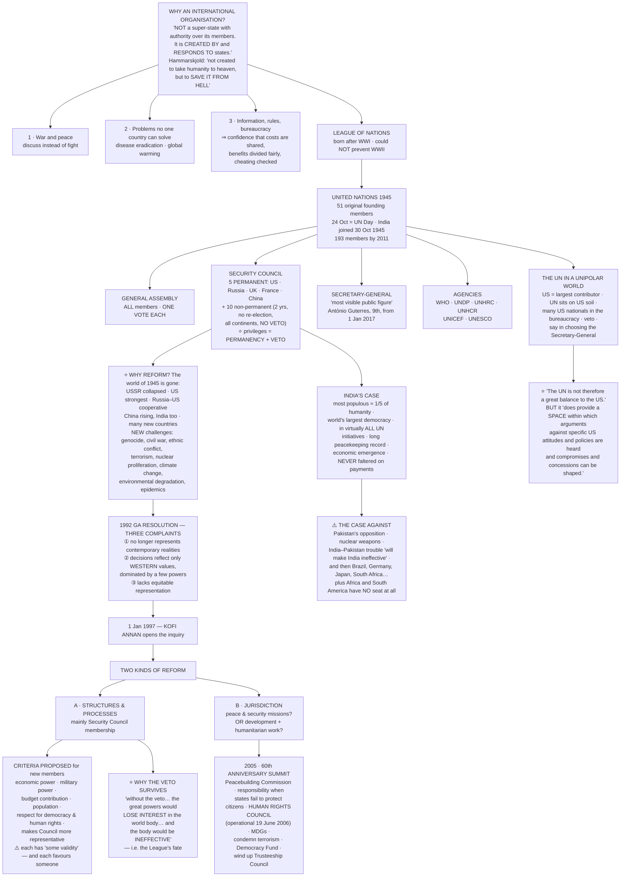

# Chapter 4: International Organisations

> ⚠️ **Filename note:** in this folder every PDF carries a **legacy name from the pre-rationalisation edition**. `04_Alternative_Centres_of_Power.pdf` actually contains **Chapter 4, "International Organisations."** See [`00_Index.md`](00_Index.md) for the full mapping.

## 🎯 Chapter Outcome — what you should walk away with

> **The one thing this chapter exists to teach:** an international organisation **"is not a super-state with authority over its members. It is created by and responds to states."** Everything that frustrates people about the UN — the veto, the paralysis, the talking — follows from that single sentence. And yet: **"The UN is an imperfect body, but without it the world would be worse off."**

**After reading it, here is what you now understand:**

1. **Why states bother building international organisations at all** — not idealism, but three concrete services: a place to settle conflicts short of war, a way to do things **no single country can do alone** (eradicating disease, stopping global warming), and — the subtlest one — a supplier of **information, rules and bureaucracy** that lets suspicious states trust each other enough to cooperate.
2. **The gap the chapter insists on** — *"recognising the need for cooperation and actually cooperating are two different things."* Nations agree they should act together and still cannot agree **how to share the costs, how to divide the benefits, or how to stop others cheating.**
3. **Where the UN came from** — the **League of Nations** failed to prevent the Second World War, and the UN was built as its successor, through a chain running Atlantic Charter → Declaration by United Nations → Tehran → Yalta → San Francisco.
4. **How it is structured** — one vote each in the General Assembly, but **five permanent members with the veto** in the Security Council, chosen because they were **"the most powerful immediately after the Second World War"** and **"the victors in the War."**
5. **What "reform" actually means** — two entirely different debates: reform of **structures and processes** (mainly the Security Council), and a review of the **jurisdiction** — which issues the UN should handle at all.
6. **Why reform is so hard** — every proposed criterion for new permanent membership is defensible *and* self-serving, and the veto cannot be abolished because **the great powers would simply lose interest and act outside the body**, exactly the failure that killed the League.
7. **India's case, and the case against it** — population, democracy, peacekeeping, unbroken payment of dues, economic emergence; against it, nuclear weapons, the Pakistan dispute, and the fact that admitting India forces the question of Brazil, Germany, Japan, South Africa, Africa and South America.
8. **What the UN can and cannot do to a superpower** — it **"is not therefore a great balance to the US"**, but it **"does provide a space within which arguments against specific US attitudes and policies are heard and compromises and concessions can be shaped."**

**Self-check — answer these three without looking:**
1. Give the chapter's definition of an international organisation, in its own words.
2. What were the **three complaints** in the 1992 General Assembly resolution about the Security Council?
3. Why does the chapter argue the veto should probably *not* be abolished, even though it looks undemocratic?

**Where this leads:** Ch 5 asks what "security" even means once you stop assuming it is about armies; Ch 6 shows these same organisations struggling with the environment; Ch 7 shows the economic machinery — IMF, World Bank, WTO — driving globalisation.

---

## 🗺️ The chapter in one picture

---

## PART 1 — WHY INTERNATIONAL ORGANISATIONS AT ALL?

### The two quotes that frame the chapter

The chapter opens with two cartoons mocking the UN as a **"talking shop"** — both about the **Lebanon crisis of 2006**, when Israel attacked Lebanon in June saying it was necessary to control **Hezbollah**, civilians were killed, the **UN passed a resolution only in August**, and the Israeli army withdrew only in **October**. Then it answers with two insiders:

> **"The United Nations was not created to take humanity to heaven, but to save it from hell."** — **Dag Hammarskjöld**, the UN's second Secretary-General

> **"Talking shop? Yes… But as Churchill put it, jaw-jaw is better than war-war. Isn't it better to have one place where all… countries in the world can get together, bore each other sometimes with their words rather than bore holes into each other on the battlefield?"** — **Shashi Tharoor**, former UN Under-Secretary-General for Communications and Public Information

> The margin note makes the same point mischievously: *"That's what they say about the parliament too — a talking shop. Does it mean that we need talking shops?"*

**The conclusion the chapter draws from both:** *"International organisations are not the answer to everything, but they are important."*

### ⭐ The definition — memorise this exactly

> **"An international organisation is not a super-state with authority over its members. It is created by and responds to states. It comes into being when states agree to its creation. Once created, it can help member states resolve their problems peacefully."**

Every criticism of the UN in this chapter — and every UPSC question about its "failure" — is answered from this sentence. The UN cannot enforce against a great power **because it was never built to**.

### The three functions

| | Function | The chapter's own example |
|---|---|---|
| **1** | **War and peace** | Countries "can, instead, discuss contentious issues and find peaceful solutions; indeed, even though this is rarely noticed, **most conflicts and differences are resolved without going to war**" |
| **2** | **Things no one country can do alone** | **Disease** — "some diseases can only be eradicated if everyone in the world cooperates in inoculating or vaccinating their populations." **Global warming** — each country can address the *effects*, "but in the end a more effective approach is to stop the warming itself. This requires at least all of the major industrial powers to cooperate" |
| **3** | **Producing information, rules and a bureaucracy** | So that members "have more confidence that costs will be shared properly, that the benefits will be fairly divided, and that once a member joins an agreement it will honour the terms and conditions" |

### ⚠️ The sentence students skip — and UPSC does not

> **"Unfortunately, recognising the need for cooperation and actually cooperating are two different things."**

The four obstacles named: nations cannot agree on **how best to cooperate**, **how to share the costs**, **how to ensure benefits are justly divided**, and **how to ensure others do not cheat on an agreement**.

This is the whole theory of collective action in one paragraph, and it is the reason function 3 above exists. Use it in any answer on climate negotiations or WTO deadlock.

---

## PART 2 — THE EVOLUTION OF THE UN

### From the League to the UN

The **First World War** "encouraged the world to invest in an international organisation to deal with conflict… As a result, the **League of Nations** was born. However, **despite its initial success, it could not prevent the Second World War (1939-45)**. Many more people died and were wounded in this war than ever before."

**The UN was founded as a successor to the League of Nations**, in 1945, immediately after the Second World War.

### 📅 The founding timeline — reproduce it in order

| Date | Event |
|---|---|
| **1941 August** | Signing of the **Atlantic Charter** by US President **Franklin D. Roosevelt** and British PM **Winston S. Churchill** |
| **1942 January** | **26 Allied nations** fighting the Axis Powers meet in **Washington, D.C.** to support the Atlantic Charter and sign the **'Declaration by United Nations'** |
| **1943 December** | **Tehran Conference** — Declaration of the Three Powers (US, Britain, Soviet Union) |
| **1945 February** | **Yalta Conference** of the **'Big Three'** (Roosevelt, Churchill, Stalin) decides to organise a United Nations conference |
| **1945 April–May** | The two-month **United Nations Conference on International Organisation at San Francisco** |
| **1945 June 26** | **Signing of the UN Charter by 50 nations** — Poland signed on October 15, **so the UN has 51 original founding members** |
| **1945 October 24** | **The UN was founded** — hence **October 24 is UN Day** |
| **1945 October 30** | **India joins the UN** |

> **Two trap-facts in that table.** (i) **50 signed, 51 founding members** — Poland signed late. (ii) The UN was *signed* on 26 June but *founded* on **24 October**; UN Day is the October date.

### The UN's objective, in the chapter's words

> The UN "tried to achieve what the League could not between the two world wars. The UN's objective is to **prevent international conflict and to facilitate cooperation among states.** It was founded with the hope that it would act to **stop the conflicts between states escalating into war** and, if war broke out, **to limit the extent of hostilities**. Furthermore, since **conflicts often arose from the lack of social and economic development**, the UN was intended to bring countries together to improve the prospects of social and economic development all over the world."

That last clause matters: **development is written into the UN's founding purpose**, not bolted on later. India uses exactly this argument (Part 5).

### Membership and structure

- **By 2011, the UN had 193 member states** — "these included almost all independent states."
- **General Assembly:** "all members have one vote each."
- **Security Council:** five permanent members — **the United States, Russia, the United Kingdom, France and China**. Why these five? *"These states were selected as permanent members as they were **the most powerful immediately after the Second World War** and because they constituted **the victors in the War**."*
- **Secretary-General:** "the UN's most visible public figure, and the representative head." **António Guterres**, the **ninth** Secretary-General, took over on **1 January 2017**; he was **Prime Minister of Portugal (1995–2002)** and **UN High Commissioner for Refugees (2005–2015)**.

**Where issues are handled:**

| Type of issue | Where |
|---|---|
| War, peace, differences between member states | **General Assembly** *and* **Security Council** |
| Social and economic issues | **WHO**, **UNDP**, **UNHRC**, **UNHCR**, **UNICEF**, **UNESCO**, among others |

### 📜 The nine Secretaries-General — the details the chapter actually gives

| # | Name | Country | Known for | Why the entry ends badly |
|---|---|---|---|---|
| 1 | **Trygve Lie** (1946–52) | Norway | Lawyer and foreign minister; worked for a **ceasefire between India and Pakistan on Kashmir** | Criticised for failure to quickly end the **Korean war**; USSR opposed a second term; **resigned** |
| 2 | **Dag Hammarskjöld** (1953–61) | Sweden | Economist and lawyer; **Suez Canal** dispute; **decolonisation of Africa**; **Nobel Peace Prize posthumously, 1961**, for the **Congo crisis** | USSR and France criticised his role in Africa |
| 3 | **U Thant** (1961–71) | Burma (Myanmar) | Teacher and diplomat; **Cuban Missile Crisis**; ended the Congo crisis; **UN Peacekeeping Force in Cyprus** | Criticised the US during the **Vietnam War** |
| 4 | **Kurt Waldheim** (1972–81) | Austria | Namibia and Lebanon; oversaw the **relief operation in Bangladesh** | **China blocked** his bid for a third term |
| 5 | **Javier Pérez de Cuéllar** (1982–91) | Peru | Cyprus, Afghanistan, El Salvador; mediated Britain–Argentina after the **Falklands War**; negotiated **Namibia's independence** | — |
| 6 | **Boutros Boutros-Ghali** (1992–96) | Egypt | Issued ***An Agenda for Peace***; successful UN operation in **Mozambique** | Blamed for failures in **Bosnia, Somalia and Rwanda**; **the US blocked** a second term |
| 7 | **Kofi A. Annan** (1997–2006) | Ghana | **Global Fund** to fight AIDS, TB and Malaria; declared the US-led **invasion of Iraq illegal**; established the **Peacebuilding Commission and Human Rights Council in 2005**; **2001 Nobel Peace Prize** | — |
| 8 | **Ban Ki-moon** (2007–16) | Republic of Korea | **Second Asian** to hold the post; **climate change**; MDGs and SDGs; **creation of UN Women**; conflict resolution and nuclear disarmament | — |
| 9 | **António Guterres** (2017– ) | Portugal | Former PM of Portugal; **UNHCR 2005–2015**; President of the **Socialist International 1999–2005** | — |

> **The pattern worth naming in an answer:** the post is **hostage to the veto**. The USSR ended Lie's tenure, China blocked Waldheim, the US blocked Boutros-Ghali. A Secretary-General who displeases a permanent member does not get a second term — which tells you exactly how much independence the office really has.

---

## PART 3 — REFORM OF THE UN AFTER THE COLD WAR

### The two kinds of reform — keep them separate

> "Two basic kinds of reforms face the UN: **reform of the organisation's structures and processes**; and **a review of the issues that fall within the jurisdiction of the organisation**. Almost everyone is agreed that both aspects of reform are necessary. **What they cannot agree on is precisely what is to be done, how it is to be done, and when it is to be done.**"

| | **A · Structures and processes** | **B · Jurisdiction** |
|---|---|---|
| **The main fight** | Functioning of the **Security Council**; increase in **permanent and non-permanent** membership so "the realities of contemporary world politics are better reflected" | Should the UN do **peace and security missions** more effectively — or should its role be **confined to development and humanitarian work**? |
| **Who wants what** | Proposals to increase membership from **Asia, Africa and South America**. The **US and other Western countries** want improvements in **budgetary procedures and administration** | The "development and humanitarian" camp lists: **health, education, environment, population control, human rights, gender and social justice** |

### ⭐ Why the world of 1945 no longer fits — the five changes

The UN's organisation "reflected the realities of world politics after the Second World War. **After the Cold War, those realities are different.**"

1. **The Soviet Union has collapsed.**
2. **The US is the strongest power.**
3. The relationship between **Russia**, the successor to the Soviet Union, **and the US is much more cooperative**.
4. **China is fast emerging as a great power, and India also is** rising.
5. **Many new countries** have joined (those that became independent from the Soviet Union or former communist states in eastern Europe).

Plus: **"A whole new set of challenges confronts the world"** — *genocide, civil war, ethnic conflict, terrorism, nuclear proliferation, climate change, environmental degradation, epidemics.*

> **This is the highest-value list in the chapter.** Every "should the UN be reformed?" question is answered by pairing **an organisation designed for inter-state war** with **a threat list that is almost entirely non-inter-state**.

### The 1992 resolution — the three complaints ⭐

The UN General Assembly adopted a resolution reflecting **three main complaints**:

1. **The Security Council no longer represents contemporary political realities.**
2. **Its decisions reflect only Western values and interests and are dominated by a few powers.**
3. **It lacks equitable representation.**

Then, on **1 January 1997**, Secretary-General **Kofi Annan** initiated an inquiry into how the UN should be reformed — including **how new Security Council members should be chosen**.

### The six criteria proposed for new members

A new permanent or non-permanent member, it has been suggested, should be:

1. A **major economic power**
2. A **major military power**
3. A **substantial contributor to the UN budget**
4. A **big nation in terms of its population**
5. A nation that **respects democracy and human rights**
6. A country that would make the Council **more representative of the world's diversity** — in geography, economic systems, and culture

> **The chapter's verdict, which is the exam point:** *"Clearly, each of these criteria has some validity. Governments saw advantages in some criteria and disadvantages in others **depending on their interests and aspirations**."*

**And then it lists the unanswerable questions** — reproduce two or three of these in any Mains answer on UN reform:
- How big an economic or military power do you have to be to qualify?
- What level of budget contribution "would enable a state to **buy its way into** the Council"?
- Is a **big population an asset or a liability**?
- If democracy and human rights were the criteria, countries with excellent records would qualify — **but would they be effective as Council members?**
- Does equitable geographical representation mean one seat each from **Asia, Africa, Latin America and the Caribbean** — or by **regions/sub-regions** rather than continents?
- Why decide by geography at all? **Why not by levels of economic development** — i.e. more seats for the developing world? But "the developing world consists of countries at many different levels of development."
- **What about culture?** Should different 'civilisations' be represented — and "how does one divide the world by civilisations or cultures given that nations have so many cultural streams within their borders?"

### 💰 Major contributors to the UN regular budget, 2019

| Rank | State | % | | Rank | State | % |
|---|---|---|---|---|---|---|
| 1 | **USA** | **22.0** | | 11 | Republic of Korea | 2.2 |
| 2 | **China** | **12.0** | | 12 | Australia | 2.2 |
| 3 | Japan | 8.5 | | 13 | Spain | 2.1 |
| 4 | Germany | 6.0 | | 14 | Turkey | 1.3 |
| 5 | UK | 4.5 | | 15 | Netherlands | 1.3 |
| 6 | France | 4.4 | | 16 | Mexico | 1.2 |
| 7 | Italy | 3.3 | | 17 | Saudi Arabia | 1.1 |
| 8 | Brazil | 2.9 | | 18 | Switzerland | 1.1 |
| 9 | Canada | 2.7 | | 19 | Argentina | 0.9 |
| 10 | Russia | 2.4 | | 20 | Sweden | 0.9 |
| | | | | **21** | **India** | **0.8** |

> ⚠️ **Notice the awkward fact for India's own argument.** India invokes the "substantial contributor" criterion — but ranks **21st at 0.8%**, below Sweden and Argentina, while **the US alone pays 22%**. Do not quote the budget criterion as a point *in India's favour*; the chapter's own table contradicts it. India's real claims are population, democracy, peacekeeping, and **an unbroken payment record** (never faltering ≠ paying the most).

---

## PART 4 — THE VETO, AND WHY IT SURVIVES

### The structure

- The Security Council has **five permanent members and ten non-permanent members**.
- The Charter "gave the permanent members a **privileged position to bring about stability** in the world after the Second World War."
- **The main privileges of the five permanent members are permanency and the veto power.**
- **Non-permanent members** serve **two years at a time**, and "a country **cannot be re-elected immediately** after completing a term of two years." They are elected "in a manner so that they **represent all continents** of the world."
- **Most importantly, the non-permanent members do not have the veto power.**

### ⭐ What the veto actually is

> "In taking decisions, the Security Council proceeds by voting. **All members have one vote.** However, the permanent members can **vote in a negative manner** so that even if all other permanent and non-permanent members vote for a particular decision, **any permanent member's negative vote can stall the decision. This negative vote is the veto.**"

**Three precision points UPSC tests:**
1. The veto is a **negative power only** — it stalls; it does not compel.
2. **One veto is enough** to stall a resolution.
3. **Only permanent members** have it — not the Secretary-General, not non-permanent members.

### The argument for abolishing it

"Many perceived the veto to be **in conflict with the concept of democracy and sovereign equality** in the UN and thought that the veto was **no longer right or relevant**."

> The margin cartoon character makes the sharper version: *"That's very unfair! It's actually the **weaker** countries who need a veto, not those who already have so much power."*

### ⭐ The argument against — the one to remember

> "While there has been a move to abolish or modify the veto system, there is also a realisation that **the permanent members are unlikely to agree to such a reform**. Also, the world may not be ready for such a radical step even though the Cold War is over. **Without the veto, there is the danger as in 1945 that the great powers would lose interest in the world body, that they would do what they pleased outside it, and that without their support and involvement the body would be ineffective.**"

**This is the whole realist defence of the UN in one sentence, and it is the League of Nations lesson restated.** The League was more democratic in form and **irrelevant in fact**. The veto is the price of keeping the powerful *inside* the room.

> **Structural fact to pair with it:** "the membership of the UN Security Council was **expanded from 11 to 15 in 1965**. But **there was no change in the number of permanent members. Since then, the size of the Council has remained stationary.**" — 60+ years of complete freeze on permanent membership.

---

## PART 5 — JURISDICTION: THE 2005 SUMMIT

As the UN completed **60 years**, the heads of all member states met in **September 2005** to celebrate the anniversary and review the situation. They decided on **seven steps** to make the UN more relevant:

1. **Creation of a Peacebuilding Commission**
2. **Acceptance of the responsibility of the international community in case of failures of national governments to protect their own citizens from atrocities**
3. **Establishment of a Human Rights Council** — *operational since 19 June 2006*
4. Agreements to achieve the **Millennium Development Goals (MDGs)**
5. **Condemnation of terrorism in all its forms and manifestations**
6. **Creation of a Democracy Fund**
7. An agreement to **wind up the Trusteeship Council**

> Item 2 is the **Responsibility to Protect (R2P)** doctrine in plain words — memorise it in the chapter's phrasing, because it is a direct challenge to sovereignty and gets asked as such.

### ⚠️ And the chapter immediately undercuts them

*"It is not hard to see that these are equally contentious issues for the UN."* — the questions it raises:
- What should a Peacebuilding Commission **do**? "There are any number of conflicts all over the world. **Which ones should it intervene in?** Is it possible or even desirable for it to intervene in each and every conflict?"
- What **is** the responsibility of the international community in dealing with atrocities? **"What are human rights and who should determine the level of human rights violations"** and the course of action?
- Given that so many countries are still developing, **how realistic** is an ambitious set of goals like the **Sustainable Development Goals**?
- **"Can there be agreement on a definition of terrorism?"**
- **How shall the UN use funds to promote democracy?**

> That fourth one — **no agreed definition of terrorism** — is the single most quotable line here, and it connects directly to India's long push for a **Comprehensive Convention on International Terrorism**.

---

## PART 6 — INDIA AND UN REFORMS

### India's general position

India has supported restructuring **on several grounds**:
- A **strengthened and revitalised UN is desirable in a changing world**.
- It supports **an enhanced role for the UN in promoting development and cooperation** among states.
- **"India believes that development should be central to the UN's agenda as it is a vital precondition for the maintenance of international peace and security."**

### India's argument on Security Council composition

- The composition **"has remained largely static while the UN General Assembly membership has expanded considerably"** — India considers this **"has harmed the representative character of the Security Council."**
- An **expanded Council, with more representation, will enjoy greater support in the world community.**
- **"The overwhelming majority of the UN General Assembly members now are developing countries"** — therefore they **"should also have a role in shaping the decisions in the Security Council which affect them."**
- India supports an increase in **both permanent and non-permanent** members.
- The activities of the Security Council **"have greatly expanded in the past few years"**, and **"the success of the Security Council's actions depends upon the political support of the international community."** Therefore any restructuring **"should be broad-based"** — and **"the Security Council should have more developing countries in it."**

### ⭐ India's own claim — the seven arguments

| | Argument |
|---|---|
| 1 | **The most populous country in the world**, comprising **almost one-fifth of the world population** |
| 2 | **The world's largest democracy** |
| 3 | Has **"participated in virtually all of the initiatives of the UN"** |
| 4 | Its role in **UN peacekeeping** "is a long and substantial one" |
| 5 | **Economic emergence on the world stage** |
| 6 | Has made **regular financial contributions and never faltered on its payments** |
| 7 | **Symbolic importance** — permanent membership "signifies a country's growing importance in world affairs… **the reputation for being powerful makes you more influential**" |

> Argument 7 is the subtlest and most useful: India wants the seat partly because **having it makes everything else in foreign policy easier**. Status is itself a resource.

### ⚠️ The case against India — reproduce all four

*"Despite India's wish to be a permanent veto-wielding member of the UN, some countries question its inclusion."*

1. **Pakistan**, "with which India has troubled relations, is not the only country that is reluctant."
2. Some countries are **concerned about India's nuclear weapons capabilities**.
3. Others think **"its difficulties with Pakistan will make India ineffective as a permanent member."**
4. **The floodgates problem** — "if India is included, then other emerging powers will have to be accommodated such as **Brazil, Germany, Japan, perhaps even South Africa**, whom they oppose." And **"Africa and South America must be represented in any expansion of the permanent membership since those are the only continents not to have representation in the present structure."**

**The chapter's conclusion:** *"Given these concerns, it may not be very easy for India or anyone else to become a permanent member of the UN in the near future."*

---

## PART 7 — THE UN IN A UNIPOLAR WORLD

### Why US power cannot easily be checked

**First, outside the UN:** "with the disappearance of the Soviet Union, the US stands as the only superpower. **Its military and economic power allow it to ignore the UN or any other international organisation.**"

**Second, inside the UN — five sources of influence:**

| | Source |
|---|---|
| 1 | **The single largest contributor** to the UN — "unmatched financial power" |
| 2 | **The UN is physically located within US territory** — "gives Washington additional sources of influence" |
| 3 | **Many US nationals in the UN bureaucracy** |
| 4 | **The veto** — "the US can stop any moves that it finds annoying or damaging to its interests or the interests of its friends and allies" |
| 5 | **Considerable say in the choice of the Secretary-General** |

And: "The US can and does use this power to **'split' the rest of the world** and to reduce opposition to its policies."

> The margin cartoon asks the practical version: *"What happens if the UN invites someone to New York but the US does not issue a visa?"* — a real consequence of point 2.

### ⭐ The balanced verdict — the chapter's own answer

> **"The UN is not therefore a great balance to the US.** Nevertheless, in a unipolar world in which the US is dominant, the UN **can and has served to bring the US and the rest of the world into discussions** over various issues. US leaders, in spite of their frequent criticism of the UN, **do see the organisation as serving a purpose** in bringing together over 190 nations in dealing with conflict and social and economic development. As for the rest of the world, **the UN provides an arena in which it is possible to modify US attitudes and policies.** While the rest of the world is rarely united against Washington, and while it is virtually impossible to 'balance' US power, **the UN does provide a space within which arguments against specific US attitudes and policies are heard and compromises and concessions can be shaped.**"

### The closing judgment

> **"The UN is an imperfect body, but without it the world would be worse off."**

The reason given is **interdependence**: "Given the growing connections and links between societies and issues — what we often call 'interdependence' — it is hard to imagine how **more than seven billion people** would live together without an organisation such as the UN. **Technology promises to increase planetary interdependence, and therefore the importance of the UN will only increase.**"

---

## PART 8 — THE OTHER ORGANISATIONS (the boxes — do not skip these)

These sit in the margins of the chapter and are **very heavily examined in Prelims**.

### 💵 IMF — International Monetary Fund
- **"Oversees those financial institutions and regulations that act at the international level."**
- **190 member countries** (as on 19 February 2024) — **"but they do not enjoy an equal say."**
- **G-7 hold 41.29% of votes:** US **16.52%**, Japan **6.15%**, Germany **5.32%**, France **4.03%**, UK **4.03%**, Italy **3.02%**, Canada **2.22%**.
- Other major members: **China 6.09%, India 2.64%, Russia 2.59%, Brazil 2.22%, Saudi Arabia 2.02%.**

> ⭐ **The single most examinable fact:** the IMF is **weighted voting**, unlike the UN General Assembly's one-state-one-vote. Seven countries hold **over 41%**. India's **2.64%** is less than one-sixth of the US share.

### 🏦 World Bank
- **Created during the Second World War, in 1944.**
- Activities **focused on the developing countries.**
- Works for: **human development** (education, health) · **agriculture and rural development** (irrigation, rural services) · **environmental protection** (pollution reduction, establishing and enforcing regulations) · **infrastructure** (roads, urban regeneration, electricity) · **governance** (anti-corruption, development of legal institutions).
- Provides **loans and grants** to member countries — "in this way, it exercises **enormous influence on the economic policies of developing countries**."
- **Criticised for:** "setting the economic agenda of the poorer nations, **attaching stringent conditions to its loans** and **forcing free market reforms**."

### 🌐 WTO — World Trade Organisation
- **"Sets the rules for global trade."**
- Set up in **1995** as the successor to the **General Agreement on Trade and Tariffs (GATT)**, created after the Second World War.
- **164 members** (as on 29 July 2016).
- **"All decisions are taken unanimously"** — but the major economic powers **US, EU and Japan** "have managed to use the WTO to frame rules of trade to advance their own interests."
- Developing countries complain of **non-transparent procedures and being pushed around by big powers**.

> **The paradox to notice:** the WTO is formally the *most* democratic of the three (unanimity, not weighted votes) and is still criticised for domination. Formal equality ≠ real equality — the same lesson as the veto, from the other direction.

### ☢️ IAEA — International Atomic Energy Agency
- **Established in 1957.**
- Came into being to implement US President **Dwight Eisenhower's "Atoms for Peace"** proposal.
- Seeks to **promote the peaceful use of nuclear energy and to prevent its use for military purposes.**
- **"IAEA teams regularly inspect nuclear facilities all over the world to ensure that civilian reactors are not being used for military purposes."**

### ✊ Amnesty International *(an NGO, not an inter-governmental body)*
- Campaigns for **the protection of human rights all over the world**.
- Promotes respect for all the rights in the **Universal Declaration of Human Rights**.
- **"It believes that human rights are interdependent and indivisible."**
- Prepares and publishes **reports on human rights**. "Governments are not always happy with these reports since **a major focus of Amnesty is the misconduct of government authorities.**"

### 👁️ Human Rights Watch *(also an NGO)*
- Involved in **research and advocacy on human rights**.
- **"The largest international human rights organisation in the US."**
- **Draws the global media's attention to human rights abuses.**
- Helped build international coalitions: **the campaigns to ban landmines, to stop the use of child soldiers, and to establish the International Criminal Court.**

---

## 🧠 Memory hooks

**The definition (say it verbatim):** *not a super-state with authority over its members — created by and responds to states.*

**Founding chain:** **A-D-T-Y-S** → **A**tlantic Charter (1941) → **D**eclaration by United Nations (1942) → **T**ehran (1943) → **Y**alta (1945 Feb) → **S**an Francisco (1945 Apr–May).

**51 not 50.** 50 signed on 26 June; **Poland signed 15 October** → 51 original founding members.

**Two Octobers:** **24 Oct** UN founded (UN Day) · **30 Oct** India joins.

**Permanent five = the 1945 winners.** US, Russia, UK, France, China — "the most powerful immediately after the Second World War… the victors in the War."

**The 1992 complaints — R-W-E:** **R**ealities (no longer represents them) · **W**estern values dominate · **E**quitable representation lacking.

**Council arithmetic:** **5 + 10 = 15**, expanded from **11 in 1965**, permanent members **unchanged ever since**.

**The three institutions and their voting:** **UN GA** = one state one vote · **IMF/World Bank** = weighted by money · **WTO** = unanimity. All three still favour the powerful, by three different mechanisms.

**Dates block:** IAEA **1957** · World Bank **1944** · WTO **1995** (from GATT) · Human Rights Council operational **19 June 2006** · Guterres from **1 January 2017**.

---

## ❓ Expected UPSC questions

1. *"An international organisation is not a super-state with authority over its members."* In light of this, examine whether the UN can be said to have failed. **(250 words)**
2. **"Reforming the UN means restructuring of the Security Council."** Do you agree? Give arguments for and against. *(This is exercise 12 of the chapter, and a standing Mains favourite.)*
3. Critically evaluate the difficulties involved in implementing the suggested reforms to reconstruct the UN. *(Exercise 10.)*
4. "Though the UN has failed in preventing wars and related miseries, nations prefer its continuation." What makes the UN an indispensable organisation? *(Exercise 11.)*
5. Assess India's claim to permanent membership of the UN Security Council, and the objections to it.
6. The veto is criticised as undemocratic, yet the chapter argues against abolishing it. Reconstruct both arguments and take a position.

**4-line skeleton for Q1 —**
> **Frame:** the UN was designed as an instrument of states, not above them; "failure" must be judged against that design.
> **Concede:** Lebanon 2006 — resolution only in August, withdrawal only in October; Bosnia, Somalia, Rwanda; no agreed definition of terrorism; the Council frozen since 1965.
> **Counter:** most conflicts are resolved without war; the specialised agencies (WHO, UNICEF, UNHCR, UNDP) deliver continuously; it is "an arena in which it is possible to modify US attitudes"; R2P accepted in 2005.
> **Conclude:** the UN fails precisely where its members refuse to act — the failure is of states, expressed through the organisation. *"Imperfect, but without it the world would be worse off."*

---

## ⚡ 60-second revision

**What it is** — not a super-state; **created by and responds to states**. Three jobs: peace, collective problems, and **rules + information** so cooperation is trusted.

**Origins** — League failed to stop WWII → UN 1945. Atlantic Charter → Declaration by United Nations → Tehran → Yalta → San Francisco. **50 signed, 51 founders. Founded 24 Oct; India joined 30 Oct. 193 members by 2011.**

**Structure** — GA: one vote each. SC: **5 permanent (US, Russia, UK, France, China) + 10 non-permanent** (2 years, no immediate re-election, all continents, **no veto**). Privileges of the five = **permanency + veto**. Secretary-General **Guterres, 9th, from 1 Jan 2017**.

**Why reform** — USSR gone, US strongest, Russia–US cooperative, China and India rising, many new states, and a new threat list (genocide, civil war, ethnic conflict, terrorism, nuclear proliferation, climate change, environmental degradation, epidemics). **1992 GA resolution: three complaints.** **Kofi Annan's inquiry, 1 Jan 1997.**

**Two reform tracks** — structures/processes vs jurisdiction. **Six criteria** for new members, each valid and each self-serving. Council went **11 → 15 in 1965**; permanent membership never changed.

**The veto** — a negative vote; one stalls a resolution. Undemocratic, but abolishing it risks **the great powers losing interest and acting outside** — the League's fate.

**2005 summit** — Peacebuilding Commission · **responsibility to protect** · Human Rights Council (19 June 2006) · MDGs · condemn terrorism · Democracy Fund · wind up Trusteeship Council.

**India** — supports restructuring, development-centric agenda, more developing countries on the Council; claims population, largest democracy, all UN initiatives, peacekeeping, economic rise, never faltered on payments, symbolic status. Against: Pakistan, nuclear weapons, the India–Pakistan dispute, and the floodgates (Brazil, Germany, Japan, South Africa, Africa, South America). **India is 21st in budget contribution at 0.8%.**

**Unipolarity** — US influence = biggest contributor + UN on US soil + nationals in bureaucracy + veto + say in choosing the SG. **"Not a great balance to the US"** — but **a space where arguments are heard and concessions shaped**.

**The boxes** — IMF (190 members, **weighted votes**, G-7 = 41.29%, India 2.64%) · World Bank (**1944**, conditionalities) · WTO (**1995**, ex-GATT, 164 members, unanimity) · IAEA (**1957**, Atoms for Peace) · Amnesty International and Human Rights Watch (**NGOs**).

**The last line** — *"The UN is an imperfect body, but without it the world would be worse off."*

---

## 🔗 Practice this chapter

**Prelims:** [2025 Q53](../../../03_PYQ_Prelims/2025.md) — Inter-State Council vs National Security Council vs Zonal Councils *(constitutional / statutory / executive — the same classification logic)* · [2026 Q63](../../../03_PYQ_Prelims/2026.md) — organisations and their controlling ministries

**Chapter exercises worth actually doing:** Q8 (functions of the Security Council), Q9 (support India's candidature), Q10 (difficulties of reform), Q11 (why the UN is indispensable), Q12 (does reform = Security Council restructuring).

---

## Extra UPSC-style questions

1. The UN General Assembly gives every state one vote; the IMF weights votes by financial contribution; the WTO decides by unanimity. **All three are still criticised for being dominated by the powerful.** What does this tell us about the relationship between formal rules and real power?
2. *"Development should be central to the UN's agenda as it is a vital precondition for the maintenance of international peace and security."* Examine India's position. **(250 words)**
3. Trace how the veto has shaped the office of the Secretary-General, using the record of Trygve Lie, Kurt Waldheim and Boutros Boutros-Ghali.
4. **Prelims trap check:** Which is/are correct? (i) The Secretary-General may use the veto when dissatisfied with a decision. (ii) The Security Council was expanded from 11 to 15 members in 1965. (iii) India is among the top ten contributors to the UN regular budget. (iv) The Human Rights Council became operational in 2006. → **(ii) and (iv) only.** *(The Secretary-General has no veto; India ranks **21st** at 0.8%.)*
5. **Prelims trap check:** Match — Peacebuilding Commission, Human Rights Council, Democracy Fund and the winding up of the Trusteeship Council were all agreed at which event? → **the September 2005 summit marking the UN's 60th anniversary.**

---

*Source: written by reading `04_Alternative_Centres_of_Power.pdf` in full — which in the current NCERT edition (Reprint 2026–27) actually contains **Chapter 4, International Organisations**. Covers the overview, the Lebanon 2006 cartoons, the Hammarskjöld and Tharoor quotes, the definition and functions of international organisations, the full founding timeline, the structure and agencies, the complete Secretaries-General table, both reform tracks, the 1992 resolution, the six membership criteria, the 2019 budget-contribution table, the veto discussion, the 2005 summit decisions, the India section in full, the unipolarity section, every margin box (IMF, World Bank, WTO, IAEA, Amnesty International, Human Rights Watch), all margin questions and the STEPS classroom activity, and all twelve exercises.*
