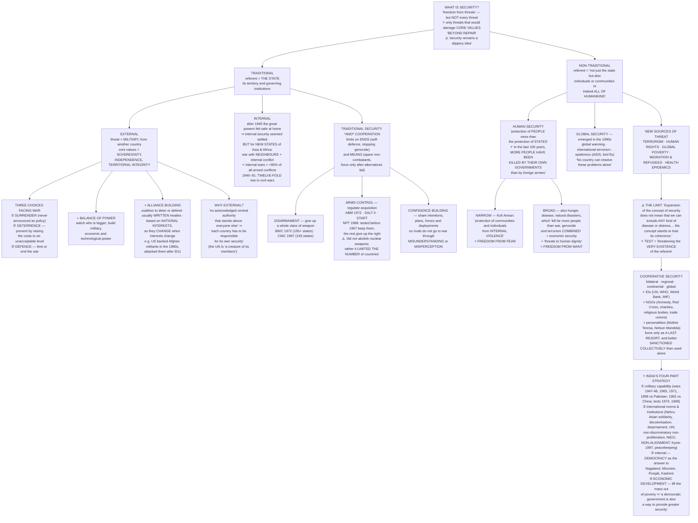

# Chapter 5: Security in the Contemporary World

> ⚠️ **Filename note:** in this folder every PDF carries a **legacy name from the pre-rationalisation edition**. `05_Contemporary_South_Asia.pdf` actually contains **Chapter 5, "Security in the Contemporary World."** See [`00_Index.md`](00_Index.md) for the full mapping.

## 🎯 Chapter Outcome — what you should walk away with

> **The one thing this chapter exists to teach:** *"security relates only to **extremely dangerous threats** — threats that could so endanger core values that those values would be **damaged beyond repair** if we did not do something."* Everything else in the chapter is an argument about **whose** core values, and **which** threats.

**After reading it, here is what you now understand:**

1. **Why the word "security" is politically dangerous** — the chapter opens by warning that the term is *"used to stop debate and discussion… too important or secret to be debated openly."* In a democracy, **"surely this cannot be the case."** That is a political claim, not a definitional one, and it frames the whole chapter.
2. **The threshold test** — not every threat is a security threat, or *"we would be paralysed… everywhere we looked, the world would be full of dangers."* The test is **damage beyond repair to core values.**
3. **The traditional conception** — the threat is **military**, the source is **another country**, the core values at risk are **sovereignty, independence and territorial integrity**, and a government has exactly **three choices**: surrender, deter, or defend.
4. **The four components of traditional security policy** — **deterrence, defence, balance of power, alliance building.**
5. **Why traditional security is external-facing** — because *"in world politics, there is no acknowledged central authority that stands above everyone else"*, so **"each country has to be responsible for its own security."**
6. **That traditional security is not only about fighting** — it includes **cooperation**: limits on the ends and means of war, **disarmament, arms control, and confidence building.**
7. **The non-traditional turn** — it changes the **referent**. Ask *"Security for who?"* and the answer becomes **"not just the state but also individuals or communities or indeed all of humankind."**
8. **The single most quotable statistic in the book** — *"during the last 100 years, **more people have been killed by their own governments than by foreign armies**."*
9. **The narrow vs broad human security debate** — narrow = *"protection of communities and individuals from internal violence"* (Kofi Annan); broad = also **hunger, disease and natural disasters**, which *"kill far more people than war, genocide and terrorism combined"*. Narrow = **freedom from fear**; broad = **freedom from want**.
10. **The new threat list, and why force cannot solve it** — terrorism, human rights, global poverty, migration and refugees, health epidemics. *"In most cases, the use of military force would only make matters worse!"*
11. **India's four-component security strategy** — military capability, international norms and institutions, internal security through democracy, and **economic development as security**.

**Self-check — answer these three without looking:**
1. What are a government's **three basic choices** when faced with the threat of war, and what are deterrence and defence?
2. What is the **referent** of security, and how does it differ between the traditional and non-traditional conceptions?
3. Give the **minimum common criterion** an issue must meet to qualify as a security problem.

**Where this leads:** Ch 6 takes one item off the non-traditional list — the environment — and shows the global bargaining it produces; Ch 7 shows how globalisation makes borders **"less meaningful than in the past"**, exactly as the epidemics section argues here.

---

## 🗺️ The chapter in one picture

---

## PART 1 — WHAT IS SECURITY?

### The political warning in the overview — do not skip it

> *"Often, they are used to **stop debate and discussion**. We hear that an issue is a security issue and that it is vital for the well-being of the country. The implication is that **it is too important or secret to be debated and discussed openly**… Security seems to be something that is not the business of the ordinary citizen. **In a democracy, surely this cannot be the case.**"*

> The margin voice pushes it further: *"Who decides about my security? Some leaders and experts? Can't I decide what is my security?"*

**Why this matters for Mains:** this is the chapter's licence for the entire non-traditional half. If security is a democratic question, then citizens — not only generals — get to define it. Open any "human security" answer with this.

### ⭐ Building the definition in three steps

**Step 1 — the basic idea.** *"At its most basic, security implies **freedom from threats**."*

**Step 2 — the problem with that.** *"Human existence and the life of a country are full of threats… Every time a person steps out of his or her house, there is some degree of threat… **Our world would be saturated with security issues** if we took such a broad view."*

**Step 3 — the threshold.** Therefore students of security say **only threats to "core values"** count. And even then:

> **"Security relates only to extremely dangerous threats — threats that could so endanger core values that those values would be damaged beyond repair if we did not do something to deal with the situation."**

### ⚠️ The four questions the chapter leaves genuinely open

*"Having said that, we must admit that **security remains a slippery idea**."*

1. **Whose core values?** *"The core values of the country as a whole? The core values of ordinary women and men in the street? **Do governments, on behalf of citizens, always have the same notion of core values as the ordinary citizen?**"*
2. **How intense must a threat be?** "Surely there are big and small threats to virtually every value we hold dear."
3. **Have societies always had the same conception of security?** *"It would be surprising if they did because so many things change in the world around us."*
4. **Do all societies share one conception now?** *"It would be amazing if six hundred and fifty crore people, organised in nearly 200 countries, had the same conception of security!"*

> **This is the answer to the standard question "Define security".** The correct answer is that the chapter *refuses* a single definition and says the concept is **contextual**. Say that explicitly — it is the examiner's point.

---

## PART 2 — TRADITIONAL SECURITY: THE EXTERNAL FACE

### The basic model

> *"In the traditional conception of security, the greatest danger to a country is from **military threats**. The source of this danger is **another country** which by threatening military action endangers the core values of **sovereignty, independence and territorial integrity**."*

And it is not only soldiers who suffer: *"It is unlikely that in a war only soldiers will be hurt or killed. Quite often, **ordinary men and women are made targets of war, to break their support of the war**."*

### ⭐ The three basic choices — reproduce these exactly

| | Choice | The chapter's phrasing |
|---|---|---|
| 1 | **Surrender** | Governments "may choose to surrender when actually confronted by war, **but they will not advertise this as the policy of the country**" |
| 2 | **Deterrence** | "To prevent the other side from attacking by **promising to raise the costs of war to an unacceptable level**" — *"security policy is concerned with **preventing war, which is called deterrence**"* |
| 3 | **Defence** | "To defend itself when war actually breaks out so as to **deny the attacking country its objectives** and to turn back or defeat the attacking forces altogether" — *"**limiting or ending war, which is called defence**"* |

> **The distinction UPSC tests:** **deterrence acts *before* war; defence acts *during* it.** Deterrence prevents; defence limits or ends.

### Component 3 — balance of power

> "When countries look around them, they see that **some countries are bigger and stronger**. This is a clue to **who might be a threat in the future**. For instance, a neighbouring country may not say it is preparing for attack. There may be no obvious reason for attack. **But the fact that this country is very powerful is a sign that at some point in the future it may choose to be aggressive.**"

Governments therefore work to maintain a favourable balance of power, **"especially those close by, those with whom they have differences, or with those they have had conflicts in the past."**

**How is it achieved?** *"A good part of maintaining a balance of power is to **build up one's military power**, although **economic and technological power are also important since they are the basis for military power**."*

> **Note the logic carefully — it is counter-intuitive and examinable:** balance of power responds to **capability, not intention**. A neighbour need not threaten anything; being strong is itself the signal.

### Component 4 — alliance building

> "An alliance is **a coalition of states that coordinate their actions to deter or defend against military attack**. Most alliances are formalised in **written treaties** and are based on a fairly clear identification of **who constitutes the threat**. Countries form alliances **to increase their effective power relative to another country or alliance**."

⭐ **"Alliances are based on national interests and can change when national interests change."**

**The chapter's own example:** *"the US backed the Islamic militants in Afghanistan against the Soviet Union in the 1980s, but later attacked them when **Al Qaeda** — a group of Islamic militants led by **Osama bin Laden** — launched terrorist strikes against America on **11 September 2001**."*

### ⭐ Why traditional security looks outward — the anarchy argument

> *"In the traditional view of security, most threats to a country's security come from outside its borders. That is because **the international system is a rather brutal arena in which there is no central authority capable of controlling behaviour**. Within a country, the threat of violence is regulated by an acknowledged central authority — **the government**. In world politics, there is no acknowledged central authority that stands above everyone else. It is tempting to think that the United Nations is such an authority or could become such an institution. **However, as presently constituted, the UN is a creature of its members and has authority only to the extent that the membership allows it to have authority and obeys it.** So, in world politics, **each country has to be responsible for its own security.**"*

> This paragraph is the bridge back to [Chapter 4](04_International_Organisations.md) — *"not a super-state with authority over its members"* said there, restated here as the reason states must self-help. **Quote them together and you have written the strongest paragraph available on why UN reform is so hard.**

---

## PART 3 — TRADITIONAL SECURITY: THE INTERNAL FACE

### The questions that force the topic open

> *"Doesn't security depend on internal peace and order? How can a society be secure if there is violence or the threat of violence inside its borders? And **how can it prepare to face violence from outside its borders if it is not secure inside its borders?**"*

### Why internal security was neglected after 1945

Not because it did not matter, but because of **context**: "after the Second World War it seemed that, for the most powerful countries on earth, internal security was more or less assured." Specifically —
- **The US and the Soviet Union** "appeared to be united and could expect peace within their borders."
- Most European countries, "particularly the powerful Western European countries, **faced no serious threats from groups or communities living within those borders**."
- Therefore "these countries focused primarily on **threats from outside** their borders."

### What the external threats then were

- The **Cold War**: "the US-led Western alliance faced the Soviet-led Communist alliance. Above all, **the two alliances feared a military attack from each other**."
- Some European powers also worried about **violence in their colonies**, from colonised people wanting independence — *"the French fighting in **Vietnam in the 1950s**"*, *"the British fighting in **Kenya in the 1950s and the early 1960s**."*

### ⭐ Why the newly independent countries were different — two ways

> "The security challenges facing the newly-independent countries of Asia and Africa were **different from the challenges in Europe in two ways**. For one thing, **the new countries faced the prospect of military conflict with neighbouring countries**. For another, **they had to worry about internal military conflict**."

And the striking line: **"Many newly-independent countries came to fear their neighbours even more than they feared the US or Soviet Union or the former colonial powers."** They quarrelled over **borders and territories, or control of people and populations, or all of these simultaneously.**

**Alliance-related worries for new states that joined the Cold War blocs** — they had to fear the Cold War becoming a hot war and dragging them in, "against neighbours who might have joined the other side in the Cold War, against the leaders of the alliances (the United States or Soviet Union), or against any of the other partners."

**And some feared re-conquest:** "some colonial people feared, after independence, that they might be attacked by their former colonial rulers in Europe. They had to prepare, therefore, to defend themselves against an **imperial war**."

### 📊 The four statistics — very high-yield

| Statistic | The chapter's words |
|---|---|
| **⅓** | *"The Cold War between the two superpowers was responsible for **approximately one-third of all wars in the post-Second World War period**. Most of these wars were fought in the Third World."* |
| **>95%** | *"**Internal wars now make up more than 95 per cent of all armed conflicts** fought anywhere in the world."* |
| **12×** | *"Between **1946 and 1991**, there was a **twelve-fold rise in the number of civil wars — the greatest jump in 200 years**."* |
| **merging** | *"Sometimes the external and internal threats merged. **A neighbour might help or instigate an internal separatist movement**, leading to tensions between the two neighbouring countries."* |

> The last row is the analytical one. It explains India–Pakistan, and it is the reason "internal" and "external" security cannot be cleanly separated in South Asia.

---

## PART 4 — TRADITIONAL SECURITY AND COOPERATION

**The point students miss:** traditional security is **not** only about fighting. *"In traditional security, there is a recognition that **cooperation in limiting violence is possible**."*

### The limits on war itself

| Limit on | The rule |
|---|---|
| **Ends** | *"It is now an almost universally-accepted view that countries should only go to war for the right reasons, primarily **self-defence** or **to protect other people from genocide**."* |
| **Means** | *"Armies must **avoid killing or hurting non-combatants** as well as **unarmed and surrendering combatants**. They should not be **excessively violent**. **Force must in any case be used only after all the alternatives have failed.**"* |

> That is **just war theory** in two sentences — *jus ad bellum* (right reasons) and *jus in bello* (right conduct). You do not need the Latin, but you do need both halves.

### ⭐ The three cooperative instruments — the classic Prelims match-the-following

| Instrument | Definition | Examples given |
|---|---|---|
| **Disarmament** | *"Requires all states to **give up certain kinds of weapons**"* | **Biological Weapons Convention (BWC), 1972** — more than **155 states** acceded. **Chemical Weapons Convention (CWC), 1997** — **193 states** acceded. *"Both conventions included all the great powers."* |
| **Arms control** | *"Regulates the **acquisition or development** of weapons"* | **ABM Treaty 1972**, **SALT II**, **START**, **NPT 1968** |
| **Confidence building** | *"A process in which countries **share ideas and information with their rivals**"* — military intentions, plans "up to a point", the kind of forces they possess, and where those forces are deployed | *"Designed to ensure that rivals **do not go to war through misunderstanding or misperception**"* |

### ⚠️ The nuclear exception — the reason arms control exists

> *"But the superpowers — the US and Soviet Union — **did not want to give up the third type of weapons of mass destruction, namely, nuclear weapons**, so they **pursued arms control**."*

**So:** BWC and CWC are **disarmament** (a whole weapon class abolished). Nuclear weapons got **arms control** instead — because the superpowers refused to give them up. That asymmetry is the entire politics of the NPT.

**The ABM Treaty, 1972** — "tried to stop the United States and Soviet Union from using ballistic missiles as a **defensive shield** to launch a nuclear attack. While it did allow both countries to deploy **a very limited number** of defensive systems, it stopped them from **large-scale production** of those systems."

**The NPT, 1968** ⭐ — "an arms control treaty in the sense that it **regulated the acquisition** of nuclear weapons: those countries that **had tested and manufactured nuclear weapons before 1967** were allowed to keep their weapons; and those that **had not done so were to give up the right to acquire them**. **The NPT did not abolish nuclear weapons; rather, it limited the number of countries that could have them.**"

> **The 1967 cut-off is the single most examinable date here** — it is why the NPT is called discriminatory, and why India (which first tested in **1974**) has never signed it. Connect this directly to India's demand for a *"universal and non-discriminatory non-proliferation regime"* in Part 8.

> The margin voice says it best: *"How funny! First they make deadly and expensive weapons. Then they make complicated treaties to save themselves from these weapons. They call it security!"*

### The summary sentence

> *"Overall, traditional conceptions of security are principally concerned with the use, or threat of use, of military force. In traditional security, **force is both the principal threat to security and the principal means of achieving security.**"*

**Memorise that last clause.** It is the perfect one-line contrast with non-traditional security, where force is neither.

---

## PART 5 — NON-TRADITIONAL NOTIONS

### What changes: the referent

Non-traditional notions "go beyond military threats to include a wide range of threats and dangers affecting the conditions of human existence." They begin **by questioning the traditional referent** — and in doing so question the other three elements too: **what is being secured, from what kind of threats, and the approach to security.**

> **"When we say referent we mean 'Security for who?'"**
> - **Traditional:** *"the referent is **the state with its territory and governing institutions**."*
> - **Non-traditional:** *"'**Not just the state but also individuals or communities or indeed all of humankind**'."*

These views are called **'human security'** or **'global security'**.

### ⭐ Human security — and the sentence that carries the chapter

> *"Human security is about the **protection of people more than the protection of states**. Human security and state security should be — and often are — the same thing. **But secure states do not automatically mean secure peoples.** Protecting citizens from foreign attack may be a **necessary condition** for the security of individuals, but it is certainly **not a sufficient one**. Indeed, **during the last 100 years, more people have been killed by their own governments than by foreign armies.**"*

**Learn the necessary/sufficient phrasing.** It is precise, it is the examiner's own vocabulary, and it wins marks over any paraphrase.

### The narrow vs broad debate

| | **Narrow** | **Broad** |
|---|---|---|
| **Protects from** | *"Violent threats to individuals"* — Kofi Annan: **"the protection of communities and individuals from internal violence"** | Also **hunger, disease and natural disasters**, "because these **kill far more people than war, genocide and terrorism combined**" |
| **Also includes** | — | In its broadest form, **economic security** and **"threats to human dignity"** |
| **Slogan** | **"Freedom from fear"** | **"Freedom from want"** |

> Both camps agree on one thing: *"its primary goal is **the protection of individuals**."* They differ only on **which threats count**.

**The 1994 anchor** (from the chapter's overview): the concern about human security "was reflected in the **1994 UNDP's Human Development Report**, which contends, *'the concept of security has for too long been interpreted narrowly… It has been more related to nation states than people… **Forgotten were the legitimate concerns of ordinary people who sought security in their daily lives.**'*"

### Global security

> *"The idea of global security emerged in the **1990s** in response to the **global nature of threats** such as **global warming, international terrorism, and health epidemics like AIDS and bird flu**. **No country can resolve these problems alone.**"*

⭐ **And the injustice built into them:** *"in some situations, one country may have to **disproportionately bear the brunt** of a global problem such as environmental degradation. For example, due to global warming, **a sea level rise of 1.5–2.0 metres would flood 20 per cent of Bangladesh, inundate most of the Maldives, and threaten nearly half the population of Thailand.**"*

*"Since these problems are global in nature, international cooperation is vital, **even though it is difficult to achieve**."*

---

## PART 6 — THE NEW SOURCES OF THREAT

### 💣 Terrorism

> **"Terrorism refers to political violence that targets civilians deliberately and indiscriminately."**

- **International terrorism** "involves the citizens or territory of **more than one country**."
- Terrorist groups "seek to **change a political context or condition that they do not like** by force or threat of force."
- ⭐ **Why civilians:** *"Civilian targets are usually chosen **to terrorise the public** and **to use the unhappiness of the public as a weapon against national governments** or other parties in conflict."*
- **Classic cases:** "hijacking planes or planting bombs in trains, cafes, markets and other crowded places."
- **Since 11 September 2001**, when terrorists attacked the World Trade Centre, governments and publics have paid more attention — **"though terrorism itself is not new."** In the past, most terror attacks occurred in **the Middle East, Europe, Latin America and South Asia**.

> **Prelims answer to exercise 5 ("Is terrorism traditional or non-traditional?"):** it is treated as **non-traditional**, because the referent is civilians rather than the state and the perpetrator is a **non-state actor** — even though the *response* often uses traditional military means.

### ⚖️ Human rights

**The three types** — a guaranteed Prelims item:

| Type | Content |
|---|---|
| **First** | **Political rights** — such as freedom of speech and assembly |
| **Second** | **Economic and social rights** |
| **Third** | **Rights of colonised people, or ethnic and indigenous minorities** |

> *"While there is **broad agreement on this classification**, there is **no agreement on which set of rights should be considered as universal human rights**, nor what the international community should do when rights are being violated."*

**The intervention debate.** Since the 1990s — **Iraq's invasion of Kuwait**, **the genocide in Rwanda**, and **the Indonesian military's killing of people in East Timor** — have led to a debate on whether the UN should intervene:
- **For:** *"the UN Charter empowers the international community to take up arms in defence of human rights."*
- **Against:** *"the **national interests of the powerful states** will determine which instances of human rights violations the UN will act upon."*

> The margin voice adds the uncomfortable domestic question: *"Why do we always look outside when talking about human rights violations? Don't we have examples from our own country?"*

### 💸 Global poverty

- World population, **now at 760 crore**, will grow to nearly **1000 crore by the middle of the 21st century**.
- ⭐ *"Currently, **half the world's population growth occurs in just six countries — India, China, Pakistan, Nigeria, Bangladesh and Indonesia**."*
- Among the world's poorest countries, **population is expected to triple in the next 50 years**, whereas **many rich countries will see population shrinkage**.
- **The vicious/virtuous circle:** *"**High per capita income and low population growth** make rich states or rich social groups **get richer**, whereas **low incomes and high population growth reinforce each other** to make poor states and poor groups **get poorer**."*
- This contributes to the **North–South gap** — and *"within the South, disparities have also sharpened, as a few countries have managed to slow down population growth and raise incomes while others have failed to do so."*
- ⭐ *"Most of the world's armed conflicts now take place in **sub-Saharan Africa, which is also the poorest region of the world**. At the turn of the 21st century, **more people were being killed in wars in this region than in the rest of the world combined**."*

### 🧳 Migrants, refugees and the internally displaced

**The legal distinction — a classic trap:**

| | Definition | State obligation |
|---|---|---|
| **Migrants** | *"Those who **voluntarily leave** their home countries"* | *"States… **do not have to accept migrants**"* |
| **Refugees** | *"Those who **flee from war, natural disaster or political persecution**"* | *"States are generally supposed to **accept refugees**"* |
| **Internally displaced people** | *"People who have **fled their homes but remain within national borders**"* | — |

> **The chapter's own Indian example:** *"**Kashmiri Pandits** that fled the violence in the Kashmir Valley in the early 1990s are an example of an internally displaced community."* Learn this one — it is the chapter's only Indian illustration in this section.

**The correlation that matters:**
> *"**The world refugee map tallies almost perfectly with the world conflicts map**, because wars and armed conflicts in the South have generated millions of refugees seeking safe haven. From **1990 to 1995, 70 states were involved in 93 wars which killed about 55 lakh people**… A look at the correlation between wars and refugee migration shows that **in the 1990s, all but three of the 60 refugee flows coincided with an internal armed conflict.**"*

**Where the world's displaced people were hosted (2017, UNHCR):**

| Region | Share |
|---|---|
| **Africa** | **30%** |
| **Middle East and North Africa** | **26%** |
| Europe | 17% |
| Americas | 16% |
| Asia and Pacific | 11% |

> The point of the table: **the poorest regions host the most refugees**, not the richest. That single fact answers most questions on "burden sharing".

### 🦠 Health epidemics

- **HIV-AIDS, bird flu, SARS** "have rapidly spread across countries through **migration, business, tourism and military operations**. **One country's success or failure in limiting the spread of these diseases affects infections in other countries.**"
- **By 2003**, an estimated **4 crore** people were infected with HIV-AIDS worldwide — **two-thirds of them in Africa** and **half of the rest in South Asia**.
- ⭐ **The inequity:** in North America and other industrialised countries, **new drug therapies dramatically lowered the death rate in the late 1990s. But these treatments were too expensive to help poor regions like Africa**, where it "proved to be a major factor in **driving the region backward into deeper poverty**."
- **New diseases:** *Corona, ebola virus, hantavirus, hepatitis C.* **Old diseases mutating:** *tuberculosis, malaria, dengue fever and cholera have mutated into **drug resistant forms** that are difficult to treat.*
- **Animal epidemics have major economic effects:** Britain "has lost **billions of dollars of income** during an outbreak of **mad-cow disease**, and **bird flu shut down supplies of poultry exports** from several Asian countries."
- **The conclusion:** such epidemics "demonstrate the **growing interdependence of states, making their borders less meaningful than in the past**, and emphasise the **need for international cooperation**."

### ⚠️ PART 6's most important paragraph — the limit on expansion

> *"Expansion of the concept of security **does not mean that we can include any kind of disease or distress** in the ambit of security. If we do that, **the concept of security stands to lose its coherence. Everything could become a security issue.** To qualify as a security problem, therefore, an issue must share a minimum common criterion, say, **that of threatening the very existence of the referent** (a state or group of people) — though the precise nature of this threat may be different."*

**The three worked examples of that criterion:**

| Referent | Threat | Why it qualifies |
|---|---|---|
| **The Maldives** | **Global warming** | "A big part of its territory may be submerged with the rising sea level" |
| **Southern Africa** | **HIV-AIDS** | "**One in six adults** has the disease — **one in three for Botswana**, the worst case" |
| **The Tutsi tribe, Rwanda, 1994** | **Genocide** | "**Nearly five lakh** of its people were killed by the rival **Hutu** tribe **in a matter of weeks**" |

> **The chapter's closing move:** *"This shows that **non-traditional conceptions of security, like traditional conceptions of security, vary according to local contexts.**"* — the same "context" theme it opened with.

---

## PART 7 — COOPERATIVE SECURITY

### Why force is the wrong tool for most new threats

> *"Military force **may** have a role to play in **combating terrorism** or in **enforcing human rights** (and even here **there is a limit to what force can achieve**), but it is difficult to see what force would do to help **alleviate poverty, manage migration and refugee movements, and control epidemics**. Indeed, **in most cases, the use of military force would only make matters worse!**"*

### What cooperative security involves

**Levels:** *"bilateral (i.e. between any two countries), regional, continental, or global"* — depending on "the nature of the threat and the willingness and ability of countries to respond."

**Players — note how wide the list is:**

| Category | The chapter's examples |
|---|---|
| **International organisations** | the **UN**, the **World Health Organisation**, the **World Bank**, the **IMF** |
| **Non-governmental organisations** | **Amnesty International**, the **Red Cross**, private foundations and charities, religious organisations, trade unions, associations, social and development organisations |
| **Businesses** | businesses and corporations |
| **Individuals** | **"great personalities (e.g. Mother Teresa, Nelson Mandela)"** |

### ⭐ The place of force — the careful formulation

> *"Cooperative security may involve **the use of force as a last resort**. The international community may have to **sanction** the use of force to deal with governments that **kill their own people** or **ignore the misery of their populations** who are devastated by poverty, disease and catastrophe. It may have to agree to the use of violence against **international terrorists and those who harbour them**. **Non-traditional security is much better when the use of force is sanctioned and applied collectively by the international community rather than when an individual country decides to use force on its own.**"*

> **This is not pacifism**, and answers that treat non-traditional security as "no force ever" are wrong. The claim is about **who authorises** force — **collective sanction, not unilateral action.** It is the same argument as R2P in [Chapter 4](04_International_Organisations.md)'s 2005 summit.

---

## PART 8 — INDIA'S SECURITY STRATEGY ⭐

*"India has faced traditional (military) and non-traditional threats to its security that have emerged **from within as well as outside** its borders. Its security strategy has **four broad components**, which have been used in a **varying combination from time to time**."*

### Component 1 — Strengthening military capabilities

Because India "has been involved in conflicts with its neighbours":

| Adversary | Years |
|---|---|
| **Pakistan** | **1947-48, 1965, 1971 and 1999** |
| **China** | **1962** |

> "Since it is **surrounded by nuclear-armed countries** in the South Asian region, **India's decision to conduct nuclear tests in 1998 was justified by the Indian government in terms of safeguarding national security**. **India first tested a nuclear device in 1974.**"

### Component 2 — Strengthening international norms and institutions

**Nehru's contributions:** supported **"the cause of Asian solidarity, decolonisation, disarmament, and the UN as a forum in which international conflicts could be settled."**

**India's initiatives:**
- A **"universal and non-discriminatory non-proliferation regime in which all countries would have the same rights and obligations with respect to weapons of mass destruction (nuclear, biological, chemical)"**
- Argued for an **equitable New International Economic Order (NIEO)**
- ⭐ **"Most importantly, it used non-alignment to help carve out an area of peace outside the bloc politics of the two superpowers."**
- **India joined 160 countries that have signed and ratified the 1997 Kyoto Protocol**, "which provides a roadmap for reducing the emissions of greenhouse gases to check global warming"
- **"Indian troops have been sent abroad on UN peacekeeping missions in support of cooperative security initiatives."**

> **Note the internal consistency:** India's objection to the NPT (Part 4) and its demand here for a *non-discriminatory* regime are the same argument. The NPT's **1967 cut-off** is exactly the discrimination India refuses.

### Component 3 — Meeting internal security challenges

*"Several militant groups from areas such as **Nagaland, Mizoram, the Punjab, and Kashmir** among others have, from time to time, **sought to break away from India**."*

⭐ **India's answer is institutional, not only military:** *"India has tried to **preserve national unity by adopting a democratic political system**, which allows **different communities and groups of people to freely articulate their grievances and share political power**."*

### Component 4 — Economic development as security

*"There has been an attempt in India to **develop its economy in a way that the vast mass of citizens are lifted out of poverty and misery** and **huge economic inequalities are not allowed to exist**."*

The chapter is honest about the result: *"**The attempt has partially succeeded**; we are advancing towards overcoming poverty and inequality. Yet democratic politics allows spaces for **articulating the voice of the poor and the deprived citizens**. There is a pressure on democratically elected governments to **combine economic growth with human development**."*

> ⭐ **The chapter's closing line, and the best single sentence to end any India-security answer:**
> **"Thus democracy is not just a political ideal; a democratic government is also a way to provide greater security."**

---

## 🧠 Memory hooks

**The threshold:** security = threats that damage core values **beyond repair**. Not every threat. Not everything.

**Traditional security, four components — D-D-B-A:** **D**eterrence · **D**efence · **B**alance of power · **A**lliances.
*Deterrence = before the war. Defence = during the war.*

**The three cooperative tools — D-A-C:**
**D**isarmament = **give up** a weapon class (BWC 1972, CWC 1997)
**A**rms control = **regulate** acquisition (ABM 1972, SALT II, START, NPT 1968)
**C**onfidence building = **share information** so nobody attacks by mistake

**Treaty numbers:** BWC **1972**, 155+ states · CWC **1997**, 193 states · ABM **1972** · NPT **1968**, cut-off **1967** · India's tests **1974** and **1998** · Kyoto **1997**, India among **160** ratifiers.

**The referent question:** *"Security for who?"* Traditional = **the state**. Non-traditional = **individuals, communities, all of humankind**.

**Narrow vs broad:** narrow = **freedom from fear** (Annan, internal violence) · broad = **freedom from want** (hunger, disease, disaster, dignity).

**The killer statistic:** in the last 100 years, **more people killed by their own governments than by foreign armies**.

**The war statistics — ⅓, 95%, 12×:** Cold War caused **⅓** of post-WWII wars · internal wars are **>95%** of armed conflicts now · **twelve-fold** rise in civil wars 1946–91.

**Six countries = half the world's population growth:** **India, China, Pakistan, Nigeria, Bangladesh, Indonesia.**

**Migrant vs refugee:** migrant leaves **voluntarily** (no duty to accept) · refugee **flees war/disaster/persecution** (generally accepted) · **IDP** stays **inside** the border — **Kashmiri Pandits**.

**India's four components — M-I-D-E:** **M**ilitary capability · **I**nternational norms and institutions · **D**emocracy for internal unity · **E**conomic development.

---

## ❓ Expected UPSC questions

1. What is the difference between traditional and non-traditional security? Which category would **the creation and sustenance of alliances** belong to? *(Exercise 3 — answer: **traditional**.)*
2. *"Nuclear weapons as deterrence or defence have limited usage against contemporary security threats to states."* Explain. *(Exercise 10.)*
3. **"Rapid environmental degradation is causing a serious threat to security."** Substantiate. *(Exercise 9.)*
4. Looking at the Indian scenario, which type of security has been given priority — traditional or non-traditional? Cite examples. *(Exercise 11.)*
5. What are the differences in the threats faced by people in the **Third World** and those in the **First World**? *(Exercise 4.)*
6. *"Secure states do not automatically mean secure peoples."* Discuss with reference to the human security debate. **(250 words)**

**4-line skeleton for Q2 —**
> **Frame:** deterrence and defence assume a **state adversary with a return address**; nuclear weapons work only against that.
> **Show the mismatch:** the contemporary threat list — terrorism (non-state, no territory to retaliate against), epidemics, refugee flows, poverty, environmental degradation — has no target a warhead can deter.
> **Concede the residual use:** they retain value against **state** military threats, which is exactly how India justified 1998, being "surrounded by nuclear-armed countries."
> **Conclude:** nuclear weapons are **necessary but radically insufficient** — hence India's other three components, and hence *"in most cases, the use of military force would only make matters worse."*

---

## ⚡ 60-second revision

**Definition** — freedom from threats, but only those that damage **core values beyond repair**. Slippery: whose values, how intense, which era, which society.

**Traditional, external** — military threat from another country against **sovereignty, independence, territorial integrity**. Three choices: **surrender, deterrence (prevent), defence (limit/end)**. Plus **balance of power** (respond to capability, not intention; built on military, economic and technological power) and **alliances** (written treaties, based on national interests, so they **change** — US and the Afghan militants). Outward-facing because there is **no central authority** above states; the UN is "a creature of its members".

**Traditional, internal** — ignored after 1945 because the great powers felt safe at home. New states of Asia and Africa faced **both** neighbours and internal conflict, and often **feared neighbours more than the superpowers**. Cold War = **⅓** of post-war wars; internal wars = **>95%** of conflicts; **12×** rise in civil wars 1946–91; external and internal **merge** when a neighbour instigates separatism.

**Traditional cooperation** — limits on **ends** (self-defence, stopping genocide) and **means** (spare non-combatants and the surrendering, no excess, force last). **Disarmament** (BWC 1972, CWC 1997) · **arms control** (ABM 1972, SALT II, START, NPT 1968 with its **1967 cut-off**) · **confidence building**. Nuclear weapons got arms control, not disarmament, **because the superpowers refused to give them up**.

**Non-traditional** — changes the **referent** from the state to people. **Human security**: "secure states do not automatically mean secure peoples"; **more killed by their own governments than by foreign armies**. **Narrow** = freedom from fear; **broad** = freedom from want. **Global security** emerged in the **1990s**.

**New threats** — terrorism (political violence targeting civilians deliberately and indiscriminately; civilians chosen to weaponise public unhappiness) · human rights (**three types**; no agreement on universality or on intervention) · global poverty (**six countries = half of population growth**; sub-Saharan Africa poorest and most war-torn) · migration and refugees (**voluntary vs fleeing**; IDPs — **Kashmiri Pandits**; refugee map ≈ conflict map) · epidemics (**4 crore** with HIV-AIDS by 2003, ⅔ in Africa; therapies too expensive for the poor; borders "less meaningful").

**The limit** — not everything is security. The test is **threatening the very existence of the referent**: Maldives/sea level · Southern Africa/HIV (1 in 6; Botswana 1 in 3) · Tutsi 1994 (**5 lakh in weeks**).

**Cooperative security** — bilateral to global; IOs, NGOs, businesses, individuals (Mother Teresa, Mandela). Force is a **last resort** and works best **sanctioned collectively**, not used unilaterally.

**India — four components:** ① military (1947-48, 1965, 1971, 1999 vs Pakistan; 1962 vs China; tests 1974, 1998) ② international norms (Nehru; non-discriminatory non-proliferation; NIEO; **non-alignment**; Kyoto 1997; peacekeeping) ③ internal unity through **democracy** (Nagaland, Mizoram, Punjab, Kashmir) ④ **economic development**, "partially succeeded".

**The last line** — *"Democracy is not just a political ideal; a democratic government is also a way to provide greater security."*

---

## 🔗 Practice this chapter

**Cross-links:** [Ch 4 International Organisations](04_International_Organisations.md) — the UN as "a creature of its members" is the same argument as the anarchy passage here · [Ch 3 Contemporary South Asia](03_Contemporary_South_Asia.md) — India–Pakistan is the worked case of external and internal threats merging

**Chapter exercises worth actually doing:** Q1 (match CBMs / arms control / alliance / disarmament — a certain Prelims format), Q2 (classify each item as traditional / non-traditional / not a threat), Q6 (the three choices), Q7 (balance of power), Q10 (limits of nuclear deterrence), Q11 (India's priority).

---

## Extra UPSC-style questions

1. *"In traditional security, force is both the principal threat to security and the principal means of achieving security."* Explain why this makes traditional thinking poorly suited to the post-Cold War threat agenda. **(250 words)**
2. The NPT permitted states that had tested **before 1967** to keep their weapons. Examine India's objection to this regime and the consistency of its position across 1974, 1998 and its demand for a "universal and non-discriminatory" framework.
3. *"Human security and state security should be — and often are — the same thing."* When are they **not**? Illustrate.
4. **Prelims trap check:** Which is/are correctly matched? (i) Disarmament — regulates the acquisition or development of weapons. (ii) BWC, 1972 — biological weapons. (iii) CWC, 1997 — chemical weapons. (iv) Confidence building — a coalition of states to deter attack. → **(ii) and (iii) only.** *(Disarmament means **giving up** a weapon class — the definition given is **arms control**; the definition in (iv) is an **alliance**.)*
5. **Prelims trap check:** Which is/are correct about refugees and migrants? (i) States are generally supposed to accept refugees but need not accept migrants. (ii) Internally displaced people have crossed an international border. (iii) In the 1990s, all but three of the 60 refugee flows coincided with an internal armed conflict. → **(i) and (iii) only.** *(IDPs **remain within** national borders — Kashmiri Pandits.)*
6. **Prelims trap check:** Half the world's population growth currently occurs in which six countries? → **India, China, Pakistan, Nigeria, Bangladesh and Indonesia.**

---

*Source: written by reading `05_Contemporary_South_Asia.pdf` in full — which in the current NCERT edition (Reprint 2026–27) actually contains **Chapter 5, Security in the Contemporary World**. Covers the overview and the 1994 UNDP Human Development Report quote, the construction of the definition, traditional security external and internal, the Cold War and post-colonial contexts with all four statistics, traditional cooperation with disarmament/arms control/confidence building and every treaty named, the non-traditional turn and the referent question, human security narrow vs broad, global security, all five new sources of threat with the 2017 UNHCR hosting table, the coherence limit and its three worked examples, cooperative security and its full list of players, India's four-component strategy, every margin cartoon and margin question, the four-villages STEPS activity, and all twelve exercises.*
