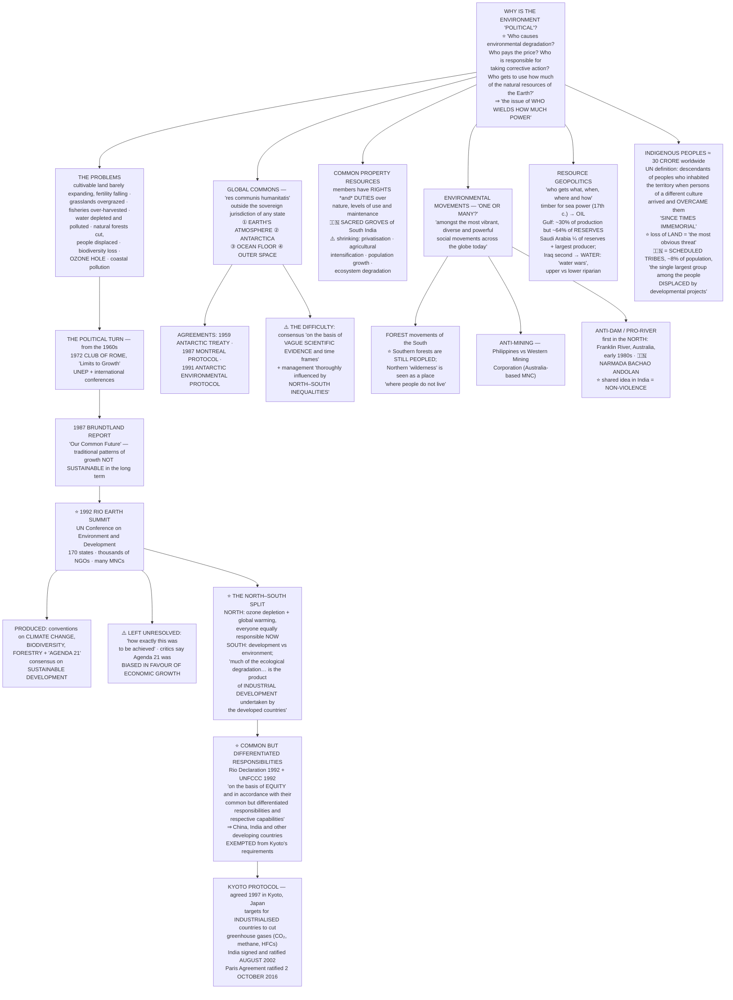

# Chapter 6: Environment and Natural Resources

> ⚠️ **Filename note:** in this folder every PDF carries a **legacy name from the pre-rationalisation edition**. `06_International_Organisations.pdf` actually contains **Chapter 6, "Environment and Natural Resources."** See [`00_Index.md`](00_Index.md) for the full mapping.

## 🎯 Chapter Outcome — what you should walk away with

> **The one thing this chapter exists to teach:** the environment is not a geography topic that happens to have politics attached. **"Who causes environmental degradation? Who pays the price? And who is responsible for taking corrective action? Who gets to use how much of the natural resources of the Earth? All these raise the issue of who wields how much power. They are, therefore, deeply political questions."**

**After reading it, here is what you now understand:**

1. **Why environment belongs in political science at all** — because no single government can fix these problems alone, and because every environmental question is a **distributive** question about cost, blame and access.
2. **The North–South split, which is the spine of the chapter** — the North wants to discuss **ozone depletion and global warming as they stand now**; the South wants to discuss **the relationship between economic development and environmental management**. Same summit, two different agendas.
3. **What the Rio Earth Summit (1992) actually produced** — conventions on **climate change, biodiversity and forestry**, plus **Agenda 21** — and what it did *not* resolve.
4. **Sustainable development, and the criticism of it** — consensus on "combining economic growth with ecological responsibility", but *"the problem however was how exactly this was to be achieved"*, and critics say **Agenda 21 was biased in favour of economic growth**.
5. **The global commons** — *res communis humanitatis*: the **earth's atmosphere, Antarctica, the ocean floor, and outer space** — areas outside any state's sovereign jurisdiction, and therefore governed badly.
6. **Common but Differentiated Responsibilities (CBDR)** — the single most examinable concept in the chapter, accepted in the **Rio Declaration 1992** and written into the **UNFCCC**.
7. **India's position and its logic** — historical responsibility, per capita emissions, and why India resists binding commitments on rapidly industrialising countries.
8. **That environmental movements are plural, not one** — forest movements, anti-mining movements, anti-dam/pro-river movements — and that the **North and South even disagree about what a forest is**.
9. **Resource geopolitics** — *"who gets what, when, where and how"* — timber then, **oil** now, and **water** next.
10. **Indigenous peoples** — the chapter's closing move, which folds environment, resources and politics into one question about **land**.

**Self-check — answer these three without looking:**
1. Name the four global commons, and give the Latin term.
2. State the principle of common but differentiated responsibilities in the Rio Declaration's own words.
3. What distinguishes forest movements of the South from those of the North?

**Where this leads:** Ch 7 takes the same North–South argument into economics — globalisation, its winners and losers, and the anti-globalisation movements that grew directly out of the indigenous-rights campaigns described at the end of this chapter.

---

## 🗺️ The chapter in one picture

---

## PART 1 — WHY THE ENVIRONMENT IS A POLITICAL SUBJECT

### The chapter's opening challenge

Until now, "world politics" has meant *"wars and treaties, rise and decline of state power, the relationship between the governments… and the role of inter-governmental organisations."* [Chapter 5](05_Security_in_the_Contemporary_World.md) already stretched it to poverty and epidemics — and *"that may not have been a very difficult step to take, for we all think that governments are responsible for controlling these."*

But forests? Water? The atmosphere?

> The margin voice teases: *"Politics in forests, politics in water, politics in atmosphere! What is not political then?"*

### 📋 The problem list — reproduce three or four of these in any answer

| Domain | The chapter's finding |
|---|---|
| **Cultivable land** | *"Throughout the world, cultivable area is **barely expanding any more**, and a substantial portion of existing agricultural land is **losing fertility**"* |
| **Grasslands and fisheries** | *"Grasslands have been **overgrazed** and fisheries **over-harvested**"* |
| **Water bodies** | *"Extensive depletion and pollution, **severely restricting food production**"* |
| **Water and sanitation** | Per the **UNDP Human Development Report 2016**: **663 million** people in developing countries have **no access to safe water**, and **2.4 billion** have **no access to sanitation**, "resulting in the death of **more than three million children every year**" |
| **Natural forests** | Forests *"help stabilise the climate, moderate water supplies, and harbour a majority of the planet's biodiversity on land"* — they "are being cut down and **people are being displaced**" |
| **Biodiversity** | Loss continues "due to the **destruction of habitat** in areas which are rich in species" |
| **Ozone** | *"A steady decline in the total amount of ozone in the Earth's stratosphere (commonly referred to as the **ozone hole**) poses a real danger to ecosystems and human health"* |
| **Coasts** | *"Although the **open sea is relatively clean**, the **coastal waters are becoming increasingly polluted** largely due to **land-based activities**"* |

> **The Aral Sea case** (margin box): "thousands of people have had to leave their homes as the **toxic waters have totally destroyed the fishing industry**. The shipping industry and all related activities have collapsed. **Rising concentrations of salt in the soil have caused low crop yields.**" And the bleak local joke — *"if everyone who'd come to study the Aral had brought a bucket of water, the sea would be full by now."*

### ⭐ The two-step argument for calling this "politics"

**Step 1 — the practical reason.** *"If the various governments take steps to check environmental degradation… these issues will have political consequences… **Most of them are such that no single government can address them fully.** Therefore they have to become part of 'world politics'."*

**Step 2 — the deeper reason.** *"Issues of environment and natural resources are political in another deeper sense. **Who causes environmental degradation? Who pays the price? And who is responsible for taking corrective action? Who gets to use how much of the natural resources of the Earth? All these raise the issue of who wields how much power. They are, therefore, deeply political questions.**"*

> **Memorise step 2 verbatim.** It is the answer to "Why is environment studied in political science?" and it opens any Mains answer on climate justice.

---

## PART 2 — THE ROAD TO RIO

### The 1960s onward

*"Although environmental concerns have a long history, awareness of the environmental consequences of economic growth acquired an **increasingly political character from the 1960s onwards**."*

| Year | Event | What it did |
|---|---|---|
| **1972** | **The Club of Rome**, a global think tank, published ***Limits to Growth*** | *"Dramatising the potential **depletion of the Earth's resources** against the backdrop of **rapidly growing world population**"* |
| — | **UNEP** (United Nations Environment Programme) and other international agencies | *"Began holding international conferences and promoting detailed studies to get a more **coordinated and effective response**"* |
| **1987** | **The Brundtland Report, *Our Common Future*** | Warned that *"traditional patterns of economic growth were **not sustainable in the long term**, especially in view of the **demands of the South for further industrial development**"* |
| **June 1992** | **The Rio Earth Summit** — UN Conference on Environment and Development, Rio de Janeiro, Brazil | *"Firmly consolidated"* the environment within global politics |

> **Note the dates as a chain:** *Limits to Growth* (1972) → Brundtland (1987) → Rio (1992). Five years separate Brundtland from Rio — the chapter says so explicitly ("Five years earlier…").

### ⭐ The Rio Earth Summit, June 1992

**Who attended:** **170 states**, **thousands of NGOs**, and **many multinational corporations**.

**What it produced:**
- **Conventions dealing with climate change, biodiversity, and forestry**
- **A recommended list of development practices called 'Agenda 21'**
- **A consensus on combining economic growth with ecological responsibility** — *"This approach to development is commonly known as **'sustainable development'**"*

**What it did not produce:**
> *"But it left unresolved **considerable differences and difficulties**… **The problem however was how exactly this was to be achieved.** Some critics have pointed out that **Agenda 21 was biased in favour of economic growth rather than ensuring ecological conservation.**"*

### ⭐⭐ What was "obvious at the Rio Summit" — the North–South split

> *"What was obvious at the Rio Summit was that the **rich and developed countries of the First World, generally referred to as the 'global North', were pursuing a different environmental agenda than the poor and developing countries of the Third World, called the 'global South'.** Whereas **the Northern states were concerned with ozone depletion and global warming**, the **Southern states were anxious to address the relationship between economic development and environmental management.**"*

| | **Global North** | **Global South** |
|---|---|---|
| **Priority** | Ozone depletion, global warming | The relationship between **economic development** and environmental management |
| **Framing of the problem** | The environment **as it stands now** | The environment **as a historical product** of Northern industrialisation |
| **Who should act** | *"Everyone… equally responsible for ecological conservation"* | *"If they have caused more degradation, **they must also take more responsibility for undoing the damage now**"* |

**This one table answers more UPSC questions than any other content in the chapter.** Every question on climate negotiations, CBDR, Kyoto, Paris, or "compromise and accommodation between North and South" is a restatement of it.

---

## PART 3 — THE GLOBAL COMMONS

### The definition

> *"'**Commons**' are those resources which are **not owned by anyone but rather shared by a community**. This could be a 'common room', a 'community centre', a park or a river. Similarly, there are some areas or regions of the world which are located **outside the sovereign jurisdiction of any one state**, and therefore require **common governance by the international community**. These are known as ***res communis humanitatis*** or **global commons**."*

### ⭐ The four global commons — a guaranteed Prelims item

1. **The earth's atmosphere**
2. **Antarctica**
3. **The ocean floor**
4. **Outer space**

### The agreements

*"Cooperation over the global commons is not easy. There have been many path-breaking agreements"*:

| Year | Agreement |
|---|---|
| **1959** | **Antarctic Treaty** |
| **1987** | **Montreal Protocol** |
| **1991** | **Antarctic Environmental Protocol** |

### ⚠️ The two structural problems

**Problem 1 — the science is uncertain when the decisions must be made.**
> *"A major problem underlying all ecological issues relates to the **difficulty of achieving consensus on common environmental agendas on the basis of vague scientific evidence and time frames**. In that sense the discovery of the **ozone hole over the Antarctic in the mid-1980s** revealed **the opportunity as well as dangers** inherent in tackling global environmental problems."*

**Problem 2 — the commons are governed along North–South lines.**
> *"The history of **outer space** as a global commons shows that the management of these areas is **thoroughly influenced by North-South inequalities**. As with the earth's atmosphere and the ocean floor, the crucial issue here is **technology and industrial development**. This is important because **the benefits of exploitative activities in outer space are far from being equal either for the present or future generations.**"*

> **The insight to carry away:** a "commons" open to all in law is open in practice **only to those with the technology to reach it**. Formal equality, real inequality — the same lesson as the WTO in [Chapter 4](04_International_Organisations.md).

### 🧊 The Antarctica box — the details are examinable

| Feature | Figure |
|---|---|
| **Continental region** | **14 million sq km** |
| Share of the world's **wilderness area** | **26 per cent** |
| Share of all **terrestrial ice** | **90 per cent** |
| Share of **planetary fresh water** | **70 per cent** |
| **Ocean** it extends to | A further **36 million sq km** |

- **Life:** "limited terrestrial life and a **highly productive marine ecosystem**" — a few plants (microscopic algae, fungi, lichen), marine mammals, fish, hordes of birds, "as well as the **krill, which is central to marine food chain** and upon which other animals are dependent."
- **Scientific value:** "The Antarctic plays an important role in **maintaining climatic equilibrium**, and **deep ice cores provide an important source of information about greenhouse gas concentrations and atmospheric temperatures** of hundreds and thousands of years ago."
- ⭐ **The ownership dispute — two claims:**
  - **Sovereign claims** by the **UK, Argentina, Chile, Norway, France, Australia and New Zealand**
  - **Most other states** hold that "the Antarctic is a part of the **global commons** and **not subject to the exclusive jurisdiction of any state**"
- **Despite the dispute:** "these differences… have **not prevented the adoption of innovative and potentially far-reaching rules** for the protection of the Antarctic environment."
- **Since 1959**, activities have been limited to **scientific research, fishing and tourism** — "even these limited activities have not prevented parts of the region from being degraded by **waste as a result of oil spills**."

---

## PART 4 — COMMON BUT DIFFERENTIATED RESPONSIBILITIES ⭐⭐

**This is the single most important concept in the chapter. Learn the wording, not a paraphrase.**

### The South's argument, in four steps

1. *"Much of the ecological degradation in the world is the **product of industrial development undertaken by the developed countries**."*
2. *"If they have caused more degradation, they must also **take more responsibility for undoing the damage now**."*
3. *"The developing countries are **in the process of industrialisation** and they **must not be subjected to the same restrictions** which apply to the developed countries."*
4. Therefore *"the **special needs of the developing countries** must be taken into account in the development, application, and interpretation of rules of international environmental law."*

> **"This argument was accepted in the Rio Declaration at the Earth Summit in 1992 and is called the principle of 'common but differentiated responsibilities'."**

### The Rio Declaration text — quote this

> *"**States shall cooperate in the spirit of global partnership to conserve, protect and restore the health and integrity of the Earth's ecosystem. In view of the different contributions to global environmental degradation, states have common but differentiated responsibilities. The developed countries acknowledge the responsibility that they bear in the international pursuit of sustainable development in view of the pressures their societies place on the global environment and of the technological and financial resources they command.**"*

> ⭐ Note the **two grounds** the developed countries acknowledge: the **pressures their societies place on the environment** *and* the **technological and financial resources they command**. CBDR is justified by both **past blame** and **present capability** — do not quote only the first.

### The UNFCCC formulation

The **1992 United Nations Framework Convention on Climate Change (UNFCCC)** "provides that the parties should act to protect the climate system **'on the basis of equity and in accordance with their common but differentiated responsibilities and respective capabilities.'**"

**The two facts the parties agreed on:**
1. *"The **largest share of historical and current global emissions** of greenhouse gases **has originated in developed countries**."*
2. *"**Per capita emissions in developing countries are still relatively low.**"*

**The consequence:** *"**China, India, and other developing countries were, therefore, exempted from the requirements of the Kyoto Protocol.**"*

### The Kyoto Protocol

> *"The Kyoto Protocol is an **international agreement setting targets for industrialised countries to cut their greenhouse gas emissions**. Certain gases like **carbon dioxide, methane, hydro-fluoro carbons** etc. are considered at least partly responsible for **global warming** — the rise in global temperature which may have catastrophic consequences for life on Earth. The protocol was **agreed to in 1997 in Kyoto in Japan**, based on principles set out in **UNFCCC**."*

> The margin voice catches the analogy exactly: *"That's a cool principle! A bit like the reservation policy in our country, isn't it?"* — CBDR is **affirmative action between states**, and that comparison is a legitimate and effective one to make in an answer.

---

## PART 5 — COMMON PROPERTY RESOURCES

*Note: **common property resources** (local, owned by a defined group) are a different thing from the **global commons** (owned by nobody). UPSC has tested the distinction.*

> *"Common property represents **common property for the group**. The underlying norm here is that **members of the group have both rights and duties** with respect to **the nature, levels of use, and the maintenance** of a given resource. Through **mutual understanding and centuries of practice**, many village communities in India, for example, have defined members' rights and responsibilities."*

### ⚠️ Why they are dwindling — the four causes

> *"A combination of factors, including **privatisation, agricultural intensification, population growth and ecosystem degradation** have caused common property to **dwindle in size, quality, and availability to the poor** in much of the world."*

### 🌳 Sacred Groves in India — the chapter's Indian model

*"The institutional arrangement for the actual management of the **sacred groves on state-owned forest land** appropriately fits the description of a **common property regime**. Along the **forest belt of South India**, sacred groves have been **traditionally managed by village communities**."*

**From the box:**
- **What they are:** *"parcels of **uncut forest vegetation** in the name of certain **deities or natural or ancestral spirits**"* — "protecting nature for religious reasons is an ancient practice in many traditional societies."
- **Why they matter:** "As a model of **community-based resource management**, groves have lately gained attention in conservation literature." They act as *"a system that **informally forces traditional communities to harvest natural resources in an ecologically sustained fashion**."*
- **What they may preserve:** *"not only **biodiversity and ecological functions**, but also **cultural diversity**."*
- **Size:** *"from clumps of a few trees to **several hundred acres**."*
- ⭐ **The motive:** *"**Deep religious reverence for nature, rather than resource scarcity**, seems to be the basis for the long-standing commitment to preserving these forests."* — conservation without a conservation policy.
- **Origins:** *"Hindus commonly worshipped natural objects, including trees and groves. **Many temples have originated from sacred groves.**"*
- ⚠️ **The threats:** *"expansion and human settlement have slowly encroached"*; *"the institutional identity of these traditional forests is **fading with the advent of new national forest policies**"*; and the core problem — *"**a real problem in managing sacred groves arises when legal ownership and operational control are held by different entities**. The two entities in question, **the state and the community**, vary in their policy norms and underlying motives."*

> **That last point is the exam point:** the sacred grove fails not from greed but from a **split between legal ownership (state) and operational control (community)** — the classic critique of centralised forest law, and the direct argument for community forest rights.

---

## PART 6 — INDIA'S STAND ON ENVIRONMENTAL ISSUES ⭐

### The commitments

| Commitment | Date |
|---|---|
| **Signed and ratified the 1997 Kyoto Protocol** | **August 2002** |
| **Ratified the Paris Climate Agreement** | **2 October 2016** |

*"India, China and other developing countries were **exempt from the requirements of the Kyoto Protocol** because their contribution to the emission of greenhouse gases during the industrialisation period (that is believed to be causing today's global warming and climate change) **was not significant**."*

**⚠️ The counter-argument the chapter reports fairly:** *"the critics of the Kyoto Protocol point out that **sooner or later, both India and China, along with other developing countries, will be among the leading contributors to greenhouse gas emissions**."*

### India's argument — four planks

**1. Per capita emissions.** At the **G-8 meeting in June 2005**, India pointed out that *"the **per capita emission rates of the developing countries are a tiny fraction of those in the developed world**."*

**2. Historical responsibility.** *"Following the principle of common but differentiated responsibilities, India is of the view that **the major responsibility of curbing emission rests with the developed countries, which have accumulated emissions over a long period of time**."* India's negotiating position *"relies heavily on principles of **historical responsibility**, as enshrined in UNFCCC"*, which also emphasises that **"economic and social development are the first and overriding priorities of the developing country parties."**

**3. Resistance to binding commitments on rapid industrialisers.** *"India is wary of recent discussions within UNFCCC about introducing **binding commitments on rapidly industrialising countries (such as Brazil, China and India)** to reduce their greenhouse gas emissions. **India feels this contravenes the very spirit of UNFCCC.**"*

**4. 📊 The projection — learn these numbers, they are precise and quotable.**
> *"Neither does it seem fair to impose restrictions on India when the country's rise in **per capita carbon emissions by 2030 is likely to still represent less than half the world average of 3.8 tonnes in 2000**. Indian emissions are predicted to rise from **0.9 tonnes per capita in 2000** to **1.6 tonnes per capita in 2030**."*

### What India is actually doing domestically

| Measure | What it does |
|---|---|
| **National Auto-fuel Policy** | *"Mandates **cleaner fuels for vehicles**"* |
| **Energy Conservation Act, 2001** | *"Outlines initiatives to **improve energy efficiency**"* |
| **Electricity Act, 2003** | *"Encourages the use of **renewable energy**"* |
| **Importing natural gas; clean coal technologies** | "Show that India has been making real efforts" |
| **National Mission on Biodiesel** | *"Using about **11 million hectares** of land to produce biodiesel by **2011-2012**"* |
| **Renewable energy programme** | *"India has **one of the largest renewable energy programmes in the world**"* |

### India's two demands of the developed world

A **review of the implementation of the Rio agreements was undertaken by India in 1997**. Its key conclusion: *"there had been **no meaningful progress with respect to transfer of new and additional financial resources and environmentally-sound technology on concessional terms** to developing nations."*

Therefore India finds it necessary that developed countries take **immediate measures** to provide developing countries with:
1. **Financial resources**, and
2. **Clean technologies**

— *"to enable them to meet their existing commitments under UNFCCC."*

**And a regional demand:** *"India is also of the view that the **SAARC countries should adopt a common position on major global environment issues**, so that the region's voice carries greater weight."*

> The margin voice raises the honest objection students should be ready to answer: *"I get it! First they destroyed the earth, now it is our turn to do the same! Is that our stand?"* — **No.** India's stand is *differentiated* responsibility with *financial and technological transfer*, not a right to pollute. Say that explicitly.

---

## PART 7 — ENVIRONMENTAL MOVEMENTS: ONE OR MANY?

> *"Some of the most significant responses to this challenge have come **not from the governments but rather from groups of environmentally conscious volunteers**… These environmental movements are **amongst the most vibrant, diverse, and powerful social movements across the globe today**. **It is within social movements that new forms of political action are born or reinvented.** These movements raise new ideas and long-term visions of what we should do and what we should not do in our individual and collective lives."*

### 🌲 Type 1 — Forest movements

**Where:** *"the forest movements of the South, in **Mexico, Chile, Brazil, Malaysia, Indonesia, continental Africa and India**."*

**The bleak status report:** *"Forest clearing in the Third World continues at an **alarming rate, despite three decades of environmental activism**. The destruction of the world's last remaining grand forests has **actually increased in the last decade**."*

### ⭐ "Are forests 'wilderness'?" — the North–South split, cultural version

This box is the most conceptually interesting passage in the chapter.

> *"What distinguishes the forest movements of the South from those of the North is that **the forests of the former are still peopled**, whilst the forests of the latter are **more or less devoid of human habitat or, at least, are perceived as thus**. This explains to some extent the prevailing notion of **wilderness in the North as a 'wild place' where people do not live**. In this perspective, **humans are not seen as part of nature**. In other words, 'environment' is perceived as **'somewhere out there'**, as something that should be **protected from humans** through the creation of parks and reserves. On the other hand, **most environmental issues in the South are based on the assumption that people live in the forests.**"*

| | **North** | **South** |
|---|---|---|
| **Forests are** | Empty wilderness | **Peopled** |
| **Humans are** | **Not part of nature** | Part of the ecosystem |
| **"Environment" is** | *"Somewhere out there"* | Where people live and work |
| **Therefore protect it** | **From humans** — parks and reserves | **With and for** the people in it |

**Where wilderness thinking dominates:** *"Australia, Scandinavia, North America and New Zealand"* — regions with "large tracts of relatively 'underdeveloped wilderness', unlike in most European countries."

**But wilderness campaigns exist in the South too:** *"In the **Philippines**, green organisations fight to protect **eagles and other birds of prey** from extinction. In **India**, a battle goes on to protect **the alarmingly low number of Bengal tigers**. In **Africa**, a long campaign has been waged against the **ivory trade and the savage slaughter of elephants**. Some of the most famous wilderness struggles have been fought in the forests of **Brazil and Indonesia**."*

⭐ **And the renaming that resulted:** *"**Many of the wilderness issues have been renamed biodiversity issues in recent times, as the concept of wilderness has been proved difficult to sell in the South.**"* Many campaigns "have been initiated and funded by NGOs such as the **Worldwide Wildlife Fund (WWF)**, in association with local people."

> **This is a superb Mains point:** the vocabulary of global environmentalism ("wilderness" → "biodiversity") had to change because a Northern concept **did not travel**. Concepts are political too.

### ⛏️ Type 2 — Movements against mineral industry

> *"The minerals industry is **one of the most powerful forms of industry on the planet**. A large number of economies of the South are now being **re-opened to MNCs through the liberalisation of the global economy**."*

**The grievance list:** *"the mega-mineral industry's **extraction of earth**, its **use of chemicals**, its **pollution of waterways and land**, its **clearance of native vegetation**, its **displacement of communities**, amongst other factors, continue to invite criticism and resistance in various parts of the globe."*

**The case study:** *"the **Philippines**, where a vast network of groups and organisations campaigned against the **Western Mining Corporation (WMC)**, an **Australia-based multinational company**. Much opposition to the company **in its own country, Australia**, is based on **anti-nuclear sentiments** and **advocacy for the basic rights of Australian indigenous peoples**."*

> ⭐ Note the structure: the movement was **transnational** — opposition in the *host* country (Philippines) reinforced by opposition in the *home* country (Australia). That is how modern environmental campaigning works.

**Another example (margin):** *"An entire community erupted in protests against a proposed **open-cast coal mine project in Phulbari town, in the North-West district of Dinajpur, Bangladesh**"* — several dozen women, one with her infant child, chanting slogans, **2006**.

### 🌊 Type 3 — Anti-dam and pro-river movements

> *"In **every country where a mega-dam is being built, one is likely to find an environmental movement opposing it**. Increasingly anti-dam movements are **pro-river movements for more sustainable and equitable management of river systems and valleys**."*

**The first one was in the North:** *"The early 1980s saw the first anti-dam movement launched in the North, namely, the campaign to **save the Franklin River and its surrounding forests in Australia**. This was a **wilderness and forest campaign as well as anti-dam campaign**."*

**The present spurt is in the South:** *"there has been a spurt in mega-dam building in the South, **from Turkey to Thailand to South Africa, from Indonesia to China**."*

**India's place in it:** *"India has had some of the leading **anti-dam, pro-river movements**. **Narmada Bachao Andolan** is one of the best known of these movements."*

> ⭐ **The line to remember:** *"It is significant to note that, in anti-dam and other environmental movements in India, **the most important shared idea is non-violence**."*

---

## PART 8 — RESOURCE GEOPOLITICS

### The definition

> **"Resource geopolitics is all about who gets what, when, where and how."**

*"Resources have provided some of the **key means and motives of global European power expansion**. They have also been the focus of **inter-state rivalry**. Western geopolitical thinking about resources has been dominated by the relationship of **trade, war and power**, at the core of which were **overseas resources and maritime navigation**."*

### 🌲 Timber — the resource everyone forgets

> *"Since **sea power itself rested on access to timber**, **naval timber supply became a key priority for major European powers from the 17th century onwards**."*

**Then:** "The critical importance of ensuring uninterrupted supply of **strategic resources, in particular oil**, was well established **both during the First World War and the Second World War**."

### The Cold War toolkit

*"Throughout the Cold War the industrialised countries of the North adopted a number of methods to ensure a steady flow of resources"* — **five methods:**

1. **Deployment of military forces** near exploitation sites and along **sea-lanes of communication**
2. **Stockpiling** of strategic resources
3. Efforts to **prop up friendly governments** in producing countries
4. **Support to multinational companies**
5. **Favourable international agreements**

**The Cold War concern:** access to supplies "might be threatened by the Soviet Union. A particular concern was **Western control of oil in the Gulf and strategic minerals in Southern and Central Africa**."

**After the Cold War:** "the security of supply continues to worry government and business decisions with regard to several minerals, in particular **radioactive materials**. However, **oil continues to be the most important resource in global strategy.**"

### 🛢️ Oil — the numbers ⭐

> *"The global economy relied on oil for much of the 20th century as a **portable and indispensable fuel**. The immense wealth associated with oil generates political struggles to control it, and **the history of petroleum is also the history of war and struggle**. Nowhere is this more obviously the case than in **West Asia and Central Asia**."*

| Fact | Figure |
|---|---|
| West Asia (specifically **the Gulf**) share of **global oil production** | **about 30 per cent** |
| Its share of the **planet's known reserves** | **about 64 per cent** |
| Therefore | *"the **only region able to satisfy any substantial rise in oil demand**"* |
| **Saudi Arabia** | **a quarter of the world's total reserves** and **the single largest producer** |
| **Iraq** | Known reserves **second only to Saudi Arabia's** — and since substantial portions of Iraqi territory "are yet to be fully explored, there is a fair chance that **actual reserves might be far larger**" |

⭐ **The geopolitical punchline:** *"The **United States, Europe, Japan, and increasingly India and China**, which consume this petroleum, are **located at a considerable distance from the region**."* — consumption and reserves are on opposite sides of the map. That gap *is* the geopolitics.

> **The "Everyone is playing crude!" box** dramatises this as four characters — **Sheikh Petrodollah** (armed "to the teeth" in exchange for oil and loyalty, keeping "freedom and democracy… safely under lock and key"), **Mr Bigoil** (free to dig, "free to create pliable tin-pot dictators", funding election campaigns rather than appearing on TV), **Mr & Mrs Gobbledoo** (the consumers, delighted by a car that is "low on emissions too… Global warming and all that stuff"), and the **"Errorists"** (armed and trained to fight "the invading Ruffians", who then turned on their sponsors). It also notes: **"Oil provides the energy for 95 per cent of the world's transportation needs."**
>
> Read as analysis rather than satire, it lays out the **four-actor structure of oil politics**: producer elite, MNC, consumer, and blowback — and it is the clearest available illustration of [Chapter 5](05_Security_in_the_Contemporary_World.md)'s point that alliances shift with national interests.

### 💧 Water — the next one

> *"Regional variations and the **increasing scarcity of freshwater** in some parts of the world point to the possibility of **disagreements over shared water resources as a leading source of conflicts in the 21st century**. Some commentators… have referred to **'water wars'**."*

**The typical dispute — learn the vocabulary:**
> *"A typical disagreement is a **downstream (lower riparian) state's objection to pollution, excessive irrigation, or the construction of dams by an upstream (upper riparian) state**, which might decrease or degrade the quality of water available to the downstream state."*

**The examples of actual violence:**
- **Israel, Syria and Jordan** in the **1950s and 1960s** — "over attempts by each side to divert water from the **Jordan and Yarmuk Rivers**"
- **Turkey, Syria and Iraq** — "more recent threats… over the construction of **dams on the Euphrates River**"

⭐ *"A number of studies show that **countries that share rivers — and many countries do share rivers — are involved in military conflicts with each other**."*

> The margin question is worth answering for yourself: *"How are these conflicts different from the many water conflicts within our own country?"* — Cauvery, Krishna and Satluj-Yamuna are **upper/lower riparian disputes too**, but with a constitutional mechanism (Article 262, Inter-State River Water Disputes Act) that international disputes lack. That contrast is a ready-made GS-II link.

---

## PART 9 — THE INDIGENOUS PEOPLES AND THEIR RIGHTS

> *"The question of indigenous people **brings the issues of environment, resources and politics together**."*

### ⭐ The UN definition — quote it

> *"The UN defines indigenous populations as comprising **the descendants of peoples who inhabited the present territory of a country at the time when persons of a different culture or ethnic origin arrived there from other parts of the world and overcame them**. Indigenous people today **live more in conformity with their particular social, economic, and cultural customs and traditions than the institutions of the country of which they now form a part**."*

### The numbers — approximately 30 crore worldwide

| Group | Number |
|---|---|
| **North American natives** | **35 lakh** |
| **Cordillera region, Philippines** | **20 lakh** |
| **Mapuche people of Chile** | **10 lakh** |
| **Small Peoples of the Soviet North** | **10 lakh** |
| **Tribal people of the Chittagong Hill Tracts, Bangladesh** | **6 lakh** |
| **Kuna, living east of the Panama Canal** | **50,000** |

**Where they live:** *"Central and South America, Africa, **India (where they are known as Tribals)** and Southeast Asia."* And many present-day island states in **Oceania** (including Australia and New Zealand) "were inhabited by the **Polynesian, Melanesian and Micronesian** people over the course of thousands of years."

### The claim

> *"The indigenous voices in world politics call for **the admission of indigenous people to the world community as equals**… They appeal to governments to **come to terms with the continuing existence of indigenous nations as enduring communities with an identity of their own**. **'Since times immemorial'** is the phrase used by indigenous people all over the world to refer to their continued occupancy of the lands from which they originate."*

⭐ **And the common thread across continents:** *"The worldviews of indigenous societies, **irrespective of their geographical location, are strikingly similar with respect to land and the variety of life systems supported by it**. **The loss of land, which also means the loss of an economic resource base, is the most obvious threat to the survival of indigenous people.** Can political autonomy be enjoyed without its attachment to the means of physical survival?"*

> **That last question is the chapter's sharpest.** It says **political rights without a land base are hollow** — and it is the strongest available argument for the Fifth and Sixth Schedules, PESA, and the Forest Rights Act.

### 🇮🇳 India

- *"In India, the description 'indigenous people' is usually applied to the **Scheduled Tribes who constitute nearly eight per cent of the population**."*
- *"With the exception of small communities of **hunters and gatherers**, most indigenous populations in India depend for their subsistence **primarily on the cultivation of land**."*
- *"For centuries, if not millennia, they had **free access to as much land as they could cultivate**. It was only after the establishment of **British colonial rule** that areas… were subjected to **outside forces**."*
- ⭐ **The core grievance:** *"Although they enjoy a **constitutional protection in political representation**, they have **not got much of the benefits of development** in the country. In fact **they have paid a huge cost for development since they are the single largest group among the people displaced by various developmental projects since independence.**"*

> **Reserved seats but displaced homes** — that contrast is the sentence to build any answer on tribal development around. Connect to [Chapter 5's](05_Security_in_the_Contemporary_World.md) internally displaced people, and to Polity's Fifth Schedule.

### The international movement

- *"Issues related to the rights of the indigenous communities have been **neglected in domestic and international politics for very long**."*
- *"During the **1970s**, growing international contacts among indigenous leaders from around the world aroused a sense of **common concern and shared experiences**."*
- **The World Council of Indigenous Peoples was formed in 1975.** *"The Council became subsequently the **first of 11 indigenous NGOs to receive consultative status in the UN**."*
- *"Many of the movements against **globalisation**, discussed in **Chapter 7**, have focussed on the rights of the indigenous people."*

---

## 🧠 Memory hooks

**The political question (verbatim):** *who causes degradation · who pays the price · who takes corrective action · who gets how much of the resources* → **"who wields how much power."**

**The date chain:** **1972** *Limits to Growth* (Club of Rome) → **1987** Brundtland, *Our Common Future* → **1992** Rio Earth Summit (170 states) → **1997** Kyoto (Japan) → India ratifies Kyoto **Aug 2002**, Paris **2 Oct 2016**.

**The four global commons — A-A-O-O:** **A**tmosphere · **A**ntarctica · **O**cean floor · **O**uter space. *(res communis humanitatis)*

**Three commons agreements:** **1959** Antarctic Treaty · **1987** Montreal Protocol · **1991** Antarctic Environmental Protocol.

**Antarctica in four numbers:** **14 mn sq km** land · **26%** of world wilderness · **90%** of terrestrial ice · **70%** of fresh water.

**CBDR's two grounds:** **past pressure** on the environment **+ present technological and financial resources**. Not just blame — capability too.

**North vs South at Rio:** North = **ozone + global warming, now**. South = **development vs environment, historically**.

**India's numbers:** per capita **0.9 t (2000) → 1.6 t (2030)**, against a **world average of 3.8 t in 2000**. Scheduled Tribes ≈ **8%** of population.

**Oil's asymmetry:** Gulf = **~30% of production but ~64% of reserves**. Saudi = **¼ of reserves**, largest producer; **Iraq second**. Consumers are far away.

**Riparian vocabulary:** **upper riparian** builds the dam, **lower riparian** objects. Jordan/Yarmuk (Israel–Syria–Jordan, 1950s–60s); Euphrates (Turkey–Syria–Iraq).

**Movements — F-M-D:** **F**orests · **M**inerals · **D**ams. First anti-dam movement was in the **North** (Franklin River, Australia, early 1980s); India's is **Narmada Bachao Andolan**, and its shared idea is **non-violence**.

**Indigenous:** **≈30 crore** worldwide · **World Council of Indigenous Peoples, 1975** · **first of 11** indigenous NGOs with UN consultative status · **"since times immemorial"** · **land loss is the most obvious threat**.

---

## ❓ Expected UPSC questions

1. What is meant by **'common but differentiated responsibilities'**? How could we implement the idea? *(Exercise 6 — a standing favourite.)*
2. **"Compromise and accommodation are the two essential policies required by states to save planet Earth."** Substantiate in the light of ongoing North–South negotiations. *(Exercise 8.)*
3. *"The most serious challenge before the states is pursuing economic development without causing further damage to the global environment."* How could we achieve this? Explain with examples. *(Exercise 9.)*
4. What is meant by the **global commons**? How are they exploited and polluted? *(Exercise 5.)*
5. Why have issues related to global environmental protection become the priority concern of states **since the 1990s**? *(Exercise 7.)*
6. *"The loss of land is the most obvious threat to the survival of indigenous people."* Examine in the Indian context. **(250 words)**

**4-line skeleton for Q1 —**
> **State it:** Rio Declaration 1992 + UNFCCC — states have *common* responsibility for a shared ecosystem, but *differentiated* obligations, on **two grounds**: unequal historical contribution and unequal technological/financial capability.
> **Justify it:** the largest share of historical and current emissions originated in developed countries; per capita emissions in developing countries remain low (India 0.9 t in 2000 against a world average of 3.8 t).
> **Implement it:** differentiated targets (Kyoto exempted India and China), **finance and clean-technology transfer on concessional terms**, and per-capita rather than absolute benchmarks — India's 1997 review found "no meaningful progress" on exactly this transfer.
> **Concede and conclude:** critics note India and China will soon be leading emitters, so CBDR must evolve from exemption toward **supported action** — differentiated *means*, not differentiated *seriousness*.

---

## ⚡ 60-second revision

**Why political** — no single government can fix it, and every question is distributive: **who causes, who pays, who corrects, who uses** → **who has power**.

**The problems** — cultivable land not expanding and losing fertility; grasslands overgrazed, fisheries over-harvested; **663 mn** without safe water, **2.4 bn** without sanitation, **3 mn+** child deaths a year (UNDP HDR 2016); forests cut and people displaced; biodiversity loss; **ozone hole**; coastal pollution.

**The road to Rio** — **Club of Rome, *Limits to Growth*, 1972** → **Brundtland, *Our Common Future*, 1987** → **Rio Earth Summit, June 1992**: 170 states, thousands of NGOs, many MNCs. Produced conventions on **climate change, biodiversity, forestry** + **Agenda 21** + consensus on **sustainable development**. Left unresolved: **how**. Critics: Agenda 21 **biased toward growth**.

**North vs South** — North: ozone and global warming, equal responsibility now. South: degradation is the **product of Northern industrial development**, so they must take more responsibility; developing countries are still industrialising and must not face the same restrictions.

**Global commons** — *res communis humanitatis*: **atmosphere, Antarctica, ocean floor, outer space**. Agreements **1959 / 1987 / 1991**. Two problems: consensus on **vague scientific evidence**, and management shaped by **North–South inequality in technology**.

**CBDR** — accepted in the **Rio Declaration 1992**, restated in **UNFCCC** ("equity… common but differentiated responsibilities and respective capabilities"). Grounds: **historical emissions + capability**. Consequence: **China, India and others exempted from Kyoto** (agreed **1997, Kyoto, Japan**; targets for industrialised countries on CO₂, methane, HFCs).

**Common property resources** — group rights *and* duties; **sacred groves** of South India; dwindling due to **privatisation, agricultural intensification, population growth, ecosystem degradation**; the real management failure is **legal ownership (state) split from operational control (community)**.

**India** — Kyoto **Aug 2002**, Paris **2 Oct 2016**; per capita **0.9 → 1.6 t** vs world **3.8 t (2000)**; historical responsibility; resists binding commitments on Brazil/China/India as against "the very spirit of UNFCCC"; demands **finance + clean technology**; wants a **common SAARC position**. Domestic: **National Auto-fuel Policy, Energy Conservation Act 2001, Electricity Act 2003, biodiesel mission, large renewables programme**.

**Movements** — forests (South's forests are **peopled**; North's "wilderness" excludes humans; wilderness → **biodiversity** renaming), minerals (**Philippines vs Western Mining Corporation**; Phulbari, Bangladesh), dams (**Franklin River, Australia**, first; **Narmada Bachao Andolan**; **non-violence** the shared Indian idea).

**Resource geopolitics** — "who gets what, when, where and how". **Timber** for sea power from the 17th century → **oil**: Gulf **~30% production / ~64% reserves**, Saudi **¼ of reserves**, Iraq second, consumers far away → **water**: upper vs lower riparian; Jordan/Yarmuk; Euphrates.

**Indigenous peoples** — UN definition; **≈30 crore**; "since times immemorial"; **land loss is the most obvious threat**; India = **Scheduled Tribes ≈8%**, constitutionally represented but **the single largest group displaced by development projects**; **World Council of Indigenous Peoples, 1975**.

---

## 🔗 Practice this chapter

**Cross-links:** [Ch 5 Security in the Contemporary World](05_Security_in_the_Contemporary_World.md) — environmental degradation as a non-traditional threat, and the Maldives/sea-level example · [Ch 4 International Organisations](04_International_Organisations.md) — the same North–South asymmetry inside the IMF, World Bank and WTO · **Polity:** the Fifth and Sixth Schedules and Article 243D connect directly to the indigenous-peoples section

**Chapter exercises worth actually doing:** Q1 (why concern is growing), Q2 (Earth Summit true/false), Q3 (global commons true/false), Q4 (outcomes of Rio), Q6 (CBDR), Q8 (compromise and accommodation), Q9 (growth without damage).

---

## Extra UPSC-style questions

1. *"The concept of wilderness has been proved difficult to sell in the South."* Explain why, and what this reveals about the politics of environmental concepts. **(250 words)**
2. Distinguish between **global commons** and **common property resources**, with one example of each and one reason each is degrading.
3. *"A real problem in managing sacred groves arises when legal ownership and operational control are held by different entities."* Discuss with reference to community forest management in India.
4. **Prelims trap check:** Which is/are correct about the global commons? (i) They include the earth's atmosphere, Antarctica, the ocean floor and outer space. (ii) They lie outside sovereign jurisdiction. (iii) The 1987 Montreal Protocol and the 1991 Antarctic Environmental Protocol are among the agreements governing them. (iv) No state has ever made a sovereign claim over Antarctic territory. → **(i), (ii) and (iii) only.** *(The **UK, Argentina, Chile, Norway, France, Australia and New Zealand** have made legal claims.)*
5. **Prelims trap check:** The Kyoto Protocol was agreed in which year and place, and India ratified it when? → **Agreed 1997 at Kyoto, Japan; India signed and ratified in August 2002.** *(Paris Agreement ratified 2 October 2016 — do not confuse the two.)*
6. **Prelims trap check:** Which region accounts for about 30% of global oil production but about 64% of known reserves? → **West Asia, specifically the Gulf region.**

---

*Source: written by reading `06_International_Organisations.pdf` in full — which in the current NCERT edition (Reprint 2026–27) actually contains **Chapter 6, Environment and Natural Resources**. Covers the overview, the full problem list with the UNDP HDR 2016 figures, the Aral Sea box, the two-step argument for treating environment as politics, the Club of Rome / Brundtland / Rio chain, the North–South split, the complete Antarctica box, the global commons and their agreements, the Rio Declaration and UNFCCC texts on CBDR, the Kyoto Protocol, common property resources and the full Sacred Groves box, India's stand with all emission figures and domestic measures, all three families of environmental movements including the "Are forests 'wilderness'?" box, resource geopolitics with the timber/oil/water sequence and the "Everyone is playing crude!" feature, the indigenous peoples section with every population figure, every margin cartoon and margin question, the STEPS activity, and all nine exercises.*
