# Chapter 7: Globalisation

> ⚠️ **Filename note:** in this folder every PDF carries a **legacy name from the pre-rationalisation edition**. `07_Security_in_the_Contemporary_World.pdf` actually contains **Chapter 7, "Globalisation"** — the final chapter of the book. See [`00_Index.md`](00_Index.md) for the full mapping.

## 🎯 Chapter Outcome — what you should walk away with

> **The one thing this chapter exists to teach:** globalisation **"fundamentally deals with flows"** — of **ideas, capital, commodities and people** — and the thing those flows create is **"worldwide interconnectedness."** It is **not** a synonym for economics, not a synonym for westernisation, and **not one thing that happens uniformly to everybody**.

**After reading it, here is what you now understand:**

1. **The definition, in the chapter's own terms** — four flows, one outcome: **worldwide interconnectedness**. Nothing about the definition is inherently economic.
2. **That globalisation is multi-dimensional** — **political, economic and cultural** — and *"it is wrong to assume that globalisation has purely economic dimensions, just as it would also be mistaken to assume that it is a purely cultural phenomenon."*
3. **That its impact is uneven** — *"it affects some societies more than others and **some parts of some societies more than others**."* The warning that follows is the chapter's methodological rule: **avoid general conclusions; pay attention to specific contexts.**
4. **That it is not new, but its scale and speed are** — the four flows "have taken place through much of human history"; what is distinctive is **"the scale and speed of these flows."**
5. **Technology is critical but not sufficient** — *"technology remains a critical element"*, but *"globalisation does not emerge merely because of the availability of improved communications. What is important is for people… **to recognise these interconnections**."*
6. **The three-part political answer** — state capacity **erodes**, state primacy **continues**, and in one respect state capacity actually **increases**. All three at once. Most students remember only the first.
7. **The economic debate** — critics call it **"re-colonisation of the world"** and demand **social safety nets**; advocates say deregulation brings growth and that it is **"inevitable"**; moderates say it is a challenge to be **"responded to intelligently without accepting it uncritically."**
8. **The cultural double movement** — **homogenisation** (McDonaldisation, the soft power of US hegemony) *and simultaneously* **heterogenisation** (the khadi kurta over jeans, exported back to America).
9. **India's arc** — colonial exporter of raw materials → post-independence **protectionism** → **1991 reforms**, with the chapter's own test of success: not high growth rates, but **whether the benefits are shared**.
10. **That resistance is itself globalised** — anti-globalisation movements "participate in global networks", and most **"are not opposed to the idea of globalisation per se"** but to **a specific programme** of it.

**Self-check — answer these three without looking:**
1. What are the four flows, and what do they create?
2. Give the three distinct effects of globalisation on state capacity.
3. Define cultural homogenisation and cultural heterogenisation, and give the chapter's example of each.

**Where this leads:** this is the **final chapter of the book**. Its resistance section — the WSF, the Seattle protests, the campaigns on Neem patents — picks up directly from the indigenous-rights movements at the close of [Chapter 6](06_Environment_and_Natural_Resources.md).

---

## 🗺️ The chapter in one picture

```mermaid
flowchart TD
    D["⭐ WHAT IS GLOBALISATION?<br/>'fundamentally deals with FLOWS'<br/>① IDEAS ② CAPITAL ③ COMMODITIES ④ PEOPLE<br/>⇒ 'the crucial element is the<br/>WORLDWIDE INTERCONNECTEDNESS'"] --> M["MULTI-DIMENSIONAL:<br/>POLITICAL · ECONOMIC · CULTURAL<br/>⚠️ NOT purely economic, NOT purely cultural<br/>⚠️ impact is 'VASTLY UNEVEN' — some societies<br/>more than others, and SOME PARTS OF SOME<br/>SOCIETIES more than others"]

    D --> C["CAUSES<br/>the four flows are OLD — what is new is<br/>'the SCALE AND SPEED of these flows'<br/>⭐ TECHNOLOGY is critical: telegraph → telephone<br/>→ MICROCHIP (as printing once created nationalism)<br/>⚠️ BUT NOT SUFFICIENT — people must<br/>RECOGNISE the interconnections<br/>(bird flu, tsunami respect no boundary)"]

    D --> P["POLITICAL CONSEQUENCES — THREE, NOT ONE"]
    P --> P1["① EROSION of state capacity<br/>welfare state → MINIMALIST state<br/>keeps law and order + security,<br/>withdraws from welfare<br/>⇒ THE MARKET becomes 'the prime determinant<br/>of economic and social priorities'<br/>+ MNCs reduce governments' room to decide"]
    P --> P2["② BUT PRIMACY CONTINUES<br/>'the unchallenged basis of political community'<br/>old jealousies and rivalries have not ceased<br/>state withdraws CONSCIOUSLY, where it wishes"]
    P --> P3["③ ⭐ AND CAPACITY IS BOOSTED<br/>enhanced technology to collect information<br/>about citizens ⇒ 'the state is BETTER able to rule,<br/>NOT LESS able… MORE POWERFUL than<br/>they were earlier'"]

    D --> E["ECONOMIC CONSEQUENCES<br/>⭐ the real question = 'the DISTRIBUTION of<br/>economic gains — WHO GETS THE MOST…<br/>who gets less, indeed WHO LOSES'<br/>flows: commodities ✔ · capital ✔ · ideas ✔<br/>⚠️ PEOPLE ✘ — 'developed countries have carefully<br/>guarded their borders with VISA POLICIES'"]
    E --> E1["CRITICS: benefits 'only a small section' ·<br/>impoverishes those dependent on government ·<br/>demand INSTITUTIONAL SAFEGUARDS /<br/>'SOCIAL SAFETY NETS' · some call it<br/>⭐ 'RE-COLONISATION OF THE WORLD'"]
    E --> E2["ADVOCATES: de-regulation ⇒ growth and<br/>well-being · 'each economy to do what it does best' ·<br/>and it is 'INEVITABLE… not wise to resist<br/>the march of history'"]
    E --> E3["MODERATES: 'a challenge that can be responded<br/>to INTELLIGENTLY without accepting it uncritically'"]

    D --> K["CULTURAL CONSEQUENCES — BOTH AT ONCE"]
    K --> K1["HOMOGENISATION<br/>a UNIFORM culture — but 'the rise of a uniform<br/>culture is NOT the emergence of a GLOBAL culture'<br/>it is 'the IMPOSITION OF WESTERN CULTURE'<br/>= the SOFT POWER of US hegemony<br/>burger · blue jeans · 'McDONALDISATION'<br/>⚠️ 'shrinking of the rich cultural heritage<br/>of the entire globe'"]
    K --> K2["HETEROGENISATION<br/>'cultures are NOT STATIC things'<br/>some influences REDUCE choice, some ENLARGE it,<br/>some modify without overwhelming<br/>⭐ burger is no substitute for MASALA DOSA ·<br/>KHADI KURTA OVER JEANS — 'exported BACK to<br/>the country that gave us blue jeans'"]

    D --> I["🇮🇳 INDIA<br/>colonial: exporter of PRIMARY GOODS and raw<br/>materials, consumer of FINISHED goods<br/>→ after independence: MAKE THINGS OURSELVES<br/>= PROTECTIONISM ⇒ health, housing and primary<br/>education neglected; 'sluggish' growth<br/>→ 1991: financial crisis ⇒ ECONOMIC REFORMS<br/>⭐ 'the ultimate test is NOT HIGH GROWTH RATES<br/>as making sure that the BENEFITS OF GROWTH<br/>ARE SHARED so that everyone is better off'"]

    D --> R["RESISTANCE<br/>LEFT: a phase of global capitalism making the rich<br/>richer (and fewer) and the poor poorer<br/>RIGHT: weakening state · wants self-reliance and<br/>protectionism · fears loss of age-old values<br/>⭐ 'anti-globalisation movements TOO participate in<br/>GLOBAL NETWORKS' and mostly oppose<br/>'a SPECIFIC PROGRAMME of globalisation,<br/>which they see as a form of IMPERIALISM'"]
    R --> R1["1999 SEATTLE — WTO Ministerial protests<br/>'unfair trading practices by the economically<br/>powerful states'"]
    R --> R2["WORLD SOCIAL FORUM — first PORTO ALEGRE,<br/>BRAZIL, 2001 · 4th MUMBAI 2004 ·<br/>latest NEPAL, February 2024"]
    R --> R3["🇮🇳 IN INDIA — left: Indian Social Forum, trade<br/>unions, farmer bodies vs MNCs; NEEM PATENTING<br/>right: foreign TV channels, Valentine's Day,<br/>westernisation of dress"]
```

---

## PART 1 — THE CONCEPT

### The three opening stories — know what each one illustrates

The chapter opens with three people, and each illustrates **a different flow**:

| Person | The story | What it illustrates |
|---|---|---|
| **Janardhan** | Works in a call centre. *"He leaves late in the evening for work, **becomes John when he enters his office**, acquires a new accent and speaks a different language (than he does when he is at home)"* to serve clients thousands of miles away. He works all night — daytime for his overseas customers — for someone *"he is never likely to meet physically."* Even *"his holidays do not correspond to the Indian calendar but to those of his clients"* | **The globalisation of services** |
| **Ramdhari** | Buys his nine-year-old daughter a cycle *"actually manufactured in China but being marketed in India"*, affordable and of reasonable quality. Last year, a **Barbie doll** *"originally manufactured in the US but being sold in India"* | **The movement of commodities** |
| **Sarika** | *"A first generation learner"* who has done remarkably well by working very hard. She now has *"an opportunity to take on a job and begin an independent career, **which the women of her family had never dreamt of earlier**."* Some relatives oppose it; she goes ahead | **A conflict of values** arising from a new opportunity that *"today is part of a reality that has gained wider acceptability"* |

> **Do not treat these as decoration.** Sarika's story is the chapter's argument that globalisation is **not only about goods and money** — it changes what is thinkable, and it produces **conflict of values** as a normal by-product, not a malfunction.

### ⚠️ The five counter-examples — globalisation is not automatically good

The chapter immediately gives five uses of the term with **negative** content:

1. *"Some farmers committed suicide because their crops failed. **They had bought very expensive seeds supplied by a multinational company (MNC)**."*
2. *"An Indian company **bought a major rival company based in Europe**, despite protests by some of the current owners."*
3. *"Many **retail shopkeepers fear that they would lose their livelihoods** if some major international companies open retail chains in the country."*
4. *"A **film producer in Mumbai was accused of lifting the story of his film** from another film made in Hollywood."*
5. *"A militant group **issued a statement threatening college girls who wear western clothes**."*

**The three lessons the chapter draws from them:**
- *"Globalisation **need not always be positive**; it can have negative consequences for the people."* Indeed *"there are many who believe that globalisation has **more negative consequences than positive**."*
- *"Globalisation **need not be only about the economic issues**."*
- ⭐ *"Nor is **the direction of influence always from the rich to the poor countries**."*

> That third point is the subtle one, and example 2 is there to prove it: an **Indian** company buying a **European** one. Globalisation is not simply the West acting upon the rest.

### ⭐ The definition — learn it word for word

> **"Globalisation as a concept fundamentally deals with flows. These flows could be of various kinds — ideas moving from one part of the world to another, capital shunted between two or more places, commodities being traded across borders, and people moving in search of better livelihoods to different parts of the world. The crucial element is the 'worldwide interconnectedness' that is created and sustained as a consequence of these constant flows."**

**The four flows: IDEAS · CAPITAL · COMMODITIES · PEOPLE.** The outcome: **worldwide interconnectedness.**

### The two cautions

> *"Globalisation is a **multi-dimensional concept**. It has **political, economic and cultural manifestations**, and these **must be adequately distinguished**. It is wrong to assume that globalisation has purely economic dimensions, just as it would also be mistaken to assume that it is a purely cultural phenomenon."*

> ⭐ *"The impact of globalisation is **vastly uneven** — it affects **some societies more than others** and **some parts of some societies more than others** — and it is important to **avoid drawing general conclusions about the impact of globalisation without paying sufficient attention to specific contexts**."*

> The margin voices sharpen the definitional problem usefully: *"So many Nepalese workers come to India to work. Is that globalisation?"* and *"Isn't globalisation a new name for imperialism? Why do we need a new name?"* — both are legitimate questions the chapter takes seriously rather than dismisses.

---

## PART 2 — CAUSES

### Is it even new?

> *"Globalisation in terms of these four flows **has taken place through much of human history**. However, those who argue that there is something distinct about contemporary globalisation point out that it is **the scale and speed of these flows** that account for the uniqueness of globalisation in the contemporary era. **Globalisation has a strong historical basis**, and it is important to view contemporary flows against this backdrop."*

> **The Prelims-safe formulation:** globalisation is **not new in kind, but new in scale and speed.** Any statement that "globalisation began in 1991" is **false** — the chapter says so directly (exercise 1b).

### Technology — critical, but not the whole story

> *"While globalisation is **not caused by any single factor**, **technology remains a critical element**. There is no doubt that the invention of **the telegraph, the telephone, and the microchip** in more recent times has **revolutionised communication** between different parts of the world."*

⭐ **The historical analogy worth quoting:** *"**When printing initially came into being it laid the basis for the creation of nationalism.** So also today we should expect that technology will affect the way we think of our **personal but also our collective lives**."*

> That is a genuinely powerful line for essays: **a communication technology once produced the nation; another may be producing something beyond it.**

**Different flows move at different speeds:** *"the movement of **capital and commodities** will most likely be **quicker and wider** than the movement of **peoples** across different parts of the world."* — remember this; it returns as the visa point in Part 4.

### ⭐ The necessary second ingredient — recognition

> *"Globalisation, however, **does not emerge merely because of the availability of improved communications**. What is important is for **people in different parts of the world to recognise these interconnections** with the rest of the world. Currently, we are aware of the fact that **events taking place in one part of the world could have an impact on another part of the world**. The **Bird flu or tsunami is not confined to any particular nation. It does not respect national boundaries.** Similarly, when major economic events take place, their impact is felt outside their immediate local, national or regional environment at the global level."*

**So the causal answer has two parts:** the **technical possibility** of flows, plus the **shared awareness** that we are interconnected. Technology alone would not do it.

---

## PART 3 — POLITICAL CONSEQUENCES ⭐

**The question:** *"How does globalisation affect traditional conceptions of **state sovereignty**? There are **at least three aspects** that we need to consider."*

**Almost every student gives only the first. Give all three and the answer separates itself immediately.**

### ① State capacity erodes

> *"At the most simple level, globalisation results in an **erosion of state capacity**, that is, **the ability of government to do what they do**. All over the world, **the old 'welfare state' is now giving way to a more minimalist state** that performs certain **core functions such as the maintenance of law and order and the security of its citizens**. However, it **withdraws from many of its earlier welfare functions** directed at economic and social well-being. **In place of the welfare state, it is the market that becomes the prime determinant of economic and social priorities.** The entry and the increased role of **multinational companies** all over the world leads to a **reduction in the capacity of governments to take decisions on their own**."*

**Two mechanisms:** the **welfare → minimalist** shift (the market replaces the state as priority-setter), and **MNC entry** (less autonomous decision-making).

### ② But state primacy continues

> *"At the same time, **globalisation does not always reduce state capacity**. **The primacy of the state continues to be the unchallenged basis of political community.** The old jealousies and rivalries between countries **have not ceased to matter** in world politics. The state continues to discharge its essential functions (**law and order, national security**) and **consciously withdraws from certain domains from which it wishes to**. **States continue to be important.**"*

> ⭐ **The word to notice is "consciously."** The state is not simply overpowered — in many domains it **chooses** to step back. That converts "globalisation weakened the state" into "the state made policy choices", which is a far stronger analytical position.

### ③ And in one respect capacity actually increases

> *"Indeed, **in some respects state capacity has received a boost** as a consequence of globalisation, with **enhanced technologies available at the disposal of the state to collect information about its citizens**. With this information, **the state is better able to rule, not less able. Thus, states become more powerful than they were earlier as an outcome of the new technology.**"*

> **This is the most counter-intuitive and most rewarded point in the chapter.** The same technological revolution that lets capital escape the state also gives the state **unprecedented surveillance capacity**. Cite it whenever a question assumes globalisation simply diminishes the state.

**The three-in-one summary to write:** globalisation **narrows what the state does**, **leaves untouched what the state fundamentally is**, and **deepens how well the state can see its own population**.

---

## PART 4 — ECONOMIC CONSEQUENCES

### ⭐ How to define it properly

> *"The mention of economic globalisation draws our attention immediately to the role of international institutions like the **IMF and the WTO** and the role they play in determining economic policies across the world. **Yet, globalisation must not be viewed in such narrow terms.** Economic globalisation involves **many actors other than these international institutions**. A **much broader way** of understanding economic globalisation requires us to look at **the distribution of economic gains, i.e. who gets the most from globalisation and who gets less, indeed who loses from it**."*

> **Open any economic-globalisation answer with the distributional question, not with the IMF and WTO.** The chapter explicitly tells you the institutional framing is too narrow.

### What actually flows — and what does not

*"What is often called economic globalisation usually involves **greater economic flows among different countries** of the world. **Some of this is voluntary and some forced by international institutions and powerful countries.**"*

| Flow | What happened |
|---|---|
| **Commodities** | *"Greater trade in commodities across the globe; **the restrictions imposed by different countries on allowing the imports of other countries have been reduced**"* |
| **Capital** | *"Restrictions on movement of capital across countries have also been reduced"* — operationally, *"investors in the rich countries can invest their money in countries other than their own, including developing countries, **where they might get better returns**"* |
| **Ideas** | *"The spread of **internet and computer related services** is an example"* |
| **⚠️ People** | ⭐ *"**But globalisation has not led to the same degree of increase in the movement of people** across the globe. **Developed countries have carefully guarded their borders with visa policies to ensure that citizens of other countries cannot take away the jobs of their own citizens.**"* |

> ⭐ **This asymmetry is the single best point available for a critical answer.** Capital is free to move to where labour is cheap; **labour is not free to move to where wages are high.** The liberalisation was deliberately **selective** — and the chapter says so plainly.

### The methodological warning, repeated

> *"The **same set of policies do not lead to the same results everywhere**. While globalisation has led to **similar economic policies** adopted by governments in different parts of the world, this has generated **vastly different outcomes** in different parts of the world. It is again crucial to **pay attention to specific context** rather than make simple generalisations."*

### ⭐ The three positions in the debate

| | Position | Their argument |
|---|---|---|
| **Critics** | Those *"concerned about social justice… worried about the extent of state withdrawal"* | It *"is likely to **benefit only a small section of the population while impoverishing those who were dependent on the government for jobs and welfare (education, health, sanitation, etc.)**."* They demand **"institutional safeguards or creating 'social safety nets'"** — but *"many movements all over the world feel that **safety nets are insufficient or unworkable**"* and have called for **"a halt to forced economic globalisation"**, whose results *"would lead to **economic ruin for the weaker countries**, especially for the poor within these countries."* **"Some economists have described economic globalisation as *re-colonisation of the world*."** |
| **Advocates** | Pro-deregulation | It *"generates **greater economic growth and well-being for larger sections** of the population when there is **de-regulation**. **Greater trade among countries allows each economy to do what it does best.** This would benefit the whole world."* And it *"is **inevitable** and it is **not wise to resist the march of history**."* |
| **Moderate supporters** | The middle | *"Globalisation provides **a challenge that can be responded to intelligently without accepting it uncritically**."* |

> The margin voice lands the sharpest critique of the safety-net idea: *"When we talk about 'safety net' it means that **we expect some people to fall down** because of globalisation. Isn't that right?"* — i.e. a safety net **concedes** that the process produces casualties.

**And the chapter's own concession, which belongs in every balanced answer:**
> *"**What, however, cannot be denied is the increased momentum towards inter-dependence and integration between governments, businesses, and ordinary people** in different parts of the world as a result of globalisation."*

---

## PART 5 — CULTURAL CONSEQUENCES ⭐

> *"Globalisation affects us **in our home, in what we eat, drink, wear and indeed in what we think**. **It shapes what we think are our preferences.**"*

That last sentence is the whole worry: not that choices are restricted, but that **preferences themselves are manufactured**.

### ① Cultural homogenisation

> *"The cultural effect of globalisation leads to the fear that this process **poses a threat to cultures in the world**. It does so, because globalisation leads to **the rise of a uniform culture** or what is called **cultural homogenisation**."*

⭐ **The crucial distinction — this is the sentence UPSC would build a question on:**
> **"The rise of a uniform culture is *not* the emergence of a *global* culture. What we have in the name of a global culture is the *imposition of Western culture* on the rest of the world. This phenomenon is known as the *soft power of US hegemony*."**

- *"The popularity of a **burger or blue jeans**, some argue, has a lot to do with **the powerful influence of the American way of life**."*
- *"The culture of the **politically and economically dominant society leaves its imprint on a less powerful society**, and **the world begins to look more like the dominant power wishes it to be**."*
- **"McDonaldisation"** — *"with cultures seeking to buy into the dominant American dream."*
- ⭐ **The stakes:** *"This is dangerous **not only for the poor countries but for the whole of humanity**, for it leads to **the shrinking of the rich cultural heritage of the entire globe**."*

> Note that last argument carefully: the loss is framed as a loss **to everyone, including the dominant culture** — because diversity is itself the resource being destroyed. It is a much stronger argument than simple cultural nationalism.

### ② Cultural heterogenisation — the other half

> *"At the same time, **it would be a mistake to assume that cultural consequences of globalisation are only negative. Cultures are not static things. All cultures accept outside influences all the time.**"*

**The three-way classification of outside influence — learn this triad:**

| Type of influence | Effect |
|---|---|
| **Negative** | *"They **reduce our choices**"* |
| **Enlarging** | *"Sometimes external influences simply **enlarge our choices**"* |
| **Modifying** | *"Sometimes they **modify our culture without overwhelming the traditional**"* |

**The worked examples:**
- ⭐ *"**The burger is no substitute for a masala dosa** and, therefore, does not pose any real challenge. **It is simply added on to our food choices.**"* → *enlargement*
- ⭐ *"**Blue jeans, on the other hand, can go well with a homespun khadi kurta.** Here the outcome of outside influence is **a new combination that is unique — a khadi kurta worn over jeans**. Interestingly, **this clothing combination has been exported back to the country that gave us blue jeans**, so that it is possible to see **young Americans wearing a kurta and jeans!**"* → *modification, and then reverse flow*

**The definition:**
> *"While cultural homogenisation is an aspect of globalisation, **the same process also generates precisely the opposite effect. It leads to each culture becoming more different and distinctive. This phenomenon is called cultural heterogenisation.**"*

**And the honest qualifier:**
> *"This is **not to deny that there remain differences in power when cultures interact** but instead more fundamentally to suggest that **cultural exchange is rarely one way**."*

> ⭐ **The complete answer to "does globalisation destroy culture?" is: both processes happen at once.** Homogenisation is real; so is heterogenisation. Assert only one and the answer is incomplete. The khadi-kurta-over-jeans example — **borrowed, recombined, and exported back** — is the single best illustration in the book, and it is memorable enough to reproduce exactly.

> The margin voices are worth engaging with rather than skipping: *"Why are we scared of Western culture? Are we not confident of our own culture?"* and *"It is true sometimes I like the new songs… Does it really matter if it is influenced by western music?"* Also the quiet, unanswerable one: *"Make a list of all the known **dialects of your language**. Consult people of your grandparents' generation… **How many people speak those dialects today?**"* — homogenisation is not only Western; it happens **inside** a national culture too.

### 📞 "Gosh, an Indian again!" — the call centre box

An insider's account (*The Hindu*, **10 January 2005**, by Ranjeetha Urs):
- *"Working in a call centre… **can be enlightening in its own way**. As you handle calls from Americans, you get an insight into the true American culture. **An average American comes out as more lively and honest than we imagine.**"*
- *"However, **not all calls and conversations are pleasant**. You can also receive **irate and abusive callers**. Sometimes **the hatred that they exhibit in their tone on knowing that their call has been routed to India is very stressful**. **Americans tend to perceive every Indian as one who has denied them their rightful job.**"*
- The calls quoted: *"I spoke to a South African a few minutes ago and now I'm speaking to an Indian!"* and *"Oh gosh, an Indian again! Connect me to an American please…"* — *"It's difficult to find the right response in situations of this kind."*

> **Why this box matters analytically:** it shows the **cultural cost borne by the winners** of economic globalisation. Janardhan's job is the success story of Part 1; this box is what the job feels like from inside. Use it to complicate any simple "IT/BPO lifted India" narrative.

---

## PART 6 — INDIA AND GLOBALISATION 🇮🇳

### The long history

> *"Flows pertaining to the movement of **capital, commodities, ideas and people go back several centuries in Indian history**."*

### ⭐ The three phases

| Phase | What happened |
|---|---|
| **Colonial** | *"As a consequence of **Britain's imperial ambitions**, India became **an exporter of primary goods and raw materials and a consumer of finished goods**."* |
| **After independence — protectionism** | *"Because of this experience with the British, we decided to **make things ourselves rather than relying on others**. We also decided **not to allow others to export to us so that our own producers could learn to make things**."* |
| **1991 — reforms** | *"Responding to **a financial crisis** and to **the desire for higher rates of economic growth**, India embarked on a programme of **economic reforms** that has sought increasingly to **de-regulate various sectors including trade and foreign investment**."* |

### The verdict on protectionism — balanced, not dismissive

> *"This **'protectionism' generated its own problems**. **While some advances were made in certain arenas, critical sectors such as health, housing and primary education did not receive the attention they deserved.** India had a **fairly sluggish rate of economic growth**."*

> **Note what the criticism actually is.** Not that protection failed to build industry — it is that **health, housing and primary education were neglected**. That is a criticism of **priorities**, not of self-reliance as such, and stating it precisely is what separates a good answer from a slogan.

### ⭐⭐ The chapter's test of success — the best closing line available

> *"While it may be **too early to say how good this has been for India**, **the ultimate test is not high growth rates as making sure that the benefits of growth are shared so that everyone is better off.**"*

Use this to end **any** answer on liberalisation, inclusive growth, or globalisation and India. It is the textbook's own standard, and it is a distributional standard — exactly consistent with Part 4's "who gets the most, who gets less, who loses."

---

## PART 7 — RESISTANCE TO GLOBALISATION

### The two critiques — from opposite directions

| | **The Left** | **The Right** |
|---|---|---|
| **Overall** | *"Contemporary globalisation represents **a particular phase of global capitalism that makes the rich richer (and fewer) and the poor poorer**"* | Anxiety over *"the **political, economic and cultural** effects"* |
| **Political** | *"**Weakening of the state leads to a reduction in the capacity of the state to protect the interest of its poor**"* | *"They also **fear the weakening of the state**"* |
| **Economic** | — | *"They want **a return to self-reliance and protectionism**, at least in certain areas of the economy"* |
| **Cultural** | — | *"They are worried that **traditional culture will be harmed and people will lose their age-old values and ways**"* |

> ⭐ **The point worth noticing:** left and right **agree** that globalisation weakens the state — and **disagree completely** about why that matters. For the left it strips protection from the poor; for the right it strips the nation of self-reliance and tradition. That shared premise with opposite conclusions is a sophisticated observation to make in an answer.

### ⭐ Two things everyone gets wrong about anti-globalisation movements

> *"It is important to note here that **anti-globalisation movements too participate in global networks, allying with those who feel like them in other countries**. Many anti-globalisation movements **are not opposed to the idea of globalisation *per se*** as much as they are **opposed to a specific programme of globalisation, which they see as a form of imperialism**."*

**So:** (i) the resistance is **itself globalised** — it uses the very interconnectedness it protests; and (ii) most of it targets **a particular model**, not connectedness as such. Never write "anti-globalisation movements want to end globalisation."

### The global platforms

| | Event |
|---|---|
| **1999 · Seattle** | At the **WTO Ministerial Meeting** there were *"**widespread protests at Seattle alleging unfair trading practices by the economically powerful states**. It was argued that **the interests of the developing world were not given sufficient importance in the evolving global economic system**."* |
| **The World Social Forum (WSF)** | *"Another global platform, which brings together a wide coalition composed of **human rights activists, environmentalists, labour, youth and women activists** opposed to **neo-liberal globalisation**."* |

**WSF meetings named in the chapter:**
- **First: Porto Alegre, Brazil, 2001**
- **Fourth: Mumbai, 2004**
- **Latest: Nepal, February 2024**

### 🇮🇳 India and resistance

> *"**Social movements play a role in helping people make sense of the world around them and finding ways to deal with matters that trouble them.** Resistance to globalisation in India has come from different quarters."*

**From the left:**
- *"**Left wing protests to economic liberalisation** voiced through **political parties** as well as through forums like the **Indian Social Forum**"*
- *"**Trade unions of industrial workforce** as well as those **representing farmer interests** have organised **protests against the entry of multinationals**"*
- ⭐ *"**The patenting of certain plants like Neem by American and European firms** has also generated considerable opposition"*

**From the right:**
- *"Objecting particularly to **various cultural influences** — ranging from **the availability of foreign T.V. channels provided by cable networks**, **celebration of Valentine's Day**, and **westernisation of the dress tastes of girl students in schools and colleges**"*

> **The Neem patent example is the most useful of these** — it links directly to [Chapter 6's](06_Environment_and_Natural_Resources.md) indigenous knowledge and biodiversity themes, and it is a concrete case of **traditional knowledge being privatised abroad**. It is also the point where the left and right critiques converge.

---

## 🧠 Memory hooks

**The definition — four flows, one outcome:** **I-C-C-P** → **I**deas · **C**apital · **C**ommodities · **P**eople ⇒ **worldwide interconnectedness**.

**Three dimensions:** **political · economic · cultural**. Never only one.

**What is new:** not the flows — **the scale and the speed**.

**Technology's two-part role:** it makes flows **possible**, but people must **recognise** the interconnection. Printing once made **nationalism**; the microchip is doing something comparable.

**The political triad — E-P-B:** capacity **E**rodes · **P**rimacy continues · capacity is **B**oosted (surveillance). *Say all three.*

**The asymmetry of flows:** commodities ✔ capital ✔ ideas ✔ — **people ✘ (visa policies).**

**Three economic positions:** critics (**"re-colonisation of the world"**, demand **social safety nets**) · advocates (**deregulation, comparative advantage, "inevitable"**) · moderates (**respond intelligently, don't accept uncritically**).

**Culture, both at once:** **homogenisation** (uniform ≠ global; it is **Western imposition** = **soft power of US hegemony**; **McDonaldisation**) **and heterogenisation** (**burger vs masala dosa**; **khadi kurta over jeans, exported back**).

**Three kinds of outside influence:** **reduce** choice · **enlarge** choice · **modify** without overwhelming.

**India's arc:** colonial raw-material exporter → **protectionism** (health, housing, primary education neglected; sluggish growth) → **1991** crisis and reforms → test = **shared benefits, not growth rates**.

**Resistance dates:** **Seattle 1999** (WTO) · **WSF first Porto Alegre, Brazil, 2001** · **fourth Mumbai 2004** · **latest Nepal, February 2024**. India: **Indian Social Forum, trade unions, farmers, Neem patents**; right: **cable TV, Valentine's Day, dress**.

**Four statements that are FALSE (straight from the exercises):** globalisation is purely economic ✘ · globalisation began in 1991 ✘ · globalisation is the same as westernisation ✘ · advocates argue it will produce cultural homogenisation ✘ *(it is the **critics** who argue that)*.

---

## ❓ Expected UPSC questions

1. **How has globalisation impacted on India, and how is India in turn impacting on globalisation?** *(Exercise 11 — note it asks **both directions**; most answers only do the first.)*
2. **Critically evaluate the impact of the changing role of the state in developing countries in the light of globalisation.** *(Exercise 8.)*
3. **Do you agree that globalisation leads to cultural heterogeneity?** *(Exercise 10.)*
4. What are the economic implications of globalisation? How has globalisation impacted India in this dimension? *(Exercise 9.)*
5. What is **worldwide interconnectedness**, and what are its components? *(Exercise 6.)*
6. *"Anti-globalisation movements are not opposed to globalisation per se."* Examine, with Indian examples. **(250 words)**

**4-line skeleton for Q2 —**
> **State the triad:** globalisation erodes state capacity (welfare → minimalist, market sets priorities, MNCs narrow autonomy); leaves state **primacy** unchallenged; and **boosts** capacity through information technology, so the state is "better able to rule, not less able."
> **Apply to developing countries:** the erosion bites hardest where the population depends on the state for jobs, education, health and sanitation — hence the demand for **social safety nets**, and the charge of **"re-colonisation."**
> **Complicate it:** withdrawal is often **conscious policy**, not compulsion — India's 1991 reforms were a response to a **financial crisis** and a **desire for growth**, i.e. a choice.
> **Conclude with the textbook's own test:** the change in the state's role should be judged not by growth rates but by whether **"the benefits of growth are shared so that everyone is better off."**

---

## ⚡ 60-second revision

**Concept** — flows of **ideas, capital, commodities, people** ⇒ **worldwide interconnectedness**. **Multi-dimensional** (political, economic, cultural). Impact **vastly uneven** — across societies *and within* them. Judge by **context**, not generalisation.

**Causes** — the flows are old; **scale and speed** are new. **Technology critical** (telegraph → telephone → microchip; printing once produced nationalism) **but not sufficient** — people must **recognise** interconnection (bird flu, tsunami respect no border). Capital and commodities move faster than people.

**Political — three effects.** ① **Erosion**: welfare state → minimalist state (keeps law and order and security, drops welfare); **the market becomes the prime determinant**; MNCs reduce governments' room. ② **Primacy continues**: unchallenged basis of political community; rivalries persist; the state withdraws **consciously**. ③ **Boost**: better technology to collect information on citizens ⇒ **"better able to rule, not less able."**

**Economic** — don't define it by IMF/WTO; define it by **distribution — who gains, who loses**. Commodities, capital and ideas liberalised; **people were not** (visa policies protect jobs). Same policies, **different outcomes**. Critics: benefits a small section, impoverishes the state-dependent, demand **safety nets**, some call it **"re-colonisation of the world."** Advocates: deregulation ⇒ growth; each economy does what it does best; **"inevitable."** Moderates: respond **intelligently, not uncritically.** Undeniable: **greater interdependence and integration.**

**Cultural** — it shapes **what we think our preferences are**. **Homogenisation:** uniform culture ≠ global culture; it is **imposition of Western culture** = **soft power of US hegemony**; burgers, blue jeans, **McDonaldisation**; danger = **shrinking of the world's cultural heritage**. **Heterogenisation:** cultures are not static; influences may **reduce, enlarge or modify**; **burger ≠ masala dosa**; **khadi kurta over jeans**, now worn in America. **Cultural exchange is rarely one way.**

**India** — colonial: exporter of primary goods, consumer of finished goods → **protectionism** (health, housing, primary education neglected; sluggish growth) → **1991** financial crisis + desire for growth ⇒ **de-regulation of trade and foreign investment**. ⭐ **Test: shared benefits, not growth rates.**

**Resistance** — **left**: a phase of global capitalism, rich richer and fewer, poor poorer, state can't protect the poor. **Right**: weakening state, wants self-reliance and protectionism, fears loss of age-old values. Movements are **themselves globally networked** and oppose **a specific programme**, seen as **imperialism**. **Seattle 1999** · **WSF: Porto Alegre 2001, Mumbai 2004, Nepal Feb 2024** · India: **Indian Social Forum**, trade unions, farmers, **Neem patents**; right: **cable TV, Valentine's Day, dress**.

---

## 🔗 Practice this chapter

**Cross-links:** [Ch 6 Environment and Natural Resources](06_Environment_and_Natural_Resources.md) — the indigenous-rights movements feed directly into the anti-globalisation movements described here, and the Neem patent issue sits across both · [Ch 4 International Organisations](04_International_Organisations.md) — the IMF, World Bank and WTO boxes are the institutional machinery of economic globalisation · [Ch 5 Security in the Contemporary World](05_Security_in_the_Contemporary_World.md) — epidemics making borders "less meaningful" is the same interconnectedness argued here

**Chapter exercises worth actually doing:** Q1–Q5 are all **true/false statement sets** — exactly the current Prelims format, and they cover every common misconception in one page. Do all five. Then Q8, Q10 and Q11 as written answers.

---

## Extra UPSC-style questions

1. *"The rise of a uniform culture is not the emergence of a global culture."* Explain the distinction and its significance. **(250 words)**
2. Globalisation liberalised the movement of commodities, capital and ideas but **not of people**. Examine the causes and consequences of this asymmetry.
3. *"States become more powerful than they were earlier as an outcome of the new technology."* Reconcile this with the claim that globalisation erodes state sovereignty.
4. **Prelims trap check:** Which is/are TRUE about globalisation? (i) It is purely an economic phenomenon. (ii) It began in 1991. (iii) It is the same as westernisation. (iv) It is a multi-dimensional phenomenon. → **(iv) only.**
5. **Prelims trap check:** Who argues that globalisation will result in **cultural homogenisation** — its advocates or its critics? → **Its critics.** *(A favourite reversal — see exercise 5c.)*
6. **Prelims trap check:** The first World Social Forum meeting was held where and when, and the fourth? → **First: Porto Alegre, Brazil, 2001. Fourth: Mumbai, 2004.**

---

## 🎓 End of the book — Contemporary World Politics

You have now covered the whole arc: **how the bipolar world ended** *(Ch 1)*, **who filled the space** *(Ch 2)*, **India's own region** *(Ch 3)*, **the institutions meant to govern it all** *(Ch 4)*, **what "security" even means now** *(Ch 5)*, **the environment as global politics** *(Ch 6)*, and **globalisation, which runs through every one of them** *(Ch 7)*.

**Before you leave this book, do this — it is worth more than a re-read:**
1. Read the **60-second revision** blocks of all seven chapters back to back, in order.
2. Say the **post-1991 story** out loud from memory: *Soviet collapse → US unipolarity → alternative centres (EU, ASEAN, China) → demands to reform the UN → new non-traditional threats → environment and globalisation as the shared agenda.*
3. Note the **one theme that recurs in every single chapter**: the **North–South asymmetry** — in the Security Council, in the global commons, in CBDR, in resource geopolitics, in who may cross a border. Whatever the question, that thread is usually the answer's spine.
4. Write **one** full answer combining two chapters — recommended: *"Globalisation has weakened the state's capacity to provide security to its citizens."* (Ch 5 + Ch 7.)

**Companion book:** *Politics in India Since Independence* — the domestic counterpart. Where this book asked how India acts in the world, that one asks how India governs itself.

---

*Source: written by reading `07_Security_in_the_Contemporary_World.pdf` in full — which in the current NCERT edition (Reprint 2026–27) actually contains **Chapter 7, Globalisation**, the final chapter of the book. Covers the overview, all three opening stories and all five counter-examples, the definition and the multi-dimensionality and unevenness cautions, the causes including the printing/nationalism analogy and the recognition argument, all three political consequences, the economic section with the distribution framing and the four-flow asymmetry, all three positions in the economic debate, both cultural processes with the three types of outside influence and every example, the "Gosh, an Indian again!" call-centre box, India's three phases and the shared-benefits test, the left and right critiques, Seattle 1999 and the World Social Forum with all meetings named, India's resistance from both left and right, every margin cartoon and margin question, the STEPS activity, and all eleven exercises.*
