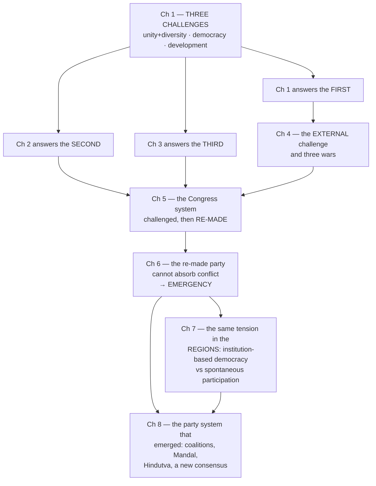

# Class 12 — Politics in India Since Independence — Complete Notes

Detailed, exam-friendly summaries of all **8 chapters** of the current NCERT edition (**Reprint 2026–27**), written by reading the actual chapter PDFs in full — main prose, every box, cartoon caption, film box, margin quotation, leader profile and exercise.

> ⭐⭐⭐ **This is a Tier 1 book for UPSC.** Together with *Indian Constitution at Work* (Class 11), it is the backbone of GS Paper I (post-independence consolidation), GS Paper II (polity and governance) and PSIR Paper 2. Read it after Class 11 ICW.

## ⚠️ File names DO NOT match content — read this first

Unlike Class 11, the PDFs in this folder carry **legacy filenames from the pre-rationalisation edition**. Files 01–05 are close enough; **files 06, 07 and 08 are wrong**. The `.md` notes here are named by **true content**.

| PDF file | What the PDF actually contains |
|---|---|
| `01_Challenges_of_Nation_Building.pdf` | ✅ Ch 1 — Challenges of Nation Building |
| `02_Era_of_One_Party_Dominance.pdf` | ✅ Ch 2 — Era of One-Party Dominance |
| `03_Politics_of_Planned_Development.pdf` | ✅ Ch 3 — Politics of Planned Development |
| `04_Indias_External_Relations.pdf` | ✅ Ch 4 — India's External Relations |
| `05_Challenges_to_the_Congress_System.pdf` | ⚠️ Ch 5 — Challenges to **and Restoration of** the Congress System |
| `06_Crisis_of_the_Constitutional_Order.pdf` | ❌ Ch 6 — **The Crisis of Democratic Order** |
| `07_Rise_of_Popular_Movements.pdf` | ❌ Ch 7 — **Regional Aspirations** |
| `08_Regional_Aspirations.pdf` | ❌ Ch 8 — **Recent Developments in Indian Politics** |

The old chapters "Rise of Popular Movements" and "The Crisis of the Constitutional Order" were **removed or retitled** in the rationalised edition. Always open a PDF and check the chapter heading before trusting a filename.

## 🎯 Chapter outcomes at a glance

Every chapter note **opens with a "Chapter Outcome" block** — the one thing that chapter exists to teach, a numbered list of what you should understand after reading it, and three self-check questions to answer without looking. Read it *before* the chapter to know what you are hunting for, and *after* to confirm you got it.

| # | The one thing this chapter exists to teach |
|---|---|
| 1 | India answered the threat of fragmentation **not by suppressing diversity but by accommodating it** — and the gamble paid off |
| 2 | India's one-party dominance was unique because it happened **under democratic conditions** |
| 3 | **Development is a political question, not a technical one** — "the final decision must be a political decision" |
| 4 | Foreign policy is a **two-way interaction** between domestic compulsions and the international climate |
| 5 | Indira Gandhi **restored the Congress's dominance by changing the nature of that dominance** |
| 6 | The Emergency was **constitutional in form** — which is why "this political crisis was more serious than the constitutional crisis" |
| 7 | **Regional aspirations are normal in a democracy**; the answer is negotiation, not suppression |
| 8 | Politics became **more competitive and less ideological at once** — fierce conflict resting on a four-part consensus |

## Chapters

| # | Chapter | One-line theme |
|---|---|---|
| 1 | [Challenges of Nation Building](01_Challenges_of_Nation_Building.md) | Partition's four problems; 565 princely states; Potti Sriramulu and the SRC; **linguistic states strengthened unity** |
| 2 | [Era of One-Party Dominance](02_Era_of_One_Party_Dominance.md) | The 1952 gamble; **45% votes → 74% seats**; the Congress as social + ideological coalition; **factions as strength**; "the Congress system" |
| 3 | [Politics of Planned Development](03_Politics_of_Planned_Development.md) | POSCO and "whose need?"; Left vs Right; the **Bombay Plan by industrialists**; Planning Commission **not constitutional**; First vs Second Plan |
| 4 | [India's External Relations](04_Indias_External_Relations.md) | Non-alignment; **Suez vs Hungary**; Panchsheel and Tibet; **1962, 1965, 1971**; why India rejects the NPT |
| 5 | [Challenges to and Restoration of the Congress System](05_Challenges_to_and_Restoration_of_the_Congress_System.md) | "After Nehru, what?"; the **1967 political earthquake**; the Syndicate; the 1969 split; **Garibi Hatao vs Indira Hatao** |
| 6 | [The Crisis of Democratic Order](06_The_Crisis_of_Democratic_Order.md) | JP and *Sampoorna Kranti*; the Allahabad verdict; **Article 352 on internal disturbance**; the April 1976 habeas corpus ruling; 1977 |
| 7 | [Regional Aspirations](07_Regional_Aspirations.md) | Kashmiriyat and Article 370; **Anandpur Sahib, Blue Star, the Punjab Accord**; Mizoram vs Nagaland; the Assam Movement; **five lessons** |
| 8 | [Recent Developments in Indian Politics](08_Recent_Developments_in_Indian_Politics.md) | End of the Congress system; **Mandal and the Second Backward Classes Commission**; BSP and Kanshi Ram; Hindutva; **the four-part consensus** |

## How the chapters connect (the architecture of the book)

1. **Chapter 1 sets the frame** — three challenges: **unity with diversity, democracy, development**. Chapters 1, 2 and 3 answer them in order.
2. **Chapter 4** adds the **external** dimension, and shows how the wars of 1962, 1965 and 1971 reshaped domestic politics — derailing the plans of Ch 3 and making the leaders of Ch 5.
3. **Chapters 5 and 6 are one continuous argument.** Ch 5 ends by saying the re-made Congress **"could not absorb tensions"** and that democratic space **"actually shrank"**; Ch 6 is what happened next.
4. **Chapters 7 and 8 are the two halves of the aftermath** — the **regional** consequences and the **party-system** consequences.

## ⭐ Threads that run across chapters — this is where the marks are

| Thread | Where it appears |
|---|---|
| **Accommodation vs suppression of diversity** | Linguistic states **Ch 1** → autonomy demands and accords **Ch 7** → the OBC/Dalit claim to a share of power **Ch 8** |
| **The Congress as a coalition** | A "rainbow-like social coalition" with factions **Ch 2** → factions destroyed, leader-centred **Ch 5** → the coalition moves *between* parties **Ch 8** |
| **Article 356 and Centre–State relations** | Kerala 1959 **Ch 2** → dismissal of Akali and other governments **Ch 5, Ch 7** → President's rule in J&K **Ch 7** |
| **Parliament vs the judiciary** | *Kesavananda Bharati*, the supersession of judges, the "committed judiciary" **Ch 6** → *Indira Sawhney* and the Ayodhya verdict **Ch 8** |
| **Planning derailed** | Second Plan's food/industry imbalance **Ch 3** → defence spending after 1962 → plan holiday **Ch 4** → new economic policy **Ch 8** |
| **Backward-caste politics** | Congress support declines **Ch 6** → Janata 1977 and the Mandal Commission appointed **Ch 6** → implemented and upheld **Ch 8** |
| **Protest vs institutions** | The unresolved question posed at the end of **Ch 6** → regional movements **Ch 7** → people's movements in the last paragraph of **Ch 8** |
| **Assassinations as turning points** | Gandhi 1948 **Ch 1** → Indira Gandhi 1984 **Ch 7** → Rajiv Gandhi 1991 **Ch 8** |

## ⭐ The highest-value items in the book (if you revise nothing else)

- **Ch 1** — the **four problems of Partition**; **565 states, paramountcy lapsing, choice left to rulers**; **Manipur's June 1948 election**; **Potti Sriramulu → SRC 1953 → Act 1956 (14 states, 6 UTs)**
- **Ch 2** — **17 crore voters, 15% literate**; **45% votes → 74% seats**; **Kerala 1957 and Article 356 in 1959**; **factions as strength**; **"the Congress system"**
- **Ch 3** — **the Bombay Plan (1944, by industrialists)**; the **Planning Commission's non-constitutional, advisory status**; **K.N. Raj's "hasten slowly"**; **Avadi's socialist pattern**; **urban bias**
- **Ch 4** — **Article 51**; **Suez vs Hungary**; **Panchsheel conceding Tibet**; **Aksai Chin 1957–59**; **Tashkent 1966, Shimla 1972**; **why the NPT is discriminatory**
- **Ch 5** — the **1967 earthquake and the nine States**; **Aya Ram Gaya Ram**; the **Syndicate**; the **1969 conscience vote**; **Congress (O) vs (R)**; **352 seats in 1971**
- **Ch 6** — **JP's two conditions**; **12 / 24 / 25 June 1975**; **Article 352 on internal disturbance**; the **April 1976 habeas corpus ruling**; the **three lessons and the 44th Amendment fix**
- **Ch 7** — **the three regions of J&K and the three Kashmiri grievances**; the **UN's three steps (21 April 1948)**; **Anandpur Sahib's *qaum* and *bolbala***; the **five provisions of the Punjab Accord**; **Mizoram vs Nagaland**; the **five lessons**
- **Ch 8** — the **five developments of the late 1980s**; the **Second Backward Classes Commission** and its **"backward classes = backward castes"** move; **BAMCEF → DS-4 → BSP**; **pitrubhu / punyabhu**; **the four-part consensus**

## Suggested revision order

**First read:** in order, 1 → 8. The book is strictly chronological and each chapter assumes the last.

**Revision for Prelims:** **Ch 1 → Ch 8 → Ch 6 → Ch 4 → Ch 7 → Ch 5 → Ch 2 → Ch 3** — most fact-, date- and name-dense first.

**For Mains / Essay / PSIR:** **Ch 7 → Ch 6 → Ch 5 → Ch 8 → Ch 3** — these five carry the arguments, the quotable lines and the analytical framings that lift an answer.

## Companion material in this repo
- **Class 12 Contemporary World Politics** notes → [`../../Class_12_Contemporary_World_Politics/Notes/00_Index.md`](../../Class_12_Contemporary_World_Politics/Notes/00_Index.md) — read **CWP Ch 3 (Contemporary South Asia)** alongside **Ch 4 and Ch 7** here
- **Class 11 Indian Constitution at Work** → `../../Class_11_Indian_Constitution_at_Work/Notes/` — read **ICW Ch 7 (Federalism)** with **Ch 7** here, and **ICW Ch 9 (Living Document)** with **Ch 6** here
- **Class 11 Political Theory** → `../../Class_11_Political_Theory/Notes/` — **PT Ch 8 (Secularism)** with **Ch 8** here
- Laxmikanth notes → `../../../02_Laxmikanth/`
- Prelims and Mains PYQs → `../../../03_PYQ_Prelims/`, `../../../04_PYQ_Mains/`
- MCQ quiz sources → `../../../05_Quiz_MCQ/`
