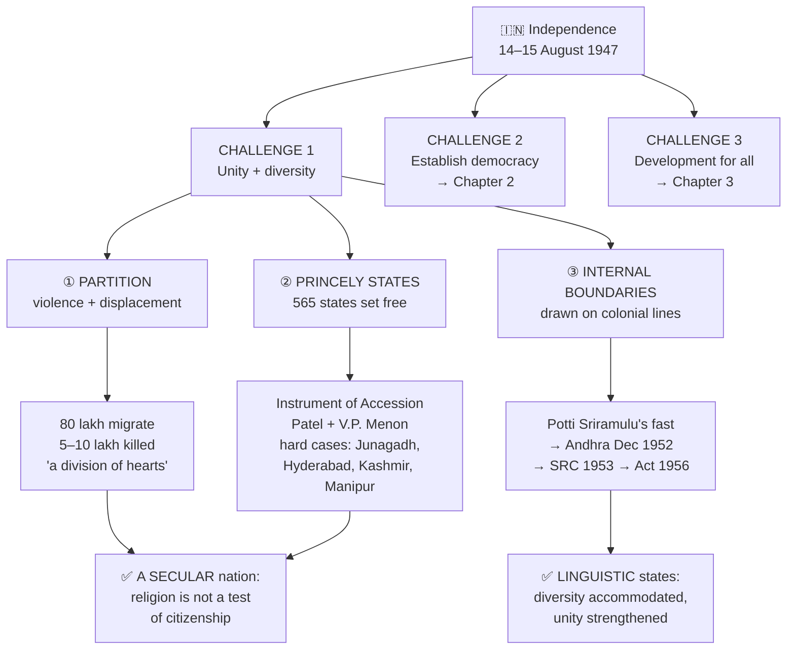
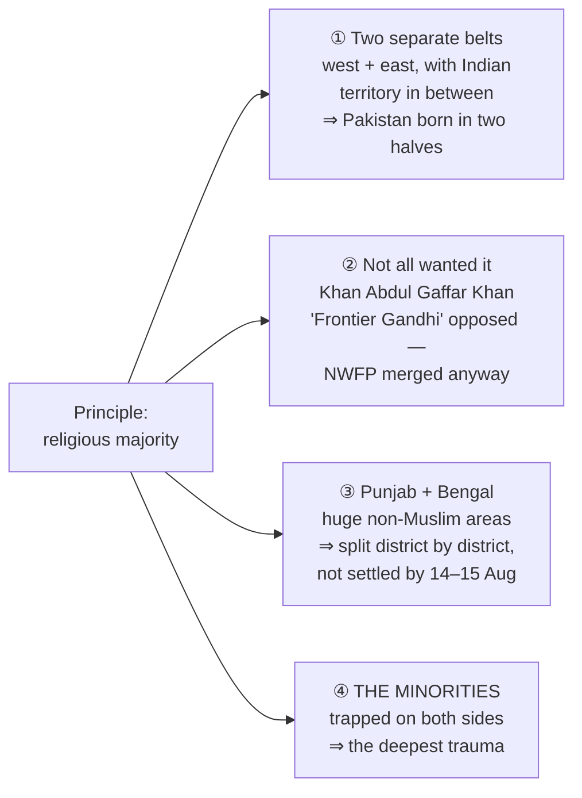
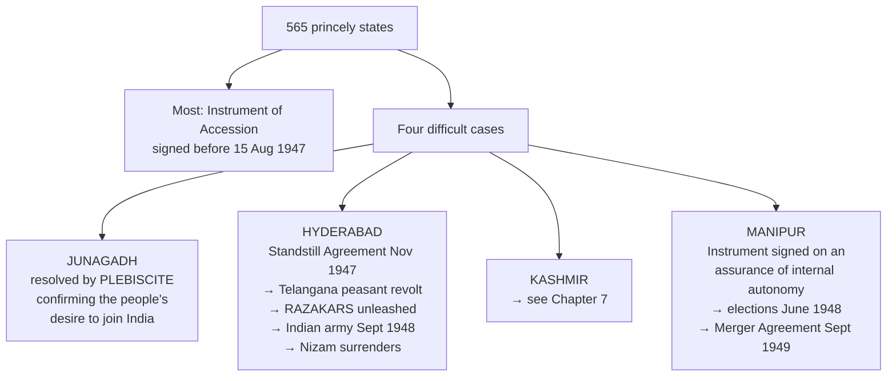
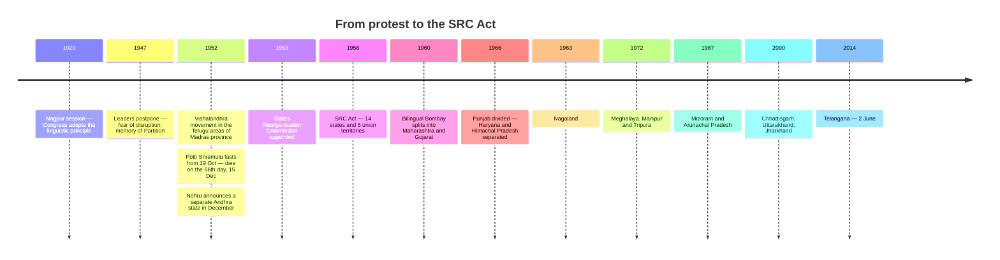

# Chapter 1: Challenges of Nation Building

## 🎯 Chapter Outcome — what you should walk away with

> **The one thing this chapter exists to teach:** India was born in the worst circumstances any nation-state had faced till then — and it answered the threat of fragmentation **not by suppressing diversity but by accommodating it**. Linguistic states were the gamble, and the gamble paid off.

**After reading it, here is what you now understand:**

1. **The three challenges** independent India faced — **unity in diversity** (this chapter), **establishing democracy** (Ch 2), and **development and well-being for all** (Ch 3). The whole book is the answer to these three.
2. **The four problems of Partition** and why they were insoluble: Muslim-majority areas came in **two separate belts**; not all of them wanted Pakistan (Khan Abdul Gaffar Khan); Punjab and Bengal had huge non-Muslim areas and had to be split **district by district**; and above all the **minorities on both sides** were trapped.
3. **The human cost, in the textbook's own numbers** — about **80 lakh** people forced to migrate, **five to ten lakh** killed — and the phrase survivors used: Partition was **"a division of hearts"**.
4. **The princely states problem** — paramountcy lapsed, so **565 states** became legally independent, and the choice was left **to the rulers, not the people**. Patel's three-part approach, the **Instrument of Accession**, and the four hard cases: Junagadh (plebiscite), Hyderabad (Razakars → army, September 1948), Kashmir (Ch 7), Manipur.
5. **That Manipur held the first election in India on universal adult franchise** (June 1948) — before the Republic itself.
6. **Why linguistic states were resisted, then conceded** — leaders feared disintegration; **Potti Sriramulu's 56-day fast unto death** forced Andhra in December 1952; the **States Reorganisation Commission (1953) → SRC Act 1956 → 14 states and 6 union territories**.
7. **The verdict that matters for the exam:** linguistic reorganisation **did not** cause disintegration — "on the contrary it strengthened national unity", and it opened the path to power beyond the small English-speaking elite.

**Self-check — answer these three without looking:**
1. Why could the "religious majority" principle not simply be applied province by province?
2. Who decided whether a princely state would accede — and why was that the whole problem?
3. India's leaders opposed linguistic states. What made them change their minds, and what was the result?

**Where this leads:** Ch 2 takes up the second challenge (democracy), Ch 3 the third (development). The accommodation principle established here returns in **Ch 7, Regional Aspirations** — and is tested there far harder.

---

## 🗺️ The chapter in one picture



---

## The Big Idea

At midnight on 14–15 August 1947 Nehru made the "tryst with destiny" speech. But **"perhaps no other country by then was born in a situation more difficult than that of India in 1947."**

Two goals almost everyone in the national movement agreed on:
1. After independence we shall run the country through **democratic government**.
2. The government will be run **for the good of all**, particularly the poor and the socially disadvantaged.

**The one-line thesis:** the new nation-state faced three challenges at once, and this chapter is about the first — how to be **united yet accommodative of diversity**. The answer India found was not to suppress difference but to give it constitutional and territorial room.

---

## PART 1 — THE THREE CHALLENGES

### Challenge 1 — a nation united, yet accommodative of diversity
India was "a land of continental size and diversity", whose people spoke different languages and followed different cultures and religions. **It was widely believed at the time that a country full of such diversity could not remain together for long** — and the partition of the country "appeared to prove everyone's worst fears."

The serious questions asked at the time:
- Would India survive as a unified country?
- Would it do so **at the cost of every other objective**?
- Would that mean **rejecting all regional and sub-national identities**?
- And the urgent one: **how was the integration of the territory of India to be achieved?**

### Challenge 2 — to establish democracy
The Constitution granted Fundamental Rights and extended the vote to every citizen, and India adopted **representative democracy based on the parliamentary form**.

> ⭐ **The line worth memorising:** "A democratic constitution is **necessary but not sufficient** for establishing a democracy." The challenge was to **develop democratic practices** in accordance with the Constitution.

### Challenge 3 — development and well-being of the entire society
Not of some sections only. The Constitution laid down equality, special protection for socially disadvantaged groups and for religious and cultural communities, and set out welfare goals in the **Directive Principles**. The real challenge was to evolve **effective policies for economic development and the eradication of poverty**.

---

## PART 2 — PARTITION: DISPLACEMENT AND REHABILITATION

### The two-nation theory
Advanced by the **Muslim League**: India consisted of not one but two "people", Hindus and Muslims — hence the demand for a separate country. **The Congress opposed both the theory and the demand.** But political developments through the 1940s, the competition between Congress and the League, and the British role led to the decision to create Pakistan.

### The process — and its four difficulties

The principle adopted was simple to state: **areas where Muslims were in a majority would make up Pakistan.** Applying it was not simple at all.



| # | The difficulty | Why it mattered |
|---|---|---|
| 1 | **No single Muslim-majority belt** — two areas of concentration, one west, one east, with no way to join them | Pakistan came into being as **West and East Pakistan, separated by a long expanse of Indian territory** |
| 2 | **Not all Muslim-majority areas wanted Pakistan.** Khan Abdul Gaffar Khan, undisputed leader of the North Western Frontier Province and known as **"Frontier Gandhi"**, was staunchly opposed to the two-nation theory | "Eventually, his voice was simply ignored and the NWFP was made to merge with Pakistan" |
| 3 | **Punjab and Bengal** — both Muslim-majority provinces — had very large **non-Muslim majority areas**, so both had to be bifurcated by religious majority **at the district or even lower level** | The decision could not be made by midnight of 14–15 August, so **a large number of people did not know on Independence Day whether they were in India or in Pakistan** |
| 4 | **The minorities on both sides** — lakhs of Hindus and Sikhs now in Pakistan, an equally large number of Muslims in Indian Punjab and Bengal (and Delhi) | They discovered they were **"undesirable aliens in their own home"**, in the land where their ancestors had lived for centuries |

> ⚠️ **On the fourth problem, note the failure of anticipation, which the textbook stresses:** "No one had quite anticipated the scale of this problem. No one had any plans for handling this." Leaders kept hoping the violence was temporary. It went out of control, and communities on both sides were "compelled to leave their homes at a few hours' notice."

### Consequences — the numbers and the human reality

**1947 was "the year of one of the largest, most abrupt, unplanned and tragic transfer of population that human history has known."**

```
     THE COST OF PARTITION
     ─────────────────────────────────────────────
     Forced to migrate     ████████████  80 lakh
     Killed in violence    █             5–10 lakh
     Muslim population
     remaining in India                  10–12% (1951 Census)
     ─────────────────────────────────────────────
```

What actually happened:
- Cities like **Lahore, Amritsar and Kolkata** became divided into **"communal zones"** — Muslims avoided Hindu or Sikh areas and vice versa.
- Minorities fled and secured temporary shelter in **refugee camps**, finding "unhelpful local administration and police in what was till recently their own country."
- They travelled by all sorts of means, **often on foot**, and even during the journey were attacked, killed or raped.
- **Thousands of women were abducted**, made to convert to the abductor's religion and forced into marriage. **In many cases women were killed by their own family members to preserve "family honour."**
- **Many children were separated from their parents.** For lakhs, freedom meant life in refugee camps "for months and sometimes for years."

**What else got divided:** not merely properties, liabilities and assets, but "financial assets, and things like tables, chairs, typewriters, paper-clips, books and also **musical instruments of the police band**!" Government and railway employees were also "divided". Above all it was **"a violent separation of communities who had hitherto lived together as neighbours."**

### 📖 The literary voices the chapter quotes
The chapter deliberately uses literature, because writers, poets and film-makers "have expressed the ruthlessness of the killings and the suffering of displacement" — and it is from them that the phrase **"a division of hearts"** comes.

| Voice | Work | The line |
|---|---|---|
| **Faiz Ahmed Faiz** (1911–1984), born in Sialkot, stayed in Pakistan, a leftist who opposed the Pakistani regime and was imprisoned | *Subh-e-azadi* ("The Dawn of Freedom") | *"This scarred, marred brightness, this bitten-by-night dawn — the one that was awaited, surely, **this is not that dawn**."* |
| **Amrita Pritam** (1919–2005), Punjabi poet, Sahitya Akademi / Padma Shree / Jnanpith | *"Aaj Akhan Waris Shah Nun"* | *"Today, I call Waris Shah, 'Speak from your grave'… Once, a daughter of Punjab cried and you wrote a wailing saga; **today, a million daughters cry to you**… Someone has mixed poison in the five rivers' flow."* |
| **Saadat Hasan Manto** | *Kasre-Nafsi* ("Hospitality Delayed") | Rioters halt a train, pull out and slaughter "people belonging to the other community" — then the remaining passengers are **"treated to halwa, fruits and milk"**, with an apology that the news of the train's arrival was delayed "so we have not been able to entertain you lavishly." |
| **M.S. Sathyu**, *Garam Hawa* (1973), screenplay **Kaifi Azmi**, with **Balraj Sahani** | Film | Salim Mirza, a shoe manufacturer in Agra, "increasingly finds himself a stranger amid the people he has lived with all his life"; a refugee occupies his ancestral dwelling; the decisive moment is a **students' procession demanding fair treatment**, which his son has joined |

### 🗣️ The three political statements to know

| Speaker | Date | What was said |
|---|---|---|
| **Mahatma Gandhi**, Kolkata | 14 Aug 1947 | *"Tomorrow we shall be free from the slavery of the British domination. But at midnight India will be partitioned. **Tomorrow will thus be a day of rejoicing as well as of mourning**."* |
| **Mohammad Ali Jinnah**, Presidential Address to Pakistan's Constituent Assembly, Karachi | 11 Aug 1947 | *"You are free; you are free to go to your temples… to your mosques or to any other place of worship in this State of Pakistan. You may belong to any religion or caste or creed — **that has nothing to do with the business of the State**."* |
| **Jawaharlal Nehru**, Letter to Chief Ministers | 15 Oct 1947 | *"We have a Muslim minority who are so large in numbers that they cannot, even if they want, go anywhere else… we have got to deal with this minority in a **civilised manner**… If we fail to do so, we shall have a **festering sore which will eventually poison the whole body politic** and probably destroy it."* |

> ⭐ **Nehru's letter is the answer to exercise question 6** — his reasons for keeping India secular were **both ethical and prudential**. Ethical: equal citizenship regardless of faith. Prudential: a mistreated minority of that size would destroy the body politic from within.

### The deeper issue Partition posed
The leaders of the national struggle **did not believe in the two-nation theory** — and yet partition on a religious basis had taken place. **Did that make India a Hindu nation automatically?**

Even after large-scale migration, the Muslim population of India was **10–12 per cent of the total in 1951**. So how would the government treat its Muslim citizens and other religious minorities — Sikhs, Christians, Jains, Buddhists, Parsis and Jews?

The competing pressures were real: the Muslim League had been formed to protect Muslim interests and led the demand for a separate nation; and "there were organisations which were trying to organise the Hindus in order to turn India into a Hindu nation."

> ⭐ **The answer, and the foundation of Indian secularism:** most leaders of the national movement believed India **"must treat persons of all religions equally"** and should not give "superior status to adherents of one faith and inferior to those who practised another." All citizens would be equal irrespective of religious affiliation — **"being religious or a believer would not be a test of citizenship."** This ideal was enshrined in the Constitution.

### 🕊️ Mahatma Gandhi's sacrifice
- On **15 August 1947 Gandhi did not participate in any independence day celebration.** He was in Kolkata, in areas torn by riots, "saddened by the communal violence and disheartened that the principles of **ahimsa** and **satyagraha** that he had lived and worked for had failed to bind the people in troubled times."
- His presence greatly improved the situation, and independence was celebrated there **in a spirit of communal harmony, with joyous dancing in the streets.** When riots erupted again he **resorted to a fast** to bring peace.
- He then moved to **Delhi**, deeply concerned that Muslims should be allowed to stay in India **with dignity, as equal citizens**, and unhappy with the Indian government's decision **not to honour its financial commitments to Pakistan**.
- His **last fast, January 1948**, had a dramatic effect: communal tension fell, Muslims could safely return home, and **the government agreed to give Pakistan its dues**.
- **Extremists in both communities blamed him.** On **30 January 1948**, **Nathuram Vinayak Godse** shot him during his evening prayer in Delhi.

---

## PART 3 — INTEGRATION OF THE PRINCELY STATES

### The structure of British India

```
                    BRITISH INDIA
          ┌──────────────────┴──────────────────┐
   BRITISH INDIAN PROVINCES              PRINCELY STATES
   directly under British         ruled by princes, control over
        government               internal affairs so long as they
                                 accepted British supremacy
                                 = PARAMOUNTCY / SUZERAINTY
                                 ⅓ of the land area · 1 in 4 Indians
```

### The problem
Just before Independence the British announced that with the end of their rule, **paramountcy over the princely states would also lapse**. This meant all these states — **565 in all** — would become **legally independent**, free to join India or Pakistan **or remain independent**.

> ⚠️ **The crucial detail, and the heart of the problem: "This decision was left not to the people but to the princely rulers."**

The problems started at once:
- The ruler of **Travancore** announced that the state had decided on independence.
- The **Nizam of Hyderabad** made a similar announcement the next day.
- The **Nawab of Bhopal** was averse to joining the Constituent Assembly.

Two dangers followed: India might "get further divided into a number of small countries"; and **the prospects of democracy for the people in these states looked bleak**, since most were run in a non-democratic manner and the rulers were unwilling to grant democratic rights. This was "a strange situation, since Indian independence was aimed at unity, self-determination **as well as democracy**."

### The government's approach — three considerations

| # | Consideration |
|---|---|
| 1 | **The people of most princely states clearly wanted to become part of the Indian union** |
| 2 | The government was **prepared to be flexible in giving autonomy to some regions** — the idea was to accommodate plurality |
| 3 | Against the backdrop of partition and the contest over territory, **integration and consolidation of territorial boundaries had assumed supreme importance** |

**Sardar Vallabhbhai Patel (1875–1950)** — Deputy Prime Minister and first Home Minister — "played a historic role in negotiating with the rulers of princely states **firmly but diplomatically**." He was also a member of the Constituent Assembly committees on Fundamental Rights, Minorities and Provincial Constitution.

> **The scale of the task, which the chapter insists "may look easy now":** there were **26 small states in today's Orissa**; the **Saurashtra region of Gujarat had 14 big states, 119 small states** and numerous other administrations.

From Patel's letter to the princely rulers, 1947:
> *"We are at a momentous stage in the history of India. By common endeavour, we can raise the country to new greatness, while **lack of unity will expose us to unexpected calamities**… if we do not cooperate and work together in the general interest, anarchy and chaos will overwhelm us all, great and small, and lead us to total ruin."*

Before 15 August 1947, peaceful negotiations brought **almost all states contiguous to the new boundaries** into the Indian Union, their rulers signing the **Instrument of Accession**.

### The four hard cases



#### Hyderabad
- **The largest of the princely states, surrounded entirely by Indian territory.** Parts of the old state are today in Maharashtra, Karnataka and Andhra Pradesh.
- Its ruler carried the title **Nizam** and **"was one of the world's richest men."** He wanted independent status and entered a **Standstill Agreement with India in November 1947** for a year while negotiations continued.
- Meanwhile **a movement of the people of Hyderabad against the Nizam's rule gathered force.** The **peasantry of the Telangana region** in particular was the victim of his oppressive rule and rose against him. **Women, who had seen the worst of this oppression, joined in large numbers.** Hyderabad town was the nerve centre; **the Communists and the Hyderabad Congress were in the forefront.**
- The Nizam responded by unleashing a paramilitary force, the **Razakars**, whose "atrocities and communal nature knew no bounds" — they "murdered, maimed, raped and looted, **targeting particularly the non-Muslims**."
- **In September 1948 the Indian army moved in.** After a few days of intermittent fighting the Nizam surrendered, and Hyderabad acceded to India.

#### Manipur
- A few days before Independence the Maharaja, **Bodhachandra Singh**, signed the Instrument of Accession **on the assurance that Manipur's internal autonomy would be maintained.**
- Under pressure of public opinion he held **elections in June 1948**, and the state became a **constitutional monarchy**.

> ⭐ **"Thus Manipur was the first part of India to hold an election based on universal adult franchise."** (June 1948 — before the Constitution came into force.) This is a very frequently asked fact.

- In Manipur's Legislative Assembly there were **sharp differences over merger**: the state Congress wanted it, other parties opposed. The Government of India **succeeded in persuading the Maharaja into signing a Merger Agreement in September 1949** — note the phrasing, which the chapter leaves deliberately pointed.

---

## PART 4 — REORGANISATION OF STATES

### Why the boundaries had to be redrawn
Nation-building did not end with partition and integration. The internal boundaries were still colonial: drawn **either for administrative convenience, or simply coinciding with territories annexed by the British or ruled by princely powers.**

The task was to redraw them "so that the **linguistic and cultural plurality** of the country could be reflected **without affecting the unity of the nation**."

### The promise, and the retreat from it

| When | What happened |
|---|---|
| **1920, Nagpur session** | The national movement had **rejected colonial divisions as artificial** and promised the **linguistic principle**. Congress adopted it **for its own organisation** — many Provincial Congress Committees were created by **linguistic zones** that did not follow British administrative divisions |
| **After Independence and Partition** | Leaders **reversed course**. Carving states on the basis of language "might lead to disruption and disintegration"; it would draw attention away from other social and economic challenges; the fate of the princely states was undecided; and **"the memory of partition was still fresh."** The central leadership decided to **postpone** |

**Gandhi, January 1948**, on the other side of the argument:
> *"If linguistic provinces are formed, it will also give a fillip to the regional languages. It would be **absurd to make Hindustani the medium of instruction in all the regions** and it is **still more absurd to use English** for this purpose."*

### The Andhra agitation — how the decision was forced



- Protests began in the **Telugu-speaking areas of the old Madras province**, which then included present-day Tamil Nadu and parts of Andhra Pradesh, Kerala and Karnataka.
- The **Vishalandhra movement** demanded that Telugu-speaking areas be separated into a distinct Andhra province. **Nearly all political forces in the region supported it.**
- **The movement gathered momentum "as a result of the Central government's vacillation."**
- **Potti Sriramulu (1901–1952)** — a Gandhian worker who had left a government job for the Salt Satyagraha, joined individual Satyagraha, and fasted in 1946 demanding that **temples in Madras province be opened to Dalits** — undertook a **fast unto death from 19 October 1952**. He **died on 15 December 1952, on the 56th day.**
- The result: "great unrest and violent outbursts in the Andhra region", people in large numbers on the streets, **many injured or killed in police firing**, and **several legislators in Madras resigning their seats in protest**.
- **The Prime Minister announced the formation of a separate Andhra state in December 1952.**

> 💬 **The textbook's own margin comment, which is worth quoting in an answer:** *"Nehru and other leaders were very popular, and yet the people did not hesitate to agitate for linguistic states against the wishes of the leaders!"*

### The States Reorganisation Commission
The formation of Andhra "spurred the struggle for making of other states on linguistic lines in other parts of the country." These struggles **forced the Central Government** into appointing a **States Reorganisation Commission in 1953**.

- **Its report accepted that the boundaries of the state should reflect the boundaries of different languages.**
- On that basis the **States Reorganisation Act was passed in 1956**, creating **14 states and 6 union territories**.

**🎨 The two Shankar cartoons the chapter reproduces** — worth knowing because cartoon-interpretation questions are common:
- **"Struggle for Survival" (26 July 1953)** — captures the contemporary impression of the demand for linguistic states.
- **"Coaxing the Genie back" (5 February 1956)** — asks whether the SRC could put the **genie of linguism** back in the bottle. The image is the argument: once released, the demand could not be un-made.

### 🚀 Fast Forward — the creation of new states

Accepting the principle did **not** mean all states immediately became linguistic states.

| Year | What was created | The reason |
|---|---|---|
| **1960** | **Maharashtra and Gujarat** | The **bilingual Bombay state** (Gujarati- and Marathi-speaking) split after a popular agitation |
| **1963** | **Nagaland** | — |
| **1966** | **Punjab** (statehood ten years late) | Punjabi-speaking demand not granted in 1956; the territories of today's **Haryana and Himachal Pradesh** were separated from the larger Punjab state |
| **1972** | **Meghalaya** (carved out of Assam), **Manipur, Tripura** | Major north-east reorganisation |
| **1987** | **Mizoram, Arunachal Pradesh** | — |
| **2000** | **Chhattisgarh, Uttarakhand, Jharkhand** | **Not language** — a separate regional culture, or complaints of **regional imbalance in development** |
| **2014** | **Telangana** — 2 June | — |

**Still pending demands:** **Vidarbha** in Maharashtra, **Harit Pradesh** in western Uttar Pradesh, and the **northern region of West Bengal**. "The story of reorganisation has not come to an end."

### ⭐ The verdict — the paragraph the whole chapter builds to

The fear was that demands for separate states "would endanger the unity of the country" and that linguistic states "may foster separatism". **The leadership, under popular pressure, finally made a choice in favour of linguistic states**, hoping that accepting regional and linguistic claims would *reduce* the threat of division — and because accommodation was **more democratic**.

Fifty years on, the assessment:

1. **The path to politics and power was opened to people other than the small English-speaking elite.**
2. Linguistic reorganisation gave **some uniform basis** to the drawing of state boundaries.
3. **"It did not lead to disintegration of the country as many had feared earlier. On the contrary it strengthened national unity."**
4. Above all, **linguistic states underlined the acceptance of the principle of diversity**.

> ⭐⭐ **The definition of democracy this chapter leaves you with:** "When we say that India adopted democracy, it does not simply mean that India embraced a democratic constitution, nor does it merely mean that India adopted the format of elections. The choice was larger than that. **It was a choice in favour of recognising and accepting the existence of differences which could at times be oppositional.** Democracy, in other words, was associated with **plurality of ideas and ways of life**."

---

## Key Words (Glossary)

| Term | Meaning |
|---|---|
| **Two-nation theory** | The Muslim League's claim that India consisted of two "people", Hindus and Muslims, and therefore needed two states. The Congress opposed it |
| **Partition** | The division of British India into India and Pakistan on 14–15 August 1947, on the principle of religious majorities |
| **"Division of hearts"** | The phrase **survivors themselves used** for Partition — it was not merely a division of assets but of communities who had lived as neighbours |
| **Refugee camp** | Temporary shelter for minorities fleeing across the border; for lakhs, "the country's freedom meant life in refugee camps, for months and sometimes for years" |
| **Princely States** | States ruled by princes with control over internal affairs, subject to British supremacy. **565** of them; **⅓ of the land area; 1 in 4 Indians** |
| **Paramountcy / suzerainty** | British supremacy over the princely states — which **lapsed** with the end of British rule, making them legally independent |
| **Instrument of Accession** | The document by which a princely state agreed to become part of the Union of India |
| **Standstill Agreement** | Hyderabad's one-year holding arrangement with India, November 1947, while negotiations continued |
| **Razakars** | The Nizam's paramilitary force, which "murdered, maimed, raped and looted, targeting particularly the non-Muslims" |
| **Vishalandhra movement** | The movement for a separate Andhra state out of the Telugu-speaking areas of Madras province |
| **States Reorganisation Commission (1953)** | Appointed under popular pressure; accepted that state boundaries should reflect language boundaries → **SRC Act 1956** |
| **Secular nation** | Here: a state that treats persons of all religions equally, where **"being religious or a believer would not be a test of citizenship"** |

---

## Quick Recap (14 points)

1. **Three challenges** faced independent India: unity-with-diversity, establishing democracy, and development for all. This chapter is the first; Ch 2 and Ch 3 are the other two.
2. **"A democratic constitution is necessary but not sufficient for establishing a democracy"** — the challenge was to build democratic *practices*.
3. Partition applied the **religious-majority principle**, which ran into **four problems**: two separate Muslim belts, unwilling areas (Gaffar Khan and the NWFP), Punjab and Bengal needing district-level bifurcation, and the **trapped minorities**.
4. Because the Punjab–Bengal boundary was not settled by 14–15 August, **many people did not know on Independence Day which country they were in.**
5. **80 lakh migrated; 5–10 lakh were killed.** Thousands of women were abducted and forcibly converted and married; some were **killed by their own families "to preserve family honour"**.
6. Lahore, Amritsar and Kolkata split into **"communal zones"**. Even the **musical instruments of the police band** were divided.
7. The literary record: **Faiz's *Subh-e-azadi*, Amrita Pritam's call to Waris Shah, Manto's *Kasre-Nafsi*, Sathyu's *Garam Hawa* (1973)**.
8. **Muslims remained 10–12% of India's population in 1951**, which is why the question "did partition make India a Hindu nation?" had to be answered — and was answered by **secularism: religion is not a test of citizenship**.
9. **Gandhi did not celebrate 15 August 1947**; he fasted in Kolkata and again in Delhi in **January 1948**, securing Pakistan's dues; he was killed by **Nathuram Godse on 30 January 1948**.
10. **565 princely states** became legally independent when **paramountcy lapsed** — and the choice was left **to the rulers, not the people**. Travancore, Hyderabad and Bhopal moved first.
11. **Patel's approach** rested on three considerations: popular will, flexibility on autonomy, and the supreme importance of territorial consolidation. Instrument of Accession; **26 small states in today's Orissa**, and **14 big + 119 small states in Saurashtra**.
12. Four hard cases: **Junagadh (plebiscite)**, **Hyderabad (Razakars → army, September 1948)**, **Kashmir (Ch 7)** and **Manipur** — which held **India's first universal-adult-franchise election in June 1948** and merged in **September 1949**.
13. Congress adopted the linguistic principle at **Nagpur in 1920**, retreated after Partition, and was forced back by the **Vishalandhra movement** and **Potti Sriramulu's 56-day fast (died 15 December 1952)** → **Andhra, December 1952** → **SRC 1953** → **SRC Act 1956: 14 states, 6 UTs**.
14. **The verdict:** linguistic states opened politics beyond the English-speaking elite, gave a uniform basis for boundaries, and **strengthened rather than weakened national unity** — because democracy here meant "recognising and accepting the existence of differences which could at times be oppositional."

---

## 60-Second Revision

**THREE CHALLENGES: unity+diversity | democracy | development.** **"A democratic constitution is necessary but not sufficient."** **PARTITION — four problems: two belts / NWFP + Gaffar Khan ignored / Punjab-Bengal split district-wise, undecided on 14-15 Aug / trapped minorities.** **80 LAKH migrated, 5–10 LAKH killed; "division of hearts"; communal zones in Lahore, Amritsar, Kolkata; even the police band's instruments divided.** **FAIZ (*Subh-e-azadi*) | AMRITA PRITAM (Waris Shah) | MANTO (*Kasre-Nafsi*) | *GARAM HAWA* 1973, Sathyu/Kaifi Azmi/Balraj Sahani.** **Gandhi 14 Aug: "a day of rejoicing as well as of mourning"; Jinnah 11 Aug: religion "has nothing to do with the business of the State"; Nehru 15 Oct: a mistreated minority = "a festering sore… poison the whole body politic" (ethical AND prudential).** **Muslims 10–12% in 1951 → secular answer: belief is NOT a test of citizenship.** **Gandhi: no celebration on 15 Aug; Kolkata fast; Delhi fast Jan 1948 → Pakistan's dues paid; killed by NATHURAM GODSE 30 JAN 1948.** **PRINCELY STATES: 565, ⅓ of land, 1 in 4 Indians; paramountcy LAPSED; choice left to RULERS not people; Travancore first, then Hyderabad, Bhopal.** **PATEL: three considerations (popular will / flexible autonomy / territorial consolidation); Instrument of Accession; Orissa 26 states, Saurashtra 14+119.** **JUNAGADH = plebiscite | HYDERABAD = Standstill Nov 1947, Telangana peasants + women, Communists + Hyd Congress, RAZAKARS, army SEPT 1948 | KASHMIR = Ch 7 | MANIPUR = Bodhachandra Singh, FIRST universal-franchise election JUNE 1948, merger SEPT 1949.** **STATES: Nagpur 1920 principle → postponed after Partition → VISHALANDHRA → POTTI SRIRAMULU fast from 19 Oct 1952, died 15 DEC on the 56th day → ANDHRA Dec 1952 → SRC 1953 → ACT 1956 = 14 states + 6 UTs.** **Later: Maha/Guj 1960, Nagaland 1963, Punjab-Haryana-HP 1966, Meghalaya/Manipur/Tripura 1972, Mizoram/Arunachal 1987, Chhattisgarh/Uttarakhand/Jharkhand 2000 (NOT language — regional culture + development imbalance), Telangana 2 JUNE 2014. Pending: Vidarbha, Harit Pradesh, north Bengal.** **Shankar cartoons: "Struggle for Survival" (26 Jul 1953), "Coaxing the Genie back" (5 Feb 1956).** **VERDICT: "It did not lead to disintegration… on the contrary it strengthened national unity." Democracy = "recognising and accepting the existence of differences which could at times be oppositional."**

---

## NCERT Exercises — with answers

**1. Which statement about the partition is incorrect?**
**(d) The scheme of partition included a plan for transfer of population across the border.** — There was **no such plan**. That is precisely why the transfer was "abrupt, unplanned and tragic": "no one had quite anticipated the scale of this problem. No one had any plans for handling this." (a), (b) and (c) are all correct.

**2. Match the principles with the instances:**

| Principle | Instance |
|---|---|
| (a) Mapping of boundaries on **religious** grounds | **(ii) India and Pakistan** |
| (b) Mapping of boundaries on grounds of **different languages** | **(i) Pakistan and Bangladesh** — East Pakistan's Bengali identity produced Bangladesh |
| (c) Demarcating boundaries within a country by **geographical zones** | **(iv) Himachal Pradesh and Uttarakhand** |
| (d) Demarcating boundaries within a country on **administrative and political** grounds | **(iii) Jharkhand and Chhattisgarh** |

**3. Locate the princely states on a map.** Junagadh (Saurashtra, Gujarat) · Manipur (north-east) · Mysore (Karnataka) · Gwalior (Madhya Pradesh).

**4. Bismay vs Inderpreet — was the merger an extension of democracy, or was force used?**
Both are partly right, and the honest answer says so. **For Bismay:** in most states the rulers were unelected and unwilling to grant democratic rights, so accession *did* extend democratic rights to a quarter of India's people; the government's first consideration was that **the people of most states clearly wanted to join**; and Junagadh went by **plebiscite** and Manipur held an **election**. **For Inderpreet:** Hyderabad ended with the **army moving in**, Manipur's merger came from **persuading the Maharaja** while the Assembly was divided, and the initial choice was constitutionally left **to rulers, not people**. The balanced position: the *outcome* was democratic and, given the alternative of fragmentation, defensible — but the *method* was not uniformly consensual, and the textbook does not pretend otherwise.

**5. Gandhi vs Nehru in August 1947 — spell out the agenda of nation building.**
**Gandhi** ("a crown of thorns… the seat of power is a nasty thing… now there will be no end to your being tested") sets an agenda of **humility, moral responsibility and service** — power as a trust and a trial, with the leaders' conduct the real test. **Nehru** ("India will awake to a life of freedom… the achievement we celebrate today is but a step, an opening of opportunity") sets an agenda of **institution-building and forward movement** — freedom as the *beginning* of the task of development and equality, not its completion. Both are needed: Nehru names the destination, Gandhi names the discipline required to reach it honestly. Choose one and defend it with a reason, which is what the question asks.

**6. Nehru's reasons for keeping India secular — only ethical, or also prudential?**
**Both, explicitly.** *Ethical:* persons of all religions must be treated equally; India should not give superior status to one faith; **being a believer is not a test of citizenship.** *Prudential:* the Muslim minority "are so large in numbers that they cannot, even if they want, go anywhere else"; if India failed to deal with them in a civilised manner, **"we shall have a festering sore which will eventually poison the whole body politic and probably destroy it."** Note also the prudential point about India's international standing and the safety of minorities in Pakistan.

**7. Two differences between the nation-building challenge in the eastern and western regions.**
(i) **Scale and character of the migration.** In the **west** (Punjab) the exchange of population was **near-total, extremely rapid and accompanied by the most concentrated violence** — the province was split district by district and communities crossed within hours. In the **east** (Bengal) migration was **more prolonged and staggered**, continuing for years rather than weeks, so the refugee problem was chronic rather than sudden.
(ii) **What remained after Partition.** In the west, very little minority population was left on either side; in the **east**, **large minorities remained on both sides of the border**, so the question of protecting minorities as citizens stayed permanently live — and East Pakistan's separate linguistic identity eventually produced **Bangladesh in 1971**, an outcome the western border never had.

**8. The task of the States Reorganisation Commission, and its most salient recommendation.**
**Task:** appointed in **1953** under popular pressure, to look into the **question of redrawing the boundaries of states**. **Most salient recommendation:** that **the boundaries of the states should reflect the boundaries of different languages** — accepting the linguistic principle. On the basis of its report the **States Reorganisation Act, 1956** created **14 states and 6 union territories**.

**9. The features that make India a nation, given that a nation is an "imagined community".**
A **shared history** — a common national movement and the memory of colonial rule; **shared political ideals** enshrined in the Constitution (democracy, secularism, equality, justice) rather than a shared religion or language; a **common political identity of citizenship** open to all irrespective of faith; a **territory** that people across regions regard as their own; and, crucially, an **accepted framework for expressing difference** — linguistic states, federalism and minority rights — so that regional identity and national identity reinforce rather than compete with each other. *(This links directly to Class 11 Political Theory Ch 7.)*

**10. Ramachandra Guha on India and the Soviet experiment.**
**(a) Commonalities, with an Indian example for each:** unity had to be forged among **many ethnic groups** (the north-east and its distinct communities); among **religious communities** (Hindus, Muslims, Sikhs, Christians after Partition); among **linguistic communities** (the Vishalandhra movement and the SRC); across **social classes** (the Telangana peasant revolt against the Nizam); a **massive geographic and demographic scale** (a country of continental size); and **unpropitious raw material** — "a people divided by faith and driven by debt and disease."
**(b) Two dissimilarities:** India built unity through a **democratic constitution, universal franchise and free elections**, while the Soviet Union used **one-party authoritarian rule**; and India **accommodated** linguistic and regional identity through federal, linguistic states, whereas the Soviet approach subordinated nationalities to a centrally imposed ideology.
**(c) Which worked better:** the Indian experiment — the USSR **broke into fifteen states in 1991**, while India held together. The reason is the one this chapter demonstrates: accommodation of diversity, not its suppression, is what produces durable unity.

---

## Extra UPSC-style questions

1. *"India's leaders opposed linguistic states, then created them — and this reversal strengthened rather than weakened the union."* Examine. **(250 words)**
2. The integration of the princely states is often called Patel's greatest achievement. Assess the claim, distinguishing the cases resolved by consent from those resolved by coercion.
3. "Partition posed a deeper question than the transfer of territory and population." What was that question, and how did the Constitution answer it?
4. **Prelims trap check:** Which of these is/are correct? (i) Manipur was the first part of India to hold an election on universal adult franchise. (ii) The scheme of partition included a plan for the transfer of population. (iii) The SRC Act 1956 created 14 states and 6 union territories. → **(i) and (iii) only.**
5. Distinguish between the reasons for creating states in **1956** and in **2000**. *(1956 = language; 2000 = separate regional culture and complaints of regional imbalance in development.)*

---

*Source: written by reading `01_Challenges_of_Nation_Building.pdf` in full (NCERT, Reprint 2026–27) — main text, all margin quotations, the Faiz, Amrita Pritam and Manto extracts, the *Garam Hawa* film box, the Gandhi's-sacrifice box, both Shankar cartoons, the "Fast Forward" box on new states, the "Let's re-search" activity and all ten exercises.*
