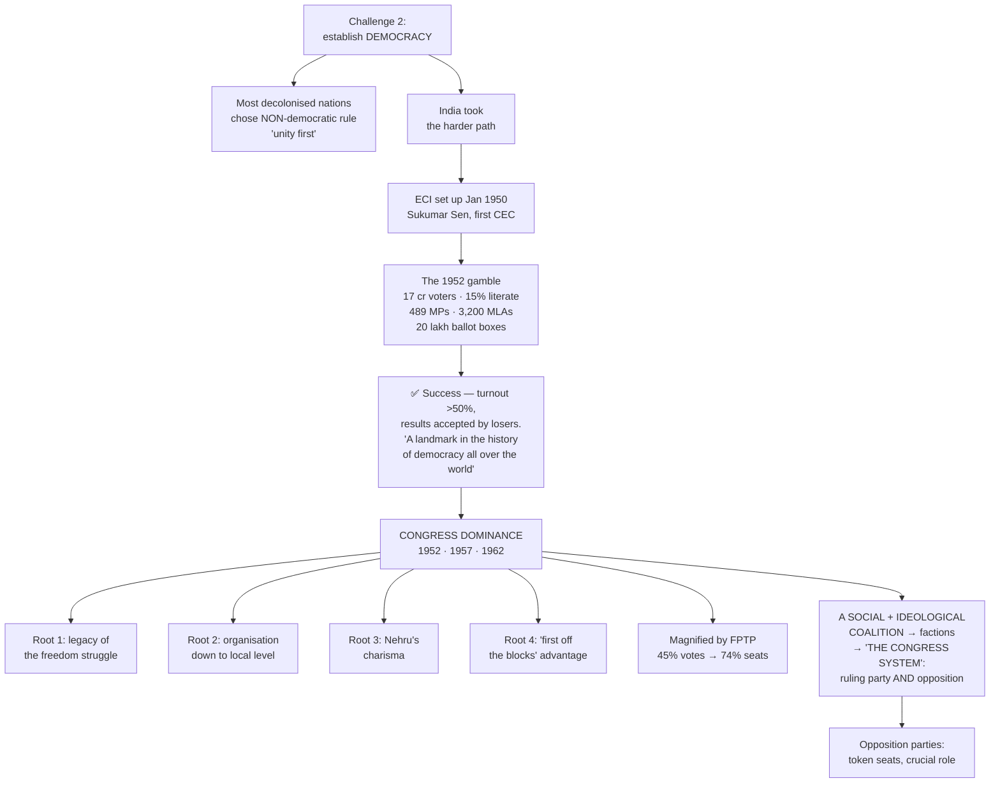
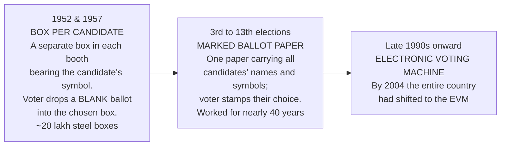
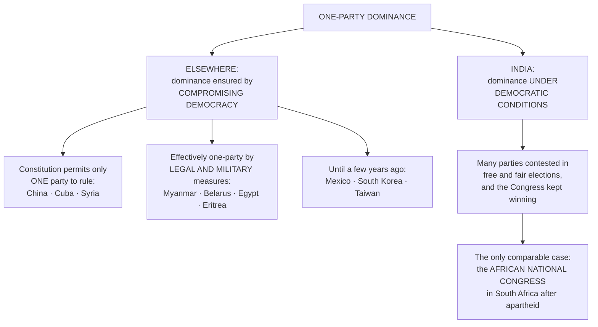

# Chapter 2: Era of One-Party Dominance

## 🎯 Chapter Outcome — what you should walk away with

> **The one thing this chapter exists to teach:** India's one-party dominance was **unique in the world because it happened under democratic conditions**. Elsewhere one party ruled by compromising democracy; here many parties contested free and fair elections — and the Congress simply kept winning.

**After reading it, here is what you now understand:**

1. **Why most decolonised countries chose *not* to be democracies** — they said national unity came first and democracy would introduce differences and conflict. Non-democratic rule took three forms: **nominal democracy with effective control by one leader, one-party rule, or direct army rule** — and each "always started with a promise of restoring democracy very soon."
2. **The sheer scale of the 1952 gamble** — **17 crore voters**, only **15% literate**, electing **489 MPs and about 3,200 MLAs**, with **3 lakh officers trained** and **20 lakh steel ballot boxes**. And the detail that reveals the era: the first draft rolls listed **nearly 40 lakh women** merely as "wife of…" or "daughter of…", and the **Election Commission ordered revision or deletion**.
3. **What the sceptics said and how they were answered** — "the biggest gamble in history", the *Organiser*'s prediction that Nehru "would live to confess the failure of universal adult franchise", the ICS man's "absurd farce" — against the outcome: **more than half turned out, results were accepted as fair even by the losers**, and 1952 "became a landmark in the history of democracy all over the world."
4. **That FPTP artificially magnified the dominance** — in 1952 Congress took **45% of votes but 74% of seats**, while the Socialist Party got **over 10% of votes and under 3% of seats**. Non-Congress votes together exceeded the Congress vote, but they were **split among rivals**.
5. **The four roots of Congress dominance** — the legacy of the freedom struggle, an organisation reaching down to the local level, Nehru's charisma, and the **"first off the blocks" advantage** over parties formed only around or after independence.
6. **The Congress as a social *and* ideological coalition** — a "rainbow-like social coalition" that accommodated "the revolutionary and pacifist, conservative and radical, extremist and moderate."
7. **Why factions were a strength, not a disease** — because groups fought *inside* the party rather than leaving it, **"the Congress acted both as the ruling party as well as the opposition"**. This is what the phrase **"the Congress system"** means.
8. **That the opposition mattered despite winning almost nothing** — it kept the system democratic, "prevented the resentment with the system from turning anti-democratic", and groomed future leaders.

**Self-check — answer these three without looking:**
1. What made India's one-party dominance different from China's, Mexico's or Egypt's?
2. Congress won 74% of seats with 45% of votes. Explain the mechanism in one sentence.
3. Why does the chapter call internal factionalism a *strength* of the Congress?

**Where this leads:** Ch 5 shows this system being challenged from the 1960s; Ch 6 shows what happened when the accommodating character finally broke down.

---

## 🗺️ The chapter in one picture



---

## The Big Idea

The challenge of nation-building (Ch 1) came alongside the challenge of **instituting democratic politics**. Faced with serious challenges, leaders in many other countries decided **their country could not afford to have democracy** — national unity was the first priority, and democracy would "introduce differences and conflicts."

**India took the more difficult path.** And, the chapter insists, "any other path would have been surprising, for our freedom struggle was deeply committed to the idea of democracy."

> ⭐ **The philosophical line to carry into essays:** our leaders "**did not see politics as a problem; they saw it as a way of solving the problems.**" Every society must decide how to govern itself; there are always different policy alternatives and groups with conflicting aspirations. **Democratic politics is the answer to how those differences get resolved.** Competition and power are the most visible things about politics, but "the purpose of political activity is and should be **deciding and pursuing public interest**."

**Ambedkar's warning, Constituent Assembly, 25 November 1949**, printed in the margin of this chapter:
> *"In India… **hero-worship** plays a part in its politics unequalled in magnitude by the part it plays in the politics of any other country… But in politics, hero-worship is a **sure road to degradation and eventual dictatorship**."*

---

## PART 1 — THE FIRST GENERAL ELECTION

### Setting up the machinery
The Constitution was **adopted 26 November 1949, signed 24 January 1950, in force 26 January 1950**. The country was then ruled by an **interim government**; it was now necessary to install the first democratically elected government. **"The Constitution had laid down the rules, now the machine had to be put in place."**

- The **Election Commission of India was set up in January 1950**.
- **Sukumar Sen became the first Chief Election Commissioner.**
- The first general elections were expected **sometime in 1950 itself**. It was thought to be "only a matter of a few months."

### Why it was not a matter of a few months

| Task | The problem |
|---|---|
| **Delimitation** | Drawing the boundaries of the electoral constituencies — took a lot of time |
| **Electoral rolls** | Preparing the list of all citizens eligible to vote — took a lot of time |
| **⭐ The 40 lakh women** | When the first draft of the rolls was published, **the names of nearly 40 lakh women were not recorded** — they were "simply listed as 'wife of…' or 'daughter of…'". **The Election Commission refused to accept these entries and ordered a revision if possible and deletion if necessary** |

### The scale — "no election on this scale had ever been conducted in the world before"

```
   THE 1952 GENERAL ELECTION
   ══════════════════════════════════════════════════
   Eligible voters          17 crore
   Of whom literate         15%   ███
   Illiterate               85%   █████████████████
   Lok Sabha seats          489
   MLAs to be elected       ~3,200
   Officers/polling staff
     trained by the ECI     over 3 lakh
   Steel ballot boxes used  about 20 lakh
   Candidates per seat      more than 4 on average
   Turnout                  more than half the electorate
   ══════════════════════════════════════════════════
```

Because only 15 per cent were literate, **the Election Commission had to think of some special method of voting**.

### 🗳️ Changing methods of voting — the three eras



**The presiding officer from Punjab, in his own words** — the chapter quotes him at length because the detail *is* the point:
> *"Each box had to have its candidate's symbol, both inside and outside it, and outside on either side, had to be displayed the name of the candidate **in Urdu, Hindi and Punjabi** along with the number of the constituency, the polling station and the polling booth. The paper seal with the numerical description of the candidate, signed by the presiding officer, had to be inserted in the token frame… To fix symbols and labels the boxes had first to be **rubbed with sandpaper or a piece of brick**. I found that it took about **five hours for six persons, including my two daughters**, to complete this work. **All this was done at my house.**"*

### The verdict of 1952

**The election had to be postponed twice** and was finally held **from October 1951 to February 1952**. It is called the **1952 election** because most of the country voted in **January 1952**. Campaigning, polling and counting took **six months**.

| The sceptics | What actually happened |
|---|---|
| An Indian editor: **"the biggest gamble in history"** | **More than half the eligible voters turned out** |
| *Organiser* magazine: Nehru **"would live to confess the failure of universal adult franchise in India"** | Elections were **competitive** — more than four candidates per seat on average |
| A British ICS member: "a future and more enlightened age will view with astonishment **the absurd farce of recording the votes of millions of illiterate people**" | **"When the results were declared these were accepted as fair even by the losers."** |

**The press afterwards:**
- *The Times of India*: the polls have **"confounded all those sceptics who thought the introduction of adult franchise too risky an experiment in this country"**.
- *The Hindustan Times*: "there is universal agreement that the Indian people have conducted themselves admirably in **the largest experiment in democratic elections in the history of the world**".

> ⭐⭐ **The world-historical conclusion — quote this in any answer on Indian democracy:** India's general election of 1952 "became a landmark in the history of democracy all over the world. **It was no longer possible to argue that democratic elections could not be held in conditions of poverty or lack of education. It proved that democracy could be practised anywhere in the world.**"

Until then democracy "had existed only in the prosperous countries, mainly in Europe and North America, where nearly everyone was literate" — and **"by that time many countries in Europe had not given voting rights to all women."**

---

## PART 2 — CONGRESS DOMINANCE IN THE FIRST THREE ELECTIONS

### The results

| Election | Congress in the Lok Sabha | Note |
|---|---|---|
| **1952** | **364 of 489 seats** | The **CPI came next with only 16 seats** and emerged as the largest opposition party |
| **1957** | About **three-fourths** of seats | No opposition party won even **one-tenth** of the Congress's seats |
| **1962** | About **three-fourths** of seats | Same |

**In the states:** the Congress won a majority in all states **except Travancore-Cochin (part of today's Kerala), Madras and Orissa** — and **even in those three it eventually formed the government**. "So the party ruled all over the country at the national and the state level." **Nehru became Prime Minister** after the first general election.

### ⚡ Why the dominance was *artificially boosted* — the FPTP effect

```
   1952 — VOTES vs SEATS
   ────────────────────────────────────────────────
                    VOTES          SEATS
   Congress         45%  █████     74%  ████████
   Socialist Party  >10% █          <3% ▏
   ────────────────────────────────────────────────
   Add up all non-Congress votes and they EXCEED the
   Congress vote — but they were divided among rival
   parties and candidates, so Congress stayed ahead.
```

> ⭐ **The mechanism, stated exactly as the textbook does:** "In this system of election… **the party that gets more votes than others tends to get much more than its proportional share.** That is exactly what worked in favour of the Congress." *(This is the Class 11 ICW Ch 3 lesson applied to real data — revise the two together.)*

### 🚩 Communist victory in Kerala, 1957 — the great exception

- In the assembly elections of **March 1957** the **Communist Party won the largest number of seats** in the Kerala legislature — **60 of 126 seats**, plus the support of **five independents**.
- The Governor invited **E.M.S. Namboodiripad**, leader of the Communist legislature party, to form the ministry.

> ⭐ **"For the first time in the world, a Communist party government had come to power through democratic elections."**

- On losing power, the **Congress began a "liberation struggle"** against the elected government. The CPI had come to power promising **radical and progressive policy measures**; the Communists claimed the agitation was **led by vested interests and religious organisations**.
- **In 1959 the Congress government at the Centre dismissed the Communist government in Kerala under Article 356.**

> ⚠️ **"This decision proved very controversial and was widely cited as one of the prominent instances of the misuse of constitutional emergency powers."** *(Connect to Class 11 ICW Ch 7 on Article 356, where Kerala 1959 is named as the case of a government dismissed despite holding a majority.)*

---

## PART 3 — THE NATURE OF CONGRESS DOMINANCE

### What made India different

India was not the only country to experience one-party dominance. **"But there is a crucial difference."**



### The four roots of Congress success

1. **The legacy of the freedom struggle** — the Congress "was seen as inheritor of the national movement", and many leaders who had been in the forefront of that struggle were now contesting as Congress candidates.
2. **Organisation** — "a very well-organised party", spread "across the length and breadth of the country", with **an organisational network down to the local level**.
3. **Nehru** — "the most popular and charismatic leader in Indian politics", who led the campaign and toured the country.
4. **The "first off the blocks" advantage** — "by the time the other parties could even think of a strategy, the Congress had already started its campaign." Many parties **were formed only around independence or after that**.
5. And underlying all of it: **because the Congress was until recently a national movement, "its nature was all-inclusive."**

### The Congress as a social and ideological coalition

**The evolution:** from its origins in **1885 as a pressure group for the newly educated, professional and commercial classes** → a **mass movement** in the twentieth century → a **mass political party**.

- It began "dominated by the **English speaking, upper caste, upper middle-class and urban elite**."
- **"But with every civil disobedience movement it launched, its social base widened."**
- It brought together **diverse groups whose interests were often contradictory**: "peasants and industrialists, urban dwellers and villagers, workers and owners, middle, lower and upper classes and castes."
- Leadership expanded beyond upper-caste, upper-class professionals to **agriculture-based leaders with a rural orientation**.

> ⭐ **The image to remember:** by independence the Congress had become a **"rainbow-like social coalition"** broadly representing India's diversity of classes and castes, religions and languages, and various interests.

**And an *ideological* coalition too.** Many groups merged their identity within the Congress; very often they did not, and **continued to exist inside it as groups and individuals holding different beliefs**. It accommodated **"the revolutionary and pacifist, conservative and radical, extremist and moderate and the right, left and all shades of the centre."** The Congress was **"a 'platform' for numerous groups, interests and even political parties"** — in pre-independence days, many organisations **with their own constitution and organisational structure were allowed to exist within the Congress**. Some, like the Congress Socialist Party, later separated and became opposition parties.

### 🔑 Tolerance and management of factions

This coalition-like character "gave it an unusual strength", in **two** ways:

| # | The mechanism | The consequence |
|---|---|---|
| **1** | **A coalition accommodates all those who join it**, so it must avoid extreme positions and strike a balance on almost all issues. **"Compromise and inclusiveness are the hallmarks of a coalition."** | This put the opposition in difficulty: **"anything that the opposition wanted to say would also find a place in the programme and ideology of the Congress."** |
| **2** | In a coalition-like party there is **greater tolerance of internal differences**, and the ambitions of various groups and leaders are accommodated | So a group unhappy with the party's position or its share of power **"would remain inside the party and fight the other groups rather than leaving the party and becoming an 'opposition'."** |

**These groups inside the party are called factions.** Some were based on ideological considerations, but "very often these factions were rooted in **personal ambitions and rivalries**."

> ⭐⭐ **The central insight of the chapter — and the answer to the margin question "I thought factions were a disease that needed to be cured":**
> **"Instead of being a weakness, internal factionalism became a strength of the Congress."** Because there was room within the party for factions to fight each other, leaders representing different interests and ideologies **remained within the Congress rather than going out to form a new party.**

**How the system actually worked:**
- Most **state units** of the Congress were made up of numerous factions.
- The factions took different ideological positions, making the Congress appear **a grand centrist party**.
- **Other parties primarily attempted to influence these factions**, and thereby influenced policy and decision-making **"from the margins"**. They were "far removed from the actual exercise of authority… not alternatives to the ruling party; instead they constantly **pressurised and criticised, censured and influenced** the Congress."
- **"The system of factions functioned as balancing mechanism within the ruling party."**

> ⭐⭐⭐ **Hence the name:** "Political competition therefore took place **within** the Congress. In that sense, in the first decade of electoral competition **the Congress acted both as the ruling party as well as the opposition.** That is why this period of Indian politics has been described as the **'Congress system'**."

**🎬 *Simhasan* (1981)** — the film box the chapter uses to illustrate factionalism. Marathi, directed by **Jabbar Patel**, screenplay **Vijay Tendulkar**, based on Arun Sadhu's novels *Simhasan* and *Mumbai Dinank*, cast including **Nilu Phule, Arun Sarnaik, Dr Shreeram Lagoo**. Told through journalist **Digu Tipnis** as the silent *sutradhar*, it depicts the tussle for Chief Minister in Maharashtra: **Finance Minister Vishwasrao Dabhade** trying to unseat the incumbent, both wooing trade union leader **D'Casta**, with other politicians bargaining with both sides. Its subject is exactly this chapter's: **"the intense power struggle within the ruling party and the secondary role of the Opposition."**

---

## PART 4 — THE EMERGENCE OF OPPOSITION PARTIES

India "had a **larger number of diverse and vibrant opposition parties** than many other multi-party democracies." Some existed before 1952; some became important in the sixties and seventies. **"The roots of almost all the non-Congress parties of today can be traced to one or the other of the opposition parties of the 1950s."**

### ⭐ Why they mattered despite winning almost nothing

All these parties "succeeded in gaining only a **token representation**" — yet their presence "played a crucial role in **maintaining the democratic character of the system**":

1. They offered **"a sustained and often principled criticism"** of Congress policies and practices.
2. This **kept the ruling party under check** and "often changed the balance of power **within** the Congress."
3. **"By keeping democratic political alternative alive, these parties prevented the resentment with the system from turning anti-democratic."**
4. They **groomed the leaders** who were to play a crucial role in shaping the country.

### 🤝 The mutual respect of the early years — and its decline

- The **interim government** included opposition leaders like **Dr Ambedkar and Shyama Prasad Mukherjee** in the cabinet.
- **Nehru often referred to his fondness for the Socialist Party** and invited socialist leaders like **Jayaprakash Narayan** to join his government.
- **"This kind of personal relationship with and respect for political adversaries declined after the party competition grew more intense."**

**Nehru's own letter to Rajaji**, after Tandon was elected Congress president against his wishes, quoted in the margin:
> *"Tandon's election is considered (by Congress members) more important than my presence in the Govt or the Congress… I have completely exhausted my utility both in the Congress and Govt."*

**🎨 The Shankar cartoon "Tug of War" (29 August 1954)** — the cartoonist's impression of the relative strength of opposition and government. **Nehru and his cabinet colleagues sit on the tree; trying to topple it are A.K. Gopalan, Acharya Kripalani, N.C. Chatterjee, Srikantan Nair and Sardar Hukum Singh.** The image *is* the argument: the opposition pulls hard and the tree does not move.

### The three party profiles the chapter gives in full

```mermaid
flowchart TD
    subgraph SP["🌾 SOCIALIST PARTY"]
        S1["Origin: Congress Socialist Party<br/>formed WITHIN Congress, 1934"]
        S2["1948: Congress bars dual membership<br/>→ forced to form a separate party"]
        S3["Ideology: DEMOCRATIC SOCIALISM —<br/>distinct from BOTH Congress and Communists"]
        S4["⚠️ The 1955 dilemma: Congress declares its<br/>goal to be a 'socialist pattern of society'<br/>→ hard to look like an alternative"]
        S1-->S2-->S3-->S4
    end
    subgraph CPI["☭ COMMUNIST PARTY OF INDIA"]
        C1["Origin: communist groups of the early 1920s,<br/>inspired by the Bolshevik revolution"]
        C2["From 1935 worked within the Congress;<br/>parted ways DEC 1941 over supporting<br/>Britain against Nazi Germany"]
        C3["After 1947: held that the transfer of power<br/>was not true independence → encouraged<br/>violent uprisings in TELANGANA → crushed"]
        C4["1951: ABANDONED the path of violent<br/>revolution, contested the general election<br/>→ 16 seats, largest opposition party"]
        C1-->C2-->C3-->C4
    end
    subgraph BJS["🪔 BHARATIYA JANA SANGH"]
        B1["Formed 1951; founder-President<br/>SHYAMA PRASAD MUKHERJEE"]
        B2["Lineage: RSS and the Hindu Mahasabha"]
        B3["One country, one culture, one nation;<br/>AKHAND BHARAT; Hindi over English;<br/>opposed concessions to minorities;<br/>advocated NUCLEAR WEAPONS after<br/>China's 1964 atomic tests"]
        B4["1952: 3 seats · 1957: 4 seats.<br/>Support from URBAN areas of the<br/>Hindi-speaking states"]
        B1-->B2-->B3-->B4
    end
```



#### 🌾 Socialist Party — the detail
- Roots in **the mass movement stage of the Congress** before independence. The **Congress Socialist Party was formed within the Congress in 1934** by young leaders who wanted "a more radical and egalitarian Congress."
- **In 1948 the Congress amended its constitution to prevent dual party membership**, forcing the Socialists to form a separate **Socialist Party in 1948**.
- **Electoral performance "caused much disappointment to its supporters"** — present in most states, but successful only "in a few pockets."
- They believed in **democratic socialism**, which distinguished them "both from the Congress as well as from the Communists", and criticised the Congress **"for favouring capitalists and landlords and for ignoring the workers and the peasants."**
- **The 1955 dilemma:** when the Congress declared its goal to be **the socialist pattern of society**, "it became difficult for the socialists to present themselves as an effective alternative." The party split on how to respond — **Rammanohar Lohia increased distance and criticism**, while **Asoka Mehta advocated limited cooperation** with the Congress.
- **Splits and reunions** produced the **Kisan Mazdoor Praja Party, the Praja Socialist Party and the Samyukta Socialist Party**.
- **Leaders:** Jayaprakash Narayan, Achyut Patwardhan, Asoka Mehta, **Acharya Narendra Dev** (1889–1956, founding President of the CSP, scholar of Buddhism), Rammanohar Lohia, S.M. Joshi.
- **Descendants today:** the **Samajwadi Party, Rashtriya Janata Dal, Janata Dal (United) and Janata Dal (Secular)**.

#### ☭ Communist Party of India — the detail
- Communist groups emerged in the early 1920s inspired by the **Bolshevik revolution**, advocating socialism as the solution.
- **From 1935 they worked mainly from within the Indian National Congress.** **"A parting of ways took place in December 1941, when the Communists decided to support the British in their war against Nazi Germany."**
- Unlike other non-Congress parties, the CPI had **"a well-oiled party machinery and dedicated cadre"** at independence.
- **The question that troubled the party: was India really free, or was freedom a sham?** Concluding that the 1947 transfer of power was not true independence, it **encouraged violent uprisings in Telangana**, **failed to generate popular support and was crushed by the armed forces**.
- **In 1951 the party abandoned the path of violent revolution** and decided to contest the approaching general elections — **winning 16 seats and emerging as the largest opposition party**. Support was concentrated in **Andhra Pradesh, West Bengal, Bihar and Kerala**.
- **Leaders:** **A.K. Gopalan** (1904–1977, Kerala; a Congress worker who joined the CPI in 1939; MP from 1952), S.A. Dange, E.M.S. Namboodiripad, P.C. Joshi, Ajay Ghosh, P. Sundarraya.
- **The 1964 split**, following the ideological rift between the Soviet Union and China: **the pro-Soviet faction remained the CPI; the opponents formed the CPI(M)**. Both continue to exist.

#### 🪔 Bharatiya Jana Sangh — the detail
- **Formed 1951**, founder-President **Shyama Prasad Mukherjee**; lineage traced to the **RSS and the Hindu Mahasabha**.
- Emphasised **"one country, one culture and one nation"**, and believed the country could become modern, progressive and strong **on the basis of Indian culture and traditions**.
- Called for **reunion of India and Pakistan in *Akhand Bharat***; was in the forefront of the agitation to **replace English with Hindi** as the official language; **opposed the granting of concessions to religious and cultural minorities**.
- **"A consistent advocate of India developing nuclear weapons, especially after China carried out its atomic tests in 1964."**
- **In the 1950s it remained on the margins** — **3 Lok Sabha seats in 1952, 4 in 1957** — with support mainly from **urban areas in the Hindi-speaking states**: Rajasthan, Madhya Pradesh, Delhi, Uttar Pradesh.
- **Leaders:** Shyama Prasad Mukherjee, **Deen Dayal Upadhyaya** (1916–1968, full-time RSS worker from 1942; originated the concept of **integral humanism**), Balraj Madhok.
- **The Bharatiya Janata Party traces its roots to the Bharatiya Jana Sangh.**

> ⚠️ **A gap you must know about:** the exercises at the end of this chapter ask about the **Swatantra Party** and about **Minoo Masani**, but the box describing that party **was removed in the rationalised edition** — so the text no longer contains the answer. For completeness: the **Swatantra Party was founded in August 1959** after the Congress's Nagpur resolution on cooperative farming, led by **C. Rajagopalachari, Minoo Masani and N.G. Ranga**. Its guiding principle was **an economy free from State control** — it opposed centralised planning, nationalisation and the licence-permit regime, and favoured the princes and landlords. Keep this: it is regularly examined.

### 👤 The leaders profiled in the margins

| Leader | Who they were |
|---|---|
| **Maulana Abul Kalam Azad** (1888–1958) | Original name Abul Kalam Mohiyuddin Ahmed; scholar of Islam; freedom fighter and Congress leader; **proponent of Hindu-Muslim unity, opposed to Partition**; member of the Constituent Assembly; **Education Minister in the first cabinet** |
| **Rajkumari Amrit Kaur** (1889–1964) | Gandhian and freedom fighter; of the **royal family of Kapurthala**; inherited Christianity from her mother; member of the Constituent Assembly; **first Health Minister**, continuing till 1957 |
| **Dr B.R. Ambedkar** (1891–1956) | Leader of the anti-caste movement; founder of the **Independent Labour Party**, later the **Scheduled Castes Federation**; planned the **Republican Party of India**; member of the Viceroy's Executive Council; **Chairman of the Drafting Committee**; Minister in Nehru's first cabinet; **resigned in 1951 over differences on the Hindu Code Bill**; **adopted Buddhism in 1956** with thousands of followers |
| **Rafi Ahmed Kidwai** (1894–1954) | Congress leader from U.P.; Minister in U.P. in 1937 and 1946; **Minister for Communications** in the first ministry; Food and Agriculture Minister 1952–54 |
| **Shyama Prasad Mukherjee** (1901–1953) | Leader of the Hindu Mahasabha; **founder of the Bharatiya Jana Sangh**; Minister in Nehru's first cabinet; **resigned in 1950 over differences on relations with Pakistan**; **opposed India's policy of autonomy to Jammu & Kashmir**; **arrested during the Jana Sangh's agitation against the Kashmir policy and died during detention** |
| **Acharya Narendra Dev** (1889–1956) | Freedom fighter; **founding President of the Congress Socialist Party**; jailed several times; active in the peasants' movement; a scholar of Buddhism |
| **A.K. Gopalan** (1904–1977) | Communist leader from Kerala; joined the CPI in 1939; **after the 1964 split joined the CPI(M)**; respected as a parliamentarian; MP from 1952 |
| **Deen Dayal Upadhyaya** (1916–1968) | Full-time RSS worker from 1942; founder member of the BJS; General Secretary and later President; **initiated the concept of integral humanism** |

---

## PART 5 — THE VERDICT ON THE FIRST PHASE

The first phase of democratic politics was **"quite unique"**:

1. **The inclusive character of the national movement** led by the Congress enabled it to attract different sections, groups and interests, **making it a broad-based social and ideological coalition.**
2. **The key role of the Congress in the freedom struggle gave it a head start over others.**
3. **⭐ And the crucial forward-looking sentence:** "As the **ability of the Congress to accommodate all interests and all aspirants for political power steadily declined**, other political parties started gaining greater significance."

> **"Thus, Congress dominance constitutes only one phase in the politics of the country."** *(Chapters 5, 6 and 8 are the other phases.)*

---

## Key Words (Glossary)

| Term | Meaning |
|---|---|
| **Delimitation** | Drawing the boundaries of electoral constituencies |
| **Electoral roll** | The list of all citizens eligible to vote — where the "nearly 40 lakh women" problem was found |
| **Universal adult franchise** | The right to vote for every adult citizen regardless of literacy, property or sex — India's "biggest gamble in history" in 1952 |
| **One-party dominance** | A situation where one party keeps winning; **in India uniquely, under free and fair democratic conditions** |
| **Social coalition** | A party bringing together diverse groups whose interests are often contradictory — the Congress as a **"rainbow-like social coalition"** |
| **Ideological coalition** | Accommodating "the revolutionary and pacifist, conservative and radical, extremist and moderate and the right, left and all shades of the centre" |
| **Faction** | A group inside a party. In the Congress they were **tolerated and even encouraged**, and became a **strength** because leaders stayed in rather than splitting away |
| **The "Congress system"** | The description of this era: political competition took place **within** the Congress, so it "acted both as the ruling party as well as the opposition" |
| **Democratic socialism** | The Socialist Party's ideology, distinguishing it **both** from the Congress and from the Communists |
| **Socialist pattern of society** | The goal declared by the Congress in **1955**, which stole the Socialists' distinct appeal |
| **Akhand Bharat** | The Jana Sangh's call for a reunion of India and Pakistan |
| **Integral humanism** | The concept initiated by **Deen Dayal Upadhyaya** |
| **"Liberation struggle"** | The Congress agitation against the elected Communist government in Kerala, preceding its dismissal under **Article 356 in 1959** |

---

## Quick Recap (15 points)

1. Many decolonised countries chose **non-democratic rule** — nominal democracy under one leader, one-party rule, or army rule — each promising to restore democracy "very soon". **India took the more difficult path.**
2. **Politics was seen not as a problem but as the way of solving problems**; the purpose of political activity "is and should be deciding and pursuing public interest."
3. **Ambedkar, 25 Nov 1949:** hero-worship in Indian politics is "**a sure road to degradation and eventual dictatorship**."
4. **ECI set up January 1950; Sukumar Sen the first CEC.** Elections expected in 1950, postponed twice, held **October 1951 – February 1952**, called the 1952 election; six months for campaigning, polling and counting.
5. **Nearly 40 lakh women** were listed only as "wife of…"/"daughter of…"; the **EC refused the entries and ordered revision or deletion**.
6. Scale: **17 crore voters, 15% literate, 489 Lok Sabha seats, ~3,200 MLAs, 3 lakh staff trained, ~20 lakh steel ballot boxes**, more than four candidates per seat, **turnout above half**.
7. **Three voting methods:** box-per-candidate with a blank ballot (first two elections) → marked ballot paper with all names and symbols (3rd–13th, nearly forty years) → **EVM, universal by 2004**.
8. **Results were accepted as fair even by the losers.** 1952 "proved that democracy could be practised anywhere in the world."
9. **1952: Congress 364/489; CPI next with 16.** Congress also won the states except **Travancore-Cochin, Madras and Orissa** — and formed governments even there. 1957 and 1962: about **three-fourths** of seats.
10. **FPTP magnified it: 45% of votes → 74% of seats in 1952**; the Socialists took over 10% of votes and under 3% of seats. Non-Congress votes together exceeded Congress's but were **split**.
11. **Kerala 1957:** CPI won **60 of 126** seats plus 5 independents; **E.M.S. Namboodiripad** formed the ministry — **"for the first time in the world, a Communist party government had come to power through democratic elections."** Dismissed under **Article 356 in 1959** after the Congress "liberation struggle" — a prominent instance of **misuse of emergency powers**.
12. **India's dominance was unique** because it occurred **under democratic conditions**, unlike China/Cuba/Syria (constitutionally single-party), Myanmar/Belarus/Egypt/Eritrea (legal and military measures), or Mexico/South Korea/Taiwan. The comparable case is the **ANC in South Africa**.
13. **Four roots:** freedom-struggle legacy, organisation down to the local level, Nehru's charisma, and the **"first off the blocks"** advantage — plus an **all-inclusive** character.
14. **Congress = social coalition ("rainbow-like") + ideological coalition.** **Factions were a strength**, because dissenters fought inside rather than leaving; other parties influenced policy only **"from the margins"** → **"the Congress system"**, where the party "acted both as the ruling party as well as the opposition."
15. **Opposition parties: Socialist (CSP 1934 → separate party 1948; democratic socialism; the 1955 "socialist pattern" dilemma; Lohia vs Asoka Mehta), CPI (from within Congress till Dec 1941; Telangana uprising crushed; renounced violence in 1951; 16 seats; split 1964 into CPI and CPI(M)), Jana Sangh (1951, Shyama Prasad Mukherjee; RSS/Hindu Mahasabha lineage; Akhand Bharat; Hindi; nuclear weapons after China 1964; 3 and 4 seats).** They won little but **kept the system democratic** and **prevented resentment from turning anti-democratic**.

---

## 60-Second Revision

**Most ex-colonies chose NON-democracy (one leader / one party / army), always "promising to restore democracy soon". India took the harder path — politics as the SOLUTION, not the problem.** **AMBEDKAR 25 Nov 1949: hero-worship = "a sure road to degradation and eventual dictatorship."** **ECI Jan 1950, SUKUMAR SEN first CEC. 40 LAKH WOMEN listed as "wife of/daughter of" → entries REFUSED.** **17 CRORE voters, 15% LITERATE, 489 LS + 3,200 MLAs, 3 LAKH staff, 20 LAKH steel boxes, >4 candidates/seat, turnout >50%. Postponed twice; polled Oct 1951–Feb 1952; six months to complete.** **Sceptics: "biggest gamble in history" / *Organiser*: Nehru "would live to confess the failure" / ICS: "absurd farce". Answer: *Times of India* "confounded all those sceptics"; *Hindustan Times* "the largest experiment in democratic elections in the history of the world". → "It proved that democracy could be practised anywhere in the world."** **VOTING: box-per-candidate + blank ballot (1st–2nd) → marked ballot paper (3rd–13th, ~40 yrs) → EVM, whole country by 2004.** **1952: CONGRESS 364/489; CPI 16 = largest opposition. States: all except TRAVANCORE-COCHIN, MADRAS, ORISSA — and formed govts even there. 1957 & 1962 ≈ ¾ of seats; no opposition party reached even 1/10th.** **FPTP: 45% VOTES → 74% SEATS; Socialists >10% votes → <3% seats; non-Congress votes exceeded Congress but were SPLIT.** **KERALA MARCH 1957: CPI 60/126 + 5 independents → E.M.S. NAMBOODIRIPAD — "for the first time in the world, a Communist party government had come to power through democratic elections." Congress "LIBERATION STRUGGLE" → dismissed under ART 356 in 1959 = prominent instance of MISUSE.** **UNIQUENESS: elsewhere dominance = compromising democracy (China/Cuba/Syria constitutionally; Myanmar/Belarus/Egypt/Eritrea by legal-military means; Mexico/S.Korea/Taiwan formerly). Comparable case = ANC, South Africa.** **FOUR ROOTS: freedom-struggle legacy / organisation to local level / Nehru / "FIRST OFF THE BLOCKS". Congress 1885 pressure group → mass movement → "RAINBOW-LIKE SOCIAL COALITION" + IDEOLOGICAL coalition.** **FACTIONS = STRENGTH, not disease: dissenters fight INSIDE; others influence "from the margins"; balancing mechanism → "THE CONGRESS SYSTEM" = ruling party AND opposition at once. Film: *SIMHASAN* 1981, Jabbar Patel, Vijay Tendulkar.** **OPPOSITION: SOCIALIST — CSP within Congress 1934, dual membership barred 1948 → separate party; DEMOCRATIC SOCIALISM; 1955 "socialist pattern" dilemma; Lohia (distance) vs Asoka Mehta (cooperation); → SP/RJD/JD(U)/JD(S). CPI — Bolshevik-inspired 1920s, inside Congress from 1935, PARTED DEC 1941 over backing Britain vs Nazi Germany, TELANGANA uprising crushed, renounced violence 1951, 16 seats, SPLIT 1964 (Soviet=CPI, others=CPI-M). JANA SANGH — 1951, SHYAMA PRASAD MUKHERJEE, RSS+Hindu Mahasabha, one country-one culture-one nation, AKHAND BHARAT, Hindi over English, opposed minority concessions, NUCLEAR WEAPONS after China 1964; 3 seats (1952), 4 (1957); urban Hindi belt; Deen Dayal Upadhyaya = INTEGRAL HUMANISM; → BJP.** **⚠️ SWATANTRA (dropped from the rationalised text but still in the exercises): 1959, C. Rajagopalachari + Minoo Masani + N.G. Ranga, "economy free from State control".** **Opposition won little but kept the system democratic and "prevented the resentment with the system from turning anti-democratic". Nehru to Rajaji on Tandon: "I have completely exhausted my utility both in the Congress and Govt." Shankar's "TUG OF WAR" 29 Aug 1954.** **VERDICT: as the Congress's ability to accommodate all interests DECLINED, other parties gained significance — "Congress dominance constitutes only one phase."**

---

## NCERT Exercises — with answers

**1. Fill in the blanks.**
**(a)** The First General Elections in 1952 involved simultaneous elections to the Lok Sabha and **State Assemblies**.
**(b)** The party that won the second largest number of Lok Sabha seats in the first elections was the **Communist Party of India** (16 seats).
**(c)** One of the guiding principles of the ideology of the Swatantra Party was **economy free from State control**.

**2. Match the leaders with their parties.**

| Leader | Party |
|---|---|
| (a) **S.A. Dange** | **(iv) Communist Party of India** |
| (b) **Shyama Prasad Mukherjee** | **(i) Bharatiya Jana Sangh** |
| (c) **Minoo Masani** | **(ii) Swatantra Party** |
| (d) **Asoka Mehta** | **(iii) Praja Socialist Party** |

**3. True or false on one-party dominance.**
**(a) One-party dominance is rooted in the absence of strong alternative political parties — TRUE.** India had many opposition parties, but none could offer a genuine alternative: the Congress had the organisation, the freedom-struggle legacy and the first-mover advantage, and its coalitional breadth meant "anything that the opposition wanted to say would also find a place in the programme and ideology of the Congress."
**(b) One-party dominance occurs because of weak public opinion — FALSE.** Public opinion in India was neither weak nor passive: turnout exceeded half in 1952, and people agitated against the leadership's own wishes on linguistic states (Ch 1). The Congress won because opposition votes were divided, not because opinion was absent.
**(c) One-party dominance is linked to the nation's colonial past — TRUE in India's case.** The Congress's dominance flowed directly from **its role in the anti-colonial movement** — it was "seen as inheritor of the national movement." The same pattern produced the ANC's dominance in South Africa.
**(d) One-party dominance reflects the absence of democratic ideals in a country — FALSE.** This is the chapter's central claim reversed. Indian dominance occurred **under democratic conditions**, through free and fair elections that the losers accepted — which is exactly what distinguished it from China, Egypt or Myanmar.

**4. Map work.**
**(a) States where the Congress was *not* in power at some point during 1952–67:** **Kerala** (CPI ministry, 1957) and **Tamil Nadu/Madras** (DMK from 1967) — Orissa and Punjab are also acceptable for the non-Congress governments of 1967.
**(b) States where the Congress remained in power through the period:** **Maharashtra** and **Andhra Pradesh** (Karnataka/Mysore and Gujarat also acceptable).

**5. Rajni Kothari on Patel and the character of the Congress.**
**(a) Why the author thinks the Congress should not have been a cohesive and disciplined party.** Because its **historic function was to be an all-embracing platform, not a cadre party of one ideology**. Its strength lay precisely in accommodating contradictory interests — peasants and industrialists, workers and owners, right, left and centre. A "close-knit party of disciplined cadres" purged of other groups would have **forced those groups out into opposition**, destroying the mechanism by which the Congress absorbed dissent and governed a plural society. Kothari calls this the **"eclectic role"** the Congress would be "called upon to perform in the decades to follow" — precisely what Patel's model would have made impossible.
**(b) Examples of the eclectic role in the early years.** Accommodating socialists and conservatives simultaneously; **adopting the "socialist pattern of society" in 1955** while retaining the support of industrialists; taking **opposition leaders like Ambedkar and Shyama Prasad Mukherjee into the cabinet**; tolerating internal factions with sharply opposed ideological positions so the party appeared **"a grand centrist party"**; and accepting linguistic states under popular pressure despite the leadership's own opposition.
**(c) Why Gandhi's view was "romantic".** Gandhi wanted to **carry on the movement** — to dissolve the Congress as a political party and keep it as a body of social workers serving the people. Kothari calls this romantic because a newly independent state needed an **instrument to actually govern**: to contest elections, form governments, administer, and resolve conflicting claims. A moral movement without political machinery could not have done that. So both Patel and Gandhi misjudged, in opposite directions — Patel toward too much discipline, Gandhi toward too little politics.

---

## Extra UPSC-style questions

1. *"The Congress system was not the absence of opposition but its internalisation."* Examine with reference to factions. **(250 words)**
2. India's 1952 election is called a landmark in world democratic history. Justify, with specific reference to the assumptions it overturned.
3. Explain how the First Past the Post system converted a plurality of votes into a monopoly of seats between 1952 and 1962. Should India have adopted proportional representation instead?
4. The dismissal of the Kerala government in 1959 is cited as an early misuse of Article 356. Discuss what it revealed about Centre–State relations under one-party dominance.
5. **Prelims trap check:** Which is/are correct? (i) The CPI was the second-largest party by seats in 1952. (ii) The Socialist Party was formed within the Congress in 1948. (iii) The Jana Sangh won 3 Lok Sabha seats in 1952. → **(i) and (iii) only.** *(The Congress Socialist Party was formed within the Congress in 1934; the separate Socialist Party came in 1948.)*

---

*Source: written by reading `02_Era_of_One_Party_Dominance.pdf` in full (NCERT, Reprint 2026–27) — main text, the Ambedkar and Nehru margin quotations, the "Changing methods of voting" box with the Punjab presiding officer's account, the Kerala box, all three party boxes (Socialist, CPI, Bharatiya Jana Sangh), every leader profile, the *Simhasan* film box, both Shankar cartoons and all five exercises. The missing Swatantra Party box (dropped in rationalisation but still required by exercises 1c and 2c) has been supplied and flagged.*
