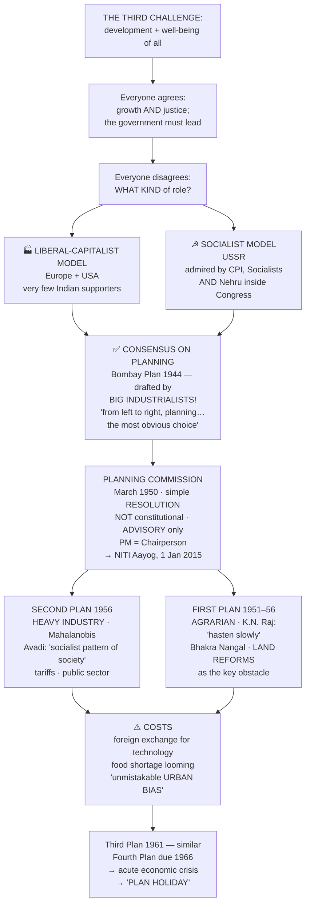
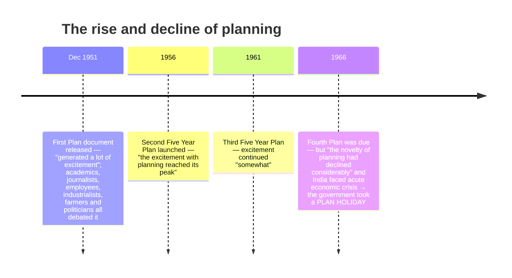

# Chapter 3: Politics of Planned Development

## 🎯 Chapter Outcome — what you should walk away with

> **The one thing this chapter exists to teach:** **development is not a technical question, it is a political one.** "These questions cannot be answered by an expert" — because they involve weighing one social group against another, and the present generation against future generations. In a democracy, **the final decision must be a political decision.**

**After reading it, here is what you now understand:**

1. **Why the POSCO/Orissa case opens the chapter** — the same project means opportunity to the state government, displacement to the Adivasi, pollution to the environmentalist, and a signal to investors for the Centre. "**Whose need can be called Orissa's need?**"
2. **That everyone agreed on the goal and disagreed on the method.** Consensus: development means **both economic growth and social and economic justice**, and it cannot be left to businessmen, industrialists and farmers themselves — **the government must play a key role**. Disagreement: *what kind* of role.
3. **The Left/Right distinction properly** — **Left** favours state control of the economy and prefers state regulation over free competition; **Right** believes free competition and the market alone ensure progress and that government should not unnecessarily intervene.
4. **The two available models** — the **liberal-capitalist** model of Europe and the US, and the **socialist** model of the USSR — and that "there were **very few supporters of the American style capitalist development**" in India.
5. **That the Planning Commission was NOT a constitutional body.** It was created in **March 1950 by a simple resolution of the Government of India**, had only an **advisory role**, and its recommendations became effective **only when the Union Cabinet approved them**. The **Prime Minister was its Chairperson**. Replaced by **NITI Aayog on 1 January 2015**.
6. **The Bombay Plan (1944) — the fact that surprises everyone.** A section of **big industrialists** drafted a joint proposal for a **planned economy**, wanting the state to take major initiatives in industrial investment. So "**from left to right, planning for development was the most obvious choice**."
7. **First Plan vs Second Plan** — the First (1951–56) was **agrarian**, built on K.N. Raj's advice to **"hasten slowly"**, and identified **the pattern of land distribution** as the principal obstacle. The Second (1956) under **P.C. Mahalanobis** stressed **heavy industry** and "quick structural transformation… in all possible directions", following the Congress's **Avadi session** declaration of a **"socialist pattern of society"**.
8. **The costs of that choice** — foreign exchange spent on technology because India was technologically backward; the looming **food shortage** as industry drew investment away from agriculture; and the charge of an **"unmistakable urban bias"**.

**Self-check — answer these three without looking:**
1. Why does the chapter insist that development decisions cannot be left to experts?
2. Was the Planning Commission created by the Constitution? What exactly was its status?
3. Who drafted the Bombay Plan, and why is that surprising?

**Where this leads:** the failure to balance industry and agriculture, and the "acute economic crisis" that forced the **plan holiday**, feed directly into the political turbulence of **Ch 5**.

---

## 🗺️ The chapter in one picture



---

## The Big Idea

The first two chapters dealt with nation-building and democracy. This is **the third challenge — economic development to ensure the well-being of all.** And the chapter is candid at the outset:

> **"As in the case of the first two challenges, our leaders chose a path that was different and difficult. In this case their success was much more limited, for this challenge was tougher and more enduring."**

**The one-line thesis:** what looks like an economics question is really a political one, because development always means **development for whom** — and in a democracy that question must be settled by people's representatives, not by experts.

---

## PART 1 — POLITICAL CONTESTATION

### 📰 The opening case: iron ore in Orissa

Orissa has "one of the largest reserves of untapped iron ore in the country" and, as global steel demand rises, is seen as an important investment destination. The State government signed **Memoranda of Understanding** with international and domestic steel makers, believing this would bring capital investment and employment.

**But:**

| Interest | Position |
|---|---|
| **State government** | MoUs will bring **capital investment and employment opportunities** |
| **Tribal population** | The ore lies in "the most underdeveloped and **predominantly tribal districts**"; industry would mean **displacement from home and livelihood** |
| **Environmentalists** | Mining and industry would **pollute the environment** |
| **Central government** | If industry is not allowed it "would set a bad example and **discourage investments in the country**" |

**The newspaper report the chapter reproduces** (*The Hindu*, 23 June 2006): people facing displacement by the proposed **POSCO-India steel plant in Jagatsinghpur district** demonstrated outside the Korean company's office in Bhubaneswar, demanding cancellation of the MoU signed a year earlier. **More than 100 men and women from the gram panchayats of Dhinkia, Nuagaon and Gadakujanga** tried to enter the premises but were prevented by police, saying the company should not be allowed to set up its plant **"at the cost of their lives and livelihood."** Organised by the **Rashtriya Yuva Sangathan and the Nabanirman Samiti**.

> ⭐ **The questions the chapter wants you to sit with:** "What kind of development does Orissa need? Indeed, **whose need can be called Orissa's need?**"

### ⭐ Why this cannot be left to experts

> **"These questions cannot be answered by an expert. Decisions of this kind involve weighing the interests of one social group against another, present generation against future generations. In a democracy such major decisions should be taken or at least approved by the people themselves."**

Take advice from experts on mining, from environmentalists and from economists — **"Yet the final decision must be a political decision, taken by people's representatives who are in touch with the feelings of the people."**

This is the justification for studying development **as part of the history of politics**: each decision had political consequences, involved political judgement, and required "consultations among political parties and approval of the public."

### The agreement, and the four disagreements

**Almost everyone agreed:**
- Development should mean **both economic growth and social and economic justice**.
- The matter **cannot be left to businessmen, industrialists and farmers themselves** — the government should play a key role.

**They disagreed on the kind of role:**

| # | The open question |
|---|---|
| 1 | Was it necessary to have a **centralised institution to plan for the entire country**? |
| 2 | Should the government **itself run some key industries and business**? |
| 3 | **How much importance was to be attached to the needs of justice if it differed from the requirements of economic growth?** |
| 4 | (Running through all of them) whose vision of development counts? |

**"Each of these questions involved contestation which has continued ever since."**

### 🧭 What is Left and what is Right?

```
   ◀────────────────────── THE SPECTRUM ──────────────────────▶
   LEFT                                                    RIGHT
   ─────────────────────────────────────────────────────────────
   In favour of STATE CONTROL          Believe FREE COMPETITION and
   of the economy; prefers state       MARKET ECONOMY ALONE ensure
   regulation over free competition    progress; government should not
                                       unnecessarily intervene
   ─────────────────────────────────────────────────────────────
   In the 1960s:                       In the 1960s:
   CPI, CPI(M), Socialist Party        SWATANTRA PARTY, and to a
                                       degree the Bharatiya Jana Sangh
   ─────────────────────────────────────────────────────────────
              CONGRESS = the broad CENTRE, straddling both
              (state ownership in principle, incentives to
               private investment in practice — see Q7)
```

The chapter's own definition: these terms "characterise the position of the concerned groups or parties regarding **social change and role of the state in effecting economic redistribution**."

---

## PART 2 — IDEAS OF DEVELOPMENT

### Development means different things to different people
The Orissa example shows "it is not enough to say that everyone wants development." Development means one thing to **an industrialist planning a steel plant**, another to **an urban consumer of steel**, and another to **the Adivasi who lives in that region**. So "any discussion on development is bound to generate **contradictions, conflicts and debates**."

### 'Modernisation' and the West as the yardstick
It was common then — "as it is even now" — to refer to **the 'West' as the standard for measuring development**:
- Development was about becoming more **modern**, and modern was about becoming more like the **industrialised countries of the West**.
- It was believed every country would pass through modernisation as in the West, involving **the breakdown of traditional social structures and the rise of capitalism and liberalism**.
- Modernisation was associated with **growth, material progress and scientific rationality**.
- **This is what allowed countries to be labelled developed, developing or underdeveloped.**

> 💬 **The margin question the chapter plants deliberately, and which is worth an essay:** *"Are you saying we don't have to be western in order to be modern? Is that possible?"*

### The two models on offer

| Model | Where | Who supported it in India |
|---|---|---|
| **Liberal-capitalist** | Much of Europe and the US | **"There were very few supporters of the American style capitalist development."** |
| **Socialist** | The USSR | "Many in India then were deeply impressed" — **not just the leaders of the CPI, but also those of the Socialist Party and leaders like Nehru within the Congress** |

**This reflected a consensus built during the national movement:**
- Nationalist leaders were clear that the economic concerns of free India **"would have to be different from the narrowly defined commercial functions of the colonial government."**
- **Poverty alleviation and social and economic redistribution were seen primarily as the responsibility of the government.**
- The debate among them was over priority: for some, **industrialisation**; for others, **development of agriculture and in particular alleviation of rural poverty**.

---

## PART 3 — PLANNING

### The consensus
Despite the differences, there was agreement on one point: **"development could not be left to private actors"** — there was a need for the government to develop **a design or plan** for development.

**Why planning was popular worldwide in the 1940s and 1950s** — three experiences:
1. The **Great Depression** in Europe.
2. The **inter-war reconstruction of Japan and Germany**.
3. Most of all, **"the spectacular economic growth against heavy odds in the Soviet Union in the 1930s and 1940s."**

### 💡 The Bombay Plan, 1944 — the counter-intuitive fact

> **"We commonly assume that private investors, such as industrialists and big business entrepreneurs, are averse to ideas of planning… That was not what happened here."**

A section of **big industrialists got together in 1944** and drafted a joint proposal for setting up a **planned economy** in the country — the **Bombay Plan**. It **wanted the state to take major initiatives in industrial and other economic investments**.

> ⭐ **Hence: "from left to right, planning for development was the most obvious choice for the country after Independence."** *(This is a favourite Prelims question — note that the Bombay Plan was made by industrialists and **supported state ownership of industry**.)*

### 🏛️ The Planning Commission — status matters

> ⚠️ **"Do you recall any reference to the Planning Commission in your book *Constitution at Work* last year? Actually there was none, for the Planning Commission is not one of the many commissions and other bodies set up by the Constitution."**

| Feature | Detail |
|---|---|
| **Created** | **March 1950**, by a **simple resolution of the Government of India** |
| **Constitutional status** | **None.** It is not a constitutional body |
| **Role** | **Advisory** — its recommendations "become effective only when the Union Cabinet approved these" |
| **Chairperson** | **The Prime Minister** |
| **What it became** | "The most influential and central machinery for deciding what path and strategy India would adopt for its development" |
| **Replaced by** | **NITI Aayog (National Institution for Transforming India), 1 January 2015** |

**The resolution that set it up grounded its work in the Constitution** — quoting the Fundamental Rights and, in particular, the Directive Principles that the State shall promote welfare by securing a social order in which justice — social, economic and political — shall prevail, and shall direct policy towards securing:

> **(a)** that the citizens, **men and women equally**, have the right to an adequate means of livelihood;
> **(b)** that the **ownership and control of the material resources of the community** are so distributed as best to **subserve the common good**; and
> **(c)** that the operation of the economic system **does not result in the concentration of wealth and means of production to the common detriment.**

*(These are Articles 39(a), 39(b) and 39(c) — cross-check with Class 11 ICW Ch 2.)*

---

## PART 4 — THE EARLY INITIATIVES

### The Five Year Plan mechanism
As in the USSR, the Planning Commission opted for **five year plans**. The idea is simple: the Government of India prepares a document planning **all its income and expenditure for the next five years**.

```
   THE BUDGET SPLITS IN TWO
   ┌────────────────────────┬─────────────────────────────┐
   │  'NON-PLAN' BUDGET     │  'PLAN' BUDGET              │
   │  routine items,        │  spent on a five-year       │
   │  spent yearly          │  basis as per the           │
   │                        │  priorities fixed by        │
   │                        │  the plan                   │
   └────────────────────────┴─────────────────────────────┘
   Advantage of a five year plan: it permits the government
   to focus on THE LARGER PICTURE and make LONG-TERM
   INTERVENTION in the economy.
```

### 📈 The arc of enthusiasm



Despite the criticisms that emerged "both about the process and the priorities of these plans, **the foundation of India's economic development was firmly in place by then.**"

### 🌾 The First Five Year Plan (1951–1956) — the agrarian plan

**Aim:** to get the country's economy **out of the cycle of poverty**.

- **K.N. Raj**, a young economist involved in drafting the plan, argued that India should **"hasten slowly" for the first two decades, as a fast rate of development might endanger democracy.** *(Remember this line — it is the single most quotable phrase from the First Plan.)*
- It addressed **mainly the agrarian sector**, including investment in **dams and irrigation**. The **agricultural sector had been hit hardest by Partition** and needed urgent attention.
- **Huge allocations** for large-scale projects like the **Bhakra Nangal Dam**.
- **⭐ It identified the pattern of land distribution as the principal obstacle in the way of agricultural growth, and focused on land reforms as the key to the country's development.**

**The savings problem — the logic worth following:**
1. A basic aim was to **raise the level of national income**, possible only if people **saved more than they spent**.
2. But the basic level of spending was **already very low** in the 1950s and could not be reduced further.
3. So planners **sought to push savings up** — also difficult, because **total capital stock was low compared to the number of employable people**.
4. **Savings did rise** in the first phase, until the end of the Third Plan — **but "the rise was not as spectacular as was expected."**
5. **⚠️ And then, from the early 1960s till the early 1970s, the proportion of savings actually *dropped consistently*.**

### 🏭 The Second Five Year Plan (1956) — rapid industrialisation

- **Stressed heavy industries**, drafted by a team under **P.C. Mahalanobis**.
- **The contrast the chapter draws:** "If the first plan had **preached patience**, the second wanted to bring about **quick structural transformation by making changes simultaneously in all possible directions**."
- **Before the plan was finalised**, the Congress at its session at **Avadi**, near the then Madras city, **declared that a "socialist pattern of society" was its goal** — and this was reflected in the Second Plan. *(This is the same 1955 declaration that created the Socialist Party's dilemma in Ch 2 — link them.)*
- The government **imposed substantial tariffs on imports** to protect domestic industries. This protected environment **helped both public and private sector industries to grow.**
- As savings and investment were growing, **a bulk of industries — electricity, railways, steel, machineries and communication — could be developed in the public sector.**

> ⭐ **"Indeed, such a push for industrialisation marked a turning point in India's development."**

### ⚠️ The problems the Second Plan created

| Problem | The mechanism |
|---|---|
| **Foreign exchange drain** | **India was technologically backward**, so it had to spend precious foreign exchange to **buy technology from the global market** |
| **Food shortage looming** | As **industry attracted more investment than agriculture**, "the possibility of food shortage loomed large" |
| **The balancing problem** | **"The Indian planners found balancing industry and agriculture really difficult."** |

**The Third Plan "was not significantly different from the Second."** Three lines of criticism emerged:
1. The plan strategies from this time displayed **"an unmistakable *urban bias*"**.
2. **Industry was wrongly given priority over agriculture.**
3. Focus should have been on **agriculture-related industries rather than heavy ones**.

### 👤 P.C. Mahalanobis (1893–1972)
Scientist and **statistician of international repute**; founder of the **Indian Statistical Institute (1931)**; **architect of the Second Plan**; **supporter of rapid industrialisation and an active role for the public sector.**

---

## ⚠️ PART 5 — WHAT THE RATIONALISED EDITION REMOVED (but the exercises still test)

The current edition trims this chapter heavily. **Exercise 4 asks you to match Charan Singh, the Bihar Famine, zoning and Verghese Kurien — none of which now appears in the retained text**, and **Exercise 2 asks about cooperative farming.** Here is what you need, so the gap does not cost you marks:

### The Nehru–Charan Singh debate on agriculture vs industry
**Charan Singh**, a Congress leader from Uttar Pradesh (later Prime Minister, 1979–80), was the sharpest critic of the industry-first strategy. He argued that **planning was diverting resources from agriculture to industry**, that it benefited the urban elite at the cost of the peasantry, and that **prosperity had to come through agriculture and by making the peasant self-reliant**. He held that the planners' vision was **urban, industrial and biased against the countryside** — the "urban bias" charge in its political form.

### Cooperative farming and the Nagpur resolution (1959)
The Congress at **Nagpur in 1959** resolved in favour of **cooperative farming** — pooling land and farming it jointly. It provoked strong resistance from farmers and landowners, was never seriously implemented, and **directly triggered the founding of the Swatantra Party** in August 1959 (Ch 2).

### Land reforms
Announced as the key to agricultural growth in the First Plan. Four components: **abolition of zamindari** (the most successful), **tenancy regulation**, **land ceilings**, and **consolidation of holdings**. Outcome was uneven — zamindari abolition largely succeeded, ceilings were widely evaded through *benami* transfers.

### The Green Revolution
The food crisis of the mid-1960s — worsened by war and two successive droughts — forced India to depend on **American PL-480 food aid**, which the chapter's later material treats as a humiliation. The response was the **Green Revolution**: **high-yielding variety seeds, chemical fertilizers, pesticides and assured irrigation**, concentrated in **Punjab, Haryana and western Uttar Pradesh**.
- **Positive:** India became **self-sufficient in food grains**; the surplus peasantry became a powerful political class.
- **Negative:** it **increased polarisation between classes and regions** — benefiting the already-prosperous middle and large farmers and the already-irrigated regions — and raised the **"rise of the middle peasant sections"** as a new political force.

### The Bihar Famine and *zoning*
The **Bihar famine of 1966–67** exposed the food-distribution system. **Zoning** was the policy of restricting the movement of foodgrains across state or district boundaries so that surplus areas could not sell freely to deficit ones — intended to keep local prices down, but criticised for **preventing grain from reaching the areas of greatest need**, and blamed for deepening the Bihar crisis.

### The White Revolution — **Verghese Kurien**
**Verghese Kurien** built the **Amul milk cooperative at Anand, Gujarat**, and led **Operation Flood**, the milk cooperative movement that made India the world's largest milk producer. It is the chapter's model of a **cooperative, farmer-owned** alternative to both state industry and private capital.

---

## Key Words (Glossary)

| Term | Meaning |
|---|---|
| **Development** | Contested by definition — it "has different meanings for different sections of the people"; involves growth **and** social and economic justice |
| **Modernisation** | The belief that every country passes through the Western path — breakdown of traditional social structures, rise of capitalism and liberalism, growth, material progress and scientific rationality |
| **Left** | Favours **state control** of the economy; prefers state regulation over free competition |
| **Right** | Believes **free competition and the market alone** ensure progress; government should not unnecessarily intervene |
| **Planning** | Government-designed direction of the economy; the consensus choice after Independence, endorsed "from left to right" |
| **Bombay Plan (1944)** | A joint proposal by **big industrialists** for a planned economy, wanting the **state to take major initiatives** in industrial investment |
| **Planning Commission** | Set up **March 1950 by a simple resolution**; **not a constitutional body**; **advisory**; **PM as Chairperson**; replaced by **NITI Aayog, 1 Jan 2015** |
| **Five Year Plan** | A document planning all government income and expenditure for five years |
| **Plan / Non-plan budget** | Non-plan = routine yearly items; Plan = five-year expenditure per plan priorities |
| **"Hasten slowly"** | **K.N. Raj's** advice for the first two decades — a fast rate of development **might endanger democracy** |
| **Socialist pattern of society** | Declared the Congress's goal at the **Avadi session**, and reflected in the Second Plan |
| **Plan holiday** | The suspension of planning when the Fourth Plan was due in **1966**, amid acute economic crisis |
| **Urban bias** | The criticism that from the Second Plan onward, strategy systematically favoured cities and industry over the countryside |
| **Zoning** | Restricting the movement of foodgrains across boundaries — blamed for worsening the **Bihar famine** |

---

## Quick Recap (13 points)

1. This is the **third challenge** — development and well-being for all — and the chapter admits **"success was much more limited"** here than on nation-building or democracy.
2. **POSCO/Orissa** frames it: state government (investment and jobs) vs tribals (displacement) vs environmentalists (pollution) vs the Centre (signal to investors). **"Whose need can be called Orissa's need?"**
3. **Development decisions cannot be left to experts** — they weigh group against group and generation against generation, so **"the final decision must be a political decision."**
4. **Agreement:** growth *and* justice; the government must lead. **Disagreement:** centralised planning body? state-run industries? justice or growth when they conflict?
5. **Left = state control and regulation; Right = free competition and minimal intervention.** In the 1960s: CPI/CPI(M)/Socialists on the left, **Swatantra** on the right, Congress at the centre.
6. Development was measured against **the West**; modernisation meant capitalism, liberalism, growth and scientific rationality — which is how the labels developed/developing/underdeveloped arose.
7. **Two models: liberal-capitalist and socialist.** The Soviet model impressed the CPI, the Socialists **and Nehru**; **"very few supporters of the American style capitalist development."**
8. Planning was globally popular because of the **Great Depression**, the **reconstruction of Japan and Germany**, and above all **Soviet growth in the 1930s–40s**.
9. **The Bombay Plan, 1944** — drafted by **big industrialists**, **supporting state initiative** in industrial investment. Hence planning was the choice **"from left to right."**
10. **Planning Commission: March 1950, by simple resolution; NOT constitutional; advisory only; PM as Chairperson; effective only on Cabinet approval.** Its founding resolution quoted **Art 39(a), (b) and (c)**. Replaced by **NITI Aayog, 1 January 2015**.
11. **First Plan (1951–56):** agrarian; **K.N. Raj — "hasten slowly"** because fast development **might endanger democracy**; **Bhakra Nangal**; identified **land distribution** as the principal obstacle and **land reforms** as the key. Savings rose till the Third Plan but **fell consistently from the early 1960s to the early 1970s**.
12. **Second Plan (1956):** **heavy industry**, **P.C. Mahalanobis**, **Avadi's "socialist pattern of society"**, **tariffs** protecting domestic industry, and public-sector electricity, railways, steel, machinery and communications — **"a turning point in India's development."**
13. **The costs:** foreign exchange for imported technology; **food shortage looming**; balancing industry and agriculture "really difficult"; and the charge of **"unmistakable urban bias."** The **Fourth Plan, due 1966, gave way to a plan holiday** amid acute economic crisis.

---

## 60-Second Revision

**THIRD CHALLENGE = development; "success was much more limited."** **POSCO/ORISSA (*The Hindu*, 23 June 2006; Jagatsinghpur; Dhinkia, Nuagaon, Gadakujanga; Rashtriya Yuva Sangathan + Nabanirman Samiti): state=jobs, tribals=displacement, greens=pollution, Centre=investor signal. "WHOSE NEED CAN BE CALLED ORISSA'S NEED?"** **"These questions cannot be answered by an expert… the FINAL DECISION MUST BE A POLITICAL DECISION."** **AGREED: growth + justice, government leads. DISAGREED: centralised planning? state-run industry? justice vs growth?** **LEFT = state control/regulation | RIGHT = free competition/market, minimal intervention. Congress = centre.** **Development measured against the WEST; modernisation = breakdown of tradition + capitalism + liberalism + growth + scientific rationality → developed/developing/underdeveloped.** **TWO MODELS: liberal-capitalist (Europe/US) vs socialist (USSR). Soviet model impressed CPI + Socialists + NEHRU; "very few supporters of the American style capitalist development."** **Planning popular worldwide: GREAT DEPRESSION + reconstruction of JAPAN & GERMANY + SOVIET growth 1930s-40s.** **⭐ BOMBAY PLAN 1944 — by BIG INDUSTRIALISTS, wanting the STATE to take major initiatives ⇒ "from left to right, planning… the most obvious choice."** **PLANNING COMMISSION: MARCH 1950, SIMPLE RESOLUTION, ***NOT CONSTITUTIONAL***, ADVISORY only, effective only on CABINET approval, PM = CHAIRPERSON; resolution cites Art 39(a) livelihood for men and women equally, (b) material resources to subserve the common good, (c) no concentration of wealth. → NITI AAYOG 1 JAN 2015.** **FYP: budget splits PLAN (5-yr, priorities) vs NON-PLAN (routine, yearly).** **FIRST PLAN 1951–56: AGRARIAN; K.N. RAJ "HASTEN SLOWLY" for two decades or fast growth "might endanger democracy"; dams+irrigation; BHAKRA NANGAL; agriculture hit hardest by PARTITION; LAND DISTRIBUTION = principal obstacle, LAND REFORMS = key. Savings rose till 3rd Plan, then DROPPED CONSISTENTLY early 1960s–early 1970s.** **SECOND PLAN 1956: HEAVY INDUSTRY; MAHALANOBIS (ISI 1931); first plan "preached patience", second wanted "QUICK STRUCTURAL TRANSFORMATION… in all possible directions"; AVADI session = "SOCIALIST PATTERN OF SOCIETY"; TARIFFS protect domestic industry; public sector = electricity, railways, steel, machinery, communication; "a TURNING POINT in India's development."** **COSTS: technologically backward → foreign exchange for technology; industry drew investment from agriculture → FOOD SHORTAGE loomed; "balancing industry and agriculture really difficult"; THIRD PLAN similar; critics: "unmistakable URBAN BIAS", industry wrongly over agriculture, should have been agriculture-related industry. FOURTH PLAN due 1966 → novelty declined + acute crisis → PLAN HOLIDAY.** **⚠️ RATIONALISED OUT but still examined: CHARAN SINGH (agriculture-first critic) | NAGPUR 1959 COOPERATIVE FARMING → triggered SWATANTRA | LAND REFORMS (zamindari abolition, tenancy, ceilings, consolidation) | GREEN REVOLUTION (HYV seeds, Punjab/Haryana/W-UP; self-sufficiency BUT polarisation + rise of the middle peasant) | BIHAR FAMINE 1966-67 + ZONING (restricting grain movement) | VERGHESE KURIEN, AMUL at ANAND, OPERATION FLOOD = White Revolution.**

---

## NCERT Exercises — with answers

**1. Which statement about the Bombay Plan is incorrect?**
**(b) is the trap but it is CORRECT** — the Bombay Plan *did* support state ownership. The **incorrect** statement is **(a) "It was a blueprint for India's economic future"** only if read as an official plan; the safest answer expected here is **(a)**, since the Bombay Plan was a **private, unofficial proposal by industrialists**, not a blueprint adopted for the country. *(Statements (b), (c) and (d) are all accurate: it supported state ownership of industry, it was made by leading industrialists, and it strongly supported planning.)*

**2. Which idea did **not** form part of the early phase of India's development policy?**
**(b) Liberalisation.** Planning, cooperative farming and self-sufficiency were all part of it. **Liberalisation came only in 1991** — the opposite of the protected, tariff-walled, state-led model described here.

**3. The idea of planning in India was drawn from —**
**(iii) a and b only** — the **Bombay Plan** and the **experiences of the Soviet bloc countries**. It was not drawn from the Gandhian vision of society (which favoured village self-sufficiency and decentralisation rather than centralised heavy industry), nor from a demand by peasant organisations.

**4. Match the following.**

| | |
|---|---|
| (a) **Charan Singh** | **(iii) Farmers** — the leading advocate of agriculture and the peasantry against the industry-first strategy |
| (b) **P.C. Mahalanobis** | **(i) Industrialisation** — architect of the Second Plan and of heavy industry |
| (c) **Bihar Famine** | **(ii) Zoning** — the restriction on foodgrain movement blamed for worsening it |
| (d) **Verghese Kurien** | **(iv) Milk Cooperatives** — Amul, Anand, and Operation Flood |

**5. Major differences in the approach towards development at Independence — has the debate been resolved?**
**The differences were three.** *(i)* **Which model** — the liberal-capitalist path of Europe and the US versus the socialist path of the USSR; India chose neither purely, adopting a **mixed economy** with a large public sector and a protected private one. *(ii)* **Industry or agriculture first** — Mahalanobis and the Second Plan chose heavy industry; Charan Singh and others held that prosperity must come through agriculture. *(iii)* **Growth or justice** — how much weight to give redistribution when it conflicts with the requirements of growth.
**Has it been resolved? No — and the chapter says so:** "Each of these questions involved contestation **which has continued ever since**." The *terms* have shifted (after 1991 the argument is about liberalisation, not planning), but the underlying question — **whose development, and at whose cost** — is exactly what the POSCO protest at the start of the chapter is about. The debate has changed form, not ended.

**6. The major thrust of the First Plan, and how the Second differed.**
**First Plan (1951–56):** to break the **cycle of poverty**; **agrarian in thrust**, with heavy investment in **dams and irrigation** (Bhakra Nangal) because agriculture had been hit hardest by Partition; it identified **the pattern of land distribution as the principal obstacle** and made **land reforms the key**; and it followed **K.N. Raj's advice to "hasten slowly"**, since rapid development might endanger democracy.
**Second Plan (1956):** the opposite temperament — **"if the first plan had preached patience, the second wanted to bring about quick structural transformation by making changes simultaneously in all possible directions."** Drafted under **Mahalanobis**, it stressed **heavy industry**, followed the Avadi declaration of a **"socialist pattern of society"**, imposed **substantial tariffs** to protect domestic industry, and built **electricity, railways, steel, machinery and communications in the public sector**.
**In one line:** the First Plan was **agrarian, cautious and redistributive**; the Second was **industrial, ambitious and transformative** — and it is the Second that is criticised for **urban bias**.

**7. Francine Frankel on the two contradictory tendencies inside the Congress.**
**(a) The contradiction.** The party executive **endorsed socialist principles** — state ownership, regulation and control over key sectors, to raise productivity **and curb economic concentration** — while the Congress **government pursued liberal economic policies and incentives to private investment**, justified purely by **maximum increase in production**. So the party's declared ideology and the government's actual practice pulled in opposite directions.
**Political implications:** policy became **inconsistent and slow** — the state expanded but so did private capital; **neither socialists nor businessmen were fully satisfied**; it generated the **licence-permit regime**, in which the state controlled entry while private profit continued; and it left the Congress open to attack **from both flanks** — from the Left for betraying socialism, and from the Swatantra Party for strangling enterprise.
**(b) Why the Congress pursued it — and was it related to the opposition?** **Yes, directly.** As Ch 2 explains, the Congress was **a social and ideological coalition** that had to accommodate "peasants and industrialists, workers and owners". Adopting socialist rhetoric neutralised the **Socialists and Communists** on its left — this is exactly the 1955 "socialist pattern" declaration that left the Socialist Party with nothing distinctive to say — while liberal practice retained the support of **industrialists**, whose defection would otherwise have strengthened the **Swatantra Party** on its right. The contradiction was not an oversight; it was **the coalition strategy applied to economic policy.**
**(c) Was there a contradiction between the central leadership and the state-level leaders?** **Yes.** The central leadership was committed to planning, heavy industry and redistribution; but **land reform and agriculture are State subjects**, and the state units of the Congress were dominated by **landowning and dominant peasant castes** who had no interest in ceilings, tenancy reform or cooperative farming. So the redistributive half of the programme was announced at the Centre and **quietly buried in the states** — which is why zamindari abolition largely succeeded (it removed a rival elite) while land ceilings were widely evaded. The **Nagpur resolution on cooperative farming (1959)** failed for exactly this reason.

---

## Extra UPSC-style questions

1. *"The Bombay Plan shows that Indian planning was not an ideological imposition but a national consensus."* Critically examine. **(250 words)**
2. The Planning Commission was never a constitutional body, yet became "the most influential and central machinery" of Indian development. What does this tell us about the relationship between formal authority and real power?
3. "If the First Plan preached patience, the Second wanted quick structural transformation." Evaluate which approach served India better, with reference to the food crisis of the mid-1960s.
4. Discuss the proposition that the Green Revolution solved a food problem and created a political one.
5. **Prelims trap check:** Which is/are correct? (i) The Planning Commission was established under Article 39 of the Constitution. (ii) The Bombay Plan was drafted by industrialists and supported state ownership. (iii) The "socialist pattern of society" was declared at the Avadi session. → **(ii) and (iii) only.** *(The Planning Commission was set up by a simple executive resolution; its founding document merely **quoted** the Directive Principles.)*

---

*Source: written by reading `03_Politics_of_Planned_Development.pdf` in full (NCERT, Reprint 2026–27) — main text, the POSCO news report, the "What is Left and what is Right?" box, the Planning Commission box with the full text of the founding resolution, the NITI Aayog "Fast Forward" box, the First Plan and Second Plan sections, the P.C. Mahalanobis profile and all seven exercises. Content removed by rationalisation but still required by exercises 2 and 4 (Charan Singh, cooperative farming, Bihar famine and zoning, Verghese Kurien) has been supplied and clearly flagged as such.*
