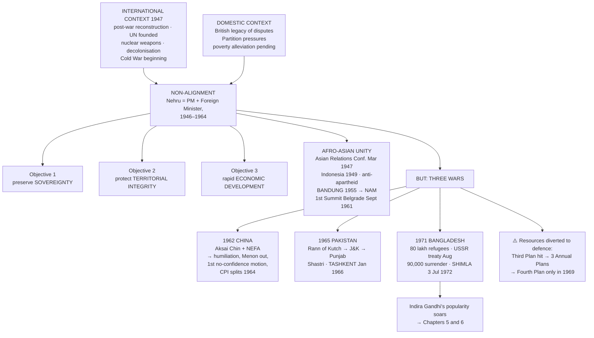
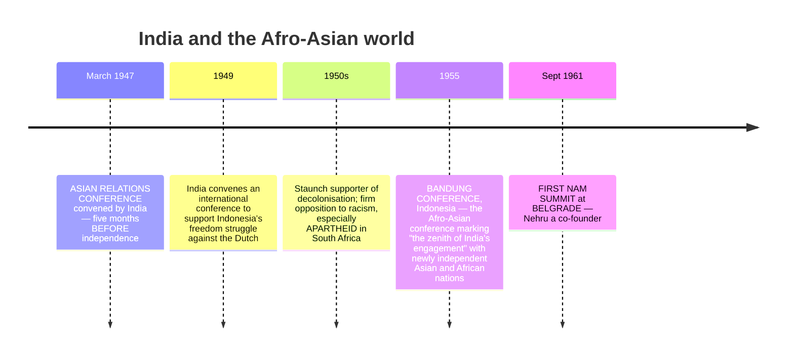
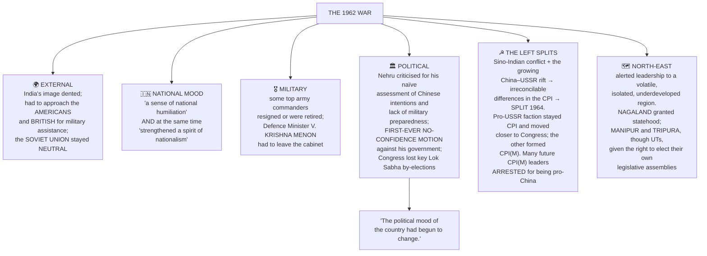
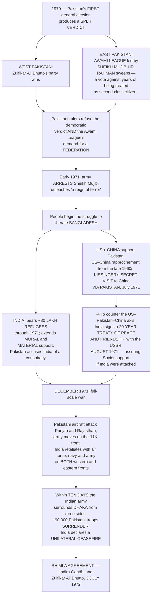

# Chapter 4: India's External Relations

## 🎯 Chapter Outcome — what you should walk away with

> **The one thing this chapter exists to teach:** foreign policy is **"an outcome of a two-way interaction between domestic compulsions and prevailing international climate."** Non-alignment was India's innovative answer to that interaction — and the three wars of 1962, 1965 and 1971 show how external events reshaped domestic politics in return.

**After reading it, here is what you now understand:**

1. **Nehru's definition of independence itself** — *"What does independence consist of? It consists fundamentally and basically of **foreign relations**. That is the test of independence. **All else is local autonomy.**"*
2. **The constitutional basis** — **Article 51**, a Directive Principle: promote international peace and security; maintain just and honourable relations; foster respect for international law and treaty obligations; and **encourage settlement of international disputes by arbitration**.
3. **Nehru's three objectives and one strategy** — preserve **sovereignty**, protect **territorial integrity**, promote **rapid economic development** — all through **non-alignment**. And that this was contested at home: **Ambedkar**, the **Bharatiya Jan Sangh** and later the **Swatantra Party** wanted a pro-US tilt.
4. **That non-alignment was a hard balancing act that sometimes wobbled** — India **led the world protest** when Britain attacked Egypt over Suez in 1956, but **did not join the public condemnation** when the USSR invaded Hungary in the same year.
5. **The Afro-Asian record** — the **Asian Relations Conference, March 1947** (five months *before* independence), the 1949 conference on Indonesia, opposition to **apartheid**, the **Bandung Conference 1955**, and the **first NAM Summit, Belgrade, September 1961**, with Nehru as co-founder.
6. **The full arc with China** — from being among the first to recognise the communist government, through **Panchsheel (29 April 1954)** and the Tibet concession, to the **October 1962 invasion**, the unilateral Chinese ceasefire, and the political wreckage: **Krishna Menon out, the first no-confidence motion against Nehru, and the CPI's 1964 split**.
7. **The three wars and their consequences** — 1962 (humiliation and rearmament), **1965** under **Shastri** ending in the **Tashkent Agreement**, and **1971**, where **90,000 Pakistani troops surrendered**, Bangladesh was born, and the **Shimla Agreement (3 July 1972)** formalised peace.
8. **Why India refused the NPT** — it is **discriminatory**, legitimising the monopoly of the five nuclear-weapon powers who are also the five Permanent Members of the Security Council. India's **May 1974** test was called a **peaceful explosion**; **May 1998** demonstrated military capability; the doctrine is **credible minimum deterrence with "no first use."**

**Self-check — answer these three without looking:**
1. Give one instance where India's non-alignment looked inconsistent, and explain it.
2. Why did India sign a 20-year treaty with the USSR in August 1971 — and did that end non-alignment?
3. On what precise ground does India reject the NPT?

**Where this leads:** the 1962 humiliation and the 1965 war's economic damage set up the political crisis of **Ch 5**; the 1971 victory explains Indira Gandhi's dominance there and in **Ch 6**.

---

## 🗺️ The chapter in one picture



---

## The Big Idea

India was born "in a very trying and challenging international context":
- The world had witnessed **a devastating war** and was grappling with **reconstruction**.
- **Yet another attempt to establish an international body** was under way (the UN).
- **Many new countries were emerging** from the collapse of colonialism.
- Most new nations faced **the twin challenges of welfare and democracy**.

**And India had its own share of concerns:** the British left behind **"the legacy of many international disputes"**; **Partition created its own pressures**; and **poverty alleviation was already waiting for fulfilment.**

> ⭐ **Nehru, Constituent Assembly, March 1949 — the quotation to open any foreign-policy answer with:**
> *"What does independence consist of? It consists fundamentally and basically of **foreign relations**. That is the test of independence. **All else is local autonomy.** Once foreign relations go out of your hands into the charge of somebody else, to that extent and in that measure **you are not independent**."*

**India's declared aim:** to conduct its foreign relations so as to **respect the sovereignty of all other nations and to achieve security through the maintenance of peace** — an aim that "finds an echo in the Directive Principles of State Policy."

### 📜 The constitutional principles — Article 51

> **"The State shall endeavour to —**
> **(a)** Promote **international peace and security**
> **(b)** Maintain **just and honourable relations** between nations
> **(c)** Foster respect for **international law and treaty obligations** in the dealings of organised people with one another; and
> **(d)** Encourage settlement of international disputes **by arbitration**."

*The chapter asks you to judge, after reading it, how well India lived up to these in its first two decades. Keep the question open as you read — it is exercise-worthy.*

### Why developing countries behave differently
- They **lack the resources to effectively advocate their concerns** in the international system.
- So they **pursue more modest goals** than advanced states, focusing on **peace and development in their own neighbourhood**.
- Their **economic and security dependence** on powerful states influences their foreign policy — which is why, after the Second World War, **many developing nations simply supported the foreign policy preferences of whoever was giving them aid or credits**.
- **Result: the world divided into two clear camps** — one under US and western influence, one under Soviet influence. **"There was also the experiment called Non-Aligned Movement in which India had played an important role."**

---

## PART 1 — THE POLICY OF NON-ALIGNMENT

### The movement's international roots
**"The Indian national movement was not an isolated process."** It was part of the worldwide struggle against colonialism and imperialism, and **it influenced the liberation movements of many Asian and African countries.** Before independence there were contacts between Indian nationalist leaders and those of other colonies.

> **"The creation of the Indian National Army (INA) by Netaji Subhash Chandra Bose during the Second World War was the clearest manifestation of the linkages established between India and overseas Indians during the freedom struggle."**

### Nehru's role
**He was his own foreign minister.** As both Prime Minister and Foreign Minister he "exercised profound influence in the formulation and implementation of India's foreign policy **from 1946 to 1964**."

| Nehru's three objectives | The strategy |
|---|---|
| Preserve the **hard-earned sovereignty** | |
| Protect **territorial integrity** | **Non-alignment** |
| Promote **rapid economic development** | |

**⚠️ The domestic opposition — do not present non-alignment as uncontested:**
- Some parties and groups believed India should be **more friendly with the US-led bloc because it claimed to be pro-democracy**. **"Among those who thought on these lines were leaders like Dr Ambedkar."**
- Parties opposed to communism also wanted a **pro-US** policy — the **Bharatiya Jan Sangh** and later the **Swatantra Party**.
- **"But Nehru possessed considerable leeway in formulating foreign policy."**

**Nehru's own statement of the policy**, in a letter to K.P.S. Menon, January 1947:
> *"Our general policy is to **avoid entanglement in power politics** and not to join any group of powers as against any other group. The two leading groups today are the Russian bloc and the Anglo-American bloc. **We must be friendly to both and yet not join either.** Both America and Russia are extraordinarily suspicious of each other as well as of other countries. This makes our path difficult and **we may well be suspected by each of leaning towards the other. This cannot be helped.**"*

### ⚖️ Distance from two camps — including where the balance slipped

India pursued "the dream of a peaceful world" in three ways:
1. **Advocating non-alignment**
2. **Reducing Cold War tensions**
3. **Contributing human resources to UN peacekeeping operations**

India wanted to keep away from the **military alliances** — the US-led **NATO** and the Soviet-led **Warsaw Pact**.

> ⚠️ **"This was a difficult balancing act and sometimes the balance did not appear perfect."** The chapter gives the paired example, and you should always cite both together:

```
   1956 — THE TEST YEAR
   ┌─────────────────────────────┬─────────────────────────────┐
   │ BRITAIN attacks EGYPT       │ USSR invades HUNGARY        │
   │ over the SUEZ CANAL         │                             │
   ├─────────────────────────────┼─────────────────────────────┤
   │ India LED the world protest │ India did NOT join the      │
   │ against this neo-colonial   │ public condemnation         │
   │ invasion                    │                             │
   └─────────────────────────────┴─────────────────────────────┘
   Verdict: "by and large India did take an independent stand on
   various international issues and could get aid and assistance
   from members of BOTH the blocs."
```

**The costs of the policy:**
- **Pakistan joined the US-led military alliances** while India was trying to convince other developing countries about non-alignment.
- **"The US was not happy about India's independent initiatives"** — hence "considerable unease in Indo-US relations during the 1950s."
- The US also **resented India's growing partnership with the Soviet Union**.
- And note the link back to Ch 3: the planned-development strategy **emphasised import substitution**; the emphasis on developing a resource base meant **export-oriented growth was limited**, which **"limited India's economic interaction with the outside world."**

### 🌍 Afro-Asian unity

Given "its size, location and power potential, **Nehru envisaged a major role for India in world affairs and especially in Asian affairs.**"



**The five leaders who formed the core leadership of NAM** (from the photograph the chapter opens with, New York, October 1960): **Nehru (India), Nkrumah (Ghana), Nasser (Egypt), Sukarno (Indonesia) and Tito (Yugoslavia).**

**C. Rajagopalachari's assessment**, in a letter to Edwina Mountbatten, 1950:
> *"A country without material, men or money — the three means of power — is now fast coming to be recognised as **the biggest moral power in the civilised world**… her word listened to with respect in the councils of the great."*

> 💬 **The margin question worth thinking about:** *"Did we have more recognition and power in the world when we were younger, poorer and more vulnerable than now? Isn't that strange?"*

---

## PART 2 — PEACE AND CONFLICT WITH CHINA

### The friendly beginning
**"Unlike its relationship with Pakistan, free India began its relationship with China on a very friendly note."**
- After the **Chinese revolution in 1949**, **India was one of the first countries to recognise the communist government.**
- Nehru "felt strongly for this neighbour that was coming out of the shadow of western domination" and **helped the new government in international fora.**
- **⚠️ But some colleagues, like Vallabhbhai Patel, were worried about a possible Chinese aggression in future.** Nehru thought an attack from China was **"exceedingly unlikely"**.
- **"For a very long time, the Chinese border was guarded by para-military forces, not the army."**

### Panchsheel — 29 April 1954
The joint enunciation of **Panchsheel, the Five Principles of Peaceful Coexistence**, by **Nehru and Chinese Premier Zhou Enlai**. Indian and Chinese leaders visited each other's countries "and were greeted by large and friendly crowds."

**Rajagopalachari on Zhou Enlai**, December 1956: *"Frankly… my impression was very favourable… the Chinese premier is, I believe, a good type of man and trustworthy."* — a line the chapter includes precisely because of what followed.

### 🏔️ TIBET — the full box

| When | What happened |
|---|---|
| Historically | China **claimed administrative control over Tibet from time to time**; and **from time to time, Tibet was independent too** |
| **1950** | **China took over control of Tibet.** Large sections of the Tibetan population opposed the takeover. **India tried to persuade China to recognise Tibet's claims for independence** |
| **1954** | ⭐ **When the Panchsheel agreement was signed, through the clause on respecting each other's territorial integrity and sovereignty, India conceded China's claim over Tibet** |
| **1956** | The **Dalai Lama accompanied Zhou Enlai** on the official Chinese visit to India and **informed Nehru about the worsening situation**. But China had already assured India that **Tibet would be given greater autonomy than any other region of China** |
| **1958** | **Armed uprising in Tibet** against China's occupation — **suppressed by Chinese forces** |
| **1959** | **The Dalai Lama crossed into India and sought asylum, which was granted. The Chinese government strongly protested** |

**Since then:** large numbers of Tibetans have sought refuge in India and elsewhere; there are large settlements in India, particularly Delhi, and **Dharmashala in Himachal Pradesh is perhaps the largest Tibetan refuge settlement in India** and the Dalai Lama's home. **In the 1950s and 1960s many political leaders and parties in India, including the Socialist Party and the Jan Sangh, supported the cause of Tibet's independence.**

**The continuing dispute:** China has created the **Tibet autonomous region**, "an integral part of China". Tibetans **oppose the claim that Tibet is Chinese territory**, oppose **bringing in more and more Chinese settlers**, **dispute that autonomy is actually granted**, and believe **China wants to undermine the traditional religion and culture of Tibet.**

### The boundary dispute

| India's position | China's position |
|---|---|
| The boundary was **a matter settled in colonial time** | **Any colonial decision did not apply** |

**The two disputed ends of the long border:**

```
   ┌──────────────────────────────────────────────────────────┐
   │  WESTERN SECTOR                    EASTERN SECTOR        │
   │  AKSAI CHIN                        NEFA                  │
   │  in the Ladakh region of           (North Eastern        │
   │  Jammu and Kashmir                 Frontier Agency)      │
   │                                    = much of today's     │
   │  ⚠️ Between 1957 and 1959 the       ARUNACHAL PRADESH     │
   │  Chinese OCCUPIED Aksai Chin                             │
   │  and BUILT A STRATEGIC ROAD there                        │
   └──────────────────────────────────────────────────────────┘
```

"Despite a very long correspondence and discussion among top leaders, these differences could not be resolved. Several small border skirmishes between the armies of the two countries took place." **Border disputes erupted in 1960; talks between Nehru and Mao Tsetung proved futile.**

### ⚔️ The Chinese invasion, October 1962

**The two developments that strained the relationship:** China's annexation of Tibet in 1950, which **"removed a historical buffer between the two countries"**; and the **grant of asylum to the Dalai Lama in 1959**, after which **China alleged that India was allowing anti-China activities from within India.**

**The war itself:**
- **The timing:** "while the entire world's attention was on the **Cuban Missile crisis**", China launched **"a swift and massive invasion in October 1962 on both the disputed regions."**
- **First attack:** lasted **one week**; Chinese forces **captured some key areas in Arunachal Pradesh**.
- **Second wave:** came **the next month**. **Indian forces blocked the Chinese advance on the western front in Ladakh**, but **in the east the Chinese advanced nearly to the entry point of the Assam plains.**
- **The end:** **China declared a unilateral ceasefire** and its troops **withdrew to where they were before the invasion began.**

### 💥 The consequences — this is the examinable part



**👤 V.K. Krishna Menon (1897–1974):** diplomat and minister; active in the **Labour Party in the UK between 1934 and 1947**; Indian **High Commissioner in the UK** and later head of India's delegation to the UN; Rajya Sabha and later Lok Sabha MP; member of the Union Cabinet from 1956; **Defence Minister from 1957**; considered very close to Nehru; **resigned after the India-China war in 1962**.

**🎬 *Haqeeqat* (1964)** — director **Chetan Anand**; actors **Dharmendra, Priya Rajvansh, Balraj Sahni, Jayant, Sudhir, Sanjay Khan, Vijay Anand**. A small platoon of the Indian army in Ladakh is rescued by gypsies after the enemy surrounds their post; **Capt. Bahadur Singh and his gypsy girlfriend Kammo** help the jawans vacate, both die resisting the Chinese, and the jawans too are overpowered and lay down their lives. Set against the 1962 war, it **"portrays the soldier and his travails as its central theme"**, paying tribute while depicting **"the political frustration over the betrayal by the Chinese"**, and using **documentary footage** — one of the early Hindi war films.

*(And the margin memory the chapter records: "Nehru Ji cried in public when Lata Mangeshkar sang **'Ai mere watan ke logo…'** after the 1962 war.")*

### 🚀 Fast Forward — Sino-Indian relations since 1962

| Year | Development |
|---|---|
| **1976** | It took **more than a decade** — full **diplomatic relations restored** |
| **1979** | **Atal Behari Vajpayee**, then **External Affairs Minister**, was the **first top-level leader to visit China** |
| Later | **Rajiv Gandhi** became the **first Prime Minister after Nehru to visit China** |
| Since | **"The emphasis is more on trade relations between the two countries"** |

---

## PART 3 — WARS AND PEACE WITH PAKISTAN

### The beginning
The conflict started **just after partition over the dispute on Jammu and Kashmir** (detailed in Ch 7). **A proxy war broke out between the Indian and Pakistani armies in J&K during 1947 itself, but this did not turn into a full war. The issue was then referred to the UN.**

**"Pakistan soon emerged as a critical factor in India's relations with the US and subsequently with China."**

### ✅ The cooperation that is easy to forget
**"The Kashmir conflict did not prevent cooperation between the governments of India and Pakistan."**
- Both governments **worked together to restore the women abducted during partition to their original families.**
- A long-term dispute about **sharing river waters** was resolved through **mediation by the World Bank** — the **India-Pakistan Indus Waters Treaty, signed by Nehru and General Ayub Khan in 1960**.
- **⭐ "Despite all ups and downs in the Indo-Pak relations, this treaty has worked well."**

### ⚔️ The 1965 war

| Stage | What happened |
|---|---|
| **April 1965** | Pakistan **launched armed attacks in the Rann of Kutch area of Gujarat** |
| **August–September 1965** | A **bigger offensive in Jammu and Kashmir**. **"Pakistani rulers were hoping to get support from the local population there, but it did not happen"** |
| **The Indian response** | To ease pressure on the Kashmir front, **Shastri ordered a counter-offensive on the Punjab border**. In a fierce battle **the Indian army reached close to Lahore** |
| **The end** | Hostilities ended with **UN intervention**. **Shastri and General Ayub Khan signed the Tashkent Agreement, brokered by the Soviet Union, in January 1966** |

> ⚠️ **The cost:** "Though India could inflict considerable military loss on Pakistan, **the 1965 war added to India's already difficult economic situation.**"

### 🇧🇩 The Bangladesh war, 1971



**The domestic consequences:** "A decisive victory… led to national jubilation. Most people in India saw this as **a moment of glory and a clear sign of India's growing military prowess.**" Indira Gandhi **had already won the Lok Sabha elections in 1971**; **her personal popularity soared** after the war, and **assembly elections in most States then brought large majorities for the Congress.**

> 💬 **The margin question, and its answer:** *"This sounds like joining the Soviet bloc. Can we say that we were non-aligned even after signing this treaty?"* — The treaty was a **response to a specific strategic encirclement** (the US-Pakistan-China axis), not entry into a military bloc: India joined neither NATO nor the Warsaw Pact, retained its freedom of action, and the Janata government in 1977 explicitly corrected the tilt by announcing **"genuine non-alignment."** But the criticism is fair enough that you should acknowledge it — non-alignment was always **a direction, not a fixed position.**

### 💰 The price of three wars — back to Chapter 3

> **"India, with its limited resources, had initiated development planning. However, conflicts with neighbours derailed the five-year plans."**

- Scarce resources were **diverted to the defence sector**, especially after 1962, as India embarked on a **military modernisation drive**.
- **Department of Defence Production established November 1962**; **Department of Defence Supplies November 1965**.
- **The Third Plan (1961–66) was affected**, and was followed by **three Annual Plans** — **the Fourth Plan could be initiated only in 1969.** *(This is the "plan holiday" of Ch 3, seen from the foreign-policy side.)*
- **"India's defence expenditure increased enormously after the wars."**

### 🚀 Fast Forward — the Kargil confrontation, 1999
- In early 1999 several points on the Indian side of the **LoC in the Mashkoh, Dras, Kaksar and Batalik areas** were occupied by forces **claiming to be Mujahideens**.
- **Suspecting involvement of the Pakistan Army**, Indian forces reacted. The conflict ran through **May and June 1999**, and **by 26 July 1999 India had recovered control of many of the lost points.**
- **⭐ It drew worldwide attention because only one year earlier both India and Pakistan had attained nuclear capability** — yet **"this conflict remained confined only to the Kargil region."**
- **In Pakistan it became a major controversy**, with allegations that **the Prime Minister was kept in the dark by the Army Chief.** Soon after, **the government of Pakistan was taken over by the Pakistan Army led by General Parvez Musharraf.**

---

## PART 4 — INDIA'S NUCLEAR POLICY

### The origins and the principle
- Nehru **"had always put his faith in science and technology for rapidly building a modern India."** A significant component of his industrialisation plans was the **nuclear programme initiated in the late 1940s under the guidance of Homi J. Bhabha.**
- **India wanted to generate atomic energy for peaceful purposes. Nehru was against nuclear weapons**, and **pleaded with the superpowers for comprehensive nuclear disarmament.** "However, the nuclear arsenal kept rising."

### ⚠️ Why India rejects the NPT — the precise argument

```
   WHEN Communist China tested in OCTOBER 1964 …
   the FIVE nuclear weapon powers — US · USSR · UK · FRANCE · CHINA
   (Taiwan then represented China) — who are ALSO the five
   PERMANENT MEMBERS of the UN Security Council —
   tried to impose the NUCLEAR NON-PROLIFERATION TREATY (NPT)
   of 1968 on the rest of the world.

   ⇒ INDIA'S OBJECTION: the NPT is DISCRIMINATORY.
     It is selectively applicable to the NON-nuclear powers and
     LEGITIMISES THE MONOPOLY of the five nuclear weapons powers.
   ⇒ India refused to sign.
```

- India also **opposed the indefinite extension of the NPT in 1995** and **refused to sign the Comprehensive Test Ban Treaty (CTBT)**.

### The tests

| When | What | How India described it |
|---|---|---|
| **May 1974** | India's **first nuclear explosion** | **"Termed as a peaceful explosion."** India argued it was **committed to using nuclear power only for peaceful purposes** |
| **May 1998** | A **series of nuclear tests** | **Demonstrating its capacity to use nuclear energy for military purposes.** **Pakistan soon followed**, "thereby increasing the vulnerability of the region to a nuclear exchange." The international community was **extremely critical** and **sanctions were imposed on both India and Pakistan, which were subsequently waived** |

**India's nuclear doctrine:** **credible minimum nuclear deterrence**, professing **"no first use"**, and reiterating India's commitment to **global, verifiable and non-discriminatory nuclear disarmament leading to a nuclear weapons free world.**

### ⚠️ The domestic context of 1974 — don't miss this
"The period when the nuclear test was conducted was a difficult period in domestic politics." Following the **Arab-Israel War of 1973**, the world was hit by the **Oil Shock** — a massive hike in oil prices by the Arab nations — leading to **economic turmoil in India and high inflation**. **"Many agitations were going on in the country around this time, including a nationwide railway strike."** *(All of this is Chapter 6.)*

---

## PART 5 — SHIFTING ALLIANCES, AND CONSENSUS AT HOME

### The consensus in foreign policy
> ⭐ **"Although there are minor differences among political parties about how to conduct external relations, Indian politics is generally marked by a broad agreement among the parties on national integration, protection of international boundaries, and on questions of national interest."**

**Therefore** — through the three wars of 1962–1971, and later as different parties came to power — **"foreign policy has played only a limited role in party politics."**

### The shifts after 1977 and after 1990

| Period | The shift |
|---|---|
| **1977** | The **Janata Party government announced it would follow "genuine non-alignment"** — implying the **pro-Soviet tilt would be corrected** |
| **Since then** | **All governments, Congress or non-Congress**, have taken initiatives for **restoring better relations with China** and **entering into close ties with the US** |
| **Post-1990** | **Russia, though still an important friend, lost its global pre-eminence**, so India's foreign policy **shifted to a more pro-US strategy**. The ruling parties **"have often been criticised for their pro-US foreign policy"** |
| **The changed nature of world politics** | "The contemporary international situation is **more influenced by economic interests than by military interests**" — which has itself shaped India's choices |

**"Foreign policy is always dictated by ideas of national interest."**

**On India-Pakistan since 1990:** Kashmir "continues to be the main issue", but there have been **many efforts to restore normal relations** — cultural exchanges, movement of citizens, economic cooperation, and **a train and a bus service between the two countries**, called "a major achievement of the recent times". **"But that could not avoid the near-war situation from emerging in 1999. Even after this setback to the peace process, efforts at negotiating durable peace have been going on."**

> ⭐ **In Indian politics and in the popular mind, foreign policy is always closely linked to two questions: India's stand vis-à-vis Pakistan, and Indo-US relations.**

---

## Key Words (Glossary)

| Term | Meaning |
|---|---|
| **Non-alignment** | Avoiding entanglement in power politics and **not joining any group of powers against another** — friendly to both blocs, joining neither |
| **Article 51** | The Directive Principle on promotion of international peace and security — peace, just relations, respect for international law, and **settlement of disputes by arbitration** |
| **NATO / Warsaw Pact** | The US-led and Soviet-led military alliances India stayed out of |
| **Asian Relations Conference** | Convened by India in **March 1947 — five months before independence** |
| **Bandung Conference (1955)** | The Afro-Asian conference in Indonesia, **"the zenith of India's engagement"** with newly independent nations; **led to the establishment of NAM** |
| **NAM** | Non-Aligned Movement; **first summit Belgrade, September 1961**; Nehru a co-founder; core leadership Nehru, Nkrumah, Nasser, Sukarno, Tito |
| **Panchsheel** | The **Five Principles of Peaceful Coexistence**, jointly enunciated by **Nehru and Zhou Enlai on 29 April 1954** — and the agreement through which **India conceded China's claim over Tibet** |
| **Aksai Chin** | The disputed area in the **Ladakh region of J&K**, occupied by China **between 1957 and 1959**, where it **built a strategic road** |
| **NEFA** | North Eastern Frontier Agency — the eastern disputed sector, **much of today's Arunachal Pradesh** |
| **Tashkent Agreement** | **January 1966**, signed by **Shastri and Ayub Khan**, **brokered by the Soviet Union**, ending the 1965 war |
| **Indus Waters Treaty** | **1960**, Nehru and Ayub Khan, **mediated by the World Bank** — and it **"has worked well"** despite all ups and downs |
| **Treaty of Peace and Friendship** | The **20-year** Indo-Soviet treaty of **August 1971**, assuring Soviet support if India were attacked — a response to the **US-Pakistan-China axis** |
| **Shimla Agreement** | **3 July 1972**, Indira Gandhi and Zulfikar Ali Bhutto, formalising the return of peace after 1971 |
| **NPT (1968)** | The Non-Proliferation Treaty — rejected by India as **discriminatory**, because it legitimises the monopoly of the five nuclear weapon powers |
| **CTBT** | Comprehensive Test Ban Treaty — India **refused to sign**; it also opposed the **indefinite extension of the NPT in 1995** |
| **Credible minimum deterrence** | India's nuclear doctrine, professing **"no first use"** and commitment to global, verifiable, non-discriminatory disarmament |

---

## Quick Recap (16 points)

1. **Nehru: independence "consists fundamentally and basically of foreign relations… All else is local autonomy."**
2. **Article 51** grounds foreign policy in the DPSP — peace and security, just and honourable relations, respect for international law and treaty obligations, and **arbitration**.
3. India's international context: post-war reconstruction, the founding of the UN, decolonisation, nuclear weapons and a beginning Cold War — plus a **British legacy of disputes**, **Partition pressures** and **pending poverty alleviation**.
4. **Nehru was his own Foreign Minister, 1946–1964.** Objectives: **sovereignty, territorial integrity, rapid economic development**; strategy: **non-alignment**.
5. **Non-alignment was contested at home** — **Ambedkar**, the **Jan Sangh** and later the **Swatantra Party** favoured the US-led bloc.
6. **1956 is the test year:** India **led** the protest over **Suez** but **did not join** the condemnation of the **Soviet invasion of Hungary**. Still, "by and large India did take an independent stand" and drew aid **from both blocs**.
7. **Afro-Asian record:** **Asian Relations Conference March 1947**; Indonesia conference 1949; opposition to **apartheid**; **Bandung 1955** → **NAM, first summit Belgrade September 1961**.
8. **China began friendly** — India among the first to recognise the communist government; **Patel warned of future aggression, Nehru thought attack "exceedingly unlikely"**, and the border was long guarded by **para-military forces, not the army**.
9. **Panchsheel, 29 April 1954** — through its territorial-integrity clause **India conceded China's claim over Tibet**. Tibet timeline: **China takes over 1950 → Dalai Lama warns Nehru 1956 → armed uprising 1958, suppressed → asylum 1959, China protests**. Dharmashala is the largest Tibetan settlement in India.
10. **The boundary dispute:** India said it was settled in colonial times; China said colonial decisions don't apply. **Aksai Chin (Ladakh)** occupied and roaded **1957–59**; **NEFA/Arunachal** in the east.
11. **October 1962:** invasion launched while the world watched the **Cuban Missile crisis**; first attack one week, second wave the next month; **Ladakh held, but in the east China advanced nearly to the Assam plains**; **China declared a unilateral ceasefire** and withdrew.
12. **Consequences of 1962:** military help sought from **the Americans and British**; **the USSR stayed neutral**; national humiliation **and** strengthened nationalism; **Krishna Menon out**; **first-ever no-confidence motion** against Nehru; **Congress lost key by-elections**; **CPI split in 1964** into CPI and CPI(M); and the **North-East was reorganised** — **Nagaland statehood**, and **Manipur and Tripura given the right to elect assemblies** though still UTs.
13. **Pakistan: cooperation existed too** — restoring **abducted women** to their families, and the **Indus Waters Treaty 1960** (World Bank mediation), which **has worked well**.
14. **1965:** **Rann of Kutch (April)** → **J&K (Aug–Sept)**, where **the local population did not rise as Pakistan hoped** → **Shastri's counter-offensive on the Punjab border, reaching close to Lahore** → **UN intervention** → **Tashkent Agreement, January 1966**. It **worsened India's economic situation**.
15. **1971:** split verdict in Pakistan's first election → **Mujib arrested, reign of terror** → **80 lakh refugees into India** → **US-Pakistan-China axis (Kissinger's secret July 1971 visit via Pakistan)** → **20-year Indo-Soviet treaty, August 1971** → **December war** → **Dhaka surrounded in ten days, ~90,000 surrender** → **unilateral ceasefire** → **Shimla, 3 July 1972**. **Wars derailed the plans:** Defence Production Dept **Nov 1962**, Defence Supplies **Nov 1965**, **Third Plan hit → three Annual Plans → Fourth Plan only in 1969**.
16. **Nuclear:** programme from the **late 1940s under Homi J. Bhabha**; **Nehru against nuclear weapons**; after **China's October 1964 test** the five powers pushed the **NPT 1968**, which India rejects as **discriminatory**; **May 1974 "peaceful explosion"** amid the **1973 oil shock** and a **nationwide railway strike**; **May 1998 tests**, followed by Pakistan, sanctions later waived; doctrine = **credible minimum deterrence, "no first use."**

---

## 60-Second Revision

**NEHRU: independence "consists fundamentally and basically of FOREIGN RELATIONS… all else is LOCAL AUTONOMY."** **ART 51 (DPSP): peace + just and honourable relations + respect for international law/treaties + ARBITRATION.** **Context 1947: post-war reconstruction, UN being founded, decolonisation, nuclear weapons, Cold War starting + British legacy of disputes + Partition + poverty.** **NEHRU = PM *and* Foreign Minister 1946–64. Three objectives: SOVEREIGNTY, TERRITORIAL INTEGRITY, RAPID ECONOMIC DEVELOPMENT → strategy = NON-ALIGNMENT. Opposed at home by AMBEDKAR, JAN SANGH, SWATANTRA.** **Nehru to K.P.S. Menon Jan 1947: "friendly to both and yet not join either… we may well be suspected by each of leaning towards the other. This cannot be helped."** **⚖️ 1956 TEST YEAR: LED protest on SUEZ (Britain vs Egypt) but did NOT condemn USSR in HUNGARY. Still drew aid from BOTH blocs. Pakistan joined US alliances → unease in Indo-US ties in the 1950s. Import-substitution limited economic interaction with the world.** **AFRO-ASIAN: ASIAN RELATIONS CONFERENCE MARCH 1947 (5 months before independence) · Indonesia conference 1949 · anti-APARTHEID · BANDUNG 1955 = "zenith" → NAM, 1st summit BELGRADE SEPT 1961. Core five: NEHRU, NKRUMAH, NASSER, SUKARNO, TITO. Rajaji: "the biggest MORAL POWER in the civilised world."** **CHINA: among first to recognise the 1949 communist govt; PATEL warned, NEHRU said attack "EXCEEDINGLY UNLIKELY"; border guarded by PARA-MILITARY, not army. PANCHSHEEL 29 APRIL 1954 (Nehru + ZHOU ENLAI) — its territorial-integrity clause = INDIA CONCEDED CHINA'S CLAIM OVER TIBET.** **TIBET: China takes over 1950 → Dalai Lama warns Nehru 1956 → armed uprising 1958 suppressed → ASYLUM 1959, China protests → DHARMASHALA. Socialist Party + Jan Sangh backed Tibetan independence.** **BORDER: India = settled in colonial time; China = colonial decisions don't apply. AKSAI CHIN (Ladakh) OCCUPIED + STRATEGIC ROAD 1957–59; NEFA (Arunachal) in the east. 1960 disputes erupt; Nehru–MAO talks futile.** **OCT 1962: invasion during the CUBAN MISSILE CRISIS; 1st attack 1 week (captures parts of Arunachal); 2nd wave next month; LADAKH HELD, east advanced nearly to the ASSAM PLAINS; CHINA DECLARED UNILATERAL CEASEFIRE and withdrew.** **CONSEQUENCES: aid sought from AMERICANS + BRITISH; USSR NEUTRAL; humiliation + nationalism; commanders resigned/retired; KRISHNA MENON out; FIRST NO-CONFIDENCE MOTION vs Nehru; by-elections lost; CPI SPLIT 1964 (pro-USSR = CPI, others = CPI-M, many arrested as pro-China); NORTH-EAST reorganised — NAGALAND statehood, MANIPUR + TRIPURA got assemblies as UTs. Film: HAQEEQAT 1964, Chetan Anand.** **PAKISTAN COOPERATION: restoring ABDUCTED WOMEN; INDUS WATERS TREATY 1960 (Nehru + AYUB KHAN, WORLD BANK) — "has worked well".** **1965: RANN OF KUTCH April → J&K Aug-Sept (locals did NOT rise) → SHASTRI's Punjab counter-offensive, army CLOSE TO LAHORE → UN → TASHKENT JAN 1966 (Soviet-brokered). Worsened the economy.** **1971: split verdict — BHUTTO in West, AWAMI LEAGUE/MUJIB sweeps East; rulers reject verdict AND federation → Mujib arrested, reign of terror → 80 LAKH REFUGEES → US+CHINA back Pakistan, KISSINGER's SECRET VISIT VIA PAKISTAN JULY 1971 → INDO-SOVIET 20-YEAR TREATY AUG 1971 → DEC war → DHAKA surrounded in 10 DAYS, ~90,000 SURRENDER → unilateral ceasefire → SHIMLA 3 JULY 1972 (Indira + Bhutto). Indira's popularity soars.** **COST: Defence Production Dept NOV 1962, Defence Supplies NOV 1965; THIRD PLAN hit → 3 ANNUAL PLANS → FOURTH PLAN ONLY 1969.** **NUCLEAR: programme late 1940s under HOMI J. BHABHA; Nehru AGAINST weapons, pleaded for disarmament; CHINA TESTED OCT 1964 → the five weapon powers (= the five UNSC permanent members) pushed NPT 1968 → India: DISCRIMINATORY, refused; opposed indefinite NPT extension 1995; refused CTBT. MAY 1974 = "PEACEFUL EXPLOSION" (amid the 1973 OIL SHOCK, high inflation, railway strike). MAY 1998 tests → Pakistan follows → sanctions, later waived. Doctrine: CREDIBLE MINIMUM DETERRENCE, "NO FIRST USE".** **KARGIL 1999: Mashkoh, Dras, Kaksar, Batalik; May–June; recovered by 26 JULY 1999; notable because BOTH were nuclear ONE YEAR earlier yet it stayed confined; Pakistan's PM allegedly kept in the dark → army takeover by MUSHARRAF.** **CONSENSUS: broad agreement on national integration, boundaries and national interest ⇒ "foreign policy has played only a LIMITED ROLE in party politics." JANATA 1977 = "GENUINE NON-ALIGNMENT". Post-1990 pro-US shift; economics over military interests.**

---

## NCERT Exercises — with answers

**1. True or false.**
**(a) Non-alignment allowed India to gain assistance both from USA and USSR — TRUE.** "By and large India did take an independent stand on various international issues and **could get aid and assistance from members of both the blocs.**"
**(b) India's relationship with her neighbours has been strained from the beginning — FALSE.** With **China** it "began on a very friendly note" — India was among the first to recognise the communist government, and Panchsheel followed. Even with Pakistan there was **cooperation** on restoring abducted women and on the **Indus Waters Treaty**.
**(c) The cold war has affected the relationship between India and Pakistan — TRUE.** **Pakistan joined the US-led military alliances**, becoming "a critical factor in India's relations with the US and subsequently with China"; and in 1971 the **US-Pakistan-China axis** drove India into the Soviet treaty.
**(d) The treaty of Peace and Friendship in 1971 was the result of India's closeness to USA — FALSE.** The exact opposite: it was signed **to counter the US-Pakistan-China axis** after Kissinger's secret visit to China via Pakistan.

**2. Match the following.**

| | |
|---|---|
| (a) The goal of India's foreign policy 1950–1964 | **(ii) Preservation of territorial integrity, sovereignty and economic development** |
| (b) Panchsheel | **(iii) Five principles of peaceful coexistence** |
| (c) Bandung Conference | **(iv) Led to the establishment of NAM** |
| (d) Dalai Lama | **(i) Tibetan spiritual leader who crossed over to India** |

**3. Why did Nehru regard the conduct of foreign relations as an essential indicator of independence? Two reasons with examples.**
**Reason 1 — because a state that cannot decide its own external alignments is only administratively free.** In Nehru's words, "**once foreign relations go out of your hands into the charge of somebody else, to that extent and in that measure you are not independent**"; everything else is "local autonomy". A colony may run its own municipalities, but its wars and treaties are decided elsewhere. **Example:** India's refusal to join **NATO or the Warsaw Pact**, when many newly independent states simply followed whoever funded them.
**Reason 2 — because foreign policy is where sovereignty is actually tested against pressure.** India took positions that cost it goodwill: **leading the world protest over Suez in 1956** against Britain, its former ruler; **refusing to sign the NPT** despite pressure from all five nuclear powers; and **recognising communist China** early, against western preference. Each is a case of India choosing its own interest over a patron's.

**4. "The conduct of foreign affairs is an outcome of a two-way interaction between domestic compulsions and prevailing international climate." One example from the 1960s.**
**The 1962 war with China is the perfect example, because the causation runs both ways.**
**International climate → domestic politics:** China chose its moment while **the world's attention was on the Cuban Missile crisis**; the defeat produced **national humiliation, the exit of Defence Minister Krishna Menon, the first no-confidence motion ever moved against Nehru, lost by-elections, a permanent diversion of resources to defence** (the Third Plan derailed into three Annual Plans), and even **the split of the CPI in 1964**.
**Domestic politics → international conduct:** Indian domestic sentiment — the asylum granted to the **Dalai Lama in 1959** under public and parliamentary pressure, and the political impossibility of conceding territory — shaped the forward policy on the border; and after the war, domestic outrage forced a **military modernisation drive** and a turn to **the US and Britain for arms**, altering India's external posture.
**Also acceptable:** the **1971 war**, where the domestic burden of 80 lakh refugees and the international US-Pakistan-China realignment together produced the Soviet treaty.

**5. Two aspects of India's foreign policy to retain, and two to change.**
**Retain (1) — strategic autonomy.** The refusal to be locked into any bloc has allowed India to draw assistance from rivals simultaneously and to take positions on their merits. **Retain (2) — the principled position on non-discriminatory disarmament.** India's objection to the NPT is not that it opposes disarmament but that the treaty is **selectively applicable** and legitimises a monopoly; that is a defensible and consistent stand, coupled with **"no first use."**
**Change (1) — the gap between declaration and preparedness.** 1962 showed the cost of a foreign policy resting on assumed goodwill: the border was guarded by **para-military forces, not the army**, on the basis that attack was "exceedingly unlikely." Principle must be matched with capability. **Change (2) — the inconsistency of application.** Condemning Suez while staying silent on Hungary damaged the moral authority that was India's chief asset. A policy claiming to judge each issue on its merits must be seen to do so **even when the offender is a friend**.

**6. Short notes.**
**(a) India's nuclear policy.** Begun in the **late 1940s under Homi J. Bhabha** as part of Nehru's faith in science and industrialisation, with the declared aim of **atomic energy for peaceful purposes**; Nehru **opposed nuclear weapons** and pleaded for comprehensive disarmament. After **China's test of October 1964**, the five nuclear weapon powers — who are also the five permanent members of the Security Council — pushed the **NPT of 1968**, which **India refuses to sign as discriminatory**, since it applies selectively to non-nuclear states and legitimises an existing monopoly. India likewise **opposed the indefinite extension of the NPT in 1995** and **refused the CTBT**. The **May 1974** test was described as a **peaceful explosion**; the **May 1998** series demonstrated military capability, was followed within weeks by Pakistan, and drew international sanctions that were later waived. India's doctrine is **credible minimum nuclear deterrence** with **"no first use"**, alongside a stated commitment to **global, verifiable and non-discriminatory disarmament**.
**(b) Consensus in foreign policy matters.** Although parties differ on details, Indian politics shows **"a broad agreement… on national integration, protection of international boundaries, and on questions of national interest."** Consequently **foreign policy has played only a limited role in party politics** — through three wars between 1962 and 1971 and through every subsequent change of government. The **Janata government of 1977** promised "genuine non-alignment" rather than abandonment of the framework; and **every government since, Congress or non-Congress, has pursued better relations with China and closer ties with the US**. The consensus is real but not total: the **pro-US tilt after 1990** has been a recurring point of criticism, as was the pro-Soviet tilt before 1977.

**7. Three wars in ten years — a failure of foreign policy, or a result of the international situation?**
**Both, and the honest answer separates the three wars.**
**Where foreign policy failed:** 1962 is the strongest case. Nehru judged a Chinese attack **"exceedingly unlikely"** despite **Patel's warning**; India **conceded China's claim over Tibet in 1954** and thereby lost the historical buffer; the border was left to **para-military forces**; and China had **occupied Aksai Chin and built a road there between 1957 and 1959** before India fully reacted. The chapter itself records that Nehru was "severely criticised for his naïve assessment of the Chinese intentions and the lack of military preparedness."
**Where the international situation was decisive:** 1965 and 1971 were **initiated by Pakistan** and shaped by Cold War alignments — Pakistan's membership of US-led alliances, and in 1971 the **US-China rapprochement** that produced an axis against India. India's response in 1971 also had an unavoidable domestic trigger: **80 lakh refugees**.
**The balanced verdict:** the *aims* of the policy — peace, sovereignty, development — were not wrong, and the three wars were fought **defensively rather than for expansion**; India declared a **unilateral ceasefire** in 1971 even in victory. What failed was **not the principle of peace but the assumption that professing peace would secure it**. The correction, visible after 1962, was to keep the principle and add capability.

**8. Does India's foreign policy reflect a desire to be an important regional power? Argue with the 1971 war.**
**Yes — 1971 is the clearest demonstration.** India **intervened decisively in the internal crisis of a neighbour**, extending "moral and material support" to the Bangladesh liberation struggle; it **defied the combined preference of the US and China**, the two most powerful states aligned against it; it **secured a great-power guarantee on its own terms** through the 20-year Soviet treaty; it **prosecuted a war on two fronts** with air force, navy and army; and it achieved **the surrender of about 90,000 troops in ten days**, redrawing the map of South Asia by helping create a new state.
**But the evidence also cuts the other way**, and a good answer says so: India **declared a unilateral ceasefire** rather than pressing its advantage, **returned to negotiation at Shimla**, and did not annex territory. So the ambition on display is **regional pre-eminence, not domination** — consistent with a foreign policy that had always claimed a **"major role for India in world affairs and especially in Asian affairs"**, as Nehru envisaged, while resting that claim on moral standing as much as on force.

**9. How does political leadership affect foreign policy? Explain with examples.**
Decisively — this chapter is largely a demonstration of it.
- **Nehru** was **his own Foreign Minister from 1946 to 1964** and "possessed considerable leeway", which is why non-alignment, Panchsheel, Bandung and NAM bear his personal stamp — as does the **misjudgement of China**.
- **Shastri** shaped 1965: it was his decision to **open the Punjab front** to relieve Kashmir, and his signature at **Tashkent**.
- **Indira Gandhi** shaped 1971: the **Soviet treaty**, the decision to support the liberation struggle, the **unilateral ceasefire** and **Shimla**.
- **Vajpayee** as External Affairs Minister made the **first top-level visit to China in 1979**; **Rajiv Gandhi** was the first PM after Nehru to go.
- **The Janata government of 1977** consciously redefined the doctrine as **"genuine non-alignment."**
**The counter-point, which strengthens the answer:** leadership operates within a **consensus** on national integration, boundaries and national interest — so leaders change the *style, tilt and timing* of foreign policy far more than its fundamentals.

**10. Nehru on non-alignment.**
**(a) Why Nehru wanted to keep off military blocs.** Because membership of a bloc means **surrendering independent judgement**: you must view every question "from the military point of view" and take your ally's side regardless of merit. Nehru wanted India **"to view things… independently, and to maintain friendly relations with all countries"** — which also had a practical payoff, since India could take **aid and assistance from both blocs**, and a developmental one, since bloc membership would have dragged a poor country into others' confrontations.
**(b) Did the Indo-Soviet friendship treaty violate non-alignment?** **Arguably strained it, but did not violate it.** *For the defence:* it was **not membership of a military bloc** — India joined neither NATO nor the Warsaw Pact and undertook no obligation to fight anyone else's war; it was a **specific response to a specific encirclement**, the US-Pakistan-China axis formed after Kissinger's secret visit; and India retained its freedom of action, declaring a **unilateral ceasefire** in 1971 and correcting the tilt under the Janata government in 1977. *For the prosecution:* a treaty **assuring support if India were attacked** is functionally close to an alliance, and it did produce a visible pro-Soviet tilt for the next decade. The reasonable conclusion is that **non-alignment was always a direction rather than a fixed position**, and 1971 was its sharpest test.
**(c) If there were no military blocs, would non-alignment have been unnecessary?** **The word would be, but the substance would not.** "Non-alignment" is defined against blocs, so without them the term loses meaning. But its *content* — **independent judgement of each issue on its merits, refusal to subordinate national interest to a patron, and friendly relations with all** — remains necessary in any international system where power is unequal. That is exactly what happened after 1991: the blocs vanished, and India's foreign policy continued as **strategic autonomy** under a different name, now negotiating between the US, Russia and China on economic rather than military terms.

---

## Extra UPSC-style questions

1. *"Non-alignment was neither neutrality nor isolation."* Examine with reference to India's conduct between 1947 and 1971. **(250 words)**
2. Trace the causes of the 1962 India-China war. To what extent was it the failure of an assessment rather than of a policy?
3. India rejects the NPT while professing "no first use". Is this position coherent? Argue.
4. "The 1971 war was won on the battlefield in December but prepared for in August." Discuss the role of the Indo-Soviet treaty.
5. **Prelims trap check:** Which is/are correct? (i) The Tashkent Agreement was brokered by the United Nations. (ii) The Bandung Conference of 1955 led to the establishment of NAM. (iii) India conceded China's claim over Tibet through the Panchsheel agreement. → **(ii) and (iii) only.** *(Tashkent was brokered by the **Soviet Union**; the UN's role was in ending hostilities.)*

---

*Source: written by reading `04_Indias_External_Relations.pdf` in full (NCERT, Reprint 2026–27) — main text, the Article 51 box, all Nehru and Rajagopalachari margin quotations, the complete Tibet box, the V.K. Krishna Menon profile, the *Haqeeqat* film box, both "Fast Forward" boxes (Sino-Indian relations since 1962; India's Nuclear Programme), the Kargil box, the "Shifting alliances in world politics" box and all ten exercises.*
