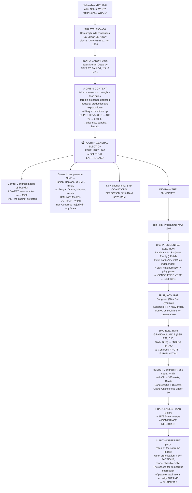
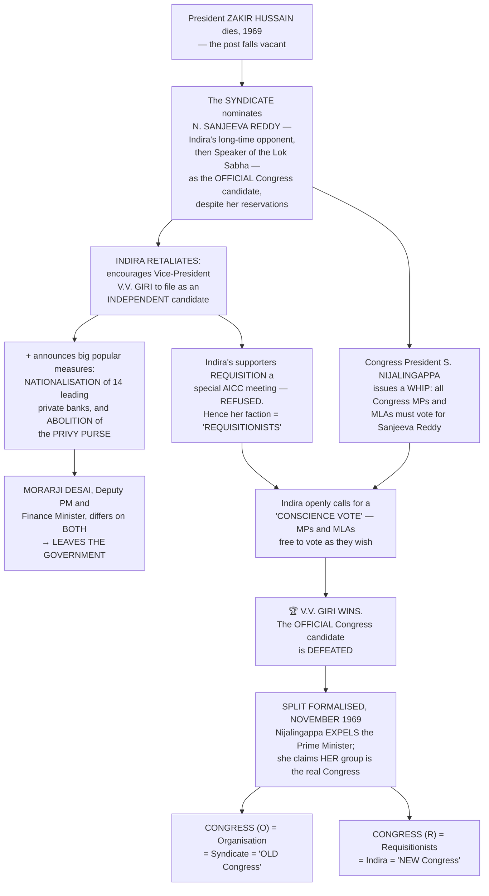

# Chapter 5: Challenges to and Restoration of the Congress System

> ⚠️ **Filename note:** the PDF in this folder is named `05_Challenges_to_the_Congress_System.pdf`, but the book's actual chapter title is **"Challenges to *and Restoration of* the Congress System."** The restoration half is the second and more important argument — don't let the filename shorten your reading of it.

## 🎯 Chapter Outcome — what you should walk away with

> **The one thing this chapter exists to teach:** Indira Gandhi did not *revive* the Congress system — **she restored the Congress's dominance by changing the nature of that dominance.** The old Congress absorbed conflict through factions; the new one relied on the popularity of a single leader. It won more and could accommodate less.

**After reading it, here is what you now understand:**

1. **The two succession questions** — "after Nehru, **who**?" was answered easily; the real fear was "after Nehru, **what**?" The 1960s were labelled the **"dangerous decade"**, when poverty, inequality and communal and regional divisions might produce **a political role for the army** or even disintegration. **Both successions were peaceful**, which was itself the answer.
2. **The 1967 election as a "political earthquake"** — the Congress kept the Lok Sabha with **its lowest tally of seats and vote share since 1952**; **half of Indira Gandhi's ministers were defeated**; and it **lost power in nine States**. The DMK's win in Madras was **the first time any non-Congress party secured a majority of its own in any State**.
3. **The vocabulary the era produced** — **non-Congressism** (Lohia's strategy *and* his theoretical defence of it), **SVD coalitions** of ideologically incongruent partners, **defection**, and **"Aya Ram, Gaya Ram"**.
4. **What the Syndicate was** — an informal group of powerful state leaders controlling the party organisation, who **installed Indira Gandhi expecting her to depend on them**.
5. **How she converted a power struggle into an ideological one** — the **Ten Point Programme (May 1967)**, then bank nationalisation and the abolition of the privy purse, then the **1969 presidential election** where a **"conscience vote"** defeated the official party candidate and formalised the split.
6. **Congress (O) vs Congress (R)** — Old vs New Congress, and how Indira Gandhi **projected the split as socialists vs conservatives, pro-poor vs pro-rich**.
7. **Why *Garibi Hatao* beat the Grand Alliance** — the alliance had "only one common programme: **Indira Hatao**"; she had **an issue, an agenda and a positive slogan**. Result: **352 seats** for Congress(R) alone, **375 with the CPI**, against the Congress(O)'s **16**.
8. **The chapter's real conclusion** — the restored Congress **"did not have the kind of capacity to absorb all tensions and conflicts that the Congress system was known for"**, and **"the spaces for democratic expression of people's aspirations actually shrank."**

**Self-check — answer these three without looking:**
1. What exactly did Lohia mean by "non-Congressism", and what was his justification for it?
2. Name the issue on which the Congress formally split in 1969, and the device Indira Gandhi used.
3. Why does the chapter call this a *restoration* and yet insist it was a different party?

**Where this leads:** the last paragraph is the bridge — popular unrest kept growing while democratic space shrank, "which led to a political crisis that threatened the very existence of constitutional democracy" — **Chapter 6**.

---

## 🗺️ The chapter in one picture



---

## The Big Idea

In Ch 2 we saw the Congress system. **"This system was first challenged during the 1960s."** As political competition became more intense, the Congress found it difficult to retain its dominance:
- It faced **an opposition that was more powerful and less divided than before**.
- It faced **challenges from within**, as **"the party could no longer accommodate all kinds of differences."**

**The one-line thesis:** the Congress system was challenged, broke, and was then rebuilt — but rebuilt on a completely different foundation, and that change of foundation is what makes Chapter 6 possible.

---

## PART 1 — THE CHALLENGE OF POLITICAL SUCCESSION

### "After Nehru, what?"

Nehru **passed away in May 1964**, having been unwell for more than a year. This generated speculation about the usual question — **"after Nehru, who?"** But in a newly independent country it raised a more serious one: **"after Nehru, what?"**

**The fears, stated plainly:**
- Many outsiders **doubted whether India's democratic experiment would survive after Nehru.**
- It was feared that, **like so many other newly independent countries, India too would not be able to manage a democratic succession** — and that failure **"could lead to a political role for the army."**
- There were doubts whether new leadership could **handle the multiple crises awaiting solution**.
- **The 1960s were labelled the "dangerous decade"**, when unresolved problems — poverty, inequality, communal and regional divisions — **"could lead to a failure of the democratic project or even the disintegration of the country."**

**Neville Maxwell, "India's Disintegrating Democracy", *The Times* (London), 1967**, quoted in the margin:
> *"…in India, as present trends continue… the maintenance of an ordered structure of society is going to slip out of reach of an ordered structure of civil government and **the army will be the only alternative source of authority and order**… **the great experiment of developing India within a democratic framework has failed.**"*

> 💬 **And the margin question the chapter plants against it:** *"When France or Canada have similar problems, no one talks about failure or disintegration. Why are we under this constant suspicion?"*

### From Nehru to Shastri — succession 1

**"The ease with which the succession after Nehru took place proved all the critics wrong."**

- **K. Kamaraj**, president of the Congress party, **consulted party leaders and Congress MPs** and found a **consensus in favour of Lal Bahadur Shastri**.
- Shastri was **unanimously chosen** as leader of the Congress parliamentary party, and became Prime Minister.

**Why Shastri:** a **non-controversial leader from Uttar Pradesh**, a Minister in Nehru's cabinet for many years, on whom **"Nehru had come to depend a lot in his last year"**; known for **simplicity and commitment to principles** — he had **resigned as Railway Minister accepting moral responsibility for a major railway accident**.

**The Guardian, London, 3 June 1964**, comparing the succession with Britain's own after Harold Macmillan:
> *"…the new Prime Minister of India, **in spite of all forebodings**, had been named **with more dispatch, and much more dignity, than was the new Prime Minister of Britain**."*

**Shastri's two challenges (1964–66):**
1. **Economic:** while India was still recovering from the war with China, **failed monsoons, drought and a serious food crisis** presented a grave challenge.
2. **Military:** the **1965 war with Pakistan** (Ch 4).

> ⭐ **His slogan *"Jai Jawan Jai Kisan"* symbolised the country's resolve to face *both* these challenges** — the soldier and the farmer, war and food, in one phrase. Never explain it as a war slogan alone.

**His Prime Ministership ended abruptly on 11 January 1966**, when he **suddenly expired in Tashkent** — then in the USSR, currently the capital of Uzbekistan — where he had gone to sign the agreement with **Muhammad Ayub Khan** ending the war.

### From Shastri to Indira Gandhi — succession 2

**"The Congress faced the challenge of political succession for the second time in two years."** This time there was **intense competition** between **Morarji Desai** and **Indira Gandhi**.

| Candidate | Credentials |
|---|---|
| **Morarji Desai** | Earlier **Chief Minister of Bombay state** (today's Maharashtra and Gujarat) and a **Minister at the Centre** |
| **Indira Gandhi** | Daughter of Nehru; **Congress President in the past**; **Union Minister for Information in the Shastri cabinet** |

- **The senior leaders decided to back Indira Gandhi, but the decision was not unanimous.**
- **The contest was resolved through a secret ballot among Congress MPs.**
- **Indira Gandhi defeated Morarji Desai, securing the support of more than two-thirds of the party's MPs.**

> ⭐ **"A peaceful transition of power, despite intense competition for leadership, was seen as a sign of maturity of India's democracy."**

**⚠️ The calculation behind the backing — this is the seed of everything that follows:**
> **"The senior Congress leaders may have supported Indira Gandhi in the belief that her administrative and political inexperience would compel her to be dependent on them for support and guidance."**

Within a year she had to lead the party in a Lok Sabha election, with **the economic situation further deteriorating**. "Faced with these difficulties, she set out to **gain control over the party and to demonstrate her leadership skills.**"

**👤 Indira Gandhi (1917–1984):** Prime Minister **1966–1977 and 1980–1984**; participated in the freedom struggle as a young Congress worker; **Congress President in 1959**; minister in Shastri's cabinet 1964–66; led the Congress to victory in **1967, 1971 and 1980**; credited with the slogan **'Garibi Hatao'**, the **1971 war victory**, and policy initiatives including **abolition of the Privy Purse, nationalisation of banks, the nuclear test and environmental protection**; **assassinated on 31 October 1984**.

**👤 Lal Bahadur Shastri (1904–1966):** in the freedom movement since 1930; minister in the UP cabinet; **General Secretary of the Congress**; Minister in the Union Cabinet **1951–1956**, when he **resigned taking responsibility for a railway accident**, and again **1957–1964**; coined **'Jai Jawan-Jai Kisan'**.

---

## PART 2 — THE FOURTH GENERAL ELECTION, 1967

### 💥 The context — a compounding crisis

**"The year 1967 is considered a landmark year in India's political and electoral history."**

```
   THE CRISIS STACK BEFORE FEBRUARY 1967
   ═══════════════════════════════════════════════════════
   POLITICAL   Two Prime Ministers dead in quick succession;
               the new PM "seen as a political novice",
               in office less than a year
   ───────────────────────────────────────────────────────
   AGRICULTURE Successive failure of monsoons
               Widespread drought
               Decline in agricultural production
               Serious food shortage
   ───────────────────────────────────────────────────────
   ECONOMY     Depletion of foreign exchange reserves
               Drop in industrial production and exports
               Sharp rise in military expenditure
               Diversion of resources from planning
   ───────────────────────────────────────────────────────
   CURRENCY    ⚠️ DEVALUATION of the rupee — one of the first
               decisions of the Indira Gandhi government,
               "under what was seen to be pressure from the US"
               $1 = under ₹5   →   $1 = over ₹7
   ───────────────────────────────────────────────────────
   STREETS     Price rise → protests over essential commodities,
               food scarcity, growing unemployment
               Frequent BANDHS and HARTALS
   ═══════════════════════════════════════════════════════
```

> ⚠️ **The government's fatal misreading:** "The government saw the protests as **a law and order problem** and not as **expressions of people's problems**. This further increased public bitterness and reinforced popular unrest."

**Also in this period:**
- The **communist and socialist parties launched struggles for greater equality.**
- A group of communists who separated from the **CPI(M)** to form the **CPI (Marxist-Leninist)** led **armed agrarian struggles and organised peasant agitations** (Ch 6).
- **"This period also witnessed some of the worst Hindu-Muslim riots since Independence."**

### 🤝 Non-Congressism — Lohia's strategy

Opposition parties were in the forefront of organising public protests. And they made a decisive realisation:

> ⭐ **"Parties opposed to the Congress realised that *the division of their votes kept the Congress in power*."**

So parties **"that were entirely different and disparate in their programmes and ideology"** got together — forming **anti-Congress fronts** in some states and entering **electoral adjustments of sharing seats** in others. They judged that **Indira Gandhi's inexperience and the internal factionalism within the Congress gave them an opportunity to topple it.**

**The socialist leader Ram Manohar Lohia gave this strategy the name 'non-Congressism'.** And — the part students usually omit — **he also produced a theoretical argument in its defence:**

> **"Congress rule was undemocratic and opposed to the interests of ordinary poor people; therefore, the coming together of the non-Congress parties was necessary for *reclaiming democracy for the people*."**

**👤 Ram Manohar Lohia (1910–1967):** socialist leader and thinker; freedom fighter; among the founders of the **Congress Socialist Party**; after the split, leader of the **Socialist Party** and later the **Samyukta Socialist Party**; MP 1963–67; **founder editor of *Mankind* and *Jan***; known for an **original contribution to a non-European socialist theory**; and as a political leader best known for **sharp attacks on Nehru, the strategy of non-Congressism, advocacy of reservation for backward castes, and opposition to English.**

### 🗳️ The electoral verdict

The elections were held in **February 1967**, with **the Congress facing the electorate for the first time without Nehru**.

> **"The results jolted the Congress at both the national and state levels. Many contemporary political observers described the election results as a 'political earthquake'."**

**At the Centre:**
- The Congress **did manage a majority in the Lok Sabha** — **but with its lowest tally of seats and share of votes since 1952.**
- **Half the ministers in Indira Gandhi's cabinet were defeated.**
- **The stalwarts who lost their own constituencies:** **Kamaraj** in Tamil Nadu, **S.K. Patil** in Maharashtra, **Atulya Ghosh** in West Bengal, **K.B. Sahay** in Bihar.

**In the States — the more dramatic story:**
- **The Congress lost its majority in seven States**; in **two others defections prevented it from forming a government**.
- **The nine States where the Congress lost power:** **Punjab, Haryana, Uttar Pradesh, Madhya Pradesh, Bihar, West Bengal, Orissa, Madras and Kerala.**
- **⭐ In Madras (now Tamil Nadu), the DMK came to power with a clear majority** — after leading **a massive anti-Hindi agitation by students against the Centre** on the imposition of Hindi as the official language. **"This was the first time any non-Congress party had secured a majority of its own in any State."**
- **In the other eight States, coalition governments of different non-Congress parties were formed.**

> 💬 **The image that captures it:** "A popular saying was that one could take a train from **Delhi to Howrah** and **not pass through a single Congress-ruled State.**"

**👤 C. Natarajan Annadurai (1909–1969):** Chief Minister of Madras (Tamil Nadu) from 1967; a **journalist, popular writer and orator**; initially associated with the **Justice Party**; later joined **Dravid Kazagham (1934)**; **formed the DMK as a political party in 1949**; a proponent of Dravid culture who **opposed the imposition of Hindi and led the anti-Hindi agitations**; a **supporter of greater autonomy to States**.

### 🤝 Coalitions — the SVD phenomenon

Since no single party had a majority, various non-Congress parties came together to form **joint legislative parties — *Samyukt Vidhayak Dal* — hence "SVD governments"**.

> ⚠️ **"In most of these cases the coalition partners were ideologically incongruent."** Two examples the chapter gives, and you should be able to reproduce at least one:

| State | The coalition |
|---|---|
| **Bihar** (SVD) | The two socialist parties — **SSP and PSP** — along with **the CPI on the left** and the **Jana Sangh on the right** |
| **Punjab** ("Popular United Front") | The **two rival Akali parties** at that time — the **Sant group and the Master group** — with **both communist parties (CPI and CPI-M)**, the **SSP**, the **Republican Party** and the **Bharatiya Jana Sangh** |

### 🔄 Defection, and "Aya Ram, Gaya Ram"

**Definition:** *"Defection means an elected representative leaves the party on whose symbol he/she was elected and joins another party."*

- After the 1967 election, **breakaway Congress legislators played an important role in installing non-Congress governments in three States — Haryana, Madhya Pradesh and Uttar Pradesh.**
- **"The constant realignments and shifting political loyalties in this period gave rise to the expression 'Aya Ram, Gaya Ram'."**

> 🃏 **The story behind the phrase, in full:** the expression originated in "an amazing feat of floor crossing achieved by **Gaya Lal, an MLA in Haryana, in 1967**." He **changed his party three times in a fortnight** — from **Congress to United Front, back to Congress, and then within nine hours to United Front again!** When Gaya Lal declared his intention to quit the United Front and join the Congress, the Congress leader **Rao Birendra Singh** brought him to the Chandigarh press and declared **"Gaya Ram was now Aya Ram."** The feat "was immortalised in the phrase… which became the subject of numerous jokes and cartoons. **Later, the Constitution was amended to prevent defections.**" *(The 52nd Amendment, 1985 — Class 11 ICW Ch 5.)*

### The immediate aftermath
The 1967 results **"proved that the Congress could be defeated at the elections. But there was no substitute as yet."** Most non-Congress coalition governments in the States **did not survive for long** — they lost majority, and either **new combinations were formed or President's rule had to be imposed.**

---

## PART 3 — SPLIT IN THE CONGRESS

### 🏛️ The Syndicate

> **"The real challenge to Indira Gandhi came not from the opposition but from within her own party."**

**Definition:** *Syndicate* was **the informal name given to a group of Congress leaders who were in control of the party's organisation.**

| Member | Base |
|---|---|
| **K. Kamaraj** (leader of the group) | Former Chief Minister of Tamil Nadu, then **president of the Congress party** |
| **S.K. Patil** | Bombay city (later Mumbai) |
| **S. Nijalingappa** | Mysore (later Karnataka) |
| **N. Sanjeeva Reddy** | Andhra Pradesh |
| **Atulya Ghosh** | West Bengal |

- **Both Lal Bahadur Shastri and later Indira Gandhi owed their position to the support received from the Syndicate.**
- The group **"had a decisive say in Indira Gandhi's first Council of Ministers and also in policy formulation and implementation."**
- **After the split**, the Syndicate leaders and those owing allegiance to them **stayed with the Congress (O)**. Since it was Indira Gandhi's **Congress (R) that won the test of popularity, "all these big and powerful men of Indian politics lost their power and prestige after 1971."**

**👤 K. Kamaraj (1903–1975):** freedom fighter and Congress President; Chief Minister of Madras; **having suffered educational deprivation, made efforts to spread education in Madras province**; **introduced the mid-day meal scheme for schoolchildren**; and in **1963 proposed that all senior Congressmen should resign from office to make way for younger party workers — the famous "Kamaraj plan."**

**👤 S. Nijalingappa (1902–2000):** senior Congress leader; member of the Constituent Assembly; member of the Lok Sabha; Chief Minister of the then Mysore (Karnataka); **regarded as the maker of modern Karnataka**; **President of the Congress during 1968–71.**

> 💬 **Margin note worth carrying:** *"So, there is nothing new about State level leaders being the king-makers at the centre. I thought it happened only in the 1990s."*

### ⚔️ Indira vs the Syndicate — and the masterstroke

Indira Gandhi faced **two challenges at once**: to **build her independence from the Syndicate**, and to **regain the ground the Congress had lost in 1967**.

> ⭐⭐ **Her strategy, and the single most important sentence in the chapter: "Indira Gandhi adopted a very bold strategy. She *converted a simple power struggle into an ideological struggle*."**

She began by **choosing her trusted group of advisers from outside the party** and **slowly and carefully sidelining the Syndicate**, then launched **"a series of initiatives to give the government policy a Left orientation."**

### 📋 The Ten Point Programme, May 1967
Adopted by the Congress Working Committee at her instance:

1. **Social control of banks**
2. **Nationalisation of General Insurance**
3. **Ceiling on urban property and income**
4. **Public distribution of food grains**
5. **Land reforms**
6. **Provision of house sites to the rural poor**

> ⚠️ **"While the 'syndicate' leaders *formally approved* this Left-wing programme, they had *serious reservations* about the same."** That gap between formal approval and real reservation is what the 1969 crisis blew open.

### ⚡ The presidential election of 1969 — the showdown



**Nijalingappa's letter to Indira Gandhi expelling her from the party, 11 November 1969** — the margin quotation:
> *"History… is replete with instances of the tragedy that overtakes democracy when a leader who has risen to power on the crest of a popular wave or with the support of a democratic organisation becomes **a victim of political narcissism and is egged on by a coterie of unscrupulous sycophants**…"*

> ⭐ **How Indira Gandhi framed the split — this framing is the reason she won:** she projected it **"as an ideological divide between socialists and conservatives, between the pro-poor and the pro-rich."**

**👤 V.V. Giri (1894–1980):** President of India 1969–1974; Congress worker and **labour leader** from Andhra Pradesh; Indian High Commissioner to Ceylon (Sri Lanka); **Labour Minister** in the Union cabinet; Governor of U.P., Kerala and Mysore; **Vice-President 1967–1969** and **acting President after Zakir Hussain's death**; **resigned and contested the presidential election as an independent**, with Indira Gandhi's support.

**🎨 The R.K. Laxman cartoon "The Left Hook" (21 August 1969)** — published after Giri's victory: **Giri is the boxer with the garland; the Syndicate is represented by Nijalingappa, on his knees.** The title carries the double meaning — a boxing punch *and* the leftward policy turn that delivered it.

### 💰 The abolition of the Privy Purse — the full story

| Stage | What happened |
|---|---|
| **Origin** | Integration of the princely states (Ch 1) was **preceded by an assurance** that after the dissolution of princely rule the rulers' families could **retain certain private property** and receive **a grant in heredity or government allowance**, measured on **the extent, revenue and potential of the merging state**. This grant was the **privy purse** |
| **Why it was accepted then** | "At the time of accession there was little criticism of these privileges since **integration and consolidation was the primary aim**" |
| **The objection** | **"Hereditary privileges were not consonant with the principles of equality and social and economic justice laid down in the Constitution."** **Nehru had expressed dissatisfaction time and again** |
| **1967 onward** | **Indira Gandhi supported the demand for abolition.** **Morarji Desai called the move morally wrong and amounting to "a breach of faith with the princes"** |
| **1970** | The government tried a **Constitutional amendment — not passed in the Rajya Sabha**. It then issued an **ordinance, struck down by the Supreme Court** |
| **1971** | **Indira Gandhi made this a major election issue and got a lot of public support.** After the massive victory, **the Constitution was amended to remove legal obstacles** to abolition |

---

## PART 4 — THE 1971 ELECTION AND THE RESTORATION

### The gamble
The split **reduced the Indira Gandhi government to a minority**. It continued in office with the **issue-based support of a few other parties including the CPI and the DMK.**

During this period the government **"made conscious attempts to project its socialist credentials"** — Indira Gandhi **vigorously campaigned for implementing the existing land reform laws and undertook further land ceiling legislation.**

**Then, to end her dependence on other parties, strengthen her position in Parliament and seek a popular mandate, her government recommended the dissolution of the Lok Sabha in December 1970** — "another surprising and bold move." **The fifth general election was held in February 1971.**

### ⚖️ The contest — why it looked hopeless

**The odds against Congress(R):**
- It was **"just one faction of an already weak party."**
- **"Everyone believed that the real organisational strength of the Congress party was under the command of Congress(O)."**
- All the major **non-communist, non-Congress opposition parties formed the Grand Alliance**.

```
   THE GRAND ALLIANCE, 1971            vs        CONGRESS (R) + CPI
   ══════════════════════════════════            ═══════════════════
   SSP  Samyukta Socialist Party
   PSP  Praja Socialist Party                    Congress (R)
   BJS  Bharatiya Jana Sangh              +      Communist Party of India
   SWA  Swatantra Party
   BKD  Bharatiya Kranti Dal
   ──────────────────────────────────            ───────────────────
   Programme: "INDIRA HATAO"                     "GARIBI HATAO"
   (Remove Indira)                               (Remove Poverty)
   ⇒ NO coherent political programme             ⇒ an issue, an agenda
                                                   and a POSITIVE slogan
```

> ⭐ **The decisive asymmetry, in the chapter's own words:** "Yet the new Congress had something that its big opponents lacked — **it had an issue, an agenda and a positive slogan.**"

***Garibi Hatao* meant, concretely:** growth of the public sector; **ceiling on rural land holdings and urban property**; removal of disparities in income and opportunity; and **abolition of princely privileges**.

**And its political purpose:** through *garibi hatao* she tried to **generate a support base among the disadvantaged — especially landless labourers, Dalits and Adivasis, minorities, women and the unemployed youth.** The slogan and the programmes that followed were "part of Indira Gandhi's political strategy of **building an independent nationwide political support base**."

> 💬 **The margin question — and it deserves a real answer:** *"Almost four decades after giving the slogan of Garibi Hatao, we still have much poverty around! Was the slogan only an election gimmick?"* The chapter's own later verdict supplies half the answer: the new politics turned ideology "into a mere electoral discourse, use of various slogans **not meant to be translated into government policies**" (Kaviraj, exercise 10). But note that some measures *were* carried out — bank nationalisation, privy purse abolition, further land-ceiling legislation — so the fairer verdict is that the slogan was **both** a genuine programme and an instrument of personal mobilisation, and the second outlived the first.

### 📊 The outcome

```
   LOK SABHA 1971
   ═══════════════════════════════════════════════════════
   Congress(R) + CPI      375 seats   48.4% votes  ██████████
   Congress(R) alone      352 seats   ~44% votes   █████████
   Congress(O)             16 seats                ▏
   Grand Alliance total   under 60 seats           █
   ═══════════════════════════════════════════════════════
   The Congress(R)-CPI alliance won MORE SEATS AND VOTES
   than the Congress had EVER won in the first four general
   elections. Congress(O) — "the party with so many stalwarts" —
   got LESS THAN ONE-FOURTH of the votes secured by
   Indira Gandhi's party.
```

**"With this the Congress party led by Indira Gandhi established its claim to being the 'real' Congress and restored to it the dominant position in Indian politics. The Grand Alliance of the opposition proved a grand failure."**

**🎨 The R.K. Laxman cartoon "The Grand Finish"** — his reading of the 1971 outcome, with the leading opposition figures as players on the ground.

### 🇧🇩 …and then Bangladesh

**Soon after the 1971 Lok Sabha elections, the major political and military crisis broke out in East Pakistan** (Ch 4). The war and the creation of Bangladesh **"added to the popularity of Indira Gandhi. Even the opposition leaders admired her statesmanship."**

- **Her party swept through all the State Assembly elections held in 1972.**
- She was seen **"not only as the protector of the poor and the underprivileged, but also a strong nationalist leader."**
- **"The opposition to her, either within the party or outside of it, simply did not matter."**

**With two successive victories — Centre and States — the dominance of the Congress was restored.** It was in power in almost all the States and popular across different social sections. **"Within a span of four years, Indira Gandhi had warded off the challenge to her leadership and to the dominant position of the Congress party."**

---

## PART 5 — "RESTORATION?" — THE CHAPTER'S REAL ARGUMENT

> ⭐⭐⭐ **This section is the heart of the chapter and is very frequently examined. The question mark in the heading is deliberate.**

**"But does it mean that the Congress system was restored? What Indira Gandhi had done was *not a revival of the old Congress party*. In many ways she had *re-invented* the party."**

| | **Old Congress (Ch 2)** | **New Congress (after 1971)** |
|---|---|---|
| **Basis of support** | A **rainbow-like social coalition** of contradictory interests | Relied **entirely on the popularity of the supreme leader** |
| **Organisation** | Network **down to the local level**; a genuine machine | **"A somewhat weak organisational structure"** |
| **Factions** | **Tolerated and encouraged** — the balancing mechanism | **"Did not have many factions, thus it could not accommodate all kinds of opinions and interests"** |
| **Whom it depended on** | Everyone — "peasants and industrialists, workers and owners" | **Specific social groups: the poor, women, Dalits, Adivasis and the minorities** |
| **Function** | Ruling party **and** opposition at once | Ruling party only |

> ⭐ **The formulation to memorise: "Indira Gandhi restored the Congress system by *changing the nature of the Congress system itself*."**

**And the consequence — the bridge to Chapter 6:**

> **"Despite being more popular, the new Congress did not have the kind of capacity to absorb all tensions and conflicts that the Congress system was known for. While the Congress consolidated its position and Indira Gandhi assumed a position of unprecedented political authority, *the spaces for democratic expression of people's aspirations actually shrank*. The popular unrest and mobilisation around issues of development and economic deprivation continued to grow."**

**…"which led to a political crisis that threatened the very existence of constitutional democracy in the country."**

**🎬 *Zanjeer* (1973)** — director **Prakash Mehra**, screenplay **Salim Khan–Javed Akhtar**, cast **Amitabh Bachchan, Ajit, Jaya Bhaduri, Pran**. Vijay, a young police officer, is **framed on false charges and jailed** while fighting gangsters; released, he is determined to take revenge, fighting the anti-social element with **the tacit support of many others from within the system**. The chapter uses it as a social document: it **"portrayed the erosion of moral values and the deep frustrations arising from that quite forcefully… the indifference of the system and the harsh and volcanic eruption of protest through the anger of Vijay"** — and it **set the trend of what became known as the "angry young man" of the seventies.** *(Read this alongside the last paragraph: the film is the popular mood the chapter is describing.)*

---

## Key Words (Glossary)

| Term | Meaning |
|---|---|
| **"Dangerous decade"** | The label for the 1960s, when poverty, inequality and communal and regional divisions might have produced **failure of the democratic project or even disintegration** |
| **Devaluation** | Reducing the value of the currency — the rupee went from **under ₹5 to over ₹7 per dollar**, seen as done **under US pressure** |
| **Non-Congressism** | **Lohia's** strategy of ideologically disparate parties uniting against the Congress, defended on the ground that **Congress rule was undemocratic and anti-poor, so unity was necessary "for reclaiming democracy for the people"** |
| **SVD (*Samyukt Vidhayak Dal*)** | Joint legislative parties formed by non-Congress parties after 1967 to support coalition governments — **usually ideologically incongruent** |
| **Defection** | An elected representative **leaving the party on whose symbol he/she was elected** and joining another |
| **"Aya Ram, Gaya Ram"** | From **Gaya Lal**, a Haryana MLA who changed party **three times in a fortnight in 1967** — the phrase for frequent floor-crossing |
| **Syndicate** | The informal group of powerful leaders **controlling the party organisation** — Kamaraj, S.K. Patil, Nijalingappa, Sanjeeva Reddy, Atulya Ghosh |
| **Kamaraj plan** | Kamaraj's **1963** proposal that **all senior Congressmen should resign from office** to make way for younger party workers |
| **Ten Point Programme (May 1967)** | The left turn: social control of banks, nationalisation of General Insurance, ceiling on urban property and income, public distribution of foodgrains, land reforms, house sites for the rural poor |
| **Privy purse** | The **hereditary grant** to former princely families, based on the **extent, revenue and potential** of the merging state — abolished by constitutional amendment after 1971 |
| **Requisitionists** | Indira Gandhi's faction — from their **requisitioning of a special AICC meeting**, which was refused. Hence **Congress (R)** |
| **Congress (O)** | Congress (Organisation) — the Syndicate's faction, the **"Old Congress"** |
| **Conscience vote** | Indira Gandhi's call that Congress MPs and MLAs be **free to vote as they wished** in the presidential election, defying the party whip |
| **Grand Alliance** | The 1971 opposition front — **SSP, PSP, BJS, Swatantra and BKD** — whose only common programme was **"Indira Hatao"** |
| ***Garibi Hatao*** | "Remove Poverty" — the positive counter-slogan, and the basis of an **independent nationwide support base** among the disadvantaged |

---

## Quick Recap (16 points)

1. **Nehru died May 1964.** "After Nehru, **who**?" was easy; **"after Nehru, what?"** was the real fear — the **"dangerous decade"**, with a possible **political role for the army** (Neville Maxwell, *The Times*, 1967).
2. **Succession 1:** **Kamaraj** built a consensus; **Shastri** was chosen **unanimously**. *The Guardian* noted it was done **"with more dispatch, and much more dignity, than… in Britain."**
3. **Shastri (1964–66)** faced **the food/drought crisis and the 1965 war**; **"Jai Jawan Jai Kisan"** answered both. He **died at Tashkent on 11 January 1966**.
4. **Succession 2:** **Indira Gandhi beat Morarji Desai by secret ballot with over two-thirds of Congress MPs** — "a sign of maturity of India's democracy." Seniors backed her **believing her inexperience would make her dependent on them**.
5. **The 1967 crisis stack:** failed monsoons, drought, food shortage, depleted foreign exchange, falling industrial output and exports, rising military expenditure — plus **devaluation (₹5 → over ₹7 per dollar), seen as US pressure** → price rise, bandhs and hartals. **The government read protest as a law and order problem**, deepening bitterness.
6. **Lohia's non-Congressism:** disparate parties uniting because **"the division of their votes kept the Congress in power"** — justified as **reclaiming democracy for the people**.
7. **February 1967 = "a political earthquake":** Congress kept the Lok Sabha with its **lowest seats and votes since 1952**; **half the cabinet defeated**; **Kamaraj, S.K. Patil, Atulya Ghosh and K.B. Sahay lost their seats**.
8. **Nine States lost:** Punjab, Haryana, UP, MP, Bihar, West Bengal, Orissa, Madras, Kerala. **The DMK won Madras outright — the first non-Congress majority in any State — after the anti-Hindi agitation.** "Delhi to Howrah without a single Congress-ruled State."
9. **SVD coalitions** of ideologically incongruent partners — **Bihar: SSP + PSP + CPI + Jana Sangh; Punjab's "Popular United Front": both Akali groups + CPI + CPI(M) + SSP + Republican Party + BJS.**
10. **Defection** installed non-Congress governments in **Haryana, Madhya Pradesh and Uttar Pradesh**; **Gaya Lal changed party thrice in a fortnight** → **"Aya Ram, Gaya Ram"** → the Constitution was later amended.
11. **The Syndicate** — Kamaraj (leader), S.K. Patil, Nijalingappa, Sanjeeva Reddy, Atulya Ghosh — had **a decisive say in her first Council of Ministers**; after the split they went to **Congress (O)** and **"lost their power and prestige after 1971."**
12. **Her strategy: "she converted a simple power struggle into an ideological struggle"** — advisers from outside the party, then the **Ten Point Programme, May 1967**, which the Syndicate **formally approved with serious reservations**.
13. **1969 showdown:** **Zakir Hussain dies** → Syndicate nominates **Sanjeeva Reddy** → Indira backs **V.V. Giri as independent** + announces **bank nationalisation and privy purse abolition** → **Morarji Desai leaves the government** → **Nijalingappa's whip** vs Indira's **"conscience vote"** → **Giri wins** → **split formalised November 1969**: **Congress (O)** vs **Congress (R)**, framed as **socialists vs conservatives, pro-poor vs pro-rich**.
14. **Privy purse:** promised at accession, judged inconsistent with constitutional equality; **amendment failed in the Rajya Sabha (1970)**, **ordinance struck down by the Supreme Court**, made an **election issue in 1971**, then **amended into the Constitution after the victory**.
15. **1971:** Lok Sabha dissolved in **December 1970**; **Grand Alliance (SSP, PSP, BJS, Swatantra, BKD) = "Indira Hatao"** vs **"Garibi Hatao"**. Result: **Congress(R) 352 seats (~44%), with CPI 375 seats (48.4%); Congress(O) 16; the Grand Alliance under 60.** Then the **Bangladesh victory** and a **sweep of the 1972 State elections**.
16. **⭐ "Restoration?" — she restored the Congress system by changing its nature.** The new party relied on **the supreme leader**, had a **weak organisation** and **few factions**, and depended on **specific social groups**. It **could not absorb tensions**, and **"the spaces for democratic expression of people's aspirations actually shrank"** — the direct road to Chapter 6.

---

## 60-Second Revision

**Nehru dies MAY 1964 → "after Nehru, WHO?" easy; "after Nehru, WHAT?" the real fear. 1960s = "DANGEROUS DECADE"; NEVILLE MAXWELL, "India's Disintegrating Democracy", *The Times* 1967: "the army will be the only alternative source of authority."** **SUCCESSION 1: KAMARAJ consults → SHASTRI UNANIMOUS. *Guardian*: "more dispatch, and much more dignity, than… Britain."** **SHASTRI 1964–66: food crisis + drought + 1965 war → "JAI JAWAN JAI KISAN" answers BOTH. Died TASHKENT 11 JAN 1966. (Had earlier resigned as Railway Minister over an accident.)** **SUCCESSION 2: INDIRA beats MORARJI DESAI by SECRET BALLOT, >2/3 of MPs. Seniors backed her expecting DEPENDENCE.** **1967 CRISIS: failed monsoons, drought, food shortage, forex depleted, industrial output + exports down, military spending up, DEVALUATION ($1: <₹5 → >₹7, "US pressure") → price rise, bandhs, hartals. Govt saw protest as LAW AND ORDER, not people's problems. Worst Hindu-Muslim riots since Independence. CPI(ML) armed agrarian struggles.** **LOHIA'S NON-CONGRESSISM: "the division of their votes kept the Congress in power" + theory = Congress rule undemocratic and anti-poor, so unity was "necessary for RECLAIMING DEMOCRACY for the people."** **FEB 1967 = "POLITICAL EARTHQUAKE": Congress keeps LS but LOWEST seats+votes since 1952; HALF the cabinet defeated; KAMARAJ, S.K. PATIL, ATULYA GHOSH, K.B. SAHAY lost. NINE STATES lost: Punjab, Haryana, UP, MP, Bihar, W.Bengal, Orissa, Madras, Kerala. DMK wins MADRAS OUTRIGHT after the ANTI-HINDI AGITATION = FIRST non-Congress majority in ANY state (ANNADURAI). "Delhi to Howrah without a single Congress state."** **SVD (Samyukt Vidhayak Dal) coalitions, IDEOLOGICALLY INCONGRUENT: BIHAR = SSP+PSP+CPI+JANA SANGH; PUNJAB "Popular United Front" = Sant + Master Akalis + CPI + CPI(M) + SSP + Republican + BJS.** **DEFECTION installed govts in HARYANA, MP, UP. GAYA LAL changed party THRICE IN A FORTNIGHT (Congress→UF→Congress→UF in NINE HOURS); RAO BIRENDRA SINGH: "Gaya Ram was now Aya Ram." Constitution later amended.** **SYNDICATE = informal group controlling the ORGANISATION: KAMARAJ (leader, Congress president; "KAMARAJ PLAN" 1963 = seniors resign for younger workers; mid-day meal scheme), S.K. PATIL (Bombay), NIJALINGAPPA (Mysore), SANJEEVA REDDY (AP), ATULYA GHOSH (WB). Backed Shastri AND Indira; decisive say in her first Council of Ministers; after the split went to Congress(O) and LOST power and prestige after 1971.** **⭐ "SHE CONVERTED A SIMPLE POWER STRUGGLE INTO AN IDEOLOGICAL STRUGGLE." Advisers from OUTSIDE the party. TEN POINT PROGRAMME MAY 1967: social control of banks, nationalisation of General Insurance, ceiling on urban property + income, public distribution of foodgrains, land reforms, house sites for the rural poor — Syndicate FORMALLY APPROVED with SERIOUS RESERVATIONS.** **1969: ZAKIR HUSSAIN dies → Syndicate nominates SANJEEVA REDDY (Speaker, her old opponent) → Indira backs V.V. GIRI as INDEPENDENT + BANK NATIONALISATION (14 banks) + PRIVY PURSE abolition → MORARJI DESAI (Dy PM + FM) LEAVES → NIJALINGAPPA'S WHIP vs Indira's "CONSCIENCE VOTE" → GIRI WINS → expelled 11 NOV 1969 ("political narcissism… coterie of unscrupulous sycophants") → CONGRESS (O) = Old/Syndicate vs CONGRESS (R) = Requisitionists/Indira. Framed as SOCIALISTS vs CONSERVATIVES, PRO-POOR vs PRO-RICH. Laxman: "THE LEFT HOOK", 21 Aug 1969.** **PRIVY PURSE: promised at accession (based on extent, revenue, potential of the merging state); Nehru dissatisfied; Morarji = "breach of faith with the princes"; 1970 amendment FAILED IN RAJYA SABHA; ordinance STRUCK DOWN BY SC; election issue 1971; amended after victory.** **1971: LS dissolved DEC 1970 → GRAND ALLIANCE = SSP + PSP + BJS + SWATANTRA + BKD, only programme "INDIRA HATAO"; she had "an issue, an agenda and a POSITIVE SLOGAN" = "GARIBI HATAO" (public sector growth, land + urban property ceilings, removing disparities, abolishing princely privileges) aimed at landless labourers, Dalits, Adivasis, minorities, women, unemployed youth. RESULT: Congress(R) 352 (~44%), +CPI = 375 (48.4%) — more than the Congress EVER won in the first four elections; CONGRESS(O) = 16; Grand Alliance under 60. Laxman: "THE GRAND FINISH."** **Then BANGLADESH → popularity soars, even opponents admire her statesmanship → SWEPT the 1972 State elections.** **⭐⭐ "RESTORATION?" — NOT a revival, a RE-INVENTION. New Congress: relies ENTIRELY on the supreme leader / WEAK organisation / FEW FACTIONS so it "could not accommodate all kinds of opinions and interests" / depends on the poor, women, Dalits, Adivasis, minorities. "Indira Gandhi RESTORED the Congress system BY CHANGING THE NATURE OF THE CONGRESS SYSTEM ITSELF." Could NOT absorb tensions → "the spaces for democratic expression of people's aspirations actually SHRANK" → CHAPTER 6. Film: ZANJEER 1973, the "ANGRY YOUNG MAN".**

---

## NCERT Exercises — with answers

**1. Which statement about the 1967 elections is correct?**
**(a) Congress won the Lok Sabha elections but lost the Assembly elections in many states.** It retained a Lok Sabha majority — though with its lowest tally of seats and votes since 1952 — while **losing power in nine States**. (b) is wrong because it did not lose the Lok Sabha; (c) is wrong because it did not lose its Lok Sabha majority; (d) is wrong because the majority was **reduced**, not increased.

**2. Match the following.**

| | |
|---|---|
| (a) **Syndicate** | **(iv) A group of powerful and influential leaders within the Congress** |
| (b) **Defection** | **(i) An elected representative leaving the party on whose ticket s/he has been elected** |
| (c) **Slogan** | **(ii) A catchy phrase that attracts public attention** |
| (d) **Anti-Congressism** | **(iii) Parties with different ideological positions coming together to oppose Congress and its policies** |

**3. Whom would you identify with these slogans?**
**(a) Jai Jawan, Jai Kisan — Lal Bahadur Shastri.**
**(b) Indira Hatao! — the Grand Alliance** of opposition parties in the 1971 election (SSP, PSP, BJS, Swatantra, BKD).
**(c) Garibi Hatao! — Indira Gandhi**, for Congress(R) in 1971.

**4. Which statement about the Grand Alliance of 1971 is correct?**
**(a) It was formed by non-Communist, non-Congress parties.** (b) is wrong — it explicitly **"did not have a coherent political programme"**; (c) is wrong because the **CPI was allied with Congress(R)**, not with the Alliance.

**5. How should a party resolve its internal differences?**

| Method | Advantages | Shortcomings |
|---|---|---|
| **(a) Follow the party president** | Quick, clear, avoids public splits; preserves discipline for elections | Concentrates power in one person; **exactly what Nijalingappa's whip attempted and what the "conscience vote" defeated**; suppresses dissent rather than resolving it, so differences resurface as splits |
| **(b) Listen to the majority group** | Democratic and legitimate; the outcome commands support inside the party | **Permanently silences minority opinion**; in a diverse party this drives minorities out, destroying the coalitional character that was the old Congress's strength |
| **(c) Secret ballot on every issue** | Protects members from pressure and retaliation — it is exactly how **Indira Gandhi's own election as leader in 1966** was decided fairly | **Unworkable for every issue**; removes accountability, since members need never defend their position publicly, and it can encourage exactly the covert manoeuvring of 1969 |
| **(d) Consult senior and experienced leaders** | Brings judgement and institutional memory; maintains continuity | **This is the Syndicate model** — it can become an unelected veto by "a group of powerful and influential leaders", insulated from the electorate, resisting change |
| **The honest answer** | A **combination**: open internal debate, decision by an elected body, a secret ballot reserved for leadership contests, and genuine space for factions to persist afterwards — which is precisely the capacity the post-1971 Congress lost |

**6. Which were reasons for the Congress defeat/setback in 1967?**
**(a) The absence of a charismatic leader — TRUE and a real factor.** The Congress faced the electorate **for the first time without Nehru**, with a new Prime Minister "seen as a political novice" who had been in office less than a year.
**(b) Split within the Congress party — FALSE for 1967.** The formal split came **in November 1969**, two years *after* this election. This is the commonest error in the question.
**(c) Increased mobilisation of regional, ethnic and communal groups — TRUE.** The **DMK's anti-Hindi agitation** delivered Madras; the period saw **some of the worst Hindu-Muslim riots since Independence** and **armed agrarian struggles** by the CPI(ML).
**(d) Increasing unity among non-Congress parties — TRUE, and decisive.** **Non-Congressism** meant anti-Congress fronts and **seat-sharing adjustments**, which stopped the splitting of opposition votes that FPTP had converted into Congress seats.
**(e) Internal differences within the Congress — TRUE.** Factionalism was visible enough for the opposition to judge it "an opportunity to topple the Congress", and **defections immediately after the election** brought down Congress governments in three more States.
**Add the underlying cause the list omits:** the **economic crisis** — drought, food shortage, devaluation and price rise — and the government's decision to treat protest as **a law and order problem.**

**7. Factors behind the popularity of Indira Gandhi's government in the early 1970s.**
1. **A positive programme against a negative one** — *Garibi Hatao* versus a Grand Alliance whose only common plank was *Indira Hatao*.
2. **Concrete pro-poor measures**, not just slogans: **nationalisation of fourteen private banks**, **abolition of the privy purse**, implementation of **land reform laws** and **further land-ceiling legislation**.
3. **A new social base** deliberately built among **landless labourers, Dalits and Adivasis, minorities, women and unemployed youth** — cutting across the old factional structures.
4. **The ideological framing of the 1969 split** as **pro-poor versus pro-rich**, which turned an internal power struggle into a public cause.
5. **The 1971 election victory itself** — 352 seats — which settled the question of who was the "real" Congress.
6. **The Bangladesh war**, which made her **"not only the protector of the poor and the underprivileged, but also a strong nationalist leader"**, admired even by opposition leaders, and delivered a **sweep of the 1972 State elections**.

**8. What does 'syndicate' mean, and what role did it play?**
**Meaning:** the **informal name for a group of Congress leaders who controlled the party's organisation**, led by **K. Kamaraj**, and including **S.K. Patil** (Bombay), **S. Nijalingappa** (Mysore), **N. Sanjeeva Reddy** (Andhra Pradesh) and **Atulya Ghosh** (West Bengal).
**Its role — four things:**
1. **King-making.** **Both Shastri and Indira Gandhi owed their position to the Syndicate's support**; it ensured her election as leader of the parliamentary party.
2. **Governing behind the government.** It **"had a decisive say in Indira Gandhi's first Council of Ministers and also in policy formulation and implementation."**
3. **Blocking the left turn.** It **formally approved the Ten Point Programme while holding serious reservations**, and in 1969 nominated **Sanjeeva Reddy** against her wishes and issued a **whip** to enforce discipline.
4. **Its own destruction.** When Congress(R) won the test of popularity, **"all these big and powerful men of Indian politics lost their power and prestige after 1971."**

**9. The major issue that led to the formal split of 1969.**
**The immediate issue was the presidential election of 1969**, following **Zakir Hussain's death**. The Syndicate nominated **N. Sanjeeva Reddy** as the official Congress candidate despite the Prime Minister's reservations; she **encouraged Vice-President V.V. Giri to contest as an independent**, and when Congress President **Nijalingappa issued a whip** for Reddy, she **openly called for a "conscience vote"**. **Giri won, the official candidate lost, and that defeat formalised the split** — Nijalingappa expelled the Prime Minister on **11 November 1969**, and she claimed her group was the real Congress.
**But the presidential election was the occasion, not the cause.** The underlying conflict was **between Indira Gandhi's drive for independence from the Syndicate and the Syndicate's expectation of control** — fought out over **policy**: the **Ten Point Programme**, the **nationalisation of fourteen banks** and the **abolition of the privy purse**, on the last two of which **Morarji Desai left the government**. Her decisive move was to present all of this **"as an ideological divide between socialists and conservatives, between the pro-poor and the pro-rich"** rather than as a struggle for power.

**10. Sudipta Kaviraj on the transformation of the Congress.**
**(a) The difference between Nehru's and Indira Gandhi's strategies.** Nehru led a **federal, democratic and ideological formation** — power was dispersed among strong state leaders, decisions emerged from internal debate among organised factions, and ideology was a genuine programme argued out within the party. Indira Gandhi converted it into a **highly centralised and undemocratic organisation** dependent on the leader, with advisers drawn from outside the party, state chief ministers chosen from Delhi rather than elected by state units, and **ideology reduced to "a mere electoral discourse"** — slogans deployed for mobilisation rather than programmes to be implemented.
**(b) Why the author says the Congress "died" in the seventies.** Because what died was the Congress **as a political organisation** — not as an election-winning machine. Its **local network, its factions and its internal channels for resolving conflict** were hollowed out, leaving a party that **"relied entirely on the popularity of the supreme leader"** and had **"a somewhat weak organisational structure"**. The paradox Kaviraj points to is exact: **the organisation died precisely at the moment of its greatest electoral triumph**, because victory now flowed from the leader's appeal rather than from the party's machinery. Once conflicts could no longer be absorbed internally, they moved into the streets — which is Chapter 6.
**(c) How the change affected other political parties.** Three ways. First, **opposition parties could no longer work "from the margins"** by influencing Congress factions, as they had under the Congress system — so opposition had to be **external, agitational and increasingly extra-parliamentary**, which is precisely the JP movement. Second, **personalisation spread**: rival parties responded by building around leaders and slogans of their own, so plebiscitary, leader-centred politics became the norm across the system. Third, it **forced the opposition into ever-wider alliances** — the Grand Alliance of 1971 having failed, the next attempt was the **merger into the Janata Party in 1977**, an even more heterogeneous coalition held together by nothing but opposition to one person.

---

## Extra UPSC-style questions

1. *"Indira Gandhi restored the Congress's dominance by destroying the Congress system."* Critically examine. **(250 words)**
2. The 1967 election is called a "political earthquake". Assess its significance for Indian federalism, coalition politics and the party system.
3. Explain how the 1969 presidential election converted an intra-party power struggle into a national ideological realignment.
4. "Non-Congressism was a strategy in search of a programme." Discuss with reference to the SVD governments and the Grand Alliance.
5. **Prelims trap check:** Which is/are correct? (i) The Congress split occurred before the 1967 general election. (ii) V.V. Giri contested the 1969 presidential election as an independent. (iii) The privy purse was abolished by an ordinance upheld by the Supreme Court. → **(ii) only.** *(The split was in November 1969, after the 1967 election; the privy purse ordinance was **struck down** by the Supreme Court, and abolition came by constitutional amendment after 1971.)*

---

*Source: written by reading `05_Challenges_to_the_Congress_System.pdf` in full (NCERT, Reprint 2026–27) — main text, the Neville Maxwell and *Guardian* margin quotations, Nijalingappa's expulsion letter, the "Election in a Rajasthan Village" box, the "Aya Ram, Gaya Ram" box, the Congress 'Syndicate' box, the Abolition of Privy Purse box, every leader profile (Shastri, Indira Gandhi, Annadurai, Lohia, Kamaraj, Nijalingappa, Karpoori Thakur, V.V. Giri), all the R.K. Laxman, Kutty and Vijayan cartoons, the *Zanjeer* film box and all ten exercises.*
