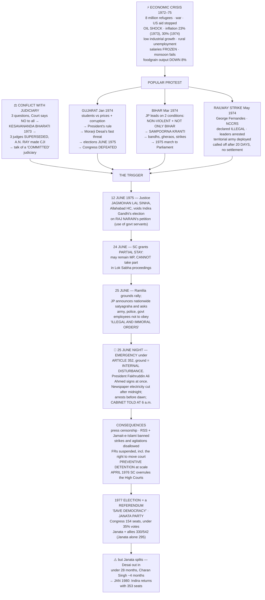
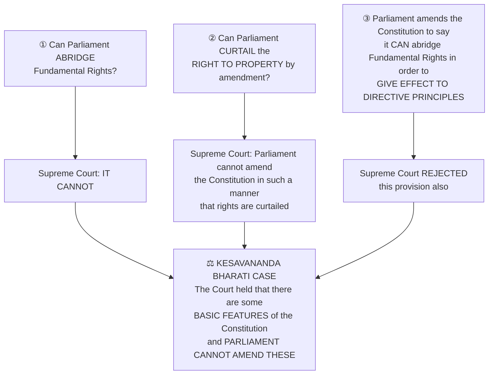
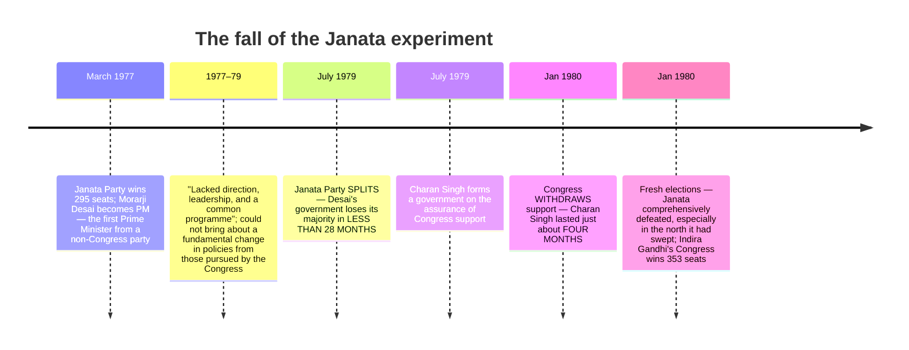

# Chapter 6: The Crisis of Democratic Order

> ⚠️ **Filename note:** the PDF here is named `06_Crisis_of_the_Constitutional_Order.pdf`, but the chapter's real title is **"The Crisis of Democratic Order."** The difference matters — the chapter's own conclusion is that the **political** crisis was *more serious* than the constitutional one.

## 🎯 Chapter Outcome — what you should walk away with

> **The one thing this chapter exists to teach:** the Emergency was **technically within the government's powers** and yet a crisis for democracy — which is why the chapter's verdict is that **"this political crisis was more serious than the constitutional crisis."** A party with an absolute majority chose to suspend the democratic process.

**After reading it, here is what you now understand:**

1. **The economic backdrop** — the Bangladesh crisis (**eight million** across the border), the war, the **US stopping all aid**, the **oil price shock**, inflation of **23% in 1973 and 30% in 1974**, low industrial growth, high rural unemployment, **frozen government salaries**, failed monsoons and an **8% fall in foodgrain output**.
2. **The two movements** — **Gujarat, January 1974** (President's rule → fresh elections in June 1975 → the Congress defeated) and **Bihar, March 1974**, where **JP accepted leadership on two conditions**: the movement must remain **non-violent** and **must not limit itself to Bihar**.
3. **What *Sampoorna Kranti* actually demanded** — dismissal of the Bihar government and **total revolution in the social, economic and political spheres** to establish "true democracy."
4. **The judicial conflict in its three questions** — can Parliament abridge Fundamental Rights? Can it curtail the right to property by amendment? Can it abridge Fundamental Rights to give effect to Directive Principles? **The Court said no to all three** → ***Kesavananda Bharati*** → then the **supersession of three judges to appoint Justice A.N. Ray** → talk of a **"committed" judiciary and bureaucracy**.
5. **The precise legal sequence of June 1975** — **12 June**, Justice **Jagmohan Lal Sinha** of the Allahabad High Court voids her election on **Raj Narain's** petition; **24 June**, the Supreme Court grants a **partial stay** (she may remain an MP but **cannot take part in Lok Sabha proceedings**); **25 June**, the Ramlila Maidan rally and JP's call to the army, police and government employees **not to obey "illegal and immoral orders"**; **that night**, Emergency under **Article 352** on grounds of **internal disturbance**.
6. **How it was done** — the President issued the proclamation immediately, **electricity to major newspaper offices was cut after midnight**, opposition leaders were arrested in the early morning, and **the Cabinet was informed at 6 a.m. on 26 June, after all this had taken place.**
7. **The 1976 habeas corpus ruling** — several High Courts held that courts *could* entertain habeas corpus petitions; **in April 1976 the constitution bench of the Supreme Court over-ruled them**, meaning **the government could take away the citizen's right to life and liberty**. "This judgment closed the doors of judiciary for the citizens."
8. **The three lessons** — it is **extremely difficult to do away with democracy in India**; the ambiguity in the provision has been **rectified** ("internal" emergency now needs **armed rebellion**, and the Cabinet's advice must be **in writing**); and **everyone became more aware of the value of civil liberties.**

**Self-check — answer these three without looking:**
1. On what ground was the Emergency declared, and under which article?
2. What did the Supreme Court decide in April 1976, and why is it called one of its most controversial judgments?
3. Why did the Congress lose the north but sweep the south in 1977?

**Where this leads:** the chapter ends by naming the **tension between institution-based democracy and democracy based on spontaneous popular participation** — which **Ch 7 (Regional Aspirations)** takes up.

---

## 🗺️ The chapter in one picture



---

## The Big Idea

The Congress recovered after 1971 but **"was not the same kind of party"** (Ch 5). The difference became clear in events between **1973 and 1975** that brought new challenges to India's democratic politics **and to the institutional balance sought by the Constitution.**

> ⭐ **The distinction to open with:** "Normally, we would associate 'emergency' with **war and aggression or with natural disaster**. But this 'emergency' was imposed because of the perceived threat of **internal disturbance**."

**The four questions the chapter says remain controversial:** Why was Emergency imposed — and was it necessary? What did it mean in practice? What were its consequences on party politics? What are its lessons?

**The image that opens the chapter:** the editorial page of ***Nai Dunia* of 27 June 1975** was like any other day, **except that the space for the editorial was left blank** — censored using emergency powers. Many other newspapers carried such blank spaces, sometimes to protest. **"Later, leaving blank space was also banned."**

---

## PART 1 — BACKGROUND TO THE EMERGENCY

### The political background
- **Indira Gandhi had emerged as a towering leader with tremendous popularity.**
- **Party competition became bitter and polarised.**
- **Tensions grew between the government and the judiciary**: the Supreme Court found many government initiatives **violative of the Constitution**; the Congress held that this stand was **"against principles of democracy and parliamentary supremacy"**, and alleged that **the Court was a conservative institution becoming an obstacle to pro-poor welfare programmes.**
- The opposition felt **"that politics was becoming too personalised and that governmental authority was being converted into personal authority."**
- **The split in the Congress had sharpened the divisions** between Indira Gandhi and her opponents.

**D.K. Barooah, President of the Congress, 1974** — the slogan that captures the personalisation:
> **"Indira is India, India is Indira"**

### 💸 The economic context

```
   WHY 'GARIBI HATAO' HAD NOT DELIVERED — 1971 to 1975
   ══════════════════════════════════════════════════════════
   Bangladesh crisis     ~8 million people crossed the border
   War with Pakistan     followed
   External aid          the US government STOPPED ALL AID
   Oil                   international prices increased MANIFOLD
   ──────────────────────────────────────────────────────────
   INFLATION      1973  ████████████             23%
                  1974  ███████████████          30%
   ──────────────────────────────────────────────────────────
   Industrial growth     LOW
   Unemployment          VERY HIGH, particularly RURAL
   Govt employees        salaries FROZEN to cut expenditure
                         → further dissatisfaction
   Monsoon 1972–73       FAILED → sharp decline in
                         agricultural productivity
   Foodgrain output      DOWN 8 per cent
   ══════════════════════════════════════════════════════════
```

In this context **non-Congress opposition parties were able to organise popular protests effectively.** Also:
- **Students' unrest**, persisting from the late 1960s, **became more pronounced**.
- There was **an increase in the activities of Marxist groups who did not believe in parliamentary politics** — those who **"had taken to arms and insurgent techniques for the overthrow of the capitalist order and the established political system."** Known as **Marxist-Leninist (now Maoist) groups or Naxalites**, they were **particularly strong in West Bengal, where the State government took stringent measures to suppress them.**

---

## PART 2 — THE GUJARAT AND BIHAR MOVEMENTS

Both were **Congress-ruled States**, and both movements "had far reaching impact on the politics of the two States and national politics."

### 🟠 Gujarat, January 1974

| Stage | What happened |
|---|---|
| **The trigger** | Students started an agitation **against rising prices of food grains, cooking oil and other essential commodities, and against corruption in high places** |
| **Escalation** | The protest was **joined by major opposition parties** and became widespread, **leading to the imposition of President's rule in the state** |
| **The demand** | Opposition parties demanded **fresh elections to the state legislature** |
| **The pressure** | **Morarji Desai** — a prominent leader of **Congress (O)** and Indira Gandhi's main rival from her Congress days — **announced he would go on an indefinite fast if fresh elections were not held** |
| **The outcome** | Under intense pressure, **assembly elections were held in Gujarat in June 1975** — and **the Congress was defeated** |

### 🔴 Bihar, March 1974 — and the arrival of JP

Students came together **to protest against rising prices, food scarcity, unemployment and corruption**. Then:

> ⭐ **"After a point they invited Jayaprakash Narayan (JP), who had given up active politics and was involved in social work, to lead the student movement. He accepted it *on the condition that the movement will remain non-violent and will not limit itself to Bihar*."**

**Those two conditions are the exam point** — they are what turned a state students' agitation into a national political movement: "Thus the students' movement **assumed a political character and had national appeal**. People from all walks of life now entered the movement."

**What JP demanded:**
- **The dismissal of the Congress government in Bihar**, and
- **A call for *total revolution* in the social, economic and political spheres**, in order to establish what he considered **true democracy**.

**A series of bandhs, gheraos and strikes** were organised against the Bihar government. **"The government, however, refused to resign."**

**The slogan of the Bihar movement, 1974:**
> ***"Sampoorna Kranti ab nara hai, bhavi itihas hamara hai"*** — *With Total Revolution as our motto, the future belongs to us.*

**The escalation to national level:**
- JP **wanted to spread the Bihar movement to other parts of the country.**
- Alongside it, **the employees of the Railways gave a call for a nationwide strike**, which **"threatened to paralyse the country."**
- **In 1975, JP led a people's march to the Parliament — "one of the largest political rallies ever held in the capital."**
- He was supported by the non-Congress opposition parties: **the Bharatiya Jana Sangh, the Congress (O), the Bharatiya Lok Dal, the Socialist Party and others** — and **"these parties were projecting JP as an alternative to Indira Gandhi."**

**⚠️ The criticisms — the chapter is even-handed and you should be too:**
- **"There were many criticisms about his ideas and about the politics of mass agitations that he was employing."**
- **Both the Gujarat and Bihar agitations were seen as anti-Congress**, and **"rather than opposing the State governments, they were seen as protests against the leadership of Indira Gandhi."**
- **"She believed that the movement was motivated by personal opposition to her."**

**👤 Loknayak Jayaprakash Narayan (1902–1979):** a **Marxist in his youth**; **founder general secretary of the Congress Socialist Party** and the Socialist Party; **a hero of the 1942 Quit India movement**; **declined to join Nehru's cabinet**; **after 1955 quit active politics**, became a Gandhian and was involved in the **Bhoodan movement**, **negotiations with the Naga rebels**, a **peace initiative in Kashmir**, and **ensured the surrender of dacoits in Chambal**; leader of the Bihar movement, **the symbol of opposition to Emergency**, and **the moving force behind the formation of the Janata Party.**

### 🚂 The Railway Strike of 1974

> **"What would happen when the railways stop running? Not for one or two days, but for more than a week? …the economy of the country would come to a halt because goods are transported from one part to another by trains."**

| | |
|---|---|
| **Who** | The **National Coordination Committee for Railwaymen's Struggle**, led by **George Fernandes** |
| **What** | A call for a **nationwide strike by all employees of the Railways** |
| **The demands** | Related to **bonus and service conditions** — the government was opposed |
| **When** | **May 1974** — "the employees of India's largest public sector undertaking went on strike" |
| **The issues it raised** | It **added to the atmosphere of labour unrest**, and raised **the rights of the workers** and **whether employees of essential services should adopt measures like strikes** |
| **The government's response** | Declared **the strike illegal**; **refused to concede the demands**; **arrested many leaders**; **deployed the territorial army to protect railway tracks** |
| **The outcome** | **Called off after twenty days without any settlement** |

---

## PART 3 — CONFLICT WITH THE JUDICIARY

### The three constitutional questions



*(Cross-reference: Class 11 ICW Ch 6 and Ch 9 cover this same conflict from the constitutional side. Revise them together.)*

### The two developments that raised the temperature further

**1. The supersession of judges, 1973.** Immediately after *Kesavananda Bharati*, a vacancy arose for **Chief Justice of India**. **"It had been a practice to appoint the senior-most judge of the Supreme Court as the Chief Justice. But in 1973, the government set aside the seniority of three judges and appointed Justice A.N. Ray as the Chief Justice of India."**

> ⚠️ **Why it became politically explosive: "all the three judges who were superseded had given rulings against the stand of the government."** Thus **"constitutional interpretations and political ideologies were getting mixed up rapidly."**

**2. The doctrine of "commitment".** People close to the Prime Minister **"started talking of the need for a judiciary and the bureaucracy 'committed' to the vision of the executive and the legislature."**

> 💬 **The margin questions the chapter itself raises, and they are the right ones:** *"Do 'committed judiciary' and 'committed bureaucracy' mean that the judges and government officials should be loyal to the ruling party?"* and *"That is like asking the army to disobey the government! Is that democratic?"*

**3. And "the climax of the confrontation was of course the ruling of the High Court declaring Indira Gandhi's election invalid."**

---

## PART 4 — THE DECLARATION OF EMERGENCY

### ⚖️ The legal trigger

| Date | Event |
|---|---|
| **12 June 1975** | **Justice Jagmohan Lal Sinha of the Allahabad High Court** passed a judgment **declaring Indira Gandhi's election to the Lok Sabha invalid** |
| **The petitioner** | **Raj Narain**, a socialist leader and the candidate who had contested against her in 1971 |
| **The ground** | That **she had used the services of government servants in her election campaign** |
| **What it meant** | **Legally she was no more an MP**, and therefore **could not remain Prime Minister unless re-elected as an MP within six months** |
| **24 June 1975** | The **Supreme Court granted a partial stay** — till her appeal was decided **she could remain an MP but could not take part in the proceedings of the Lok Sabha** |

### The crisis and the response

**25 June 1975:**
- The opposition parties **led by Jayaprakash Narayan pressed for Indira Gandhi's resignation** and organised **a massive demonstration in Delhi's Ramlila grounds.**
- **JP announced a nationwide satyagraha for her resignation** and **asked the army, the police and government employees not to obey "illegal and immoral orders."**
- **"This too threatened to bring the activities of the government to a standstill."**
- **"The political mood of the country had turned against the Congress, more than ever before."**

**The government's response: a state of emergency.**
- On **25 June 1975** the government declared that **there was a threat of internal disturbances** and invoked **Article 352**, under which emergency may be declared on grounds of **external threat or a threat of internal disturbances**.
- **⚠️ "Technically speaking this was within the powers of the government"** — the Constitution provides special powers once an emergency is declared. *(Hold on to this; it is the basis of the chapter's final verdict.)*

**What an Emergency does, constitutionally:**
1. **The federal distribution of powers remains practically suspended** and **all powers are concentrated in the hands of the union government.**
2. **The government gets the power to curtail or restrict all or any of the Fundamental Rights.**

**The reasoning behind such wide powers:** "From the wording of the provisions… it is clear that an Emergency is seen as **an extraordinary condition in which normal democratic politics cannot function.** Therefore, special powers are granted."

### 🌑 How it was actually done — the sequence of that night

```
   NIGHT OF 25 JUNE 1975
   ──────────────────────────────────────────────────────────
   ①  The Prime Minister recommends Emergency to
      PRESIDENT FAKHRUDDIN ALI AHMED
   ②  He issues the proclamation IMMEDIATELY
   ③  AFTER MIDNIGHT — electricity to all the major
      NEWSPAPER OFFICES is disconnected
   ④  EARLY MORNING — a large number of leaders and
      workers of the opposition parties are ARRESTED
   ⑤  6 a.m., 26 JUNE — the CABINET is informed at a
      special meeting, ⚠️ AFTER ALL THIS HAD TAKEN PLACE
   ──────────────────────────────────────────────────────────
```

> 💬 **The margin question, which is also exercise-worthy:** *"Should the President have declared Emergency without any recommendation from the Cabinet?"* — This is precisely the ambiguity later rectified: the advice must now be given **in writing by the Union Cabinet.**

---

## PART 5 — CONSEQUENCES

### What was done

| Measure | Detail |
|---|---|
| **Agitation stopped** | "This brought the agitation to an abrupt stop"; **strikes were banned**; **many opposition leaders were put in jail**; the political situation became **"very quiet though tense"** |
| **Press censorship** | The **freedom of the Press was suspended**; **newspapers had to get prior approval for all material to be published** |
| **Organisations banned** | **"Apprehending social and communal disharmony"**, the government banned the **Rashtriya Swayamsevak Sangh (RSS)** and **Jamait-e-Islami** |
| **Protest disallowed** | **Protests, strikes and public agitations** |
| **⚠️ Fundamental Rights** | **"Most importantly… the various Fundamental Rights of citizens stood suspended, including the right of citizens to move the Court for restoring their Fundamental Rights"** |
| **Preventive detention** | Used extensively — people are **"arrested and detained not because they have committed any offence, but on the apprehension that they may commit an offence."** Large-scale arrests followed |

### ⚖️ The habeas corpus ruling of April 1976

- **Arrested political workers could not challenge their arrest through habeas corpus petitions.**
- Many cases were filed in the High Courts and the Supreme Court, **but the government claimed it was not even necessary to inform arrested persons of the reasons and grounds of their arrest.**
- **Several High Courts gave judgments that even after the declaration of Emergency the courts could entertain a writ of habeas corpus** challenging a detention.
- **⚠️ "In April 1976, the constitution bench of the Supreme Court over-ruled the High Courts and accepted the government's plea."**

> ⭐⭐ **"It meant that during Emergency the government could take away the citizen's right to life and liberty. This judgment closed the doors of judiciary for the citizens and is regarded as *one of the most controversial judgments of the Supreme Court*."**

### ✊ Dissent and resistance — "such open acts of defiance and resistance were rare"

The chapter is careful to record both the resistance and its limits:

- **Many political workers not arrested in the first wave went "underground"** and organised protests.
- **Newspapers like the *Indian Express* and the *Statesman* protested against censorship by leaving blank spaces** where news items had been censored.
- **Magazines like *Seminar* and *Mainstream* chose to close down rather than submit to censorship.**
- **Many journalists were arrested for writing against the Emergency.**
- **Many underground newsletters and leaflets were published to bypass censorship.**
- **Kannada writer Shivarama Karanth** (Padma Bhushan) and **Hindi writer Fanishwarnath Renu** (Padma Shri) **returned their awards in protest against the suspension of democracy.**
- **⚠️ "By and large, though, such open acts of defiance and resistance were rare."**

> 💬 **The margin question that should trouble you, because the chapter means it to:** *"Let us not talk about the few who protested. What about the rest? All the big officials, intellectuals, social and religious leaders, citizens… What were they doing?"*

**Two famous protest texts to know:**
- An **anonymous advertisement in the *Times of India*** soon after the declaration: **"…death of D.E.M. O'Cracy, mourned by his wife T. Ruth, his son L.I. Bertie, and his daughters Faith, Hope and Justice."**
- An advertisement in ***The Times*, London, 15 August 1975**, by the **'Free JP Campaign'**: **"Today is India's Independence Day… Don't Let the Lights Go Out on India's Democracy."**

### 📜 Constitutional changes during the Emergency

1. **In the background of the Allahabad High Court ruling**, an amendment declared that **elections of the Prime Minister, President and Vice-President could not be challenged in Court.**
2. **The 42nd Amendment** was passed during the Emergency — "a series of changes in many parts of the Constitution." Among them: **the duration of legislatures was extended from five to six years**, and **"this change was not only for the Emergency period, but was intended to be of a permanent nature."**
3. Besides this, **during an Emergency elections can be postponed by one year**.

> ⚠️ **The arithmetic that shows the intent:** "Thus, effectively, **after 1971, elections needed to be held only in 1978; instead of 1976.**"

---

## PART 6 — THE LESSONS OF THE EMERGENCY

> **"The Emergency at once brought out both the weaknesses and the strengths of India's democracy."**

### ✅ The three lessons

| # | Lesson |
|---|---|
| **1** | Though many observers think **India ceased to be democratic during the Emergency**, **"normal democratic functioning resumed within a short span of time."** ⇒ **"one lesson of Emergency is that it is extremely difficult to do away with democracy in India."** |
| **2** | It **brought out ambiguities in the Emergency provision that have since been rectified.** Now, **"'internal' Emergency can be proclaimed only on the grounds of 'armed rebellion'"**, and **"the advice to the President to proclaim Emergency must be given in writing by the Union Cabinet."** *(The 44th Amendment, 1978.)* |
| **3** | It **made everyone more aware of the value of civil liberties.** **"The Courts too have taken an active role after the Emergency in protecting the civil liberties of individuals"** — a response to **"the inability of the judiciary to protect civil liberties effectively during the emergency"** — and **many civil liberties organisations came up after this experience.** |

### ⚠️ The two unresolved issues

**1. Protest versus routine government.** "There is a tension between **routine functioning of a democratic government** and **continuous political protests by parties and groups**. **What is the correct balance between the two?** Should citizens have full freedom to engage in protest activity or should they have no such right at all? **What are the limits to such a protest?**"

**2. The police and the administration.** The Emergency was implemented **through the police and the administration**, and **"these institutions could not function independently. They were turned into political instruments of the ruling party."** According to the **Shah Commission Report**, **"the administration and the police became vulnerable to political pressures."** And crucially: **"This problem did not vanish after the Emergency."**

---

## PART 7 — POLITICS AFTER THE EMERGENCY

### 🗳️ The 1977 election as a referendum

**In January 1977, after eighteen months of Emergency, the government decided to hold elections.** All leaders and activists were released from jails; **elections were held in March 1977.**

**"This left the opposition with very little time, but political developments took place very rapidly":**
- The major opposition parties **had already been coming closer in the pre-Emergency period.**
- **They came together on the eve of the elections and formed a new party, the Janata Party**, which **accepted the leadership of Jayaprakash Narayan.**
- **Some Congress leaders opposed to the Emergency also joined.**
- **Other Congress leaders formed a separate party under Jagjivan Ram — the Congress for Democracy — which later merged with the Janata Party.**

**The campaign:** the Janata Party made the election **a referendum on the Emergency**, focusing on **the non-democratic character of the rule and the various excesses.** Against the backdrop of **arrests of thousands and press censorship**, public opinion was against the Congress; **JP became the popular symbol of the restoration of democracy**; and **the formation of the Janata Party ensured that non-Congress votes would not be divided.**

**The opposition's slogan: "save democracy."**

### 📊 The result

```
   LOK SABHA, MARCH 1977
   ═══════════════════════════════════════════════════════
   Janata Party + allies   330 of 542 seats  ████████████
     (Janata Party alone)  295 seats — a clear majority
   Congress                154 seats         █████
     share of votes        under 35%
   ═══════════════════════════════════════════════════════
   ⭐ For the FIRST TIME since Independence, the Congress
      party was defeated in the Lok Sabha elections.
```

**In north India it was "a massive electoral wave against the Congress":**
- The Congress **lost in every constituency in Bihar, Uttar Pradesh, Delhi, Haryana and Punjab.**
- It **won only one seat each in Rajasthan and Madhya Pradesh.**
- **Indira Gandhi was defeated from Rae Bareli**, and **her son Sanjay Gandhi from Amethi.**

### 🧭 …but not everywhere — the north/south divide

**"Congress did not lose elections all over the country. It retained many seats in Maharashtra, Gujarat and Orissa and virtually swept through the southern States."**

**Two reasons the chapter gives, and you need both:**
1. **The impact of Emergency was not felt equally in all the States.** **"The forced relocation and displacements, the forced sterilisations, were mostly concentrated in the northern States."**
2. **⭐ More importantly, "north India had experienced some long term changes in the nature of political competition. The middle castes from north India were beginning to move away from the Congress and the Janata party became a platform for many of these sections to come together."**

> ⭐ **Hence the chapter's own caution: "In this sense, the elections of 1977 were *not merely about the Emergency*."**

### ⚔️ The Janata government — and its collapse

**"The Janata Party government that came to power after the 1977 elections was far from cohesive."**

**Three leaders competed stiffly for Prime Minister:**

| Leader | Standing |
|---|---|
| **Morarji Desai** | Indira Gandhi's rival ever since **1966–67** |
| **Charan Singh** | Leader of the **Bharatiya Lok Dal** and **a farmers' leader from UP** |
| **Jagjivan Ram** | **Vast experience as a senior minister** in Congress governments |

**Morarji Desai became Prime Minister, "but that did not bring the power struggle within the party to an end."**



> ⭐ **The second lesson in democratic politics, alongside the first:**
> - From 1977: **"governments that are perceived to be anti-democratic are severely punished by the voters."**
> - From 1977–79: **"governments that are seen to be unstable and quarrelsome are severely punished by the voters."**

**👤 Morarji Desai (1896–1995):** freedom fighter; a Gandhian leader; **proponent of khadi, naturopathy and prohibition**; Chief Minister of Bombay State; **Deputy Prime Minister 1967–1969**; joined **Congress (O)** after the split; **Prime Minister 1977–1979 — the first Prime Minister belonging to a non-Congress party.**

**👤 Chaudhary Charan Singh (1902–1987):** **Prime Minister July 1979 – January 1980**; freedom fighter; active in UP politics; **proponent of rural and agricultural development**; **left the Congress and founded the Bharatiya Kranti Dal in 1967**; **twice Chief Minister of U.P.**; one of the founders of the Janata Party in 1977 and **Deputy Prime Minister and Home Minister 1977–79**; **founder of Lok Dal.**

**👤 Jagjivan Ram (1908–1986):** freedom fighter and Congress leader from Bihar; **Deputy Prime Minister 1977–79**; member of the Constituent Assembly; **MP from 1952 till his death**; **Labour Minister in the first ministry of free India**; held various other ministries 1952–1977; **a scholar and astute administrator.**

---

## PART 8 — THE LEGACY

**"But was it only a case of return of Indira Gandhi? Between the elections of 1977 and 1980 the party system had changed dramatically."**

### How the party system changed

1. **Since 1969 the Congress had been shedding its character as an umbrella party** which accommodated leaders and workers of different ideological dispensations and viewpoints.
2. **It now identified itself with a particular ideology, claiming to be the only socialist and pro-poor party.**
3. **⭐ "Thus with the early nineteen seventies, the Congress's political success depended on attracting people on the basis of *sharp social and ideological divisions* and *the appeal of one leader*, Indira Gandhi."**
4. With that change, **other opposition parties relied more and more on "non-Congressism"** and **"realised the need to avoid a division of non-Congress votes"** — the factor that decided 1977.

### 🌾 The rise of backward-caste politics

> **"In an indirect manner the issue of welfare of the backward castes also began to dominate politics since 1977."**

- The 1977 results were **at least partly due to a shift among the backward castes of north India.**
- Following the Lok Sabha elections, many states held **Assembly elections in 1977**; **the northern States elected non-Congress governments in which the leaders of the backward castes played an important role.**
- **The issue of reservations for "other backward classes" became very controversial in Bihar**, and following this **the Mandal Commission was appointed by the Janata Party government at the Centre.** *(Ch 8.)*

> **"The elections after the Emergency set off the process of this change in the party system."**

### ⭐⭐ The chapter's final verdict — learn this framing

> **The Emergency "can be described as a period of *constitutional crisis*, because it had its origins in the constitutional battle over the jurisdiction of the Parliament and the judiciary. On the other hand, it was also a period of *political crisis*. The party in power had absolute majority and yet, its leadership decided to suspend the democratic process."**
>
> **"The makers of India's Constitution trusted that all political parties would basically abide by the democratic norm… This expectation led to the wide and open-ended powers given to the government in times of Emergency. These were abused during the Emergency.**
>
> ***This political crisis was more serious than the constitutional crisis.***"

**And the question handed on to Chapter 7:**
> **"Another critical issue… was the role and extent of mass protests in a parliamentary democracy. There was clearly a tension between *institution-based democracy* and *democracy based on spontaneous popular participation*. This tension may be attributed to the inability of the party system to incorporate the aspirations of the people."**

**🎬 *Hazaron Khwaishein Aisi* (2005)** — director and screenplay **Sudhir Mishra** (with Ruchi Narain and Shivkumar Subramaniam); cast **Kay Kay Menon, Shiney Ahuja, Chitrangada Singh**. **Siddharth, Vikram and Geeta** are three "spirited and socially engaged students" who graduate from Delhi and follow different paths — **Siddharth a strong supporter of the revolutionary ideology of social transformation; Vikram in favour of success in life whatever the cost.** Set in the seventies, the characters are **"products of the expectations and idealism of that period"**: Siddharth fails to stage a revolution but becomes **so involved in the plight of the poor that he begins valuing their uplift more than revolution**, while **Vikram becomes a typical political fixer but is constantly ill at ease.**

> 💬 **And the margin comment that is the best one-line summary of the whole chapter:** *"Emergency was like a vaccination against dictatorship. It was painful and caused fever, but strengthened the resistance of our democracy."*

---

## Key Words (Glossary)

| Term | Meaning |
|---|---|
| **Emergency (Article 352)** | Declarable on **external threat or internal disturbance**; suspends the federal distribution of powers and allows curtailment of **all or any Fundamental Rights** |
| **Internal disturbance** | The stated ground in 1975 — **since rectified**, so an internal emergency now requires **"armed rebellion"** |
| ***Sampoorna Kranti*** | **Total Revolution** — JP's call for change in the **social, economic and political** spheres to establish true democracy |
| **Press censorship** | Newspapers required to obtain **prior approval for all material** to be published |
| **Preventive detention** | Arrest **not for an offence committed** but on the apprehension that one **may** be committed |
| ***Habeas corpus*** | The writ challenging unlawful detention — the **April 1976 Supreme Court ruling** held it unavailable during Emergency |
| **"Committed" judiciary/bureaucracy** | The demand, voiced by people close to the Prime Minister, that judges and officials be committed **to the vision of the executive and the legislature** |
| **Supersession of judges** | The **1973** appointment of **Justice A.N. Ray** as CJI over **three senior judges**, all of whom **had ruled against the government** |
| **42nd Amendment** | Passed during the Emergency; among many changes, **extended legislatures from five to six years, permanently** |
| **Shah Commission** | Appointed by the Janata government in 1977 to inquire into Emergency excesses; found that **the administration and the police became vulnerable to political pressures** |
| **Janata Party** | Formed on the eve of the 1977 elections by the merged opposition, accepting **JP's leadership**; ensured non-Congress votes **were not divided** |
| **Congress for Democracy** | The party formed by **Jagjivan Ram** with other Congress leaders, later **merged with the Janata Party** |

---

## Quick Recap (16 points)

1. This Emergency was imposed **not for war or disaster but for a perceived threat of internal disturbance** — and ended as dramatically as it began.
2. **Background:** a towering, popular Indira Gandhi; bitter, polarised party competition; **the Congress alleging the Court was conservative and obstructing pro-poor programmes**; the opposition alleging **governmental authority was becoming personal authority**. **D.K. Barooah: "Indira is India, India is Indira."**
3. **Economic crisis:** ~8 million refugees, war, **US aid stopped**, oil prices up manifold, inflation **23% (1973) and 30% (1974)**, low industrial growth, high rural unemployment, **frozen government salaries**, failed monsoons, **foodgrain output down 8%**. Plus **Naxalite/Marxist-Leninist activity, strongest in West Bengal**.
4. **Gujarat, Jan 1974:** students against prices and corruption → opposition joins → **President's rule** → **Morarji Desai's indefinite-fast threat** → **elections June 1975** → **Congress defeated**.
5. **Bihar, Mar 1974:** students invite **JP**, who accepts on **two conditions — non-violent, and not limited to Bihar**; demands dismissal of the Bihar government and **total revolution**; **bandhs, gheraos, strikes**; **the 1975 people's march to Parliament, one of the largest rallies ever in the capital**.
6. **Criticism recorded by the chapter:** both agitations were seen as **anti-Congress protests against Indira Gandhi's leadership** rather than against the State governments, and there were **criticisms of JP's ideas and of mass-agitation politics**.
7. **Railway strike, May 1974:** **George Fernandes**, the **National Coordination Committee for Railwaymen's Struggle**, demands on **bonus and service conditions**; declared **illegal**; leaders arrested; **territorial army deployed**; **called off after twenty days without settlement**.
8. **Judicial conflict — three questions, all answered against the government**, culminating in ***Kesavananda Bharati*** and **basic features**. Then the **1973 supersession of three judges to appoint A.N. Ray**, all three having ruled against the government — and talk of a **"committed" judiciary and bureaucracy**.
9. **12 June 1975:** **Justice Jagmohan Lal Sinha**, Allahabad HC, voids her election on **Raj Narain's** petition (**use of government servants**). **24 June:** SC **partial stay** — MP yes, **Lok Sabha proceedings no**.
10. **25 June:** Ramlila grounds rally; **JP's nationwide satyagraha** and the call to the **army, police and government employees not to obey "illegal and immoral orders."** That night: **Emergency under Article 352, ground = internal disturbance.**
11. **The sequence:** President **Fakhruddin Ali Ahmed** signs immediately → **newspaper electricity cut after midnight** → **arrests before dawn** → **Cabinet informed at 6 a.m. on 26 June**.
12. **Consequences:** strikes banned; leaders jailed; **press censorship with prior approval**; **RSS and Jamait-e-Islami banned**; **Fundamental Rights suspended including the right to move the Court**; **preventive detention at scale**; and in **April 1976 the SC's constitution bench overruled the High Courts on habeas corpus** — "closed the doors of judiciary for the citizens."
13. **Resistance existed but was rare:** underground organising; ***Indian Express* and *Statesman* leaving blank spaces**; ***Seminar* and *Mainstream* closing down**; journalists arrested; **Shivarama Karanth and Fanishwarnath Renu returned their awards**.
14. **Constitutional changes:** elections of PM/President/Vice-President made **unchallengeable in court**; the **42nd Amendment**, extending legislatures **from five to six years permanently** — so elections would be due only in **1978 instead of 1976**.
15. **Three lessons:** it is **extremely difficult to do away with democracy in India**; the provision has been **rectified** (internal emergency now needs **armed rebellion**; Cabinet advice must be **in writing**); and **awareness of civil liberties grew**, with courts more active and **civil liberties organisations** founded. **Two unresolved issues:** the **balance between protest and routine government**, and the **politicisation of the police and administration**, which "did not vanish after the Emergency."
16. **1977:** Janata Party under JP's leadership; **Congress for Democracy** under Jagjivan Ram merges in; slogan **"save democracy"**; **Congress 154 seats, under 35% votes; Janata + allies 330/542, Janata alone 295**; **Indira lost Rae Bareli, Sanjay lost Amethi** — **but the Congress swept the south**, because **Emergency excesses were concentrated in the north** and **north Indian middle castes were shifting away from the Congress**. Then **Janata splits — Desai under 28 months, Charan Singh about four** → **January 1980, Indira returns with 353 seats**. Legacy: **non-Congressism**, and the rise of **backward-caste politics**, leading to the **Mandal Commission**.

---

## 60-Second Revision

**Emergency for INTERNAL DISTURBANCE, not war/disaster. *Nai Dunia* 27 June 1975 = BLANK editorial; blank spaces later BANNED.** **BACKGROUND: personalised politics; Congress says the Court is CONSERVATIVE and obstructs pro-poor programmes; opposition says governmental authority is becoming PERSONAL authority. BAROOAH: "INDIRA IS INDIA, INDIA IS INDIRA."** **ECONOMY: 8 MILLION refugees, war, US STOPPED ALL AID, oil prices up manifold, INFLATION 23% (1973) / 30% (1974), low industrial growth, high rural unemployment, SALARIES FROZEN, monsoon failed 1972-73, FOODGRAIN OUTPUT DOWN 8%. Naxalites/M-L groups strongest in WEST BENGAL.** **GUJARAT JAN 1974: students vs prices + corruption → President's rule → MORARJI DESAI indefinite-fast threat → elections JUNE 1975 → CONGRESS DEFEATED.** **BIHAR MAR 1974: students invite JP; he accepts on TWO CONDITIONS — NON-VIOLENT + NOT ONLY BIHAR → dismissal of Bihar govt + TOTAL REVOLUTION in social/economic/political spheres; bandhs, gheraos, strikes; 1975 MARCH TO PARLIAMENT = one of the largest rallies ever in the capital. Slogan: "SAMPOORNA KRANTI ab nara hai, bhavi itihas hamara hai."** **RAILWAY STRIKE MAY 1974: GEORGE FERNANDES, NCC for Railwaymen's Struggle; bonus + service conditions; declared ILLEGAL, leaders arrested, TERRITORIAL ARMY deployed; CALLED OFF AFTER 20 DAYS, NO SETTLEMENT.** **JUDICIARY — 3 questions, all NO: (1) can Parliament abridge FRs? (2) can it curtail the right to property by amendment? (3) can it abridge FRs to give effect to DPSP? → KESAVANANDA BHARATI = BASIC FEATURES. Then 1973 SUPERSESSION of THREE judges → JUSTICE A.N. RAY made CJI (all three superseded had ruled AGAINST the govt) → demand for a "COMMITTED" judiciary and bureaucracy.** **12 JUNE 1975: JUSTICE JAGMOHAN LAL SINHA, Allahabad HC, VOIDS her election on RAJ NARAIN's petition — ground: USE OF GOVERNMENT SERVANTS. 24 JUNE: SC PARTIAL STAY — remain MP, but NO Lok Sabha proceedings.** **25 JUNE: RAMLILA GROUNDS; JP's nationwide SATYAGRAHA + army/police/employees not to obey "ILLEGAL AND IMMORAL ORDERS." THAT NIGHT: ARTICLE 352, ground INTERNAL DISTURBANCE. President FAKHRUDDIN ALI AHMED signs at once → newspaper ELECTRICITY CUT after midnight → arrests before dawn → CABINET TOLD 6 a.m., 26 JUNE.** **EFFECT of Emergency: federal distribution PRACTICALLY SUSPENDED, all power to the Union; power to curtail ALL OR ANY FRs.** **CONSEQUENCES: strikes banned, leaders jailed, PRESS CENSORSHIP (prior approval), RSS + JAMAIT-E-ISLAMI banned, FRs SUSPENDED INCLUDING THE RIGHT TO MOVE THE COURT, PREVENTIVE DETENTION at scale. APRIL 1976: SC CONSTITUTION BENCH OVERRULES the High Courts on habeas corpus ⇒ govt could take away the right to LIFE AND LIBERTY — "closed the doors of judiciary for the citizens", one of the MOST CONTROVERSIAL judgments.** **RESISTANCE (but "such open acts… were RARE"): underground work; INDIAN EXPRESS + STATESMAN left BLANK SPACES; SEMINAR + MAINSTREAM CLOSED DOWN; journalists arrested; SHIVARAMA KARANTH (Padma Bhushan) + FANISHWARNATH RENU (Padma Shri) RETURNED AWARDS. "Death of D.E.M. O'Cracy… wife T. Ruth, son L.I. Bertie, daughters Faith, Hope and Justice." Free JP Campaign, *The Times* London, 15 Aug 1975.** **AMENDMENTS: elections of PM/President/VP made UNCHALLENGEABLE; 42nd AMENDMENT — legislatures 5 → 6 YEARS, PERMANENTLY; + elections postponable by 1 year in Emergency ⇒ next election due 1978 instead of 1976.** **THREE LESSONS: (1) "extremely difficult to do away with democracy in India"; (2) rectified — internal Emergency now needs "ARMED REBELLION" and Cabinet advice must be IN WRITING; (3) awareness of CIVIL LIBERTIES; courts more active; civil liberties organisations founded. UNRESOLVED: balance between protest and routine government; and POLICE + ADMINISTRATION as political instruments (SHAH COMMISSION: "vulnerable to political pressures") — "did not vanish after the Emergency."** **1977: elections announced JAN, held MARCH; JANATA PARTY under JP; JAGJIVAN RAM's CONGRESS FOR DEMOCRACY merges; slogan "SAVE DEMOCRACY"; non-Congress votes NOT DIVIDED. RESULT: CONGRESS 154 seats, <35% votes — FIRST EVER Lok Sabha defeat; JANATA + allies 330/542, JANATA ALONE 295. Lost EVERY seat in Bihar, UP, Delhi, Haryana, Punjab; ONE each in Rajasthan and MP. INDIRA lost RAE BARELI, SANJAY lost AMETHI. ⚠️ BUT swept the SOUTH + held Maharashtra, Gujarat, Orissa — because excesses (forced relocation, FORCED STERILISATION) were concentrated in the NORTH, and north Indian MIDDLE CASTES were shifting away ⇒ "the elections of 1977 were NOT MERELY ABOUT THE EMERGENCY."** **JANATA: three-way race — MORARJI DESAI vs CHARAN SINGH (BLD, farmers' leader) vs JAGJIVAN RAM. Desai PM (first non-Congress PM) but "lacked direction, leadership, and a common programme"; split, lost majority in UNDER 28 MONTHS; CHARAN SINGH govt on Congress assurance, lasted ~4 MONTHS. JAN 1980: Indira returns with 353 SEATS.** **TWO VOTER LESSONS: anti-democratic governments are severely punished (1977); UNSTABLE AND QUARRELSOME governments are severely punished (1980).** **LEGACY: Congress stopped being an UMBRELLA party, now claimed to be the ONLY socialist and pro-poor party, depending on SHARP SOCIAL/IDEOLOGICAL DIVISIONS + ONE LEADER. Backward-caste welfare begins to dominate from 1977 → OBC reservation controversy in BIHAR → MANDAL COMMISSION appointed by the Janata govt.** **⭐ FINAL VERDICT: a CONSTITUTIONAL crisis (Parliament vs judiciary) AND a POLITICAL crisis — "the party in power had absolute majority and yet its leadership decided to SUSPEND the democratic process"; the makers TRUSTED parties would abide by democratic norms, which is why powers were WIDE AND OPEN-ENDED. "THIS POLITICAL CRISIS WAS MORE SERIOUS THAN THE CONSTITUTIONAL CRISIS." Open question → tension between INSTITUTION-BASED democracy and democracy based on SPONTANEOUS POPULAR PARTICIPATION. Film: *HAZARON KHWAISHEIN AISI* 2005, Sudhir Mishra.**

---

## NCERT Exercises — with answers

**1. Correct or incorrect?**
**(a) It was declared in 1975 by Indira Gandhi — CORRECT** (recommended by her; proclaimed by President Fakhruddin Ali Ahmed on 25 June 1975).
**(b) It led to the suspension of all fundamental rights — CORRECT in substance.** The chapter states that **"the various Fundamental Rights of citizens stood suspended, including the right of citizens to move the Court for restoring their Fundamental Rights"**, and the April 1976 ruling meant even **life and liberty** could be taken away.
**(c) It was proclaimed due to the deteriorating economic conditions — INCORRECT.** The declared ground was **a threat of internal disturbance** under Article 352. Economic conditions were part of the *background*, not the stated reason.
**(d) Many Opposition leaders were arrested during the emergency — CORRECT.** A large number were arrested in the early morning of 26 June, before the Cabinet was even informed.
**(e) CPI supported the proclamation of the Emergency — CORRECT.** The CPI was allied with Congress(R) from 1969 and supported the proclamation — a position it later described as a mistake. *(Note that its rival, the CPI(M), opposed it.)*

**2. Find the odd one out.**
**(e) The findings of the Shah Commission Report.** Every other item — the call for Total Revolution, the Railway Strike of 1974, the Naxalite movement and the Allahabad High Court verdict — **preceded and contributed to** the proclamation. The Shah Commission was appointed **afterwards, in 1977**, to *inquire into* the Emergency.

**3. Match the following.**

| | |
|---|---|
| (a) **Total Revolution** | **(ii) Jayaprakash Narayan** |
| (b) **Garibi hatao** | **(i) Indira Gandhi** |
| (c) **Students' Protest** | **(iii) Bihar Movement** |
| (d) **Railway Strike** | **(iv) George Fernandes** |

**4. Reasons for the mid-term elections of 1980.**
The Janata Party **"was far from cohesive"** from the start, having been assembled on the eve of the 1977 election out of parties that agreed on nothing except opposition to the Emergency. Its critics held that it **"lacked direction, leadership, and a common programme"**, and it **"could not bring about a fundamental change in policies from those pursued by the Congress."** The unresolved **three-way contest for Prime Minister** — Morarji Desai, Charan Singh and Jagjivan Ram — continued after Desai took office. **The party split and the Desai government lost its majority in less than 28 months.** A second government under **Charan Singh** was formed **on the assurance of Congress support**, but **the Congress withdrew that support**, and it survived **only about four months** — without ever facing Parliament with a majority. With no alternative government possible, **fresh elections were held in January 1980**, at which the Janata Party was comprehensively defeated and **Indira Gandhi's Congress returned with 353 seats.**

**5. The Shah Commission — why appointed, and what it found.**
**Why:** it was appointed **in 1977 by the Janata Party government** to inquire into **the circumstances of the declaration of the Emergency and the excesses committed during it** — the mass arrests and preventive detentions, press censorship, and the coercive programmes of forced relocation, displacement and sterilisation.
**What it found:** the finding the chapter itself carries forward is institutional and is the one to quote — **the Emergency was implemented through the police and the administration, and these institutions "could not function independently. They were turned into political instruments of the ruling party"; "the administration and the police became vulnerable to political pressures."** The Commission also documented that the excesses were **not authorised by law** but carried out on informal instruction. **⚠️ And the chapter's sting: "This problem did not vanish after the Emergency."**

**6. What reasons did the Government give for declaring the Emergency?**
The government declared that **there was a threat of internal disturbances**, and invoked **Article 352**, under which an emergency may be proclaimed on grounds of **external threat or a threat of internal disturbance**. It argued that **"a grave crisis had arisen"** which made the proclamation necessary. In substance the government pointed to: **the nationwide satyagraha announced by JP demanding the Prime Minister's resignation**; his call to **the army, the police and government employees not to obey "illegal and immoral orders"**, which **"threatened to bring the activities of the government to a standstill"**; the **continuing agitations in Gujarat and Bihar**; and the **railway strike** which had threatened to paralyse the economy. **Technically this was within the powers of the government** — which is exactly why the chapter treats the crisis as political rather than merely legal.

**7. Reasons the Opposition came to power for the first time in 1977.**
1. **The election became a referendum on the Emergency.** The Janata campaign focused on **"the non-democratic character of the rule and the various excesses"**, against a backdrop of **thousands arrested and the press censored**; the opposition's slogan was **"save democracy."**
2. **Opposition unity ended vote-splitting.** The formation of the **Janata Party** — joined by Congress dissidents and merged with Jagjivan Ram's **Congress for Democracy** — **"ensured that non-Congress votes would not be divided"**, removing the FPTP advantage that had sustained Congress dominance since 1952.
3. **A credible symbol.** **"Jayaprakash Narayan became the popular symbol of restoration of democracy"**, giving the alliance the moral authority its 1971 predecessor had lacked.
4. **The specific excesses in the north** — **forced relocation, displacement and sterilisation**, concentrated in the northern States — produced a **massive electoral wave**: every seat lost in Bihar, UP, Delhi, Haryana and Punjab, and **Indira Gandhi and Sanjay Gandhi personally defeated.**
5. **A longer-term social shift**, which the chapter stresses: **"the middle castes from north India were beginning to move away from the Congress and the Janata party became a platform for many of these sections to come together"** — so 1977 was **"not merely about the Emergency."**

**8. Effects of the Emergency on four aspects of the polity.**
**Civil liberties.** Fundamental Rights **stood suspended, including the right to move the Court to enforce them**; **preventive detention** was used for large-scale arrests, with the government claiming it need not even **inform detainees of the grounds of arrest**. The long-run effect was the opposite of the intent: **"the Emergency made everyone more aware of the value of civil liberties"**, and **many civil liberties organisations came up after this experience.**
**Executive–judiciary relations.** The conflict predated the Emergency — **three rulings against the government, *Kesavananda Bharati*, and then the supersession of three judges to appoint A.N. Ray** — and hardened into the demand for a **"committed" judiciary**. During the Emergency the judiciary's low point came in **April 1976**, when the **Supreme Court's constitution bench overruled several High Courts** and held habeas corpus unavailable, **"closing the doors of judiciary for the citizens."** Afterwards the balance swung back: **"the Courts too have taken an active role after the Emergency in protecting the civil liberties of individuals"** — the origin of the PIL era.
**Mass media.** **Press freedom was suspended and prior approval required for all material** — censorship. Newspapers protested by **leaving blank spaces**, until that too was banned; ***Seminar* and *Mainstream* closed down rather than submit**; **journalists were arrested**; and **underground newsletters and leaflets** circulated to bypass censorship.
**Police and bureaucracy.** They became **the instruments through which the Emergency was implemented**, and **"could not function independently… they were turned into political instruments of the ruling party."** The **Shah Commission** found them **"vulnerable to political pressures"** — and the chapter's warning is that **this problem did not disappear afterwards.**

**9. How the Emergency affected the party system.**
1. **It completed the transformation of the Congress.** Already since 1969 the party had been **shedding its umbrella character**; it now **"identified itself with a particular ideology, claiming to be the only socialist and pro-poor party"**, depending on **sharp social and ideological divisions and the appeal of one leader.**
2. **It forced the opposition to consolidate.** Non-Congressism had failed as a loose alliance in 1971; after the Emergency it took the harder form of an actual **merger into the Janata Party**, absorbing the Jana Sangh, Congress (O), Bharatiya Lok Dal and Socialists, plus **Jagjivan Ram's Congress for Democracy**.
3. **It ended one-party dominance at the Centre** — for the first time since Independence the Congress lost, and **the first non-Congress Prime Minister** took office.
4. **It demonstrated the cost of coalitions without programme.** The Janata Party's collapse **within 28 months** taught the second voter lesson, that **unstable and quarrelsome governments are punished** — which returned Indira Gandhi in 1980 with 353 seats.
5. **⭐ It opened the era of backward-caste politics.** The 1977 shift among **north Indian middle castes**, the non-Congress State governments elected that year **in which backward-caste leaders played an important role**, the **OBC reservation controversy in Bihar**, and the consequent appointment of the **Mandal Commission** by the Janata government — **"the elections after the Emergency set off the process of this change in the party system."**

**10. Partha Chatterjee (citing Butler, Lahiri and Roy) on the near-two-party system of 1977.**
**(a) What made it look like a two-party system.** For the only time in Indian history, the contest was **a straight national fight between two blocs** — the Congress on one side and the **Janata Party** on the other — because the opposition had **merged into a single party** rather than merely allying, so **non-Congress votes were not divided**. With the election fought as a **referendum on a single question** (the Emergency), voters everywhere faced essentially the same binary choice, and between them the two formations took the overwhelming share of seats: **Janata and allies 330, Congress 154, of 542.**
**(b) Why "close to" a two-party system, though many parties existed.** Because the description refers to the **structure of competition, not the number of parties on the register.** The Janata Party was not a single organisation in any real sense — it was **the Jana Sangh, Congress (O), the Bharatiya Lok Dal, the Socialists and the Congress for Democracy** wearing one label. What made the system *behave* like a two-party system was that these many parties **presented a single candidate against each Congress candidate**, so the effective choice at the constituency level was binary even though the underlying pluralism was intact. The moment the label came off, the plurality reappeared.
**(c) What caused the splits in both parties.** **In the Congress:** the party had been rebuilt around **the appeal of one leader** with **a weak organisational structure and few factions** (Ch 5), so defeat removed the only thing holding it together; the split of 1978 followed, with the Indira faction becoming Congress (I). **In the Janata Party:** it was **"far from cohesive"** from the beginning, held together only by opposition to the Emergency; it **"lacked direction, leadership, and a common programme"**, could not change policy substantially from the Congress's, and carried an **unresolved leadership contest between Morarji Desai, Charan Singh and Jagjivan Ram**. Underneath both lay the same cause — **the inability of the party system to incorporate the aspirations of the people**, which the chapter names in its closing paragraph.

---

## Extra UPSC-style questions

1. *"The Emergency was constitutional in form and unconstitutional in spirit."* Critically examine, with reference to Article 352 and the 44th Amendment. **(250 words)**
2. "The tension between institution-based democracy and democracy based on spontaneous popular participation." Discuss with reference to the JP movement, and say where you would draw the limits of protest.
3. Evaluate the role of the Supreme Court between 1973 and 1977. Did the judiciary fail, and what changed afterwards?
4. Account for the sharp north–south divergence in the 1977 verdict. What does it tell us about reading national elections as single mandates?
5. **Prelims trap check:** Which is/are correct? (i) The Emergency of 1975 was declared on the ground of armed rebellion. (ii) The 42nd Amendment extended the term of legislatures from five to six years. (iii) The Shah Commission was appointed by the Janata Party government. → **(ii) and (iii) only.** *("Armed rebellion" became the ground only **after** the 44th Amendment; in 1975 the ground was **internal disturbance**.)*

---

*Source: written by reading `06_Crisis_of_the_Constitutional_Order.pdf` in full (NCERT, Reprint 2026–27) — main text, the *Nai Dunia* opening note, the Barooah and Bihar-movement slogans, the Railway Strike box, all margin questions, the D.E.M. O'Cracy advertisement and the Free JP Campaign advertisement, every leader profile (JP, Morarji Desai, Charan Singh, Jagjivan Ram), all the R.K. Laxman and Abu cartoons, the *Hazaron Khwaishein Aisi* film box and all ten exercises.*
