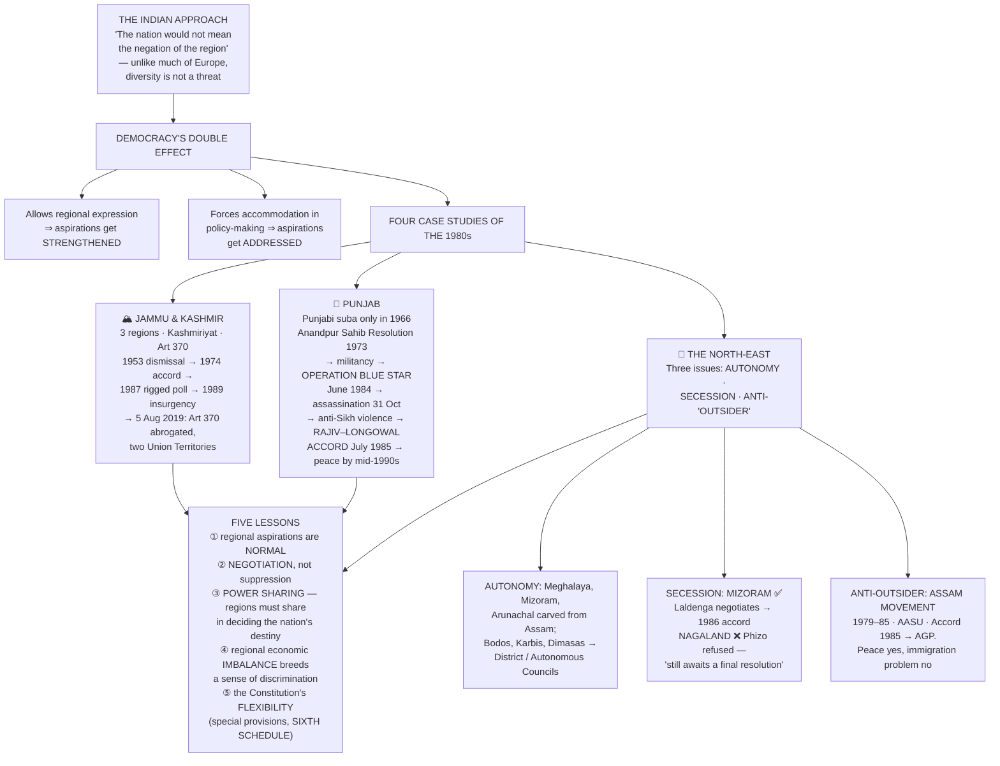
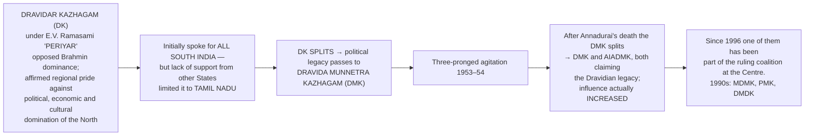
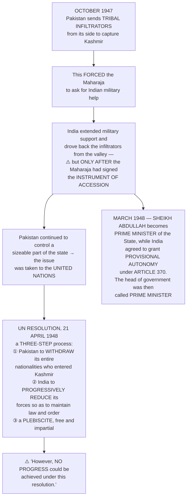
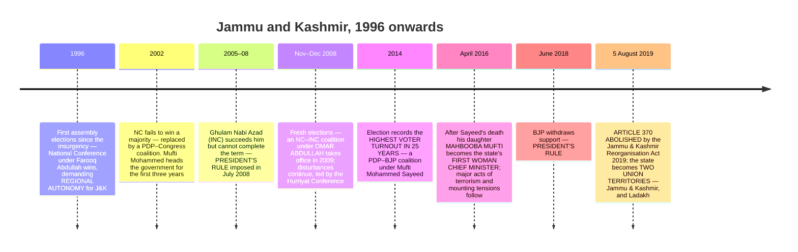
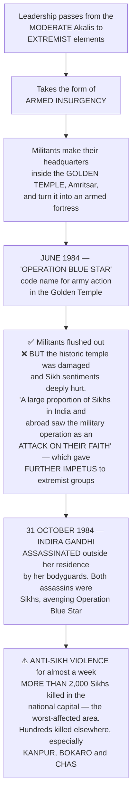

# Chapter 7: Regional Aspirations

> ⚠️ **Filename warning — this is the big one.** The PDF here is named `07_Rise_of_Popular_Movements.pdf`, but its actual content is **Chapter 7, "Regional Aspirations."** The old "Rise of Popular Movements" chapter was **removed in the rationalised edition**. Go by content, never by filename, in this folder.

## 🎯 Chapter Outcome — what you should walk away with

> **The one thing this chapter exists to teach:** **regional aspirations are a normal part of democratic politics, not an aberration** — and the Indian answer is **negotiation, not suppression.** "Nation building is an ongoing process."

**After reading it, here is what you now understand:**

1. **The Indian approach to diversity, stated as a principle** — "the Indian nation shall not deny the rights of different regions and linguistic groups to retain their own culture… **The nation would not mean the negation of the region.**" This is expressly contrasted with **many European countries, where cultural diversity was seen as a threat to the nation.**
2. **The democratic paradox at the heart of the chapter** — democracy **allows political expression of regional aspirations and does not treat them as anti-national**, so in the course of democratic politics **regional aspirations get strengthened**; but democratic politics *also* ensures those regional issues **receive attention and accommodation in policy-making.** Both happen together.
3. **The Kashmir story in full** — the three regions (**Jammu, Kashmir, Ladakh**), **Kashmiriyat**, Hari Singh's bid for independence, the **October 1947 tribal infiltration**, the **Instrument of Accession**, the **UN resolution of 21 April 1948 and its three steps**, Article 370, the **1953 dismissal of Sheikh Abdullah**, the **1974 accord**, the **rigged 1987 election**, insurgency from **1989**, and the **abrogation of Article 370 on 5 August 2019**.
4. **The Punjab story** — the **Akali Dal (formed 1920)**, the delayed **Punjabi suba (1966)**, the **Anandpur Sahib Resolution of 1973** and why it became controversial, **Operation Blue Star (June 1984)**, **Indira Gandhi's assassination (31 October 1984)** and the **anti-Sikh violence**, the **Rajiv Gandhi–Longowal Accord (July 1985)** and its four provisions, and the **24% turnout in 1992**.
5. **The three issues that dominate North-East politics** — **demands for autonomy, movements for secession, and opposition to "outsiders"** — with **Mizoram as the success** and **Nagaland as the unfinished case**.
6. **Why Mizoram worked and Nagaland has not** — Laldenga returned from exile and **negotiated**; Phizo **turned down many offers of negotiated settlement**. "This is where maturity of the political leadership at both ends made a difference."
7. **The Assam Movement (1979–85)** as the model of an anti-outsider movement — **AASU**, a students' group **not affiliated to any party**; the **1985 Accord**; the birth of the **AGP**; and the honest verdict: it **"brought peace and changed the face of politics in Assam, but it did not solve the problem of immigration."**
8. **The five lessons** — regional aspirations are normal; **negotiation beats suppression**; **power sharing** must extend to national-level decision-making; **regional economic imbalance** breeds a sense of discrimination; and the Constitution's **flexibility** (special provisions, the **Sixth Schedule**) is what distinguishes India.

**Self-check — answer these three without looking:**
1. Why did the Anandpur Sahib Resolution become controversial, when it was "a plea for strengthening federalism"?
2. Give the three steps recommended by the UN resolution of 21 April 1948.
3. Mizoram and Nagaland began the same way. Why did they end differently?

**Where this leads:** the accommodation principle established in Ch 1 is tested to destruction here — and **Ch 8** shows the party system that emerged from it.

---

## 🗺️ The chapter in one picture



---

## The Big Idea

Chapter 1 studied nation-building in the first decade. **"But nation-building is not something that can be accomplished once and for all times to come."** New challenges came up; some old problems had **never been fully resolved**; and as the democratic experiment unfolded, **people from different regions began to express their aspirations for autonomy — sometimes outside the framework of the Indian union.**

**The 1980s** are the chapter's focus, "as the Janata experiment came to an end and there was some political stability at the centre" — a decade remembered for **major conflicts and accords**, especially in **Assam, Punjab, Mizoram and Jammu and Kashmir.**

**The recurring pattern the chapter identifies:**
> Movements **"frequently involved armed assertions by the people, their repression by the government, and a collapse of the political and electoral processes."** Most were **long drawn and concluded in negotiated settlements or accords** between the central government and the movement's leaders — reached after dialogue that **"aimed to settle contentious issues within the constitutional framework."** **"Yet the journey to the accord was always tumultuous and often violent."**

**The poster the chapter opens with** is itself the argument: an unusual poster from the **Uttarakhand movement** appealing to all Indian citizens **in seven different languages**, thereby **"underscoring the compatibility of the regional aspirations with nationalist sentiments."**

---

## PART 1 — REGION AND THE NATION

### ⭐ The Indian approach to diversity

> **"The Indian nation shall not deny the rights of different regions and linguistic groups to retain their own culture. We decided to live a united social life without losing the distinctiveness of the numerous cultures that constituted it. Indian nationalism sought to balance the principles of unity and diversity. *The nation would not mean the negation of the region.*"**

**"In this sense the Indian approach was very different from the one adopted in many European countries where they saw cultural diversity as a threat to the nation."**

### The democratic mechanism — and why it cuts both ways

```
   DEMOCRACY AND REGIONAL ASPIRATIONS
   ┌───────────────────────────────────────────────────────────┐
   │  Democracy ALLOWS political expression of regional         │
   │  aspirations and does NOT look upon them as anti-national  │
   │                          ↓                                 │
   │  Parties and groups may address people on the basis of     │
   │  regional identity, aspiration and specific problems       │
   │                          ↓                                 │
   │  ⇒ "In the course of democratic politics,                  │
   │      REGIONAL ASPIRATIONS GET STRENGTHENED"                │
   │                          ↓                                 │
   │  ⇒ AND "regional issues and problems will receive          │
   │      adequate attention and accommodation in the           │
   │      policy making process"                                │
   └───────────────────────────────────────────────────────────┘
   ⚠️ THE TENSION: "Sometimes, the concern for national unity may
   overshadow the regional needs and aspirations. At other times a
   concern for region alone may blind us to the larger needs of the
   nation." Such conflicts "are common to nations that want to
   respect diversity while trying to forge and retain unity."
```

### The areas of tension — a map of the whole problem

| Where | The aspiration |
|---|---|
| **Jammu and Kashmir** | Not only an India–Pakistan conflict — **"more than that, it was a question of the political aspirations of the people of Kashmir valley"** |
| **The north-east** | **"There was no consensus about being a part of India."** First **Nagaland**, then **Mizoram**, saw strong movements demanding separation |
| **The south** | **Some groups from the Dravid movement briefly toyed with the idea of a separate country** |
| **Linguistic states** | Mass agitations — today's **Andhra Pradesh, Karnataka, Maharashtra and Gujarat** |
| **Language policy** | **Tamil Nadu:** protests against making Hindi the official language. **The north:** strong **pro-Hindi agitations** demanding Hindi be made official immediately |
| **Punjab** | From the late 1950s, Punjabi speakers agitated for a separate State — granted in **1966** |
| **Later states** | **Chhattisgarh, Uttarakhand, Jharkhand** |

> **"Thus the challenge of diversity was met by redrawing the internal boundaries of the country."** But **"this did not lead to resolution of all problems and for all times."** In **Kashmir and Nagaland** the challenge was too complex to resolve in the first phase; and **new challenges came up in Punjab, Assam and Mizoram.**

### 🐘 The Dravidian movement — the model of a regional movement that stayed democratic

**The slogan that sums it up:** ***"Vadakku Vaazhgiradhu; Therkku Thaeikiradhu"*** — **"The north thrives even as the south decays."**

- **One of the first regional movements in Indian politics.**
- **⭐ "Though some sections of this movement had ambitions of creating a Dravida nation, the movement did not take to arms. It used democratic means like public debates and the electoral platform to achieve its ends."**
- **"This strategy paid off as the movement acquired political power in the State and also became influential at the national level."**

**The organisational line:**



**The DMK's three-pronged agitation of 1953–54 — know all three:**
1. **Restoration of the original name of Kallakudi railway station**, which had been renamed **Dalmiapuram** after a northern industrial house — **"this demand brought out its opposition to the North Indian economic and cultural symbols."**
2. **Giving Tamil cultural history greater importance in school curricula.**
3. **Against the craft education scheme** of the State government, **"which it alleged was linked to the Brahmanical social outlook."**

Plus the agitation **against making Hindi the country's official language** — and **"the success of the anti-Hindi agitation of 1965 added to the DMK's popularity."** Sustained agitation brought the **DMK to power in the 1967 Assembly elections**, and Dravidian parties have dominated Tamil Nadu ever since.

> ⭐⭐ **The verdict to quote: "Initially seen as a threat to Indian nationalism, regional politics in Tamil Nadu is a good example of *the compatibility of regionalism and nationalism*."**

**👤 E.V. Ramasami Naicker (1879–1973):** known as **Periyar** ("the respected"); a strong supporter of **atheism**; famous for his **anti-caste struggle and the rediscovery of Dravidian identity**; **initially a worker of the Congress party**; started the **self-respect movement (1925)**; led the **anti-Brahmin movement**; worked for the **Justice Party** and later founded **Dravidar Kazhagam**; opposed to **Hindi and the domination of north India**; **propounded the thesis that north Indians and Brahmins are Aryans.**

---

## PART 2 — JAMMU AND KASHMIR

### 🗺️ The three regions — always begin an answer here

| Region | Terrain | Population |
|---|---|---|
| **Jammu** | A mix of **foothills and plains** | **Predominantly Hindus**; Muslims, Sikhs and people of other denominations also reside there |
| **Kashmir** | Mainly the **Kashmir valley** | **Mostly Kashmiri Muslims**, the remainder Hindus, Sikhs, Buddhists and others |
| **Ladakh** | **Mainly mountainous** | **Very little population**, **almost equally divided between Buddhists and Muslims** |

**The chapter's own summary of the cost:** despite the special status under Article 370, J&K **"experienced violence, cross border terrorism and political instability with internal and external ramifications. It also resulted in the loss of many lives including that of innocent civilians, security personnel and militants. Besides, there was also a large scale displacement of Kashmiri Pandits from the Kashmir valley."**

### The roots of the problem

- Before 1947 J&K was a **Princely State**. Its ruler, **Maharaja Hari Singh**, wanted **neither India nor Pakistan but independent status.**
- **Pakistani leaders thought Kashmir "belonged" to Pakistan since the majority population was Muslim.**
- **⭐ "But this is not how the people of the state themselves saw it — they thought of themselves as Kashmiris above all. This issue of regional aspiration is known as *Kashmiriyat*."**
- The popular movement, **led by Sheikh Abdullah of the National Conference**, **wanted to get rid of the Maharaja but was against joining Pakistan.** The National Conference **"was a secular organisation and had a long association with the Congress"**, and **Sheikh Abdullah was a personal friend of some leading nationalist leaders including Nehru.**

### The accession, and the UN resolution



> ⚠️ **Terminology point often examined:** the Indian territory under Pakistani occupation is called **Pakistan Occupied Jammu and Kashmir (POJK)** — the chapter describes it as **"the Indian territory which is under illegal occupation of Pakistan."**

### The external and internal disputes

**Externally:** **"Pakistan has always claimed that Kashmir valley should be part of Pakistan."** It sponsored the 1947 tribal invasion, as a consequence of which one part of the State came under Pakistani control. **"Ever since 1947, Kashmir has remained a major issue of conflict between India and Pakistan."**

**Internally:** a dispute **about the status of Kashmir within the Indian union** — and the special status provoked **two opposite reactions**:

| Position | Held by | Argument |
|---|---|---|
| **Article 370 should be revoked** | "A section of people **outside of J&K**" | The special status **did not allow full integration** of the State with India; J&K should be **treated like any other state** |
| **The autonomy is not enough** | **"Another section, mostly Kashmiris"** | Three grievances — see below |

**⭐ The three Kashmiri grievances — reproduce all three:**
1. **The promise that Accession would be referred to the people of the State** after the situation created by the tribal invasion was normalised **has not been fulfilled** → **the demand for a plebiscite.**
2. **The special federal status guaranteed by Article 370 "had been eroded in practice"** → the demand for **restoration of autonomy or "Greater State Autonomy."**
3. **"Democracy which is practised in the rest of India has not been similarly institutionalised in the State"** → the demand for genuine democratic practice.

### 📅 Politics since 1948

| Period | What happened |
|---|---|
| **1948–1953** | Sheikh Abdullah as Prime Minister **initiated major land reforms and other policies which benefitted ordinary people**. But **"a growing difference between him and the central government about his position on Kashmir's status"** |
| **1953** | **He was dismissed and kept in detention for a number of years.** The leadership that succeeded him **"did not enjoy as much popular support and was able to rule the State mainly due to the support of the Centre."** **⚠️ "There were serious allegations of malpractices and rigging in various elections."** |
| **1953–1974** | **The Congress party exercised influence on the politics of the State.** A **truncated National Conference (minus Sheikh Abdullah)** remained in power with active Congress support, **and later merged with the Congress**, giving the Congress **direct control** |
| **1965** | The Constitution of J&K was changed so that **the Prime Minister of the state was redesignated Chief Minister**. **Ghulam Mohammed Sadiq** of the Congress became the **first Chief Minister** |
| **1974** | **Indira Gandhi reached an agreement with Sheikh Abdullah**, who became **Chief Minister**; he **revived the National Conference**, which won a **majority in the 1977 assembly elections** |
| **1982** | Sheikh Abdullah died; leadership passed to his son **Farooq Abdullah**, who became Chief Minister — **but "he soon was dismissed by the Governor"**, and a **breakaway faction** of the National Conference came to power briefly |
| **1986** | **The National Conference agreed to an electoral alliance with the Congress**, the ruling party at the Centre |

> ⚠️ **The political damage, in the chapter's words:** the dismissal of Farooq Abdullah **"generated a feeling of resentment in Kashmir. The confidence that Kashmiris had developed in the democratic processes after the accord between Indira Gandhi and Sheikh Abdullah received a setback."** The 1986 alliance **further strengthened "the feeling that the Centre was intervening in politics of the State."**

### 🔥 Insurgency and after

**The 1987 Assembly election:**
- Official results showed **a massive victory of the National Conference–Congress alliance**, and **Farooq Abdullah returned as Chief Minister.**
- **⚠️ "But it was widely believed that the results did not reflect popular choice, and that the entire election process was rigged."**
- Popular resentment **against the inefficient administration since the early 1980s** was now **"augmented by the commonly prevailing feeling that democratic processes were being undermined by the state at the behest of the Centre."**
- **"This generated a political crisis in Kashmir which became severe with the rise of insurgency."**

**From 1989:**
- The State **"had come in the grip of a militant movement mobilised around the cause of a separate Kashmiri nation."**
- **"The insurgents got moral, material and military support from Pakistan."**
- For a number of years the State was **under President's rule and effectively under the control of the armed forces.**
- **"Throughout the period from 1990, Jammu and Kashmir experienced extraordinary violence at the hands of the insurgents and through army action."**

**The return of elections:**



**The chapter's closing assessment:** **"Jammu & Kashmir and Ladakh are living examples of plural society in India. Not only are there diversities of all kind (religious, cultural, linguistic, ethnic and tribal) but there are also divergent political and developmental aspirations, which have been sought to be achieved by the latest Act."**

**👤 Sheikh Mohammad Abdullah (1905–1982):** leader of J&K; **proponent of autonomy and secularism**; led the popular struggle against princely rule; **opposed to Pakistan due to its non-secular character**; leader of the **National Conference**; **Prime Minister of J&K immediately after accession in 1947**; **dismissed and jailed by the Government of India from 1953 to 1964 and again from 1965 to 1968**; became **Chief Minister after an agreement with Indira Gandhi in 1974.**

**🎬 *Roja* (1992)** — director and screenplay **Maniratnam**; cast (Hindi version) **Madhu, Arvind Swamy, Pankaj Kapoor, Janagaraj**. **Roja** is a newly-wed wife whose husband **Rishi, a cryptologist assigned to Kashmir to decode the enemy's messages, is abducted by militants** who demand the release of their jailed leader in exchange. **"Roja's world is shattered and she is seen knocking at the doors of officials and politicians."** Because it had the Indo-Pakistan dispute as background, **"it made instant appeal"** and was dubbed into Hindi and many other Indian languages.

---

## PART 3 — PUNJAB

### The political context

**The social composition of the State changed twice** — first with **Partition**, and later with the **carving out of Haryana and Himachal Pradesh.**

> ⚠️ **The grievance of delay:** "While the rest of the country was reorganised on linguistic lines in the 1950s, **Punjab had to wait till 1966** for the creation of a Punjabi-speaking State."

- The **Akali Dal, formed in 1920 as the political wing of the Sikhs**, had led the movement for a **'Punjabi suba'**.
- After reorganisation **the Sikhs were a majority in the truncated State of Punjab.**

**The Akalis came to power in 1967 and again in 1977 — on both occasions a coalition government.** And they discovered that **"despite the redrawing of the boundaries, their political position remained precarious"**, for three reasons:

| # | The problem |
|---|---|
| 1 | **Their government was dismissed by the Centre mid-way through its term** |
| 2 | **They did not enjoy strong support among the Hindus** |
| 3 | **The Sikh community, like all other religious communities, was internally differentiated on caste and class lines** — and **"the Congress got more support among the Dalits, whether Hindu or Sikh, than the Akalis"** |

### 📜 The Anandpur Sahib Resolution, 1973

In this context, **during the 1970s a section of Akalis began to demand political autonomy for the region** — reflected in a resolution passed at their conference at **Anandpur Sahib in 1973**.

**What it contained:**
1. **Asserted regional autonomy** and wanted to **redefine centre-state relations in the country.**
2. **Spoke of the aspirations of the Sikh *qaum*** (community or nation).
3. **Declared its goal as attaining the *bolbala*** (dominance or hegemony) **of the Sikhs.**

> ⭐ **The chapter's own careful judgment — this is the answer to exercise 4:** **"The Resolution was a plea for strengthening federalism in India."** But it was **ambiguous**: the language of *qaum* and *bolbala* was open to being read as a demand for a separate Sikh nation, which is precisely how opponents read it. **"The Resolution had a limited appeal among the Sikh masses"** until events gave it force.

**A few years later, after the Akali government was dismissed in 1980**, the Akali Dal launched a movement **on the question of the distribution of water between Punjab and its neighbouring States**, and **"a section of the religious leaders raised the question of autonomous Sikh identity."**

### 🔥 The cycle of violence



**The human cost, as the chapter puts it:** **"Many Sikh families lost their male members and thus suffered great emotional and heavy financial loss. What hurt the Sikhs most was that the government took a long time in restoring normalcy and that the perpetrators of this violence were not effectively punished."**

**⚖️ The Justice Nanavati Commission of Inquiry, Report, Vol. I, 2005** — the finding printed in the margin:
> *"There is also evidence to show that on 31-10-84 either meetings were held or persons who could organise attacks were contacted and were given instructions to kill Sikhs and loot their houses and shops. **The attacks were made in a systematic manner and without much fear of the police**, almost suggesting that they were assured that they would not be harmed while committing those acts or even after."*

**🙏 Prime Minister Manmohan Singh, Rajya Sabha, 11 August 2005** — the apology, twenty years later:
> *"I have no hesitation in apologising not only to the Sikh community but the whole Indian nation because **what took place in 1984 is the negation of the concept of nationhood** and what is enshrined in our Constitution. So, I am not standing on any false prestige. On behalf of our Government, on behalf of the entire people of this country, **I bow my head in shame** that such thing took place. But, Sir, there are ebbs, there are tides in the affairs of nations. The past is with us. We cannot rewrite the past. But as human beings, we have the willpower and we have the ability to write better future for all of us."*

### 🕊️ The road to peace — the Punjab Accord, July 1985

After the 1984 election, the new Prime Minister **Rajiv Gandhi initiated a dialogue with moderate Akali leaders**, and in **July 1985** reached an agreement with **Harchand Singh Longowal**, then President of the Akali Dal — the **Rajiv Gandhi–Longowal Accord**, or **Punjab Accord**.

**⭐ The five provisions — learn all of them, exercise 3 asks for them:**

| # | Provision | ⚠️ Why it could create fresh tension |
|---|---|---|
| 1 | **Chandigarh would be transferred to Punjab** | Chandigarh is the **shared capital of Punjab and Haryana** — transferring it required compensating Haryana, which was never settled |
| 2 | **A separate commission to resolve the Punjab–Haryana border dispute** | Left the actual territorial question **open**, so both States could claim it was decided in their favour |
| 3 | **A tribunal to decide the sharing of Ravi–Beas river water among Punjab, Haryana and Rajasthan** | **River-water sharing is zero-sum** — any award necessarily aggrieves at least one State; this became a long-running dispute |
| 4 | **Compensation to and better treatment of those affected by the militancy in Punjab** | — |
| 5 | **Withdrawal of the application of the Armed Forces Special Powers Act in Punjab** | — |

**⚠️ But "peace did not come easily or immediately":**
- **"The cycle of violence continued nearly for a decade."**
- **Militancy and counter-insurgency violence led to excesses by the police and violations of human rights.**
- **Politically, it led to the fragmentation of the Akali Dal.**
- The Centre **imposed President's rule** and **"the normal electoral and political process was suspended."**
- **⭐ "When elections were held in Punjab in 1992, only 24 per cent of the electors turned out to vote."** *(The single most quotable statistic in this section — it measures how far the political process had collapsed.)*

**The recovery:** **"Militancy was eventually eradicated by the security forces. But the losses incurred by the people of Punjab — Sikhs and Hindus alike — were enormous. Peace returned to Punjab by the middle of 1990s."** The **Akali Dal (Badal)–BJP alliance scored a major victory in 1997**, in the first normal elections of the post-militancy era. **"Though religious identities continue to be important for the people, politics has gradually moved back along secular lines."**

**👤 Master Tara Singh (1885–1967):** prominent Sikh religious and political leader; one of the early leaders of the **Shiromani Gurudwara Prabandhak Committee (SGPC)**; leader of the **Akali movement**; a supporter of the freedom movement but **opposed to the Congress's policy of negotiating only with the Muslims**; after Independence **the senior-most advocate of the formation of a separate Punjab State.**

**👤 Sant Harchand Singh Longowal (1932–1985):** Sikh political and religious leader; began his political career in the mid-sixties as an Akali leader; became **president of the Akali Dal in 1980**; reached the agreement with **Rajiv Gandhi** on the key Akali demands; **assassinated by unidentified Sikh youth.**

---

## PART 4 — THE NORTH-EAST

### 📍 The region, in numbers

```
   THE NORTH-EAST
   ═══════════════════════════════════════════════════════
   Eight States:  Arunachal Pradesh, Assam, Nagaland,
                  Manipur, Tripura, Mizoram, Meghalaya
                  = "THE SEVEN SISTERS"
                  + SIKKIM, "the BROTHER to those seven"
   ───────────────────────────────────────────────────────
   Population     only 4% of the country's
   Area           about TWICE that share
   Connection     a corridor of about 22 KILOMETRES
                  connects it to the rest of the country
   Borders        CHINA, MYANMAR and BANGLADESH
                  ⇒ India's GATEWAY TO SOUTH EAST ASIA
   ═══════════════════════════════════════════════════════
```

**The reorganisation timeline:** **Tripura, Manipur and the Khasi Hills of Meghalaya were erstwhile Princely States** which merged after Independence. **Nagaland was created in 1963; Manipur, Tripura and Meghalaya in 1972; Mizoram and Arunachal Pradesh became separate States only in 1987.**

**Why the region's politics is distinctive — four structural causes:**
1. **Partition in 1947 reduced the North-East to a land-locked region and affected its economy.** Cut off from the rest of India, **"the region suffered neglect in developmental terms. Its politics too remained insulated."**
2. **Most States underwent major demographic changes due to influx of migrants from neighbouring States and countries.**
3. **Its isolation, complex social character and backwardness** compared to other parts of the country produced a **complicated set of demands.**
4. **The vast international border and weak communication** with the rest of India **"further added to the delicate nature of politics there."**

> ⭐ **"Three issues dominate the politics of North-East: demands for autonomy, movements for secession, and opposition to 'outsiders'."** Major initiatives on the **first** in the **1970s** set the stage for dramatic developments on the **second and third in the 1980s**.

> 💬 **The margin comment that should stay with you:** *"My friend Chon said that people in Delhi know more about the map of Europe than about the North-East in our country."*

### ① Demands for autonomy

- **At independence the entire region except Manipur and Tripura comprised the State of Assam.**
- **Demands arose when the non-Assamese felt the Assam government was imposing the Assamese language on them.** There were **opposition and protest riots throughout the State.**
- Leaders of the major tribal communities wanted to separate from Assam. They formed the **Eastern India Tribal Union**, which transformed into the more comprehensive **All Party Hill Leaders Conference in 1960**, demanding **a tribal State carved out of Assam**.
- **"Finally instead of one tribal State, several States got carved out of Assam"** — **Meghalaya, Mizoram and Arunachal Pradesh** — while **Tripura and Manipur were upgraded into States.** **The reorganisation was completed by 1972.**

**⭐ But that was not the end.** In Assam, **the Bodos, Karbis and Dimasas wanted separate States**, working through **public opinion, popular movement and insurgency**. Two problems arose:
- **"Often the same area was claimed by more than one community."**
- **"It was not possible to go on making smaller and yet smaller States."**

**The solution — accommodation within Assam using federal provisions:** **Karbis and Dimasas have been granted autonomy under District Councils, while Bodos were granted an Autonomous Council.**

### ② Secessionist movements — the comparison that teaches the lesson

> **"Demands for autonomy were easier to respond to, for these involved using the various provisions in the Constitution for accommodation of diversities. It was much more difficult when some groups demanded a separate country, not in momentary anger but consistently as a principled position."**

```mermaid
flowchart TD
    subgraph MIZ["✅ MIZORAM — the success"]
        M1["Mizo Hills made an AUTONOMOUS DISTRICT<br/>within Assam. Some Mizos believed they were<br/>NEVER part of British India"]
        M2["⚠️ Secession gained POPULAR support after<br/>the Assam government failed to respond<br/>adequately to the GREAT FAMINE OF 1959"]
        M3["→ MIZO NATIONAL FRONT under LALDENGA"]
        M4["1966: MNF begins an ARMED CAMPAIGN —<br/>a TWO-DECADE battle. Guerilla war, support<br/>from the Pakistani government, shelter in<br/>then East Pakistan. Indian forces countered<br/>with repressive measures — at one point<br/>even the AIR FORCE was used — of which<br/>THE COMMON PEOPLE WERE THE VICTIMS"]
        M5["'At the end of two decades of insurgency<br/>EVERYONE WAS A LOSER.'<br/>Laldenga returns from exile and negotiates;<br/>RAJIV GANDHI steers it to conclusion"]
        M6["1986 PEACE AGREEMENT: full-fledged<br/>STATEHOOD with special powers; MNF gives up<br/>the secessionist struggle; Laldenga becomes CM.<br/>Today Mizoram is one of the MOST PEACEFUL<br/>places in the region, with big strides in<br/>LITERACY AND DEVELOPMENT"]
        M1-->M2-->M3-->M4-->M5-->M6
    end
    subgraph NAG["❌ NAGALAND — still unresolved"]
        N1["Led by ANGAMI ZAPU PHIZO, a section of<br/>the Nagas declared independence from India<br/>WAY BACK IN 1951 — much earlier than Mizoram"]
        N2["⚠️ 'PHIZO TURNED DOWN MANY OFFERS<br/>OF NEGOTIATED SETTLEMENT'"]
        N3["The NAGA NATIONAL COUNCIL launched an<br/>armed struggle for the sovereignty of Nagas"]
        N4["After a period of violent insurgency a section<br/>of the Nagas signed an agreement with the<br/>Government of India — BUT THIS WAS NOT<br/>ACCEPTABLE TO OTHER REBELS"]
        N5["'The problem in Nagaland<br/>STILL AWAITS A FINAL RESOLUTION.'"]
        N1-->N2-->N3-->N4-->N5
    end
```



> ⭐⭐ **The comparison is the lesson: "This is where *maturity of the political leadership at both ends* made a difference."** Mizoram's insurgency was **longer-armed but shorter-lived** because both sides eventually negotiated; Nagaland's began **fifteen years earlier** and continues because offers of settlement were refused and later agreements were **not accepted by all the rebels**.

**👤 Laldenga (1937–1990):** founder and leader of the **Mizo National Front**; **"turned into a rebel after the experience of the famine in 1959"**; led an armed struggle against India for two decades; reached a settlement and **signed an agreement with Rajiv Gandhi in 1986**; became **Chief Minister of the newly created State of Mizoram.**

**👤 Angami Zapu Phizo (1904–1990):** leader of the movement for **independent Nagaland**; **president of the Naga National Council**; began an armed struggle against the Indian state; went **"underground"**, **stayed in Pakistan** and **spent the last three decades of his life in exile in the UK.**

### ③ Movements against outsiders

**The structure of the problem:** large-scale migration **"pitted the 'local' communities against people who were seen as 'outsiders' or migrants."** These latecomers, **from India or abroad**, are seen as:
- **encroachers on scarce resources like land**, and
- **potential competitors to employment opportunities and political power.**

> 💬 **The margin comment is worth using in an answer:** *"I've never understood this insider-outsider business. It's like the train compartment. Someone who got in before others treats others as outsiders."* *(This is the same railway-compartment image as Class 11 Political Theory Ch 6 — link them.)*

#### 🌊 The Assam Movement, 1979–1985 — "the best example"

**The grievances — cultural *and* economic, which is the point of exercise 7:**

| Cultural / demographic | Economic |
|---|---|
| The Assamese **suspected huge numbers of illegal Bengali Muslim settlers from Bangladesh** | **Widespread poverty and unemployment in Assam** |
| They felt that **unless these foreign nationals were detected and deported they would reduce the indigenous Assamese into a minority** | **despite the existence of natural resources like oil, tea and coal** |
| Opposition to **the domination of Bengalis and other outsiders** | **"It was felt that these were drained out of the State without any commensurate benefit to the people"** |
| A **faulty voters' register** that **included the names of lakhs of immigrants** | |

**The movement:**
- Led from **1979** by the **All Assam Students' Union (AASU)** — **⭐ "a students' group *not affiliated to any party*."**
- Demanded that **all outsiders who had entered the State after 1951 should be sent back.**
- **"The agitation followed many novel methods and mobilised all sections of Assamese people, drawing support across the State."**
- **⚠️ "It also involved many tragic and violent incidents leading to loss of property and human lives."**
- It **tried to blockade the movement of trains and the supply of oil from Assam to refineries in Bihar.**

**The settlement — the Assam Accord, 1985:**
- After **six years of turmoil**, the **Rajiv Gandhi-led government negotiated with AASU leaders**, signing an accord in **1985**.
- **Its term:** those foreigners **who migrated into Assam during and after the Bangladesh war and since** were to be **identified and deported.**
- The **AASU and the Asom Gana Sangram Parishad organised themselves as a regional political party, the Asom Gana Parishad (AGP)**, which **came to power in 1985** with the promise of resolving the foreign national problem and building a **"Golden Assam."**

> ⚠️ **The honest verdict: "Assam accord brought peace and changed the face of politics in Assam, *but it did not solve the problem of immigration*."**

**And the problem elsewhere:** **"The issue of the 'outsiders' continues to be a live issue"** — **"particularly acute… in Tripura, as the original inhabitants have been reduced to being a minority in their own land"**, and in the hostility of the local population to **Chakma refugees in Mizoram and Arunachal Pradesh.**

---

## PART 5 — SIKKIM'S MERGER

| Stage | Detail |
|---|---|
| **Status at independence** | Sikkim was a **"protectorate" of India** — **"while it was not a part of India, it was also not a fully sovereign country."** **India looked after defence and foreign relations**; **internal administration lay with the Chogyal, Sikkim's monarch** |
| **The problem** | The arrangement **ran into difficulty as the Chogyal was unable to deal with the democratic aspirations of the people.** **An overwhelming majority of Sikkim's population was Nepali**, but **the Chogyal was seen as perpetuating the rule of a small elite from the minority Lepcha-Bhutia community** |
| **The alliance** | **The anti-Chogyal leaders of both communities sought and got support from the Government of India** |
| **1974** | The **first democratic elections to the Sikkim assembly** were **swept by Sikkim Congress**, which **stood for greater integration with India** |
| **The two-step request** | The assembly **first sought the status of "associate state"**, and then **in April 1975 passed a resolution asking for full integration with India** |
| **The referendum** | Followed by **"a hurriedly organised referendum that put a stamp of popular approval on the assembly's request"** |
| **The outcome** | **The Indian Parliament accepted the request immediately** and **Sikkim became the 22nd State of the Indian union** |
| **The dissent** | **The Chogyal did not accept the merger**, and **his supporters accused the Government of India of foul play and use of force.** **⭐ "Yet the merger enjoyed popular support and did not become a divisive issue in Sikkim's politics."** |

**👤 Kazi Lhendup Dorji Khangsarpa (1904– ):** leader of the democracy movement in Sikkim; founder of **Sikkim Praja Mandal** and later leader of the **Sikkim State Congress**; **in 1962 founded the Sikkim National Congress**; after an electoral victory **led the movement for integration of Sikkim with India**; after integration the **Sikkim Congress merged with the Indian National Congress.**

### 🏖️ Goa's liberation — the other territorial case

- **The British empire ended in 1947, but Portugal refused to withdraw** from **Goa, Diu and Daman**, under its colonial rule **since the sixteenth century.**
- During their long rule the Portuguese **"suppressed the people of Goa, denied them civil rights, and carried out forced religious conversions."**
- **India tried very patiently to persuade the Portuguese government to withdraw.** There was **a strong popular movement within Goa**, strengthened by **socialist satyagrahis from Maharashtra.**
- **⭐ Finally, in December 1961, the Government of India sent the army, which liberated these territories after barely two days of action.** Goa, Diu and Daman became a **Union Territory.**
- **The next complication:** the **Maharashtrawadi Gomantak Party (MGP)** wanted Goa, **as a Marathi-speaking area, to merge with Maharashtra**; but many Goans wanted to **retain a separate Goan identity and culture, particularly the Konkani language**, led by the **United Goan Party (UGP)**.
- **⭐ In January 1967 the Central Government held a special "opinion poll" in Goa** — a **referendum-like procedure** — asking people whether to join Maharashtra or remain separate. **The majority voted in favour of remaining outside Maharashtra**, so Goa continued as a Union Territory. **Finally, in 1987, Goa became a State of the Indian Union.**

---

## PART 6 — ⭐ ACCOMMODATION AND NATIONAL INTEGRATION: THE FIVE LESSONS

> "Even after 75 years of independence, some of the issues of national integration are not fully resolved… **The period since 1980 accentuated these tensions and tested the capacity of democratic politics to accommodate the demands of diverse sections of the society.**"

| # | Lesson | The evidence the chapter gives |
|---|---|---|
| **1** | **Regional aspirations are very much a part of democratic politics.** "Expression of regional issues is **not an aberration or an abnormal phenomenon**" | Even smaller countries have them — **Scotland, Wales and Northern Ireland** in the UK; **the Basques** in Spain; **the Tamils** in Sri Lanka. **"Nation building is an ongoing process."** |
| **2** | **The best way to respond is through democratic negotiations rather than through suppression** | In the eighties **militancy in Punjab, problems in the North-East, agitating students in Assam, the Kashmir valley on the boil** — **"instead of treating these as simple law and order problems, the Government of India reached negotiated settlement with regional movements."** **"The example of Mizoram shows how political settlement can resolve the problem of separatism effectively."** |
| **3** | **The significance of power sharing** | **"It is not sufficient to have a formal democratic structure"** — groups and parties from the region **need a share in power at the State level**; and **"it is not sufficient to say that the states or the regions have autonomy in their matters. The regions together form the nation. So, the regions must have a share in deciding the destiny of the nation."** ⚠️ **"If regions are not given a share in the national level decision making, the feeling of injustice and alienation can spread."** |
| **4** | **Regional imbalance in economic development contributes to the feeling of regional discrimination** | **"Regional imbalance is a fact of India's development experience."** Backward states or regions feel their backwardness **should be addressed on a priority basis** and that **government policies have caused the imbalance** — which "leads to regional imbalances and **inter-regional migrations**" |
| **5** | **The farsightedness of the Constitution's makers** | The federal system is **a flexible arrangement**: most states have equal powers, but there are **special provisions for some** — J&K (until 2019) and the North-East states. **The Sixth Schedule "allows different tribes complete autonomy of preserving their practices and customary laws"**, and **"these provisions proved crucial in resolving some very complex political problems in the North-East"** |

> ⭐⭐⭐ **The concluding sentence to memorise:** **"What distinguishes India from many other countries that face similar challenges is that the constitutional framework in India is much more flexible and accommodative. Therefore, regional aspirations are not encouraged to espouse separatism. Thus, politics in India has succeeded in accepting *regionalism as part and parcel of democratic politics*."**

---

## Key Words (Glossary)

| Term | Meaning |
|---|---|
| **Kashmiriyat** | The regional aspiration of the people of Kashmir, who **"thought of themselves as Kashmiris above all"** — against both the Maharaja's independence and Pakistan's claim |
| **Instrument of Accession** | Signed by **Hari Singh** before Indian military help was extended in October 1947 |
| **POJK** | **Pakistan Occupied Jammu and Kashmir** — "the Indian territory which is under illegal occupation of Pakistan" |
| **Article 370** | The provisional autonomy granted to J&K; **abolished on 5 August 2019** by the **J&K Reorganisation Act 2019**, creating two Union Territories |
| **Greater State Autonomy** | The Kashmiri demand arising from the feeling that Article 370's federal status **had been eroded in practice** |
| **Punjabi suba** | The demand for a Punjabi-speaking State, led by the **Akali Dal**; granted only in **1966** |
| **Anandpur Sahib Resolution (1973)** | Asserted **regional autonomy**, sought to **redefine centre-state relations**, spoke of the Sikh ***qaum*** and declared the goal of ***bolbala*** — **"a plea for strengthening federalism"** that was read as separatist |
| ***Qaum* / *bolbala*** | Community or nation / dominance or hegemony — the two words that made the Resolution controversial |
| **Operation Blue Star** | **June 1984**, the code name for army action in the **Golden Temple**; militants flushed out but the temple damaged and Sikh sentiment deeply hurt |
| **Rajiv Gandhi–Longowal Accord** | The **Punjab Accord, July 1985** — Chandigarh to Punjab, a border commission, a Ravi-Beas water tribunal, compensation for militancy victims, and **withdrawal of AFSPA in Punjab** |
| **"Seven sisters"** | Arunachal Pradesh, Assam, Nagaland, Manipur, Tripura, Mizoram, Meghalaya — with **Sikkim as "the Brother"** |
| **AASU** | **All Assam Students' Union** — the students' group **not affiliated to any party** that led the 1979–85 movement |
| **AGP** | **Asom Gana Parishad**, formed by AASU and the Asom Gana Sangram Parishad; came to power in **1985** promising a **"Golden Assam"** |
| **Chogyal** | Sikkim's monarch, who held internal administration while India handled defence and foreign relations |
| **Protectorate** | Sikkim's pre-1975 status — **"not a part of India… also not a fully sovereign country"** |
| **Sixth Schedule** | Allows different tribes **"complete autonomy of preserving their practices and customary laws"** |

---

## Quick Recap (16 points)

1. **"Nation building is not something that can be accomplished once and for all times to come."** The 1980s brought **major conflicts and accords** in Assam, Punjab, Mizoram and J&K.
2. **The Indian approach:** **"The nation would not mean the negation of the region"** — unlike many European countries that saw cultural diversity as a threat.
3. **Democracy cuts both ways:** it **strengthens** regional aspirations by allowing their expression, *and* ensures they get **accommodated** in policy-making.
4. **The Dravidian movement** — *"the north thrives even as the south decays"*; **Periyar**, the **DK → DMK** line, the **1953–54 three-pronged agitation** (Kallakudi/Dalmiapuram, Tamil curricula, craft education), the **1965 anti-Hindi agitation**, power in **1967** — and the verdict that it demonstrates **"the compatibility of regionalism and nationalism."** It **never took to arms.**
5. **J&K's three regions:** Jammu (foothills/plains, mostly Hindu), Kashmir (the valley, mostly Kashmiri Muslim), Ladakh (mountainous, tiny population, **almost equally Buddhist and Muslim**).
6. **Kashmiriyat** — the people saw themselves as **Kashmiris above all**; **Sheikh Abdullah's National Conference** opposed both the Maharaja and Pakistan.
7. **October 1947:** tribal infiltrators → Maharaja seeks help → India acts **only after the Instrument of Accession** → issue to the UN → **resolution of 21 April 1948, three steps** (Pakistan withdraws; India progressively reduces forces; free and impartial plebiscite) → **no progress**. **March 1948:** Sheikh Abdullah becomes **Prime Minister**; **Article 370** grants provisional autonomy.
8. **The three Kashmiri grievances:** the promised reference to the people **never happened**; Article 370's status **eroded in practice**; **democracy not institutionalised** as in the rest of India.
9. **The political timeline:** dismissal **1953** → Congress influence 1953–74 → **"Prime Minister" renamed Chief Minister in 1965** → **1974 Indira–Sheikh accord** → 1977 NC majority → **1982** Farooq Abdullah, soon **dismissed by the Governor** → **1986 NC-Congress alliance** → **1987 rigged election** → **1989 insurgency** with Pakistani support → elections 1996, 2002, 2008, **2014 (highest turnout in 25 years)** → **Mahbooba Mufti, first woman CM, April 2016** → **President's rule June 2018** → **Article 370 abrogated 5 August 2019**, two Union Territories.
10. **Punjab:** the **Akali Dal (1920)**; **Punjabi suba delayed to 1966**; Akali governments in 1967 and 1977 both coalitions, precarious for **three reasons** (dismissed mid-term, weak Hindu support, Congress support among Dalits).
11. **The Anandpur Sahib Resolution 1973** — regional autonomy, redefining Centre–State relations, the Sikh ***qaum***, the goal of ***bolbala***; **"a plea for strengthening federalism"** with **limited appeal among the Sikh masses**, revived after the **1980 dismissal** and the **river-water agitation**.
12. **The cycle:** moderates → extremists → Golden Temple fortified → **Operation Blue Star, June 1984** → **31 October 1984 assassination** → **anti-Sikh violence, over 2,000 killed in Delhi**, hundreds elsewhere (**Kanpur, Bokaro, Chas**) → **Nanavati Commission (2005)** on the systematic character of the attacks → **Manmohan Singh's apology, 11 August 2005**.
13. **The Punjab Accord, July 1985** — five provisions; but **violence continued for nearly a decade**, the **Akali Dal fragmented**, President's rule followed, and **only 24% voted in 1992**. Peace by the **mid-1990s**; **Akali Dal (Badal)–BJP won in 1997**.
14. **The North-East:** 8 states, **4% of population, twice that share of area, a 22-km corridor**, borders with **China, Myanmar and Bangladesh**. Three issues: **autonomy, secession, anti-outsider.** Autonomy handled by carving states (completed **1972**) and then by **District Councils (Karbis, Dimasas)** and an **Autonomous Council (Bodos)**.
15. **Mizoram vs Nagaland:** MNF under **Laldenga** after the **1959 famine**; armed campaign from **1966**; two decades of guerilla war with Pakistani support and even **air force** use; **"everyone was a loser"**; **1986 accord with Rajiv Gandhi** → statehood, Laldenga CM, **today one of the most peaceful places in the region**. Nagaland: **Phizo declared independence in 1951**, **turned down many offers**, the **Naga National Council** fought for sovereignty, a partial agreement was **not acceptable to other rebels** — **"still awaits a final resolution."**
16. **The Assam Movement 1979–85:** **AASU**, unaffiliated to any party; grievances **cultural (illegal Bengali Muslim settlers, faulty voters' register, fear of becoming a minority)** and **economic (poverty and unemployment despite oil, tea and coal "drained out of the State")**; demanded deportation of all who entered **after 1951**; **blockaded trains and oil supply to Bihar refineries**; **Accord 1985** (deport those who came **during and after the Bangladesh war**) → **AGP in power, promising a "Golden Assam"** → **peace yes, immigration no**. Also **Sikkim's merger (22nd State, 1975)** and **Goa** (army action **December 1961**, **opinion poll January 1967**, statehood **1987**).

---

## 60-Second Revision

**"NATION BUILDING IS AN ONGOING PROCESS." Indian approach: "THE NATION WOULD NOT MEAN THE NEGATION OF THE REGION" — unlike Europe, diversity ≠ threat. Democracy BOTH strengthens regional aspirations AND accommodates them.** **DRAVIDIAN: "Vadakku Vaazhgiradhu; Therkku Thaeikiradhu"; PERIYAR (self-respect movement 1925, Justice Party, DK); NEVER TOOK TO ARMS — public debate + electoral platform; DK→DMK; 1953–54 THREE-PRONGED (Kallakudi renamed DALMIAPURAM / Tamil curricula / craft education scheme); ANTI-HINDI 1965 → power 1967 (ANNADURAI); split → DMK + AIADMK; since 1996 one is always in the Centre's coalition; MDMK, PMK, DMDK. ⇒ "a good example of the COMPATIBILITY OF REGIONALISM AND NATIONALISM."** **J&K THREE REGIONS: JAMMU (foothills+plains, mostly Hindu) | KASHMIR (valley, mostly Kashmiri Muslim) | LADAKH (mountainous, tiny population, ALMOST EQUALLY Buddhist and Muslim). KASHMIRIYAT = "Kashmiris above all". HARI SINGH wanted independence; SHEIKH ABDULLAH's NATIONAL CONFERENCE (secular, long Congress association) opposed the Maharaja AND Pakistan.** **OCT 1947 tribal infiltrators → Maharaja asks help → India acts ONLY AFTER the INSTRUMENT OF ACCESSION → UN → RESOLUTION 21 APRIL 1948, THREE STEPS: (1) Pakistan WITHDRAWS its nationalities (2) India PROGRESSIVELY REDUCES forces (3) FREE AND IMPARTIAL PLEBISCITE → NO PROGRESS. MARCH 1948 Sheikh Abdullah = PRIME MINISTER; ART 370 = provisional autonomy. POJK = Indian territory under illegal Pakistani occupation.** **THREE KASHMIRI GRIEVANCES: promised reference to the people NOT FULFILLED (→ plebiscite demand) | Art 370 ERODED IN PRACTICE (→ Greater State Autonomy) | democracy NOT INSTITUTIONALISED as in the rest of India.** **TIMELINE: 1953 DISMISSED + detained → Congress influence, truncated NC merges with Congress → 1965 "PM" renamed CHIEF MINISTER (G.M. SADIQ first) → 1974 INDIRA–SHEIKH accord, NC revived, majority 1977 → 1982 dies, FAROOQ ABDULLAH, soon DISMISSED BY GOVERNOR → 1986 NC–Congress alliance deepens the "Centre is intervening" feeling → 1987 election WIDELY BELIEVED RIGGED → 1989 INSURGENCY with Pakistani moral/material/military support; President's rule, armed forces control → 1996 NC (regional autonomy demand) → 2002 PDP+Congress (MUFTI, then GHULAM NABI AZAD) → PRESIDENT'S RULE JULY 2008 → 2009 OMAR ABDULLAH (NC+INC); HURRIYAT disturbances → 2014 HIGHEST TURNOUT IN 25 YEARS, PDP+BJP → APRIL 2016 MAHBOOBA MUFTI, FIRST WOMAN CM → JUNE 2018 President's rule → 5 AUG 2019 ART 370 ABOLISHED, J&K Reorganisation Act, TWO UNION TERRITORIES (J&K + LADAKH). Film: ROJA 1992, Maniratnam.** **PUNJAB: AKALI DAL formed 1920 as the political wing of the Sikhs; PUNJABI SUBA only in 1966 (rest of India reorganised in the 1950s); Akalis in power 1967 + 1977, both COALITIONS; precarious for THREE reasons — dismissed MID-TERM by the Centre / weak HINDU support / Sikhs internally differentiated by CASTE AND CLASS, Congress stronger among DALITS.** **ANANDPUR SAHIB RESOLUTION 1973: regional autonomy + redefine centre-state relations + Sikh QAUM + goal of BOLBALA. "A PLEA FOR STRENGTHENING FEDERALISM" — but ambiguous, LIMITED APPEAL among the masses; revived after the 1980 dismissal + the RIVER WATER agitation; religious leaders raise autonomous Sikh identity.** **CYCLE: moderates → EXTREMISTS → GOLDEN TEMPLE turned into an armed fortress → OPERATION BLUE STAR JUNE 1984 (militants flushed out BUT temple damaged, sentiments hurt, seen as an ATTACK ON FAITH → further impetus to extremists) → 31 OCT 1984 INDIRA GANDHI ASSASSINATED by her bodyguards → ANTI-SIKH VIOLENCE almost a week, 2,000+ KILLED IN DELHI, hundreds in KANPUR, BOKARO, CHAS; govt slow to restore normalcy, perpetrators not effectively punished. NANAVATI COMMISSION 2005: attacks "made in a SYSTEMATIC MANNER and without much fear of the police." MANMOHAN SINGH, RS, 11 AUG 2005: "I BOW MY HEAD IN SHAME."** **PUNJAB ACCORD (RAJIV–LONGOWAL) JULY 1985 — FIVE: Chandigarh to Punjab / commission on the Punjab-Haryana border / tribunal on RAVI-BEAS water among Punjab, Haryana, Rajasthan / compensation + better treatment for militancy-affected / WITHDRAWAL OF AFSPA IN PUNJAB. But violence continued NEARLY A DECADE; Akali Dal FRAGMENTED; President's rule; 1992 TURNOUT ONLY 24%. Peace by mid-1990s; AKALI DAL (BADAL)+BJP win 1997.** **NORTH-EAST: 8 states = SEVEN SISTERS + SIKKIM "the Brother"; 4% of POPULATION, ~TWICE that share of AREA; 22-KM CORRIDOR; borders CHINA, MYANMAR, BANGLADESH = gateway to SE Asia. Partition made it LANDLOCKED → neglect + insulated politics + migration. THREE ISSUES: AUTONOMY / SECESSION / ANTI-OUTSIDER. Nagaland 1963; Manipur, Tripura, Meghalaya 1972; Mizoram + Arunachal 1987; reorganisation completed 1972. Bodos/Karbis/Dimasas → DISTRICT COUNCILS (Karbi, Dimasa) and AUTONOMOUS COUNCIL (Bodo), because the same area was claimed by more than one community and "it was not possible to go on making smaller and yet smaller States."** **MIZORAM ✅: autonomous district in Assam; secession gained POPULAR support after the GREAT FAMINE OF 1959; MNF under LALDENGA; ARMED CAMPAIGN 1966; two decades, guerilla war, Pakistani support, shelter in East Pakistan, INDIA EVEN USED THE AIR FORCE, common people the victims; "EVERYONE WAS A LOSER"; Laldenga returns from exile, RAJIV GANDHI steers → 1986 ACCORD: full statehood with special powers, MNF gives up secession, Laldenga CM → today one of the MOST PEACEFUL, big strides in literacy and development.** **NAGALAND ❌: ANGAMI ZAPU PHIZO declared independence in 1951 (much earlier); "TURNED DOWN MANY OFFERS OF NEGOTIATED SETTLEMENT"; NAGA NATIONAL COUNCIL armed struggle; a section signed an agreement but "NOT ACCEPTABLE TO OTHER REBELS"; "STILL AWAITS A FINAL RESOLUTION." ⇒ the difference = "MATURITY OF THE POLITICAL LEADERSHIP AT BOTH ENDS."** **ASSAM MOVEMENT 1979–85: AASU, a students' group NOT AFFILIATED TO ANY PARTY; against illegal migration, Bengali domination, and a FAULTY VOTERS' REGISTER with lakhs of immigrants; feared becoming a MINORITY; economic: poverty + unemployment DESPITE oil, tea, coal "DRAINED OUT of the State"; demanded deportation of all who entered AFTER 1951; blockaded TRAINS and OIL SUPPLY to Bihar refineries; ACCORD 1985 (deport those who came DURING AND AFTER the Bangladesh war) → AASU + Asom Gana Sangram Parishad → AGP, in power 1985, promising "GOLDEN ASSAM". ⚠️ "Brought peace… BUT DID NOT SOLVE THE PROBLEM OF IMMIGRATION." TRIPURA: original inhabitants a MINORITY IN THEIR OWN LAND; CHAKMA refugees in Mizoram + Arunachal.** **SIKKIM: a PROTECTORATE — not part of India, not fully sovereign; India had defence + foreign relations, CHOGYAL had internal administration; majority NEPALI but the Chogyal represented the minority LEPCHA-BHUTIA elite; 1974 first democratic elections swept by SIKKIM CONGRESS; assembly sought "ASSOCIATE STATE" then APRIL 1975 FULL INTEGRATION; hurried REFERENDUM; became the 22nd STATE; Chogyal refused, supporters alleged foul play — but the merger had popular support and never became divisive.** **GOA: Portuguese since the 16th century; suppression, denial of civil rights, FORCED CONVERSIONS; patient persuasion + popular movement + socialist satyagrahis from Maharashtra; DECEMBER 1961 ARMY ACTION, liberated in BARELY TWO DAYS → Union Territory; MGP wanted merger with Maharashtra, UGP wanted separate Goan identity + KONKANI; JANUARY 1967 special "OPINION POLL" → majority to REMAIN OUTSIDE Maharashtra; STATEHOOD 1987.** **⭐ FIVE LESSONS: ① regional aspirations are NORMAL (Scotland/Wales/N.Ireland, Basques, Sri Lankan Tamils) ② NEGOTIATION not suppression — "the example of Mizoram shows how political settlement can resolve the problem of separatism effectively" ③ POWER SHARING — not just autonomy but a share in NATIONAL decision-making, else "injustice and alienation can spread" ④ REGIONAL IMBALANCE breeds the feeling of discrimination + inter-regional migration ⑤ CONSTITUTIONAL FLEXIBILITY — special provisions + the SIXTH SCHEDULE giving tribes "complete autonomy of preserving their practices and customary laws". ⇒ "the constitutional framework in India is much more FLEXIBLE AND ACCOMMODATIVE… regionalism as PART AND PARCEL of democratic politics."**

---

## NCERT Exercises — with answers

**1. Match the nature of regional aspiration with the State.**

| Nature of regional aspiration | State |
|---|---|
| (a) **Socio-religious identity leading to statehood** | **(iii) Punjab** — the Akali Dal's Punjabi suba movement, granted in 1966 |
| (b) **Linguistic identity and tensions with the Centre** | **(iv) Tamil Nadu** — the Dravidian movement and the anti-Hindi agitations |
| (c) **Regional imbalance leading to demand for Statehood** | **(ii) Jharkhand / Chhattisgarh** — created in 2000 on grounds of regional culture and development imbalance, not language |
| (d) **Secessionist demands on account of tribal identity** | **(i) Nagaland / Mizoram** |

**2. Map work — the three kinds of expression in the North-East.**
- **Movements against outsiders:** **Assam** (the 1979–85 movement), and also **Tripura** and **Meghalaya**; hostility to **Chakma refugees** in **Mizoram** and **Arunachal Pradesh**.
- **Movement for greater autonomy:** **Assam** again (the **Bodo, Karbi and Dimasa** demands, now met by Autonomous and District Councils) — historically the whole region, from which **Meghalaya, Mizoram, Arunachal Pradesh, Tripura and Manipur** emerged.
- **Movement for separate national existence:** **Nagaland** and **Mizoram**.
*(Note that Assam appears in two categories and Mizoram in two — that overlap is itself the point.)*

**3. The main provisions of the Punjab Accord, and how they can be the basis of further tension.**
**The provisions (Rajiv Gandhi–Longowal, July 1985):** **Chandigarh would be transferred to Punjab**; **a separate commission would resolve the Punjab–Haryana border dispute**; **a tribunal would decide the sharing of Ravi–Beas river water among Punjab, Haryana and Rajasthan**; **compensation and better treatment for those affected by militancy**; and **withdrawal of the application of the Armed Forces Special Powers Act in Punjab.**
**Why they can breed fresh tension between Punjab and its neighbours — the first three are all inter-State questions with no neutral answer:**
- **Chandigarh** is the **shared capital of Punjab and Haryana**. Transferring it to Punjab requires Haryana to be compensated with territory or a new capital, and until that is settled Haryana reads the promise as a loss inflicted on it. The transfer was in fact never carried out.
- **The border commission** deferred the substantive question of **which Hindi-speaking villages go to Haryana**, so both States could — and did — claim the accord vindicated them.
- **The Ravi–Beas tribunal** touches the most zero-sum resource of all. **Water shared among three States is a fixed quantity**, so any award necessarily aggrieves someone; Punjab has argued it has no surplus to give, while Haryana and Rajasthan claim allocations already granted. This became a running dispute for decades.
**In short, the Accord settled Punjab's grievance against the Centre by converting it into grievances between Punjab and its neighbours** — which is why the chapter notes that "peace did not come easily or immediately."

**4. Why the Anandpur Sahib Resolution became controversial.**
Because it **could be read in two entirely different ways**, and both readings were available in its own text.
**The moderate reading**, which the chapter itself endorses: it **"asserted regional autonomy and wanted to redefine centre-state relationship in the country"**, and was therefore **"a plea for strengthening federalism in India"** — a demand no different in kind from those made by the DMK or by West Bengal's Left Front.
**The separatist reading:** it also **"spoke of the aspirations of the Sikh *qaum* (community or nation)"** and **"declared its goal as attaining the *bolbala* (dominance or hegemony) of the Sikhs."** The word ***qaum* can mean nation**, and ***bolbala* can mean hegemony** — so opponents could present the resolution as a demand for a separate Sikh state in which one community would dominate, rather than for a stronger federal India.
**Two further factors made the ambiguity dangerous.** First, **"the Resolution had a limited appeal among the Sikh masses"** when passed, so its meaning was fixed later by others rather than by its authors. Second, after the **dismissal of the Akali government in 1980** and the river-water agitation, **"a section of the religious leaders raised the question of autonomous Sikh identity"**, and **leadership passed from the moderate Akalis to extremist elements** — who invoked the Resolution for a purpose its framers had not stated. A federal demand thus became the banner of an armed movement.

**5. The internal divisions of J&K and the multiple regional aspirations they produce.**
**The State comprises three distinct social and political regions.** **Jammu** is foothills and plains, **predominantly Hindu**, with Muslims, Sikhs and others also resident. **Kashmir** is mainly the valley, inhabited **mostly by Kashmiri Muslims**, with Hindus, Sikhs and Buddhists among the remainder. **Ladakh** is mountainous with **very little population, almost equally divided between Buddhists and Muslims.**
**These divisions generate at least four different and partly incompatible aspirations:**
1. **In the Kashmir valley** — *Kashmiriyat*, and the three grievances: the **unfulfilled promise of a reference to the people** (hence the plebiscite demand), the **erosion of Article 370's federal status in practice** (hence **Greater State Autonomy**), and the feeling that **democracy has not been institutionalised** there as elsewhere. A militant fringe went further, to a separate Kashmiri nation.
2. **In Jammu** — resentment at the valley's political dominance, and support for **fuller integration with India**, including revocation of Article 370.
3. **In Ladakh** — a demand for **recognition and development attention** distinct from both, given its tiny population and remoteness; this is what the **2019 creation of a separate Union Territory** responded to.
4. **From outside the State** — the view that Article 370 **"did not allow full integration"** and that J&K should be treated like any other state.
**Hence the chapter's conclusion:** J&K and Ladakh are **"living examples of plural society in India"**, with diversities of every kind **and "divergent political and developmental aspirations."** Any settlement satisfying one region tends to dissatisfy another, which is precisely why the problem has been so intractable.

**6. The various positions on regional autonomy for Kashmir — and which are justifiable.**
**Position 1 — revoke Article 370 and treat J&K like any other State.** Held by a section outside J&K, on the ground that special status prevented full integration. *Justifiable in part:* uniformity of citizenship rights and the removal of anomalies are legitimate constitutional goals, and Parliament acted on this view in 2019.
**Position 2 — restore autonomy in full ("Greater State Autonomy").** Held by many Kashmiris, on the ground that the Article 370 status was **eroded in practice** without consent. *Justifiable:* this is a demand **within the Constitution**, of the same kind the chapter treats sympathetically elsewhere — the Anandpur Sahib Resolution, the Bodo councils, the Sixth Schedule. The chapter's own third lesson, on **power sharing**, supports taking it seriously.
**Position 3 — a plebiscite on accession.** Rests on the **unfulfilled promise** and the **UN resolution of 21 April 1948**. *Weakly justifiable at best:* the UN process was conditional on **Pakistan first withdrawing its nationals**, which never happened, so the precondition for step three was never met; and the State has since participated in repeated elections, including the **2014 poll with the highest turnout in 25 years.**
**Position 4 — secession and a separate Kashmiri nation.** *Not justifiable*, on the chapter's own reasoning: it was pursued through **insurgency supported materially and militarily by Pakistan**, cost enormous civilian life, produced the **displacement of Kashmiri Pandits**, and — as the Mizoram comparison shows — **"at the end of two decades of insurgency everyone was a loser."**
**My own position, and the one the chapter's five lessons point to:** the justifiable demands are those pressed **through democratic negotiation within the constitutional framework** — genuine power sharing, credible elections, and attention to each region's distinct developmental aspirations. What is not justifiable is either **armed secession** or **the suppression of legitimate political demands as a law-and-order problem**, since the chapter's second lesson is that suppression does not work and negotiation does.

**7. "The Assam movement was a combination of cultural pride and economic backwardness." Explain.**
**The cultural half.** The Assamese feared **cultural and demographic extinction in their own State**. They **"suspected that there were huge numbers of illegal Bengali Muslim settlers from Bangladesh"** and **"felt that unless these foreign nationals are detected and deported they would reduce the indigenous Assamese into a minority."** The movement was therefore **"against the domination of Bengalis and other outsiders"** and against a **faulty voters' register that included the names of lakhs of immigrants** — a cultural anxiety expressed as a demand about *political* representation, since a changed electorate would change who governed Assam. It is the same anxiety that had earlier produced protest riots when the Assam government was seen as **imposing Assamese on the non-Assamese**, and the same one that has left the original inhabitants of **Tripura a minority in their own land**.
**The economic half.** **"There was widespread poverty and unemployment in Assam despite the existence of natural resources like oil, tea and coal. It was felt that these were drained out of the State without any commensurate benefit to the people."** Migrants were thus seen as **"encroachers on scarce resources like land and potential competitors to employment opportunities"** — the grievance was not only about identity but about **who gets the jobs and the land in a poor state**. This is why the movement's most effective tactic was economic: it **"tried to blockade the movement of trains and the supply of oil from Assam to refineries in Bihar"**, striking directly at the extraction it resented.
**The two halves reinforced each other**, which is why the movement could mobilise **"all sections of Assamese people"** for six years. And it explains the limits of the settlement: the **1985 Accord addressed the cultural-demographic demand** (identifying and deporting those who came during and after the Bangladesh war) but **not the economic one**, which is part of why **"it did not solve the problem of immigration."**

**8. "All regional movements need not lead to separatist demands." Explain with examples.**
**Three clear examples from this chapter:**
- **The Dravidian movement** is the strongest. **"Though some sections of this movement had ambitions of creating a Dravida nation, the movement did not take to arms."** It used **public debates and the electoral platform**, won power in **1967**, and its descendants have been **part of ruling coalitions at the Centre since 1996**. The chapter's verdict: **"a good example of the compatibility of regionalism and nationalism."**
- **The autonomy demands within Assam.** The **Bodos, Karbis and Dimasas** wanted separate States, but since **the same area was often claimed by more than one community** and one cannot go on **"making smaller and yet smaller States"**, the demands were accommodated through **District Councils and an Autonomous Council** — using existing federal provisions rather than redrawing the map.
- **The linguistic states movements** of the 1950s and 60s, including the **Punjabi suba** and the creation of Maharashtra and Gujarat: intensely fought, sometimes violent, but always **for a State within the Indian union**, not outside it.
**And two that began as separatist and ended within the union**, which strengthens the point: **Mizoram**, where the MNF **gave up the secessionist struggle** in 1986 in exchange for statehood with special powers, and **Sikkim**, where a democratic movement against the Chogyal ended in **voluntary integration as the 22nd State**.
**The conclusion the chapter draws:** because **"the constitutional framework in India is much more flexible and accommodative"** — special provisions, the Sixth Schedule, the readiness to create new States — **"regional aspirations are not encouraged to espouse separatism."** Separatism is what happens when accommodation fails, not what regionalism naturally becomes.

**9. "Regional demands from different parts of India exemplify the principle of unity with diversity." Do you agree?**
**Yes, with one qualification.**
**The case for agreement.** The Indian design **never required cultural uniformity as the price of unity** — **"the nation would not mean the negation of the region."** Every major regional demand in this chapter was ultimately met by **an arrangement inside the Union**, not outside it: **linguistic states**; **Punjabi suba in 1966**; **statehood for Mizoram with special powers**; **District and Autonomous Councils** for the Bodos, Karbis and Dimasas; the **Sixth Schedule's guarantee of customary law**; the **opinion poll that let Goa stay separate from Maharashtra**; and the **referendum that brought Sikkim in**. The **Uttarakhand poster appealing in seven languages** — with which the chapter opens — is the visual statement of the same idea: regional assertion addressed **to fellow Indians**.
**And the mechanism is democratic, not merely constitutional.** Because democracy **allows regional aspirations to be voiced without being branded anti-national**, they get expressed politically rather than violently — and because parties must compete for regional support, those aspirations **get accommodated in policy-making.** Tamil Nadu is the proof: a movement that once contemplated a separate country became a **partner in governing the whole country.**
**The qualification.** Unity-with-diversity is **an achievement, not a guarantee**, and it fails where accommodation is withheld. **Kashmir's grievances arose from a special status "eroded in practice" and elections widely believed to be rigged**; **Mizoram's secessionism grew from the government's failure to respond to the famine of 1959**; **Nagaland remains unresolved.** So the honest answer is that regional demands exemplify the *principle* — and that where the principle was actually applied, through negotiation and power sharing, it worked; where it was replaced by suppression or manipulation, it did not.

**10. Bhupen Hazarika's song of the seven sisters.**
**(a) Which unity is the poet talking about?** Not the unity of a single administrative unit — the song accepts that **"Meghalaya went its own way", "Arunachal too separated"** and Mizoram left. The unity he invokes is **cultural and fraternal**: the seven states as **seven sisters born of the same mother**, whose separation is described in the language of **marriage rather than rupture** ("Mizoram appeared in Assam's gateway as a groom"). And it is explicitly **inclusive of the smaller nationalities that remain within Assam** — **"the Karbis and the Missing brothers and sisters are our dear ones."** So the unity is one that **survives the redrawing of boundaries** because it never depended on them.
**(b) Why were some States created separately out of Assam?** Because **at independence the entire region except Manipur and Tripura was the State of Assam**, and **the non-Assamese felt the Assam government was imposing the Assamese language on them.** This produced **opposition and protest riots throughout the State**; the major tribal communities formed the **Eastern India Tribal Union**, which became the **All Party Hill Leaders Conference in 1960** and demanded a **tribal State carved out of Assam**. **"Finally instead of one tribal State, several States got carved out"** — **Meghalaya, Mizoram and Arunachal Pradesh** — while **Tripura and Manipur were upgraded**, the reorganisation being completed by **1972**.
**(c) Could the same theme of unity apply to all the regions of India?** **Yes in principle, and largely in practice — but only on the terms the song itself implies.** The theme works wherever unity is understood as **kinship among distinct equals** rather than as sameness: Tamil Nadu's Dravidian parties assert regional pride *and* govern in Delhi; Goa voted to stay distinct from Maharashtra *and* is a State of the Union; Punjab's politics has "moved back along secular lines" while religious identity remains important. It works because the constitutional framework **allows difference to be expressed without penalty.**
**But the song also shows the condition.** It ends by naming **the Karbis and Missings** — the smaller groups *inside* Assam — because unity is threatened not by diversity but by **a majority within a region treating its own minorities as the Centre once treated it.** That is the **insider–outsider problem** the chapter identifies, visible in Assam, Tripura, Mizoram and Arunachal alike. So the theme applies everywhere, provided every level of the federation — Centre, State, and region within a State — practises the same accommodation it demands from the level above.

---

## Extra UPSC-style questions

1. *"Negotiation, not suppression, is the Indian answer to separatism."* Examine with reference to Mizoram and Nagaland. **(250 words)**
2. Discuss the proposition that the Anandpur Sahib Resolution was a federal demand that was read as a separatist one, and what that teaches about political language.
3. "Regional imbalance in economic development contributes to the feeling of regional discrimination." Evaluate with reference to Assam and the North-East.
4. Analyse the role of accords — Punjab 1985, Assam 1985, Mizoram 1986 — as an instrument of conflict resolution. Why did their outcomes differ?
5. **Prelims trap check:** Which is/are correct? (i) Sikkim became the 22nd State of the Indian Union. (ii) Goa attained statehood in 1961. (iii) The AASU was the student wing of a political party. → **(i) only.** *(Goa was liberated in December 1961 but became a **Union Territory**; statehood came in **1987**. The AASU was **not affiliated to any party**.)*

---

*Source: written by reading `07_Rise_of_Popular_Movements.pdf` in full — which in the current NCERT edition (Reprint 2026–27) actually contains **Chapter 7, Regional Aspirations**. Covers main text, the Dravidian movement box, the Jammu & Kashmir sections including the UN resolution and the post-2002 timeline, the Punjab sections with the Nanavati Commission extract and Manmohan Singh's Rajya Sabha statement, the entire North-East treatment, the Sikkim and Goa boxes, every leader profile (Periyar, Sheikh Abdullah, Master Tara Singh, Longowal, Laldenga, Phizo, Kazi Lhendup Dorji, Rajiv Gandhi), the *Roja* film box, the cartoons and all ten exercises.*
