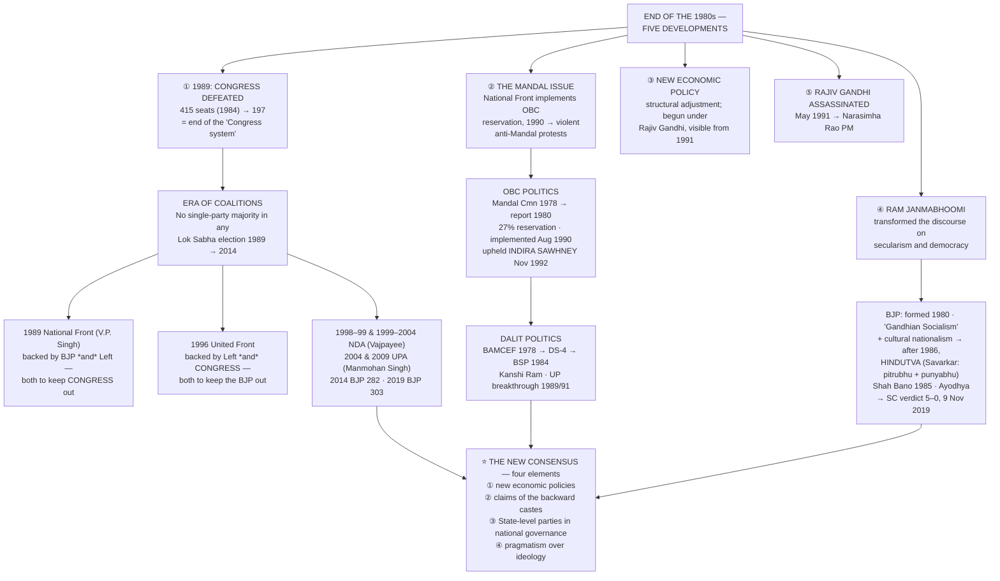
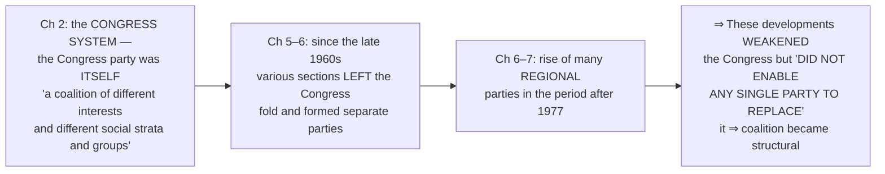
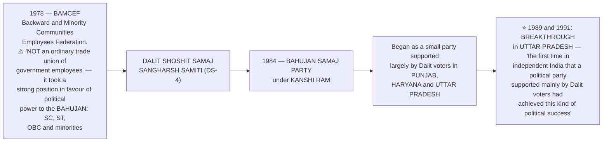
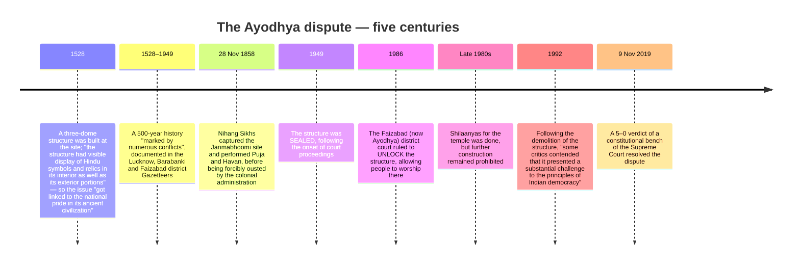

# Chapter 8: Recent Developments in Indian Politics

> ⚠️ **Filename note:** the PDF here is named `08_Regional_Aspirations.pdf`, but it actually contains **Chapter 8, "Recent Developments in Indian Politics."** Regional Aspirations is file 07. Go by content in this folder.

## 🎯 Chapter Outcome — what you should walk away with

> **The one thing this chapter exists to teach:** the party system became **more competitive and less ideological at the same time.** Fierce electoral conflict now sits on top of **a broad four-part consensus** — on economic reform, on backward-caste claims, on the role of State-level parties, and on pragmatism over ideology.

**After reading it, here is what you now understand:**

1. **The five developments that closed the 1980s** — the **1989 defeat of the Congress (415 seats in 1984 → 197)**, the rise of the **Mandal issue**, the turn to **new economic reforms**, the **Ram Janmabhoomi** dispute becoming central, and the **assassination of Rajiv Gandhi (May 1991)**.
2. **What exactly ended in 1989** — not the Congress, but **"the kind of centrality it earlier enjoyed in the party system."** The Congress **still ruled more than any other party** after 1989.
3. **Why coalitions became structural, not accidental** — sections had been **leaving the Congress fold since the late 1960s** and regional parties rose after 1977; these weakened the Congress **without enabling any single party to replace it**. **No party won a clear majority in any Lok Sabha election from 1989 until 2014.**
4. **How unstable the alignments were** — in **1989** the **Left *and* the BJP** both supported the National Front to keep the Congress out; in **1996** the **Left *and* the Congress** both supported the United Front to keep the BJP out.
5. **The Mandal Commission properly** — officially the **Second Backward Classes Commission**, appointed **1978**, chaired by **B.P. Mandal**, reporting in **1980**; it held that **"backward classes" should mean "backward castes"**, and recommended **27% reservation** plus **land reform**. Implemented **August 1990**; upheld in the **Indira Sawhney case, November 1992**.
6. **The Dalit political line** — **BAMCEF (1978)** → **DS-4** → **BSP (1984)** under **Kanshi Ram**, with the breakthrough in **Uttar Pradesh in 1989 and 1991** — "the first time in independent India that a political party supported mainly by Dalit voters had achieved this kind of political success."
7. **The BJP's trajectory** — **formed 1980** from the erstwhile Jana Sangh, initially on **"Gandhian Socialism" plus cultural nationalism**; **after 1986** emphasising nationalism and **Hindutva** (Savarkar's *pitrubhu* and *punyabhu*); the **Shah Bano case (1985)** and the **Ayodhya issue** becoming central; then **1998, 1999, 2014 (282 — the first single-party majority in 30 years) and 2019 (303)**.
8. **The four elements of the new consensus** — new economic policies; the political and social claims of the backward castes; the role of **State-level parties** in national governance; and **pragmatism over ideology** in forming alliances.

**Self-check — answer these three without looking:**
1. What was the Mandal Commission's official name, and what was its central definitional move?
2. Name the two occasions when ideological opposites supported the same government, and what each was trying to prevent.
3. State the four elements of the new consensus.

**Where this leads:** this is the last chapter — it closes the arc that began with **Ch 2's Congress system**, ending in **"a more competitive politics, but politics that is based on a certain implicit agreement among the main political actors."**

---

## 🗺️ The chapter in one picture



---

## The Big Idea

**"In this last chapter we take a synoptic view of the last two decades of politics in India."** The chapter is unusually candid about its own limits:

> **"These developments are complex, for various kinds of factors came together to produce unanticipated outcomes… The new era in politics was impossible to foresee; it is still very difficult to understand. These developments are also controversial, for these involve deep conflicts and we are still too close to the events."**

**And its stated method:** *"The chapter does not answer these questions. It simply gives you the necessary information and some tools so that you can ask and answer these questions when you are through with this book. **We cannot avoid asking these questions just because they are politically sensitive, for the whole point of studying the history of politics in India since Independence is to make sense of our present.**"*

**The four questions it poses:**
1. What are the implications of **the rise of coalition politics** for our democracy?
2. What is **Mandalisation** all about, and how will it change the nature of political representation?
3. What is the **legacy of the Ram Janmabhoomi movement**?
4. What does **the rise of a new policy consensus** do to the nature of political choices?

---

## PART 1 — THE CONTEXT OF THE 1990s: FIVE DEVELOPMENTS

Rajiv Gandhi became Prime Minister after Indira Gandhi's assassination and led the Congress to **a massive victory in 1984**. Then, as the eighties closed, **five developments** made a long-lasting impact.

### ① The defeat of the Congress, 1989

```
   THE CONGRESS COLLAPSE
   ═══════════════════════════════════════════
   1984   415 seats  ████████████████████
   1989   197 seats  █████████
   ═══════════════════════════════════════════
```

- The Congress **improved its performance and came back to power after the mid-term elections of 1991.**
- **⭐ But "the elections of 1989 marked the end of what political scientists have called the 'Congress system'."**
- **⚠️ The precise formulation matters:** "To be sure, the Congress **remained an important party and ruled the country more than any other party even in this period since 1989**. But **it lost the kind of centrality it earlier enjoyed in the party system**." Never write that the Congress collapsed — write that it **lost centrality**.

### ② The rise of the Mandal issue
Following the **decision by the new National Front government in 1990 to implement the recommendation of the Mandal Commission** that **jobs in central government should be reserved for the Other Backward Classes.** This led to **violent 'anti-Mandal' protests in different parts of the country.** The dispute between supporters and opponents of OBC reservations **"was to play an important role in shaping politics since 1989."**

### ③ The new economic policy
**"The economic policy followed by the various governments took a radically different turn"** — the **structural adjustment programme** or **new economic reforms**.
- **Started by Rajiv Gandhi**, these changes **"first became very visible in 1991"** and **"radically changed the direction that the Indian economy had pursued since Independence."**
- **⚠️ Note both halves:** "These policies have been **widely criticised by various movements and organisations**. But **the various governments that came to power in this period have continued to follow these.**"
- The photograph the chapter uses: **Manmohan Singh, then Finance Minister, with Prime Minister Narasimha Rao**, in the initial phase of the New Economic Policy.

### ④ The Ram Janmabhoomi dispute
**"The centuries old legal and political dispute over the Ram Janmabhoomi Temple in Ayodhya started influencing the politics of India."** The movement, **"becoming the central issue, transformed the direction of the discourse on secularism and democracy."** These changes **"culminated in the construction of the Ram Temple at Ayodhya following the decision of the constitutional bench of the Supreme Court, announced on 9 November 2019."**

### ⑤ The assassination of Rajiv Gandhi, May 1991
**Assassinated by a Sri Lankan Tamil linked to the LTTE**, while **on an election campaign tour in Tamil Nadu.** In the 1991 elections the **Congress emerged as the single largest party**, and following his death **the party chose Narasimha Rao as Prime Minister.**

---

## PART 2 — THE ERA OF COALITIONS

### The 1989 arrangement
The 1989 elections **defeated the Congress but "did not result in a majority for any other party."**
- **Though the Congress was the largest party in the Lok Sabha, it did not have a clear majority and decided to sit in the opposition.**
- The **National Front** — itself **an alliance of the Janata Dal and some other regional parties** — **"received support from two diametrically opposite political groups: the BJP and the Left Front."**
- **⚠️ "On this basis, the National Front formed a coalition government, but the BJP and the Left Front did not join in this government."** They supported from outside.

### Why the Congress declined, and why nothing replaced it

> **"The nineties saw yet another challenge to the predominant position of the Congress. It did not, however, mean the emergence of any other single party to fill in its place."**

**What was actually new after 1989** — the chapter is precise, and this is often misunderstood:
- **"A large number of political parties always contested elections in our country. Our Parliament always had representatives from several political parties."**
- **⭐ "What happened after 1989 was the emergence of several parties in such a way that *one or two parties did not get most of the votes or seats*."**
- **⭐ "No single party secured a clear majority of seats in any Lok Sabha election held since 1989 till 2014."** In **2014 and 2019 the BJP got a clear majority on its own.**

**The long-term causes — connect back through the book:**



> ⭐ **The framing to use in an answer: "The era of coalition governments may be seen as a long-term trend resulting from relatively silent changes that were taking place over the last few decades."** The coalition moved **from inside one party to between several parties.**

### 🔄 Alliance politics — and how unstable the equations were

**The nineties saw "the emergence of powerful parties and movements that represented the Dalit and backward castes"**, many of which **also represented powerful regional assertion.** These parties played an important role in the **United Front government of 1996**.

| | **1989 — National Front** | **1996 — United Front** |
|---|---|---|
| **Composition** | Janata Dal + some regional parties | Janata Dal + several regional parties |
| **Supported by** | **The BJP *and* the Left Front** | **The Left *and* the Congress** |
| **Purpose of the alliance** | **Both wanted to keep the Congress out of power** | **Both wanted to keep the BJP out of power** |
| **Who stayed out** | The BJP and Left did not join the government | **The BJP did not support the government** |

> ⭐ **"This shows how unstable the political equations were."** The same Left Front supported both; its partner changed from the BJP to the Congress within seven years.

### The BJP's rise through the coalition era

- **It "continued to consolidate its position in the elections of 1991 and 1996."**
- **It emerged as the largest party in 1996 and was invited to form the government — but "most other parties were opposed to its policies and therefore the BJP government could not secure a majority in the Lok Sabha."**
- **It finally came to power leading a coalition from May 1998 to June 1999**, and **was re-elected in October 1999.**
- **Atal Behari Vajpayee was Prime Minister during both these NDA governments, and his government formed in 1999 completed its full term.**

**The pattern from 1989 onward:** **"there have been eleven governments at the Centre, all of which have either been coalition governments or minority governments supported by other parties which did not join the government."** In this phase **"any government could be formed only with the participation or support of many regional parties"** — the **National Front (1989)**, the **United Front (1996 and 1997)**, the **BJP-led coalition (1998)**, the **NDA (1999)**, and the **UPA (2004 and 2009)**. **"However, this trend changed in 2014."**

> 💬 **The two margin questions the chapter plants, both worth writing on:** *"Does that mean that we will always have coalitions? Or can the national parties consolidate their positions again?"* and *"I am more worried about what they do. Does a coalition government involve more compromises? Can we not have bold and imaginative policies in a coalition?"*

---

## PART 3 — THE POLITICAL RISE OF OTHER BACKWARD CLASSES

### What OBC means
**"This refers to the administrative category 'Other Backward Classes'. These are communities other than SC and ST who suffer from educational and social backwardness. These are also referred to as 'backward castes'."**

### The line of descent
- Support for the Congress among many sections of the backward castes **had declined** (Ch 6).
- **"This created a space for non-Congress parties that drew more support from these communities."**
- **The rise first found political expression at the national level in the Janata Party government of 1977** — many of its constituents, **like the Bharatiya Kranti Dal and the Samyukta Socialist Party, had a powerful rural base among some sections of the OBC.**
- **In the 1980s the Janata Dal brought together a similar combination of political groups with strong support among the OBCs.**

### 📋 The Mandal Commission — the full box

| Question | Answer |
|---|---|
| **Where did OBC reservation already exist?** | **In southern States since the 1960s, if not earlier.** **"But this policy was not operative in north Indian States."** |
| **Who raised it in the north?** | The demand was **strongly raised during the Janata Party government of 1977–79**. **⭐ Karpoori Thakur, then Chief Minister of Bihar, "was a pioneer in this direction"** — his government **introduced a new policy of reservations for OBCs in Bihar** |
| **When was the Commission appointed?** | **1978**, by the central government, to look into and recommend ways to improve the conditions of the backward classes |
| **What is its official name?** | **⭐ The Second Backward Classes Commission** — "this was the second time since Independence that the government had appointed such a commission" |
| **Why is it called the Mandal Commission?** | After its Chairperson, **Bindeshwari Prasad Mandal** |
| **What was it set up to do?** | To **investigate the extent of educational and social backwardness** among various sections; **recommend ways of identifying these "backward classes"**; and recommend **ways in which this backwardness could be ended** |
| **When did it report?** | **1980 — "by then the Janata government had fallen"** |

**⭐ Its central definitional move — this is the most examinable single point:**
> **The Commission advised that "backward classes" should be understood to mean "backward castes", since many castes other than the Scheduled Castes were also treated as low in the caste hierarchy.**

**Its findings and recommendations:**
- A survey found that **these backward castes had a very low presence both in educational institutions and in employment in public services.**
- It therefore recommended **reserving 27 per cent of seats in educational institutions and government jobs** for these groups.
- **⚠️ "The Mandal Commission also made many other recommendations, like land reform, to improve the conditions of the OBCs."** *(Almost always forgotten — reservation was not its only proposal.)*

**Implementation and litigation:**
- **August 1990:** the **National Front government** decided to implement the recommendation on **reservations for OBCs in jobs in the central government and its undertakings.**
- **"This decision sparked agitations and violent protests in many cities of north India."**
- It was **challenged in the Supreme Court** — **the *Indira Sawhney* case, after the name of one of the petitioners.**
- **⭐ In November 1992 the Supreme Court gave a ruling upholding the decision of the government.**
- **"There were some differences among political parties about the manner of implementation. But now the policy of reservation for OBCs has support of all the major political parties of the country."**

**👤 B.P. Mandal (1918–1982):** MP from Bihar for **1967–1970 and 1977–1979**; chaired the **Second Backward Classes Commission**; a **socialist leader from Bihar**; **Chief Minister of Bihar for just a month and a half in 1968**; joined the **Janata Party in 1977**.

### What Mandalisation did to politics

> ⭐ **"The intense national debate for and against reservation in jobs made people from the OBC communities *more aware of this identity*. Thus, it helped those who wanted to mobilise these groups in politics."**

This period saw **the emergence of many parties that sought better opportunities for OBCs in education and employment** and **"also raised the question of the share of power enjoyed by the OBCs."** Their argument was democratic in form: **"since OBCs constituted a large segment of Indian society, it was only democratic that the OBCs should get adequate representation in administration and have their due share of political power."**

### ✊ The political fallout — the rise of Dalit politics



**The BSP's logic — "an organisation based on pragmatic politics":** it **"derived confidence from the fact that the Bahujans (SC, ST, OBC and religious minorities) constituted the majority of the population, and were a formidable political force on the strength of their numbers."**

Since then the BSP **"has emerged as a major political player in the State and has been in government on more than one occasion. Its strongest support still comes from Dalit voters, but it has expanded its support now to various other social groups."**

> ⚠️ **The complication to note: "In many parts of India, Dalit politics and OBC politics have developed *independently and often in competition with each other*."** They are not one bloc.

**👤 Kanshi Ram (1934–2006):** proponent of **Bahujan empowerment** and founder of the **BSP**; **left his central government job for social and political work**; founder of **BAMCEF, DS-4 and finally the BSP in 1984**; **"an astute political strategist, he regarded political power as master key to attaining social equality"**; credited with the **Dalit resurgence in north Indian States.**

> 💬 **The two margin questions, which are the right ones to carry into an essay:** *"Will this benefit leaders of all the backward and Dalit communities? Or will the gains be monopolised by some powerful castes and families within these groups?"* and *"The real point is not the leaders but the people! Will this lead to better policies and effective implementation for the really deprived people? Or will it remain just a political game?"*

---

## PART 4 — COMMUNALISM, SECULARISM, DEMOCRACY

### The formation and turn of the BJP

| Stage | Development |
|---|---|
| **After the Emergency** | The **Bharatiya Jana Sangh had merged with the Janata Party** (Ch 6) |
| **1980** | After the fall and break-up of the Janata Party, **the supporters of the erstwhile Jana Sangh formed the Bharatiya Janata Party** |
| **Initially** | **"The BJP adopted a broader political platform than that of the Jana Sangh"** — it **"embraced 'Gandhian Socialism' along with cultural nationalism as its ideology"** |
| **1984** | **"It did not get much success in the elections"** |
| **⭐ After 1986** | **"The party began to emphasise nationalism as the core of its ideology. The BJP also pursued the politics of 'Hindutva' for political mobilisation."** |

**What Hindutva means, as the chapter defines it:**
> **Popularised by Vinayak Damodar Savarkar as the basis of Indian nationhood, it "basically meant that to be an Indian, one must accept India as their *fatherland* (pitrubhu) as well as their *holy land* (punyabhu)."** Believers argue that **"a strong nation can be built on the basis of a united national culture"**, and that **in India, Hindutva can provide this base.**

### ⚖️ The Shah Bano case, 1985

| Stage | What happened |
|---|---|
| **The case** | A **62-year-old divorced Muslim woman** filed a case for **maintenance from her former husband** |
| **The judgment** | **The Supreme Court ruled in favour of Shah Bano** |
| **The reaction** | **"The orthodox Muslims saw the Supreme Court's order as an interference in Muslim Personal Law"** |
| **The legislation** | **On the demand of some Muslim leaders, the government passed the Muslim Women (Protection of Rights on Divorce) Act, 1986, that nullified the Supreme Court's judgement** |
| **The opposition** | **"This action of the government was opposed by many women's organisations, many Muslim groups and most of the intellectuals"** |
| **The political use** | **"The BJP criticised this action of the Congress government as an unnecessary concession and 'appeasement' of the minority community"** |

*(This is the classic case for the tension between **personal law and gender justice** — see exercise 2.)*

### 🛕 The Ayodhya issue

**The chapter's framing:** the issue was **"deeply rooted in socio-cultural and political history of the country pertaining to different perspectives from various stakeholders. It involved contentions regarding the birth place of Shri Ram, one of the most holy religious sites, and its legal ownership."**



**The competing positions, as the chapter states them:** **"The Hindu community felt that their concerns related to the birth place of Shri Ram were overlooked, while the Muslim community sought assurance of their possession over the structure."** Tensions heightened over ownership rights, **"resulting in numerous disputes and legal conflicts. Both communities desired a fair resolution to the longstanding issue."**

### 🤝 From legal proceedings to amicable acceptance

> **"It is important to note that in any society conflicts are bound to take place. However, in a multi-religious and multi-cultural democratic society, these conflicts are usually resolved following the due process of law."**

**The route to resolution:** **"through a number of democratic and legal procedures including court hearings, mediation attempts, popular movements, and finally with a 5-0 verdict of a constitutional bench of the Supreme Court on November 9, 2019."** The verdict **"sought to reconcile the conflicting interests of the various stakeholders."**

**What the verdict did — both halves:**
1. **Allotted the disputed site to the Shri Ram Janmabhoomi Teertha Kshetra Trust** for the construction of the Ram temple.
2. **Directed the concerned government to allot an appropriate site for the construction of a Mosque to the Sunni Central Waqf Board.**

**The chapter's assessment:** "In this way, **democracy gives room for conflict resolution in a plural society like ours, upholding the inclusive spirit of the Constitution.** This issue was resolved following the due process of law based on evidences such as **archaeological excavations and historical records**… It is **a classic example of consensus building on a sensitive issue that shows the maturity of democratic ethos which are civilizationally ingrained in India.**"

**📜 The two extracts from the judgment that the chapter reproduces — worth quoting directly:**
> *"At the heart of the Constitution is a commitment to equality upheld and enforced by the rule of law. Under our Constitution, **citizens of all faiths, beliefs and creeds seeking divine provenance are both subject to the law and equal before the law.** Every judge of this Court is not merely tasked with but sworn to uphold the Constitution and its values. **The Constitution does not make a distinction between the faith and belief of one religion and another. All forms of belief, worship and prayer are equal.**"* — p. 920

> *"It is thus concluded… that **faith and belief of Hindus since prior to construction of Mosque and subsequent thereto has always been that Janmaasthan of Lord Ram is the place where Babri Mosque has been constructed**, which faith and belief is proved by documentary and oral evidence discussed above."* — p. 1045

---

## PART 5 — THE EMERGENCE OF A NEW CONSENSUS

### The electoral record, 1989 onward

**The chapter's own analytical prompts on the seat/vote charts:**
- **BJP and Congress "were engaged in a tough competition in this period"** — compare their fortunes against **1984**.
- **"Since the 1989 election, the votes polled by the two parties, Congress and the BJP, most of the time, add up to more than fifty per cent — except in 1996, 2004 and 2009."**
- Identify which of today's parties belong to **neither the Congress "family" nor the Janata "family"**.
- **"The political competition during the nineties is divided between the coalition led by BJP and the coalition led by the Congress"** — and list the parties in neither.

### 📊 Lok Sabha elections, 2004–2019

| Year | What happened |
|---|---|
| **2004** | **The Congress too entered into coalitions in a big way.** The **NDA was defeated** and the **United Progressive Alliance (UPA)** came to power, **supported by the Left Front parties.** A **partial revival of the Congress** — it increased its seats for the first time since 1991. **⚠️ "There was a negligible difference between the votes polled by the Congress and its allies and the BJP and its allies."** |
| **2008** | **The Left parties withdrew support in July 2008 over the Indo-US nuclear deal** — but **the UPA government completed its term** |
| **2009** | The Congress rose **from 145 seats (2004) to 206**; **Manmohan Singh sworn in for a second term** |
| **Sept 2013** | The BJP declared **Narendra Modi**, then Chief Minister of Gujarat, as its **Prime Ministerial candidate** |
| **2014** | **The BJP won 282 seats on its own — "the first party to gain single party majority after 30 years."** **⭐ Despite that majority, "BJP did choose to form the NDA government with its coalition partners."** The chapter calls 2014 **"a proverbial watershed moment of Indian politics"**, with the government taking rapid decisions in **social sector, foreign policy and economic policy** |
| **2019** | **The BJP again emerged victorious with 303 seats of its own.** **"Even when BJP is getting full majority, the recognition of coalition politics is still relevant."** |

**Party position in the 17th Lok Sabha (2019):**

```
   BJP    303  ██████████████████████████████  56%
   INC     52  █████                           10%
   DMK     24  ██                               4%
   SS      18  ██                               3%
   JD(U)   16  █                                3%
   BJD     12  █                                2%
   BSP     10  █                                2%
   Others 108  ██████████                      20%
   ─────────────────────────────────────────────────
   Total  543  (530 from States + 13 from UTs)
```

### ⭐⭐ The four elements of the growing consensus

> **"However, on many crucial issues, a broad agreement has emerged among most parties. In the midst of severe competition and many conflicts, a consensus appears to have emerged."**

| # | Element | The detail |
|---|---|---|
| **1** | **Agreement on new economic policies** | **"While many groups are opposed to the new economic policies, most political parties are in support"** — believing they **"would lead the country to prosperity and a status of economic power in the world"** |
| **2** | **Acceptance of the political and social claims of the backward castes** | **"All political parties now support reservation of seats for the 'backward classes' in education and employment"**, and are **"willing to ensure that the OBCs get adequate share of power"** |
| **3** | **Acceptance of the role of State level parties in governance of the country** | **"The distinction between State level and national level parties is fast becoming less important"** — State-level parties **share power at the national level** and have **"played a central role in the country's politics"** |
| **4** | **Emphasis on pragmatic considerations rather than ideological positions** | **"Coalition politics has shifted the focus of political parties from ideological differences to power sharing arrangements."** The example given: **"most parties of the NDA did not agree with the 'Hindutva' ideology of the BJP. Yet, they came together to form a government and remained in power for a full term."** |

### The closing argument of the whole book

> **"We started this study of politics in India with the discussion of how the Congress emerged as a dominant party. From that situation, we have now arrived at *a more competitive politics, but politics that is based on a certain implicit agreement among the main political actors*."**

**And the counter-current the chapter is careful to name:** "Even as political parties act within the sphere of this consensus, **popular movements and organisations are simultaneously identifying new forms, visions and pathways of development.** Issues like **poverty, displacement, minimum wages, livelihood and social security** are being put on the political agenda by people's movements, **reminding the state of its responsibility.** Similarly, **issues of justice and democracy are being voiced by the people in terms of class, caste, gender and regions.**"

> ⭐ **The final sentence of the book: "We cannot predict the future of democracy. All we know is that *democratic politics is here to stay in India* and that it will unfold through a continuous churning of some of the factors mentioned in this chapter."**

**And the question it leaves you with:** "Around the time of India's independence, many other countries also became independent and adopted democracy. However, even as **India emerged as a mature democracy playing a great role in promoting social equality and national development, the same has not been the case in some of those countries.** Discuss… **the factors that have enabled democracy to thrive in India.**"

---

## Key Words (Glossary)

| Term | Meaning |
|---|---|
| **End of the "Congress system"** | 1989 — the Congress **lost "the kind of centrality it earlier enjoyed"**, though it remained an important party that ruled more than any other after 1989 |
| **Coalition government** | Government by an alliance of parties; from 1989 to 2014, **no single party won a clear majority in any Lok Sabha election** |
| **National Front (1989)** | Janata Dal + regional parties, supported **from outside** by **two diametrically opposite groups — the BJP and the Left Front** |
| **United Front (1996)** | Janata Dal + regional parties, supported by **the Left and the Congress**, both to keep the BJP out |
| **OBC** | **Other Backward Classes** — communities other than SC and ST **"who suffer from educational and social backwardness"**; also called **backward castes** |
| **Mandal Commission** | Officially the **Second Backward Classes Commission**; appointed **1978**, chaired by **B.P. Mandal**, reported **1980**; held that **"backward classes" means "backward castes"**; recommended **27% reservation** and **land reform** |
| ***Indira Sawhney* case** | The Supreme Court challenge to the 1990 implementation; **decided November 1992, upholding the government** |
| **BAMCEF** | **Backward and Minority Communities Employees Federation (1978)** — **not an ordinary trade union**; argued for political power to the **bahujan** |
| **Bahujan** | **SC, ST, OBC and religious minorities** — a majority of the population, and hence, on the BSP's reasoning, a formidable political force |
| **Hindutva** | Popularised by **V.D. Savarkar** as the basis of Indian nationhood: to be Indian, one must accept India as both ***pitrubhu* (fatherland)** and ***punyabhu* (holy land)** |
| **Shah Bano case (1985)** | A 62-year-old divorced Muslim woman won maintenance in the Supreme Court; the **Muslim Women (Protection of Rights on Divorce) Act, 1986** nullified the judgment |
| **Structural adjustment / new economic reforms** | The radically different economic direction **started by Rajiv Gandhi** and **visible from 1991** |
| **The new consensus** | Four elements — new economic policies, backward-caste claims, State-level parties in national governance, and **pragmatism over ideology** |

---

## Quick Recap (15 points)

1. **Five developments closed the 1980s:** the **1989 Congress defeat (415 → 197)**, the **Mandal issue**, the **new economic policy**, the **Ram Janmabhoomi dispute**, and **Rajiv Gandhi's assassination in May 1991** by a Sri Lankan Tamil linked to the LTTE → **Narasimha Rao** as PM.
2. **1989 ended the "Congress system", not the Congress** — it **"lost the kind of centrality it earlier enjoyed"** while still ruling more than any other party in the period.
3. **The 1989 National Front** (Janata Dal + regional parties) was supported from outside by **the BJP and the Left Front** — **diametrically opposite groups** — neither of which joined.
4. **What was new after 1989** was not many parties but that **"one or two parties did not get most of the votes or seats"**; **no clear single-party majority from 1989 until 2014**.
5. **Coalitions were a long-term trend, not an accident:** the Congress had *itself* been a coalition (Ch 2); sections left it from the late 1960s; regional parties rose after 1977; together these **weakened the Congress without producing a replacement**.
6. **The instability of alignments:** **1989 — BJP + Left** both back the National Front to keep the **Congress** out; **1996 — Left + Congress** both back the United Front to keep the **BJP** out.
7. **BJP's path to power:** consolidation in **1991 and 1996**; largest party in 1996 but **could not secure a majority**; **coalition government May 1998 – June 1999**; **re-elected October 1999**, and the **Vajpayee government of 1999 completed its full term**.
8. **Eleven governments since 1989**, all coalitions or minority governments — National Front 1989, United Front 1996 and 1997, BJP-led 1998, NDA 1999, UPA 2004 and 2009 — **"however, this trend changed in 2014."**
9. **OBC politics:** first national expression in the **Janata Party of 1977** (BKD, SSP with rural OBC bases); the **Janata Dal** in the 1980s; and the Mandal debate itself **"made people from the OBC communities more aware of this identity."**
10. **The Mandal Commission:** OBC reservation already existed **in southern States since the 1960s** but not in the north; **Karpoori Thakur of Bihar was the pioneer**; appointed **1978** as the **Second Backward Classes Commission**; reported **1980**; equated **"backward classes" with "backward castes"**; recommended **27% reservation** and also **land reform**; implemented **August 1990**; sparked **violent protests**; upheld in ***Indira Sawhney*, November 1992**; **now supported by all major parties**.
11. **Dalit politics:** **BAMCEF (1978)** — **not an ordinary trade union** — → **DS-4** → **BSP (1984)** under **Kanshi Ram**, who **"regarded political power as master key to attaining social equality"**; breakthrough in **UP in 1989 and 1991**, the first such success for a mainly Dalit-supported party. **Dalit and OBC politics often compete with each other.**
12. **The BJP:** formed **1980**; initially **"Gandhian Socialism" plus cultural nationalism**; little success in **1984**; **after 1986** nationalism as core and **Hindutva** for mobilisation — Savarkar's **pitrubhu and punyabhu**.
13. **Shah Bano (1985):** SC ruled for maintenance → orthodox Muslims saw interference in personal law → the **Muslim Women (Protection of Rights on Divorce) Act, 1986** nullified it → opposed by **women's organisations, many Muslim groups and most intellectuals** → the BJP called it **"appeasement."**
14. **Ayodhya:** structure built **1528**; conflicts documented in the **Lucknow, Barabanki and Faizabad Gazetteers**; **Nihang Sikhs performed puja there on 28 November 1858**; **sealed 1949**; **unlocked by the Faizabad district court in 1986**; *shilaanyas* done but construction prohibited; **demolition in 1992**, which critics called **"a substantial challenge to the principles of Indian democracy"**; resolved by a **5–0 constitutional bench verdict on 9 November 2019** — site to the **Shri Ram Janmabhoomi Teertha Kshetra Trust**, and an appropriate site for a mosque to the **Sunni Central Waqf Board**.
15. **⭐ The four-part consensus:** new economic policies; the political and social claims of the **backward castes**; the role of **State-level parties**; and **pragmatism over ideology** — evidenced by NDA partners who **did not accept Hindutva yet governed for a full term**. Meanwhile **people's movements** keep **poverty, displacement, minimum wages, livelihood and social security** on the agenda. **"Democratic politics is here to stay in India."**

---

## 60-Second Revision

**FIVE DEVELOPMENTS: ① 1989 CONGRESS DEFEAT — 415 (1984) → 197 = END OF THE "CONGRESS SYSTEM" (but it "lost the kind of CENTRALITY it earlier enjoyed", not its existence — it still ruled more than any other party) ② MANDAL ISSUE — National Front implements OBC reservation 1990 → violent anti-Mandal protests ③ NEW ECONOMIC POLICY / structural adjustment — STARTED BY RAJIV GANDHI, visible 1991; widely criticised BUT all governments continued it (Manmohan Singh as FM under NARASIMHA RAO) ④ RAM JANMABHOOMI — "transformed the direction of the discourse on secularism and democracy" → SC verdict 9 NOV 2019 ⑤ RAJIV GANDHI ASSASSINATED MAY 1991 by a Sri Lankan Tamil linked to the LTTE, campaigning in Tamil Nadu → NARASIMHA RAO PM.** **1989 NATIONAL FRONT (Janata Dal + regional parties, V.P. SINGH) supported from OUTSIDE by TWO DIAMETRICALLY OPPOSITE GROUPS — BJP and LEFT FRONT — neither joined.** **What was NEW after 1989: not many parties, but that "ONE OR TWO PARTIES DID NOT GET MOST OF THE VOTES OR SEATS"; NO SINGLE-PARTY MAJORITY 1989 → 2014.** **COALITIONS WERE A LONG-TERM TREND: the Congress was ITSELF a coalition (Ch 2) → sections left from the late 1960s → regional parties rose after 1977 → weakened the Congress but "DID NOT ENABLE ANY SINGLE PARTY TO REPLACE" it.** **UNSTABLE EQUATIONS: 1989 BJP+LEFT back the National Front to keep CONGRESS out; 1996 LEFT+CONGRESS back the United Front to keep BJP out.** **BJP: consolidates 1991 + 1996; largest party 1996 but could NOT secure a majority; coalition MAY 1998–JUNE 1999; re-elected OCT 1999; VAJPAYEE's 1999 govt COMPLETED ITS FULL TERM. ELEVEN governments since 1989, all coalition or minority — National Front 1989, United Front 1996+1997, BJP-led 1998, NDA 1999, UPA 2004+2009 — "this trend changed in 2014."** **OBC: communities other than SC/ST suffering EDUCATIONAL AND SOCIAL BACKWARDNESS = "backward castes". First national expression = JANATA PARTY 1977 (BKD, SSP had rural OBC bases) → JANATA DAL in the 1980s.** **⭐ MANDAL: OBC reservation existed in SOUTHERN states since the 1960s, NOT in the north; KARPOORI THAKUR (CM Bihar) the PIONEER; commission appointed 1978, officially the SECOND BACKWARD CLASSES COMMISSION, chaired by BINDESHWARI PRASAD MANDAL; reported 1980 (Janata govt had already fallen); KEY MOVE: "backward CLASSES" should mean "backward CASTES"; survey found very low presence in education AND public employment; recommended 27% RESERVATION — plus OTHER recommendations LIKE LAND REFORM. Implemented AUGUST 1990 by the National Front → agitations and violent protests in north Indian cities → challenged as INDIRA SAWHNEY → SC UPHELD IT NOVEMBER 1992 → now supported by ALL major parties. Effect: the debate "made people from the OBC communities MORE AWARE OF THIS IDENTITY."** **DALIT: BAMCEF 1978 (⚠️ "NOT an ordinary trade union" — argued for political power to the BAHUJAN = SC+ST+OBC+minorities) → DALIT SHOSHIT SAMAJ SANGHARSH SAMITI (DS-4) → BSP 1984, KANSHI RAM ("political power as MASTER KEY to attaining social equality"); small party in PUNJAB, HARYANA, UP → BREAKTHROUGH IN UP 1989 + 1991 = FIRST time a mainly-Dalit-supported party achieved such success. ⚠️ Dalit and OBC politics often develop INDEPENDENTLY AND IN COMPETITION.** **BJP FORMED 1980 from the erstwhile Jana Sangh (which had merged into the Janata Party after the Emergency); initially "GANDHIAN SOCIALISM" + cultural nationalism; little success 1984; AFTER 1986 nationalism as CORE + HINDUTVA for mobilisation. HINDUTVA (popularised by V.D. SAVARKAR): to be Indian one must accept India as PITRUBHU (fatherland) AND PUNYABHU (holy land); a strong nation built on a UNITED NATIONAL CULTURE.** **SHAH BANO 1985: 62-year-old divorced Muslim woman, SC ruled in her favour on maintenance → orthodox Muslims saw INTERFERENCE IN MUSLIM PERSONAL LAW → govt passed the MUSLIM WOMEN (PROTECTION OF RIGHTS ON DIVORCE) ACT 1986 NULLIFYING the judgment → opposed by WOMEN'S ORGANISATIONS, many MUSLIM GROUPS and MOST INTELLECTUALS → BJP called it "APPEASEMENT."** **AYODHYA: three-dome structure built 1528 with Hindu symbols and relics inside and outside → linked to national pride in ancient civilisation; 500 years of conflict documented in LUCKNOW, BARABANKI, FAIZABAD gazetteers; 28 NOV 1858 NIHANG SIKHS performed Puja and Havan, forcibly ousted by the colonial administration; SEALED 1949 on court proceedings; UNLOCKED by the FAIZABAD district court in 1986; SHILAANYAS done but construction prohibited; DEMOLITION 1992 — critics: "a substantial challenge to the principles of Indian democracy"; resolved by a 5–0 CONSTITUTIONAL BENCH verdict, 9 NOVEMBER 2019 → site to the SHRI RAM JANMABHOOMI TEERTHA KSHETRA TRUST + an appropriate site for a MOSQUE to the SUNNI CENTRAL WAQF BOARD, on evidence including ARCHAEOLOGICAL EXCAVATIONS and HISTORICAL RECORDS. Judgment: "All forms of belief, worship and prayer are equal."** **2004: Congress enters coalitions "in a big way" → NDA defeated → UPA with LEFT support; PARTIAL REVIVAL (first seat increase since 1991); NEGLIGIBLE difference in votes between the two alliances. LEFT WITHDREW JULY 2008 over the INDO-US NUCLEAR DEAL but the UPA COMPLETED ITS TERM. 2009: INC 145 → 206; MANMOHAN SINGH's second term. SEPT 2013 BJP declares NARENDRA MODI its PM candidate. 2014: BJP 282 ON ITS OWN = FIRST single-party majority in 30 YEARS — yet still formed the NDA WITH PARTNERS; "a proverbial WATERSHED MOMENT." 2019: BJP 303. 17th LS: BJP 303 (56%), INC 52 (10%), DMK 24, SS 18, JD(U) 16, BJD 12, BSP 10, others 108; total 543 = 530 States + 13 UTs.** **⭐⭐ FOUR ELEMENTS OF THE NEW CONSENSUS: ① NEW ECONOMIC POLICIES (opposed by many groups, supported by most PARTIES) ② acceptance of the POLITICAL AND SOCIAL CLAIMS OF THE BACKWARD CASTES — all parties now support OBC reservation and an adequate share of power ③ acceptance of the ROLE OF STATE-LEVEL PARTIES in national governance — "the distinction between State level and national level parties is fast becoming less important" ④ PRAGMATISM OVER IDEOLOGY — "most parties of the NDA did not agree with the 'Hindutva' ideology of the BJP. Yet they came together… and remained in power for a full term."** **CLOSING: from Congress dominance to "a MORE COMPETITIVE POLITICS, but politics that is based on a certain IMPLICIT AGREEMENT among the main political actors." Meanwhile PEOPLE'S MOVEMENTS keep POVERTY, DISPLACEMENT, MINIMUM WAGES, LIVELIHOOD and SOCIAL SECURITY on the agenda, "reminding the state of its responsibility." "DEMOCRATIC POLITICS IS HERE TO STAY IN INDIA."**

---

## NCERT Exercises — with answers

**1. Arrange chronologically.**
1. **(d) Assassination of Indira Gandhi** — 31 October 1984
2. **(b) Formation of the Janata Dal** — 1988
3. **(a) Implementation of the recommendation of the Mandal Commission** — August 1990
4. **(e) The formation of the NDA government** — 1998 (re-elected 1999)
5. **(f) Formation of the UPA government** — 2004
6. **(c) Supreme Court judgment on the Ram Janmabhoomi** — 9 November 2019

**2. Match the following.**

| | |
|---|---|
| (a) **Politics of Consensus** | **(iv) Agreement on Economic policies** |
| (b) **Caste based parties** | **(ii) Rise of OBCs** |
| (c) **Personal Law and Gender Justice** | **(i) Shah Bano case** |
| (d) **Growing strength of Regional parties** | **(iii) Coalition government** |

**3. The main issues in Indian politics after 1989, and the party configurations they produced.**
**The issues were four, and each generated its own alignment.**
- **Economic reform.** The turn to structural adjustment divided **parties from movements** more than party from party — it produced **opposition from the Left and from popular organisations**, but eventually **agreement among most parties**, and so became the first element of the new consensus rather than a line of division.
- **Mandal / OBC reservation.** This produced the sharpest social cleavage — **violent anti-Mandal protests** — and generated a bloc of parties **built on backward-caste support**: the Janata Dal and its successors, the Samajwadi Party, the RJD, and in parallel the **BSP** on Dalit support. It cut *across* the Congress–BJP axis, since these parties allied at different times with both.
- **Ayodhya and Hindutva.** This produced the **BJP-led pole**, and against it a set of parties defining themselves as **secular**. It is what made the **1989 arrangement possible** (BJP and Left both outside the National Front) and what made **1996 different** (Left and Congress together to keep the BJP out).
- **Regional assertion.** Regional parties became **indispensable to any government**, which produced the era of **multi-party coalitions**.
**The resulting configurations:** the **National Front (1989)** supported by BJP *and* Left; the **United Front (1996, 1997)** supported by Left *and* Congress; the **NDA (1998, 1999)**; and the **UPA (2004, 2009)** — an alignment pattern in which **the same parties changed sides depending on which larger party they were trying to exclude.**

**4. "In the new era of coalition politics, political parties are not aligning or re-aligning on the basis of ideology." Support or oppose.**
**Arguments supporting the statement — and the chapter largely does support it.**
- It states the point outright as the fourth element of the consensus: **"coalition politics has shifted the focus of political parties from ideological differences to power sharing arrangements."**
- The decisive example is given in the text: **"most parties of the NDA did not agree with the 'Hindutva' ideology of the BJP. Yet, they came together to form a government and remained in power for a full term."**
- **1989** is even starker: the **BJP and the Left Front — diametrically opposite — supported the same government**, united only by the wish to keep the Congress out.
- **1996** reversed it: the **Left and the Congress**, long rivals, supported the same government to keep the BJP out. **"This shows how unstable the political equations were."**
- And on the biggest question of all, economic policy, **"most political parties are in support of the new economic policies"** — so there is little ideological space left to align around.
**Arguments opposing the statement.**
- Alignments are **not random**: they cluster consistently around **two poles**, one led by the BJP and one by the Congress, which suggests an underlying ideological logic about **secularism and Hindutva**.
- Parties **do act on ideology when it matters enough to cost them power**: the **Left withdrew support from the UPA in July 2008 over the Indo-US nuclear deal**, accepting the loss of influence rather than the policy.
- The consensus on **backward-caste claims** is itself the *victory* of an ideological position — the parties that pressed it did so on a principled argument about **representation and the share of power** — not the absence of one.
**A balanced conclusion:** ideology now shapes **which pole a party gravitates towards and which policies it can accept once in office**, while **pragmatism decides the specific arithmetic of who allies with whom.** Alliances are formed pragmatically; they are constrained ideologically.

**5. Trace the emergence of the BJP as a significant force in post-Emergency politics.**
1. **Absorption and re-emergence.** After the Emergency the **Bharatiya Jana Sangh merged into the Janata Party**; when the Janata Party fell and broke up, **its supporters formed the Bharatiya Janata Party in 1980.**
2. **The broad first platform.** Initially the BJP **"adopted a broader political platform than that of the Jana Sangh"**, embracing **"Gandhian Socialism" along with cultural nationalism** — and **"it did not get much success in the elections held in 1984."**
3. **The turn after 1986.** The party **"began to emphasise nationalism as the core of its ideology"** and **"pursued the politics of 'Hindutva' for political mobilisation"** — Savarkar's formula that an Indian must accept India as both **pitrubhu and punyabhu**, and that a strong nation rests on **a united national culture**.
4. **The two mobilising issues.** The **Shah Bano case (1985)** and the **Muslim Women Act of 1986**, which the BJP attacked as **"appeasement"**; and the **Ayodhya issue**, especially after the Faizabad court **unlocked the structure in 1986**.
5. **Electoral consolidation.** Support for the **National Front from outside in 1989**; growth **in 1991 and 1996**; **largest party in 1996** but unable to secure a majority because **"most other parties were opposed to its policies."**
6. **Government through coalition.** A coalition government from **May 1998 to June 1999**, re-election in **October 1999**, and a **full term completed under Vajpayee** — achieved precisely by **subordinating ideology to alliance**, since NDA partners did not accept Hindutva.
7. **Single-party majority.** **282 seats in 2014** — the first single-party majority in thirty years — and **303 in 2019**; and, notably, **it formed an NDA government with partners even when it did not need to.**

**6. "In spite of the decline of Congress dominance, the Congress party continues to influence politics in the country." Do you agree?**
**Yes — and the chapter says so explicitly.** Even while marking 1989 as the end of the Congress system, it records that the Congress **"remained an important party and ruled the country more than any other party even in this period since 1989."** What it lost was **centrality**, not relevance.
**The evidence:**
- It **returned to power at the mid-term elections of 1991** and governed under **Narasimha Rao**.
- It **shaped governments it did not lead** — in **1996 the Congress supported the United Front**, and in **1997 its withdrawal of support brought the Deve Gowda government down.** A party that can make and unmake governments from outside is not a spent force.
- It **led two full-term governments** as the **UPA in 2004 and 2009**, increasing its seats from **145 to 206**, and completing its term **even after the Left withdrew support in July 2008.**
- It **defined one of the two poles** around which the entire coalition era organised itself: "the political competition during the nineties is divided between the coalition led by BJP and the coalition led by the Congress."
- Its **policy legacy became the consensus.** The **new economic policies it initiated** are now supported by most parties, and it remains a significant presence in the states and in the **17th Lok Sabha with 52 seats.**
**The qualification:** its influence is now **that of one major pole among several**, dependent on alliances with the regional and caste-based parties that grew out of its own former social coalition — which is exactly what "loss of centrality" means.

**7. Essay — is a two-party system required for successful democracy? The advantages of India's present party system.**
**The claim rests on the idea that two parties give clear mandates, stable governments and easy accountability.** India's experience of the last three decades suggests the trade-off is real but the conclusion is wrong.
**The advantages of the present multi-party, coalition system:**
1. **It represents a society that cannot be reduced to two.** India's cleavages are **regional, caste-based, linguistic and religious simultaneously**, and no two parties can carry them all. The **rise of OBC and Dalit parties** brought into the political system communities that the two-party-like Congress system had represented only indirectly, through **factions and patronage**.
2. **It forces power sharing.** The chapter's third consensus element — **"acceptance of the role of State level parties in governance of the country"** — means States now influence national policy directly. That is precisely the remedy Chapter 7 prescribed: **"the regions must have a share in deciding the destiny of the nation."**
3. **It moderates.** A party needing partners must **avoid extreme positions**, exactly as the Congress coalition once did internally. NDA governments that included parties rejecting Hindutva had to govern on a narrower, negotiated programme.
4. **It has not, in fact, produced chronic instability.** The **Vajpayee government of 1999 completed a full term**; the **UPA completed its term even after losing Left support in 2008**; and the system has since delivered **single-party majorities in 2014 and 2019** when the electorate wanted them. The 1977–79 Janata collapse taught the voter lesson that **quarrelsome governments are punished**, and parties learned it.
5. **It preserves alternatives.** The chapter's point about the Emergency era holds generally: keeping **democratic political alternatives alive prevents resentment from turning anti-democratic.**
**The honest costs:** coalitions can dilute accountability, slow decisions, and give small parties leverage disproportionate to their votes; and pragmatism over ideology can leave voters unsure what a coalition stands for.
**Conclusion:** what democracy needs is **not two parties but genuine competition, peaceful alternation and the accommodation of diverse interests.** India has had all three with many parties — and, as Zoya Hasan's passage in exercise 8 warns, the real test is not the *number* of parties but whether they can **articulate and aggregate a variety of interests.**

**8. Zoya Hasan on the challenges facing the party system.**
**(a) The challenges of the party system.** Hasan names two. First, **"the Congress system destroyed itself"** — the party that had absorbed every interest through **factions and internal coalition** (Ch 2) was re-made after 1969 into a leader-centred organisation with **weak organisation and few factions** (Ch 5), so it could no longer perform that absorbing function. Second, **the fragmentation of that coalition "triggered a new emphasis on self-representation"** — each social group now seeks **its own party and its own leaders** rather than a share inside a larger one. That is the meaning of the OBC parties, the **BSP's bahujan claim**, and the regional parties. The resulting question is whether a party system built on **self-representation can still aggregate** — that is, combine many particular demands into a governing programme — or whether it can only **articulate** them separately.
**(b) An example of the lack of accommodation and aggregation.** The clearest is that **"in many parts of India, Dalit politics and OBC politics have developed independently and often in competition with each other."** Both are groups the old Congress coalition had held together; once outside it, they compete for the same reserved benefits and the same share of power rather than combining. A second example is the **Shah Bano sequence**, where the political system **could not aggregate** the claims of gender justice and of minority religious identity: the Supreme Court favoured one, Parliament reversed it for the other, and no party offered a settlement acceptable to both. A third is the **anti-Mandal violence of 1990**, where the demands of the upper-caste young and of the OBCs found no common political vehicle at all.
**(c) Why parties must accommodate and aggregate a variety of interests.** Because a party that only **articulates one group's demand** can win that group's votes but **cannot govern a plural society** — it must either exclude others or be excluded itself. Aggregation is what converts a set of incompatible claims into a **negotiable programme**, and it is what allowed the Congress system to govern a country of continental diversity for two decades. Where parties fail to aggregate, three things follow, all visible in this book: **conflict moves out of the party system and into the streets** (Ch 6's tension between institutional democracy and spontaneous participation); **groups conclude that only separation will secure their interests** (Ch 7's regional movements); and **governments become unstable**, since coalitions assembled purely arithmetically break when arithmetic changes. Accommodation is therefore not a courtesy but **the condition of governability** — which is why the chapter's four-part consensus, whatever its limits, is treated as an achievement.

---

## Extra UPSC-style questions

1. *"Indian politics after 1989 became more competitive and less ideological simultaneously."* Critically examine. **(250 words)**
2. Discuss the Mandal Commission's central definitional move — equating "backward classes" with "backward castes" — and its consequences for representation.
3. "Coalition politics moved the coalition from inside one party to between several parties." Evaluate this reading of the period from 1967 to 2014.
4. The Ayodhya dispute was resolved through "the due process of law". Assess what this episode reveals about conflict resolution in a plural democracy.
5. **Prelims trap check:** Which is/are correct? (i) The Mandal Commission was the First Backward Classes Commission. (ii) The *Indira Sawhney* judgment struck down OBC reservation. (iii) The BJP won a single-party majority in 2014 for the first time in 30 years. → **(iii) only.** *(It was the **Second** Backward Classes Commission, and *Indira Sawhney* **upheld** the government's decision in November 1992.)*

---

*Source: written by reading `08_Regional_Aspirations.pdf` in full — which in the current NCERT edition (Reprint 2026–27) actually contains **Chapter 8, Recent Developments in Indian Politics**. Covers main text, the five-development framing, the Mandal Commission box, the B.P. Mandal and Kanshi Ram profiles, the Hindutva and Shah Bano sections, the full Ayodhya treatment with both Supreme Court extracts, the "Do you know?" note on the Nihang Sikhs, the coalition-era tables, the 2004–2019 election record, the 17th Lok Sabha party position, the seat-share table since 2004, all cartoons and all eight exercises.*
