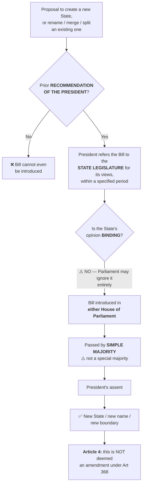
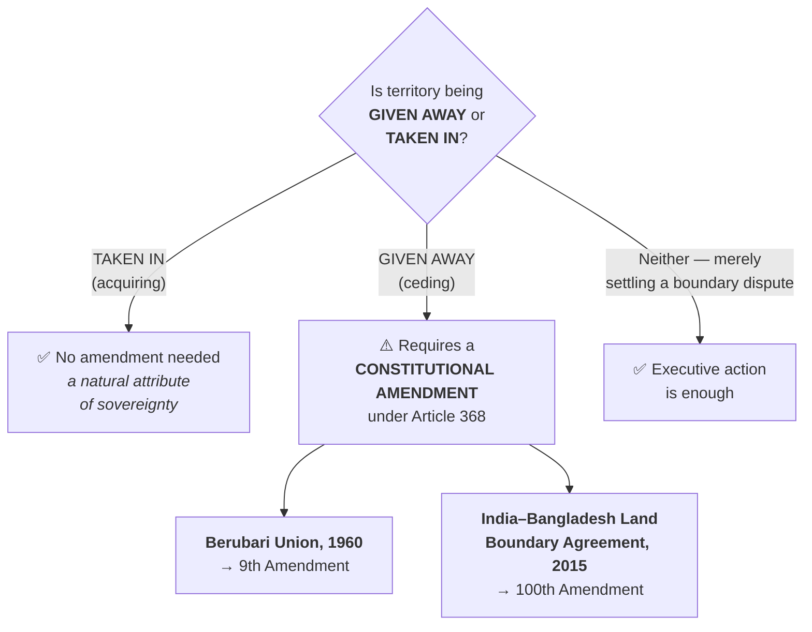

# Chapter 5 — Union and its Territory

[← Chapter 4](04_Preamble.md) · [Index](00_INDEX.md) · [Chapter 6 →](06_Citizenship.md)

**Read time ~10 min** · Articles 1–4 · Prelims: 1 question most years · Mains: asked in 2013 (smaller states) and 2025 (J&K)

---

## 🎯 The one-line point

> **Indian states have no right to exist.** Parliament can, by a simple majority, carve up a state, rename it, merge it or wipe it off the map — and the state's own opinion is **not binding**. That single fact tells you everything about how strong our Centre is.

---

## 📖 The story

In the USA, states came first and *agreed* to form a union. So an American state cannot be destroyed by Congress — it has a right to exist.

In India, it happened the other way round. The **Union came first**, and states were drawn out of it like administrative districts on a map. Ambedkar explained it in the Assembly with two blunt reasons for using the word **"Union"** instead of "Federation":

1. The Indian federation is **not the result of an agreement** among states
2. **No state has the right to secede** from the federation

> 💡 **Analogy:** A company creating branch offices is not the same as several companies merging. The head office can open, close, rename or merge a branch. That's India. The USA is the merger.

---

## PART A — The four Articles

### Article 1 — "India, that is Bharat, shall be a Union of States"

The **territory of India** has three categories:
1. Territories of the **States**
2. **Union Territories**
3. Territories that may be **acquired** by the Government of India at any time

> ⚠️ **Sharp distinction that gets tested:**
> - **"Union of India"** = only the **states**, which share power with the Centre
> - **"Territory of India"** = states **+ UTs + acquired territories** — a wider term

### Article 2 — Admission or establishment of NEW states

Parliament may admit into the Union, or establish, **new states on such terms and conditions as it thinks fit**.

> 🔑 Article 2 deals with states **outside** the existing Union — e.g. admitting Sikkim.

### Article 3 — Reorganising EXISTING states ⭐

Parliament may by law:
- Form a new state by separating territory from any state, or by uniting two or more states
- **Increase or diminish** the area of any state
- **Alter the boundaries** of any state
- **Alter the name** of any state

> 🔑 **Article 3 deals with states INSIDE the Union. Article 2 with those outside.**
> **Memory:** *"2 = admit from Outside, 3 = rearrange Inside."*

### The Article 3 procedure — learn this exactly

A bill under Article 3 can be introduced only with **two conditions**:

1. **Only on the prior recommendation of the President**
2. Before recommending, the President must **refer the bill to the legislature of the state concerned** for its views, within a specified period

> 🔑 **Read that flow once more.** A state can be renamed, split, merged or abolished **against its own express wishes, by an ordinary law.** No other provision shows India's unitary bias so starkly.

> ⚠️⚠️ **The two traps, both regularly tested:**
> - The state legislature's view is **NOT binding** on Parliament. The President may or may not accept it.
> - Parliament can pass the law by a **SIMPLE MAJORITY**, not a special majority.
>
> 💡 **So a state can be renamed, split or abolished against its own wishes, by an ordinary law.** That is the sharpest illustration of India's unitary bias — use it in any federalism answer.

### Article 4 — Such laws are NOT constitutional amendments

Laws made under Articles 2 and 3 involve changes to the First Schedule (states and their territories) and Fourth Schedule (Rajya Sabha seats), but Article 4 says these are **not deemed to be amendments under Article 368**.

---

## PART B — Can India give away territory?

This is the interesting bit.

| Action | Requires |
|---|---|
| **Acquiring** foreign territory | No amendment needed — a natural attribute of sovereignty |
| **Ceding** Indian territory to a foreign country | **A constitutional amendment under Article 368** |
| Merely **settling a boundary dispute** | Only an executive action — no amendment needed |

> 🔑 **One rule, two events, 55 years apart.** Remember *Berubari* and you automatically know why the 100th Amendment had to exist.

> 💡 **The real case — Berubari Union (1960):**
> Under the Nehru-Noon Agreement, India was to transfer half of Berubari Union to Pakistan. Could the Union executive simply hand it over? The President referred the question to the Supreme Court under Article 143.
>
> The Court held: **ceding territory is NOT possible under Article 3. It requires a constitutional amendment.** So the **9th Constitutional Amendment Act, 1960** was passed to do it.

> 💡 **The modern repeat — 100th Amendment Act, 2015:**
> Under the **India-Bangladesh Land Boundary Agreement**, India and Bangladesh exchanged **enclaves** — those strange pockets of one country entirely surrounded by the other. Because territory was being *ceded*, the *Berubari* rule applied and a **constitutional amendment** was required. Hence the 100th Amendment.
>
> 🔑 **One rule, two events, 55 years apart.** If you remember Berubari, you automatically remember why the 100th Amendment existed.

---

## PART C — How our states actually got made

### The problem in 1947
India inherited a mess: British provinces drawn for administrative convenience, plus **552 princely states**. Sardar Patel and V.P. Menon integrated them, but the internal map made no linguistic or cultural sense.

### The commissions

| Body | Year | Recommendation |
|---|---|---|
| **Dhar Commission** | 1948 | Rejected language as the basis; recommended **administrative convenience** |
| **JVP Committee** *(Jawaharlal, Vallabhbhai, Pattabhi)* | 1949 | Also **rejected** language as the basis for reorganisation |
| **Fazl Ali Commission** *(States Reorganisation Commission)* | 1953 | **Accepted language** as a basis, but rejected "one language, one state" |

### The incident that forced the change ⭐

> 💡 **Potti Sriramulu, 1952.** A Gandhian activist went on a **hunger strike demanding a separate Telugu-speaking state**. He fasted for **58 days and died** in December 1952.
>
> The public outrage was so intense that the Government created **Andhra State in 1953** — India's **first state formed on a linguistic basis**. That single death forced the government to reverse a position that two committees had recommended against.
>
> Andhra's creation opened the floodgates, and led directly to the **Fazl Ali Commission (1953)** and then the **States Reorganisation Act, 1956**, which redrew the whole map into **14 states and 6 union territories**.

> 🔑 **This is the single best example** for a Mains answer on linguistic reorganisation, popular pressure, or the limits of expert committees. A commission said no; a death said yes.

### Later milestones

| Year | Event |
|---|---|
| **1960** | Bombay split into **Maharashtra and Gujarat** |
| **1963** | Nagaland |
| **1966** | Punjab split → **Haryana**; Chandigarh made a UT |
| **1971–72** | Himachal Pradesh; Manipur, Tripura, Meghalaya |
| **1975** | **Sikkim** becomes a full state (**36th Amendment**) — an Article 2 case |
| **1987** | Goa, Mizoram, Arunachal Pradesh |
| **2000** | **Chhattisgarh, Uttarakhand, Jharkhand** — three states in one year |
| **2014** | **Telangana** — carved out of Andhra Pradesh |
| **2019** | **Jammu & Kashmir Reorganisation Act** — J&K downgraded from a **state** into **two Union Territories**: J&K (with legislature) and Ladakh (without) |
| **2019** | Dadra & Nagar Haveli merged with Daman & Diu |

> ⚠️ **2019 is constitutionally remarkable and worth a line in any federalism answer:** it is the **first time a full state was converted into Union Territories.** Article 3 was used in a direction it had never been used before — downward.
>
> 🔑 This is exactly [Mains 2025 GS-II Q4](../04_PYQ_Mains/2025.md): *the nature of the J&K Legislative Assembly after the 2019 Reorganisation Act.*

---

## 🧠 Memory hooks

### Article 1–4 in one line each
> **Art 1** — India is a **Union of States**; territory = states + UTs + acquired
> **Art 2** — admit/establish **new** states *(from outside)*
> **Art 3** — **reorganise existing** states *(inside)* — President's recommendation + state's **non-binding** view + **simple majority**
> **Art 4** — these laws are **not** Article 368 amendments

### Why "Union" and not "Federation" — Ambedkar's two reasons
> 1. **Not an agreement** among states
> 2. **No right to secede**

### Cede vs acquire
> **"Giving needs an Amendment; taking does not."**
> Cede → Article 368 amendment (*Berubari* 1960; 9th Amendment; 100th Amendment 2015)
> Acquire → no amendment needed

---

## ❓ Expected Mains questions

**1. "Article 3 of the Constitution makes Indian states creatures of Parliament." Critically examine in the light of federalism. (250 words)**
> *Skeleton:* (i) The procedure — President's recommendation, state's **non-binding** opinion, **simple majority**. (ii) Contrast with the USA, where state consent is essential. (iii) Evidence of use — Andhra 1953, SRA 1956, Telangana 2014, **J&K 2019 (state → UTs)**. (iv) Defence — India's diversity and Partition trauma required flexibility; over 20 states have been created peacefully because of it. (v) Conclude: constitutionally justified, but demands political restraint that Article 3 itself does not require.

**2. Would the creation of more, smaller states bring better governance at the state level? Discuss. (250 words)**
> *Actually asked — [Mains 2013 GS-II Q5](../04_PYQ_Mains/2013.md).*
> *Skeleton:* For — administrative proximity, better delivery (Uttarakhand, Himachal's record), regional aspiration. Against — cost of new capitals and bureaucracy, capital disputes (Andhra-Telangana), water and resource sharing conflicts, risk of endless sub-regional demands (Vidarbha, Gorkhaland, Bodoland). Note that governance quality correlates with institutional capacity, not size. Suggest the Second SRC idea and strengthening local government as the alternative.

**3. Examine the constitutional route by which Jammu & Kashmir was reorganised in 2019 and its implications for Indian federalism. (250 words)**
> *Skeleton:* Article 370 dilution + Article 3 used to convert a state into two UTs. Note the anomaly — the state legislature was under President's Rule, so Parliament substituted for it in giving "views." Implications: precedent that statehood is reversible; effect on Rajya Sabha representation; the promise of restored statehood. Balance with security and integration arguments.

---

## ⚡ 60-second revision

- **Art 1:** "India, that is Bharat, shall be a **Union of States**." Territory = states + UTs + **acquired territories**. *"Union of India" ≠ "Territory of India."*
- **Ambedkar's two reasons for "Union":** not an agreement, no right to secede
- **Art 2** = new states from **outside** · **Art 3** = reorganise **existing** states
- **Art 3 procedure:** prior **recommendation of the President** → referred to state legislature for **views (NOT binding)** → passed by **SIMPLE majority**
- **Art 4:** such laws are **not** amendments under Art 368
- **Ceding territory needs an Article 368 amendment** (*Berubari Union*, 1960 → **9th Amendment**; **100th Amendment 2015** for the India-Bangladesh enclave exchange). **Acquiring does not.**
- **Dhar (1948)** and **JVP (1949)** rejected language · **Fazl Ali / SRC (1953)** accepted it
- **Potti Sriramulu's 58-day fast and death (1952) → Andhra State 1953**, first linguistic state → **States Reorganisation Act 1956** (14 states, 6 UTs)
- **Sikkim 1975 (36th Amendment)** · **Telangana 2014** · **J&K 2019** — first state converted into UTs

---

## 🔗 Practice this chapter

- [Mains 2013 GS-II Q5](../04_PYQ_Mains/2013.md) — would smaller states improve governance?
- [Mains 2025 GS-II Q4](../04_PYQ_Mains/2025.md) — J&K Legislative Assembly after the 2019 Act
- [Mains 2016 GS-II Q2](../04_PYQ_Mains/2016.md) — how "temporary" was Article 370?
- [Prelims 2023 Q8](../03_PYQ_Prelims/2023.md) — Scheduled Areas and Presidential Orders

---

[← Chapter 4](04_Preamble.md) · [Index](00_INDEX.md) · [Chapter 6 → Citizenship](06_Citizenship.md)
