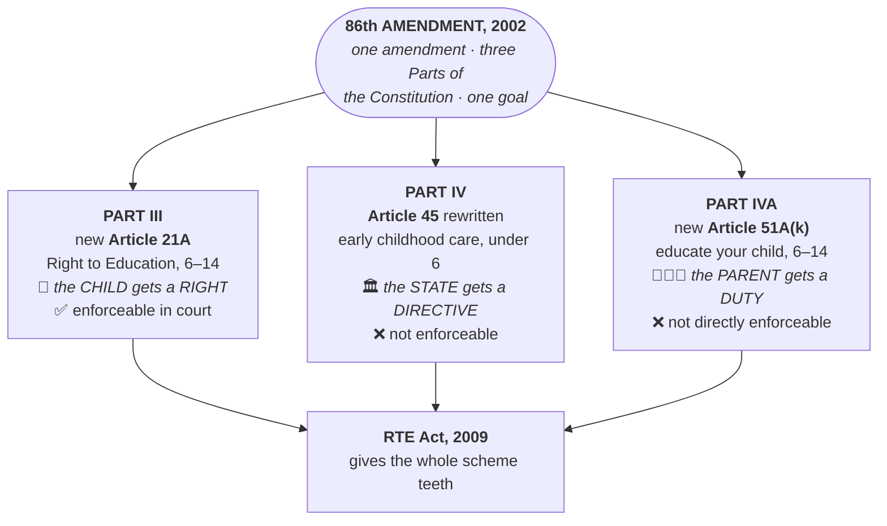

# Chapter 9 — Fundamental Duties

[← Chapter 8](08_DPSP.md) · [Index](00_INDEX.md) · [Chapter 10 →](10_Amendment_of_the_Constitution.md)

**Read time ~8 min** · Part IVA, Article 51A · **The shortest chapter in Part I — and the easiest marks in the book**

---

## 🎯 The one-line point

> **Fundamental Duties were an afterthought.** The original Constitution had none. They were added in **1976, during the Emergency**, by the **42nd Amendment**, on the recommendation of the **Swaran Singh Committee** — and that political context is the most examinable thing about them.

---

## 📖 The story

The framers deliberately left duties out. Their reasoning: in a democracy, duties follow naturally from citizenship — you don't need to write them down.

Then came the **Emergency (1975–77)**. The government set up the **Swaran Singh Committee (1976)** to recommend constitutional changes, and one recommendation was a list of citizens' duties. The **42nd Amendment** inserted **Part IVA** with **ten** duties.

> ⚠️ **Two of the Committee's recommendations were NOT accepted** — worth remembering because it's a favourite Prelims trap:
> 1. **Penalty or punishment** for non-performance of duties
> 2. That **no law imposing such penalty shall be called into question in any court**

**Borrowed from:** the **Constitution of the USSR** — a socialist state that emphasised duties alongside rights. India and the erstwhile socialist bloc are among the few countries whose constitutions list citizens' duties.

> 💡 **A useful framing for a Mains answer:** the Emergency is the reason we have Fundamental Duties, and it is also the reason we distrust them. Critics argue a government that was suspending rights had no business lecturing citizens on duties. Defenders reply that the *content* is unobjectionable regardless of the *timing*.

---

## PART A — The eleven duties (Article 51A)

It shall be the duty of every citizen of India:

| # | Duty |
|---|---|
| **(a)** | To **abide by the Constitution** and respect its ideals and institutions, the **National Flag** and the **National Anthem** |
| **(b)** | To cherish and follow the **noble ideals that inspired the freedom struggle** |
| **(c)** | To uphold and protect the **sovereignty, unity and integrity** of India |
| **(d)** | To **defend the country** and render national service when called upon |
| **(e)** | To promote **harmony and the spirit of common brotherhood** among all people, transcending religious, linguistic and regional or sectional diversities; and to **renounce practices derogatory to the dignity of women** |
| **(f)** | To value and preserve the rich heritage of the country's **composite culture** |
| **(g)** | To protect and improve the **natural environment** — forests, lakes, rivers and wildlife — and to have compassion for living creatures |
| **(h)** | To develop **scientific temper, humanism and the spirit of inquiry and reform** |
| **(i)** | To safeguard **public property** and abjure violence |
| **(j)** | To strive towards **excellence** in all spheres of individual and collective activity |
| **(k)** | To provide **opportunities for education to one's child or ward between the ages of 6 and 14** — ⭐ *added by the **86th Amendment, 2002*** |

> 🧠 **How to remember eleven items without rote-learning them.** Group them into four buckets:
>
> | Bucket | Duties |
> |---|---|
> | **Towards the NATION** | (a) Constitution, flag, anthem · (b) freedom-struggle ideals · (c) sovereignty & integrity · (d) defend the country |
> | **Towards SOCIETY** | (e) harmony + dignity of women · (f) composite culture · (i) public property, no violence |
> | **Towards the ENVIRONMENT & MIND** | (g) environment · (h) scientific temper |
> | **Towards ONESELF & FAMILY** | (j) excellence · (k) educate your child |
>
> **Nation → Society → Environment/Mind → Self.** Outward to inward.

> 🔑 **Duty (k) is the one most often asked**, because it's the only one added later (**86th Amendment, 2002**) — the same amendment that created **Article 21A** and rewrote **Article 45**.
>
> 💡 **Notice how one amendment touched all three Parts at once:**
> - **Part III** → new **Article 21A** (Right to Education, a *right*)
> - **Part IV** → **Article 45** rewritten (early childhood care, a *directive*)
> - **Part IVA** → new **Article 51A(k)** (parents' *duty* to educate)
>
> **The State gets a duty, the child gets a right, the parent gets a duty.** That is one of the most elegant pieces of constitutional design in the book, and it makes a superb Mains illustration.

> 🔑 **Trace where education travelled:** it began in **Part IV** as a non-enforceable directive → was promoted into **Part III** as a Fundamental Right → and simultaneously created a **Part IVA** duty on parents. **A promise became a right.** That is the single best proof that Directive Principles are not decorative.

> 🔑 **Prelims traps:**
> - [Prelims 2015 Q33](../03_PYQ_Prelims/2015.md) — *"To uphold and protect the sovereignty, unity and integrity of India"* is a **Fundamental Duty**, not a Preamble or DPSP provision
> - [Prelims 2020 Q7](../03_PYQ_Prelims/2020.md) — the **Preamble, DPSP and Fundamental Duties** all reflect the UDHR

---

## PART B — Are they enforceable?

**Article 51A is non-justiciable.** The Constitution provides **no direct legal sanction** for breaching a duty, and no court can compel you to perform one.

**But — and this is the nuance that earns marks — Parliament CAN enforce them by ordinary law.** Several such laws already exist:

| Duty | Law giving it teeth |
|---|---|
| Respect for the National Flag and Anthem | **Prevention of Insults to National Honour Act, 1971** |
| Protecting the environment and wildlife | **Wildlife (Protection) Act, 1972**, **Forest (Conservation) Act, 1980**, **Environment (Protection) Act, 1986** |
| Preserving heritage | **Ancient Monuments and Archaeological Sites and Remains Act, 1958** |
| Promoting harmony | **Protection of Civil Rights Act, 1955**; provisions against promoting enmity between groups |
| Safeguarding public property | **Prevention of Damage to Public Property Act, 1984** |

> 💡 **So the correct answer to "are Fundamental Duties enforceable?" is: not directly, but they are legally operationalised.** Courts also use them as an **interpretive aid** — when deciding whether a restriction on a right is "reasonable", judges have cited Article 51A.

> 🔑 [Prelims 2017 Q12](../03_PYQ_Prelims/2017.md) asked whether a legislative process exists to enforce these duties and whether they are correlative to legal duties. Answer: **(d) Neither** — a trap that catches people who over-read the "Parliament can enforce" point.

---

## PART C — Committees and criticisms

### The Verma Committee, 1999
Set up on the **operationalisation of Fundamental Duties**, it identified the **existing legal provisions** for implementing several duties (the table above draws on its work) and recommended better sensitisation. Its central finding: the problem is not absence of law, but absence of awareness and enforcement.

### Criticisms

| Criticism | Substance |
|---|---|
| **Incomplete list** | Omits duties like paying taxes, voting, and family planning |
| **Vague and ambiguous** | Phrases like *"noble ideals"*, *"composite culture"* and *"scientific temper"* are open to interpretation |
| **Non-justiciable** | No sanction for violation — critics called them a *"code of moral precepts"* |
| **Superfluous** | Would have been performed by citizens anyway; some argued they were a moral homily |
| **Appended, not integrated** | Placed *after* the DPSP, which critics said reduced their value; they should have come *before* Part III |

### The defence
- They serve as a **constant reminder** that rights and duties are correlative
- They act as a **warning against anti-national and destructive activities**
- They are a **source of inspiration** and promote discipline
- Courts use them to **interpret the reasonableness of restrictions** on Fundamental Rights
- Parliament can and does **give them statutory teeth**

---

## ❓ Expected Mains questions

**1. "Fundamental Duties are the moral conscience of the Constitution, but a legally toothless one." Critically examine. (250 words)**
> *Skeleton:* (i) Origin — 42nd Amendment 1976, Swaran Singh Committee, borrowed from the USSR; note that penalty provisions were rejected. (ii) The eleven duties, grouped. (iii) Non-justiciable — no direct sanction. (iv) But operationalised via statutes (National Honour Act, environmental laws, Public Property Act) and used as an interpretive aid. (v) Verma Committee's finding. (vi) Conclude: not toothless, but the teeth belong to ordinary law, not the Constitution.

**2. "The 42nd Amendment gave India duties while taking away rights." Comment. (250 words)**
> *Skeleton:* The 42nd Amendment — the "Mini-Constitution", passed during the Emergency. What it *added*: Fundamental Duties, "Socialist Secular Integrity" in the Preamble, three new DPSPs, expanded Article 31C. What it *curtailed*: judicial review, expanded Article 31C over all DPSPs, extended Lok Sabha's term. Note that *Minerva Mills* (1980) and the 44th Amendment (1978) reversed the worst of it — but the Duties survived. Conclude on separating the content from its context.

**3. "Rights and duties are two sides of the same coin." Discuss in the Indian constitutional context. (150 words)**
> *Skeleton:* Article 51A(a) mirrors respect for the Constitution; 51A(g) mirrors the Article 21 right to a clean environment; 51A(k) mirrors the Article 21A right to education. Show how each duty has a corresponding right. Note [Prelims 2017 Q7](../03_PYQ_Prelims/2017.md) — *"Rights are correlative with Duties."* Conclude with the education triad as the best example.

---

## ⚡ 60-second revision

- **Part IVA, Article 51A.** Added by the **42nd Amendment, 1976**, on the **Swaran Singh Committee**'s recommendation. Borrowed from the **USSR**
- **Originally 10 duties. The 11th — educating one's child aged 6–14 — was added by the 86th Amendment, 2002**
- ⚠️ Two Swaran Singh recommendations **rejected**: penalty for non-performance, and barring courts from questioning such a penalty law
- **Non-justiciable** — no direct legal sanction. **But Parliament can enforce them by ordinary law**: National Honour Act 1971, Wildlife Protection Act 1972, Forest Conservation Act 1980, Environment Protection Act 1986, Prevention of Damage to Public Property Act 1984
- **Verma Committee, 1999** — on operationalisation; found the laws already exist, awareness does not
- **The 86th Amendment triad:** Art **21A** (right) + Art **45** rewritten (directive) + Art **51A(k)** (duty) — one amendment, three Parts
- Criticisms: incomplete, vague, non-justiciable, superfluous, appended after DPSP instead of before Part III

---

## 🔗 Practice this chapter

**Prelims:** [2015 Q33](../03_PYQ_Prelims/2015.md) — sovereignty, unity and integrity · [2017 Q7, Q12](../03_PYQ_Prelims/2017.md) — rights-duties relationship; enforceability · [2020 Q7](../03_PYQ_Prelims/2020.md) — UDHR reflected in Preamble, DPSP and Duties

---

[← Chapter 8](08_DPSP.md) · [Index](00_INDEX.md) · [Chapter 10 → Amendment of the Constitution](10_Amendment_of_the_Constitution.md)
