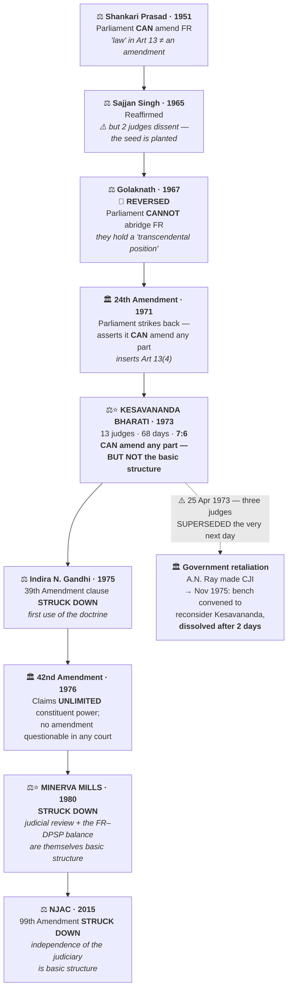

# Chapter 11 — Basic Structure of the Constitution

[← Chapter 10](10_Amendment_of_the_Constitution.md) · [Index](00_INDEX.md)

**Read time ~11 min** · **The last chapter of Part I** · Prelims: 1 most years · Mains: asked in **2013, 2014, 2016, 2019 and 2025**

> 📌 **Chapter 10 taught you the *procedure* of amendment. This chapter is about the *limit* on it.** There's deliberate overlap — but read this one for the doctrine itself: what actually counts as "basic structure", how judges decide, and whether the whole idea is even legitimate.

---

## 🎯 The one-line point

> **The basic structure doctrine is not written anywhere in the Constitution.** No Article mentions it. The Supreme Court invented it in 1973 to answer a question the framers never answered: *can a majority in Parliament legally abolish democracy itself?* The Court's answer was no — and that answer is now the load-bearing wall of Indian constitutional law.

---

## 📖 The story

Here is the problem the framers left behind.

Article 368 says Parliament may amend "this Constitution." It does not say *how much*. Read literally, a government with a two-thirds majority could amend away elections, abolish the courts, delete Fundamental Rights, and declare itself permanent — **all perfectly legally.**

> 💡 **Analogy:** you hire a contractor and give him the authority to modify your house. He can move walls, add rooms, change the roof. But can he **demolish the house and build a different one** — and still claim he was only "modifying"? At some point *amendment* becomes *destruction*, and the authority to do the first was never authority to do the second.
>
> **That is the entire doctrine in one image.** The power to amend the Constitution is a power *given by* the Constitution — so it cannot be used to destroy the thing that gave it.

The framers never spelled this out. Ambedkar and the Assembly assumed political good sense would hold. **Between 1971 and 1976, it didn't.** And the Court had to invent the limit that the text had left out.

---

## PART A — How the doctrine was born

| Round | Case / Event | Year | Held |
|---|---|---|---|
| 1 | ***Shankari Prasad*** | 1951 | Parliament **CAN** amend Fundamental Rights — "law" in Article 13 means ordinary law, not an amendment |
| 2 | ***Sajjan Singh*** | 1965 | Reaffirmed — **but two judges dissented**, planting the seed |
| 3 | ***Golaknath*** | 1967 | **REVERSED.** Fundamental Rights hold a "transcendental position." Parliament **CANNOT** abridge them at all |
| 4 | **24th Amendment** | 1971 | Parliament strikes back — asserts it **CAN** amend any part including FR; inserts **Article 13(4)**; makes Presidential assent obligatory |
| 5 | ***Kesavananda Bharati*** ⭐ | **1973** | **The synthesis.** Parliament **CAN** amend any part — **BUT cannot alter the BASIC STRUCTURE** |
| 6 | ***Indira Nehru Gandhi v. Raj Narain*** | 1975 | Doctrine used for the **first time to strike down an amendment** — the 39th Amendment clause putting the PM's election beyond judicial review |
| 7 | **42nd Amendment** | 1976 | Declares Parliament's constituent power **unlimited** and that no amendment can be questioned in any court |
| 8 | ***Minerva Mills*** | 1980 | **Struck that down.** **Judicial review** and the **FR–DPSP balance** are themselves basic structure |
| 9 | ***Waman Rao*** | 1981 | Doctrine applies **prospectively**, to amendments made after **24 April 1973** |

### 🖼️ The battle, as a state machine

> 🧠 **The rhythm, from Chapter 10:** *"yes, yes, no, yes, yes-but, unlimited, no."*
>
> 💡 **Read the ⚖️ and 🏛️ symbols as the two players.** Court, Court, Court, **Parliament**, Court, Court, **Parliament**, Court, Court. The doctrine survived because the Court won the last exchange — twice.

---

## PART B — What actually happened around *Kesavananda* ⭐

**This is the part most notes skip, and it's the part that makes the doctrine make sense.**

### The case
Swami **Kesavananda Bharati**, head of the Edneer Mutt in Kerala, challenged Kerala's land reform laws limiting the mutt's property. A property dispute. It became the largest constitutional case in Indian history:

- **13 judges** — the largest bench ever constituted in India, before or since
- **68 days** of hearing
- **11 separate opinions** running to over 700 pages
- Decided **24 April 1973** by **7:6** — a single vote

**Kesavananda himself largely lost.** But the majority held that Parliament's amending power, though wide, cannot be used to damage or destroy the Constitution's basic structure.

### What happened the very next day ⚠️

> 💡 **On 25 April 1973 — one day after the judgment — the government superseded three senior judges** (Shelat, Grover and Hegde), all of whom had ruled against unlimited amending power, and appointed **Justice A.N. Ray**, who had ruled in the government's favour, as Chief Justice of India.
>
> All three superseded judges resigned. This was the most direct assault on judicial independence in Indian history until that point.

### And then the attempt to erase it

> 💡 **November 1975 — during the Emergency — Chief Justice A.N. Ray constituted a fresh 13-judge bench to reconsider *Kesavananda* itself.** Nani Palkhivala argued against reopening it. After just **two days**, the bench was **dissolved** without a decision.
>
> 🔑 **Sit with that sequence.** The doctrine was born by one vote → the judges who created it were punished within 24 hours → an attempt was made to abolish it two years later during an Emergency → **and it survived.** Then in 1980 it was used to strike down the very amendment that had tried to make Parliament unlimited.
>
> **This is why the basic structure doctrine has moral authority that its shaky textual basis alone could never give it.** Use this narrative in any Mains answer on judicial independence, the Emergency, or the limits of majority rule. It is worth more than a list of case names.

---

## PART C — What IS the basic structure?

**The Court has never given an exhaustive list — deliberately.** It decides case by case. This is both the doctrine's greatest strength (it adapts) and its most cited weakness (it's unpredictable).

### The elements recognised so far, by the case that established them

| Element | Established / affirmed in |
|---|---|
| **Supremacy of the Constitution** | *Kesavananda* (1973) |
| **Republican and democratic form of government** | *Kesavananda* |
| **Secular character** of the Constitution | *Kesavananda*; strongly affirmed in ***S.R. Bommai*** (1994) |
| **Separation of powers** between legislature, executive and judiciary | *Kesavananda*; NJAC case (2015) |
| **Federal character** | *Kesavananda*; *S.R. Bommai* (1994) |
| **Rule of law** | *Indira Nehru Gandhi* (1975); *Indra Sawhney* (1992) |
| **Judicial review** | *Indira Nehru Gandhi*; ***Minerva Mills*** (1980); ***L. Chandra Kumar*** (1997) |
| **Free and fair elections** | *Indira Nehru Gandhi* (1975); *Kihoto Hollohan* (1992) |
| **Limited amending power of Parliament** | ***Minerva Mills*** (1980) |
| **Harmony and balance between Fundamental Rights and DPSP** | ***Minerva Mills*** (1980) |
| **Independence of the judiciary** | NJAC / *SC Advocates-on-Record Association* (2015) |
| **Powers of the SC under Art 32 and High Courts under Art 226** | ***L. Chandra Kumar*** (1997) |
| **Sovereign, unity and integrity of the nation** | *Kesavananda*; *S.R. Bommai* |
| **Welfare state / egalitarian mandate** | *Kesavananda* |
| **Effective access to justice; principle of equality** | Later cases |

> 🧠 **You will not be asked to list all fifteen.** Learn the **core seven**, which cover almost every question:
> **Supremacy of the Constitution · Rule of law · Separation of powers · Judicial review · Federalism · Secularism · Free and fair elections**
>
> **Mnemonic: "SR-SJ-FSF"** — or remember them as *the things a dictator would need to remove first.* That's genuinely what the list is: **the minimum conditions for the Constitution to remain a constitution.**

> ⚠️ **What is NOT basic structure** — equally testable. Courts have held these are *not*:
> - The **right to property** *(deleted by the 44th Amendment and upheld)*
> - Any **individual Fundamental Right** as such — *the FR chapter as a whole matters, but no single right is automatically immune*
> - A **particular federal distribution** of any given subject

---

## PART D — The doctrine in action

| Amendment / Law | Year | Outcome |
|---|---|---|
| **39th Amendment**, Clause 4 — PM's election beyond judicial review | 1975 | **STRUCK DOWN** — violated free and fair elections and judicial review |
| **42nd Amendment**, Sections 4 & 55 — unlimited amending power, expanded Art 31C | 1976 | **STRUCK DOWN** in *Minerva Mills* (1980) |
| **Ninth Schedule** protection | — | ***I.R. Coelho*** (2007): laws placed in the Ninth Schedule **after 24 April 1973** are **open to basic structure review**. The Schedule is no longer an absolute shield |
| **99th Amendment + NJAC Act** | 2014 | **STRUCK DOWN (2015)** — independence of the judiciary and the collegium held to be basic structure |

> 🔑 ***I.R. Coelho* is a favourite Prelims question** — it was [Mains 2016 GS-II Q6](../04_PYQ_Mains/2016.md) *and* underlies [Prelims 2018 Q9](../03_PYQ_Prelims/2018.md) on the Ninth Schedule.
> The **NJAC case** is [Mains 2017 GS-II Q2](../04_PYQ_Mains/2017.md) and [Prelims 2019 Q3](../03_PYQ_Prelims/2019.md).

### Where the doctrine does NOT apply

> ⚠️ **A trap worth knowing:** the basic structure doctrine tests **constitutional amendments**. **Ordinary legislation** is tested against Fundamental Rights and legislative competence — not against basic structure.
>
> Courts have, however, occasionally invoked basic structure principles when reviewing ordinary laws, which is itself a criticism — the doctrine leaking beyond its original scope.

---

## PART E — Criticisms, and the defence

| Criticism | Substance |
|---|---|
| **No textual basis** | Article 368 contains no such limitation. The doctrine was created, not found |
| **Undemocratic / counter-majoritarian** | Unelected judges overriding an elected Parliament exercising constituent power |
| **Vague and open-ended** | No exhaustive list; what is "basic" is decided case by case by whichever bench is sitting |
| **Judicial supremacy by stealth** | The Court decides both *what* the basic structure contains and *whether* it has been violated — it is judge in its own cause. The **NJAC case**, where the Court protected its own appointment power, is the sharpest example |
| **Contrary to framers' intent** | The Constituent Assembly debated and did **not** insert any unamendable provision, unlike Germany's "eternity clause" |

**The defence:**
- The Constitution's **silence is not permission to destroy it.** A power derived from a document cannot be used to abolish that document
- The doctrine has been used **sparingly** — a handful of amendments struck down in 50+ years
- It **worked when nothing else did.** In 1975–77, Parliament, the executive and the press had all failed. The doctrine was the only surviving check
- It is now **accepted across the political spectrum** — no government has seriously attempted to abolish it since 1976
- It has been **exported**: **Bangladesh** (*Anwar Hossain Chowdhury*, 1989), and cited in **Pakistan, Uganda, Belize** and elsewhere

> 💡 **The framing that earns marks:** don't argue *for* or *against*. Argue that the doctrine's **legitimacy is not textual but functional** — it was justified by what it prevented in 1975, and its continued acceptance rests on judicial restraint in using it. **The day the Court uses it freely is the day the criticism becomes fair.**

---

## 🧠 Memory hooks

### The one-sentence definition
> **Parliament can amend any provision of the Constitution, but cannot damage or destroy its basic structure — because the power to amend is a power *under* the Constitution, not *over* it.**

### The three dates that matter
> **24 April 1973** — *Kesavananda*; also the cut-off date for *Waman Rao* and *Coelho*
> **1975** — first use to strike down an amendment (*Indira Nehru Gandhi*)
> **1980** — *Minerva Mills* saves the doctrine from the 42nd Amendment

### Kesavananda in numbers
> **13 judges · 68 days · 7:6 · 24 April 1973 · 3 judges superseded the next day**

### Which case gave which element
> *Kesavananda* → the foundation (supremacy, secular, separation, federal, democratic)
> *Indira Nehru Gandhi* → **free and fair elections**, rule of law
> *Minerva Mills* → **judicial review** + **FR–DPSP balance** + **limited amending power**
> *S.R. Bommai* → **secularism**, federalism
> *L. Chandra Kumar* → **Art 32 and Art 226 judicial review**
> *NJAC (2015)* → **independence of the judiciary**

---

## ❓ Expected Mains questions

**1. "The basic structure doctrine is the Supreme Court's most creative act and its most questionable one." Critically examine. (250 words)**
> *Skeleton:* (i) The gap in Article 368 that made it necessary. (ii) *Kesavananda* — 13 judges, 7:6, the synthesis between *Golaknath* and the 24th Amendment. (iii) The creative charge — no textual basis, contrary to Assembly debates, open-ended list, counter-majoritarian. (iv) The defence — it prevented the 42nd Amendment's unlimited-power claim; used sparingly; exported to Bangladesh and cited elsewhere. (v) Conclude: legitimacy is **functional, not textual**, and depends on continued judicial restraint.

**2. "What was held in the Coelho case? In this context, can you say judicial review is of key importance amongst the basic features of the Constitution?" (250 words)**
> *Actually asked — [Mains 2016 GS-II Q6](../04_PYQ_Mains/2016.md).*
> *Skeleton:* *I.R. Coelho* (2007) — Ninth Schedule laws inserted after 24 April 1973 are subject to basic structure review, applying the "rights test" and "essence of rights" test. Then argue judicial review's centrality: affirmed in *Indira Nehru Gandhi*, *Minerva Mills*, *L. Chandra Kumar*, NJAC. Without it, every other basic feature is unenforceable — **review is the feature that protects the features.**

**3. "Parliament's power to amend the Constitution is a limited power and it cannot be enlarged into absolute power." Explain. (250 words)**
> *Actually asked — [Mains 2019 GS-II Q12](../04_PYQ_Mains/2019.md); revisited in [2025 Q12](../04_PYQ_Mains/2025.md).*
> *Skeleton:* The 42nd Amendment attempted exactly this enlargement. *Minerva Mills* held a limited power cannot be used to make itself unlimited — the bootstraps argument. Distinguish **constituent power** from **unlimited power**. Conclude on the amending power as a trust, not an ownership.

**4. Examine the elements of the basic structure and comment on the absence of an exhaustive list. (250 words)**
> *Skeleton:* List the core seven with their source cases. Argue the open-endedness is deliberate — an exhaustive list in 1973 could not have anticipated the NJAC or electoral-bond questions. But acknowledge the cost: unpredictability, and the Court's power to expand its own jurisdiction. Suggest that consistency of *reasoning*, not a fixed list, is the real safeguard.

---

## ⚡ 60-second revision

- **Not written anywhere in the Constitution.** Judicially created in ***Kesavananda Bharati* (24 April 1973)** — **13 judges, 68 days, 7:6**
- **Core proposition:** Parliament can amend any part **but cannot damage or destroy the basic structure**
- **The chain:** *Shankari Prasad* 1951 → *Sajjan Singh* 1965 → *Golaknath* 1967 → **24th Amd 1971** → ***Kesavananda* 1973** → *Indira Nehru Gandhi* 1975 (**39th Amd clause struck — first use**) → **42nd Amd 1976** (claims unlimited power) → ***Minerva Mills* 1980** (strikes it down) → *Waman Rao* 1981 (prospective from **24 April 1973**)
- **Three judges superseded on 25 April 1973**; A.N. Ray made CJI; **Nov 1975 attempt to reconsider the doctrine dissolved after 2 days**
- **Core seven elements:** supremacy of the Constitution · rule of law · separation of powers · **judicial review** · federalism · **secularism** (*S.R. Bommai* 1994) · free and fair elections
- Also: limited amending power + **FR–DPSP balance** (*Minerva Mills*), independence of judiciary (**NJAC 2015**), Art 32 & 226 review (*L. Chandra Kumar* 1997)
- **Applications:** 39th Amd clause (1975) · 42nd Amd Sec 4 & 55 (1980) · **99th Amd + NJAC (2015)** · ***I.R. Coelho* 2007** — Ninth Schedule laws post-24 April 1973 are reviewable
- ⚠️ Tests **amendments**, not ordinary laws. **No exhaustive list** — deliberately
- **Criticism:** no textual basis, counter-majoritarian, vague, judicial supremacy. **Defence:** silence ≠ permission to destroy; used sparingly; worked in 1975–77; exported to **Bangladesh** (1989) and cited in Pakistan, Uganda, Belize

---

## 🔗 Practice this chapter

**Prelims:** [2018 Q9](../03_PYQ_Prelims/2018.md) — Ninth Schedule and *Coelho* · [2019 Q3](../03_PYQ_Prelims/2019.md) — 99th Amendment struck down · [2019 Q8](../03_PYQ_Prelims/2019.md) — can an amendment be questioned? · [2020 Q11](../03_PYQ_Prelims/2020.md) — the Constitution does not *define* basic structure

**Mains:** [2013 Q4](../04_PYQ_Mains/2013.md) · [2014 Q1](../04_PYQ_Mains/2014.md) · [2016 Q6](../04_PYQ_Mains/2016.md) · [2019 Q12](../04_PYQ_Mains/2019.md) · [2025 Q12](../04_PYQ_Mains/2025.md)

---

## 🎓 End of Part I — Constitutional Framework

You have now covered the entire constitutional foundation: where it came from *(Ch 1–2)*, what it is *(Ch 3–4)*, who it applies to *(Ch 5–6)*, what it guarantees and demands *(Ch 7–9)*, and how far it can be changed *(Ch 10–11)*.

**Before moving to Part II, do this — it takes 90 minutes and is worth more than re-reading:**
1. Re-read only the **60-second revision** blocks of all 11 chapters, in order
2. Say the **Parliament-vs-Court story** out loud from memory: *Champakam → 1st Amd → Golaknath → 24th → Kesavananda → 42nd → Minerva Mills → NJAC*
3. Attempt the **Prelims PYQs** linked across Chapters 4, 7, 8 and 10 in one sitting
4. Write **one** full Mains answer — recommended: *"Parliament's power to amend is a limited power"* ([2019 Q12](../04_PYQ_Mains/2019.md))

**Next: Part II — System of Government** *(Ch 12 Parliamentary System · Ch 13 Federal System · Ch 14 Centre–State Relations · Ch 15 Inter-State Relations · Ch 16 Emergency Provisions)*. Two of those — **Ch 14 and Ch 16** — are among the highest-yield chapters in the whole book.

---

[← Chapter 10](10_Amendment_of_the_Constitution.md) · [Index](00_INDEX.md)
