# Chapter 14 — Centre–State Relations

[← Chapter 13](13_Federal_System.md) · [Part Index](00_INDEX.md) · [Master](../00_INDEX.md)

**Read time ~18 min** · 🔴🔴 **The highest-yield chapter in Part II — give it 2.5 hours and three sittings** · Prelims: asked almost every year · Mains: **2001, 2013, 2018, 2019, 2021, 2023, 2024, 2025** and more

> 📌 **[Chapter 13](13_Federal_System.md) argued that India is federal in form and unitary in spirit. This chapter is the evidence.** Everything here falls into three buckets — **legislative, administrative, financial** — and if you can reproduce those three buckets with their article numbers, you can answer almost any federalism question in GS-II.

---

## 🎯 The one-line point

> **Power is divided three ways — who makes the law, who executes it, and who pays for it — and in all three the Centre keeps a door open into the states' territory.** The states have a genuine constitutional existence, but the Centre has five routes into the State List, the power to direct state administration, and control of the money. Federalism in India is a **negotiated balance**, not a fixed line.

---

## 📖 The story

Imagine dividing responsibilities in a large joint household.

You could write down who does what — one list for the elders, one for the younger family, one shared. That is the **Seventh Schedule**, and it is the easy part.

The hard questions come after. What if something arises that nobody listed? *(Residuary powers — the Centre.)* What if the shared list produces a clash? *(Doctrine of repugnancy — the Centre wins, usually.)* What if the elders decide something on the younger family's list is now a matter of common concern? *(Articles 249, 250, 252, 253, 356 — five doors.)* Who enforces a decision, and who pays for it? *(Administrative and financial relations.)*

**The Constitution answers all of them, and in nearly every case the tie-breaker goes to the Centre.** But — and this is the part that makes the chapter interesting rather than depressing — **almost every one of those doors has a condition attached**, and the conditions are where the litigation and the exam questions live.

---

## 🗺️ The chapter in one picture

```mermaid
flowchart TD
    CS["CENTRE–STATE RELATIONS<br/>three buckets, and nothing outside them"] --> L["① LEGISLATIVE<br/>Articles 245–255"]
    CS --> A["② ADMINISTRATIVE<br/>Articles 256–263"]
    CS --> F["③ FINANCIAL<br/>Articles 268–293"]

    L --> L1["TERRITORIAL EXTENT (245)<br/>Parliament: whole/part of India +<br/>EXTRA-TERRITORIAL legislation<br/>State: whole/part of the state"]
    L --> L2["DISTRIBUTION (246) — Seventh Schedule<br/>UNION 100 · STATE 61 · CONCURRENT 52<br/>RESIDUARY (248) ⇒ PARLIAMENT"]
    L --> L3["⭐ FIVE DOORS INTO THE STATE LIST<br/>249 · Rajya Sabha resolution, national interest<br/>250 · National Emergency<br/>252 · Two or more states REQUEST<br/>253 · International agreements<br/>356 · President's Rule"]
    L --> L4["REPUGNANCY (254)<br/>Concurrent clash ⇒ CENTRAL law prevails<br/>UNLESS state law reserved + President's assent<br/>⚠️ but Parliament can still override later"]
    L --> L5["CENTRE'S CONTROL<br/>Governor may RESERVE bills (200/201)<br/>some bills need PRIOR sanction<br/>financial emergency ⇒ reserve money bills"]

    A --> A1["EXECUTIVE POWER (73 / 162)<br/>co-extensive with legislative power"]
    A --> A2["OBLIGATION OF STATES (256, 257)<br/>comply with Union laws · do not IMPEDE<br/>Union executive power<br/>+ directions on COMMUNICATIONS of national/<br/>military importance and PROTECTION OF RAILWAYS<br/>⚠️ non-compliance ⇒ Article 356"]
    A --> A3["MUTUAL DELEGATION (258, 258A)<br/>Union → State: needs state CONSENT<br/>State → Union: needs Union consent<br/>⚠️ Parliament may also legislate to confer<br/>power on states WITHOUT consent"]
    A --> A4["COOPERATION<br/>261 full faith and credit ·<br/>262 INTER-STATE WATER DISPUTES<br/>(Parliament may BAR the Supreme Court) ·<br/>263 INTER-STATE COUNCIL ·<br/>307 inter-state trade authority"]
    A --> A5["ALL-INDIA SERVICES (312)<br/>IAS · IPS · IFoS — created by<br/>RAJYA SABHA resolution, 2/3 present and voting<br/>⇒ 'controlled by the Centre, serving the states'"]

    F --> F1["TAXING POWERS<br/>Parliament ⇒ Union List · State legislature ⇒ State List<br/>Concurrent List ⇒ NO tax entries<br/>residuary taxing power ⇒ PARLIAMENT"]
    F --> F2["THE FIVE CATEGORIES<br/>268 levied by Centre, collected+appropriated by STATES<br/>269 levied+collected by Centre, ASSIGNED to states<br/>269A GST on INTER-STATE trade — apportioned<br/>270 levied+collected by Centre, DISTRIBUTED<br/>271 SURCHARGE ⇒ goes wholly to the CENTRE"]
    F --> F3["⭐ GST — 101st Amendment, 2016<br/>Art 246A concurrent taxing power<br/>Art 279A GST COUNCIL<br/>Centre 1/3 · States 2/3 · decisions by 3/4<br/>⇒ 'shared sovereignty'"]
    F --> F4["FINANCE COMMISSION (280)<br/>every FIVE years · quasi-judicial ·<br/>15th FC ⇒ 41% devolution"]
    F --> F5["GRANTS · 275 STATUTORY (on FC advice)<br/>282 DISCRETIONARY ⇒ the basis of<br/>CENTRALLY SPONSORED SCHEMES<br/>BORROWING 292 (Centre) / 293 (states —<br/>need Centre's consent if indebted to it)"]

    CS --> R["⭐ THE REVIEW BODIES<br/>Rajamannar 1969 · Anandpur Sahib 1973 ·<br/>West Bengal Memorandum 1977 ·<br/>SARKARIA 1983→1988, 247 recommendations ·<br/>PUNCHHI 2007→2010"]
    R --> R2["AND THE COURT<br/>S.R. BOMMAI 1994 — 356 justiciable,<br/>federalism = basic structure<br/>Rameshwar Prasad 2006 · Nabam Rebia 2016"]
```

---

# ① LEGISLATIVE RELATIONS *(Articles 245–255)*

Four dimensions: **territorial extent · distribution of subjects · Parliament's entry into the State List · the Centre's control over state legislation.**

## A. Territorial extent (Article 245)

| | Extent |
|---|---|
| **Parliament** | May make laws for **the whole or any part of the territory of India** |
| **State legislature** | May make laws for **the whole or any part of the state** — its laws are **not applicable outside** the state, except where there is a **sufficient nexus** with the state |
| ⭐ **Extra-territorial operation** | **Only Parliament** can make laws with extra-territorial operation — applying to Indian citizens and their property **anywhere in the world** |

**Four restrictions on this plenary power:**
1. The **President** may make regulations for **Andaman & Nicobar, Lakshadweep, Dadra & Nagar Haveli and Daman & Diu, and Ladakh** — such a regulation may **repeal or amend an Act of Parliament** in relation to those UTs.
2. The **Governor** may direct that an Act of Parliament **does not apply, or applies with modifications**, to a **scheduled area** in the state *(Fifth Schedule)*.
3. The Governor of **Assam** — and the President for **Meghalaya, Tripura and Mizoram** — may similarly direct that an Act does not apply or applies with modifications to an **autonomous district** *(Sixth Schedule)*.
4. Parliament may itself limit the operation of a law.

> ⭐ Point 2 and 3 are exactly what [Prelims 2025 Q56](../../03_PYQ_Prelims/2025.md) and [Prelims 2026 Q57](../../03_PYQ_Prelims/2026.md) tested. **Fifth Schedule = scheduled areas in other states. Sixth Schedule = Assam, Meghalaya, Tripura, Mizoram.**

## B. Distribution of legislative subjects (Article 246)

| List | Subjects | Who legislates | Examples |
|---|---|---|---|
| **List I — Union** | **100** *(originally 97)* | Parliament **exclusively** | Defence, banking, foreign affairs, currency, atomic energy, insurance, railways, **inter-state trade and commerce**, **inter-state migration and quarantine**, **corporation tax** |
| **List II — State** | **61** *(originally 66)* | State legislature **exclusively** | Public order, police, **public health and sanitation**, agriculture, prisons, local government, fisheries, markets, theatres, betting and gambling |
| **List III — Concurrent** | **52** *(originally 47)* | **Both** | Criminal law and procedure, civil procedure, marriage and divorce, population control and family planning, electricity, labour welfare, **economic and social planning**, drugs, newspapers, books, printing presses |

### ⚠️ The 42nd Amendment transfer — memorise the five

The **42nd Amendment Act, 1976** moved **five subjects from the State List to the Concurrent List**:

> **Education · Forests · Weights and measures · Protection of wild animals and birds · Administration of justice** *(constitution and organisation of all courts except the Supreme Court and High Courts)*

🧠 **Mnemonic: "EFWWA" — Every Forest Weighs Wild Animals' Age.** This transfer is the single most examinable amendment fact in the chapter.

### Residuary powers (Article 248)

⭐ **Parliament has exclusive power** to make any law with respect to any matter **not enumerated in the Concurrent or State List** — including the power to impose a **residuary tax**.

> **Contrast the USA immediately:** there, residuary powers rest with the **states**. This single reversal is the clearest proof of the "holding-together" design in [Chapter 13](13_Federal_System.md). Note also that under the **Government of India Act, 1935**, residuary power lay with the **Governor-General** — tested in [Prelims 2018 Q5](../../03_PYQ_Prelims/2018.md).

### The rule of predominance

In case of overlap: **Union List prevails over the Concurrent, and the Concurrent prevails over the State List.** Where a conflict is unavoidable, the courts apply the **doctrine of pith and substance** — look at the *true nature* of the law, not its incidental effects.

## C. ⭐⭐ Parliamentary legislation in the state field — the five doors

**This is the most tested content in the chapter.** In five extraordinary circumstances Parliament may legislate on a **State List** subject.

| Door | Article | Condition | How long it lasts |
|---|---|---|---|
| **1. National interest** | **249** | The **Rajya Sabha** passes a resolution supported by **two-thirds of members present and voting** that it is necessary in the national interest | **One year**; renewable any number of times, **one year at a time**. The law **ceases six months after the resolution expires** |
| **2. National Emergency** | **250** | A **Proclamation of National Emergency** is in operation | Law ceases **six months after the Emergency ends** |
| **3. States' request** | **252** | **Two or more state legislatures** pass resolutions requesting Parliament to legislate | Applies to the requesting states **and any other state that adopts it later**. ⭐ **Can be amended or repealed only by Parliament** — the states surrender the field permanently |
| **4. International agreements** | **253** | To implement **international treaties, agreements or conventions**, or any decision at an international conference/association | No time limit |
| **5. President's Rule** | **356** | President's Rule is in operation in the state | The law **continues in force even after President's Rule ends**, until repealed or amended by the state legislature |

🧠 **Mnemonic — "Rajya Sabha, Emergency, Request, Treaty, President's Rule" → the numbers run 249 · 250 · 252 · 253 · 356.**

### The details that separate a good answer

- **Article 249 is the only one that needs the Rajya Sabha, and it needs a *special* majority of "present and voting"** — not of the total membership. It is the **Rajya Sabha's** special power precisely because it is the **House of the States**: the states' own chamber must authorise the intrusion.
- **Article 252 laws made on request** — real examples worth citing: the **Prize Competition Act, 1955**; the **Wild Life (Protection) Act, 1972**; the **Water (Prevention and Control of Pollution) Act, 1974**; the **Urban Land (Ceiling and Regulation) Act, 1976**; the **Transplantation of Human Organs Act, 1994**.
- ⭐ **Article 253 has no safeguard at all** — no time limit, no state consent, no resolution. Because India signs a great many international agreements, this is the widest door of the five. It was tested directly in [Prelims 2013 Q12](../../03_PYQ_Prelims/2013.md).
- **Under 249 and 250, the state legislature is *not* barred from legislating** on the same matter — but if the state law conflicts with the Parliamentary law, **the Parliamentary law prevails**.

## D. Doctrine of repugnancy (Article 254)

When a **central law and a state law on a Concurrent List subject conflict**:

1. **The central law prevails**, and the state law is void to the extent of repugnancy.
2. ⭐ **The exception:** if the **state law was reserved for the President's consideration and received his assent**, the **state law prevails in that state**.
3. ⭐ **But even then** — **Parliament can still enact a later law** on the same matter, **adding to, amending, varying or repealing** the state law. **The Centre always has the last word.**

> **That three-step structure is the answer.** Most candidates stop at step 1 or 2. Step 3 is what makes the "exception" far weaker than it looks.

## E. The Centre's control over state legislation

1. The **Governor may reserve** certain bills passed by the state legislature for the **President's consideration** — and under **Article 201** the President enjoys an **absolute veto** over them.
2. Certain bills on **State List subjects** can be introduced only with the **previous sanction of the President** — for example, bills imposing **restrictions on freedom of trade and commerce** (Article 304(b)).
3. During a **Financial Emergency**, the President can direct states to **reserve money bills and other financial bills** for his consideration.

> **The live controversy to cite:** Articles 200 and 201 set **no time limit** for the Governor or the President to act, which has produced prolonged stand-offs between Governors and elected state governments — the practical grievance behind [Mains 2024 Q13](../../04_PYQ_Mains/2024.md). This is precisely the terrain of [Prelims 2025 Q54](../../03_PYQ_Prelims/2025.md).

---

# ② ADMINISTRATIVE RELATIONS *(Articles 256–263)*

## A. Distribution of executive powers

**Executive power is co-extensive with legislative power** — Article **73** for the Union, Article **162** for the states. Two qualifications:
- On **Concurrent List** subjects, executive power ordinarily remains with the **states**, except where the Constitution or a Parliamentary law expressly confers it on the Centre.
- The Union's executive power extends to matters over which Parliament has exclusive legislative competence, and to rights and authority under treaties.

## B. ⭐ Obligation of the states (Articles 256 and 257)

| Article | Obligation |
|---|---|
| **256** | The executive power of every state shall be so exercised **as to ensure compliance with the laws made by Parliament**; the Union may give **such directions as appear necessary** |
| **257** | The executive power of every state shall be so exercised as **not to impede or prejudice the executive power of the Union**; the Union may give directions accordingly |

**The Centre may specifically direct states on:**
1. The **construction and maintenance of means of communication** declared to be of **national or military importance**
2. The **measures to be taken for the protection of the railways** within the state

> ⭐ **The sanction is the sting.** Under **Article 365**, if a state fails to comply with any direction of the Centre, **the President may hold that a situation has arisen in which the government of the state cannot be carried on in accordance with the Constitution** — i.e. **Article 356, President's Rule**. Directions are not requests.

**And the compensation principle:** the **Centre pays** the extra costs a state incurs in carrying out such directions (Article 257(4)) — where the amount is disputed, it is determined by an **arbitrator appointed by the Chief Justice of India**.

## C. Mutual delegation of functions (Articles 258 and 258A)

| Direction | Article | Consent needed |
|---|---|---|
| **Union → State** | **258(1)** | With the **consent of the state government**, the President may entrust Union executive functions to that state |
| **State → Union** | **258A** | With the **consent of the Government of India**, the Governor may entrust state executive functions to the Centre *(inserted by the 7th Amendment, 1956)* |

⭐ **The asymmetry to notice:** under **Article 258(2)**, **Parliament may by law confer powers and impose duties upon a state — or its officers — *without* the state's consent**. The reverse does not exist: a state legislature **cannot** confer powers on the Centre.

> **So delegation is consensual in one direction and can be unilateral in the other.** That is a compact, high-value point for any "administrative relations" question ([Mains 2001 Q6(a)](../../04_PYQ_Mains/2001.md)).

## D. Cooperation between Centre and states

| Article | Provision |
|---|---|
| **261** | **Full faith and credit** shall be given throughout India to public acts, records and judicial proceedings of the Union and of every state |
| ⭐ **262** | **Inter-state water disputes** — Parliament may provide for adjudication, and may provide that **neither the Supreme Court nor any other court** shall exercise jurisdiction. *(Under it: the **River Boards Act, 1956** and the **Inter-State Water Disputes Act, 1956**.)* |
| ⭐ **263** | The **President may establish an Inter-State Council** to inquire into and advise upon disputes between states, and to investigate and discuss subjects of common interest |
| **307** | Parliament may appoint an authority to carry out the purposes of the inter-state trade and commerce provisions (301–304) |

**Article 262 in practice** — this is a favourite because the design has visibly failed:
- Tribunals under the 1956 Act have taken **decades** to decide (Cauvery, Krishna, Ravi-Beas), and awards have been resisted after they were made.
- The **exclusion of the Supreme Court's ordinary jurisdiction** was meant to speed things up; in practice, parties still reach the Court under **Article 136** (special leave), so the exclusion has not delivered finality either.
- This is exactly what [Mains 2013 Q6](../../04_PYQ_Mains/2013.md) and [Mains 2010 Q1(a)](../../04_PYQ_Mains/2010.md) asked about.

**The Inter-State Council** — established by a **Presidential order in 1990** on the recommendation of the **Sarkaria Commission**. Chairman: the **Prime Minister**; members: Chief Ministers of all states, Chief Ministers/Administrators of UTs, and six Union Cabinet Ministers. It is **advisory**, and it has met rarely — a standing criticism. *(Tested in [Prelims 2025 Q53](../../03_PYQ_Prelims/2025.md): the Inter-State Council is **constitutional**, Zonal Councils are **statutory**, the National Security Council is **executive**.)*

> ⚠️ **Zonal Councils are NOT constitutional.** They were created by the **States Reorganisation Act, 1956** — five of them, plus the **North Eastern Council** created by a separate Act of **1971**. Getting this classification right is worth a Prelims mark almost every year.

## E. All-India Services (Article 312)

- **IAS and IPS** continued from before independence; the **Indian Forest Service (IFoS)** was created in **1966**.
- ⭐ A **new** All-India Service can be created only if the **Rajya Sabha** passes a resolution supported by **two-thirds of members present and voting**, declaring it necessary in the national interest. *(The same special mechanism as Article 249 — again, the states' own House must authorise it.)*
- Officers are **recruited and trained by the Centre**, but **serve under the states**. Their **salaries are paid by the states**; but **disciplinary action** and removal rest ultimately with the **Central government**.

**The federal argument, both ways:**
- **Against federalism:** the state cannot dismiss the officers who run its own administration — a permanent central presence inside state government.
- **For national integration:** Sardar Patel's defence — the AIS provides *"a common standard of administration"* and an **all-India outlook** that binds the country together. He called them the **"steel frame."**

---

# ③ FINANCIAL RELATIONS *(Articles 268–293)*

## A. Allocation of taxing powers

| Who | Power |
|---|---|
| **Parliament** | Exclusive power to levy taxes on **Union List** subjects |
| **State legislature** | Exclusive power to levy taxes on **State List** subjects |
| **Both** | **Article 246A** — concurrent power to levy **GST** *(101st Amendment)* |
| ⭐ **Concurrent List** | **Has no tax entries at all** — the Concurrent List contains no taxing power |
| **Residuary taxing power** | With **Parliament** (Article 248) — this is how gift tax, wealth tax and expenditure tax were levied |

**Two constitutional restrictions on the states' taxing power:**
1. A state **cannot tax** the property of the Union (Article 285), and the Union cannot tax state property (Article 289) — with exceptions for trade or business carried on by a state.
2. A state legislature **cannot tax** the consumption or sale of electricity supplied to the Centre, or a supply for constructing/maintaining a railway, without the President's assent.

## B. ⭐ The five categories of tax distribution

| Article | Category | Who levies | Who collects | Who keeps it |
|---|---|---|---|---|
| **268** | Duties levied by the Centre but **collected and appropriated by the states** | Centre | **States** | **States entirely** — e.g. **stamp duties** on bills of exchange, cheques, promissory notes, insurance policies |
| **269** | Taxes levied and collected by the Centre but **assigned to the states** | Centre | Centre | **States entirely** — taxes on **inter-state sale/purchase and consignment of goods** |
| **269A** | **GST on inter-state trade and commerce** *(IGST)* | Centre | Centre | **Apportioned between the Centre and the states** as Parliament provides on the **GST Council's** recommendation |
| **270** | Taxes levied and collected by the Centre and **distributed between the Centre and the states** | Centre | Centre | **Shared** — this is the **divisible pool**, divided on the **Finance Commission's** recommendation |
| ⭐ **271** | **Surcharge** on taxes and duties | Centre | Centre | ⚠️ **The Centre exclusively — the proceeds do not go into the divisible pool at all** |

> ⭐⭐ **Article 271 is the single most important row for any *fiscal federalism* answer.** Because surcharges and cesses are **outside the divisible pool**, every rupee raised that way is a rupee the states cannot claim, whatever the Finance Commission's percentage says. Cesses and surcharges have grown from roughly **a tenth** of the Centre's gross tax revenue to around **a fifth** — which is why the states argue their effective share is well below the headline **41%**. *(This is the substance of [Mains 2024 Q13](../../04_PYQ_Mains/2024.md) and [Mains 2025 Q14](../../04_PYQ_Mains/2025.md).)*

## C. ⭐ GST and the GST Council — the 101st Amendment, 2016

*Asked directly in [Mains 2017 Q11](../../04_PYQ_Mains/2017.md) and again, from the federalism angle, in [Mains 2023 Q15](../../04_PYQ_Mains/2023.md).*

**What it did:**
- Inserted **Article 246A**, giving **both Parliament and state legislatures** the power to make laws on GST — a **concurrent taxing power**, which did not previously exist.
- Inserted **Article 269A** for **inter-state supply (IGST)**, levied and collected by the Centre and apportioned.
- Inserted **Article 279A** creating the **GST Council**.
- **Subsumed** a long list of central and state indirect taxes (central excise, service tax, additional customs duties; state VAT, entertainment tax, luxury tax, octroi, entry tax, purchase tax) into one tax.
- **Kept out of GST:** alcoholic liquor for human consumption; and, for the time being, **petroleum crude, high-speed diesel, petrol, natural gas and aviation turbine fuel**.

**The GST Council (Article 279A):**

| Element | Detail |
|---|---|
| **Chairperson** | The **Union Finance Minister** |
| **Members** | The **Union Minister of State** for Finance/Revenue, and **one minister nominated by each state government** |
| **Vice-Chairperson** | Chosen **from among the state ministers** |
| **Quorum** | **One-half** of the total number of members |
| ⭐ **Decision rule** | **Three-fourths of the weighted votes** of members present and voting — where the **Centre has one-third** of the votes cast and **all the states together have two-thirds** |

> ⭐ **Why the arithmetic matters, and why this is the best example of cooperative federalism in the Constitution.**
> - The Centre's **one-third** exceeds the **one-quarter** needed to block — so **nothing passes without the Centre**.
> - But the Centre's one-third is **less than the three-fourths** required to pass — so **the Centre alone cannot pass anything either**; it needs a substantial bloc of states.
> - **Neither side can act alone.** That is genuine **shared sovereignty**, and states did surrender real taxing autonomy to enter it.
>
> **The counter-argument to acknowledge:** states gave up independent indirect-tax powers permanently, in exchange for compensation that was **guaranteed only for five years** (to 2022); disputes over delayed compensation during the pandemic showed how much the bargain depends on the Centre's good faith. In ***Mohit Minerals*** (2022) the Supreme Court held that the **Council's recommendations are persuasive, not binding** — strengthening the states in principle, though the practical effect is contested.

## D. Finance Commission (Article 280)

- Constituted by the **President every fifth year**, or earlier if he considers it necessary.
- **Composition:** a **Chairman and four other members**, with qualifications and manner of selection determined by Parliament.
- **Quasi-judicial** body; its recommendations are **advisory**, but by convention the Centre has accepted the core devolution recommendations.

**It recommends:**
1. The **distribution of the net proceeds of taxes** between the Centre and the states, and the allocation **among the states**
2. The **principles governing grants-in-aid** to the states out of the Consolidated Fund of India
3. Measures to **augment the Consolidated Fund of a state** to supplement the resources of **panchayats and municipalities** *(added by the 73rd and 74th Amendments)*
4. Any other matter referred by the President

**The devolution numbers you should be able to quote:**

| Commission | Share of the divisible pool to states |
|---|---|
| **13th** (2010–15) | **32%** |
| **14th** (2015–20) | ⭐ **42%** — the single largest jump ever |
| **15th** (2021–26) | **41%** *(reduced by one point on the reorganisation of Jammu & Kashmir into UTs)* |

> **The point examiners want:** the **14th FC's jump to 42%** was hailed as a landmark for fiscal federalism — but it came alongside a **restructuring of centrally sponsored schemes** and a rise in **cesses and surcharges**, so the states' *effective* gain was much smaller than the headline. **Always pair the devolution percentage with the cess/surcharge caveat.** *(This is exactly the argument [Mains 2021 Q3](../../04_PYQ_Mains/2021.md) and [Mains 2025 Q14](../../04_PYQ_Mains/2025.md) are testing.)*

## E. Grants-in-aid, and the two doors

| Type | Article | Nature |
|---|---|---|
| **Statutory grants** | **275** | Given to states **in need of assistance**, on the **Finance Commission's** recommendation; charged on the **Consolidated Fund of India**. Includes specific grants for **Scheduled Tribes' welfare and scheduled areas** |
| ⭐ **Discretionary grants** | **282** | Both the Centre **and** the states may make grants **for any public purpose, even one outside their legislative competence** |

> ⭐ **Article 282 is the constitutional basis of Centrally Sponsored Schemes**, and therefore of a great deal of the friction in modern Centre–state relations. Because it permits grants for **any public purpose — including subjects on the State List** — the Centre can shape state priorities by funding them conditionally. The states' objection is not to the money but to the **tied conditions**, the required state matching share, and the branding requirements. **Sarkaria and Punchhi both recommended reducing the number of such schemes and routing more transfers through the Finance Commission.**

## F. Borrowing (Articles 292 and 293)

| | Rule |
|---|---|
| **Centre (292)** | May borrow on the security of the Consolidated Fund of India **within limits fixed by Parliament** |
| **States (293)** | May borrow **within India only** — **not abroad** — on the security of the state's Consolidated Fund, within limits fixed by the state legislature |
| ⭐ **The catch** | A state **cannot raise any loan without the Centre's consent** if there is **still outstanding any part of a loan** made to it by the Centre. Since virtually every state is indebted to the Centre, **the Centre's consent is effectively always required** |

## G. Effect of emergencies on financial relations

- **National Emergency:** the President may **modify the constitutional distribution of revenues** between the Centre and the states, by order, until the end of the financial year in which the Emergency ceases.
- **Financial Emergency:** the Centre may direct states to observe **canons of financial propriety**; may require the **reduction of salaries** of all state employees **including High Court judges**; and may require **all money bills to be reserved** for the President's consideration.

---

# ④ TRENDS, COMMISSIONS AND THE COURT ⭐

*This section is what converts a descriptive answer into an analytical one.*

## The demands from the states

| Year | Source | Demand |
|---|---|---|
| **1969** | **Rajamannar Committee** *(Tamil Nadu)* | Constitute an **Inter-State Council**; **delete Articles 356, 357 and 365**; abolish the **All-India Services**; make the **Finance Commission permanent** |
| **1973** | **Anandpur Sahib Resolution** *(Akali Dal)* | Confine the Centre to **defence, foreign affairs, communications, currency and railways**; all residuary powers to the states |
| **1977** | **West Bengal Memorandum** | Replace the word "Union" with "**Federal**"; limit central intervention to defence, foreign affairs, currency, communications and economic coordination; **abolish the All-India Services** |

## The Commissions

| | **Sarkaria Commission** | **Punchhi Commission** |
|---|---|---|
| **Appointed** | **1983** | **2007** |
| **Report** | **1988** — **247 recommendations** | **2010** — seven volumes |
| **Chair** | Justice **R.S. Sarkaria** | Justice **Madan Mohan Punchhi** |
| **Key recommendations** | A **permanent Inter-State Council** under Article 263 *(acted on in 1990)*; **Article 356 to be used very sparingly, as a last resort**; the **Governor to be an eminent person from outside the state**, detached from local politics, appointed after **consulting the Chief Minister**; **no dismissal of the Governor before his five-year term** except in rare cases; the Centre to **consult states before legislating on Concurrent List** subjects; institution of an **All-India Judicial Service** | **Fixed five-year tenure for Governors** and removal only by impeachment-like process; the Governor should have **no post-retirement office**; a **"localised emergency"** — the Centre should be able to act in a district or part of a state rather than dissolving the whole government; **time limits on the Governor's assent to bills**; **superseding legislation** on Concurrent subjects only after consultation; a **National Integration Council** to be strengthened |

> ⭐ **The Governor is the thread running through both.** The Sarkaria formula — *an eminent person from outside the state, detached from local politics, appointed after consulting the Chief Minister* — is the single most citable recommendation in the entire chapter, and it was tested directly in [Prelims 2019 Q10](../../03_PYQ_Prelims/2019.md).

## The Court

| Case | Year | Held |
|---|---|---|
| ⭐ ***S.R. Bommai v. Union of India*** | **1994** | **Article 356 is subject to judicial review**; the President's satisfaction must rest on **relevant material**; the Assembly may only be **suspended**, not dissolved, until **both Houses of Parliament approve** the proclamation; a government's majority must be tested **on the floor of the House**, not in the Governor's judgement; **secularism and federalism are basic structure** |
| ***Rameshwar Prasad v. Union of India*** | **2006** | The **dissolution of the Bihar Assembly** on the Governor's report of possible horse-trading was held **unconstitutional** |
| ***Nabam Rebia*** | **2016** | The **Governor's discretion is limited**; he cannot summon the House or advance a session against the advice of the Council of Ministers |

> **The historical scale of the problem:** **Article 356 has been used well over 100 times** since 1950, and a large proportion of those uses were for **political rather than constitutional reasons** — the 1977 and 1980 wholesale dismissals of opposition state governments being the clearest examples. *Bommai* is the reason the frequency has fallen sharply since 1994. **That before/after contrast is the most persuasive evidence available that judicial review changed Indian federalism in practice.**

---

## 🧠 Memory hooks

### The three buckets — the spine of every answer
> **Legislative 245–255 · Administrative 256–263 · Financial 268–293.** If you open with these three and their article ranges, the structure of the answer is already done.

### The five doors into the State List
> **249** Rajya Sabha, ⅔ present and voting, national interest, **1 year** · **250** National Emergency · **252** two or more states **request** (only Parliament can amend/repeal) · **253** international agreements (**no safeguards at all**) · **356** President's Rule (law **survives** the proclamation).

### The 42nd Amendment five — "EFWWA"
> **E**ducation · **F**orests · **W**eights and measures · **W**ild animals and birds · **A**dministration of justice. *State List → Concurrent List.*

### The Seventh Schedule numbers
> **100 · 61 · 52** *(originally 97 · 66 · 47)*. **Residuary → Parliament** (Art 248). Concurrent List has **no tax entries**.

### Repugnancy in three steps
> Central law prevails → **unless** the state law got the **President's assent** → **but** Parliament can still override it later. **The Centre always has the last word.**

### The tax categories
> **268** collected *and kept* by states (stamp duties) · **269** collected by Centre, **assigned** to states · **269A** IGST, apportioned · **270** the **divisible pool** · ⚠️ **271 surcharge — Centre alone, outside the pool.**

### The GST Council arithmetic
> **Centre ⅓ · States ⅔ · pass at ¾.** Centre can **block alone** but **cannot pass alone**. Quorum **one-half**. Chairperson: **Union Finance Minister**.

### The devolution numbers
> **13th FC 32% → 14th FC 42% → 15th FC 41%.** Always add the caveat: **cesses and surcharges sit outside the pool.**

### Grants — the two doors
> **275** statutory, on the **Finance Commission's** advice · **282** discretionary, for **any public purpose** — the basis of **Centrally Sponsored Schemes**.

### The Commissions
> **Sarkaria 1983 → 1988, 247 recommendations** — Inter-State Council (done, **1990**), 356 sparingly, **Governor an outsider consulted with the CM**.
> **Punchhi 2007 → 2010** — **fixed tenure** for Governors, **localised emergency**, **time limits on assent**.

### The case
> ***S.R. Bommai* 1994** — **356 justiciable · floor test · Assembly only suspended until both Houses approve · federalism and secularism are basic structure.**

---

## ❓ Expected Mains questions

**1. "From the resolution of contentious issues regarding distribution of legislative powers by the courts, the 'Principle of Federal Supremacy' and 'Harmonious Construction' have emerged. Explain." (250 words)**
> *Actually asked — [Mains 2019 Q4](../../04_PYQ_Mains/2019.md).*
> *Skeleton:* (i) Set up the problem — the three Lists overlap, and Article 246 establishes predominance (Union > Concurrent > State). (ii) **Harmonious construction** — courts first try to read both entries so that each is given effect; entries are given the **widest possible meaning**; the **doctrine of pith and substance** looks at the law's true character, not incidental encroachment. (iii) **Federal supremacy** — where reconciliation is genuinely impossible, the central law prevails; Article 254 repugnancy; residuary power with Parliament. (iv) Conclude: harmonious construction is the **rule**, federal supremacy the **last resort** — the sequence itself protects the states.

**2. "Examine the evolving pattern of Centre-State financial relations in the context of planned development in India. How far have recent reforms impacted fiscal federalism?" (250 words)**
> *Actually asked — [Mains 2025 Q14](../../04_PYQ_Mains/2025.md).*
> *Skeleton:* (i) The planning era — the **Planning Commission** transferring funds under **Article 282**, outside the Finance Commission, giving the Centre enormous discretionary leverage. (ii) The shift — **NITI Aayog** (2015) replaced it without transfer powers; **14th FC raised devolution to 42%**; **GST** created shared sovereignty through the **Council**. (iii) The counter-current — **cesses and surcharges outside the divisible pool (Art 271)** eroding the effective share; centrally sponsored schemes with tied conditions and matching requirements; **compensation guaranteed only to 2022**. (iv) Conclude: **rule-based transfers have grown, but so has the untied revenue the Centre keeps to itself** — fiscal federalism has become more formal and less generous at the same time.

**3. "Explain the significance of the 101st Constitutional Amendment Act. To what extent does it reflect the accommodative spirit of federalism?" (250 words)**
> *Actually asked — [Mains 2023 Q15](../../04_PYQ_Mains/2023.md).*
> *Skeleton:* Significance — **Article 246A** creates concurrent taxing power for the first time; **269A** handles inter-state supply; **279A** creates the Council; a fragmented indirect-tax system becomes one national market. Accommodative spirit — the **⅓ : ⅔ : ¾ arithmetic** means neither level can act alone; states have a **collective veto**; the Vice-Chairperson is a state minister; compensation was guaranteed. Limits — states surrendered **permanent** autonomy for a **five-year** guarantee; petroleum and alcohol remain outside; ***Mohit Minerals*** (2022) held recommendations are only **persuasive**. Conclude: **structurally the most cooperative institution in the Constitution, but its spirit depends on practice.**

**4. "Discuss the administrative relations between the Centre and the states in the light of recent controversies." (250 words)**
> *Actually asked — [Mains 2001 Q6(a)](../../04_PYQ_Mains/2001.md); the theme recurs in [2021 Q11](../../04_PYQ_Mains/2021.md) and [2024 Q13](../../04_PYQ_Mains/2024.md).*
> *Skeleton:* Framework — Articles 256, 257 (directions), 258/258A (delegation, and its **asymmetry**), 261–263, 312 (All-India Services), with **Article 365** as the sanction. Controversies — the **Governor's office** (delayed assent, reserving bills, floor-test timing); **CBI "general consent"** withdrawals under the Delhi Special Police Establishment Act; **All-India Service deputation** rules; the **Delhi services** dispute. Remedies — Sarkaria and Punchhi on the Governor, time limits on assent, greater use of the **Inter-State Council**. Conclude: the text gives the Centre wide directive power, so the working relationship depends on **convention and forbearance** — which is exactly what has thinned.

**5. "The Centre frequently complains about poor performance of the State Governments in eradicating suffering of the vulnerable sections. Restructure the centrally sponsored schemes across sectors to achieve better federal fiscal relationships." (250 words)**
> *Actually asked — [Mains 2013 Q12](../../04_PYQ_Mains/2013.md).*
> *Skeleton:* Diagnose — CSS rest on **Article 282**, cover **State List** subjects, come with tied conditions and matching shares that distort state budgets, and are too numerous to monitor. Restructure — fewer umbrella schemes; greater **untied** transfers through the Finance Commission; flexi-funds; outcome-based rather than input-based conditions; **state-specific design**. Cite Sarkaria and Punchhi, and the post-2015 rationalisation of schemes. Conclude with the accountability point: **you cannot demand state performance on subjects you fund conditionally and design centrally.**

---

## ⚡ 60-second revision

- **Three buckets: legislative 245–255 · administrative 256–263 · financial 268–293.**
- **Territorial (245):** Parliament — whole/part of India **plus extra-territorial**; states — within the state, subject to **territorial nexus**. Four restrictions: President's regulations for **certain UTs**; **Fifth Schedule** (Governor) and **Sixth Schedule** (Assam / Meghalaya-Tripura-Mizoram) modifications.
- **Distribution (246):** **Union 100 · State 61 · Concurrent 52**. **Residuary → Parliament (248).** **42nd Amendment moved EFWWA** — education, forests, weights and measures, wild animals and birds, administration of justice — to Concurrent.
- ⭐ **Five doors into the State List: 249 · 250 · 252 · 253 · 356.** 249 needs the **Rajya Sabha, ⅔ present and voting, one year at a time**. 252 laws are **amendable only by Parliament**. **253 has no safeguards.** 356 laws **outlive** the proclamation.
- **Repugnancy (254):** central law prevails → unless the state law has **President's assent** → but Parliament can **still override**.
- **Centre's control over state bills:** Governor may **reserve** (200); President has an **absolute veto** (201); **no time limit** — the live controversy.
- **Administrative:** executive power co-extensive (**73 / 162**). **256** compliance, **257** no impediment + directions on **communications of national/military importance** and **protection of railways**; ⭐ non-compliance → **Article 365 → 356**. **Delegation: 258 needs state consent; 258(2) lets Parliament confer powers without it; 258A the reverse with Union consent.**
- **Cooperation: 261** full faith and credit · **262** water disputes (**Parliament may bar the Supreme Court**; River Boards Act and Inter-State Water Disputes Act, both **1956**) · **263 Inter-State Council** (created **1990**, PM chairs, **advisory**) · **307**.
- ⚠️ **Constitutional vs statutory vs executive:** Inter-State Council = **constitutional** · Zonal Councils = **statutory** (SRA 1956; NEC by a 1971 Act) · National Security Council = **executive**.
- **All-India Services (312):** IAS, IPS, **IFoS 1966**; a new AIS needs a **Rajya Sabha resolution, ⅔ present and voting**; recruited by the Centre, serving the states, **disciplinary control with the Centre** — Patel's **"steel frame."**
- **Financial: 268** collected and kept by states · **269** assigned to states · **269A** IGST apportioned · **270** the **divisible pool** · ⭐ **271 surcharge — wholly the Centre's, outside the pool.** Concurrent List has **no tax entries**.
- **GST (101st Amendment, 2016):** **246A** concurrent taxing power · **269A** · **279A Council** — **Centre ⅓, states ⅔, decisions at ¾, quorum ½**, chaired by the **Union Finance Minister**. Out of GST: **alcohol**, and for now **petroleum products**. ***Mohit Minerals* (2022): recommendations are persuasive, not binding.**
- **Finance Commission (280):** every **five years**, **Chairman + 4 members**, quasi-judicial, advisory. **13th 32% → 14th 42% → 15th 41%.**
- **Grants: 275** statutory (on FC advice, includes **ST welfare and scheduled areas**) · ⭐ **282** discretionary, **any public purpose** — the basis of **Centrally Sponsored Schemes**.
- **Borrowing: 292** Centre · **293** states — **within India only**, and **need the Centre's consent while indebted to it.**
- **Commissions: Rajamannar 1969 · Anandpur Sahib 1973 · West Bengal Memorandum 1977 · Sarkaria 1983→1988 (247 recommendations) · Punchhi 2007→2010.**
- ⭐ ***S.R. Bommai* 1994:** **356 justiciable · floor test · Assembly only suspended until both Houses approve · federalism and secularism are basic structure.** Also *Rameshwar Prasad* (2006) and *Nabam Rebia* (2016).

---

## 🔗 Practice this chapter

**Prelims:** [2013 Q12](../../03_PYQ_Prelims/2013.md) — laws implementing international treaties · [2016 Q3](../../03_PYQ_Prelims/2016.md) — Parliament legislating on the State List · [2018 Q5](../../03_PYQ_Prelims/2018.md) — residuary power under the 1935 Act · [2019 Q10](../../03_PYQ_Prelims/2019.md) — who recommended a detached Governor · [2024 Q10](../../03_PYQ_Prelims/2024.md) — Union List vs State List · [2025 Q3](../../03_PYQ_Prelims/2025.md) — Inter-State Council vs NSC vs Zonal Councils · [2025 Q7](../../03_PYQ_Prelims/2025.md) — amendments needing state ratification · [2026 Q3](../../03_PYQ_Prelims/2026.md) — SC/ST provisions and the Sixth Schedule

**Mains:** [2001 Q6(a)](../../04_PYQ_Mains/2001.md) · [2006 Q8(b)](../../04_PYQ_Mains/2006.md) · [2010 Q1(a)](../../04_PYQ_Mains/2010.md) · [2013 Q6](../../04_PYQ_Mains/2013.md) · [2013 Q7](../../04_PYQ_Mains/2013.md) · [2013 Q12](../../04_PYQ_Mains/2013.md) · [2017 Q11](../../04_PYQ_Mains/2017.md) · [2018 Q14](../../04_PYQ_Mains/2018.md) · [2019 Q4](../../04_PYQ_Mains/2019.md) · [2021 Q3](../../04_PYQ_Mains/2021.md) · [2021 Q11](../../04_PYQ_Mains/2021.md) · [2023 Q15](../../04_PYQ_Mains/2023.md) · [2024 Q13](../../04_PYQ_Mains/2024.md) · [2025 Q14](../../04_PYQ_Mains/2025.md)

---

## 🎓 Where you are now

You have finished **Chapters 12, 13 and 14** — the conceptual spine of GS-II. Two chapters of Part II remain: **Ch 15 Inter-State Relations** and **Ch 16 Emergency Provisions** *(the second is 🔴🔴 high-yield — it carries the ADM Jabalpur and 44th Amendment story that runs through half the syllabus)*.

**Before moving on, do this:**
1. Say the **three buckets with article ranges** out loud — 245–255, 256–263, 268–293.
2. Reproduce the **five doors into the State List** from memory, with their conditions.
3. Draw the **GST Council arithmetic** and explain in one sentence why neither level can act alone.
4. Write **one** full answer — recommended: [2014 Q2](../../04_PYQ_Mains/2014.md), the strong-Centre question, using Chapter 13's theory and this chapter's evidence together.

---

[← Chapter 13](13_Federal_System.md) · [Part Index](00_INDEX.md) · [Master](../00_INDEX.md)
