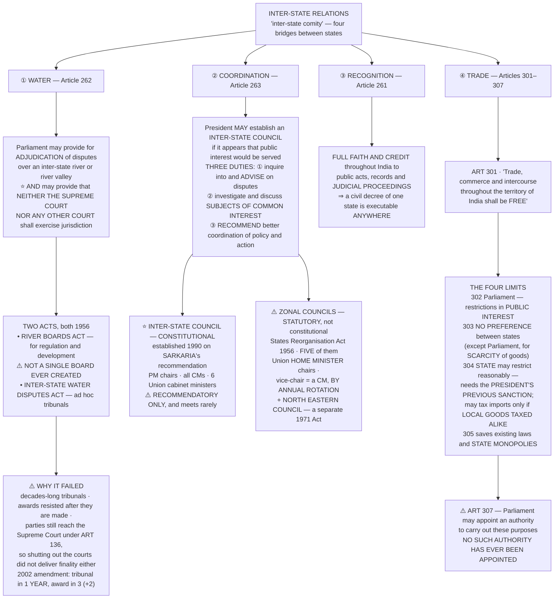

# Chapter 15 — Inter-State Relations

[← Chapter 14](14_Centre_State_Relations.md) · [Part Index](00_INDEX.md) · [Master](../00_INDEX.md) · [Chapter 16 →](16_Emergency_Provisions.md)

**Read time ~9 min** · Prelims: the **constitutional / statutory / executive** classification is asked almost every year · Mains: **2006, 2010, 2013**

> 📌 **[Chapter 14](14_Centre_State_Relations.md) was vertical — Centre above, states below. This chapter is horizontal — states beside each other.** It is shorter and easier, but it contains one of the most reliably tested Prelims traps in the whole book: which of these bodies is **constitutional**, which is **statutory**, and which is merely **executive**.

---

## 🎯 The one-line point

> **A federation cannot work if its units treat each other as foreign countries.** So the Constitution builds four bridges between states — a way to settle **water** disputes, a forum to **coordinate**, a rule that each state must **honour the others' legal acts**, and a guarantee of **free trade** across internal borders. Three of the four work reasonably well. The water one has failed, and that failure is the exam question.

---

## 📖 The story

Think of an apartment building where each flat is independently owned.

Ownership is clear, but four things still need rules that no single owner can make. **Who gets how much of the shared water tank** when supply is short. **Some place to sit down and sort out common problems** before they become fights. **A rule that a decision taken in one flat is respected in the others** — otherwise every dispute restarts from zero. And **the right to move freely between floors** without one owner charging a toll at the staircase.

Those four are exactly Articles **262, 263, 261 and 301–307**.

**And notice which one causes all the trouble in real life: the water tank.** Everything else can be settled by talking, because nothing is being taken away from anyone. Water is the one resource where **one state's gain is literally another state's loss** — and the Constitution's answer to it, adjudication by tribunal with the courts shut out, has produced disputes running for **forty and fifty years**.

---

## 🗺️ The chapter in one picture

---

## PART A — Inter-state water disputes (Article 262) ⭐

### What the article says

> **Article 262(1)** — Parliament may by law provide for the **adjudication of any dispute or complaint** with respect to the **use, distribution or control of the waters** of, or in, any **inter-state river or river valley**.
>
> **Article 262(2)** — Parliament may by law provide that **neither the Supreme Court nor any other court shall exercise jurisdiction** in respect of any such dispute.

### ⭐ Why the courts were deliberately shut out

This is the conceptual point, and most answers miss it. Water disputes are **not really legal disputes**. They turn on hydrology, cropping patterns, rainfall, population, and the political weight of the states involved — questions of **fact, economics and politics**, not of law. The framers therefore created an **extra-judicial machinery**: expert tribunals rather than judges applying rules.

**It has not worked.** Understanding *why* is the whole Mains answer.

### The two Acts — both 1956

| Act | Purpose | Status |
|---|---|---|
| **River Boards Act, 1956** | Provides for the establishment of **River Boards** for the **regulation and development** of inter-state rivers and river valleys, set up by the Central government on a state's request, in an **advisory** capacity | ⚠️ **Not a single River Board has ever been created.** A dead letter |
| **Inter-State Water Disputes Act, 1956** | On a **state's request**, the Centre may set up an **ad hoc tribunal** to adjudicate. Its **award is final and binding** on the parties. **Neither the Supreme Court nor any other court** has jurisdiction over a dispute referred to a tribunal | Used repeatedly — and slowly |

### ⚠️ Why the machinery failed — the four reasons

1. **Delay in constituting the tribunal.** For decades there was no time limit at all — the Centre could simply not refer a dispute.
2. **Delay in the award.** Tribunals have taken **decades**: the **Cauvery** tribunal was constituted in **1990** and gave its final award in **2007** — seventeen years — after a dispute already running since the 1890s.
3. **Awards resisted after they are made.** A "final and binding" award means little when a state government faces an electorate that rejects it. Implementation has repeatedly required central or judicial pressure.
4. ⭐ **The exclusion of the courts did not deliver finality.** Article 262(2) bars the Supreme Court's ordinary jurisdiction — but parties still reach the Court under **Article 136 (special leave)**, so the disputes end up there anyway. **The framers gave up judicial finality without gaining speed.**

**The 2002 amendment** to the Inter-State Water Disputes Act tried to fix (1) and (2): a tribunal must now be constituted **within one year** of receiving a request, and must give its award **within three years**, extendable by **two more**.

**The 2019 Bill** proposed a **single permanent tribunal** with multiple benches, plus a **Dispute Resolution Committee** to attempt negotiated settlement before adjudication.

**The major tribunals to be able to name:** Krishna · Godavari · Narmada · **Cauvery** · Ravi–Beas · Vansadhara · Mahadayi · Mahanadi.

> **The exception that proves cooperation is possible** — outside this machinery altogether, the **Indus Waters Treaty (1960)** between India and Pakistan has survived every war between the two countries. It is the counter-example worth citing: **water disputes are not inherently unsolvable; the institutional design matters.**

---

## PART B — Inter-state councils (Article 263) ⭐⭐

*This part contains the single most tested classification in the chapter.*

### What the article says

> The **President may establish** an Inter-State Council **if at any time it appears to him that the public interest would be served** by its establishment. He defines its **nature of duties, organisation and procedure**.

### The three duties — reproduce all three

| | Duty |
|---|---|
| **(a)** | **Inquiring into and advising upon disputes** which may have arisen between states |
| **(b)** | **Investigating and discussing subjects** in which some or all of the states, or the Union and one or more states, have a **common interest** |
| **(c)** | **Making recommendations** upon any such subject, particularly for the **better co-ordination of policy and action** |

> ⚠️ **Note duty (a) carefully.** The Council can advise on disputes — but its role is **advisory**, and it is **not** the body that decides water disputes. That is Article 262's tribunal. Keeping 262 and 263 apart is a standard Prelims trap.

### The Inter-State Council itself

- Councils under Article 263 had been established before — the **Central Council of Health**, the **Central Council of Local Government and Urban Development**, the **Transport Development Council**, the **Central Council of Indian Medicine**, the **Central Council of Homoeopathy**.
- ⭐ But **the** Inter-State Council was established by a **Presidential order in 1990**, on the recommendation of the **Sarkaria Commission** (see [Chapter 14](14_Centre_State_Relations.md)).

**Composition:**

| Role | Who |
|---|---|
| **Chairman** | The **Prime Minister** |
| **Members** | **Chief Ministers of all states** · Chief Ministers of **UTs with legislatures** · **Administrators of UTs without legislatures** · **Governors of states under President's Rule** · **six Union Cabinet Ministers**, including the **Home Minister**, nominated by the PM |

**Standing Committee** (constituted **1996**): chaired by the **Union Home Minister**, with **five Union Cabinet Ministers** and **nine Chief Ministers**.

⚠️ **It is a recommendatory body.** It is meant to meet **three times a year**; in practice it has met rarely, which is the standing criticism and the answer to [Mains 2006 Q8(b)](../../04_PYQ_Mains/2006.md).

### ⭐⭐ The classification trap — learn this table cold

| Body | Status | Source |
|---|---|---|
| **Inter-State Council** | ✅ **CONSTITUTIONAL** | **Article 263** |
| **Zonal Councils** | ⚠️ **STATUTORY** | **States Reorganisation Act, 1956** |
| **North Eastern Council** | ⚠️ **STATUTORY** | **North Eastern Council Act, 1971** *(a separate Act — it is **not** a zonal council)* |
| **National Development Council** | ⚠️ **EXECUTIVE** | Cabinet resolution, 1952 |
| **NITI Aayog** | ⚠️ **EXECUTIVE** | Cabinet resolution, 2015 |
| **National Security Council** | ⚠️ **EXECUTIVE** | 1998 |

> This is exactly what [Prelims 2025 Q3](../../03_PYQ_Prelims/2025.md) tested — *"How many of the above were established as per the provisions of the Constitution of India?"* Answer: **only one**, the Inter-State Council. See also [Prelims 2013 Q18](../../03_PYQ_Prelims/2013.md) on bodies not mentioned in the Constitution.

### Zonal Councils

**Five**, created by the **States Reorganisation Act, 1956** to promote cooperation among states in a region:

| Zone | Members |
|---|---|
| **Northern** | Haryana, Himachal Pradesh, Punjab, Rajasthan, Delhi, Chandigarh, Jammu & Kashmir, Ladakh |
| **Central** | Chhattisgarh, Madhya Pradesh, Uttarakhand, Uttar Pradesh |
| **Eastern** | Bihar, Jharkhand, Odisha, West Bengal |
| **Western** | Goa, Gujarat, Maharashtra, Dadra & Nagar Haveli and Daman & Diu |
| **Southern** | Andhra Pradesh, Karnataka, Kerala, Tamil Nadu, Telangana, Puducherry |

**Organisation:**
- **Chairman:** the **Union Home Minister**
- **Vice-Chairman:** the **Chief Minister of a member state**, held **by rotation, each holding office for a year**
- **Members:** the Chief Minister **plus two other ministers** from each state; the **Administrator** of each UT in the zone
- **Advisers:** one nominated by **NITI Aayog** (originally the Planning Commission), plus the **Chief Secretary** and **Development Commissioner** of each member state
- They are **advisory bodies** — they discuss economic and social planning, border disputes, inter-state transport, linguistic minorities, and matters arising out of reorganisation

**The North Eastern Council** is separate — created by the **NEC Act, 1971**, with **Assam, Manipur, Meghalaya, Nagaland, Tripura, Arunachal Pradesh and Mizoram**, and **Sikkim added in 2002**.

> ⭐ **Two facts about the NEC that UPSC likes:** it is **not** a zonal council under the 1956 Act, and **Sikkim joined only in 2002**. This was tested in [Prelims 2024 Q5](../../03_PYQ_Prelims/2024.md) — where the correct composition was the one set by the **2002 amendment** (Governors + Chief Ministers + three Presidential nominees), *not* the later 2018 arrangement making the Union Home Minister its chairman.

---

## PART C — Public acts, records and judicial proceedings (Article 261)

> **"Full faith and credit shall be given throughout the territory of India to public acts, records and judicial proceedings of the Union and of every State."**

Three points:
1. The **manner and conditions** of proving such acts and records, and determining their effect, is decided by **Parliament**.
2. **"Public acts"** includes both **legislative and executive** acts; **"public record"** includes any official book, register or record made by a public servant.
3. ⭐ **Final judgments or orders delivered by civil courts in any part of India are capable of execution anywhere in India** — a decree obtained in one state does not have to be re-litigated in another.

> ⚠️ **The limit worth noting:** this applies to **civil** judgments. It does **not** extend to the criminal laws of the states — one state is not required to enforce the penal laws of another.

---

## PART D — Inter-state trade and commerce (Articles 301–307)

### The guarantee

> **Article 301** — *"Trade, commerce and intercourse throughout the territory of India shall be **free**."*

The purpose is to make India **one economic unit** — to stop states erecting tariff walls, checkposts and preferences against each other. The freedom applies to trade **within a state** as well as **between states**, and it binds **both the Centre and the states**.

### The four limitations ⭐

| Article | Who may restrict | Condition |
|---|---|---|
| **302** | **Parliament** | May impose restrictions in the **public interest** |
| **303** | **Neither Parliament nor a state legislature** | ⭐ **Cannot give preference to one state over another**, or discriminate between states. **Exception:** Parliament may do so **if it is declared that a scarcity of goods has arisen** in any part of India |
| **304** | **A state legislature** | (a) May **tax goods imported from other states** — but **only if similar goods produced within the state are taxed alike**, i.e. **no discrimination**; (b) may impose **reasonable restrictions in the public interest** — but such a bill requires the **previous sanction of the President** |
| **305** | — | Saves **existing laws** and laws providing for **state monopolies** |

⚠️ **Article 307** — Parliament may by law appoint an **authority** to carry out the purposes of Articles 301–304, and confer powers on it. **No such authority has ever been appointed.**

> 🧠 **The pattern to notice across this chapter:** Article 262's River Boards Act produced **no boards**; Article 307's authority was **never appointed**; the Inter-State Council under 263 **meets rarely**. **Three of the four bridges were built in law and left unused in practice.** That observation — the gap between constitutional provision and institutional reality — is the single most useful analytical line you can carry out of this chapter, and it applies to almost any question on cooperative federalism.

---

## 🧠 Memory hooks

### The four bridges — the article numbers
> **262** water · **263** councils · **261** full faith and credit · **301–307** trade. *(Note 261 comes numerically before 262 but is usually taught third — do not let that confuse you.)*

### Article 262 in one line
> **Parliament may set up tribunals for inter-state river disputes — and may bar even the Supreme Court.** Two Acts, both **1956**: **River Boards Act** (never used) and **Inter-State Water Disputes Act** (used, slowly).

### The three duties under 263 — D-C-R
> **D**isputes (inquire and advise) · **C**ommon interest (investigate and discuss) · **R**ecommend better co-ordination.

### ⭐ The classification — the highest-value item here
> **Inter-State Council = CONSTITUTIONAL (Art 263).**
> **Zonal Councils = STATUTORY (SRA 1956). North Eastern Council = STATUTORY (1971 Act).**
> **NDC, NITI Aayog, NSC = EXECUTIVE.**

### The Inter-State Council in numbers
> Established **1990** · on **Sarkaria's** recommendation · **PM** chairs · **six** Union Cabinet Ministers · Standing Committee **1996** under the **Home Minister** with **5 ministers + 9 CMs** · meant to meet **three times a year**.

### Zonal Councils
> **Five** · **Union Home Minister** chairs · Vice-Chairman is a **CM by annual rotation** · **advisory**. NEC is **separate**, and **Sikkim joined in 2002**.

### Trade — the four limits
> **302** Parliament, public interest · **303** **no preference** between states, *unless scarcity is declared* · **304** state may tax imports **only without discrimination**, and needs the **President's previous sanction** for restrictions · **305** saves existing laws and **state monopolies**. **307 authority: never appointed.**

---

## ❓ Expected Mains questions

**1. "Constitutional mechanisms to resolve inter-state water disputes have failed to address and solve the problems. Is the failure due to structural or process inadequacy or both? Discuss." (250 words)**
> *Actually asked — [Mains 2013 Q6](../../04_PYQ_Mains/2013.md); the same theme in [2010 Q1(a)](../../04_PYQ_Mains/2010.md).*
> *Skeleton:* (i) Set out the mechanism — Article 262, the two 1956 Acts, ad hoc tribunals, exclusion of the courts. (ii) **Structural inadequacy** — ad hoc rather than permanent tribunals; the River Boards Act never operationalised; no institutional data on river flows; water on the **State List** (Entry 17) but inter-state rivers on the **Union List** (Entry 56), which the Centre has under-used; no enforcement machinery for awards. (iii) **Process inadequacy** — decades of delay before the 2002 amendment; awards resisted; parties still reach the Supreme Court under **Article 136**, so exclusion bought neither speed nor finality. (iv) **Both, and they compound each other** — a structurally weak forum invites procedural resistance. (v) Reforms: the 2019 Bill's **single permanent tribunal** and **Dispute Resolution Committee**; a national water framework; basin-level authorities. Close with the **Indus Waters Treaty** as proof that design, not the nature of water, is the problem.

**2. "How does the Inter-State Council establish co-ordination between States?" (150 words)**
> *Actually asked — [Mains 2006 Q8(b)](../../04_PYQ_Mains/2006.md).*
> *Skeleton:* Article 263 and the three duties; the 1990 establishment on Sarkaria's recommendation; composition under the PM with all CMs and six Union ministers; the 1996 Standing Committee; the subjects it has taken up (Centre–state relations, Sarkaria's own recommendations, internal security). Then the honest limitation: **advisory only, and it meets rarely** — so coordination in practice has migrated to the **GST Council** and NITI Aayog's Governing Council. Conclude that the Council's value is as a **standing constitutional forum** rather than a decision-making one.

**3. Distinguish between the Inter-State Council and the Zonal Councils. Which is better suited to resolving inter-state friction? (250 words)**
> *Skeleton:* Constitutional (263) vs statutory (SRA 1956); PM vs Union Home Minister; national vs regional membership; both advisory. Argue that **Zonal Councils are better suited to routine, regional, technical friction** (border disputes, transport, linguistic minorities) because they are smaller and meet more often, while the **Inter-State Council is better suited to structural questions** of Centre–state relations. Conclude that the two are complements, and that the real failure is under-use of both.

---

## ⚡ 60-second revision

- **Four bridges: 262** water · **263** councils · **261** full faith and credit · **301–307** trade.
- **Article 262:** Parliament may provide for **adjudication** of inter-state river disputes **and may bar even the Supreme Court**. Two Acts, both **1956** — **River Boards Act** (⚠️ **no board ever created**) and **Inter-State Water Disputes Act** (ad hoc tribunals, award **final and binding**).
- **Why it failed:** delay in constituting tribunals · decades to award (**Cauvery: 1990 → 2007**) · awards resisted · ⭐ **parties still reach the SC under Article 136**, so exclusion bought no finality. **2002 amendment:** tribunal in **1 year**, award in **3 (+2)**. **2019 Bill:** single **permanent** tribunal + **Dispute Resolution Committee**.
- **Article 263 — three duties:** advise on **disputes** · investigate **common interest** subjects · **recommend** better co-ordination.
- ⭐ **Inter-State Council: CONSTITUTIONAL**, established **1990** on **Sarkaria's** recommendation. **PM chairs**; all CMs; **six Union Cabinet Ministers**. **Standing Committee 1996** under the **Home Minister**. **Recommendatory**; meets rarely.
- ⚠️ **Zonal Councils: STATUTORY** — **States Reorganisation Act 1956**, **five** of them, **Union Home Minister** chairs, Vice-Chairman a **CM by annual rotation**, **advisory**. **North Eastern Council: separate Act, 1971; Sikkim added 2002.**
- ⚠️ **NDC, NITI Aayog, NSC are EXECUTIVE bodies** — not constitutional, not statutory.
- **Article 261:** **full faith and credit** to public acts, records and judicial proceedings; **civil decrees executable anywhere in India**; does **not** extend to states' criminal laws.
- **Article 301:** trade, commerce and intercourse **shall be free**. Limits — **302** Parliament in public interest · **303** **no preference between states** *(exception: Parliament, on a declared **scarcity of goods**)* · **304(a)** a state may tax imports **only if local goods are taxed alike**, **304(b)** reasonable restrictions need the **President's previous sanction** · **305** saves existing laws and **state monopolies**. ⚠️ **Article 307 authority — never appointed.**
- ⭐ **The theme:** River Boards **never created**, Article 307 authority **never appointed**, Inter-State Council **rarely meets**. **The bridges exist in law and go largely unused in practice.**

---

## 🔗 Practice this chapter

**Prelims:** [2013 Q18](../../03_PYQ_Prelims/2013.md) — bodies not mentioned in the Constitution · [2024 Q5](../../03_PYQ_Prelims/2024.md) — North Eastern Council composition · [2025 Q3](../../03_PYQ_Prelims/2025.md) — Inter-State Council vs National Security Council vs Zonal Councils

**Mains:** [2006 Q8(b)](../../04_PYQ_Mains/2006.md) — Inter-State Council · [2010 Q1(a)](../../04_PYQ_Mains/2010.md) — riparian disputes · [2013 Q6](../../04_PYQ_Mains/2013.md) — failure of the water-dispute mechanism

**Next:** [Chapter 16 — Emergency Provisions](16_Emergency_Provisions.md). 🔴🔴 **The highest-yield chapter left in Part II** — and the one that carries the ADM Jabalpur and 44th Amendment story running through half the syllabus.
