# Chapter 16 — Emergency Provisions

[← Chapter 15](15_Inter_State_Relations.md) · [Part Index](00_INDEX.md) · [Master](../00_INDEX.md)

**Read time ~20 min** · 🔴🔴 **The highest-yield chapter in Part II — give it two sittings** · Prelims: **2017, 2018** and recurring · Mains: **2004, 2018, 2023**

> 📌 **This is the chapter where the whole Constitution is tested against itself.** Everything you learned in Part I — Fundamental Rights, federalism, judicial review — is suspended, diluted or reversed here. And the story it carries (**ADM Jabalpur → the 44th Amendment**) runs through Chapters 7, 10, 11, 13 and 14. If you understand this chapter properly, half of GS-II gets easier.

---

## 🎯 The one-line point

> **The Constitution contains the instructions for its own suspension.** Articles 352–360 let the Centre convert a federal, rights-bearing democracy into a unitary state where Article 19 lapses and courts can be shut out. Ambedkar hoped these articles *"would never be called into operation and… would remain a dead letter."* **In 1975 they were called into operation, and everything that has been built since — the 44th Amendment, *Bommai*, the modern reading of Article 21 — is a response to what happened.**

---

## 📖 The story

Every constitution faces one question it cannot dodge: **what happens when the ordinary rules cannot cope?**

Ignore it, and a genuine crisis forces the government to act illegally — and once it has done so successfully, the constitution has lost its authority. Provide for it, and you hand the government a legal instrument for suspending the constitution — which it may reach for when there is no real crisis at all.

The framers chose the second, consciously, and were warned about it at the time. **H.V. Kamath said in the Assembly that these provisions could turn India into a "police state".** Ambedkar's defence was that the alternative was worse, and he added the hope that the articles would remain **a dead letter**.

**They did not.** Article 352 was invoked three times. Article 356 has been used **more than 100 times**. And on **25 June 1975** an Emergency was proclaimed on the ground of *"internal disturbance"* — a phrase nowhere defined — under which elections were postponed, opposition leaders were jailed, the press was censored, and the Supreme Court held in ***ADM Jabalpur*** that **during an Emergency a person had no remedy even against unlawful detention, and no right to approach a court even to save his life.**

> 💡 **The analogy that fits:** these provisions are the **breaking of the glass on a fire alarm**. Necessary — a building without one is more dangerous, not less. But the glass is deliberately easy to break, so everything depends on **who is allowed to break it, on what evidence, and who checks them afterwards.** Between 1975 and 1977 India discovered that its alarm could be pulled by one person, with no evidence, and no one to check.
>
> **The 44th Amendment of 1978 is entirely about re-designing that alarm** — armouring the glass, requiring a written decision from the whole Cabinet, and adding a way for Parliament to switch it off.

**Read this chapter as a before-and-after.** Almost every safeguard you will learn exists because something specific went wrong in 1975–77.

---

## 🗺️ The chapter in one picture

```mermaid
flowchart TD
    E["EMERGENCY PROVISIONS · PART XVIII · ARTICLES 352–360<br/>Ambedkar: hoped they 'would remain A DEAD LETTER'"] --> N["① NATIONAL EMERGENCY · 352<br/>'war, external aggression or ARMED REBELLION'"]
    E --> P["② PRESIDENT'S RULE · 356<br/>state government 'cannot be carried on in accordance<br/>with the provisions of this Constitution'"]
    E --> F["③ FINANCIAL EMERGENCY · 360<br/>threat to the FINANCIAL STABILITY or CREDIT of India"]

    N --> N1["⭐ 44th AMENDMENT CHANGED FOUR THINGS<br/>① 'internal disturbance' → 'ARMED REBELLION'<br/>② needs the CABINET'S WRITTEN recommendation<br/>③ approval in ONE month (was two), by SPECIAL majority<br/>④ LOK SABHA can REVOKE by simple majority —<br/>1/10th of members ⇒ special sitting in 14 days"]
    N --> N2["DURATION: 6 months at a time, INDEFINITELY<br/>EFFECTS: Centre may direct states on ANY matter ·<br/>Parliament legislates on the STATE LIST ·<br/>President may modify REVENUE distribution ·<br/>Lok Sabha life extendable ONE YEAR AT A TIME"]
    N --> N3["FUNDAMENTAL RIGHTS<br/>ART 358 — Article 19 suspended AUTOMATICALLY,<br/>⚠️ only for WAR / EXTERNAL AGGRESSION (44th Amd)<br/>ART 359 — President may suspend the RIGHT TO MOVE<br/>COURTS for other FRs ⚠️ EXCEPT ARTICLES 20 AND 21"]
    N --> N4["DECLARED THREE TIMES<br/>1962 China · 1971 Pakistan · ⚠️ 1975 'internal disturbance'"]

    P --> P1["GROUNDS: Article 356 (President's satisfaction)<br/>or ARTICLE 365 (state ignores a Centre DIRECTION)"]
    P --> P2["APPROVAL: 2 months, SIMPLE majority · then 6 months<br/>MAX THREE YEARS — beyond ONE year only if<br/>① a National Emergency is in operation AND<br/>② the ELECTION COMMISSION certifies elections<br/>cannot be held (44th Amendment)"]
    P --> P3["EFFECTS: President assumes state EXECUTIVE functions ·<br/>Parliament exercises the state LEGISLATURE's powers ·<br/>⚠️ the President CANNOT assume the HIGH COURT's powers"]
    P --> P4["⭐ S.R. BOMMAI 1994 — the turning point<br/>356 is JUSTICIABLE · burden on the CENTRE ·<br/>majority tested ON THE FLOOR, not by the Governor ·<br/>Assembly only SUSPENDED until BOTH HOUSES approve ·<br/>SECULARISM and FEDERALISM are basic structure"]

    F --> F1["APPROVAL: 2 months, SIMPLE majority<br/>⚠️ then continues INDEFINITELY —<br/>NO maximum period, NO periodic re-approval"]
    F --> F2["EFFECTS: canons of financial propriety ·<br/>REDUCE SALARIES of state employees ·<br/>reserve ALL MONEY BILLS for the President ·<br/>⚠️ reduce salaries of SUPREME COURT and HIGH COURT JUDGES"]
    F --> F3["⭐ NEVER BEEN DECLARED — not even in 1991"]
```

---

## PART A — The three emergencies at a glance ⭐

**Build this table from memory before anything else. Most Prelims questions are one row of it.**

| | **National Emergency (352)** | **President's Rule (356)** | **Financial Emergency (360)** |
|---|---|---|---|
| **Ground** | **War, external aggression or armed rebellion** *(or imminent danger of them)* | State government **cannot be carried on in accordance with the Constitution** — or fails to comply with a Centre direction **(Art 365)** | Threat to the **financial stability or credit** of India or any part |
| **Also called** | "External Emergency" *(war/aggression)* or "Internal Emergency" *(armed rebellion)* | **State Emergency** / Constitutional Emergency | — |
| **Parliamentary approval within** | **One month** *(44th Amd; originally two)* | **Two months** | **Two months** |
| **Majority needed** | ⭐ **Special majority** *(majority of total membership **and** two-thirds present and voting)* | **Simple majority** | **Simple majority** |
| **Duration once approved** | **Six months**, extendable **indefinitely**, six months at a time | **Six months**, extendable to a **maximum of three years** | ⚠️ **Indefinitely — no maximum, no periodic re-approval** |
| **Revocation** | President may revoke anytime; ⭐ **Lok Sabha may force it by simple majority** | President may revoke anytime; **no parliamentary approval needed** | President may revoke anytime |
| **Times used** | **3** — 1962, 1971, 1975 | **100+** | ⭐ **Never** |

> 🧠 **The three-line mnemonic:** **352 needs a *special* majority in *one* month and can run *forever*. 356 needs a *simple* majority in *two* months and dies at *three years*. 360 needs a *simple* majority in *two* months and then never needs asking again.**

---

## PART B — National Emergency (Article 352) ⭐⭐

### The grounds

The President may declare a National Emergency if he is satisfied that a grave emergency exists whereby the security of India or any part is threatened by **war, external aggression or armed rebellion**.

- He may declare it **even before the actual occurrence**, if he perceives **imminent danger**.
- **42nd Amendment (1976):** enabled the Emergency to be confined to **a part of the territory** of India, rather than the whole.
- Two informal names: **"External Emergency"** when declared on the ground of war or external aggression; **"Internal Emergency"** when declared on the ground of armed rebellion.

### ⭐⭐ The 44th Amendment — the four safeguards, and why each exists

**This is the most examinable content in the chapter. Learn each change *with the 1975 failure it was fixing*.**

| # | 44th Amendment change | The 1975 failure it fixes |
|---|---|---|
| **1** | ⭐ **"Internal disturbance" was replaced by "ARMED REBELLION"** | The 1975 Emergency was declared for *"internal disturbance"* — an undefined phrase broad enough to cover ordinary political opposition. "Armed rebellion" sets a much higher, factual threshold |
| **2** | The President may declare only on the **written recommendation of the Cabinet** | In 1975 the proclamation was issued on the **Prime Minister's advice alone**; the Cabinet was informed **afterwards**. It now requires the **whole Cabinet, in writing** |
| **3** | Approval within **one month** (was two), and by **special majority** (was simple) | A two-month window with a simple majority let a government with an ordinary majority ratify at leisure. Now a **two-thirds** vote is needed, and quickly |
| **4** | ⭐ **The Lok Sabha can force revocation by a simple majority.** **One-tenth of the members** may give written notice, and a **special sitting must be held within 14 days** | In 1975 there was **no mechanism at all** for Parliament to end an Emergency the government wished to continue. This creates one, and deliberately sets the bar *low* — simple majority to *end* it, special majority to *continue* it |

> ⭐ **Point 4 contains the sharpest design idea in the chapter: the asymmetry is intentional.** It is **hard to start and continue** an Emergency (special majority) and **easy to stop** one (simple majority). Say that in an answer and you have shown you understand the amendment rather than memorised it.

**Also from the 44th Amendment:** the words *"the proclamation may be varied"* were added, and the Supreme Court's power was restored — in ***Minerva Mills* (1980)** the Court held that a **proclamation of National Emergency can be challenged** in court on the ground of **malafide**, or that the declaration was based on **wholly extraneous or irrelevant facts**.

### Duration and approval

- Approved by **both Houses within one month**, by **special majority**.
- Once approved, continues for **six months**, and can be extended **indefinitely**, with parliamentary approval **every six months**.
- ⚠️ **If the Lok Sabha is dissolved** during the one month without approving, the proclamation survives until **30 days from the first sitting of the reconstituted Lok Sabha**, **provided the Rajya Sabha has approved it** in the meantime.

### ⭐ The effects — three groups

**① On Centre–State relations** *(the federal structure becomes unitary without a single word of the Constitution being amended)*

| Sphere | Effect |
|---|---|
| **Executive** | The Centre may give **directions to any state on any matter** — the states remain, but under complete central direction |
| **Legislative** | **Parliament may legislate on any State List subject** (Article 250). The state legislature is **not suspended**, but central law prevails. ⭐ Such laws **cease six months after the Emergency ends** |
| **Financial** | The President may **modify the constitutional distribution of revenues** between Centre and states — such an order lasts till the **end of the financial year in which the Emergency ceases** |

**② On the life of the legislatures**

- The **Lok Sabha's term may be extended by law for one year at a time**, with no limit on the number of extensions — but **not beyond six months after the Emergency ceases**.
- The same applies to a **state legislative assembly**.
- ⚠️ **This happened.** The Lok Sabha elected in 1971 had its term extended twice during the 1975–77 Emergency.

**③ On Fundamental Rights — Articles 358 and 359** ⭐⭐

*This is the single most tested distinction in the chapter.*

| | **Article 358** | **Article 359** |
|---|---|---|
| **Which rights** | ⭐ **Only Article 19** | ⭐ **Any Fundamental Rights** *(as specified in the order)* — **except Articles 20 and 21** |
| **How it operates** | **Automatic** — the moment the Emergency is proclaimed | Requires a **separate presidential order** |
| **What is suspended** | ⭐ **The rights themselves** are suspended | ⭐ **Only the right to move a court** for their enforcement — the right survives, the remedy does not |
| **Which emergencies** | ⚠️ **Only war or external aggression** *(44th Amd)* — **not armed rebellion** | **Both** external and internal grounds |
| **Extent** | The **whole country** | The **whole or any part** of India |
| **Duration** | The **entire duration** of the Emergency | The **period specified** in the order, which may be shorter |
| **Laws protected** | Only laws **related to the Emergency**, and only executive action **taken under such a law** *(44th Amd)* | Same limitation *(44th Amd)* |

> ⭐ **The two 44th Amendment fixes here are the ones examiners love:**
> 1. **Articles 20 and 21 can never be suspended.** This is the direct answer to ***ADM Jabalpur* (1976)**, where the Supreme Court held **4:1** that during an Emergency a detenu had **no locus standi** to move a writ of habeas corpus — even against unlawful detention, even against a threat to life. **Justice H.R. Khanna's lone dissent cost him the Chief Justiceship** and is now regarded as the finest judgment in the Court's history. *ADM Jabalpur* was **expressly overruled** in ***K.S. Puttaswamy* (2017)**, the right-to-privacy case.
> 2. **Article 358 now applies only to war and external aggression** — so an Emergency declared for *armed rebellion* no longer automatically suspends Article 19.

### The three declarations

| Year | Ground | Notes |
|---|---|---|
| **1962** | **External aggression** — the Chinese attack | Remained in force until **1968** — long after the war ended |
| **1971** | **External aggression** — the war with Pakistan | Still in operation when the next one was declared |
| ⚠️ **1975** | **"Internal disturbance"** | Proclaimed **25 June 1975**. The 1971 and 1975 proclamations were **in operation simultaneously** until both were revoked in **1977** |

> ⭐ **The fact that catches people out:** in 1975 India was **already** under a National Emergency (from 1971). The second proclamation was **layered on top of an existing one** — which is itself evidence that the first had been allowed to run on with no continuing justification. The 44th Amendment's six-monthly re-approval requirement exists precisely to stop an Emergency drifting on unnoticed.

---

## PART C — President's Rule (Article 356) ⭐⭐

### The two grounds

| Article | Ground |
|---|---|
| **356** | The President, **on receipt of a report from the Governor or otherwise**, is satisfied that a situation has arisen in which **the government of the state cannot be carried on in accordance with the provisions of the Constitution** |
| ⭐ **365** | The state **fails to comply with, or give effect to, any direction from the Centre** — the President "may hold" that such a situation has arisen |

> **Note the words "or otherwise" in Article 356.** The President is **not dependent on the Governor's report** — he may act on other material. This matters, because the Governor's report has been the usual route and the usual source of controversy.

### Approval and duration

- **Both Houses must approve within two months**, by **simple majority**.
- Then it continues for **six months at a time**, with approval every six months.
- ⭐ **Maximum three years.**
- ⚠️ **Beyond one year, it can be extended only if BOTH of these are satisfied** *(44th Amendment)*:
  1. A **Proclamation of National Emergency is in operation** in the whole of India, or in the whole or any part of the state; **and**
  2. The **Election Commission certifies** that elections to the state assembly **cannot be held**.

> ⭐ **That double condition is the 44th Amendment's most effective single safeguard**, and a favourite Prelims item. It makes routine multi-year President's Rule almost impossible — which is why extensions beyond a year are now rare.

### The effects

The President may:
1. **Assume to himself all or any of the functions of the state government**, and the powers vested in the Governor or any other state executive authority
2. **Declare that the powers of the state legislature shall be exercisable by or under the authority of Parliament**
3. Make **any other incidental and consequential provisions**, including suspending in whole or in part the operation of any constitutional provision relating to any body or authority in the state

⚠️ **The one limit:** the President **cannot assume to himself the powers vested in the High Court**, nor suspend any constitutional provision relating to the High Court. **The judiciary of the state remains untouched.**

**Practical consequences:**
- The President dismisses the **Council of Ministers** headed by the Chief Minister; the state is administered by the **Governor on the President's behalf**, usually with the Chief Secretary and advisers.
- The **state assembly is either suspended or dissolved**.
- Parliament passes the state's legislative bills and budget; it may **delegate** law-making power to the President, who may in turn delegate it to another authority.
- ⭐ **Laws made by Parliament or the President during President's Rule continue in force even after it ends** — they remain operative until repealed, amended or re-enacted by the state legislature.

> This was tested in [Prelims 2017 Q14](../../03_PYQ_Prelims/2017.md) and [Prelims 2018 Q11](../../03_PYQ_Prelims/2018.md) — both on the precise consequences.

### ⭐⭐ S.R. Bommai v. Union of India (1994) — the turning point

The single most important case in Part II. **Its propositions:**

1. **Article 356 is subject to judicial review.** The President's satisfaction is not beyond scrutiny.
2. The **burden lies on the Centre** to prove that **relevant material** existed to justify the proclamation.
3. ⭐ The Court **can restore the dismissed government** and revive the assembly if the proclamation is held unconstitutional.
4. ⭐ **The state assembly should only be SUSPENDED, not dissolved, until both Houses of Parliament have approved the proclamation** — otherwise a wrongful dismissal becomes irreversible.
5. ⭐ **A government's majority must be tested on the floor of the House**, not determined by the Governor's subjective assessment.
6. **Secularism is a basic feature** — a state government acting against secularism may be dismissed under Article 356.
7. **Federalism is a basic feature** — the states have an independent constitutional existence and are *"not satellites or agents of the Centre."*
8. Power under Article 356 is an **exceptional power, to be used only when necessary** to fulfil the purpose of the article.

**The subsequent cases:**
- ***Rameshwar Prasad v. Union of India* (2006)** — the **dissolution of the Bihar assembly** on the Governor's report of anticipated horse-trading was held **unconstitutional**.
- ***Nabam Rebia* (2016)** — the **Governor's discretion is limited**; he cannot summon the House or advance a session against the advice of the Council of Ministers.

### The record, and why the frequency collapsed

- **Used more than 100 times** since 1950. **First use: Punjab, 1951.**
- Wholesale dismissals of opposition state governments followed changes of government at the Centre in **1977** and **1980**.
- ⭐ **After 1994 the frequency fell sharply.** Two reasons, and [Mains 2023 Q13](../../04_PYQ_Mains/2023.md) asks for exactly this pair:
  - **Legal:** *Bommai* made the power justiciable, imposed the floor test, and blocked immediate dissolution.
  - **Political:** the era of **coalition governments and strong regional parties** from 1989 onwards meant the Centre usually depended on regional allies who would not tolerate the dismissal of state governments.

**The Sarkaria Commission's position** — Article 356 should be used **"very sparingly, in extreme cases, as a measure of last resort"**, after all available alternatives have failed; the state should first be given a **warning**; and **all possibilities of forming an alternative government** should be explored before dissolution. *(See [Chapter 14](14_Centre_State_Relations.md).)*

---

## PART D — Financial Emergency (Article 360)

### The ground

The President may declare a Financial Emergency if satisfied that a situation has arisen whereby **the financial stability or credit of India, or of any part of its territory, is threatened**.

### ⚠️ Approval and duration — the anomaly

- Approved by **both Houses within two months**, by **simple majority**.
- ⭐ **Once approved, it continues indefinitely until revoked** — there is **no maximum period** and **no requirement of periodical parliamentary approval**.

> ⭐ **This is the trap.** Candidates assume all three emergencies need six-monthly renewal. **They do not.** National Emergency needs re-approval every six months; President's Rule needs it every six months and dies at three years; **Financial Emergency needs none at all.** The one that has never been used has the **weakest** duration safeguard.

### The effects

During a Financial Emergency, the Centre acquires **full control over the financial matters of the states**:

1. The Centre may direct a state to observe **canons of financial propriety** and any other directions it deems necessary.
2. ⭐ The Centre may direct the **reduction of salaries and allowances of all or any class of persons serving the state**.
3. ⭐ The Centre may require **all money bills and other financial bills** passed by a state legislature to be **reserved for the President's consideration**.
4. ⭐ The President may direct the **reduction of salaries and allowances of all or any class of persons serving the Union — including the judges of the Supreme Court and the High Courts.**

> **Point 4 is the striking one.** Judicial salaries are otherwise protected precisely so that judges cannot be pressured financially. **A Financial Emergency is the one circumstance in which the Constitution permits them to be cut** — which tells you how far these provisions go.

### ⭐ It has never been declared

Not once since 1950 — **not even during the 1991 balance-of-payments crisis**, when India pledged gold reserves and turned to the IMF. That restraint is itself worth citing: the crisis was real, and the government chose economic reform over emergency powers.

---

## PART E — Criticism and defence

### The criticism

1. **The federal character is destroyed** and the Union becomes all-powerful.
2. **The states become totally dependent** on the Centre for their very existence.
3. The **federal system becomes unitary** without a formal amendment.
4. **The President becomes a dictator** in law, and the financial autonomy of the states is nullified.
5. **Fundamental Rights become meaningless**, reducing the democratic foundations to a hollow shell.
6. ⭐ In the Constituent Assembly, **H.V. Kamath** warned these provisions could make India a **"police state"**, and **K.T. Shah** called them **"a chapter of reaction and retrogression"** that would enable **totalitarianism**.

### The defence

**Ambedkar's answer**, and the standard defence, is that the alternative is worse — a state facing genuine breakdown with no legal means to act will act illegally. He also said:

> *"In the first instance, they would never be called into operation and they would remain a dead letter. If at all they are brought into operation, I hope the President, who is endowed with these powers, will take proper precautions before actually suspending the administration of the provinces."*

**The honest verdict to write:** the criticism was **prophetic and the defence naive**, and India learned it the hard way between 1975 and 1977. **But the system corrected itself** — through the **44th Amendment** (1978), ***Bommai*** (1994) and the political arithmetic of coalition government. **The provisions today are far more constrained than the text alone suggests**, and every one of those constraints was earned.

---

## 🧠 Memory hooks

### The three, in one line each
> **352** — war, external aggression, **armed rebellion** · **special** majority · **one** month · **forever**
> **356** — state cannot be carried on per the Constitution · **simple** majority · **two** months · **three years max**
> **360** — threat to **financial stability or credit** · **simple** majority · **two** months · ⚠️ **indefinite, no renewal** · **never used**

### The 44th Amendment's four fixes to Article 352
> ① *"internal disturbance"* → **"armed rebellion"** ② **written recommendation of the Cabinet** ③ **one month, special majority** ④ **Lok Sabha may revoke by simple majority; 1/10th of members ⇒ sitting within 14 days**
>
> ⭐ **Hard to start, easy to stop — the asymmetry is deliberate.**

### 358 vs 359 — six differences
> **358:** Article **19** only · **automatic** · suspends **the rights** · only **war/external aggression** · **whole country** · **whole duration**
> **359:** **any FR except 20 and 21** · needs an **order** · suspends only **the remedy** · **both** grounds · **whole or part** · **specified period**

### The Article 356 extension condition
> Beyond **one year** only if **① a National Emergency is in operation** **AND ② the Election Commission certifies elections cannot be held.** *Both, not either.*

### *Bommai* in five words each
> **Justiciable · burden on the Centre · floor test · suspend, don't dissolve · secularism and federalism are basic structure.**

### The dates
> **1962** China · **1971** Pakistan · **25 June 1975** "internal disturbance" · **1976** *ADM Jabalpur* (4:1, **Khanna dissenting**) · **1978** 44th Amendment · **1980** *Minerva Mills* (proclamation challengeable for malafide) · **1994** *Bommai* · **2006** *Rameshwar Prasad* · **2017** *Puttaswamy* **overrules *ADM Jabalpur***

### What survives an Emergency
> **Articles 20 and 21 — always.** **The High Court's powers — always** (the President cannot assume them under 356). **Laws made during President's Rule — they outlive it.**

---

## ❓ Expected Mains questions

**1. "Under what circumstances can the Financial Emergency be proclaimed by the President of India? What consequences follow when such a declaration remains in force?" (150 words)**
> *Actually asked — [Mains 2018 Q3](../../04_PYQ_Mains/2018.md).*
> *Skeleton:* **Circumstances** — Article 360; satisfaction that the **financial stability or credit of India or any part** is threatened; approval by both Houses within **two months** by **simple majority**; thereafter **indefinite, with no periodic approval**. **Consequences** — Centre may direct **canons of financial propriety**; **reduce salaries** of state employees; require **all money bills to be reserved** for the President; and **reduce the salaries of Union employees including Supreme Court and High Court judges**. Close with the two facts that lift the answer: it has **never been proclaimed**, not even in **1991**; and it is the **only emergency with no maximum duration**.

**2. "Account for the legal and political factors responsible for the reduced frequency of using Article 356 by the Union Governments since the mid-1990s." (250 words)**
> *Actually asked — [Mains 2023 Q13](../../04_PYQ_Mains/2023.md).*
> *Skeleton:* Establish the baseline — **100+ uses**, wholesale dismissals in **1977** and **1980**. **Legal factors:** ***Bommai* (1994)** — justiciability, burden on the Centre, the **floor test**, **suspension not dissolution** until both Houses approve, restoration as a remedy; the **44th Amendment's** double condition for extension beyond a year; later reinforcement in *Rameshwar Prasad* (2006) and *Nabam Rebia* (2016). **Political factors:** the end of one-party dominance after **1989**; **coalition governments dependent on regional allies**; the rise of strong regional parties with a direct stake in state autonomy; greater media and public scrutiny. **Institutional:** the Sarkaria and Punchhi recommendations shaping convention. Conclude: **the text of Article 356 has not changed since 1978, but its practical meaning has been rewritten by a court judgment and a party system.**

**3. "The Emergency provisions convert the federal structure into a unitary one without a formal amendment." Discuss. (250 words)**
> *Skeleton:* Take the three spheres under Article 352 — **executive** (directions on any matter), **legislative** (Parliament on the State List, laws lapsing six months after), **financial** (President may modify revenue distribution). Add Article 356's assumption of state executive and legislative functions, and Article 360's control over state finances. Then the counter: the states are **not abolished**, the state legislature is **not dissolved** under 352, the **High Court is untouched**, Articles **20 and 21** survive, and *Bommai* holds **federalism to be basic structure**. Conclude with Ambedkar's own formulation — the Constitution is designed to be **"both unitary as well as federal according to the requirements of time and circumstances"** — i.e. **the convertibility is a designed feature, not a defect**, and the real safeguard is procedural.

**4. Examine the changes made by the 44th Amendment Act, 1978 to the emergency provisions, and assess whether they are adequate. (250 words)**
> *Skeleton:* List the changes against the failures they address (the table in Part B). Assess adequacy — **strong** on Article 352 (armed rebellion, Cabinet in writing, special majority, revocation by simple majority, Articles 20 and 21 inviolable) and **on the extension of 356 beyond a year**. **Weaker** where nothing was done: **Article 360 still has no maximum duration and no periodic approval**; Article 356's initial one-year period still permits misuse, which is why *Bommai* rather than the amendment did the real work; and the Governor's report remains a subjective trigger. Conclude: **the 44th Amendment fixed the emergency that had been abused and left largely untouched the two that had not been.**

---

## ⚡ 60-second revision

- **Part XVIII, Articles 352–360.** Ambedkar hoped they would **"remain a dead letter."** Kamath warned of a **"police state."**
- **National Emergency (352):** war · external aggression · **armed rebellion** (44th Amd replaced *"internal disturbance"*). May be declared **before** occurrence, and (42nd Amd) for **part** of India. Needs the **Cabinet's written recommendation**. Approval in **one month** by **special majority**; then **six months at a time, indefinitely**. **Lok Sabha may revoke by simple majority — 1/10th of members ⇒ special sitting within 14 days.** *Minerva Mills*: challengeable for **malafide** or **extraneous facts**.
- **Effects of 352:** Centre may direct states on **any matter** · Parliament legislates on the **State List** (laws lapse **six months** after) · President may **modify revenue distribution** · **Lok Sabha term extendable one year at a time**, not beyond **six months** after it ends.
- ⭐ **358 vs 359:** 358 = **Article 19 only**, **automatic**, suspends **the rights**, only **war/external aggression**, whole country, whole duration. 359 = **any FR except 20 and 21**, needs an **order**, suspends only **the remedy**, **both** grounds, whole **or part**, **specified** period.
- ***ADM Jabalpur* (1976)** — **4:1**, no remedy even against unlawful detention; **Khanna's dissent** cost him the Chief Justiceship; **overruled in *Puttaswamy* (2017)**.
- **Declared three times: 1962 · 1971 · 1975.** The **1971 and 1975 proclamations ran simultaneously** until 1977.
- **President's Rule (356):** grounds — Article **356** (President's satisfaction, on the Governor's report **or otherwise**) or **365** (state ignores a Centre direction). Approval in **two months** by **simple majority**; **six months** at a time; **maximum three years**; beyond **one year** only if **a National Emergency is in operation AND the EC certifies elections cannot be held**.
- **Effects of 356:** President assumes state **executive** functions; Parliament exercises the **legislature's** powers; ⚠️ the President **cannot assume the High Court's powers**; ⭐ laws made during President's Rule **survive** it.
- ⭐ ***S.R. Bommai* (1994):** **justiciable · burden on the Centre · floor test · Assembly suspended not dissolved until both Houses approve · restoration possible · secularism and federalism are basic structure.** Then *Rameshwar Prasad* (2006), *Nabam Rebia* (2016).
- **Used 100+ times**; first **Punjab 1951**; wholesale dismissals **1977** and **1980**; frequency collapsed after 1994 — **legally** because of *Bommai*, **politically** because of coalitions and regional parties. **Sarkaria: "very sparingly, as a measure of last resort."**
- **Financial Emergency (360):** threat to **financial stability or credit**. **Two months, simple majority**, then ⚠️ **indefinite — no maximum, no re-approval**. Effects: canons of financial propriety · **reduce state employees' salaries** · **all money bills reserved** for the President · ⭐ **reduce the salaries of Supreme Court and High Court judges**. ⭐ **Never declared — not even in 1991.**

---

## 🔗 Practice this chapter

**Prelims:** [2017 Q14](../../03_PYQ_Prelims/2017.md) — consequences of President's Rule · [2018 Q11](../../03_PYQ_Prelims/2018.md) — effect of Article 356 · [2020 Q11](../../03_PYQ_Prelims/2020.md) — basic structure and judicial review

**Mains:** [2004 Q6(b)](../../04_PYQ_Mains/2004.md) — breakdown of constitutional machinery · [2018 Q3](../../04_PYQ_Mains/2018.md) — Financial Emergency · [2023 Q13](../../04_PYQ_Mains/2023.md) — reduced frequency of Article 356

**Cross-links:** [Ch 7 Fundamental Rights](../Part_I_Constitutional_Framework/07_Fundamental_Rights.md) — Articles 20 and 21 and the *ADM Jabalpur* story · [Ch 10 Amendment](../Part_I_Constitutional_Framework/10_Amendment_of_the_Constitution.md) and [Ch 11 Basic Structure](../Part_I_Constitutional_Framework/11_Basic_Structure.md) — the 42nd/44th Amendment pair · [Ch 13 Federal System](13_Federal_System.md) — emergency provisions as the strongest unitary feature · [Ch 14 Centre–State Relations](14_Centre_State_Relations.md) — Article 365 and the Sarkaria recommendations

---

## 🎓 End of Part II — System of Government

You have now covered the **conceptual spine of GS-II**: how the executive is formed and held answerable *(Ch 12)*, how power is divided between levels *(Ch 13)*, how that division actually works across legislation, administration and finance *(Ch 14)*, how states deal with each other *(Ch 15)*, and what happens when the whole design is suspended *(Ch 16)*.

**Before moving to Part III, do this — about 90 minutes:**
1. Re-read only the **60-second revision** blocks of Chapters 12–16, in order.
2. Say the **1975→1978 story** out loud from memory: *internal disturbance → ADM Jabalpur → Khanna's dissent → 44th Amendment → Minerva Mills → Bommai → Puttaswamy overrules ADM Jabalpur.*
3. Build the **three-emergencies table** (Part A) from a blank sheet. If you can reproduce it, you will not lose a Prelims mark on this chapter.
4. Write **one** full answer — recommended: [2023 Q13](../../04_PYQ_Mains/2023.md), the Article 356 question, which uses Chapters 13, 14 and 16 together.

**Next: Part III — Central Government** *(Ch 17–29)*. It is the largest Part in the book, and **Ch 22 Parliament is 🔴🔴** — budget three sittings for it alone.

---

[← Chapter 15](15_Inter_State_Relations.md) · [Part Index](00_INDEX.md) · [Master](../00_INDEX.md)
