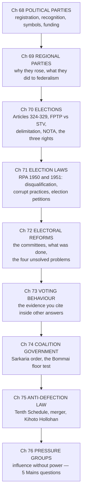

# PART IX — Other Constitutional Dimensions *(Chapters 63–78)*

[← Part VIII](../Part_VIII_Non_Constitutional_Bodies/00_INDEX.md) · [Master Index](../00_INDEX.md) · [Part X →](../Part_X_Working_of_the_Constitution/00_INDEX.md)

**Status: ✅ COMPLETE — all 16 chapters written** · **Total ~10 hrs** · ⚠️ ⭐ **The largest Part in the book, and the source of most GS-II "governance and politics" questions**

---

## ⚠️ Read this before you start

⭐ **The Part's title is misleading. It is not a miscellany — it contains the single highest-yield BLOCK left in the book.**

> ⭐⭐ **Chapters 68–76 are the ELECTIONS AND POLITICS cluster: parties, regional parties, elections, election law, electoral reform, voting behaviour, coalitions, anti-defection and pressure groups.** ⭐ **Together they have produced more than TWENTY Mains questions since 2000.** ⚠️ **Read those nine as one continuous subject, not as nine chapters.**

⭐ **Around that cluster sit four supporting chapters — Public Services (65), Special Provisions (67), Official Language (64) and National Integration (77) — and three light ones (63, 66, 78).**

---

## 📚 The chapters

| # | Chapter | Priority | Hrs | Status |
|---|---|---|---|---|
| 63 | [Co-operative Societies](63_Cooperative_Societies.md) | ⚪ | 0.25 | ✅ |
| 64 | [Official Language](64_Official_Language.md) | 🟡 | 0.5 | ✅ |
| 65 | [**Public Services**](65_Public_Services.md) | 🟠 | 0.75 | ✅ ⚠️ **7 Mains questions since 2013 — badly under-rated** |
| 66 | [Rights and Liabilities of the Government](66_Rights_and_Liabilities_of_the_Government.md) | ⚪ | 0.25 | ✅ |
| 67 | [Special Provisions Relating to Certain Classes](67_Special_Provisions_Certain_Classes.md) | 🟠 | 0.75 | ✅ |
| 68 | [Political Parties](68_Political_Parties.md) | 🟠 | 0.75 | ✅ |
| 69 | [Role of Regional Parties](69_Regional_Parties.md) | 🟠 | 0.5 | ✅ |
| 70 | [**Elections**](70_Elections.md) | 🔴 | 1 | ✅ |
| 71 | [Election Laws](71_Election_Laws.md) | 🟠 | 0.75 | ✅ ⚠️ **4 Mains questions since 2019** |
| 72 | [**Electoral Reforms**](72_Electoral_Reforms.md) | 🔴 | 1.25 | ✅ |
| 73 | [Voting Behaviour](73_Voting_Behaviour.md) | 🟡 | 0.5 | ✅ |
| 74 | [Coalition Government](74_Coalition_Government.md) | 🟡 | 0.5 | ✅ |
| 75 | [**Anti-Defection Law**](75_Anti_Defection_Law.md) | 🔴 | 0.75 | ✅ |
| 76 | [**Pressure Groups**](76_Pressure_Groups.md) | 🔴 | 0.5 | ✅ ⚠️ **5 Mains questions since 2013** |
| 77 | [National Integration](77_National_Integration.md) | 🟡 | 0.5 | ✅ |
| 78 | [Foreign Policy](78_Foreign_Policy.md) | ⚪ | 0.25 | ✅ |

---

## PART A — ⭐⭐ The elections cluster, in reading order

⭐ **Read these nine in this exact order. Each one assumes the last.**

---

## PART B — ⭐ The seven things to carry out of this Part

**1. ⭐⭐ The three rights *(Ch 70)***
> ⚠️ ⭐ **The right to VOTE is STATUTORY. The right to CONTEST is STATUTORY. The right to KNOW is FUNDAMENTAL — Article 19(1)(a).** ⭐ **That single article produced the candidate affidavit *(2002)*, NOTA *(2013)*, the RTI Act's foundation, and the striking down of electoral bonds *(2024)*.**

**2. ⭐⭐ The two RPAs *(Ch 71)***
> ⭐ **1950 = the VOTER and the CONSTITUENCY. 1951 = the CANDIDATE and the ELECTION.**

**3. ⭐⭐ One-third became two-thirds *(Ch 75)***
> ⭐ **The 91st Amendment, 2003 DELETED the one-third "split" exception. Only a TWO-THIRDS MERGER now survives** — plus the ministerial cap at 15% and the bar on a defector holding office.

**4. ⭐⭐ The Article 368(2) proviso, twice *(Ch 63 and Ch 75)***
> ⭐ **Paragraph 7 of the Tenth Schedule fell in *Kihoto Hollohan* (1992), and Part IXB fell in *Rajendra N. Shah* (2021) — both for want of RATIFICATION BY HALF THE STATES.** ⭐ **Two live examples of a federal procedure limiting the amending power.**

**5. ⭐⭐ The 2019 and 2023 amendments *(Ch 67)***
> ⭐ **104th (2019) — ended Anglo-Indian nomination, extended SC/ST seat reservation to 2030.** ⭐ **106th (2023) — one-third for women, triggered by a CENSUS and DELIMITATION, for 15 years, with rotation, and NOT in the Rajya Sabha.**

**6. ⭐⭐ The delimitation freeze *(Ch 70)***
> ⭐ **42nd froze seat allocation on the 1971 census; 84th extended it to 2026; 87th allowed boundary readjustment on the 2001 census.** ⚠️ ⭐ **Its expiry is about to become the largest federal question in Indian politics — and the 106th Amendment's women's reservation is locked to the same trigger.**

**7. ⭐⭐ Articles 310 and 311 *(Ch 65)***
> ⭐ **310 gives the pleasure; 311 takes it back.** ⭐ **The three exceptions — CONVICTION, NOT REASONABLY PRACTICABLE (in writing), SECURITY OF THE STATE.**

---

## PART C — ⭐ Where the Mains questions have come from

| Chapter | Mains questions |
|---|---|
| ⭐ [72 Electoral Reforms](72_Electoral_Reforms.md) | **2000, 2017 (×2), 2018, 2020, 2024, 2025** |
| ⭐ [65 Public Services](65_Public_Services.md) | **2013, 2014, 2016, 2017, 2020 (×2), 2021, 2024** |
| ⭐ [76 Pressure Groups](76_Pressure_Groups.md) | **2013, 2017, 2019, 2021, 2025** |
| ⭐ [71 Election Laws](71_Election_Laws.md) | **2019, 2020, 2022, 2025** |
| ⭐ [67 Special Provisions](67_Special_Provisions_Certain_Classes.md) | **2017, 2019, 2023** |
| [68](68_Political_Parties.md) / [69](69_Regional_Parties.md) Parties | **2016, 2022** |
| [75 Anti-Defection](75_Anti_Defection_Law.md) | **2013** |
| [74 Coalition](74_Coalition_Government.md) | **2002** |
| [63 Co-operatives](63_Cooperative_Societies.md) | **2010** |

> ⭐⭐ **Read the top three rows again.** ⚠️ **Electoral Reforms, Public Services and Pressure Groups have produced TWENTY Mains questions between them** — ⭐ **more than the President, the Prime Minister, the Supreme Court and the Governor combined.** ⭐ **Allocate your revision time to match that, not to match the chapters' length.**

---

## ✅ Before you leave this Part

1. ⭐⭐ **Say the three rights and their status** *(vote, contest, know)*.
2. ⭐ **Reproduce the Section 100 grounds** for declaring an election void, and note which one needs "materially affected the result."
3. ⭐⭐ **State the Tenth Schedule's three grounds, the two surviving exceptions, and what *Kihoto Hollohan* did to Paragraph 7.**
4. ⭐ **List the electoral-reform committees with one recommendation each** — Goswami, Vohra, Indrajit Gupta, the 244th and 255th Law Commission Reports.
5. ⭐ **Name a pressure group in each of the ten categories** — you will need examples, not definitions.
6. ⭐ **Recite Articles 310 and 311 with the three exceptions.**
7. Write **two** full answers — recommended: [Mains 2013 Q1](../../04_PYQ_Mains/2013.md) on anti-defection and the individual MP, and [Mains 2021 Q5](../../04_PYQ_Mains/2021.md) on business associations. ⭐ **Between them they cover both halves of this Part.**

---

**Next: [Part X — Working of the Constitution](../Part_X_Working_of_the_Constitution/00_INDEX.md)** *(Ch 79)* — ⭐ **one chapter, and it is the natural place to consolidate everything you have read.**
