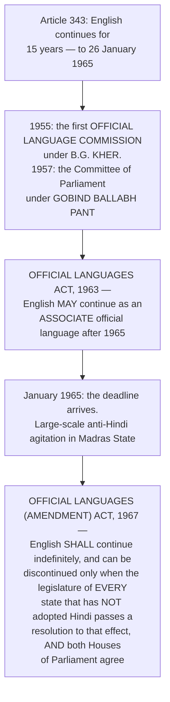

# Chapter 64 — Official Language

[← Chapter 63](63_Cooperative_Societies.md) · [Part Index](00_INDEX.md) · [Master](../00_INDEX.md) · [Chapter 65 →](65_Public_Services.md)

**Read time ~8 min** · **Part XVII, Articles 343–351 · Eighth Schedule** · 🟡 Prelims: **2024** · Mains: through federalism and national integration

> 📌 ⭐ **A quiet chapter that hides one of the most politically explosive questions in Indian history.** ⚠️ **The Constitution set a 15-year deadline for English to disappear; the deadline arrived in 1965 and produced violent agitation in Madras; and the response was a statute that has kept English in place ever since.** ⭐ **Learn the articles, but learn that story too — it is what makes the chapter answerable.**

---

## 🎯 The one-line point

> ⭐⭐ **India has an OFFICIAL language, not a NATIONAL language.** ⚠️ **The Constitution nowhere uses the phrase "national language."** ⭐ **Hindi in Devanagari is the official language of the Union; English continues alongside it by statute; and every state chooses its own.**

---

## PART A — ⭐ The scheme, article by article

| Article | ⭐ **Provision** |
|---|---|
| ⭐⭐ **343** | ⭐ **The official language of the UNION is HINDI in DEVANAGARI script.** The form of numerals is the ⭐ **INTERNATIONAL form of Indian numerals.** ⚠️ **ENGLISH was to continue for FIFTEEN YEARS from the commencement of the Constitution *(i.e. to 1965)*, and Parliament may by law provide for its continued use thereafter** |
| ⭐ **344** | ⭐ **The PRESIDENT shall constitute a COMMISSION ON OFFICIAL LANGUAGE at the expiration of FIVE years and again at the expiration of TEN years** from commencement; and ⭐ **a COMMITTEE OF PARLIAMENT of THIRTY members — 20 from the LOK SABHA and 10 from the RAJYA SABHA** — to examine the Commission's recommendations |
| ⭐ **345** | ⭐ **A state legislature may adopt any ONE OR MORE of the languages in use in the state, OR HINDI, as the official language of that state** |
| ⭐ **346** | The language for communication ⭐ **between one state and another, and between a state and the Union**, is the **official language of the Union** |
| ⭐ **347** | ⭐ **On a demand being made, the PRESIDENT may direct that a language spoken by a SUBSTANTIAL PROPORTION of a state's population be officially recognised** throughout that state or a part of it |
| ⭐⭐ **348** | ⭐ **The language of the SUPREME COURT and of every HIGH COURT, and of all Bills, Acts, Ordinances, orders, rules and regulations, is ENGLISH**, until Parliament provides otherwise. ⚠️ ⭐ **The GOVERNOR may, with the PRESIDENT'S PREVIOUS CONSENT, authorise Hindi or the state's official language in HIGH COURT PROCEEDINGS — but NOT for its judgments, decrees and orders** |
| **349** | A special procedure for enacting laws that change the language of the courts, during the first fifteen years |
| ⭐ **350** | ⭐ **The right to submit a REPRESENTATION for redress of a grievance in ANY language used in the Union or the state** |
| ⭐ **350A** | ⭐ **Facilities for instruction in the MOTHER TONGUE at the PRIMARY STAGE** for linguistic minority children *(7th Amendment, 1956)* |
| ⭐ **350B** | ⭐ **The Special Officer for Linguistic Minorities** *(see [Ch 49](../Part_VII_Constitutional_Bodies/49_Linguistic_Minorities.md))* |
| ⭐ **351** | ⭐ **A DIRECTIVE for the development of HINDI** — to promote its spread and develop it as a medium of expression for **all elements of India's composite culture**, drawing **primarily on SANSKRIT** and secondarily on other languages, without interfering with its genius |

> ⚠️ ⭐⭐ **Article 348 is the most commonly misremembered.** ⭐ **A High Court may hear arguments in Hindi or the state language with the Governor's authorisation and the President's consent — but its JUDGMENTS, DECREES AND ORDERS must still be in ENGLISH.** ⚠️ ⭐ **And the SUPREME COURT's language is ENGLISH, full stop — no authorisation route exists for it.**

---

## PART B — ⭐⭐ 1965: the deadline that did not hold

> ⭐⭐ **Read the last box carefully — it is the constitutional-political masterstroke of the chapter.** ⚠️ **The 1967 amendment gave EVERY non-Hindi state an effective VETO over the removal of English.** ⭐ **A single state's refusal keeps English in place.** ⭐ **That is why "English will be phased out" has been a dead letter for six decades, and it is the strongest evidence you can cite that Indian federalism protects linguistic minorities through political mechanisms rather than judicial ones.**

⭐ **The three-language formula** — from the **1968 National Policy on Education** and reaffirmed in the ⭐ **National Education Policy, 2020** *(which explicitly states that no language will be imposed on any state)*: in Hindi-speaking states, Hindi, English and a modern Indian language *(preferably a southern one)*; in non-Hindi-speaking states, the regional language, Hindi and English. ⚠️ **Implementation has always been asymmetric — the southern half of the formula was largely observed and the northern half largely was not, which is the root of the recurring grievance.**

---

## PART C — ⭐ The Eighth Schedule

| Element | Detail |
|---|---|
| ⭐ **Originally** | ⭐ **14 languages** |
| ⭐⭐ **Today** | ⭐ **22 languages** |
| ⭐ **21st Amendment, 1967** | ⭐ **SINDHI** |
| ⭐⭐ **71st Amendment, 1992** | ⭐ **KONKANI, MANIPURI, NEPALI** — ⭐ *exactly what [Prelims 2024 Q7](../../03_PYQ_Prelims/2024.md) asked* |
| ⭐ **92nd Amendment, 2003** | ⭐ **BODO, DOGRI, MAITHILI, SANTHALI** |

⭐ **What inclusion in the Eighth Schedule actually does — and does NOT do:**
> ⭐ **It DOES:** entitle the language to representation on the **Official Language Commission** *(Article 344)*, and make it a language Hindi must draw upon for its development under **Article 351**. In practice it also brings **Sahitya Akademi recognition**, use in **public examinations** and government support.
>
> ⚠️ ⭐ **It does NOT make a language an official language of the Union or of any state.** ⭐ **A state's official language comes from ARTICLE 345, not from the Eighth Schedule** — a distinction examiners test.

⚠️ ⭐ **"Classical language" status is different again** — it is conferred by an ⭐ **EXECUTIVE decision of the Ministry of Culture**, not by the Constitution, and carries academic and funding benefits. ⭐ **Beginning with Tamil (2004) and Sanskrit (2005), the list has since grown to eleven languages.** ⚠️ **Verify the current count and the most recent additions before quoting a number — this figure has changed more than once.**

---

## 🧠 Memory hooks

### The core proposition
> ⭐⭐ **India has an OFFICIAL language, not a NATIONAL one.** ⭐ **Hindi in DEVANAGARI + INTERNATIONAL numerals *(Article 343)*.**

### The two courts
> ⚠️ ⭐ **Supreme Court: ENGLISH only.** ⭐ **High Court: Hindi or the state language may be authorised by the GOVERNOR with the PRESIDENT'S PREVIOUS CONSENT — but NOT for judgments, decrees and orders.**

### The commission and the committee
> ⭐ **Article 344 — a Commission after 5 and 10 years *(KHER, 1955)*, and a Committee of Parliament of THIRTY — 20 Lok Sabha + 10 Rajya Sabha *(PANT, 1957)*.**

### The 1967 veto
> ⭐⭐ **English can be discontinued only if EVERY non-Hindi state's legislature AND both Houses of Parliament so resolve** — an effective veto for each state.

### The Schedule
> ⭐ **14 → 22.** ⭐ **21st (1967) Sindhi · 71st (1992) Konkani, Manipuri, Nepali · 92nd (2003) Bodo, Dogri, Maithili, Santhali.**

---

## ❓ Expected Mains questions

**1. "The language provisions of the Constitution were designed to produce a transition that never happened. Examine." (250 words)**
> *Skeleton:* ⭐ **The design** — Article 343's **15-year sunset for English**; Article 344's **review Commission and Parliamentary Committee**; Article 351's **directive to develop Hindi**; Article 348's **English courts pending Parliament's decision**. ⭐ **Why it did not happen** — the **1963 Act** made English an **associate** language; the ⭐ **1965 Madras agitation**; the ⭐ **1967 amendment's per-state veto**; the **asymmetric working of the three-language formula**; and the emergence of **English as an economic asset** rather than a colonial residue. ⭐ **The federal reading** — language was the basis on which states were reorganised *(the **States Reorganisation Act, 1956**)*, so a national language policy could not be imposed over the objection of the states that language created. ⚠️ **The costs of the stalemate** — English proficiency has become a **class marker** and a barrier to public employment and higher education; Hindi's spread through means other than policy has generated resentment; and **Article 351's Sanskritised standard** diverged from the Hindustani people actually speak. ⭐ **Conclude:** the transition failed, and its failure preserved the Union — ⭐ **the language settlement is best understood as a successful federal compromise disguised as a broken constitutional deadline.**

**2. "Discuss the significance of the Eighth Schedule and the demands for inclusion in it." (150 words)**
> *Skeleton:* ⭐ **What it is** — a list of **22 languages**, expanded by the **21st, 71st and 92nd Amendments**. ⭐ **What inclusion confers** — representation on the **Official Language Commission**, a claim on **Article 351** development, Sahitya Akademi recognition, use in **recruitment examinations**, and government publishing support. ⚠️ ⭐ **What it does NOT confer** — official-language status, which comes from **Article 345** for a state and Article 343 for the Union. **The demands** — dozens of languages *(Bhojpuri, Rajasthani, Tulu, Garo, Mizo and others)* seek inclusion; the ⭐ **Sitakant Mahapatra Committee** was set up to evolve objective criteria and no consensus definition of "language" versus "dialect" has emerged. ⭐ **Conclude:** inclusion is a **cultural and political recognition** more than a legal one, which is precisely why the demand for it is unending.

---

## ⚡ 60-second revision

- ⭐⭐ **Part XVII, Articles 343–351.** ⭐ **Article 343 — HINDI in DEVANAGARI, with the INTERNATIONAL form of Indian numerals; English for 15 years, extendable by Parliament.** ⚠️ **There is NO "national language."**
- ⭐ **344 — a Commission after 5 and 10 years *(KHER, 1955)* + a Committee of Parliament of 30: 20 Lok Sabha, 10 Rajya Sabha *(PANT, 1957)*.**
- ⭐ **345 — a state adopts its own official language(s) or Hindi.** ⭐ **346 — inter-state and state–Union communication uses the Union's official language.** ⭐ **347 — the President may recognise a language spoken by a substantial proportion of a state's population.**
- ⭐⭐ **348 — SUPREME COURT and HIGH COURTS, and all Bills and Acts, in ENGLISH.** ⭐ **The GOVERNOR, with the PRESIDENT'S PREVIOUS CONSENT, may authorise Hindi or the state language in High Court PROCEEDINGS — ⚠️ NOT in its judgments, decrees and orders.**
- ⭐ **350 — representation in any language · 350A — mother-tongue instruction at the primary stage · 350B — the Special Officer for Linguistic Minorities** *(350A and 350B: **7th Amendment, 1956**)*.
- ⭐ **351 — develop HINDI as a medium for India's composite culture, drawing PRIMARILY on SANSKRIT.**
- ⭐⭐ **Official Languages Act, 1963** *(English as an associate language)* **→ 1965 Madras agitation → Official Languages (Amendment) Act, 1967:** ⭐ **English continues until EVERY non-Hindi state's legislature AND both Houses of Parliament resolve otherwise.**
- ⭐ **Eighth Schedule: 14 → 22.** ⭐ **21st (1967) Sindhi · 71st (1992) Konkani, Manipuri, Nepali · 92nd (2003) Bodo, Dogri, Maithili, Santhali.** ⚠️ **Inclusion does NOT confer official-language status.**
- ⭐ **Three-language formula — 1968 NPE, reaffirmed by NEP 2020, which states that no language will be imposed on any state.**

---

## 🔗 Practice this chapter

**Prelims:** [2024 Q7](../../03_PYQ_Prelims/2024.md) — the 71st Amendment and the Eighth Schedule · [2015 Q33](../../03_PYQ_Prelims/2015.md) — sovereignty, unity and integrity · [2023 Q14](../../03_PYQ_Prelims/2023.md) — the Flag Code of India, 2002 *(the same "symbols of the Union" cluster)*

**Mains:** [2007 Q7(a)](../../04_PYQ_Mains/2007.md) — regionalism and its effect on Indian polity *(the language question is its origin)*

**Cross-links:** [Ch 49 Special Officer for Linguistic Minorities](../Part_VII_Constitutional_Bodies/49_Linguistic_Minorities.md) — Articles 350, 350A, 350B · [Ch 5 Union and its Territory](../Part_I_Constitutional_Framework/05_Union_and_its_Territory.md) — linguistic reorganisation and the 7th Amendment · [Ch 77 National Integration](77_National_Integration.md) — linguistic regionalism · [Ch 7 Fundamental Rights](../Part_I_Constitutional_Framework/07_Fundamental_Rights.md) — Articles 29 and 30

**Next:** [Chapter 65 — Public Services](65_Public_Services.md) — 🟠 **and, given six Mains questions since 2013, seriously under-rated.**

---

[← Chapter 63](63_Cooperative_Societies.md) · [Part Index](00_INDEX.md) · [Master](../00_INDEX.md) · [Chapter 65 →](65_Public_Services.md)
