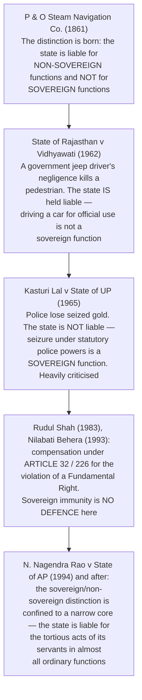

# Chapter 66 — Rights and Liabilities of the Government

[← Chapter 65](65_Public_Services.md) · [Part Index](00_INDEX.md) · [Master](../00_INDEX.md) · [Chapter 67 →](67_Special_Provisions_Certain_Classes.md)

**Read time ~6 min** · **Part XII, Articles 294–300A** · ⚪ Prelims: **2021 (right to property)** · Mains: rare directly, useful indirectly

> 📌 **A ⚪ chapter with two items that punch above their weight:** ⭐ **ARTICLE 299 (government contracts) and ARTICLE 300A (the right to property).** ⚠️ **Read the rest once; know those two properly.**

---

## 🎯 The one-line point

> ⭐ **The government is a legal person: it owns property, makes contracts, and can sue and be sued.** ⚠️ **But it is a legal person with a colonial inheritance — the doctrine of SOVEREIGN IMMUNITY, which for decades let the state escape liability for the wrongs of its own officers.** ⭐ **The story of this chapter is the courts dismantling that immunity.**

---

## PART A — ⭐ Property and trade

| Article | Provision |
|---|---|
| **294–295** | ⭐ **Succession** — the property, assets, rights, liabilities and obligations of the **Dominion of India and the Provinces** passed to the **Union and the states** |
| ⭐ **296** | ⭐ **Property accruing by ESCHEAT, LAPSE or as BONA VACANTIA** *(ownerless property, or property with no heir)* ⭐ **vests in the STATE** in which it is situated, or in the Union where the property was held for Union purposes |
| ⭐⭐ **297** | ⭐ **Things of value within TERRITORIAL WATERS or the CONTINENTAL SHELF, and the resources of the EXCLUSIVE ECONOMIC ZONE, vest in the UNION** |
| ⭐ **298** | ⭐ **The executive power of the Union and of each state extends to CARRYING ON ANY TRADE OR BUSINESS, to the acquisition, holding and disposal of property, and to the making of CONTRACTS** |

> ⭐ **Article 298 is the constitutional licence for the entire public-sector enterprise** — ⚠️ **note that it extends the executive power to trade even in fields outside that government's legislative competence, subject to Parliament's law.**

---

## PART B — ⭐⭐ Article 299 — government contracts

> ⭐ **Every contract made in the exercise of the executive power of the Union or of a state must be:**
> 1. ⭐ **EXPRESSED to be made by the PRESIDENT or by the GOVERNOR**;
> 2. ⭐ **EXECUTED ON BEHALF of the President or the Governor**;
> 3. ⭐ **Executed by such persons and in such manner as he may DIRECT or AUTHORISE.**

| Point | Detail |
|---|---|
| ⚠️ ⭐⭐ **Consequence of non-compliance** | ⭐ **The contract is VOID and unenforceable against the government.** ⚠️ **The courts have applied this strictly — the requirement is MANDATORY, not directory, because it protects public funds from unauthorised commitments** |
| ⭐ **But** | ⭐ **The person who supplied goods or services may still recover under the doctrine of RESTITUTION *(Section 70 of the Indian Contract Act, 1872)*** — the government cannot enjoy a benefit and refuse to pay for it |
| ⭐ **Personal immunity** | ⭐ **Neither the PRESIDENT nor the GOVERNOR is PERSONALLY LIABLE on such a contract**; nor is the officer who executed it on their behalf |
| ⭐ **Who is liable** | ⭐ **The GOVERNMENT — the Union or the state — as a juristic person** |

---

## PART C — ⭐⭐ Article 300 — suits, and the death of sovereign immunity

> ⭐ **The Government of India may sue or be sued by the name of the UNION OF INDIA, and a state by the name of the STATE.** ⭐ **Its liability is the same as that of the Dominion of India and the corresponding Provinces before the Constitution** — ⚠️ **which is why 19th-century case law still matters here.**

> ⭐⭐ **The formulation to write:** ⚠️ **"*Kasturi Lal* has never been formally overruled, but it has been reduced to a museum piece."** ⭐ **Where a Fundamental Right is violated, the courts award compensation under Articles 32 and 226 as a PUBLIC-LAW remedy, to which sovereign immunity is simply not an answer** — ⭐ **and *Nagendra Rao* (1994) confined the sovereign category to functions that no private person could perform at all, such as defence of the realm and the administration of justice.**

---

## PART D — ⭐⭐ Article 300A — the right to property

| Element | Detail |
|---|---|
| ⭐ **Text** | ⭐⭐ **"No person shall be deprived of his property save by AUTHORITY OF LAW."** |
| ⭐ **Inserted by** | ⭐⭐ **The 44th Amendment Act, 1978**, which ⭐ **deleted the right to property from Part III** — repealing **Article 19(1)(f)** and **Article 31** |
| ⭐⭐ **Status** | ⭐ **A CONSTITUTIONAL right and a LEGAL right — ⚠️ NOT a Fundamental Right** |
| ⚠️ ⭐ **Remedy** | ⚠️ ⭐ **Article 32 is NOT available for a bare breach of Article 300A** *(Article 32 lies only for Fundamental Rights)* — ⭐ **but ARTICLE 226 is, and a High Court writ is the standard route** |
| ⭐ **What "authority of law" requires** | ⭐ **A valid statute — an EXECUTIVE ORDER alone will not do.** The Supreme Court has read into it requirements of **notice, hearing, a public purpose, and fair compensation determined by law** |
| ⭐ **Where property remains a Fundamental Right** | ⭐ **Article 30(1A)** — compensation on the compulsory acquisition of the property of a **MINORITY educational institution**; and ⭐ **Article 31A's proviso** on land within the ceiling limit under personal cultivation |

> ⭐ **Why the 44th Amendment did this** — ⚠️ **the right to property had produced two decades of collision between Parliament's land-reform legislation and the courts** *(the *Shankari Prasad*–*Golaknath*–*Kesavananda* line, and the Ninth Schedule)*. ⭐ **Removing it from Part III ended that war** *(see [Ch 10](../Part_I_Constitutional_Framework/10_Amendment_of_the_Constitution.md) and [Ch 11](../Part_I_Constitutional_Framework/11_Basic_Structure.md))*.
>
> ⚠️ ⭐ **But note the modern turn:** ⭐ **the courts now describe Article 300A as a "human right" and a "constitutional right", and have struck down acquisitions made without fair procedure** — so the practical protection is stronger today than the 1978 demotion suggests. ⭐ **The LARR Act, 2013** *(the Right to Fair Compensation and Transparency in Land Acquisition, Rehabilitation and Resettlement Act)* is the statutory expression of that shift — consent requirements, social impact assessment, and enhanced compensation.

---

## 🧠 Memory hooks

### The article set
> ⭐ **294–295 succession · 296 ESCHEAT and BONA VACANTIA · 297 TERRITORIAL WATERS, CONTINENTAL SHELF and EEZ to the UNION · 298 trade and contracts · 299 the FORM of a contract · 300 SUITS · 300A PROPERTY.**

### Article 299
> ⭐⭐ **Expressed to be made by the President/Governor · executed on his behalf · by an authorised person.** ⚠️ ⭐ **Non-compliance = VOID** — but ⭐ **restitution under Section 70 of the Contract Act may still apply.** ⭐ **Neither the President nor the Governor is personally liable.**

### The tort chain
> ⭐ ***P & O* (1861)** sovereign vs non-sovereign → ⭐ ***Vidhyawati* (1962)** liable → ⚠️ ⭐ ***Kasturi Lal* (1965)** not liable → ⭐ ***Rudul Shah* (1983)** and ***Nilabati Behera* (1993)** compensation under Articles 32 and 226 → ⭐ ***Nagendra Rao* (1994)** the immunity confined to a narrow core.

### Article 300A
> ⭐⭐ **44th Amendment, 1978** deleted **19(1)(f)** and **31**. ⭐ **"No person shall be deprived of his property save by AUTHORITY OF LAW."** ⚠️ ⭐ **Constitutional, NOT Fundamental — no Article 32, but Article 226 is available.**

---

## ❓ Expected Mains question

**1. "The right to property was demoted in 1978 and rehabilitated by the courts thereafter." Examine. (150 words)**
> *Skeleton:* ⭐ **The demotion** — the **44th Amendment, 1978** deleted **Article 19(1)(f)** and **Article 31**, and inserted **Article 300A**, converting a Fundamental Right into a **constitutional and legal** right with **no Article 32 remedy**. ⭐ **Why** — two decades of conflict between land-reform legislation and judicial review *(Ninth Schedule, *Golaknath*, *Kesavananda*)*. ⭐ **The rehabilitation** — courts have held that **"authority of law" means a valid STATUTE, not an executive order**, and have read in **notice, hearing, public purpose and fair compensation**; ⭐ **Article 226 provides an effective remedy**; and ⭐ **the LARR Act, 2013** added consent, social impact assessment and enhanced compensation. ⚠️ **Property remains a Fundamental Right in two narrow places — Article 30(1A) for minority institutions, and the Article 31A proviso for land under personal cultivation.** ⭐ **Conclude:** the change was about **who decides the adequacy of compensation**, not about whether property is protected — and the courts have since restored much of the substance through procedure.

---

## ⚡ 60-second revision

- ⭐ **Part XII, Articles 294–300A.** ⭐ **296 — escheat, lapse and bona vacantia.** ⭐ **297 — territorial waters, continental shelf and EEZ resources vest in the UNION.** ⭐ **298 — executive power to trade, hold property and contract.**
- ⭐⭐ **Article 299 — a government contract must be EXPRESSED to be made by the President/Governor, EXECUTED on his behalf, by an AUTHORISED person.** ⚠️ **Non-compliance makes it VOID**; ⭐ **restitution under Section 70 of the Contract Act may still lie**; ⭐ **the President and Governor are not personally liable.**
- ⭐ **Article 300 — the Union sues and is sued as the "Union of India", a state by its name; liability as that of the Dominion and the Provinces.**
- ⭐ **Sovereign immunity chain: *P & O* (1861) → *Vidhyawati* (1962, liable) → ⚠️ *Kasturi Lal* (1965, not liable) → *Rudul Shah* (1983) and *Nilabati Behera* (1993, compensation under Articles 32/226) → *Nagendra Rao* (1994, immunity confined to a narrow core).**
- ⭐⭐ **Article 300A — "No person shall be deprived of his property save by authority of law", inserted by the 44th Amendment, 1978**, which deleted **19(1)(f)** and **31**. ⚠️ ⭐ **A constitutional, not Fundamental, right — Article 226, not Article 32.** ⭐ **Article 30(1A) and the Article 31A proviso keep a fundamental-right sliver alive.** ⭐ **LARR Act, 2013.**

---

## 🔗 Practice this chapter

**Prelims:** [2021 Q2](../../03_PYQ_Prelims/2021.md) — the Right to Property · [2018 Q9](../../03_PYQ_Prelims/2018.md) and [2019 Q2](../../03_PYQ_Prelims/2019.md) — the Ninth Schedule

**Cross-links:** [Ch 7 Fundamental Rights](../Part_I_Constitutional_Framework/07_Fundamental_Rights.md) — the deleted Article 19(1)(f) and Article 31 · [Ch 10 Amendment of the Constitution](../Part_I_Constitutional_Framework/10_Amendment_of_the_Constitution.md) — the 44th Amendment and the property wars · [Ch 11 Basic Structure](../Part_I_Constitutional_Framework/11_Basic_Structure.md) — the Ninth Schedule line of cases · [Ch 40 Scheduled and Tribal Areas](../Part_VI_Union_Territories_and_Special_Areas/40_Scheduled_and_Tribal_Areas.md) — land alienation and the LARR Act

**Next:** [Chapter 67 — Special Provisions Relating to Certain Classes](67_Special_Provisions_Certain_Classes.md).

---

[← Chapter 65](65_Public_Services.md) · [Part Index](00_INDEX.md) · [Master](../00_INDEX.md) · [Chapter 67 →](67_Special_Provisions_Certain_Classes.md)
