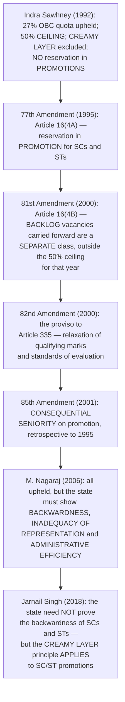

# Chapter 67 — Special Provisions Relating to Certain Classes

[← Chapter 66](66_Rights_and_Liabilities_of_the_Government.md) · [Part Index](00_INDEX.md) · [Master](../00_INDEX.md) · [Chapter 68 →](68_Political_Parties.md)

**Read time ~11 min** · **Part XVI, Articles 330–342A** · 🟠 ⚠️ **Prelims: 2023, 2024, 2026** · **Mains: 2017, 2019, 2023**

> 📌 ⭐ **This is the chapter that ties together everything you learnt in Chapters 46–48 and 40.** ⚠️ **It is also where the two biggest reservation developments of the last decade sit: the 103rd Amendment's EWS quota (2019) and the 106th Amendment's women's reservation (2023).** ⭐ **Both are certain to be examined.**

---

## 🎯 The one-line point

> ⭐⭐ **Part XVI is where the Constitution admits that formal equality is not enough.** ⭐ **It reserves SEATS in legislatures, protects CLAIMS to services, creates COMMISSIONS to watch over the arrangement, and provides the machinery by which the lists of beneficiaries are drawn.** ⚠️ **Note what it does NOT do: it never mentions reservation in the Rajya Sabha, in Legislative Councils, or in promotions — those come from elsewhere.**

---

## PART A — ⭐⭐ Reservation of SEATS

| Article | Provision | ⚠️ **The trap** |
|---|---|---|
| ⭐ **330** | ⭐ **Reservation of seats for SCs and STs in the LOK SABHA** | — |
| ⭐ **332** | ⭐ **Reservation of seats for SCs and STs in the STATE LEGISLATIVE ASSEMBLIES** | ⚠️ ⭐⭐ **There is NO reservation in the RAJYA SABHA or in the LEGISLATIVE COUNCILS — and there never has been** |
| ⭐⭐ **330A** | ⭐ **Reservation of seats for WOMEN in the LOK SABHA** — inserted by the ⭐ **106th Amendment Act, 2023** | See below |
| ⭐⭐ **332A** | ⭐ **Reservation of seats for WOMEN in the state Legislative Assemblies** — 106th Amendment | The same amendment also amended **Article 239AA(2)(b)** for the **Delhi Assembly** |
| ⚠️ ⭐ **331 and 333** | ⭐ **Nomination of ANGLO-INDIANS — up to 2 in the Lok Sabha by the President (331), and 1 in a state Assembly by the Governor (333)** | ⚠️ ⭐⭐ **BOTH DISCONTINUED by the 104th Amendment Act, 2019, with effect from 25 January 2020** |
| ⭐ **334** | ⭐ **The time-limit on reservation of seats and special representation** — extended repeatedly by the **8th, 23rd, 45th, 62nd, 79th, 95th** and ⭐ **104th Amendments** | ⭐ **The 104th extended SC/ST seat reservation to 25 JANUARY 2030 while ending the Anglo-Indian nomination** |

### ⭐⭐ The 106th Amendment Act, 2023 — *Nari Shakti Vandan Adhiniyam*

| Feature | Detail |
|---|---|
| ⭐ **Quantum** | ⭐ **One-third of ALL seats** in the Lok Sabha, the state Legislative Assemblies and the **Delhi Assembly** |
| ⭐⭐ **Interlocking with SC/ST** | ⭐ **One-third of the seats RESERVED FOR SCs AND STs is also reserved for women** — ⚠️ **so it is a quota WITHIN a quota, not in addition to it** |
| ⚠️ ⭐⭐ **When it takes effect** | ⭐ **After a CENSUS conducted after the commencement of the Amendment, and the DELIMITATION exercise that follows it** — ⚠️ **it is NOT in force yet, and its start date depends on two other processes** |
| ⭐ **Duration** | ⭐ **15 years**, extendable by Parliament |
| ⭐ **Rotation** | ⭐ **Reserved seats to be ROTATED after each delimitation exercise** |
| ⚠️ **Where it does NOT apply** | ⚠️ ⭐ **The RAJYA SABHA and the LEGISLATIVE COUNCILS** |
| ⚠️ **What it omits** | ⚠️ **No sub-quota for OBC women** — a principal criticism, since earlier Bills had been defeated on exactly this issue |

> ⭐ ***Prelims 2024 Q13* asked directly about the Nari Shakti Vandan Adhiniyam.** ⚠️ ⭐ **The two facts most likely to be tested are (a) the census-and-delimitation trigger and (b) that it does NOT extend to the Rajya Sabha.**
>
> ⭐ **The precedent that justified it** — the **73rd and 74th Amendments'** one-third reservation for women in **panchayats and municipalities** since 1992, which produced over **14 lakh** elected women representatives. ⚠️ **And the precedent that warns about it** — ⭐ **the "Sarpanch Pati" phenomenon**, asked in [Mains 2008](../../04_PYQ_Mains/2008.md) and [Mains 2019 Q13](../../04_PYQ_Mains/2019.md), where the male relative exercises the office in practice.

---

## PART B — ⭐ Services, and Article 335

> ⭐⭐ **Article 335 — the claims of SCs and STs shall be TAKEN INTO CONSIDERATION, CONSISTENTLY WITH THE MAINTENANCE OF EFFICIENCY OF ADMINISTRATION, in the making of appointments to services and posts.**

⭐ **The 82nd Amendment Act, 2000 added a PROVISO** permitting the state to make ⭐ **relaxation in qualifying marks, or lowering of standards of evaluation**, for reservation in matters of promotion.

> ⚠️ ⭐ **"Consistently with the maintenance of efficiency" is the most litigated phrase in the article, and [Prelims 2023 Q9](../../03_PYQ_Prelims/2023.md) paired it with Article 16(4).** ⭐ **The Court's settled reading is that efficiency is not opposed to representation — a representative administration is itself an aspect of efficiency** — and the 82nd Amendment's proviso removed the argument that relaxation is per se unconstitutional.

### ⭐⭐ Reservation in promotion — the amendment-and-case chain

⭐ **And the newest limb:** ⭐ **the 103rd Amendment Act, 2019 inserted Articles 15(6) and 16(6)**, permitting up to ⭐ **10% reservation for ECONOMICALLY WEAKER SECTIONS** among citizens not already covered by SC/ST/OBC reservation — ⭐ **upheld in *Janhit Abhiyan v Union of India* (2022)**, which held that the **50% ceiling applies to the caste-based reservations under Articles 15(4)/16(4)** and that **EWS stands on separate constitutional footing**.

---

## PART C — ⭐ The lists, the commissions, and the residue

| Article | Provision |
|---|---|
| ⭐ **341** | ⭐ **The PRESIDENT, by public notification and after consulting the Governor, specifies the SCHEDULED CASTES for a state or UT.** ⚠️ ⭐ **Thereafter only PARLIAMENT, by law, may include or exclude a caste** |
| ⭐ **342** | ⭐ **The same, for SCHEDULED TRIBES** — ⭐ *asked in [Prelims 2024 Q15](../../03_PYQ_Prelims/2024.md)* |
| ⭐ **342A** | ⭐ **The same, for SOCIALLY AND EDUCATIONALLY BACKWARD CLASSES** *(102nd Amendment, 2018)* — ⭐ **with 342A(3), added by the 105th Amendment, 2021, preserving each STATE's own SEBC list** |
| ⭐ **338 / 338A / 338B** | ⭐ **NCSC · NCST · NCBC** — see Chapters [46](../Part_VII_Constitutional_Bodies/46_National_Commission_SCs.md), [47](../Part_VII_Constitutional_Bodies/47_National_Commission_STs.md) and [48](../Part_VII_Constitutional_Bodies/48_National_Commission_BCs.md) |
| ⭐ **339** | ⭐ **Union control over the administration of SCHEDULED AREAS and the welfare of STs** — the **Dhebar Commission (1960)** was appointed under it; **339(2)** lets the Union direct a state on ST welfare schemes |
| ⭐ **340** | ⭐ **The President may appoint a COMMISSION to investigate the conditions of BACKWARD CLASSES** — ⭐ **KALELKAR (1953), MANDAL (1979), ROHINI (2017, on OBC sub-categorisation)** |
| **336, 337** | Special provisions for **Anglo-Indians** in certain services and educational grants — now spent |

> ⭐⭐ **The three-by-three grid to hold in your head:**
> ⭐ **341 → SCs · 342 → STs · 342A → SEBCs** *(who is on the list)*
> ⭐ **338 → NCSC · 338A → NCST · 338B → NCBC** *(who watches over them)*
> ⭐ **330/330A → Lok Sabha · 332/332A → Assemblies** *(where seats are reserved)*

⭐ **One more body to know, because [Prelims 2026 Q7](../../03_PYQ_Prelims/2026.md) asked about it:** ⭐ **the Rights of Persons with Disabilities Act, 2016** — which replaced the 1995 Act, ⭐ **expanded the recognised disabilities from 7 to 21**, ⭐ **raised reservation in government jobs from 3% to 4% and in higher education to 5%**, and created the **Chief Commissioner for Persons with Disabilities** at the Centre and **State Commissioners**. ⚠️ ⭐ **The Act is of 2016 — a "2018" in a statement is the classic wrong-date trap, and it appeared in the 2026 paper.** *(That question is analysed in the [2026 Prelims file](../../03_PYQ_Prelims/2026.md).)*

---

## 🧠 Memory hooks

### Seats
> ⭐ **330 SC/ST in the Lok Sabha · 332 SC/ST in Assemblies · 330A and 332A WOMEN (106th Amendment, 2023).** ⚠️ ⭐ **NOTHING in the Rajya Sabha or the Legislative Councils.**

### The two recent amendments, paired
> ⭐⭐ **104th (2019) — ends ANGLO-INDIAN nomination *(Articles 331 and 333)* and extends SC/ST seat reservation to 2030.**
> ⭐⭐ **106th (2023) — one-third for WOMEN, including one-third within the SC/ST quota; effective only after a CENSUS and DELIMITATION; 15 years; rotation.**

### The efficiency clause
> ⭐ **Article 335 — claims "consistently with the maintenance of efficiency of administration"**; ⭐ **82nd Amendment added the proviso permitting relaxation of qualifying marks and standards.**

### Promotion chain
> ⭐ **77th → 16(4A) promotion · 81st → 16(4B) backlog · 82nd → the 335 proviso · 85th → consequential seniority.** ⭐ ***Nagaraj* (2006)** three tests → ⭐ ***Jarnail Singh* (2018)** no backwardness test, but **creamy layer applies**.

### The lists
> ⭐ **341 SC · 342 ST · 342A SEBC.** ⭐ **President notifies; only PARLIAMENT amends the central list; ⭐ 342A(3) (105th Amendment, 2021) preserves state SEBC lists.**

---

## ❓ Expected Mains questions

**1. "The 106th Amendment reserves one-third of legislative seats for women but defers its own operation. Examine its design, and assess whether reservation will translate into representation." (250 words)**
> *Skeleton:* ⭐ **The design** — Articles **330A, 332A** and the amendment to **239AA(2)(b)**; **one-third of all seats**, ⭐ **including one-third of SC/ST reserved seats**; ⭐ **effective only after a census and the ensuing delimitation**; **15 years**; **rotation after each delimitation**; ⚠️ **not applicable to the Rajya Sabha or Legislative Councils**; ⚠️ **no OBC sub-quota**. ⭐ **The case that it will work** — the **73rd/74th Amendment** experience produced **over 14 lakh elected women representatives** and measurable shifts in local spending priorities *(water, sanitation, schooling)*; ⭐ **critical mass changes agenda-setting**, and incumbency creates a pipeline of experienced women candidates. ⚠️ **The case for caution** — ⭐ **the "Sarpanch Pati" problem** *(asked in [2008](../../04_PYQ_Mains/2008.md) and [2019 Q13](../../04_PYQ_Mains/2019.md))*; ⚠️ **rotation destroys incumbency and weakens accountability**, since a member cannot cultivate a constituency she will lose; **party ticket distribution and campaign finance remain male-controlled**; and ⚠️ **the deferral means a decade may pass before a single seat is reserved.** ⭐ **The complements needed** — **internal party quotas**, **campaign finance support**, **security and childcare provisions in legislatures**, ⭐ **an OBC sub-quota**, and **capacity-building on the panchayat model**. ⭐ **Conclude with [Mains 2023 Q14](../../04_PYQ_Mains/2023.md)'s framing:** ⭐ **civil society organisations have been the actual pipeline for women's political entry, and the amendment will work only if that pipeline is strengthened alongside it.**

**2. "'The reservation of seats for women in the institutions of local self-government has had a limited impact on the patriarchal character of the Indian political process.' Comment." (250 words)**
> *Actually asked — [Mains 2019 Q13](../../04_PYQ_Mains/2019.md).*
> *Skeleton:* ⭐ **What was achieved** — over **14 lakh** women in elected local office; several states raised reservation to **50%**; documented shifts in local priorities; ⭐ **a demonstration effect on aspirations**, with evidence of improved educational outcomes for girls in reserved constituencies. ⚠️ **Why the impact on patriarchy is limited** — the ⭐ **"Sarpanch Pati" / proxy representation** problem; **rotation preventing accumulated experience**; ⭐ **the 3 Fs — functions, funds and functionaries — remaining with the state**, so the office itself is weak *(see [Ch 37](../Part_V_Local_Government/37_Panchayati_Raj.md))*; **social constraints on mobility and public speech**; **capture by dominant caste networks**; and **no corresponding change at the state and national levels — until the 106th Amendment**. ⭐ **Conclude:** reservation changed **who occupies the chair** faster than it changed **who exercises the power**; the remedies are **training, tenure security, real devolution, and reservation at higher levels** so that a local career can lead somewhere.

**3. "Does the Rights of Persons with Disabilities Act, 2016 ensure an effective mechanism for the empowerment and inclusion of the intended beneficiaries in society?" (250 words)**
> *Actually asked — [Mains 2017 Q7](../../04_PYQ_Mains/2017.md).*
> *Skeleton:* ⭐ **What the Act does** — replaces the 1995 Act, implements the **UN Convention on the Rights of Persons with Disabilities**; ⭐ **21 recognised disabilities (from 7)**; ⭐ **4% reservation in government employment and 5% in higher education**; **free education for children aged 6–18 with benchmark disabilities**; **accessibility obligations** with timelines; **guardianship reform**; ⭐ **Chief Commissioner and State Commissioners with civil-court powers**; **special courts**; **penalties**. ⚠️ **Where it falls short** — ⭐ **implementation and accessibility timelines routinely missed**; **certification remains slow and inconsistent**; ⚠️ **the private sector carries only an obligation of "equal opportunity policy", not a quota**; **Commissioners' recommendations are not binding**; **inadequate budget and disaggregated data**; and **attitudinal barriers no statute reaches**. ⭐ **Conclude:** the Act is a **strong rights framework with a weak enforcement machinery** — the fix is **binding timelines, an accessible certification system, and mainstreaming disability into every scheme rather than running a parallel one.**

---

## ⚡ 60-second revision

- ⭐ **Part XVI, Articles 330–342A.** ⭐ **330 — SC/ST seats in the LOK SABHA · 332 — in state ASSEMBLIES.** ⚠️ ⭐ **NO reservation in the Rajya Sabha or Legislative Councils.**
- ⭐⭐ **104th Amendment Act, 2019 — ENDED Anglo-Indian nomination *(Articles 331 and 333)* from 25 January 2020, and extended SC/ST seat reservation to 25 January 2030** *(Article 334)*.
- ⭐⭐ **106th Amendment Act, 2023 — Articles 330A and 332A: ONE-THIRD of seats for WOMEN in the Lok Sabha, state Assemblies and the Delhi Assembly, INCLUDING one-third of the SC/ST reserved seats.** ⚠️ **Effective only after a CENSUS and the ensuing DELIMITATION; 15 years; rotation after each delimitation; NOT in the Rajya Sabha or Councils; NO OBC sub-quota.**
- ⭐ **Article 335 — SC/ST claims to services, "consistently with the maintenance of efficiency of administration"**; ⭐ **82nd Amendment (2000) proviso — relaxation of qualifying marks and standards.**
- ⭐⭐ **Promotion chain: *Indra Sawhney* (1992) → 77th (16(4A)) → 81st (16(4B) backlog) → 82nd (335 proviso) → 85th (consequential seniority) → *M. Nagaraj* (2006, three tests) → *Jarnail Singh* (2018, no backwardness test, creamy layer applies).**
- ⭐ **103rd Amendment (2019) — Articles 15(6) and 16(6), 10% EWS; upheld in *Janhit Abhiyan* (2022).**
- ⭐ **341 SC · 342 ST · 342A SEBC — the PRESIDENT notifies; only PARLIAMENT amends the central list; ⭐ 342A(3) (105th Amendment, 2021) preserves STATE SEBC lists.**
- ⭐ **339 — Union control over Scheduled Areas and ST welfare *(Dhebar, 1960)*.** ⭐ **340 — ad hoc Commissions: KALELKAR (1953), MANDAL (1979), ROHINI (2017).**
- ⭐ **RPwD Act, 2016 — 21 disabilities *(from 7)*, 4% in jobs, 5% in higher education, Chief Commissioner for Persons with Disabilities.** ⚠️ **The year is 2016 — a stated "2018" is wrong.**

---

## 🔗 Practice this chapter

**Prelims:** [2023 Q9](../../03_PYQ_Prelims/2023.md) — Article 16(4) and Article 335 · [2024 Q13](../../03_PYQ_Prelims/2024.md) — Nari Shakti Vandan Adhiniyam · [2024 Q15](../../03_PYQ_Prelims/2024.md) — declaring a Scheduled Tribe · [2026 Q3](../../03_PYQ_Prelims/2026.md) — Scheduled Castes and Scheduled Tribes · [2026 Q7](../../03_PYQ_Prelims/2026.md) — persons with disabilities · [2021 Q1](../../03_PYQ_Prelims/2021.md) — concentration of wealth

**Mains:** [2017 Q7](../../04_PYQ_Mains/2017.md) — the RPwD Act, 2016 · [2018 Q2](../../04_PYQ_Mains/2018.md) — NCSC and minority institutions · [2019 Q13](../../04_PYQ_Mains/2019.md) — women's reservation in local self-government · [2022 Q5](../../04_PYQ_Mains/2022.md) — the NCBC's transformation · [2023 Q14](../../04_PYQ_Mains/2023.md) — civil society and women's representation in state legislatures

**Cross-links:** [Ch 7 Fundamental Rights](../Part_I_Constitutional_Framework/07_Fundamental_Rights.md) — Articles 15 and 16 in full · [Ch 46](../Part_VII_Constitutional_Bodies/46_National_Commission_SCs.md), [Ch 47](../Part_VII_Constitutional_Bodies/47_National_Commission_STs.md), [Ch 48](../Part_VII_Constitutional_Bodies/48_National_Commission_BCs.md) — the three Commissions · [Ch 40 Scheduled and Tribal Areas](../Part_VI_Union_Territories_and_Special_Areas/40_Scheduled_and_Tribal_Areas.md) — Articles 244, 339 and PESA · [Ch 37 Panchayati Raj](../Part_V_Local_Government/37_Panchayati_Raj.md) — the women's reservation precedent · [Ch 70 Elections](70_Elections.md) — delimitation, which the 106th Amendment waits on

**Next:** [Chapter 68 — Political Parties](68_Political_Parties.md) — the first of the **elections cluster**, the highest-yield block remaining in the book.

---

[← Chapter 66](66_Rights_and_Liabilities_of_the_Government.md) · [Part Index](00_INDEX.md) · [Master](../00_INDEX.md) · [Chapter 68 →](68_Political_Parties.md)
