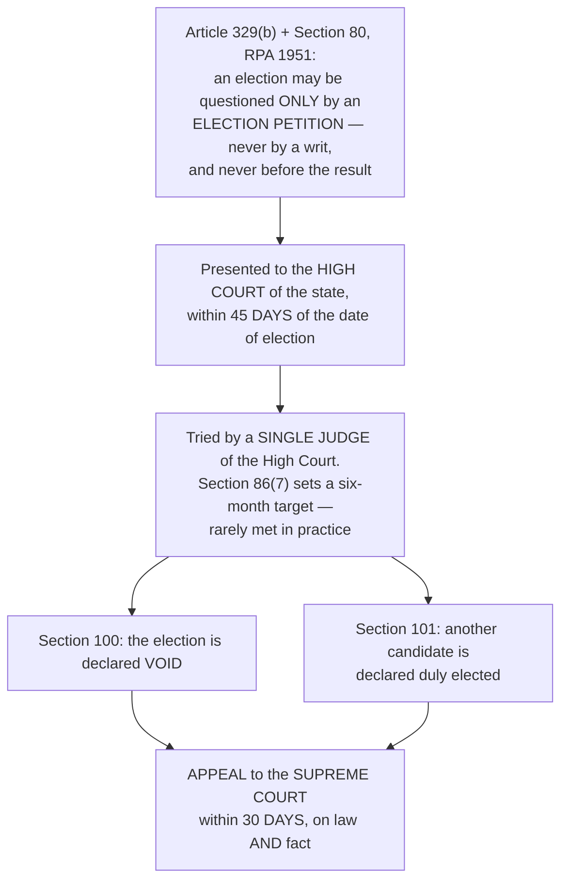

# Chapter 71 — Election Laws

[← Chapter 70](70_Elections.md) · [Part Index](00_INDEX.md) · [Master](../00_INDEX.md) · [Chapter 72 →](72_Electoral_Reforms.md)

**Read time ~11 min** · **RPA 1950 · RPA 1951** · 🟠 ⚠️ **Mains: 2019, 2020, 2022, 2025 — FOUR questions, all on the RPA, 1951**

> 📌 ⚠️ ⭐ **Rated 🟠 and asked four times in seven years — the most under-rated chapter in the elections cluster.** ⭐ **All four questions came from just three areas: DISQUALIFICATIONS, CORRUPT PRACTICES, and ELECTION PETITIONS.** ⭐ **Master those three and you can answer anything this chapter produces.**

---

## 🎯 The one-line point

> ⭐⭐ **Article 327 told Parliament to make the law of elections, and Parliament made two: the RPA 1950 and the RPA 1951.** ⭐ **The mnemonic that keeps them straight: ⭐ 1950 is about the VOTER and the CONSTITUENCY; 1951 is about the CANDIDATE and the ELECTION.**

---

## PART A — ⭐ The two Acts

| ⭐ **RPA, 1950** | ⭐ **RPA, 1951** |
|---|---|
| ⭐ **Allocation of seats** in the Lok Sabha and state legislatures | ⭐ **The actual CONDUCT of elections** |
| ⭐ **Delimitation of constituencies** | ⭐ **QUALIFICATIONS and DISQUALIFICATIONS** for membership |
| ⭐ **Qualifications of VOTERS** | ⭐ **Notification, nomination, scrutiny, withdrawal, polling, counting** |
| ⭐ **Preparation and revision of ELECTORAL ROLLS** | ⭐ **ELECTION EXPENSES** and their accounting |
| ⭐ **The officers who prepare rolls** *(the CEO, DEO, ERO)* | ⭐ **CORRUPT PRACTICES and ELECTORAL OFFENCES** |
| — | ⭐ **ELECTION PETITIONS and DISPUTES; bye-elections** |

⭐ **Also in the family:** the ⭐ **Presidential and Vice-Presidential Elections Act, 1952**; the **Delimitation Acts**; the **Government of Union Territories Act, 1963**; and the **Conduct of Elections Rules, 1961**.

---

## PART B — ⭐⭐ Disqualifications under the RPA, 1951

| Section | Ground |
|---|---|
| ⭐⭐ **8** | ⭐ **CONVICTION for specified offences.** Sections 8(1) and 8(2) list offences where **any conviction** disqualifies *(and 8(2) requires a sentence of at least six months)*; ⭐⭐ **Section 8(3) is the general rule — conviction for ANY offence with a sentence of imprisonment of NOT LESS THAN TWO YEARS disqualifies from the DATE OF CONVICTION, and for a FURTHER SIX YEARS from the date of RELEASE** |
| ⭐ **8A** | Disqualification on the ground of a ⭐ **CORRUPT PRACTICE** *(the President decides, on the ECI's opinion, which is binding)* |
| ⭐ **9** | ⭐ **DISMISSAL from government service for CORRUPTION or DISLOYALTY to the State** — five years |
| ⭐ **9A** | ⭐ **Subsisting CONTRACTS with the appropriate Government** for the supply of goods or the execution of works |
| ⭐ **10** | ⭐ **Holding an office of managing agent, manager or secretary of a company in which the Government has not less than 25% share** |
| ⭐⭐ **10A** | ⭐ **FAILURE TO LODGE AN ACCOUNT OF ELECTION EXPENSES** within the time and manner required — ⭐ **disqualification for THREE YEARS** |
| ⭐ **11A** | Disqualification arising from a corrupt practice found by a court |

> ⭐ **Add the constitutional disqualifications from [Ch 22](../Part_III_Central_Government/22_Parliament.md):** ⭐ **Article 102** *(office of profit, unsound mind, undischarged insolvent, not a citizen or having voluntarily acquired foreign citizenship, and disqualification under any law made by Parliament)*, ⭐ **Article 103** *(the President decides, on the ECI's opinion — which is BINDING)*, and ⭐ **the Tenth Schedule** *(defection — decided by the Presiding Officer; see [Ch 75](75_Anti_Defection_Law.md))*.

### ⭐⭐⭐ *Lily Thomas v Union of India* (2013) — the case that changed everything

⭐ **Section 8(4) of the RPA used to protect a SITTING member:** a convicted MP or MLA was **not disqualified for three months**, and if he appealed within that period, the disqualification did not operate **until the appeal was decided.**

> ⭐⭐ **The Supreme Court STRUCK DOWN Section 8(4) as ULTRA VIRES.** ⭐ **Its reasoning: Articles 102(1)(e) and 191(1)(e) empower Parliament to lay down disqualifications for BEING CHOSEN AS and FOR BEING a member — but give it NO power to create a separate, more indulgent regime for sitting members.** ⚠️ ⭐ **Since 2013, disqualification operates IMMEDIATELY ON CONVICTION**, and the seat falls vacant unless the conviction or sentence is **stayed by an appellate court.**

⭐ **The companion case:** ⭐ ***Chief Election Commissioner v Jan Chaukidar* (2013)** held that a person in **lawful custody** cannot vote under **Section 62(5)** and therefore is not an "elector", and so cannot contest. ⚠️ ⭐ **Parliament reversed it within weeks by amending Section 62(5)**, so a person in custody may still **contest** even though he may not **vote**.

> ⭐ **Present these two together — they are the perfect illustration of the pattern you have seen throughout Parts VIII and IX:** ⚠️ ⭐ **the Court tightened the law on convicted politicians in *Lily Thomas* and Parliament let it stand; the Court tightened it again in *Jan Chaukidar* and Parliament reversed it in weeks.** ⭐ **The difference tells you where the political consensus lies.**

---

## PART C — ⭐⭐ Corrupt practices *(Section 123)*

⭐ **A "corrupt practice" makes an election VOID and can disqualify the candidate. The list:**

| # | Corrupt practice |
|---|---|
| ⭐ **1** | ⭐ **BRIBERY** — any gift, offer or promise of gratification to induce a person to stand or not to stand, to vote or refrain from voting |
| ⭐ **2** | ⭐ **UNDUE INFLUENCE** — any direct or indirect interference with the free exercise of any electoral right, including threats of injury and of **divine displeasure or spiritual censure** |
| ⭐⭐ **3** | ⭐ **An APPEAL to vote or refrain from voting on the ground of RELIGION, RACE, CASTE, COMMUNITY or LANGUAGE**, or the use of, or appeal to, **religious symbols or national symbols** |
| ⭐ **4** | ⭐ **Promotion of ENMITY or HATRED** between classes of citizens on grounds of religion, race, caste, community or language |
| ⭐ **5** | ⭐ **Publication of a FALSE STATEMENT of fact about a candidate's PERSONAL CHARACTER or CONDUCT** |
| ⭐ **6** | ⭐ **Hiring or procuring VEHICLES** for the free conveyance of voters |
| ⭐⭐ **7** | ⭐ **Incurring or authorising EXPENDITURE IN EXCESS OF THE CEILING** |
| ⭐ **8** | ⭐ **Obtaining or procuring ASSISTANCE FROM GOVERNMENT SERVANTS** for the furtherance of the candidate's prospects |

### ⭐⭐ *Abhiram Singh v C.D. Commachen* (2017)

⭐ **A SEVEN-JUDGE bench, by 4:3, gave Section 123(3) a broad, "purposive" reading:** ⭐ **an appeal on the ground of religion, race, caste, community or language is a corrupt practice whether the religion or caste appealed to is that of the CANDIDATE, his AGENT, the VOTER, or anyone else with the candidate's consent.**

> ⭐ **The majority's reasoning is worth a sentence:** ⚠️ **an election is a SECULAR exercise, and the relationship between a voter and a candidate must rest on issues of governance, not identity.** ⭐ **The minority warned that the wide reading could silence the legitimate articulation of the grievances of disadvantaged groups** — ⭐ **and citing that dissent shows you understand the case rather than merely knowing it.**

### ⭐ Electoral offences *(Sections 125–136)* — as distinct from corrupt practices

⚠️ ⭐ **A CORRUPT PRACTICE voids the election; an ELECTORAL OFFENCE is a crime punishable by a court.** ⭐ **Some conduct is both.**

> ⭐ **Section 125** — promoting enmity on grounds of religion, race, caste, community or language in connection with an election · ⭐ **Section 126** — ⭐ **no public meeting, procession, or display of election matter by cinematograph, television or similar apparatus during the 48 HOURS ending with the close of poll** · ⭐ **Section 126A** — ⭐ **EXIT POLLS are prohibited from the beginning of polling in the first phase until half an hour after the close of the last phase** · ⭐ **Section 127A** — the printer's and publisher's name on election pamphlets · ⭐ **Section 135A** — ⭐ **BOOTH CAPTURING** · **Section 135C** — the **dry day** on polling day and the preceding 48 hours · **Section 136** — other offences relating to ballot papers and election records.

⭐ **Expenditure:** ⭐ **Section 77** requires every candidate to keep a **separate and correct account** of all expenditure between nomination and the declaration of result; ⭐ **Section 78** requires it to be lodged with the District Election Officer ⭐ **within 30 days** of the declaration; ⚠️ ⭐ **failure attracts disqualification for THREE YEARS under Section 10A.** ⚠️ ⭐ **The ceiling binds the CANDIDATE only — expenditure by the party on general propaganda is not chargeable to him.**

---

## PART D — ⭐⭐ Election petitions *(what [Mains 2022 Q11](../../04_PYQ_Mains/2022.md) asked)*

### ⭐⭐ Section 100 — the grounds for declaring an election void

| # | Ground |
|---|---|
| ⭐ **1** | ⭐ **On the date of election the returned candidate was NOT QUALIFIED, or was DISQUALIFIED** |
| ⭐ **2** | ⭐ **A CORRUPT PRACTICE was committed by the returned candidate, his election agent, or by any other person with their consent** |
| ⭐ **3** | ⭐ **IMPROPER ACCEPTANCE of the returned candidate's nomination** |
| ⭐ **4** | ⭐ **The result has been MATERIALLY AFFECTED** by — ⭐ **improper acceptance or rejection of any vote**, or the **improper reception, refusal or rejection of a nomination**, or ⭐ **NON-COMPLIANCE with the Constitution, the RPA or the rules made under it** |

> ⭐⭐ **Notice the crucial asymmetry in grounds 3 and 4, and say it in an answer:** ⭐ **improper acceptance of the WINNER's nomination voids the election by itself; for most other irregularities the petitioner must additionally prove that the RESULT WAS MATERIALLY AFFECTED.** ⚠️ **That burden is why so few election petitions succeed.**

⭐ **Section 101 — when another candidate may be declared elected:** ⭐ **where the petitioner or another candidate would have obtained a majority of the valid votes but for the corrupt practice or irregularity.**

⭐ **The remedy for the aggrieved party:** ⭐ **an APPEAL to the SUPREME COURT under Section 116A, within 30 days**, on both law and fact; and, where a disqualification for a corrupt practice has been imposed, ⭐ **Section 11 allows the ELECTION COMMISSION to remove or reduce the period of disqualification.**

⚠️ ⭐ **The systemic criticism to add:** ⭐ **Section 86(7)'s six-month target is routinely missed, and petitions have been decided after the full five-year term expired — rendering the remedy illusory.** ⭐ **The standard proposals are dedicated ELECTION BENCHES or election tribunals, and statutory day-to-day hearing.**

---

## 🧠 Memory hooks

### The two Acts
> ⭐⭐ **1950 = the VOTER and the CONSTITUENCY. 1951 = the CANDIDATE and the ELECTION.**

### The disqualification numbers
> ⭐⭐ **Section 8(3) — 2 years' imprisonment → disqualified from CONVICTION + 6 YEARS from RELEASE.** ⭐ **Section 10A — failure to lodge expenses → 3 YEARS.** ⭐ **Section 9 — dismissal for corruption or disloyalty → 5 YEARS.**

### The case
> ⭐⭐ ***Lily Thomas* (2013)** — ⭐ **Section 8(4) STRUCK DOWN; disqualification is IMMEDIATE on conviction** unless the conviction or sentence is stayed. ⭐ ***Jan Chaukidar* (2013)** — reversed by Parliament within weeks.

### Corrupt practice vs electoral offence
> ⭐ **CORRUPT PRACTICE → the ELECTION is void *(Section 123)*.** ⭐ **ELECTORAL OFFENCE → the PERSON is punished *(Sections 125–136)*.**

### The petition numbers
> ⭐⭐ **HIGH COURT · within 45 DAYS · a SINGLE judge · six-month target · appeal to the SUPREME COURT within 30 DAYS.**

### The 48 hours
> ⭐ **Section 126 — silence period, 48 hours before the close of poll.** ⭐ **Section 126A — exit polls barred from the start of the first phase to half an hour after the last.**

---

## ❓ Expected Mains questions

**1. "Discuss the procedures to decide the disputes arising out of the election of a Member of Parliament or State Legislature under the RPA, 1951. What are the grounds on which the election of any returned candidate may be declared void? What remedy is available to the aggrieved party against the decision? Refer to the case laws." (250 words)**
> *Actually asked — [Mains 2022 Q11](../../04_PYQ_Mains/2022.md).*
> *Skeleton:* (i) ⭐ **The bar and the channel** — ⭐ **Article 329(b)** and **Section 80** mean an election can be questioned **only** by an election petition; ⭐ ***N.P. Ponnuswami* (1952)** established that even a wrongful rejection of a nomination cannot be challenged mid-process by a writ — the whole electoral process must run its course. (ii) ⭐ **Procedure** — petition to the **High Court** within **45 days**; tried by a **single judge**; six-month target under **Section 86(7)**. (iii) ⭐ **Grounds under Section 100** — the four heads, with the ⭐ **"materially affected the result"** qualifier on the fourth. (iv) ⭐ **Section 101** — declaring another candidate elected. (v) ⭐ **Remedy** — ⭐ **appeal to the Supreme Court within 30 days under Section 116A**, on law and fact; ⭐ **the ECI's power under Section 11** to remove a disqualification. (vi) ⭐ **Case law** — ***Ponnuswami* (1952)**; ***Lily Thomas* (2013)** on immediate disqualification; ***Abhiram Singh* (2017)** on the width of Section 123(3); ***ADR* (2002)** on the mandatory affidavit, a false statement in which is itself a ground. (vii) ⚠️ ⭐ **Conclude with the critique:** delays make the remedy nominal; the fix is **dedicated election benches and statutory day-to-day hearing.**

**2. "On what grounds can a people's representative be disqualified under the Representation of the People Act, 1951? Also mention the remedies available to such a person against his disqualification." (250 words)**
> *Actually asked — [Mains 2019 Q11](../../04_PYQ_Mains/2019.md).*
> *Skeleton:* ⭐ **The grounds** — Sections **8** *(conviction, with 8(3)'s two-year rule and the six-year post-release bar)*, **8A** *(corrupt practice)*, **9** *(dismissal for corruption or disloyalty)*, **9A** *(government contracts)*, **10** *(office in a government company)*, ⭐ **10A** *(failure to lodge election expenses)*. ⭐ **Add the constitutional grounds** — **Article 102** and the **Tenth Schedule**. ⭐ **The remedies** — (i) ⭐ **appeal against the conviction, and specifically an application for a STAY OF THE CONVICTION (not merely of the sentence)**, which is the only route that revives the seat after ***Lily Thomas***; (ii) ⭐ **Section 11 — the ELECTION COMMISSION may remove or reduce the period of a disqualification**; (iii) ⭐ **Article 103/192 — the President or Governor decides a question of disqualification ON THE ECI'S OPINION, which is binding**, and that decision is subject to judicial review; (iv) writ jurisdiction under **Articles 32 and 226** where a fundamental right or jurisdictional error is involved. ⭐ **Conclude** with the reform debate — the ECI's proposal to disqualify on the **FRAMING OF CHARGES** for serious offences, and the counter-argument from the presumption of innocence *(developed in [Ch 72](72_Electoral_Reforms.md))*.

**3. "Discuss the 'corrupt practices' under the RPA, 1951. Would an increase in the assets of legislators or their associates, disproportionate to their known sources of income, constitute 'undue influence' and hence a corrupt practice?" (250 words)**
> *Actually asked — [Mains 2025 Q1](../../04_PYQ_Mains/2025.md).*
> *Skeleton:* (i) ⭐ **Set out Section 123's eight heads**, and define ⭐ **"undue influence"** as any **direct or indirect interference with the free exercise of an electoral right**, including threats of injury or of divine displeasure. (ii) ⭐ **Now address the specific question carefully.** ⚠️ ⭐ **Disproportionate assets are, in themselves, an offence under the PREVENTION OF CORRUPTION ACT — not a corrupt practice under Section 123**, which requires conduct connected with **that election** and directed at **interfering with an elector's free choice**. (iii) ⭐ **But the link exists through DISCLOSURE.** ⭐ **Following *ADR* (2002) and *PUCL* (2003), every candidate must file an affidavit of assets and liabilities**; ⭐ **a FALSE STATEMENT in that affidavit is an offence under Section 125A and, where it concerns personal character, may be a corrupt practice under Section 123(4)**; ⭐ **and the Supreme Court has held that non-disclosure of assets, including those of a spouse and dependants, amounts to ⭐ UNDUE INFLUENCE, because it deprives the voter of information essential to a free choice.** (iv) ⭐ **So the correct answer is nuanced:** ⚠️ **wealth accretion alone is not a corrupt practice; its CONCEALMENT from the electorate can be.** (v) ⭐ **Conclude with the reform** — the ECI's proposal for **verification of affidavits and prosecution for false declarations**, and the standing demand that **disproportionate-assets cases against legislators be tried in time-bound special courts.**

**4. "There is a need for simplification of the procedure for disqualification of persons found guilty of corrupt practices under the RPA." Comment. (150 words)**
> *Actually asked — [Mains 2020 Q1](../../04_PYQ_Mains/2020.md).*
> *Skeleton:* ⭐ **The present route** — a corrupt practice must be established in an **election petition before a High Court** *(Section 100)*; disqualification under **Section 8A** then follows, with the **President deciding on the ECI's binding opinion**; appeal to the Supreme Court. ⚠️ ⭐ **Why it needs simplification** — election petitions take **years**, often outlasting the term; the burden of proving that the result was **"materially affected"** is heavy; the petitioner bears the cost of litigating against a sitting member; and **Section 11 lets the disqualification be curtailed**. ⭐ **Proposals** — **dedicated election benches with day-to-day hearing and a statutory outer limit**; **shifting the initial fact-finding to the ECI** with judicial appeal; ⭐ **disqualification on the FRAMING OF CHARGES** for offences carrying five years or more; and **an independent prosecution mechanism**. ⚠️ **Balance it:** simplification must not become an instrument for removing elected members on weak allegations — ⭐ **speed must be bought with judicial capacity, not with a lower standard of proof.**

---

## ⚡ 60-second revision

- ⭐⭐ **RPA 1950 = voters, rolls, constituencies, allocation of seats. RPA 1951 = candidates, conduct, expenses, corrupt practices, petitions.**
- ⭐⭐ **Section 8(3) — imprisonment of 2 years or more → disqualified from the DATE OF CONVICTION + 6 YEARS from release.** ⭐ **8A corrupt practice · 9 dismissal for corruption or disloyalty (5 yrs) · 9A government contracts · 10 office in a government company · ⭐ 10A failure to lodge election expenses (3 yrs).**
- ⭐⭐ ***Lily Thomas v Union of India* (2013)** — **Section 8(4) STRUCK DOWN**; ⭐ **disqualification is IMMEDIATE on conviction** unless the conviction/sentence is stayed. ⭐ ***Jan Chaukidar* (2013)** on custody — ⚠️ **reversed by Parliament by amending Section 62(5).**
- ⭐ **Section 123 corrupt practices: BRIBERY · UNDUE INFLUENCE · appeal on RELIGION/RACE/CASTE/COMMUNITY/LANGUAGE or religious symbols · promoting ENMITY · FALSE STATEMENT about personal character · hiring VEHICLES · EXPENDITURE above the ceiling · assistance from GOVERNMENT SERVANTS.**
- ⭐⭐ ***Abhiram Singh v C.D. Commachen* (2017)**, seven judges, 4:3 — ⭐ **the appeal is a corrupt practice whether it invokes the religion or caste of the CANDIDATE, the AGENT, the VOTER or anyone else with consent.**
- ⭐ **Offences: s.125 enmity · ⭐ s.126 the 48-HOUR silence period · ⭐ s.126A EXIT POLLS barred from the first phase to half an hour after the last · s.127A printer and publisher · ⭐ s.135A BOOTH CAPTURING · s.135C dry day.**
- ⭐ **Expenses: s.77 separate account · s.78 lodge within 30 DAYS with the DEO · s.10A → 3-year disqualification.** ⚠️ **The ceiling binds the CANDIDATE, not the party.**
- ⭐⭐ **Election petitions: Article 329(b) + s.80 → HIGH COURT, within 45 DAYS, before a SINGLE judge; s.86(7) six-month target; appeal to the SUPREME COURT within 30 DAYS (s.116A).**
- ⭐⭐ **Section 100 grounds: not qualified or disqualified · corrupt practice by the candidate or his agent · improper ACCEPTANCE of the winner's nomination · non-compliance or improper acceptance/rejection of votes that MATERIALLY AFFECTED the result.** ⭐ **Section 101 — declaring another candidate elected.** ⭐ **Section 11 — the ECI may remove or reduce a disqualification.**
- ⭐ ***N.P. Ponnuswami* (1952)** — no judicial interference once the electoral process has begun.

---

## 🔗 Practice this chapter

**Prelims:** [2019 Q1](../../03_PYQ_Prelims/2019.md) — office of profit · [2017 Q19](../../03_PYQ_Prelims/2017.md) — who may file a nomination paper · [2020 Q15](../../03_PYQ_Prelims/2020.md) — a minister who is not a legislator, and RPA disqualification · [2021 Q18](../../03_PYQ_Prelims/2021.md) — contesting from multiple constituencies · [2022 Q2](../../03_PYQ_Prelims/2022.md) — advocates and Bar Councils

**Mains:** [2019 Q11](../../04_PYQ_Mains/2019.md) — grounds of disqualification and remedies · [2020 Q1](../../04_PYQ_Mains/2020.md) — simplifying the disqualification procedure · [2022 Q11](../../04_PYQ_Mains/2022.md) — election disputes, void elections and remedies · [2025 Q1](../../04_PYQ_Mains/2025.md) — corrupt practices and disproportionate assets · [2009 Q6(a)](../../04_PYQ_Mains/2009.md) — law, elections and corruption

**Cross-links:** [Ch 70 Elections](70_Elections.md) — Article 329 and the process · [Ch 72 Electoral Reforms](72_Electoral_Reforms.md) — what should change · [Ch 22 Parliament](../Part_III_Central_Government/22_Parliament.md) — Articles 102 and 103 · [Ch 75 Anti-Defection Law](75_Anti_Defection_Law.md) — the Tenth Schedule route to disqualification · [Ch 41 Election Commission](../Part_VII_Constitutional_Bodies/41_Election_Commission.md) — the ECI's binding opinion under Articles 103 and 192

**Next:** [Chapter 72 — Electoral Reforms](72_Electoral_Reforms.md) — 🔴 **the chapter that ties the whole cluster together.**

---

[← Chapter 70](70_Elections.md) · [Part Index](00_INDEX.md) · [Master](../00_INDEX.md) · [Chapter 72 →](72_Electoral_Reforms.md)
