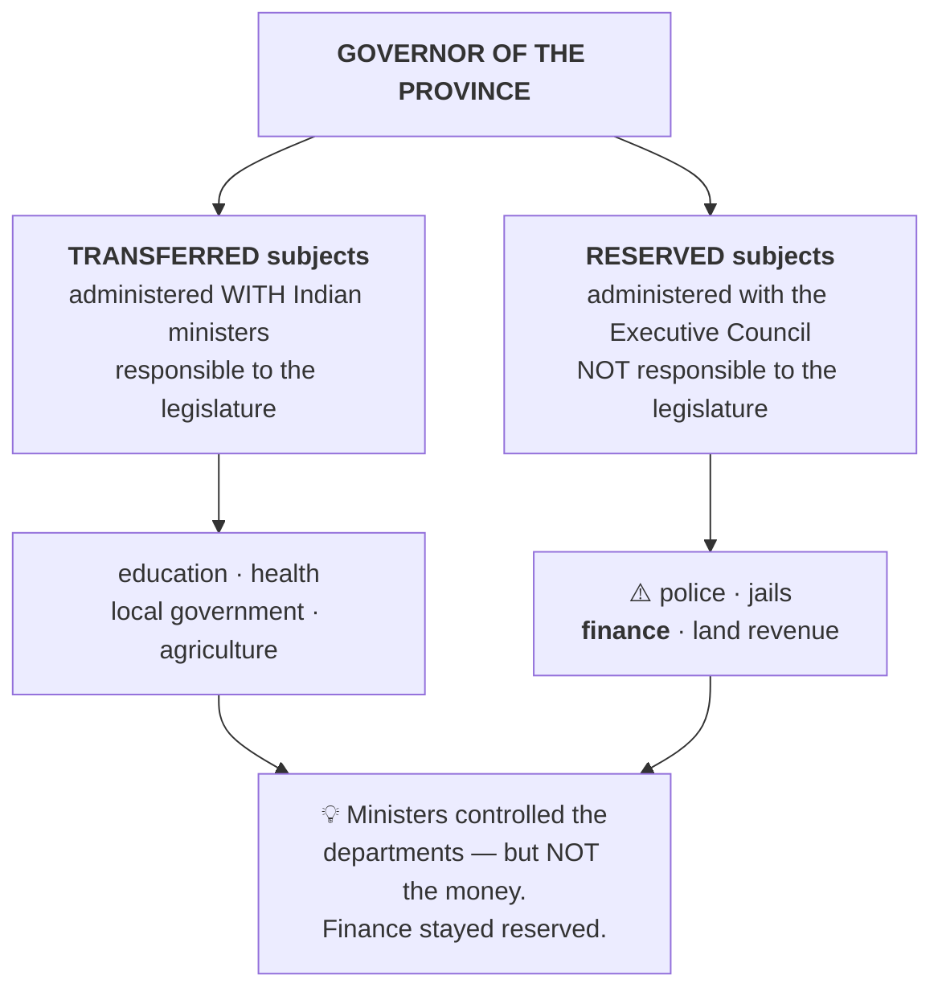

# Chapter 1 — Historical Background

[Index](00_INDEX.md) · [Chapter 2 →](02_Making_of_the_Constitution.md)

**Read time ~12 min** · Prelims: 1–2 questions most years · Mains: appears as "Did the GoI Act 1935 lay down a federal constitution?"

---

## 🎯 The one-line point

> **Our Constitution was not written on a blank page.** Almost every institution in it — the Parliament, the Governor, the federal division of powers, even the civil services exam you are writing — was built by the British for their own convenience, and then inherited and repurposed by us in 1950.

If you understand *that*, this chapter stops being a list of dates and becomes a story.

---

## 📖 The story

Think of a **shop that slowly gets taken over by the government.**

The East India Company came to trade. It accidentally became a ruler. The British Parliament in London watched a private trading company governing millions of people — badly — and kept passing laws to bring it under control. Each law tightened the leash a little more. Eventually London said "enough" and took over directly. Then Indians started demanding a share. Each demand produced another law giving a little more.

**That's the whole chapter.** Two phases:

| Phase | Years | What was happening |
|---|---|---|
| **Company Rule** | 1773–1858 | London slowly leashing a private company |
| **Crown Rule** | 1858–1947 | London ruling directly, slowly conceding to Indians |

### 🖼️ The whole chapter in one picture

```mermaid
flowchart LR
  subgraph CR["🏢 COMPANY RULE · 1773–1858 · London leashes a private company"]
    direction LR
    A1["<b>1773</b><br/>Regulating Act<br/><i>first leash</i>"] --> A2["<b>1784</b><br/>Pitt's India Act<br/><i>double government</i>"]
    A2 --> A3["<b>1813</b><br/>trade monopoly<br/>ends"]
    A3 --> A4["<b>1833</b><br/>Governor-General<br/>of INDIA"]
    A4 --> A5["<b>1853</b><br/>civil services<br/>exam begins"]
  end
  subgraph CW["👑 CROWN RULE · 1858–1947 · London rules directly, concedes slowly"]
    direction LR
    B1["<b>1858</b><br/>Company<br/>ABOLISHED"] --> B2["<b>1861</b><br/>Indians in<br/>law-making"]
    B2 --> B3["<b>1892</b><br/>indirect<br/>election"]
    B3 --> B4["<b>1909</b><br/>separate<br/>electorates ⚠️"]
    B4 --> B5["<b>1919</b><br/>DYARCHY<br/>in provinces"]
    B5 --> B6["<b>1935</b><br/>THE<br/>BLUEPRINT"]
    B6 --> B7["<b>1947</b><br/>Independence<br/>Act"]
  end
  A5 -->|"1857 REVOLT"| B1
```

> 🔑 **Notice the hinge:** the arrow between the two blocks is the **1857 Revolt**. Everything before it is London controlling a company; everything after is London governing directly. One event splits the chapter in half.

---

## PART A — Company Rule (1773–1858)

### Regulating Act, 1773 — *the first leash*

**Why it happened:** The Company was in deep trouble. The Bengal famine of 1770 had killed millions while the Company's officials grew rich. The Company then came to the British government asking for a **loan**. London's response was essentially: *"You want our money? Then you accept our supervision."*

**What it did:**
- Made the Governor of Bengal the **Governor-General of Bengal** — first was **Warren Hastings**
- Bombay and Madras Presidencies were made **subordinate** to Bengal
- Established a **Supreme Court at Calcutta (1774)**
- Prohibited Company servants from private trade and taking bribes

> 🔑 **Remember it as:** the first time the British government said the Company's affairs are *our* business. First step, small step.

---

### Pitt's India Act, 1784 — *two masters*

Created the **Board of Control** in London to manage political affairs, while the Court of Directors kept commercial affairs.

**This is called "double government"** — one body for trade, one for politics.

> 💡 **Analogy:** A family business where the father handles money and the uncle handles all outside dealings. Two bosses, one shop.

Also: for the first time the Company's territories were called the **"British possessions in India"** — a legal admission that this was no longer just trade.

---

### The Charter Acts — *the Company loses its business, one piece at a time*

The Company's charter came up for renewal every 20 years. Each renewal took something away.

| Act | What was taken / given |
|---|---|
| **1793** | Routine renewal |
| **1813** | **Ended the Company's trade monopoly** — except tea and trade with China |
| **1833** | **Governor-General of Bengal → Governor-General of India** (first: **Lord William Bentinck**). Company became purely an **administrative body** — all commercial activities ended. Attempted open competition for civil services |
| **1853** | **Separated legislative and executive functions** for the first time. Introduced **open competition** for the civil service (Macaulay Committee) — and threw it open to Indians |

> 🔑 **Charter Act 1853 is the ancestor of the exam you are writing.** The UPSC traces directly back to it. That's not a coincidence worth forgetting.

**Memory hook for the Charter Acts:**
> **1813 – Trade gone (partly). 1833 – Trade gone (fully). 1853 – Exams begin.**
> *"Trade dies in two steps, then the exam is born."*

---

## PART B — Crown Rule (1858–1947)

### Government of India Act, 1858 — *the Company is abolished*

**Why it happened: the Revolt of 1857.** After the uprising, London concluded a private company could not be trusted to hold India. This Act is literally titled *"An Act for the Better Government of India."*

- Abolished the **East India Company** entirely
- Abolished the Board of Control and Court of Directors — **double government ended**
- Created the **Secretary of State for India** (a member of the British Cabinet), assisted by a **15-member Council of India**
- Governor-General was also given the title **Viceroy** — first was **Lord Canning**

> 🔑 **1857 → 1858.** Revolt in one year, Company abolished the next. Cause and effect, one year apart. Easy to remember.

---

### Indian Councils Act, 1861 — *Indians enter the room*

- **Indians were associated with law-making for the first time** — Lord Canning nominated three Indians (including the Raja of Benaras) to his legislative council
- Began **decentralisation** by restoring legislative powers to Bombay and Madras
- Recognised the **portfolio system** introduced by Canning — each member of council got a department

> 💡 The **portfolio system** is why we today say "Finance portfolio" or "Home portfolio." It started here.

---

### Indian Councils Act, 1892 — *a whisper of election*

Introduced **indirect elections** (the word "election" was not used — it was called "nomination") and enlarged the councils' functions: members could now **discuss the budget** and **ask questions**.

---

### Indian Councils Act, 1909 — *Morley-Minto Reforms*

**The dangerous one.** It introduced **separate electorates for Muslims** — Muslim members would be elected only by Muslim voters.

> ⚠️ **This is the seed of communal politics in India, and eventually of Partition.**
> **Lord Minto is therefore called the "Father of Communal Electorate."**

Also: **Satyendra Prasad Sinha** became the first Indian to join the Viceroy's Executive Council (as Law Member).

> 🔑 If a question asks "which Act legalised communalism", the answer is **1909**.

---

### Government of India Act, 1919 — *Montagu-Chelmsford Reforms · Dyarchy*

This is the one Prelims loves.

**The core idea — DYARCHY (double rule) in the provinces:**

Provincial subjects were split into two lists:

| **Transferred** subjects | **Reserved** subjects |
|---|---|
| Administered by the Governor **with Indian ministers** responsible to the legislature | Administered by the Governor **and his executive council**, with no responsibility to the legislature |
| Education, health, local government, agriculture | Police, jails, finance, land revenue |

> 💡 **Analogy:** Parents let the teenager manage the TV remote and the fridge (transferred), but keep the house keys, the bank account and the front door (reserved). Looks like power-sharing. Isn't really.

**Other key points:**
- **Separated central and provincial subjects** for the first time — the ancestor of our Union/State Lists
- Introduced **bicameralism** and **direct elections** at the centre
- Required **three of the six** members of the Viceroy's executive council to be Indian
- Extended separate electorates to Sikhs, Indian Christians, Anglo-Indians, Europeans
- Provided for a **Public Service Commission** — set up in **1926**

> 🔑 **PYQ:** *"The Government of India Act of 1919 clearly defined ___"* → **the jurisdiction of the central and provincial governments.** ([Prelims 2015 Q78](../../03_PYQ_Prelims/2015.md))

---

### Government of India Act, 1935 — *the blueprint*

**This is the single most important pre-independence Act**, because roughly **two-thirds of our Constitution is borrowed from it.**

**What it provided:**
- An **All India Federation** of provinces and princely states — **this never came into being**, because the princely states refused to join
- **Provincial autonomy** — provinces became autonomous units; **dyarchy in the provinces was abolished**
- **Dyarchy at the Centre** was introduced instead — **this also never came into being**
- Divided powers into **three lists**: Federal, Provincial and Concurrent → *the direct ancestor of our Seventh Schedule*
- **Residuary powers were given to the Viceroy** — ⚠️ note this, it's a classic trap
- Established a **Federal Court (1937)**, the **Reserve Bank of India**, and a Federal Public Service Commission
- **Abolished the Council of India**

> 💡 **Why "two-thirds borrowed" matters:** when you later study Emergency provisions, Governor's powers, the federal scheme, and the office of the Governor — they all look oddly *un*-democratic. That's because they were designed by a colonial government to control India, and we kept the machinery while changing the purpose.

> 🔑 **PYQ traps from this Act:**
> - Residuary power → **Governor-General**, not the Federal Legislature ([Prelims 2018 Q5](../../03_PYQ_Prelims/2018.md))
> - "Did the GoI Act, 1935 lay down a federal constitution?" → [Mains 2016 GS-II Q7](../../04_PYQ_Mains/2016.md)

---

### Indian Independence Act, 1947

- Ended British rule on **15 August 1947**; created **two independent dominions**, India and Pakistan
- Abolished the office of **Secretary of State for India**
- Ended **Crown paramountcy** over the princely states — they were free to join either dominion or stay independent
- The **Constituent Assembly became a fully sovereign body**, free to frame any constitution it liked
- Governor-General became **constitutional head**, acting on the advice of ministers

---

## 🧠 Memory hooks

### The "leash tightening" sequence
> **1773** first leash → **1784** two masters → **1813/1833** trade dies → **1853** exams born → **1858** Company dead → **1861** Indians enter → **1892** discussion allowed → **1909** communal poison → **1919** dyarchy in provinces → **1935** blueprint → **1947** freedom

### The "never happened" trap
Two big provisions of the **1935 Act never actually operated**:
1. The **All India Federation** (princely states refused)
2. **Dyarchy at the Centre**

> 🔑 Examiners love "which of these came into force?" Answer: **provincial autonomy did; the federation and central dyarchy did not.**

### Dyarchy — which Act, which level?
| | Provinces | Centre |
|---|---|---|
| **1919 Act** | Dyarchy **introduced** | No dyarchy |
| **1935 Act** | Dyarchy **abolished** (provincial autonomy) | Dyarchy **provided** (never operated) |

> 💡 **One line:** *"Dyarchy moved upstairs and then died."*

### "Firsts" you must not mix up
| First | Act |
|---|---|
| First Governor-General of **Bengal** | 1773 (Warren Hastings) |
| First Governor-General of **India** | 1833 (William Bentinck) |
| First **Viceroy** | 1858 (Lord Canning) |
| First **Indian** in Viceroy's Executive Council | 1909 (S.P. Sinha) |
| **Separation of legislative & executive** | 1853 |
| **Separate electorates** | 1909 |
| **Bicameralism & direct elections** | 1919 |
| **Three-list division of powers** | 1935 |

---

## ❓ Expected Mains questions

**1. "The Government of India Act, 1935 was the blueprint of the Indian Constitution, but not its spirit." Discuss. (250 words)**
> *Skeleton:* (i) Structural borrowings — three lists, federal scheme, Governor's office, emergency provisions, ~two-thirds of text. (ii) But the spirit differs — 1935 had no Preamble, no Fundamental Rights, no universal adult franchise, no popular sovereignty. (iii) The 1935 Act was designed for *control*; the Constitution for *self-government*. (iv) Conclude: we inherited the machinery, and replaced the purpose.

**2. Trace the evolution of representative institutions in India between 1861 and 1935. (250 words)**
> *Skeleton:* 1861 (nomination of Indians) → 1892 (indirect election, budget discussion) → 1909 (separate electorates, first Indian in executive council) → 1919 (direct election, bicameralism, dyarchy) → 1935 (provincial autonomy, expanded franchise). Argue that each step conceded form before substance.

**3. To what extent did the Indian Councils Act, 1909 shape the communal politics that culminated in Partition? (250 words)**
> *Skeleton:* Separate electorates institutionalised religious identity as a political category → reinforced by 1919 extension to other groups → Communal Award 1932 → Poona Pact → two-nation theory. Balance: 1909 was a catalyst, not the sole cause; also note Congress-League dynamics.

**4. "Dyarchy was a device to concede the shadow of power while retaining its substance." Examine with reference to the Act of 1919. (250 words)**
> *Skeleton:* Explain transferred vs reserved. Show that finance and police — the sinews of real power — stayed reserved. Ministers had no control over funds needed for their own departments. Note the Muddiman Committee's criticism. Conclude on why 1935 abolished it.

**Actually asked in Mains:** ["Did the Government of India Act, 1935 lay down a federal constitution? Discuss."](../../04_PYQ_Mains/2016.md) — GS-II 2016, Q7.

---

## ⚡ 60-second revision

- **1773** Regulating Act — Governor-General of Bengal, Supreme Court Calcutta, first British control
- **1784** Pitt's — Board of Control, **double government**
- **1813** trade monopoly ends (except tea/China) · **1833** GG of India, Company purely administrative · **1853** legislative-executive separated, **civil services exam begins**
- **1858** Company abolished, **Secretary of State**, Viceroy (Canning) — caused by **1857 revolt**
- **1861** Indians associated with law-making, **portfolio system** · **1892** indirect election, budget discussion
- **1909** Morley-Minto — **separate electorates**, Minto = father of communal electorate
- **1919** Montagu-Chelmsford — **dyarchy in provinces**, central/provincial subjects separated, bicameralism, direct elections, PSC (1926)
- **1935** — **three lists**, provincial autonomy, dyarchy abolished in provinces & provided at Centre (never operated), All India Federation (never operated), **residuary powers to Governor-General**, Federal Court 1937, RBI
- **1947** — two dominions, Crown paramountcy ends, Constituent Assembly becomes sovereign

---

## 🔗 Practice this chapter

- [Prelims 2015 Q78](../../03_PYQ_Prelims/2015.md) — GoI Act 1919
- [Prelims 2018 Q5](../../03_PYQ_Prelims/2018.md) — residuary power under the 1935 Act
- [Prelims 2018 A1](../../03_PYQ_Prelims/2018.md) — Charter Act 1813 and English education
- [Mains 2016 GS-II Q7](../../04_PYQ_Mains/2016.md) — was the 1935 Act federal?

---

[Index](00_INDEX.md) · [Chapter 2 → Making of the Constitution](02_Making_of_the_Constitution.md)
