# Chapter 3 — Salient Features of the Constitution

[← Chapter 2](02_Making_of_the_Constitution.md) · [Part Index](00_INDEX.md) · [Master](../00_INDEX.md) · [Chapter 4 →](04_Preamble.md)

**Read time ~14 min** · Prelims: the "borrowed features" table is asked almost every alternate year · Mains: comparison questions appear **every single year since 2018**

---

## 🎯 The one-line point

> **Our Constitution is a deliberate borrowing.** The framers openly took the best working parts from other constitutions and welded them onto a British-Indian administrative skeleton. Ambedkar was unapologetic: *"One likes to ask whether there can be anything new in a Constitution framed at this hour in the history of the world."*

---

## 📖 The story

Think of building a house. You don't invent bricks. You look at what works elsewhere — a Japanese earthquake-proof foundation, a German heating system, British plumbing — and you assemble them for **your** climate and **your** family.

That's the Indian Constitution. The **skeleton** is the Government of India Act, 1935 (about two-thirds of the text). The **organs** are borrowed — rights from America, cabinet government from Britain, directive principles from Ireland. And the **purpose** is entirely ours.

> 💡 The critics called it a "**bag of borrowings**" and "a carbon copy of the 1935 Act." Ambedkar's reply is the best Mains line you'll get: borrowing is not plagiarism when you adapt for your own conditions.

---

## PART A — Where each piece came from ⭐

**This table is the single highest-return item in the chapter.**

| Source | What we took |
|---|---|
| **Government of India Act, 1935** | Federal scheme, office of Governor, judiciary, **Public Service Commissions**, **emergency provisions**, administrative details |
| **British** | **Parliamentary government**, rule of law, legislative procedure, **single citizenship**, cabinet system, prerogative **writs**, parliamentary privileges, **bicameralism** |
| **United States** | **Fundamental Rights**, independence of judiciary, **judicial review**, impeachment of the President, removal of SC and HC judges, post of **Vice-President** |
| **Irish** | **Directive Principles of State Policy**, nomination of members to Rajya Sabha, method of **election of the President** |
| **Canadian** | **Federation with a strong Centre**, **residuary powers with the Centre**, appointment of state Governors by the Centre, **advisory jurisdiction** of the Supreme Court |
| **Australian** | **Concurrent List**, freedom of **trade, commerce and intercourse**, **joint sitting** of the two Houses |
| **Weimar (Germany)** | **Suspension of Fundamental Rights during Emergency** |
| **Soviet Union (USSR)** | **Fundamental Duties**, ideal of **justice** (social, economic, political) in the Preamble |
| **French** | **Republic**, and the ideals of **liberty, equality and fraternity** in the Preamble |
| **South African** | Procedure for **amendment** of the Constitution, **election of Rajya Sabha members** |
| **Japanese** | **"Procedure established by law"** (Article 21) |

```mermaid
flowchart TD
  IC(["<b>INDIAN<br/>CONSTITUTION</b>"])
  G35["<b>GoI ACT 1935</b><br/>≈ 2/3 of the text<br/><i>federal scheme · Governor<br/>judiciary · PSC · emergency</i>"] ==> IC
  US["<b>🇺🇸 USA</b> — <i>RIGHTS</i><br/>Fundamental Rights<br/>judicial review · VP<br/>impeachment"] --> IC
  UK["<b>🇬🇧 BRITAIN</b> — <i>PROCEDURE</i><br/>parliamentary govt · writs<br/>single citizenship<br/>bicameralism · privileges"] --> IC
  IE["<b>🇮🇪 IRELAND</b> — <i>IDEALS</i><br/>DPSP · President's election<br/>Rajya Sabha nomination"] --> IC
  CA["<b>🇨🇦 CANADA</b> — <i>STRONG CENTRE</i><br/>residuary powers to Centre<br/>Governors appointed<br/>advisory jurisdiction"] --> IC
  AU["<b>🇦🇺 AUSTRALIA</b> — <i>SHARING</i><br/>Concurrent List<br/>joint sitting · free trade"] --> IC
  DE["<b>🇩🇪 WEIMAR</b> — <i>EMERGENCY</i><br/>suspension of FR"] --> IC
  SU["<b>☭ USSR</b> — <i>DUTIES</i><br/>Fundamental Duties<br/>justice in Preamble"] --> IC
  FR["<b>🇫🇷 FRANCE</b> — <i>SLOGAN</i><br/>Republic · liberty,<br/>equality, fraternity"] --> IC
  ZA["<b>🇿🇦 SOUTH AFRICA</b><br/>amendment procedure<br/>Rajya Sabha election"] --> IC
  JP["<b>🇯🇵 JAPAN</b><br/>'procedure established<br/>by law'"] --> IC
```

> ⚠️ **The thick arrow is the point.** Everyone remembers the exotic borrowings and forgets that the **1935 Act supplied roughly two-thirds of the actual text**. That's why our Governor, emergency provisions and federal scheme feel oddly undemocratic — they were designed by a colonial government to *control* India.

### 🧠 How to actually remember this

Attach each country to **one anchor idea**, then everything else hangs off it:

| Country | Anchor |
|---|---|
| **USA** | **RIGHTS** — America is the rights country. So: Fundamental Rights, judicial review, independent judiciary, impeachment, VP |
| **Britain** | **PROCEDURE** — Britain gave us how Parliament *runs*. Cabinet, writs, privileges, single citizenship, bicameralism |
| **Ireland** | **IDEALS on paper** — DPSP (non-enforceable ideals). Also nomination to Rajya Sabha, President's election |
| **Canada** | **STRONG CENTRE** — Canada is a "union", so: strong Centre, residuary powers, Governors appointed by Centre |
| **Australia** | **SHARING** — things both levels share: Concurrent List, free trade between states, joint sitting |
| **USSR** | **DUTIES** — the socialist state emphasised duties over rights |
| **Germany (Weimar)** | **EMERGENCY** — Weimar collapsed into Hitler's emergency rule. Dark association = memorable |
| **France** | **SLOGAN** — liberty, equality, fraternity. And "Republic" |
| **South Africa** | **AMENDING + Rajya Sabha election** |
| **Japan** | **"Procedure established by law"** — five words, one country |

> 🔑 **The two most confused pairs — burn these in:**
> - **Residuary powers → CANADA** (not USA. In the USA residuary powers go to the *states*; in Canada and India, to the *Centre*)
> - **"Procedure established by law" → JAPAN**, while **"Due process of law" is the American** concept we *rejected*

---

## PART B — The features themselves

### 1. Lengthiest written constitution in the world
Originally **395 Articles, 22 Parts, 8 Schedules**. Today roughly **470 Articles, 25 Parts, 12 Schedules**. ⚠️

**Why so long?** Four reasons worth quoting:
1. **Geographical diversity** and the vastness of the country
2. **Historical influence** — the bulky GoI Act 1935 was the base
3. **Single constitution for both Centre and states** (unlike the USA, where each state has its own)
4. **Dominance of legal luminaries** in the Assembly — lawyers write long

### 2. Blend of rigidity and flexibility
Three amendment routes (detail in [Chapter 10](10_Amendment_of_the_Constitution.md)):
- **Simple majority** — e.g. creating new states, changing state names
- **Special majority** — most of the Constitution
- **Special majority + ratification by half the states** — federal provisions

> 💡 **Analogy:** Some walls of a house are plasterboard (move them anytime), some are load-bearing (need an engineer), and some are the foundation (need the whole society's consent).

### 3. Federal system with a unitary bias
**Federal features:** two governments, division of powers, written constitution, supremacy of the constitution, rigidity, independent judiciary, bicameralism.

**Unitary features:** strong Centre, single constitution, single citizenship, **flexibility of the constitution**, **integrated judiciary**, **Centre appoints the Governor**, **All India Services**, **emergency provisions**.

> 🔑 Article 1 calls India a **"Union of States"**, not a federation — deliberately. See [Chapter 5](05_Union_and_its_Territory.md).
>
> The Supreme Court has called it **"quasi-federal"**, and famously described India as having *"a federal structure with a strong bias towards the Centre."*

### 4. Parliamentary form of government
We chose **responsibility over stability**. Features: presence of nominal and real executives, majority party rule, **collective responsibility** of the executive to the legislature, ministers being members of the legislature, leadership of the PM, dissolution of the lower house.

> ⚠️ **Key difference from Britain:** the British Parliament is **sovereign**; ours is **not** — it is limited by a written Constitution, judicial review, Fundamental Rights and federalism.
> This exact comparison is [Mains 2023 GS-II Q4](../../04_PYQ_Mains/2023.md) and [Prelims 2021 Q15](../../03_PYQ_Prelims/2021.md).

### 5. Synthesis of parliamentary sovereignty and judicial supremacy
The Supreme Court can declare laws unconstitutional (**judicial review**), but Parliament can amend most of the Constitution. Neither is absolute. The balance point is the **basic structure doctrine**.

### 6. Integrated and independent judiciary
**Integrated** — a single system, with the Supreme Court at the top, then High Courts, then subordinate courts, enforcing both central and state laws. (Contrast the USA, which has separate federal and state court systems.)

**Independent** — security of tenure, fixed service conditions, salaries charged on the Consolidated Fund, ban on post-retirement practice, contempt powers, separation from the executive.

### 7–9. Rights, Directives and Duties
- **Fundamental Rights** (Part III) — justiciable → [Chapter 7](07_Fundamental_Rights.md)
- **Directive Principles** (Part IV) — non-justiciable → [Chapter 8](08_DPSP.md)
- **Fundamental Duties** (Part IVA) — added by the **42nd Amendment, 1976** → [Chapter 9](09_Fundamental_Duties.md)

### 10. Indian secularism
> 💡 **This is the concept most worth understanding properly**, because it's asked in Mains repeatedly.
>
> **Western secularism = a WALL.** The state and religion stay strictly separate; the state does not touch religion at all.
> **Indian secularism = a BRIDGE with rules.** The state has no religion of its own, but it *may* intervene in religious matters to secure equality and reform — abolishing untouchability, opening temples, banning triple talaq, regulating religious institutions.

The words **"secular"** and **"socialist"** were added by the **42nd Amendment, 1976** — they were not in the original Preamble.

> 🔑 Asked as [Mains 2019 GS-II Q5](../../04_PYQ_Mains/2019.md) (*"What can France learn from India's approach to secularism?"*) and [Mains 2024 GS-II Q15](../../04_PYQ_Mains/2024.md) (*compare with the US*). Expect it again.

### 11. Universal adult franchise
Every citizen **18 and above** votes, without any qualification of property, education, sex or religion. The voting age was reduced from 21 to 18 by the **61st Amendment, 1988**.

> 💡 **Put this in perspective for an answer:** Britain took centuries to extend the vote; the USA denied it to Black citizens in practice until the 1960s. India granted it **universally, from day one, in a poor and largely illiterate society.** That was an extraordinary act of faith and it's a strong opening line for any democracy question.

### 12. Single citizenship
Unlike the USA, an Indian is a citizen of India only, not of a state → [Chapter 6](06_Citizenship.md)

### 13. Independent bodies
Not just organs of government — the Constitution creates independent watchdogs: **Election Commission**, **CAG**, **UPSC and State PSCs**, **Finance Commission**, and later additions like the **NCSC**, **NCST**, **NCBC** and Attorney General.

### 14. Emergency provisions
Three types — **National (Art 352)**, **State/President's Rule (Art 356)**, **Financial (Art 360)**. Borrowed in spirit from Weimar Germany.

> 💡 Their purpose: to let the Constitution convert from federal to unitary in a crisis **without being torn up**. Ambedkar defended them precisely on this ground.

### 15. Three-tier government
Originally two tiers. The **73rd and 74th Amendments (1992)** added a third — **Panchayats** (Part IX, Eleventh Schedule) and **Municipalities** (Part IXA, Twelfth Schedule).

### 16. Co-operative societies
The **97th Amendment, 2011** gave co-operative societies constitutional status.

---

## ❓ Expected Mains questions

**1. "The Indian Constitution is a bag of borrowings." Critically examine. (250 words)**
> *Skeleton:* (i) Concede the borrowing with the table — 1935 Act, British, US, Irish, Canadian. (ii) But borrowing was **selective and adapted** — we took US Fundamental Rights but rejected "due process"; took British parliamentary form but rejected parliamentary sovereignty; took Canadian strong-Centre federalism, not US dual federalism. (iii) Quote Ambedkar on nothing being new "at this hour in the history of the world." (iv) Conclude: originality lies in the **synthesis**, not the ingredients.

**2. "India's Constitution is federal in form but unitary in spirit." Discuss. (250 words)**
> *Skeleton:* List federal features, then unitary features. Use evidence — Article 1 "Union of States", Article 3 (Parliament can redraw states without their consent), Articles 249/250/252/253, All India Services, Governor as Centre's agent, Emergency provisions. Cite the "quasi-federal" characterisation. Conclude with *why* — the trauma of Partition made unity the priority.

**3. Distinguish between the Indian and Western conceptions of secularism. Which is better suited to Indian conditions? (250 words)**
> *Skeleton:* Wall vs principled distance. Indian state reforms religion (Art 17, 25(2)(b), temple entry, triple talaq) where Western states cannot. Justify by India's religious diversity and internal social hierarchy — a hands-off state would have frozen caste injustice. Note the criticism that this invites selective interference.

**4. "The length of the Indian Constitution is its strength, not its weakness." Comment. (150 words)**
> *Skeleton:* Reasons for length. Strength — leaves less to convention in a society with no shared constitutional tradition; protects minorities and states explicitly; reduces judicial guesswork. Weakness — rigidity, litigation, amendment pressure (106 amendments and counting). Balanced conclusion.

---

## ⚡ 60-second revision

- **Borrowings:** USA=Rights/judicial review/VP · UK=Parliamentary procedure/writs/single citizenship · Ireland=DPSP/President's election/RS nomination · **Canada=strong Centre + residuary powers** · Australia=Concurrent List/joint sitting/free trade · Weimar=Emergency suspension of FR · USSR=Fundamental Duties + justice in Preamble · France=Republic, liberty-equality-fraternity · South Africa=amendment procedure + RS election · **Japan="procedure established by law"** · **GoI Act 1935 = federal scheme, Governor, judiciary, PSC, emergency (~2/3 of text)**
- Lengthiest written constitution — originally **395 Art, 22 Parts, 8 Sch**
- Rigid + flexible (three amendment routes) · Federal with **unitary bias** ("quasi-federal") · Parliamentary, **not** parliamentary-sovereign
- **Integrated** and independent judiciary · FR + DPSP + FD
- Indian secularism = **principled distance, not a wall**; "secular" & "socialist" added by **42nd Amendment 1976**
- Universal adult franchise, **18 yrs since 61st Amendment 1988** · Single citizenship · Independent bodies · Emergency provisions · **Three tiers after 73rd/74th (1992)** · Co-operatives via **97th (2011)**

---

## 🔗 Practice this chapter

- [Prelims 2021 Q15](../../03_PYQ_Prelims/2021.md) — how India's model differs from the British
- [Prelims 2021 Q10](../../03_PYQ_Prelims/2021.md) — essential federal feature
- [Prelims 2017 Q10](../../03_PYQ_Prelims/2017.md) — which is *not* a feature of Indian federalism
- [Prelims 2020 Q7](../../03_PYQ_Prelims/2020.md) — parts reflecting the UDHR
- [Mains 2023 GS-II Q4](../../04_PYQ_Mains/2023.md) · [2019 Q5](../../04_PYQ_Mains/2019.md) · [2024 Q15](../../04_PYQ_Mains/2024.md) — comparative constitutions

---

[← Chapter 2](02_Making_of_the_Constitution.md) · [Part Index](00_INDEX.md) · [Master](../00_INDEX.md) · [Chapter 4 → Preamble](04_Preamble.md)
