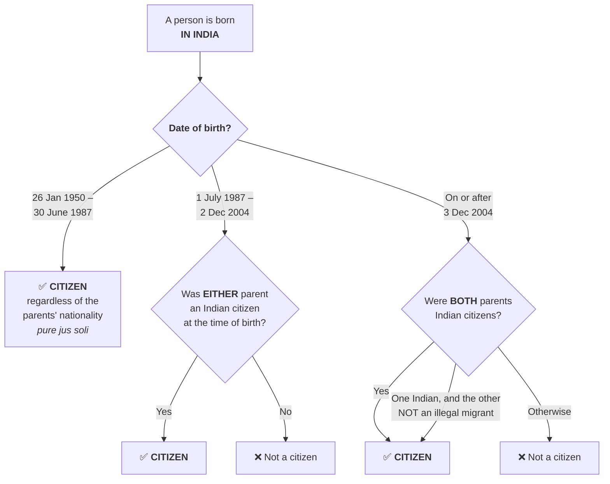
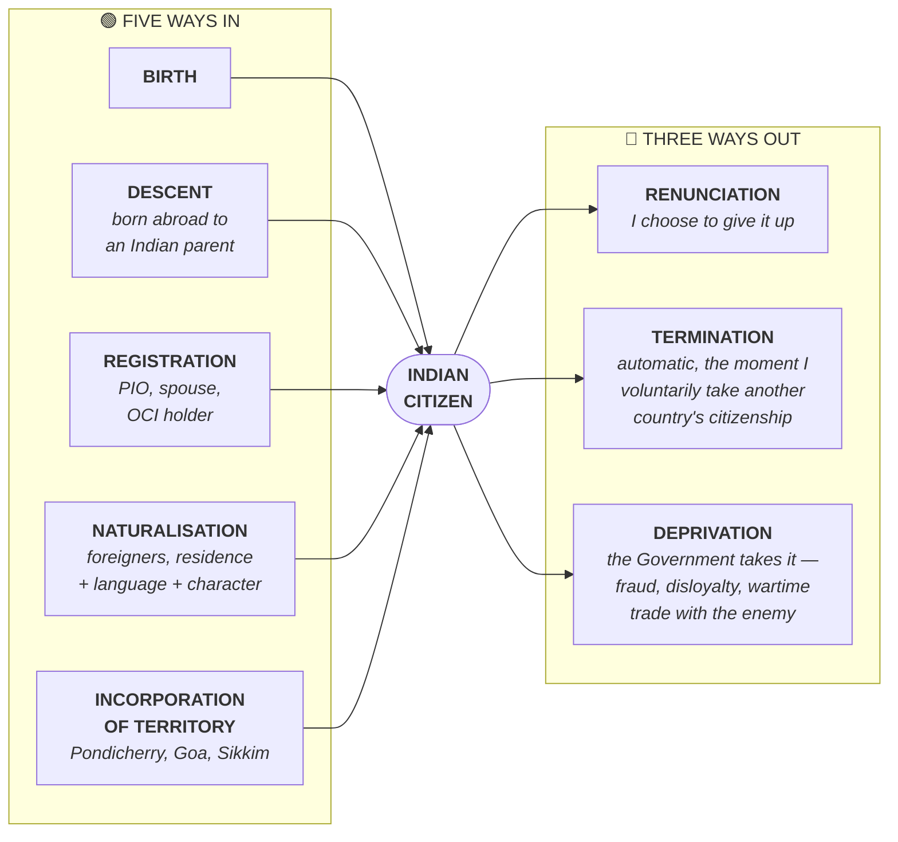

# Chapter 6 — Citizenship

[← Chapter 5](05_Union_and_its_Territory.md) · [Part Index](00_INDEX.md) · [Master](../00_INDEX.md) · [Chapter 7 →](07_Fundamental_Rights.md)

**Read time ~12 min** · Articles 5–11, Part II · **The most current-affairs-heavy chapter in Part I** — CAA, NRC, OCI

---

## 🎯 The one-line point

> **The Constitution only decided who was a citizen on 26 January 1950.** Everything after that — how you acquire citizenship, how you lose it — was left to **Parliament**, which passed the **Citizenship Act, 1955**. So most citizenship controversy is about an ordinary law, not the Constitution.

---

## 📖 The story

Imagine a club that opens on a fixed date. On opening day, the rulebook lists exactly who is a founding member. But the rulebook deliberately says nothing about who can join later — it just says *"the committee will decide."*

That's Part II. **Articles 5–8 are the opening-day list.** **Article 11 hands the committee (Parliament) full power** over everything afterwards.

> 💡 **Why this design matters:** because citizenship rules sit in an ordinary law, they can be changed by a **simple majority**. That is exactly what happened with the **CAA in 2019** — no constitutional amendment was needed. Understanding this makes the whole CAA debate clearer.

---

## PART A — Single citizenship

India follows **single citizenship** (borrowed from Britain). You are a citizen of **India** only — there is no separate "citizen of Karnataka."

> ⚠️ **Contrast with the USA:** an American is a citizen of the United States *and* of the state where they reside, with separate rights attached to each.

**Why India chose single citizenship:** to promote **fraternity and unity**, and to avoid the discrimination that dual citizenship allows.

> 💡 **But the honest caveat for a Mains answer:** single citizenship has **not** eliminated regionalism. Domicile-based reservations in state jobs and education, the "sons of the soil" movements, and special provisions under **Article 371** all create de facto local preference. Also note **Article 16(3)** lets Parliament prescribe residence requirements for certain state jobs, and **Article 15** does not bar discrimination on grounds of *place of residence* in all cases.

---

## PART B — Articles 5–11 (the opening-day list)

| Article | Who it covered on 26 January 1950 |
|---|---|
| **Article 5** | Persons **domiciled** in India who were (a) born in India, or (b) either parent born in India, or (c) ordinarily resident in India for **5 years** before commencement |
| **Article 6** | Persons who **migrated FROM Pakistan TO India** |
| **Article 7** | Persons who **migrated TO Pakistan FROM India** but later **returned** for resettlement |
| **Article 8** | **Persons of Indian origin residing outside India** — could register at an Indian diplomatic mission |
| **Article 9** | A person who **voluntarily acquires foreign citizenship is NOT an Indian citizen** |
| **Article 10** | Continuance of citizenship rights, subject to any law made by Parliament |
| **Article 11** | **Parliament may regulate citizenship by law** — the enabling provision |

> 🧠 **Mnemonic for 5–8:** *"**D**omicile, **F**rom Pakistan, **R**eturned, **O**utside India"* → **D-F-R-O**
> 5 = at home · 6 = came in · 7 = went and came back · 8 = still abroad

---

## PART C — Citizenship Act, 1955 — the five ways IN

| Mode | Key rule |
|---|---|
| **1. By BIRTH** | Born in India **on or after 26 Jan 1950 but before 1 July 1987** → citizen regardless of parents' nationality. Between **1 July 1987 and 2 Dec 2004** → citizen if **either parent** was Indian. **On or after 3 Dec 2004** → citizen only if **both parents are Indian**, or one is Indian and the other is not an illegal migrant |
| **2. By DESCENT** | Born outside India to an Indian parent, subject to registration at an Indian consulate |
| **3. By REGISTRATION** | For persons of Indian origin, spouses of Indian citizens, minor children of Indian citizens, and OCI cardholders — with residence requirements |
| **4. By NATURALISATION** | For foreigners meeting qualifications, including a residence period, good character and knowledge of a language in the Eighth Schedule |
| **5. By INCORPORATION OF TERRITORY** | When India acquires new territory, the Government specifies who becomes a citizen — e.g. **Pondicherry (1962), Goa, Sikkim** |

### 🖼️ Citizenship by birth — the decision tree

> 💡 **Read the tree left to right and you can see the policy shift happening.** India moved from *"born here = Indian"* → *"one Indian parent"* → *"both Indian parents"*. Each tightening followed migration pressure in Assam — the **Assam Accord (1985)** produced the 1987 change.

> ⚠️ **The 1987 and 2004 cutoffs are the most-tested facts in this chapter.** India moved progressively **away from pure *jus soli*** (right of soil) **towards *jus sanguinis*** (right of blood).
>
> 💡 **Why?** Because of large-scale illegal migration, especially into Assam. The **Assam Accord (1985)** and the resulting **1987 tightening** are directly connected. This is not trivia — it's a causal chain you can write about.

### The three ways OUT

| Mode | Meaning |
|---|---|
| **Renunciation** | **Voluntary.** A citizen declares they are giving it up. Minor children also lose it, but can reclaim on turning 18 |
| **Termination** | **Automatic.** Happens the moment a citizen **voluntarily acquires** another country's citizenship (echoes Article 9) |
| **Deprivation** | **Compulsory, by the Government** — for fraud in obtaining citizenship, disloyalty to the Constitution, trading with the enemy in wartime, imprisonment of 2 years within 5 years of registration, or continuous residence abroad for 7 years |

> 🧠 **Mnemonic: "R-T-D" — Renounce (I choose), Terminate (it happens), Deprive (they take it)."**

---

## PART D — OCI and the diaspora

India does **NOT** allow dual citizenship. What it offers instead is the **Overseas Citizen of India (OCI)** card.

| | |
|---|---|
| **Introduced** | Citizenship (Amendment) Act, **2005** |
| **PIO card** | Merged with the OCI scheme in **2015** |
| **OCI gets** | Lifelong visa, no registration with police, parity with NRIs in economic, financial and educational fields |
| **OCI does NOT get** | ❌ Right to **vote** · ❌ Right to hold **constitutional posts** (President, VP, judges) · ❌ Right to hold **government employment** · ❌ Right to buy **agricultural land** |

> ⚠️ **The classic trap:** OCI is **not** citizenship. An OCI cardholder is a **foreign national with privileges.** If an option says "OCI can vote" or "India permits dual citizenship" — it's wrong.

---

## PART E — The live controversies ⭐

### Citizenship (Amendment) Act, 2019 (CAA)

**What it does:** grants a **fast-track path to citizenship** for members of **six religious communities** — **Hindu, Sikh, Buddhist, Jain, Parsi and Christian** — who came from **Afghanistan, Bangladesh and Pakistan** on or before **31 December 2014**, and exempts them from being treated as illegal migrants. The naturalisation residence requirement for them was reduced.

**The constitutional objection:** it uses **religion** as a criterion for citizenship for the first time, which critics argue violates **Article 14** (equality before law), since Muslims — and persecuted groups like the Ahmadiyyas, Hazaras and Rohingyas — are excluded.

**The government's defence:** it is a narrowly tailored measure for **religiously persecuted minorities in three specified theocratic states**; the classification is reasonable and has a rational nexus with the object.

> 🧠 **Mnemonic for the six communities: "HSBJPC"** — or simply *"every South Asian religion except Islam."*
> **Three countries: A-B-P (Afghanistan, Bangladesh, Pakistan)** — all Muslim-majority neighbours. Note **Sri Lanka and Myanmar are excluded**, which is why Tamil and Rohingya refugees are not covered.

### NRC — National Register of Citizens

A register of Indian citizens. Updated in **Assam** under Supreme Court supervision, with a cutoff of **24 March 1971** (the Assam Accord date). The final list published in **2019 excluded about 19 lakh people**, who then had to prove citizenship before Foreigners Tribunals.

> 💡 **Why CAA + NRC together caused such alarm:** an NRC identifies people who cannot prove citizenship. The CAA then offers a religion-based route back for six communities — but not for Muslims. Critics argued the combination could leave one community disproportionately stateless. Understanding *the interaction* is what separates a good answer from a listy one.

---

## 🧠 Memory hooks

### The birth-citizenship timeline
> **Before 1 July 1987** → born in India = citizen *(pure jus soli)*
> **1987–2 Dec 2004** → **one** parent Indian
> **From 3 Dec 2004** → **both** parents Indian *(or one Indian + other not an illegal migrant)*
>
> 🔑 **"Soil → one parent → both parents."** India tightened twice, both times after migration pressure.

### Constitution vs Act
> **Constitution (Art 5–11)** = who was a citizen **on 26 Jan 1950**, plus Parliament's power
> **Citizenship Act 1955** = everything **since**
> ⚠️ The Constitution contains **no** provision on acquisition or loss after commencement.

### What OCI cannot do
> **"Vote, Post, Job, Land."** No voting, no constitutional post, no government job, no agricultural land.

---

## ❓ Expected Mains questions

**1. "The Citizenship (Amendment) Act, 2019 tests the limits of reasonable classification under Article 14." Critically examine. (250 words)**
> *Skeleton:* (i) What the CAA does — six communities, three countries, 31 Dec 2014 cutoff. (ii) The Article 14 test — intelligible differentia + rational nexus. (iii) Case *for*: persecuted minorities in theocratic states is an intelligible class. (iv) Case *against*: excludes persecuted Muslim sects (Ahmadiyya, Hazara), excludes Sri Lankan Tamils and Rohingyas, and introduces religion into citizenship for the first time. (v) Conclude on secularism as basic structure (*S.R. Bommai*) and the need to await judicial determination.

**2. "India's shift from jus soli to jus sanguinis reflects anxieties of migration rather than principles of citizenship." Discuss. (250 words)**
> *Skeleton:* Trace 1955 → 1987 amendment (post-Assam Accord) → 2004 amendment. Link each tightening to migration politics in Assam and the North-East. Contrast with the founding generation's inclusive vision in Articles 5–8. Conclude on the trade-off between security and constitutional generosity.

**3. Discuss the concept of single citizenship in India. Has it succeeded in eliminating regional and parochial tendencies? (250 words)**
> *Skeleton:* Rationale — fraternity, unity, avoiding US-style dual allegiance. Reality — domicile reservations, Article 16(3), sons-of-the-soil movements, Article 371 special provisions, language politics. Conclude: single citizenship is a legal fact, not a sociological one; it removed legal barriers, not social ones.

**4. What is the OCI scheme? Examine whether India should permit full dual citizenship. (150 words)**
> *Skeleton:* OCI introduced 2005, PIO merged 2015; benefits and the four exclusions. For dual citizenship — diaspora investment, soft power, remittances. Against — divided allegiance, security screening, voting rights complications. Conclude with a measured position.

---

## ⚡ 60-second revision

- **Part II, Articles 5–11.** Constitution covers only **who was a citizen on 26 Jan 1950** + Parliament's power (**Art 11**). Everything else = **Citizenship Act, 1955**
- **Art 5** domicile · **Art 6** migrated from Pakistan · **Art 7** migrated to Pakistan and returned · **Art 8** persons of Indian origin abroad · **Art 9** voluntary foreign citizenship = not a citizen
- **Single citizenship** (from Britain); USA has dual. Hasn't ended regionalism — domicile rules, Art 16(3), Art 371
- **Acquisition (5):** birth, descent, registration, naturalisation, incorporation of territory
- **Birth cutoffs: pre-1 July 1987** = soil · **1987–2 Dec 2004** = one parent · **3 Dec 2004 onward** = both parents
- **Loss (3):** renunciation (voluntary), termination (automatic on acquiring foreign citizenship), deprivation (by government)
- **OCI (2005; PIO merged 2015)** — **no vote, no constitutional post, no govt job, no agricultural land.** India does **not** allow dual citizenship
- **CAA 2019** — Hindu, Sikh, Buddhist, Jain, Parsi, Christian from **Afghanistan, Bangladesh, Pakistan**, entered on or before **31 Dec 2014**. Art 14 challenge pending
- **NRC Assam** — cutoff **24 March 1971**; final list **2019** excluded ~**19 lakh**

---

## 🔗 Practice this chapter

- [Prelims 2021 Q13](../../03_PYQ_Prelims/2021.md) — single citizenship, Head of State, deprivation of citizenship
- [Prelims 2019 Q5](../../03_PYQ_Prelims/2019.md) — Article 21 and the right to marry (linked personal-liberty ground)

---

[← Chapter 5](05_Union_and_its_Territory.md) · [Part Index](00_INDEX.md) · [Master](../00_INDEX.md) · [Chapter 7 → Fundamental Rights](07_Fundamental_Rights.md)
