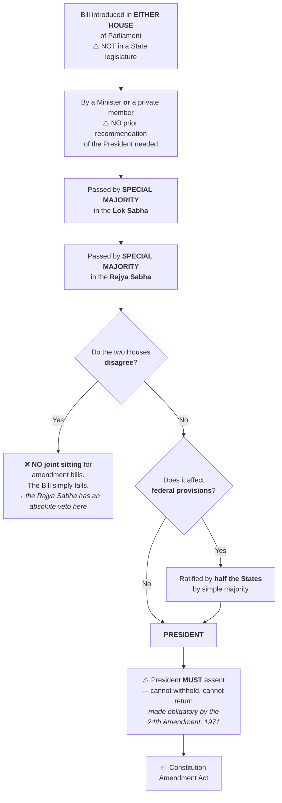
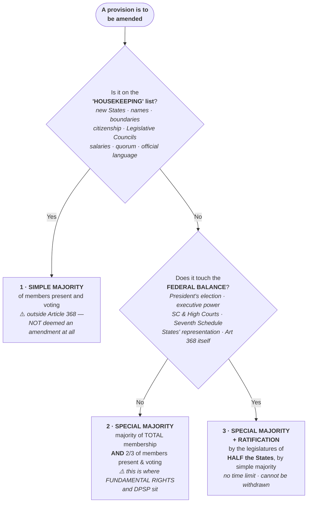

# Chapter 10 — Amendment of the Constitution

[← Chapter 9](09_Fundamental_Duties.md) · [Part Index](00_INDEX.md) · [Master](../00_INDEX.md) · [Chapter 11 →](11_Basic_Structure.md)

**Read time ~12 min** · Part XX, Article 368 · Prelims: 1–2 most years · Mains: **asked in 2002, 2013, 2014, 2019 and 2025** — one of the highest-frequency topics in the entire syllabus

---

## 🎯 The one-line point

> **Parliament can amend any part of the Constitution — but it cannot destroy its BASIC STRUCTURE.** That single sentence took 22 years, five landmark judgments and one Emergency to establish. It is the most important idea in Indian constitutional law.

---

## 📖 The story

Every constitution faces one problem: **too rigid and it snaps; too flexible and it means nothing.**

The American Constitution is extremely rigid — amended only 27 times in 230+ years. The British constitution is entirely flexible — Parliament can change anything by ordinary law. India chose a **middle path**: three different amendment routes depending on how important the provision is.

> 💡 **Analogy:** In your house, some things you can move yourself (furniture — simple majority), some need a contractor (walls — special majority), and some need permission from the whole housing society (the building's foundation — special majority *plus* half the states).

But the framers left one question unanswered: **is there anything Parliament CANNOT amend?** The Constitution is silent. That silence produced the greatest constitutional battle in Indian history.

---

## PART A — The procedure under Article 368

Learn these eight steps — Prelims questions come straight from them:

1. An amendment can be initiated **only by introducing a Bill in either House of Parliament** — ⚠️ **not in a state legislature**
2. The Bill can be introduced by a **minister or a private member**, and does **NOT require the President's prior recommendation**
3. It must be passed in **each House by a SPECIAL MAJORITY**
4. **Each House must pass it separately** — ⚠️ **there is NO provision for a joint sitting** in case of disagreement
5. If the amendment touches **federal provisions**, it must also be **ratified by the legislatures of half the states** by a **simple majority** — ⚠️ there is no time limit for the states, and a state cannot withdraw ratification once given
6. After passage, it goes to the **President**
7. The President **MUST give assent** — he can neither withhold assent nor return the Bill *(made obligatory by the **24th Amendment, 1971**)*
8. It then becomes a Constitution Amendment Act

> 🔑 **The three traps that appear again and again:**
> - **No prior recommendation of the President** is needed ⚠️ *(contrast Article 3 — state reorganisation — where it IS needed)*
> - **No joint sitting** for amendment bills
> - **President cannot refuse assent** since the 24th Amendment
>
> [Prelims 2022 Q3](../../03_PYQ_Prelims/2022.md) tested exactly these — answer: **(b) 2 and 3 only**.
> [Prelims 2013 Q5](../../03_PYQ_Prelims/2013.md) tested the "Lok Sabha only" and "all States" traps — answer: **(d) Neither**.

**Special majority means:** a majority of the **total membership** of that House **AND** a majority of **not less than two-thirds of the members present and voting**. Both conditions, together.

---

## PART B — The three types of majority ⭐

| Type | What it needs | What it amends |
|---|---|---|
| **1. SIMPLE majority** *(outside Article 368)* | Majority of members present and voting | Admission or establishment of new states · **formation of new states and alteration of areas, boundaries or names** · abolition or creation of **Legislative Councils** in states · **citizenship** · salaries and allowances · quorum · rules of procedure · privileges · use of English · number of Supreme Court judges · conferment of more jurisdiction on the SC · **official language** · Fifth and Sixth Schedule administration |
| **2. SPECIAL majority** *(Article 368)* | Majority of total membership **+** two-thirds of members present and voting | **Fundamental Rights** · **Directive Principles** · and all other provisions not in categories 1 or 3 |
| **3. SPECIAL majority + RATIFICATION by half the states** | As above, **plus** simple-majority approval by legislatures of **half the states** | **Election of the President** and its manner · extent of executive power of the Union and the States · **Supreme Court and High Courts** · distribution of legislative powers between Centre and States · **any of the lists in the Seventh Schedule** · representation of States in Parliament · **Article 368 itself** |

### 🖼️ Which majority do I need? — the decision tree

> 🔑 **The counter-intuitive takeaway:** most people assume Fundamental Rights are the most protected thing in the Constitution. **Procedurally, they are not.** FR sit in box 2 and need no state consent at all — it is the **federal provisions** in box 3 that are hardest to change.

> ⚠️⚠️ **The most commonly missed point:** amendments under category 1 are **NOT deemed amendments of the Constitution** under Article 368 at all *(recall Article 4 from [Chapter 5](05_Union_and_its_Territory.md))*.
>
> 🔑 **So Fundamental Rights need only a SPECIAL majority — NOT state ratification.** People assume rights are the most protected thing. They aren't, procedurally. **The federal provisions are.**
>
> [Prelims 2016 Q… and 2020 Q1](../../03_PYQ_Prelims/2020.md) — *"Rajya Sabha has equal powers with Lok Sabha in ___"* → **amending the Constitution**. Because there is no joint sitting, the Rajya Sabha has an absolute veto here. That's the sharpest illustration of its power.

> 🧠 **Mnemonic for category 3 — "PESSER":**
> **P**resident's election · **E**xecutive power extent · **S**upreme Court & High Courts · **S**eventh Schedule · **E**very state's representation in Parliament · **A**rticle 368 itself
> *Rough but it works: all of these touch the FEDERAL balance, so the states must be consulted.*

---

## PART C — The basic structure battle ⭐⭐

**This is the highest-value narrative in Indian polity.** Learn it as a story with rounds.

| Round | Case / Event | Year | Held |
|---|---|---|---|
| **1** | ***Shankari Prasad*** | 1951 | Parliament **CAN** amend Fundamental Rights. "Law" in Article 13 means ordinary law, not a constitutional amendment |
| **2** | ***Sajjan Singh*** | 1965 | **Reaffirmed** *Shankari Prasad* — but two judges expressed doubts, planting the seed |
| **3** | ***Golaknath*** | 1967 | **REVERSED.** Fundamental Rights have a "transcendental position." Parliament **CANNOT** abridge them at all |
| **4** | **24th Amendment** | 1971 | Parliament strikes back — declares it **CAN** amend any part including FR; makes President's assent **obligatory**; inserts **Article 13(4)** |
| **5** | ***Kesavananda Bharati*** ⭐ | **1973** | **The landmark.** Parliament **CAN** amend any part **BUT cannot alter the BASIC STRUCTURE** |
| **6** | ***Indira Nehru Gandhi v. Raj Narain*** | 1975 | Struck down a clause of the **39th Amendment** that had placed the **election of the PM beyond judicial review** — the first application of basic structure to strike down an amendment |
| **7** | **42nd Amendment** | 1976 | During the Emergency, declared there is **no limit** on Parliament's constituent power and that **no amendment can be questioned in any court** |
| **8** | ***Minerva Mills*** | 1980 | **Struck that down.** Held **judicial review** and the **balance between Parts III and IV** are themselves part of the basic structure |
| **9** | ***Waman Rao*** | 1981 | Clarified that the basic structure doctrine applies to amendments made **after 24 April 1973** — the date of the *Kesavananda* judgment |

### The Kesavananda story — worth knowing properly

> 💡 A Kerala *mathadhipati* (head of a religious mutt), **Kesavananda Bharati**, challenged Kerala's land reform laws restricting the mutt's property. The case ballooned into the biggest constitutional question in Indian history.
>
> - The Supreme Court assembled a **13-judge bench — the largest ever constituted in India**
> - Hearings ran for **68 days** — among the longest ever
> - The verdict came on **24 April 1973**, by a wafer-thin **7:6 majority**
>
> **The outcome:** Kesavananda largely *lost* his own case. But the judgment established that **Parliament's amending power is not unlimited** — and that doctrine has since been used to strike down amendments, invalidate the NJAC, and protect judicial review.
>
> 🔑 **The irony worth quoting:** the most important judgment in Indian constitutional history was delivered in a case about a temple's land, decided by one vote.

### What is in the "basic structure"?

The Court has deliberately **never given an exhaustive list** — it decides case by case. But the following have been held to be part of it:

**Supremacy of the Constitution** · **Rule of law** · **Separation of powers** · **Judicial review** · **Federalism** · **Secularism** *(S.R. Bommai, 1994)* · **Sovereign, democratic and republican structure** · **Parliamentary system** · **Free and fair elections** · **Independence of the judiciary** · **Article 32** · **Balance between Fundamental Rights and Directive Principles** *(Minerva Mills)* · **Welfare state** · **Unity and integrity of the nation** · **Limited amending power of Parliament**

> 🔑 **The doctrine in action, recently:** in 2015 the Supreme Court struck down the **99th Amendment and the NJAC Act**, holding that the collegium and judicial independence were part of the basic structure. That is [Mains 2017 GS-II Q2](../../04_PYQ_Mains/2017.md) and [Prelims 2019 Q3](../../03_PYQ_Prelims/2019.md).

---

## PART D — Criticisms of the amendment procedure

| Criticism | Substance |
|---|---|
| **No special body** | Unlike the USA, there is no Constitutional Convention — the ordinary Parliament amends the Constitution |
| **Limited role for states** | States cannot initiate an amendment *(except the resolution for creating or abolishing a Legislative Council)*. Ratification is required for only a few provisions, and there is **no time limit** on the states |
| **No joint sitting** | If the two Houses disagree, there is no deadlock-breaking mechanism |
| **Sketchy procedure** | The procedure leaves much to be filled in by judicial interpretation |
| **Too flexible in practice** | Over **100 amendments in ~75 years**, compared with 27 in the USA in over 230 years ⚠️ |

> 💡 **The counter-argument for a balanced answer:** India's high amendment count is partly an artefact of the Constitution's *length*. Because so much administrative detail is written into the text, routine changes require amendment where other countries would use ordinary law. It is not straightforwardly a sign of instability.

---

## 🧠 Memory hooks

### The judicial ping-pong in one line
> ***Shankari Prasad* YES → *Sajjan Singh* YES → *Golaknath* NO → 24th Amendment YES → *Kesavananda* YES BUT NOT BASIC STRUCTURE → 42nd Amendment UNLIMITED → *Minerva Mills* NO, JUDICIAL REVIEW IS BASIC.**
>
> **Yes, yes, no, yes, yes-but, unlimited, no.** Say it out loud a few times — the rhythm sticks.

### Which majority for what
> **Simple** = *the "housekeeping" list* — new states, names, boundaries, citizenship, Legislative Councils, salaries, official language
> **Special** = **Fundamental Rights, DPSP**, and everything else
> **Special + half the states** = anything touching the **FEDERAL balance** — President's election, SC/HCs, Seventh Schedule, states' representation, Article 368 itself

### The three "President cannot refuse" cases
> Since the **24th Amendment**, the President **must** assent to a Constitution Amendment Bill. Contrast: for an ordinary Bill he can withhold assent or return it once; for a Money Bill he can withhold but not return.

---

## ❓ Expected Mains questions

**1. "Parliament's power to amend the Constitution is a limited power and it cannot be enlarged into absolute power." Explain whether Parliament under Article 368 can destroy the basic structure by expanding its amending power. (250 words)**
> *Actually asked — [Mains 2019 GS-II Q12](../../04_PYQ_Mains/2019.md).*
> *Skeleton:* (i) The text of Article 368 and its silence on limits. (ii) The judicial journey — *Shankari Prasad* → *Golaknath* → 24th Amendment → *Kesavananda*. (iii) The decisive point: the 42nd Amendment tried exactly this — declaring unlimited constituent power — and ***Minerva Mills* struck it down**, holding that a limited power cannot be used to make itself unlimited. (iv) Conclude: Parliament cannot lift itself by its own bootstraps; the amending power is a *power under* the Constitution, not *over* it.

**2. Examine the procedural and substantive limitations on Parliament's amending power. (250 words)**
> *Actually asked — [Mains 2025 GS-II Q12](../../04_PYQ_Mains/2025.md).*
> *Skeleton:* **Procedural** — special majority, separate passage in each House, no joint sitting, state ratification for federal provisions, mandatory Presidential assent. **Substantive** — the basic structure doctrine, with its non-exhaustive list. Illustrate substantive limits with *Indira Nehru Gandhi* (1975), *Minerva Mills* (1980) and the NJAC case (2015). Conclude on the balance between constitutional stability and democratic adaptability.

**3. "The basic structure doctrine is judicial legislation without constitutional sanction." Critically examine. (250 words)**
> *Skeleton:* The charge — no textual basis in Article 368; the list is judge-made and open-ended; unelected judges override an elected Parliament. The defence — the Constitution's *silence* is not permission to destroy it; the doctrine has been used sparingly; it protected democracy in 1975–77 when no other institution could; it is now accepted across the political spectrum and has been exported to Bangladesh and Pakistan. Conclude: legitimacy earned through restraint and outcome.

**4. "The Supreme Court of India keeps a check on the arbitrary power of Parliament in amending the Constitution." Discuss critically. (250 words)**
> *Actually asked — [Mains 2013 GS-II Q4](../../04_PYQ_Mains/2013.md) and [Mains 2014 GS-II Q1](../../04_PYQ_Mains/2014.md).*
> *Skeleton:* Trace the check from *Kesavananda* through *Minerva Mills* to the NJAC case. Then present the critical side — uncertainty about what the basic structure contains; the counter-majoritarian objection; the collegium controversy as an example of the Court protecting its own power. Balanced conclusion.

---

## ⚡ 60-second revision

- **Part XX, Article 368.** Initiated **only in Parliament** (either House) · **no prior Presidential recommendation** · **no joint sitting** · President **must** assent (**24th Amendment, 1971**)
- **Special majority** = majority of **total membership** + **two-thirds present and voting**
- **Three routes:** **Simple** (new states, names, boundaries, citizenship, Legislative Councils, salaries, official language — *not* Art 368 amendments) · **Special** (**FR, DPSP**, most others) · **Special + half the states** (President's election, executive power extent, **SC/HCs**, **Seventh Schedule**, states' representation, **Art 368 itself**)
- ⚠️ **Fundamental Rights need only a special majority — no state ratification**
- **The battle:** *Shankari Prasad* 1951 (yes) → *Sajjan Singh* 1965 (yes) → ***Golaknath* 1967 (no)** → **24th Amd 1971** → ***Kesavananda Bharati* 1973 — 13 judges, 68 days, 7:6 — BASIC STRUCTURE** → *Indira Nehru Gandhi* 1975 (**39th Amd** clause struck) → **42nd Amd 1976** (unlimited power claimed) → ***Minerva Mills* 1980 (struck down; judicial review + FR-DPSP balance are basic)** → *Waman Rao* 1981 (applies post-**24 April 1973**)
- **Basic structure includes:** supremacy of Constitution, rule of law, separation of powers, **judicial review**, federalism, **secularism** (*Bommai* 1994), free and fair elections, independence of judiciary, Article 32, FR-DPSP balance, limited amending power
- **NJAC / 99th Amendment struck down (2015)** — the doctrine's most recent major use
- Criticism: no special body, limited state role, no joint sitting, over **100 amendments** vs 27 in the USA ⚠️

---

## 🔗 Practice this chapter

**Prelims:** [2013 Q5](../../03_PYQ_Prelims/2013.md) — amendment initiation and ratification traps · [2019 Q3](../../03_PYQ_Prelims/2019.md) — 99th Amendment struck down · [2020 Q1](../../03_PYQ_Prelims/2020.md) — Rajya Sabha's equal power · [2020 Q11](../../03_PYQ_Prelims/2020.md) — the Constitution does not *define* basic structure · [2022 Q3](../../03_PYQ_Prelims/2022.md) — Constitution Amendment Bill procedure · [2023 Q4](../../03_PYQ_Prelims/2023.md) — 42nd Amendment

**Mains:** [2013 Q4](../../04_PYQ_Mains/2013.md) · [2014 Q1](../../04_PYQ_Mains/2014.md) · [2016 Q6](../../04_PYQ_Mains/2016.md) *(Coelho)* · [2019 Q12](../../04_PYQ_Mains/2019.md) · [2025 Q12](../../04_PYQ_Mains/2025.md)

---

[← Chapter 9](09_Fundamental_Duties.md) · [Part Index](00_INDEX.md) · [Master](../00_INDEX.md) · [Chapter 11 → Basic Structure](11_Basic_Structure.md)
