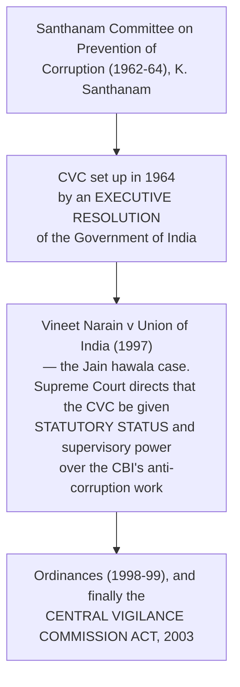

# Chapter 58 — Central Vigilance Commission

[← Chapter 57](57_State_Information_Commission.md) · [Part Index](00_INDEX.md) · [Master](../00_INDEX.md) · [Chapter 59 →](59_CBI.md)

**Read time ~8 min** · **CVC Act, 2003** · 🟠 Prelims: constitutional-vs-statutory format · Mains: through anti-corruption and regulatory-autonomy questions

> 📌 ⭐ **Read Chapters 58, 59 and 60 as ONE anti-corruption architecture:** ⭐ **the CVC advises and supervises, the CBI investigates, the Lokpal inquires and directs.** ⚠️ **Questions almost always ask how the three fit together — and the honest answer is: imperfectly.**

---

## 🎯 The one-line point

> ⭐ **The CVC is the apex vigilance institution of the Union — free of executive control, with the powers of a civil court and superintendence over the CBI's corruption investigations** — ⚠️ **and it can only ADVISE.** ⭐ **It is the "conscience keeper" of the administration, not its disciplinary authority.**

---

## PART A — ⭐ Origin: a committee, a court, and a statute

> ⭐⭐ **This origin story is worth telling in an answer.** ⚠️ **The CVC spent 39 years as an executive body created by resolution — exactly like NITI Aayog today — and became statutory only because the Supreme Court ordered it in a corruption case about political funding.** ⭐ ***Vineet Narain* (1997) is the single most important case in this Part**, and it did three things: it gave the CVC statutory status and supervision over the CBI, it prescribed a **minimum two-year tenure for the CBI Director**, and it invented the ⭐ **"continuing mandamus"** technique of monitoring an investigation.

---

## PART B — Composition, tenure and powers

| Element | Detail |
|---|---|
| ⭐⭐ **Status** | ⚠️ ⭐ **STATUTORY — the CVC Act, 2003.** ⭐ **Conceived as an independent body free of control from any executive authority** |
| ⭐ **Composition** | ⭐ **A CENTRAL VIGILANCE COMMISSIONER *(chairperson)* + not more than TWO Vigilance Commissioners** |
| ⭐⭐ **Appointment** | ⭐ **By the PRESIDENT, on the recommendation of a THREE-member committee: the ⭐ PRIME MINISTER *(chair)*, the UNION HOME MINISTER, and the LEADER OF THE OPPOSITION in the LOK SABHA** |
| ⭐⭐ **Term** | ⭐ **FOUR years, or until the age of 65, whichever is earlier** |
| ⭐ **After office** | ⚠️ ⭐ **Not eligible for any further employment under the Union or a state government** |
| ⭐ **Removal** | ⭐ **By the PRESIDENT** — for **proved misbehaviour or incapacity, only after a reference to the SUPREME COURT and an inquiry by it**; and directly for insolvency, conviction for an offence involving moral turpitude, paid employment, infirmity, or acquiring a conflicting interest. ⭐ **The President may SUSPEND** pending the inquiry |
| ⭐ **Expenses** | ⭐ **Charged on the CONSOLIDATED FUND OF INDIA** |

> ⭐ **Note the "4 years or 65" — it is the odd one out.** ⚠️ **ECI, UPSC and CAG are all SIX years; the CVC is FOUR.** ⭐ **And note that, unlike the CEC, the CVC IS barred from further office and its expenditure IS charged** — so on two of the three independence tests the CVC is better protected than the Election Commission.

### ⭐ Powers and functions

| Function | Detail |
|---|---|
| ⭐⭐ **Superintendence over the CBI** | ⭐ **Exercises superintendence over the functioning of the DELHI SPECIAL POLICE ESTABLISHMENT (the CBI) INSOFAR AS IT RELATES TO INVESTIGATION OF OFFENCES UNDER THE PREVENTION OF CORRUPTION ACT, 1988** — ⚠️ **and only that far.** It may **give directions** and **review the progress** of such investigations |
| ⭐ **Inquiry** | ⭐ **Inquire, or cause an inquiry or investigation to be made**, into an offence alleged to have been committed under the PC Act by specified categories of public servants |
| ⭐ **Civil-court powers** | ⭐ Summons, discovery, evidence on affidavit, requisition of public records, commissions for examining witnesses |
| ⭐ **Advice** | ⭐ **Tenders advice to the Central Government and its authorities on vigilance matters**; ⚠️ **the advice is NOT binding** |
| ⭐ **Appointments in the CBI** | ⭐ **A committee headed by the CENTRAL VIGILANCE COMMISSIONER recommends the appointment of CBI officers of the rank of SUPERINTENDENT OF POLICE AND ABOVE** ⚠️ *(the CBI **Director** is appointed on a different committee — see [Ch 59](59_CBI.md))* |
| ⭐⭐ **Whistle-blowers** | ⭐ **The CVC is the designated agency to receive written complaints of corruption or misuse of office** — first under the **Public Interest Disclosure and Protection of Informers resolution (2004)**, and then under the ⭐ **Whistle Blowers Protection Act, 2014** |
| ⭐ **Under the Lokpal Act** | ⭐ **The Lokpal may refer complaints against Group B, C and D officials to the CVC**, which conducts a preliminary inquiry and reports back to the Lokpal |
| **Chief Vigilance Officers** | The CVC works through **CVOs** in every ministry, department and public-sector undertaking |
| ⭐ **Reporting** | ⭐ **Annual report to the PRESIDENT, who lays it before BOTH HOUSES of Parliament** |

### ⭐ Jurisdiction — over whom

> ⭐ **Members of the ALL-INDIA SERVICES serving with the Union and GROUP A officers of the Central Government**; and ⭐ **specified levels of officers in central public-sector undertakings, nationalised banks, insurance companies, autonomous bodies and societies** owned or controlled by the Centre.
>
> ⚠️ **Note what is outside: state government employees, the judiciary, and the private sector** *(except where a private person abets a PC Act offence)*.

---

## PART C — ⚠️ The limitations

1. ⚠️ ⭐⭐ **It is ADVISORY.** The CVC recommends; the **disciplinary authority in the ministry decides**, and may reject the advice. ⭐ **It has no power to punish, and no power to register a case itself.**
2. ⚠️ ⭐ **Its supervision of the CBI is partial** — confined to **Prevention of Corruption Act** cases. ⚠️ **The CBI's other work — special crimes, economic offences — is outside it, and the CBI's administrative control lies with the DoPT.**
3. ⚠️ **No independent investigating machinery of its own** — it depends on the CBI and on departmental CVOs, who are officers of the very departments they watch.
4. ⚠️ ⭐ **The Whistle Blowers Protection Act, 2014 has never been made fully operational**, so the CVC receives disclosures without being able to guarantee protection to the discloser — ⭐ **the clearest instance of a right created and left unenforced in the anti-corruption architecture.**
5. ⚠️ **Overlap with the Lokpal**, which since 2014 sits above it for senior officials — with the CVC now doing preliminary inquiries *for* the Lokpal on junior officials.
6. ⚠️ ⭐ **Section 17A of the Prevention of Corruption Act** *(inserted in 2018)* requires **prior approval of the appropriate government** before a police officer may even begin an inquiry into an offence alleged to have been committed by a public servant in the discharge of official functions — ⚠️ **which re-created, by statute, an approval requirement the Supreme Court had struck down in 2014** *(see [Ch 59](59_CBI.md))*.

> ⭐⭐ **The framing sentence for a Mains answer:** ⚠️ **India's anti-corruption architecture separates the power to INVESTIGATE (CBI), the power to SUPERVISE (CVC) and the power to DIRECT (Lokpal) across three bodies, and gives the power to PUNISH to none of them — it stays with the department and the courts.** ⭐ **That separation was designed to prevent an over-mighty agency; its cost is delay and diffusion of responsibility.**

---

## 🧠 Memory hooks

### The origin chain
> ⭐ **SANTHANAM Committee (1962–64) → CVC by RESOLUTION (1964) → *VINEET NARAIN* (1997) → CVC ACT, 2003.**

### The numbers
> ⭐ **Central Vigilance Commissioner + up to 2 Vigilance Commissioners.** ⭐ **4 years or 65** *(not 6 — the odd one out)*. ⭐ **Committee of three: PM, HOME MINISTER, Leader of Opposition in the Lok Sabha.**

### Its two teeth, and the missing one
> ⭐ **Superintendence over the CBI — but ONLY for Prevention of Corruption Act cases.** ⭐ **Recommends CBI appointments of SP rank and above.** ⚠️ **No power to punish — advisory only.**

### The whistle-blower point
> ⭐ **The CVC is the designated agency under the Whistle Blowers Protection Act, 2014** — ⚠️ **an Act that has never been operationalised.**

---

## ❓ Expected Mains questions

**1. "India's anti-corruption architecture divides authority among the CVC, the CBI and the Lokpal, and unites accountability in none of them." Critically examine. (250 words)**
> *Skeleton:* **Map the three** — ⭐ **CVC (statutory, 2003): advises, supervises PC Act investigations, receives whistle-blower complaints**; ⭐ **CBI (DSPE Act, 1946): investigates, but needs state consent and is administratively under DoPT**; ⭐ **Lokpal (2013): inquires into public servants including the PM, and has superintendence over the CBI in cases it refers.** ⚠️ **The overlaps and gaps** — the Lokpal directs the CBI in *its* cases while the CVC supervises PC Act cases generally; the CVC does preliminary inquiries *for* the Lokpal on Group B, C and D officials; **no body can punish**; ⚠️ **Section 17A of the PC Act reintroduces prior approval**; **prosecution sanction under Section 19** remains with the government; and ⚠️ **whistle-blower protection is un-notified**. ⭐ **The case for the design** — separating investigation from supervision from adjudication prevents a single agency becoming a political weapon. ⭐ **Reforms** — a dedicated **CBI statute**, notification of the **Whistle Blowers Protection Act**, statutory **timelines for sanction decisions**, an **independent prosecution directorate**, and clear **primacy rules** between the Lokpal and the CVC. **Conclude:** the problem is not too few institutions but **too few decision points that end in a consequence.**

**2. "For achieving the desired objectives, it is necessary to ensure that the regulatory institutions remain independent and autonomous." Discuss in the light of recent experience. (250 words)**
> *Actually asked — [Mains 2015 Q16](../../04_PYQ_Mains/2015.md).*
> *Skeleton:* ⭐ **Define the three levers of institutional independence — APPOINTMENT, TENURE and FINANCE — and test bodies against them.** ⭐ **Where the design is strong:** the **CVC** *(four-year term, bar on future office, ⭐ **expenditure charged on the Consolidated Fund**, removal only on a Supreme Court inquiry)*; the **CAG** and the **UPSC**. ⚠️ **Where it is weak:** the ⭐ **ECI's voted budget and absence of a post-retirement bar**, and the **2023 Selection Committee**; the ⭐ **CIC after the 2019 amendment**, whose term and salary moved to executive rules; the **CBI's** dependence on DoPT and on state consent; and sectoral regulators whose members are drawn from, and return to, the sectors they regulate. ⭐ **The functional dimension** — independence is worthless without **capacity**: vacancies, deputation-based staffing and dependence on the parent ministry for investigators hollow out formally independent bodies. **Conclude** with a common reform template: **broad-based appointment committees, fixed non-renewable terms, charged expenditure, an independent cadre, and post-tenure cooling-off.**

---

## ⚡ 60-second revision

- ⭐ **SANTHANAM Committee (1962–64) → CVC by EXECUTIVE RESOLUTION, 1964 → ⭐ *VINEET NARAIN* (1997) → ⭐ CVC ACT, 2003.** ⚠️ **STATUTORY, not constitutional.**
- ⭐ **Central Vigilance Commissioner + not more than TWO Vigilance Commissioners.** ⭐ **Appointed by the PRESIDENT on a committee of the PM (chair), the UNION HOME MINISTER and the LEADER OF OPPOSITION in the LOK SABHA.**
- ⭐ **Term: 4 years or 65, whichever earlier.** ⚠️ ⭐ **Barred from further government employment.** ⭐ **Removed by the President only after a SUPREME COURT inquiry** *(suspension possible)*. ⭐ **Expenditure CHARGED on the Consolidated Fund of India.**
- ⭐⭐ **Superintendence over the CBI — ONLY for PREVENTION OF CORRUPTION ACT, 1988 investigations.** ⭐ **A CVC-headed committee recommends CBI appointments of SP rank and above.**
- ⭐ **Civil-court powers · inquires into PC Act allegations against All-India Service officers and Group A central officers, and specified officers of central PSUs, banks and autonomous bodies · advises the Central Government** ⚠️ **(advice NOT binding)**.
- ⭐ **Designated agency for whistle-blower complaints** — the **2004 PIDPI resolution** and the ⚠️ **Whistle Blowers Protection Act, 2014 (never fully operationalised).**
- ⭐ **Under the Lokpal Act, receives references on Group B, C and D officials** and reports back. Works through ⭐ **Chief Vigilance Officers** in every ministry and PSU.
- ⭐ **Annual report to the PRESIDENT, laid before both Houses.**
- ⚠️ **Limits:** advisory · CBI supervision confined to PC Act cases · no own investigators · overlap with the Lokpal · ⚠️ ⭐ **Section 17A of the PC Act (2018) prior approval** · un-notified whistle-blower protection.

---

## 🔗 Practice this chapter

**Prelims:** [2023 Q5](../../03_PYQ_Prelims/2023.md) and [2025 Q3](../../03_PYQ_Prelims/2025.md) — constitutional vs statutory bodies · [2026 Q10](../../03_PYQ_Prelims/2026.md) — vigilance and a vaccine contract

**Mains:** [2013 Q17](../../04_PYQ_Mains/2013.md) — a national Lokpal and immorality in public affairs · [2015 Q16](../../04_PYQ_Mains/2015.md) — independence and autonomy of regulatory institutions · [2009 Q6(a)](../../04_PYQ_Mains/2009.md) — law, elections and corruption

**Cross-links:** [Ch 59 CBI](59_CBI.md) — the agency it supervises · [Ch 60 Lokpal](60_Lokpal.md) — the body above it · [Ch 50 CAG](../Part_VII_Constitutional_Bodies/50_CAG.md) — the audit arm of the same accountability system · [Ch 65 Public Services](../Part_IX_Other_Constitutional_Dimensions/65_Public_Services.md) — Article 311 and disciplinary proceedings

**Next:** [Chapter 59 — Central Bureau of Investigation](59_CBI.md).

---

[← Chapter 57](57_State_Information_Commission.md) · [Part Index](00_INDEX.md) · [Master](../00_INDEX.md) · [Chapter 59 →](59_CBI.md)
