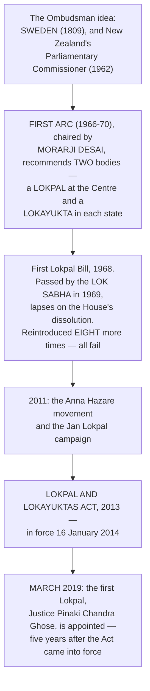

# Chapter 60 — Lokpal and Lokayuktas

[← Chapter 59](59_CBI.md) · [Part Index](00_INDEX.md) · [Master](../00_INDEX.md) · [Chapter 61 →](61_NIA.md)

**Read time ~13 min** · **Lokpal and Lokayuktas Act, 2013** · 🔴 ⚠️ **Prelims: 2025 — asked directly** · **Mains: 2013**

> 📌 ⭐ **Forty-five years passed between the first Lokpal Bill (1968) and the Act (2013), and another five before the first Lokpal was appointed (2019).** ⚠️ **That fifty-year delay is not background colour — it IS the answer to most questions on this chapter.** ⭐ **An anti-corruption institution that took half a century to create tells you something about who had to consent to its creation.**

---

## 🎯 The one-line point

> ⭐⭐ **The Lokpal is India's Ombudsman for corruption — an independent authority that can inquire into any public servant, INCLUDING THE PRIME MINISTER, and direct the CBI to investigate.** ⚠️ **On paper it is the most powerful anti-corruption body India has ever had. In practice it has no power to initiate an inquiry on its own, depends on other agencies to investigate, and works alongside a whistle-blower law that was never brought into force.**

---

## PART A — ⭐ The fifty-year history

> ⭐ **Two names to keep straight:** ⭐ **the FIRST ARC (Morarji Desai) recommended it in 1966**; ⭐ **the 2013 Act followed the 2011 movement.** ⚠️ **The eight failed Bills in between are the point — every government introduced one and none carried it, because the institution's jurisdiction includes the government.**

---

## PART B — Composition and appointment

| Element | Detail |
|---|---|
| ⭐⭐ **Composition** | ⭐ **A CHAIRPERSON + a maximum of EIGHT members** |
| ⭐⭐ **Judicial quota** | ⭐ **At least 50% of the members must be JUDICIAL members** |
| ⭐⭐ **Diversity quota** | ⭐ **At least 50% of the members must be from SCs, STs, OBCs, minorities and women** |
| ⭐ **Who may be Chairperson** | ⭐ **A former CHIEF JUSTICE OF INDIA, or a former JUDGE OF THE SUPREME COURT**, or ⭐ **an eminent person of impeccable integrity and outstanding ability with special knowledge and at least 25 YEARS' experience in anti-corruption policy, public administration, vigilance, finance, law and management** |
| ⭐ **Who may be a judicial member** | ⭐ **A former JUDGE OF THE SUPREME COURT or a former CHIEF JUSTICE OF A HIGH COURT** |
| ⭐⭐ **Selection Committee** | ⭐ **The PRIME MINISTER *(chair)* · the SPEAKER of the Lok Sabha · the LEADER OF THE OPPOSITION in the Lok Sabha · the CHIEF JUSTICE OF INDIA or a Supreme Court judge nominated by him · and ⭐ ONE EMINENT JURIST nominated by the PRESIDENT on the recommendation of the first four** |
| **Search Committee** | ⭐ **At least EIGHT members**, constituted by the Selection Committee to shortlist candidates |
| ⭐ **Appointed by** | ⭐ **The PRESIDENT** |
| ⭐ **Term** | ⭐⭐ **FIVE years, or until the age of 70, whichever is earlier** |
| ⚠️ ⭐ **Afterwards** | ⭐ **Not eligible for reappointment**; ⚠️ ⭐ **barred from being a Governor, an MP or an MLA, from any diplomatic assignment, and from further employment under the Union or a state; and cannot contest an election for FIVE YEARS after demitting office** |
| ⭐ **Removal** | ⭐ **By the PRESIDENT on the ground of misbehaviour, ONLY AFTER the SUPREME COURT, on a reference by the President, holds an inquiry and reports.** ⭐ **The reference is made either on a PETITION SIGNED BY AT LEAST 100 MEMBERS OF PARLIAMENT, or on the President's own satisfaction on a citizen's petition.** Also removable for insolvency, paid employment or infirmity |

> ⭐ **The Selection Committee is the most balanced in Indian law — the government holds ONE seat of five**, and the fifth member *(the eminent jurist)* is chosen by the other four. ⚠️ **Contrast the ⭐ 2023 ECI Selection Committee** *(PM + a Union minister + LoP — the executive holds two of three)* **and the ⭐ CIC committee** *(PM + a Union minister + LoP)*. ⭐ **Setting these three side by side is one of the most effective comparisons available in the whole book.**
>
> ⚠️ ⭐ **The 2016 amendment** allowed the ⭐ **leader of the single largest opposition party** to sit on the Committee where there is **no recognised Leader of the Opposition** — a fix for a real problem, since the absence of an LoP had been cited as the reason no Lokpal was appointed between 2014 and 2019.

---

## PART C — ⭐⭐ Jurisdiction

### ⭐ Whom the Lokpal covers

| Category | Detail |
|---|---|
| ⭐⭐ **The PRIME MINISTER** | ⭐ **Yes — with exclusions and a special procedure** *(below)* |
| ⭐ **Union Ministers** | ⭐ **Yes** |
| ⭐ **Members of Parliament** | ⭐ **Yes** — ⚠️ **EXCEPT in respect of anything SAID or a VOTE GIVEN in Parliament, which is protected by Article 105(2)** |
| ⭐ **Officials** | ⭐ **Groups A, B, C and D of the Central Government** |
| ⭐ **Bodies** | ⭐ **Chairpersons, members and officers of any board, corporation, society, trust or autonomous body established by an Act of Parliament, or wholly or partly financed by the Central Government** |
| ⭐⭐ **NGOs** | ⭐ **Any society or trust receiving FOREIGN CONTRIBUTION above ₹10 LAKH**, and bodies receiving government funding above a specified threshold |
| ⚠️ **NOT covered** | ⚠️ ⭐ **The JUDICIARY is outside the Lokpal's jurisdiction** |

### ⭐⭐ The Prime Minister — the exclusions and the safeguards

> ⭐ **The Lokpal MAY inquire into an allegation against the Prime Minister — but NOT if the allegation relates to:**
> ⭐⭐ **INTERNATIONAL RELATIONS · EXTERNAL AND INTERNAL SECURITY · PUBLIC ORDER · ATOMIC ENERGY · SPACE.**

⭐ **And two procedural safeguards apply:**
1. ⭐⭐ **An inquiry against the PM requires the approval of a FULL BENCH of the Lokpal, with at least TWO-THIRDS of the members agreeing**;
2. ⭐⭐ **The inquiry must be held IN CAMERA**, and ⭐ **if the Lokpal decides to dismiss the complaint, the records of the inquiry shall NOT be published or made available to anyone.**

> ⭐ **Present these as a designed trade-off, not as a loophole.** ⚠️ **Bringing a head of government within an anti-corruption body's reach risks paralysing the office through frivolous complaints; the supermajority and the in-camera rule are the price of including the PM at all.** ⭐ **The five subject exclusions are a genuine gap, though — "public order" in particular is broad enough to shelter a great deal.**

---

## PART D — ⭐ Powers, procedure and machinery

| Power | Detail |
|---|---|
| ⭐⭐ **Superintendence over the CBI** | ⭐ **In respect of cases REFERRED BY IT to the CBI, the Lokpal has powers of superintendence and direction** |
| ⭐⭐ **Transfer protection** | ⭐ **An officer of the CBI investigating a case referred by the Lokpal CANNOT BE TRANSFERRED without the Lokpal's approval** — ⚠️ **a direct answer to the classic method of derailing an investigation** |
| ⭐ **Attachment of property** | ⭐ **Powers to attach and confiscate property acquired by corrupt means**, even while prosecution is pending |
| ⭐ **Civil-court powers** | Summons, discovery, evidence on affidavit, requisition of records |
| ⭐ **Interim measures** | ⭐ **May recommend the TRANSFER or SUSPENSION of a public servant connected with an allegation**, and ⭐ **give directions to PREVENT THE DESTRUCTION OF RECORDS** during a preliminary inquiry |
| ⭐ **Its own wings** | ⭐ **An INQUIRY WING headed by a Director of Inquiry**, and ⭐ **a PROSECUTION WING headed by a Director of Prosecution** |
| ⭐ **Referral downward** | ⭐ **Complaints against Group B, C and D officials may be referred to the CVC**, which conducts a preliminary inquiry and reports back |

### ⭐ The timelines

| Stage | Time |
|---|---|
| ⭐ **Preliminary inquiry** | ⭐ **90 days**, extendable by a further **90 days** |
| ⭐ **Investigation** | ⭐ **6 months**, extendable by **6 months at a time**, with reasons recorded |
| ⭐ **Trial** | ⭐ **1 year**, extendable to **2 years**, in a ⭐ **SPECIAL COURT** |

⚠️ **Also worth knowing:** ⭐ **before ordering an investigation, the Lokpal must give the public servant an opportunity to be heard on the preliminary inquiry report**; and ⭐ **a false and frivolous complaint is itself punishable**, which critics say deters genuine complainants.

---

## PART E — ⚠️ The weaknesses, and the Lokayuktas

### ⚠️ The seven criticisms

1. ⚠️ ⭐⭐ **No SUO MOTU power** — the Lokpal cannot start an inquiry on its own; it must receive a complaint in the prescribed form;
2. ⚠️ ⭐ **No constitutional status** — the Act can be amended or repealed by simple majority;
3. ⚠️ ⭐ **It has no investigating agency of its own for serious cases** and depends on the **CBI** *(which has its own consent and control problems — [Ch 59](59_CBI.md))* and the **CVC**;
4. ⚠️ ⭐ **The Whistle Blowers Protection Act, 2014 was never fully operationalised** — ⭐ **so the complainants on whom the Lokpal depends have no statutory protection**;
5. ⚠️ **The judiciary is excluded**, and no equivalent mechanism *(such as a Judicial Standards and Accountability Bill)* was enacted;
6. ⚠️ ⭐ **Five years to appoint the first Lokpal**, and continuing vacancies since — the institutional record is thin;
7. ⚠️ ⭐ **The 2016 amendment deferred and diluted the requirement that public servants declare the assets of their SPOUSES AND DEPENDENT CHILDREN**, which had been one of the Act's sharper provisions.

### ⭐ Lokayuktas — the state half

| Element | Detail |
|---|---|
| ⭐ **The obligation** | ⭐ **Section 63 of the Act requires EVERY STATE to establish a LOKAYUKTA BY LAW within ONE YEAR of the Act's commencement** |
| ⚠️ ⭐⭐ **The gap** | ⚠️ **The Act does NOT prescribe the Lokayukta's composition, powers or jurisdiction — those are left entirely to each state.** ⭐ **The result is wide variation: some states cover the Chief Minister, others do not; some have investigative powers, others only recommendatory ones** |
| ⭐ **First in the field** | ⭐ **MAHARASHTRA was the FIRST state to actually establish a Lokayukta, in 1971** — ⚠️ ⭐ **though ODISHA passed the first Act (1970), it was brought into force later** |
| ⭐ **Structure, typically** | A Lokayukta *(usually a retired Supreme Court or High Court judge)*, sometimes with an **Upa-Lokayukta**; appointed by the **Governor** in consultation with the **Chief Justice of the High Court** and the **Leader of the Opposition**; reports to the Governor, who lays the report before the state legislature |
| ⚠️ **Karnataka's example** | The Karnataka Lokayukta's reports on illegal mining produced a **Chief Minister's resignation** — ⭐ **cite it as proof that the institution works where it is given investigative powers and a police wing** |

---

## 🧠 Memory hooks

### The dates
> ⭐ **First ARC (Morarji Desai) 1966 → first Bill 1968 → ⭐ ACT 2013, in force 16 January 2014 → ⭐ first Lokpal, March 2019.** ⭐ **Nine Bills failed in between.**

### The shape
> ⭐ **Chairperson + max 8 members.** ⭐ **≥ 50% JUDICIAL. ≥ 50% from SC/ST/OBC/minorities/women.** ⭐ **5 years or 70.**

### The Selection Committee of five
> ⭐ **PM · SPEAKER · Leader of Opposition (Lok Sabha) · CJI or his nominee · ONE EMINENT JURIST chosen by the other four.** ⭐ **The government holds ONE seat of five** — the most balanced committee in Indian law.

### The PM carve-out
> ⭐⭐ **Excluded subjects: INTERNATIONAL RELATIONS · SECURITY (external and internal) · PUBLIC ORDER · ATOMIC ENERGY · SPACE.** ⭐ **Needs a FULL BENCH with TWO-THIRDS agreement; held IN CAMERA; records not published if dismissed.**

### The two real teeth
> ⭐ **Superintendence over the CBI in referred cases** — and ⭐ **no CBI officer on such a case may be TRANSFERRED without the Lokpal's approval.**

### The biggest gap
> ⚠️ ⭐⭐ **NO SUO MOTU POWER.** *(Contrast the ⭐ NHRC, which has it — [Ch 54](54_NHRC.md).)*

---

## ❓ Expected Mains questions

**1. "A national Lokpal, however strong it may be, cannot resolve the problems of immorality in public affairs." Discuss. (250 words)**
> *Actually asked — [Mains 2013 Q17](../../04_PYQ_Mains/2013.md).*
> *Skeleton:* (i) ⭐ **What a strong Lokpal CAN do** — reach the **Prime Minister, ministers, MPs and all four groups of officials**; ⭐ **superintend the CBI in referred cases and block transfers of investigators**; **attach corruptly acquired property**; run its own **inquiry and prosecution wings**; enforce **timelines** through Special Courts. (ii) ⭐ **Why it cannot resolve "immorality"** — corruption is the **prosecutable subset** of a much larger problem of **ethical deficit, conflict of interest, opacity in political funding, patronage in transfers and postings, and criminalisation of politics**; a Lokpal acts **after the fact**, on **individual complaints**, and cannot change incentives. (iii) ⚠️ ⭐ **Its own structural limits** — **no suo motu power**; dependence on the **CBI and CVC**; ⚠️ **un-operational whistle-blower protection**; **judiciary excluded**; **five years to the first appointment**; **uneven Lokayuktas**. (iv) ⭐ **What is needed alongside it** — ⭐ **preventive systems** *(RTI Section 4 proactive disclosure, e-governance, direct benefit transfer, simplification of discretion)*, ⭐ **electoral funding reform** *([Ch 72](../Part_IX_Other_Constitutional_Dimensions/72_Electoral_Reforms.md))*, **citizens' charters and grievance redress**, ⭐ **a Public Services Bill and clear rules on conflict of interest**, and **civil-service reform on transfers and postings**. (v) ⭐ **Conclude:** an ombudsman is a **detection-and-deterrence** institution; morality in public life is produced by **systems that reduce discretion and by transparent politics** — the Lokpal is necessary and, by itself, insufficient. ⚠️ **Note the parallel: RTI, arguably, changed everyday administrative behaviour more than any prosecution body has.**

**2. "The Lokpal is a powerful institution disabled by its own procedure." Examine. (250 words)**
> *Skeleton:* **The powers** — jurisdiction up to the PM; superintendence over the CBI; transfer protection; attachment of property; inquiry and prosecution wings; statutory timelines; ⭐ **the most balanced Selection Committee in Indian law**. ⚠️ **The procedural disabilities** — ⭐ **no suo motu jurisdiction**; complaints only in the **prescribed form**; ⭐ **punishment for false complaints** deterring genuine ones; ⚠️ **no whistle-blower protection in force**; a **hearing for the public servant before investigation**; ⭐ **a two-thirds full-bench threshold and in-camera proceedings for the PM**; and **reliance on the CBI and CVC to investigate**. ⭐ **Balance** — several of these are **deliberate protections against harassment** of public servants, which an anti-corruption body without them would inevitably become. **Conclude:** ⭐ **grant suo motu power on a reasoned order, notify the Whistle Blowers Protection Act, give the Lokpal an independent investigating cadre, and fix vacancies by a statutory deadline** — the design does not need replacing, only completing.

---

## ⚡ 60-second revision

- ⭐ **First ARC (Morarji Desai, 1966) → first Bill 1968 → ⭐ Lokpal and Lokayuktas Act, 2013, in force 16 Jan 2014 → ⭐ first Lokpal March 2019.** ⚠️ **Statutory, not constitutional.**
- ⭐⭐ **Chairperson + up to 8 members; ≥ 50% JUDICIAL; ≥ 50% from SC/ST/OBC/minorities/women.** ⭐ **Chairperson: a former CJI, a former Supreme Court judge, or an eminent person with 25 years' experience.** ⭐ **Judicial member: a former Supreme Court judge or a former High Court Chief Justice.**
- ⭐⭐ **Selection Committee: PM (chair) · Speaker · Leader of Opposition in the Lok Sabha · CJI or his nominee · ONE EMINENT JURIST nominated by the President on the other four's recommendation.** ⭐ **Search Committee of at least 8.** ⭐ **2016 amendment: the leader of the single largest opposition party may substitute for an absent LoP.**
- ⭐ **Term 5 years or 70.** ⚠️ **No reappointment; barred from Governorship, Parliament, a legislature, diplomatic assignments and government employment; cannot contest an election for 5 years.** ⭐ **Removed by the President after a SUPREME COURT inquiry, on a reference following a petition by ≥ 100 MPs or the President's own satisfaction.**
- ⭐⭐ **Jurisdiction: the PM · Union Ministers · MPs (⚠️ except speech and vote — Article 105(2)) · Groups A, B, C, D · bodies established by an Act of Parliament or financed by the Centre · ⭐ societies and trusts receiving foreign contribution above ₹10 lakh.** ⚠️ **The JUDICIARY is excluded.**
- ⭐⭐ **PM exclusions: international relations · external and internal security · public order · atomic energy · space.** ⭐ **Full bench with 2/3 approval; IN CAMERA; records not published if dismissed.**
- ⭐⭐ **Powers: superintendence over the CBI in referred cases · ⭐ NO TRANSFER of the investigating CBI officer without the Lokpal's approval · attachment and confiscation of corruptly acquired property · civil-court powers · may recommend transfer or suspension · directions to prevent destruction of records · own INQUIRY and PROSECUTION wings · may refer Group B/C/D cases to the CVC.**
- ⭐ **Timelines: preliminary inquiry 90 + 90 days; investigation 6 months, extendable by 6; trial 1 year, extendable to 2, in a SPECIAL COURT.**
- ⚠️ **Weaknesses: NO SUO MOTU POWER · no constitutional status · no own investigating agency for serious cases · un-notified whistle-blower protection · judiciary excluded · vacancies · the 2016 dilution of spouse and dependant asset disclosure.**
- ⭐ **Lokayuktas: every state must create one within ONE YEAR (s.63)** — ⚠️ **but the Act prescribes NO uniform structure.** ⭐ **MAHARASHTRA established the first (1971); ODISHA passed the first Act (1970).**

---

## 🔗 Practice this chapter

**Prelims:** [2025 Q14](../../03_PYQ_Prelims/2025.md) — Lokpal · [2023 Q5](../../03_PYQ_Prelims/2023.md) and [2025 Q3](../../03_PYQ_Prelims/2025.md) — constitutional vs statutory bodies

**Mains:** [2013 Q17](../../04_PYQ_Mains/2013.md) — a national Lokpal and immorality in public affairs · [2009 Q6(a)](../../04_PYQ_Mains/2009.md) — law, elections and corruption · [2015 Q16](../../04_PYQ_Mains/2015.md) — regulatory independence

**Cross-links:** [Ch 59 CBI](59_CBI.md) — the agency it superintends · [Ch 58 CVC](58_Central_Vigilance_Commission.md) — its partner for junior officials · [Ch 56 CIC](56_Central_Information_Commission.md) — the transparency arm of the same project · [Ch 22 Parliament](../Part_III_Central_Government/22_Parliament.md) — Article 105(2) and the speech-and-vote immunity · [Ch 65 Public Services](../Part_IX_Other_Constitutional_Dimensions/65_Public_Services.md) — civil-service accountability

**Next:** [Chapter 61 — National Investigation Agency](61_NIA.md).

---

[← Chapter 59](59_CBI.md) · [Part Index](00_INDEX.md) · [Master](../00_INDEX.md) · [Chapter 61 →](61_NIA.md)
