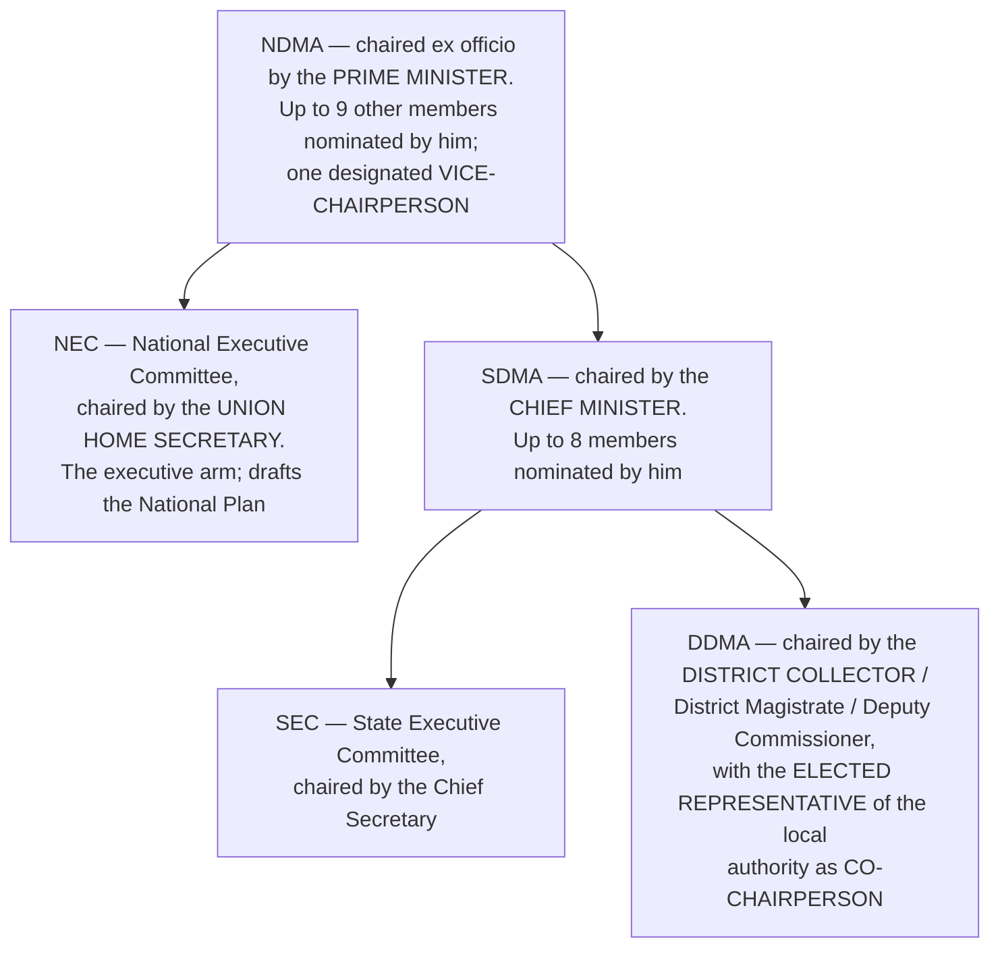

# Chapter 62 — National Disaster Management Authority

[← Chapter 61](61_NIA.md) · [Part Index](00_INDEX.md) · [Master](../00_INDEX.md) · [Chapter 63 →](../Part_IX_Other_Constitutional_Dimensions/63_Cooperative_Societies.md)

**Read time ~5 min** · **Disaster Management Act, 2005** · 🟡 ⚠️ **Mains: 2020 — cited by name in a federalism question**

> 📌 ⭐ **Most aspirants file this chapter under "disaster management" and skim it.** ⚠️ **UPSC filed it under FEDERALISM.** ⭐ **[Mains 2020 Q11](../../04_PYQ_Mains/2020.md) named the Disaster Management Act, 2005 alongside the Epidemic Diseases Act, 1897 and the Farm Acts as evidence of the Constitution's "centralising tendencies"** — because that Act was the legal basis of the nationwide COVID-19 lockdown.

---

## 🎯 The one-line point

> ⭐⭐ **"Disaster management" appears in NO list of the Seventh Schedule.** ⚠️ **Parliament enacted the 2005 Act using its residuary power and Concurrent List entry 23 (social security and social insurance)** — ⭐ **and the Act then created a chain of authorities headed by the Prime Minister whose directions bind every state.** ⭐ **A subject that belongs to nobody became, in an emergency, the Union's.**

---

## PART A — The three-tier structure

| Body | ⭐ **Chaired by** | Key facts |
|---|---|---|
| ⭐⭐ **NDMA** | ⭐ **The PRIME MINISTER**, ex officio | ⭐ **Not more than NINE other members**, nominated by the Chairperson; one of them designated ⭐ **Vice-Chairperson** |
| ⭐ **NEC** | ⭐ **The UNION HOME SECRETARY** | Secretaries of key ministries; the ⭐ **executive committee that prepares the National Plan and coordinates enforcement** |
| ⭐⭐ **SDMA** | ⭐ **The CHIEF MINISTER** of the state | Not more than **eight** other members |
| ⭐ **SEC** | ⭐ **The Chief Secretary** of the state | The state executive arm |
| ⭐⭐ **DDMA** | ⭐ **The DISTRICT COLLECTOR / Magistrate / Deputy Commissioner** | ⭐ **CO-CHAIRPERSON: the ELECTED REPRESENTATIVE of the local authority** *(in a Sixth Schedule area, the Chief Executive Member of the autonomous district council)* |

> ⭐⭐ **Memorise the chairs as a ladder — PRIME MINISTER · CHIEF MINISTER · DISTRICT COLLECTOR.** ⭐ **And note the one democratic touch: at the district level alone, an ELECTED representative co-chairs.** ⚠️ **At the national and state levels the elected head is the chair by office, so there is no separate elected voice.**

### ⭐ The supporting institutions

| Institution | Role |
|---|---|
| ⭐ **NDRF — National Disaster Response Force** | ⭐ **A specialist response force headed by a DIRECTOR-GENERAL**, drawn from the central armed police forces |
| ⭐ **NIDM — National Institute of Disaster Management** | ⭐ **Training, research, documentation and capacity-building** |
| ⭐ **National Disaster Response Fund (NDRF)** and ⭐ **National Disaster Mitigation Fund** | ⭐ **RESPONSE vs MITIGATION** — ⚠️ **the distinction is examinable: response funds meet immediate relief; mitigation funds finance projects that reduce future risk.** State-level equivalents exist |

---

## PART B — ⭐ Functions and powers

⭐ **The NDMA:**
1. ⭐ **Lays down POLICIES on disaster management**;
2. ⭐ **Approves the NATIONAL PLAN**, and the plans of the **central ministries and departments**;
3. ⭐ **Lays down GUIDELINES to be followed by the states in drawing up the State Plan**, and by the central ministries for integrating **mitigation measures into their development plans**;
4. ⭐ **Coordinates the enforcement and implementation** of policy and plan;
5. ⭐ **Recommends the provision of FUNDS for MITIGATION**;
6. ⭐ **Provides support to other countries** affected by major disasters, as determined by the Central Government;
7. ⭐ **Takes measures for prevention, mitigation, preparedness and capacity-building**;
8. ⭐ **Lays down broad policies and guidelines for the NIDM and the NDRF.**

⭐ **The definition to know:** ⭐ **"Disaster" means a catastrophe, mishap, calamity or grave occurrence — from natural OR MAN-MADE causes — which results in substantial loss of life, or damage to property or the environment, and is of such a nature or magnitude as to be BEYOND THE COPING CAPACITY OF THE COMMUNITY of the affected area.**

> ⚠️ ⭐ **"Beyond the coping capacity of the community" is the operative phrase** — it is what allowed a **pandemic** to be declared a "disaster" in 2020 and the Act's emergency machinery to be switched on nationwide.

---

## PART C — ⚠️⚠️ The federalism question — why this chapter is examined

⭐ **What happened in March 2020:**
> ⭐ **COVID-19 was notified as a "disaster"; the NDMA issued directions under the Act; and the ⭐ NATIONAL EXECUTIVE COMMITTEE, under the Union Home Secretary, issued nationwide lockdown orders that bound every state government.** ⭐ **Section 51 made disobedience a punishable offence.**

| ⚠️ **The centralising critique** | ⭐ **The justification** |
|---|---|
| ⭐ **"Public health and sanitation, hospitals and dispensaries" is STATE LIST entry 6** — health is a state subject | ⭐ **A pandemic does not respect state borders; an inconsistent national response would have failed** |
| ⚠️ ⭐ **NEC directions — issued by a civil servant's committee — overrode elected state governments** | ⭐ **The Act was passed by Parliament with the states' knowledge, and creates a chain in which the CM chairs the SDMA** |
| ⚠️ **No parliamentary approval or time-limit**, unlike a **national emergency under Article 352**, which needs approval within a month and renewal every six months | ⭐ **Speed is the essence of disaster response** |
| ⚠️ **The Epidemic Diseases Act, 1897 is a colonial statute with almost no procedural safeguards** | It was amended in 2020 to protect healthcare workers |

> ⭐⭐ **The analytical point to make:** ⚠️ **India has a formal emergency chapter with heavy safeguards (Articles 352–360 — [Ch 16](../Part_II_System_of_Government/16_Emergency_Provisions.md)) and a set of ORDINARY STATUTES that produce emergency-like central power with almost NO safeguards.** ⭐ **In 2020 the government used the statutes, not the Constitution.** ⭐ **That is the single most sophisticated observation available on this chapter, and it directly answers the 2020 question.**

⭐ **The reform agenda:** ⭐ **a Disaster Management (Amendment) Bill, 2024 was brought forward to give statutory status to the National Crisis Management Committee and the High-Level Committee, to create URBAN disaster management authorities for state capitals and large cities, to provide for a state disaster response force, and to require a national disaster database and risk register.** ⚠️ **Check the current enactment status before citing it as law.**

---

## 🧠 Memory hooks

### The ladder
> ⭐⭐ **NDMA — PRIME MINISTER · SDMA — CHIEF MINISTER · DDMA — DISTRICT COLLECTOR** *(with the **elected local representative as co-chair**)*. ⭐ **NEC — UNION HOME SECRETARY · SEC — CHIEF SECRETARY.**

### The numbers
> ⭐ **NDMA: PM + not more than 9 others.** ⭐ **SDMA: CM + not more than 8 others.**

### The four institutions
> ⭐ **NDRF (Force, under a DG) · NIDM (training) · National Disaster RESPONSE Fund · National Disaster MITIGATION Fund.**

### The definition
> ⭐ **Natural OR man-made · substantial loss of life, property or environment · ⭐ "BEYOND THE COPING CAPACITY OF THE COMMUNITY."**

### The federalism line
> ⚠️ ⭐ **"Disaster management" is in NO list.** ⭐ **The 2005 Act delivered emergency-scale central power WITHOUT the Article 352 safeguards.**

---

## ❓ Expected Mains question

**1. "Indian Constitution exhibits centralising tendencies to maintain unity and integrity of the nation. Elucidate in the perspective of the Epidemic Diseases Act, 1897, the Disaster Management Act, 2005, and the recently passed Farm Acts." (250 words)**
> *Actually asked — [Mains 2020 Q11](../../04_PYQ_Mains/2020.md).*
> *Skeleton:* (i) ⭐ **The constitutional design already tilts to the Centre** — a strong Union List, **residuary powers with the Union**, **Article 249 and 250**, **Article 256/257 directions**, **Articles 352–360**, All-India Services, a single judiciary and a single citizenship *(see [Ch 13](../Part_II_System_of_Government/13_Federal_System.md) and [Ch 14](../Part_II_System_of_Government/14_Centre_State_Relations.md))*. (ii) ⭐ **The Disaster Management Act, 2005** — "disaster management" is **in no list**; the Act creates a **PM-chaired NDMA** and an **NEC under the Home Secretary** whose directions bind states; used in **March 2020** to impose a **nationwide lockdown** over a **State List subject (public health)**, ⚠️ **with no parliamentary approval or sunset clause** of the kind Article 352 requires. (iii) ⭐ **The Epidemic Diseases Act, 1897** — a **four-section colonial statute** conferring sweeping powers with negligible safeguards. (iv) ⭐ **The Farm Acts** — enacted using **Concurrent List entry 33 (trade and commerce in foodstuffs)** over a field the states regard as **agriculture, State List entry 14**; ⚠️ **passed without consultation and later repealed**, which is itself the constitutional lesson. (v) ⭐ **Balanced assessment** — centralisation was **necessary and effective in the pandemic** *(uniform standards, vaccine procurement, inter-state movement)*, and **unity has genuinely been maintained**; ⚠️ **but the method matters** — emergency-scale power exercised through **ordinary statutes escapes the safeguards the Constitution attached to emergencies**. ⭐ **Conclude with the remedy:** use the **Inter-State Council (Article 263)** before legislating in contested fields, build **sunset and parliamentary-approval clauses** into disaster powers, and strengthen **state and district capacity** so that centralisation is a fallback rather than a first resort.

---

## ⚡ 60-second revision

- ⭐ **Disaster Management Act, 2005.** ⚠️ ⭐ **"Disaster management" appears in NO list of the Seventh Schedule.**
- ⭐⭐ **NDMA — chaired EX OFFICIO by the PRIME MINISTER; not more than 9 other members nominated by him; one designated Vice-Chairperson.**
- ⭐ **NEC — chaired by the UNION HOME SECRETARY** *(prepares the National Plan, coordinates enforcement)*. ⭐ **SDMA — CHIEF MINISTER, up to 8 members.** ⭐ **SEC — CHIEF SECRETARY.** ⭐⭐ **DDMA — DISTRICT COLLECTOR, with the ELECTED local representative as CO-CHAIRPERSON.**
- ⭐ **NDRF (a force under a Director-General) · NIDM (training and research) · National Disaster RESPONSE Fund · National Disaster MITIGATION Fund.**
- ⭐ **NDMA functions:** policies · approve the **National Plan** and ministries' plans · **guidelines** for state plans and for mitigation in development plans · coordinate enforcement · recommend **mitigation funds** · support other countries · prevention, preparedness and capacity-building.
- ⭐ **"Disaster" = natural OR man-made · substantial loss of life, property or environment · ⭐ BEYOND THE COPING CAPACITY OF THE COMMUNITY.**
- ⚠️ ⭐ **The federalism point:** the Act was the legal basis of the **2020 nationwide lockdown** over **public health, a State List subject**, through **NEC directions**, ⚠️ **without Article 352's parliamentary approval or time-limits.** ⭐ **Emergency power through an ordinary statute.**

---

## 🔗 Practice this chapter

**Prelims:** [2023 Q5](../../03_PYQ_Prelims/2023.md) and [2025 Q3](../../03_PYQ_Prelims/2025.md) — constitutional vs statutory bodies · [2021 Q12](../../03_PYQ_Prelims/2021.md) — Home Guards *(2023 Q12)* and allied bodies

**Mains:** [2020 Q11](../../04_PYQ_Mains/2020.md) — centralising tendencies, citing this Act by name

**Cross-links:** [Ch 16 Emergency Provisions](../Part_II_System_of_Government/16_Emergency_Provisions.md) — the safeguards this Act bypasses · [Ch 14 Centre–State Relations](../Part_II_System_of_Government/14_Centre_State_Relations.md) — Articles 249, 250, 256, 257 and the Seventh Schedule · [Ch 13 Federal System](../Part_II_System_of_Government/13_Federal_System.md) — residuary powers · [Ch 44 Finance Commission](../Part_VII_Constitutional_Bodies/44_Finance_Commission.md) — the 15th Commission's terms of reference on disaster financing

**Next:** [Part IX — Other Constitutional Dimensions](../Part_IX_Other_Constitutional_Dimensions/00_INDEX.md), beginning with [Chapter 63 — Co-operative Societies](../Part_IX_Other_Constitutional_Dimensions/63_Cooperative_Societies.md). ⭐ **Part IX is where the elections cluster lives — the highest-yield block left in the book.**

---

[← Chapter 61](61_NIA.md) · [Part Index](00_INDEX.md) · [Master](../00_INDEX.md) · [Chapter 63 →](../Part_IX_Other_Constitutional_Dimensions/63_Cooperative_Societies.md)
