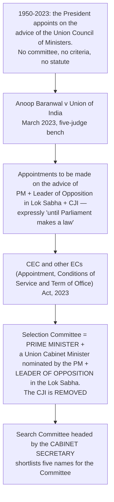

# Chapter 41 — Election Commission of India

[← Chapter 40](../Part_VI_Union_Territories_and_Special_Areas/40_Scheduled_and_Tribal_Areas.md) · [Part Index](00_INDEX.md) · [Master](../00_INDEX.md) · [Chapter 42 →](42_UPSC.md)

**Read time ~15 min** · **Article 324 (Part XV, Articles 324–329)** · 🔴 Prelims: **2017, 2023, 2025** · ⚠️ **Mains: 2017, 2018, 2022, 2024** — asked roughly every other year

> 📌 **The ECI is the most examined constitutional body in the book**, because it is the one institution that touches every citizen and is permanently in the news. ⭐ **The examiner's angle is almost never "describe the ECI" — it is "is the ECI still independent, and what would make it more so?"** Build the chapter around that.

---

## 🎯 The one-line point

> ⭐ **Article 324 gives one body the "superintendence, direction and control" of every election that fills a seat in Parliament, a state legislature, or the offices of President and Vice-President** — and gives it those words and almost nothing else. ⚠️ **The ECI's enormous power and its persistent vulnerability both come from the same source: a single, very short article.**

---

## PART A — What the ECI is

| Element | Detail |
|---|---|
| **Article** | ⭐ **324** |
| **Nature** | ⭐ **Independent, PERMANENT constitutional body** *(not a commission that is set up and wound down)* |
| ⭐ **Jurisdiction** | Elections to **Parliament**, **state legislatures**, and the offices of ⭐ **President and Vice-President** |
| ⚠️ **NOT its jurisdiction** | ⭐⭐ **Panchayat and municipal elections** — those belong to the **STATE ELECTION COMMISSION** under **Articles 243K and 243ZA** *(see [Ch 37](../Part_V_Local_Government/37_Panchayati_Raj.md))* |
| **Common to Union and states** | ⭐ **Yes** — one of the few bodies serving both levels, which is itself a **federal feature worth citing** |

> ⚠️ ⭐ **The State Election Commission confusion is a guaranteed Prelims trap.** The **SEC is appointed by the GOVERNOR**, is a **separate constitutional body**, and the **ECI has no control over it whatsoever.** ⭐ *[Prelims 2025 Q13](../../03_PYQ_Prelims/2025.md) turned on panchayat provisions; [2023 Q5](../../03_PYQ_Prelims/2023.md) and [2025 Q3](../../03_PYQ_Prelims/2025.md) both asked which bodies are constitutional.*

### ⭐ Composition

- ⭐ **The Chief Election Commissioner (CEC) plus such number of other Election Commissioners as the President may from time to time fix.**
- ⚠️ **The Constitution fixes NO number.** That is why the size has moved:

| Period | Size |
|---|---|
| **1950 – Oct 1989** | ⭐ **Single-member** — the CEC alone |
| **Oct 1989 – Jan 1990** | Three-member *(two ECs added)* |
| **Jan 1990 – Sept 1993** | ⚠️ **Back to single-member** |
| ⭐ **1 October 1993 → today** | ⭐ **Three-member — CEC + 2 ECs** |

- ⭐ **All three have EQUAL powers, and equal salary, allowances and perquisites.** ⚠️ **The CEC is not their superior** — he is *primus inter pares*, first among equals.
- ⭐ **Decisions are by MAJORITY** where the members differ.
- ⭐ **Regional Commissioners** may be appointed by the **President in consultation with the ECI** to assist it.

> ⭐ **Why the 1993 change matters:** the multi-member arrangement was challenged and upheld in ***T.N. Seshan v Union of India* (1995)**, where the Court held that ⚠️ **the CEC cannot be an "executive boss"** of the other Commissioners — the ECI is a **deliberative body**, not a one-man show. ⭐ **That single case explains why the ECI is three-member today.**

### ⭐⭐ Appointment — the biggest recent change in this chapter

> ⭐⭐ **This is the single most examinable development in the chapter.** ⚠️ **The 2023 Act replaced the CJI with a Union Cabinet Minister — so the executive holds 2 of the 3 seats on the Selection Committee.** ⭐ **The criticism writes itself: the Court's remedy for executive dominance was undone by statute, exactly as the Court's own order permitted** *("until Parliament makes a law")*.

### ⭐ Tenure, salary and removal

| Element | ⭐ **CEC** | ⭐ **Election Commissioners** |
|---|---|---|
| **Term** | ⭐ **6 years or until the age of 65, whichever is EARLIER** | ⭐ **Same** |
| **Salary and conditions** | ⭐ **Equal to a JUDGE OF THE SUPREME COURT**; ⚠️ **cannot be varied to his disadvantage after appointment** | Equal to the CEC |
| ⭐⭐ **Removal** | ⭐ **Same manner and same grounds as a JUDGE OF THE SUPREME COURT** — by the **President**, on an **address of both Houses** passed by the **special majority** of Article 368, on the ground of **proved misbehaviour or incapacity** | ⚠️ ⭐ **Removed by the PRESIDENT only on the RECOMMENDATION OF THE CEC** |
| **Reappointment** | ⚠️ Barred by the **2023 Act**; an EC promoted to CEC has a **combined tenure capped at 6 years** | Same |

> ⭐⭐ **The asymmetry in that removal row is the classic answer point.** ⚠️ **The CEC has judge-like security. The two ECs serve at the pleasure of the CEC's recommendation** — which means the two members who are supposed to *check* the CEC depend on him. ⭐ **In *T.N. Seshan* (1995) the Court read this as a safeguard for the ECI's independence rather than a defect** — the CEC's shield covers the institution — but every reform report since has flagged it.

---

## PART B — ⭐ What the ECI actually does

### The three baskets

| Basket | Functions |
|---|---|
| ⭐ **Administrative** | Prepare and periodically revise **electoral rolls**; ⭐ **notify the schedule of elections**; scrutinise nominations; ⭐ **grant recognition to political parties and allot ELECTION SYMBOLS**; appoint **observers**; ⭐ **register political parties under Section 29A of the RPA, 1951**; ⭐ **cancel or countermand a poll** where the process is vitiated |
| ⭐ **Advisory** | ⭐⭐ **Advise the PRESIDENT on the disqualification of a sitting MP (Article 103), and the GOVERNOR on a sitting MLA (Article 192)** — ⚠️ **and that opinion is BINDING**. Also advise the President on whether elections can be held in a state under President's rule beyond one year |
| ⭐ **Quasi-judicial** | ⭐ **Settle disputes on splits and mergers of recognised parties** *(under the **Election Symbols (Reservation and Allotment) Order, 1968**)*; decide **symbol** disputes; enforce the **Model Code of Conduct** |

### ⭐⭐ The two things the ECI CANNOT do

> ⚠️ ⭐ **1. It cannot DE-REGISTER a political party.** It registers parties under **Section 29A of the RPA, 1951**, but ***Indian National Congress v Institute of Social Welfare* (2002)** held it has **no corresponding power to de-register**, except in narrow cases such as registration obtained by fraud. ⭐ **The ECI has repeatedly asked Parliament for this power. It has not been given.**
>
> ⚠️ ⭐ **2. It cannot decide an election dispute after the result.** ⭐ **Article 329(b)** bars courts from interfering *during* an election, and channels every challenge afterwards into an ⭐ **ELECTION PETITION to the HIGH COURT** under the **RPA, 1951** *(see [Ch 71](../Part_IX_Other_Constitutional_Dimensions/71_Election_Laws.md))*.

### ⭐⭐ Article 324 as a "reservoir of power"

***Mohinder Singh Gill v Chief Election Commissioner* (1978)** — ⭐ **where the law is silent, Article 324 itself is a reservoir of power** enabling the ECI to act to ensure a free and fair election. ⚠️ **But that power is subject to natural justice and to the rule of law**, and cannot override an existing statute.

> ⭐ **This case is the constitutional basis for the Model Code of Conduct**, for countermanding polls, and for most of what the ECI does that no statute expressly authorises.

### ⭐ The Model Code of Conduct

| Element | Detail |
|---|---|
| **Origin** | ⭐ Began as a **voluntary code in KERALA, 1960**; evolved by consensus among parties and the ECI |
| ⚠️ **Legal status** | ⭐⭐ **NOT statutory.** It is enforced through **Article 324** and through moral and political pressure — ⚠️ *though many of its clauses mirror offences that ARE punishable under the IPC/BNS and the RPA* |
| ⭐ **Operative period** | ⭐ **From the date the ECI ANNOUNCES the schedule** until the **completion of the election process** — ⚠️ **not from the date of notification** |
| **Applies to** | Parties, candidates **and the party in government** — the last part is the important one |
| **The 2019 addition** | The ECI's ⭐ **"Model Code" enforcement now covers social media**, and the **48-hour silence period** applies to it |

> ⭐ ***Mains 2022 Q15* asked directly about the "evolution" of the MCC.** ⚠️ **The answer is the story of a voluntary state-level convention becoming a national instrument enforced under a constitutional article without ever becoming a law** — and the standing recommendation *(Law Commission's 255th Report)* that it be given **statutory backing**, which the **ECI itself opposes** on the ground that statutory status would move enforcement into the **courts** and destroy its speed.

---

## PART C — ⚠️ The independence debate

### ⭐ What protects the ECI

1. ⭐ **Security of tenure for the CEC** — removable only like a Supreme Court judge;
2. ⭐ **Service conditions cannot be varied to his disadvantage** after appointment;
3. ⭐ Staff are provided by the President **on the ECI's request**;
4. ⭐ **Article 324's own breadth**, as read in *Mohinder Singh Gill*.

### ⚠️ The three structural gaps — memorise these, they answer half the Mains questions

| # | The gap | The consequence |
|---|---|---|
| 1 | ⚠️ ⭐ **No qualifications are prescribed** for a CEC or EC | The appointee is invariably a **serving or retired civil servant**, chosen by the government |
| 2 | ⚠️ ⭐ **The two ECs lack the CEC's removal protection** | Their independence depends on the CEC's forbearance |
| 3 | ⚠️ ⭐ **No bar on post-retirement office** | A retiring Commissioner may accept a government appointment — the standard critique of every regulator's autonomy |

⭐ **Add a fourth, which is now the live one:** ⚠️ **the 2023 Act's Selection Committee gives the executive a built-in majority.**

### ⭐ The reform menu *(cite these by name)*

- ⭐ **Expenditure charged on the Consolidated Fund of India** — as for the CAG and the judiciary — so the ECI's budget is not voted;
- ⭐ **An independent secretariat** for the ECI, on the model of the Lok Sabha Secretariat;
- ⭐ **Equal removal protection for all three Commissioners** *(recommended by the **2nd ARC**, the **Law Commission's 255th Report** and the **Goswami Committee, 1990**)*;
- ⭐ **A broad-based collegium** including the **CJI or a judge of the Supreme Court** and the **Leader of the Opposition**;
- ⭐ **Power to de-register** parties, and **statutory backing for the MCC** *(contested, as above)*.

---

## 🧠 Memory hooks

### The article and the words
> ⭐ **Article 324 — "superintendence, direction and control."** ⚠️ **Parliament, state legislatures, President, Vice-President.** ⭐ **NOT panchayats and municipalities — that is the State Election Commission, Articles 243K and 243ZA.**

### The size story
> ⭐ **One → three (1989) → one (1990) → three (1 Oct 1993, permanently).** ⭐ ***T.N. Seshan* (1995)** — the CEC is **not the boss** of the other two.

### 6 and 65
> ⭐ **6 years or 65, whichever is earlier.** ⭐ **Salary of a Supreme Court judge.** ⭐ **CEC removed like a Supreme Court judge; the ECs only on the CEC's RECOMMENDATION.**

### The 2023 change
> ⭐ ***Anoop Baranwal* (2023)** said **PM + LoP + CJI**. ⚠️ ⭐ **The 2023 Act says PM + a Union Cabinet Minister + LoP — the CJI is out.** Search Committee under the **Cabinet Secretary**.

### The two "cannots"
> ⚠️ ⭐ **Cannot DE-REGISTER a party** *(INC v Institute of Social Welfare, 2002)*. ⚠️ ⭐ **Cannot decide a post-result dispute — that is an ELECTION PETITION to the HIGH COURT, Article 329(b).**

### The MCC
> ⭐ **Kerala, 1960 · not statutory · enforced under Article 324 · runs from the ANNOUNCEMENT of the schedule.**

---

## ❓ Expected Mains questions

**1. "Discuss the role of the Election Commission of India in the light of the evolution of the Model Code of Conduct." (250 words)**
> *Actually asked — [Mains 2022 Q15](../../04_PYQ_Mains/2022.md).*
> *Skeleton:* (i) **Constitutional base** — Article 324's three words, and ***Mohinder Singh Gill* (1978)** making it a **reservoir of power** where statute is silent. (ii) ⭐ **Evolution** — a voluntary code in **Kerala (1960)** → consensus among parties → ECI enforcement from **1991** onwards → extended to **social media (2019)**. (iii) **Content** — general conduct, meetings, processions, polling day, the **party in power**, and the **48-hour silence period**. (iv) ⭐ **Nature** — non-statutory, enforced by **speed and publicity** rather than penalty; overlapping clauses *are* punishable under the RPA and penal law. (v) ⚠️ **The debate** — the **Law Commission's 255th Report** urged statutory status; ⭐ **the ECI resists it**, because litigation would destroy the code's only real advantage, which is that it operates **within hours**. (vi) **Conclude:** the MCC shows the ECI at its most effective precisely where it has the least formal power — and that is also its fragility.

**2. "In the light of recent controversy regarding the use of Electronic Voting Machines (EVM), what are the challenges before the Election Commission of India to ensure the trustworthiness of elections in India?" (250 words)**
> *Actually asked — [Mains 2018 Q1](../../04_PYQ_Mains/2018.md).*
> *Skeleton:* **The EVM issue** — standalone, non-networked machines; one-time programmable chips; **VVPAT** introduced from 2013 and universal from 2019; mandatory counting of VVPAT slips in **5 randomly selected booths per assembly segment**, upheld by the Supreme Court in **2024**. ⭐ **But trustworthiness is wider than the machine** — (a) **perception and transparency**, addressed by demonstrations, mock polls and party representatives at every stage; (b) ⭐ **electoral roll integrity** — duplication, deletion and the linkage debate; (c) **money power** and unaccounted expenditure; (d) **misinformation and paid news**; (e) ⚠️ **the ECI's own perceived neutrality**, sharpened by the **2023 appointment law**. **Conclude:** the technology question is largely settled by VVPAT and judicial scrutiny; ⭐ **the remaining challenge is institutional credibility, which is a matter of appointments and enforcement, not machines.**

**3. "To enhance the quality of democracy in India the Election Commission of India has proposed electoral reforms in 2016. What are the suggested reforms and how far are they significant?" (250 words)**
> *Actually asked — [Mains 2017 Q14](../../04_PYQ_Mains/2017.md). Full treatment in [Ch 72](../Part_IX_Other_Constitutional_Dimensions/72_Electoral_Reforms.md).*
> *Skeleton:* ECI's proposals — ⭐ **statutory backing for the MCC**; **power to de-register** parties; **ban on paid news** as an electoral offence; ⭐ **disqualification on framing of charges** for serious offences; **restrictions on anonymous donations** and on **government advertising** before polls; **totaliser machines** to mask booth-wise voting; **two-year cap** on the gap between an offence and disqualification. **Significance** — each attacks a different failure *(criminalisation, money, incumbency advantage, party opacity)*. ⚠️ **Limitation** — almost all require **legislation Parliament has not passed**, which is itself the finding worth making.

**4. "The independence of the Election Commission of India rests on convention more than on constitutional design." Critically examine. (250 words)**
> *Skeleton:* **The design that exists** — Article 324; **CEC's judge-like removal**; unalterable service conditions. ⚠️ **The design that is missing** — **no prescribed qualifications**; **no protection for the two ECs**; **no bar on post-retirement office**; **a voted, not charged, budget**; **no independent secretariat**; and now ⭐ **an executive-majority Selection Committee under the 2023 Act**. **The convention that fills the gap** — the Seshan era; the ECI's own practice of announcing schedules independently; the MCC's moral authority. ⭐ **Conclude:** an institution whose independence depends on the character of its occupants is **strong but not secure** — and the remedy is the standard reform list.

---

## ⚡ 60-second revision

- ⭐ **Article 324**, Part XV *(Articles 324–329)*. ⭐ **Independent, permanent, constitutional; common to the Union and the states.** ⚠️ ⭐ **NOT local body elections — that is the SEC under Articles 243K/243ZA, appointed by the GOVERNOR.**
- ⭐ **CEC + 2 ECs since 1 October 1993**; the number is **fixed by the President, not by the Constitution**; ⭐ **equal powers, majority decisions**; ⭐ ***T.N. Seshan* (1995)** — the CEC is **not** an executive boss. **Regional Commissioners**: President **in consultation with the ECI**.
- ⭐ **Tenure 6 years or 65, whichever earlier.** ⭐ **Salary and conditions of a Supreme Court judge; not variable to disadvantage.**
- ⭐⭐ **CEC removed like a Supreme Court judge** *(address of both Houses, special majority, proved misbehaviour or incapacity)*; ⚠️ **ECs removed by the President only on the CEC's RECOMMENDATION**.
- ⭐⭐ **Appointment: *Anoop Baranwal* (2023) → PM + LoP + CJI; the 2023 Act → PM + a Union Cabinet Minister + LoP.** ⚠️ **CJI dropped.** Search Committee under the **Cabinet Secretary**; **no reappointment**.
- ⭐ **Functions:** electoral rolls · schedule · nomination scrutiny · ⭐ **recognition of parties and allotment of SYMBOLS (1968 Order)** · registration under **s.29A RPA 1951** · observers · countermanding polls · ⭐ **BINDING advice to the President/Governor on disqualification of sitting members (Articles 103 and 192)** · the **MCC**.
- ⚠️ ⭐ **Cannot de-register a party** *(INC v Institute of Social Welfare, 2002)*; ⚠️ ⭐ **cannot decide post-result disputes — Article 329(b) → ELECTION PETITION to the HIGH COURT.**
- ⭐ ***Mohinder Singh Gill* (1978)** — **Article 324 is a reservoir of power** where law is silent.
- ⭐ **MCC — Kerala 1960 · non-statutory · from the ANNOUNCEMENT of the schedule · binds the ruling party too.**
- ⚠️ **Three structural gaps:** **no qualifications · no protection for the ECs · no post-retirement bar** — plus the **2023 Selection Committee**. ⭐ **Reforms: charge the expenditure on the Consolidated Fund · independent secretariat · equal removal protection for all three · a broader collegium · power to de-register.**

---

## 🔗 Practice this chapter

**Prelims:** [2017 Q17](../../03_PYQ_Prelims/2017.md) — Election Commission · [2023 Q5](../../03_PYQ_Prelims/2023.md) — which bodies are constitutional · [2025 Q3](../../03_PYQ_Prelims/2025.md) — which bodies are constitutional

**Mains:** [2000 Q8(a)](../../04_PYQ_Mains/2000.md) — necessary electoral reforms · [2017 Q14](../../04_PYQ_Mains/2017.md) — the ECI's 2016 reform proposals · [2018 Q1](../../04_PYQ_Mains/2018.md) — EVMs and trustworthiness · [2022 Q15](../../04_PYQ_Mains/2022.md) — the ECI and the MCC · [2024 Q1](../../04_PYQ_Mains/2024.md) — electoral reforms and "one nation, one election"

**Cross-links:** [Ch 70 Elections](../Part_IX_Other_Constitutional_Dimensions/70_Elections.md) — the machinery in detail · [Ch 71 Election Laws](../Part_IX_Other_Constitutional_Dimensions/71_Election_Laws.md) — the RPA and election petitions · [Ch 72 Electoral Reforms](../Part_IX_Other_Constitutional_Dimensions/72_Electoral_Reforms.md) — the full reform agenda · [Ch 37 Panchayati Raj](../Part_V_Local_Government/37_Panchayati_Raj.md) — the State Election Commission · [Ch 22 Parliament](../Part_III_Central_Government/22_Parliament.md) — Article 103 disqualification

**Next:** [Chapter 42 — Union Public Service Commission](42_UPSC.md).

---

[← Chapter 40](../Part_VI_Union_Territories_and_Special_Areas/40_Scheduled_and_Tribal_Areas.md) · [Part Index](00_INDEX.md) · [Master](../00_INDEX.md) · [Chapter 42 →](42_UPSC.md)
