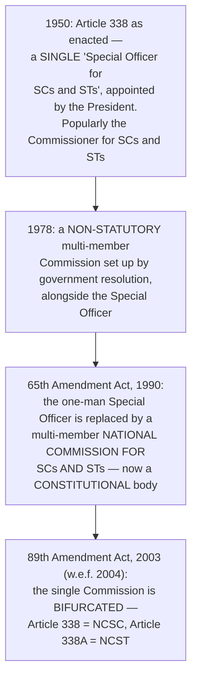

# Chapter 46 — National Commission for Scheduled Castes

[← Chapter 45](45_GST_Council.md) · [Part Index](00_INDEX.md) · [Master](../00_INDEX.md) · [Chapter 47 →](47_National_Commission_STs.md)

**Read time ~9 min** · **Article 338** · 🟠 Prelims: in the constitutional-vs-statutory format · Mains: **2018**

> 📌 **Chapters 46, 47 and 48 are ONE chapter split into three.** ⭐ **Read this one properly; then read the next two only for their differences.** ⚠️ **The examiner tests exactly two things across all three: (a) which amendment made each one constitutional, and (b) that their recommendations are not binding.**

---

## 🎯 The one-line point

> ⭐ **The Constitution promised safeguards to Scheduled Castes in a dozen scattered articles and left no one in charge of checking whether they worked.** ⭐⭐ **Article 338 fills that gap — a permanent constitutional watchdog with the powers of a civil court and the authority of a recommendation.** ⚠️ **Note the asymmetry: court-like powers of inquiry, no power at all to enforce the outcome.**

---

## PART A — ⭐⭐ The evolution — four steps, and each one is a Prelims fact

> ⭐⭐ **The two amendment numbers are the whole of Part A: 65th (1990) made it constitutional and multi-member; 89th (2003) split it in two.** ⚠️ **A very common error is to credit the 89th with creating a constitutional body — it did not; it divided one that was already constitutional.**

⭐ **Whom the NCSC covers today:** ⭐ **Scheduled Castes** and ⭐ **the Anglo-Indian community**. ⚠️ **Other Backward Classes were within its remit until the 102nd Amendment, 2018 created a separate NCBC under Article 338B** *(see [Ch 48](48_National_Commission_BCs.md))*.

---

## PART B — Composition and powers

| Element | Detail |
|---|---|
| ⭐ **Composition** | ⭐⭐ **Chairperson, Vice-Chairperson and THREE other members — five in all** |
| **Appointment** | ⭐ By the **PRESIDENT**, by warrant under his hand and seal |
| ⭐ **Conditions and tenure** | ⚠️ **Not in the Constitution — determined by the PRESIDENT.** In practice a ⭐ **three-year term**, with no member serving **more than two terms**; ⭐ **at least one member is to be a woman** |
| ⭐⭐ **Powers** | ⭐ **The powers of a CIVIL COURT trying a suit** while investigating or inquiring into a complaint |

⭐ **Its civil-court powers, in the standard five:**
> ⭐ **summoning and enforcing attendance and examining on oath** · **requiring discovery and production of documents** · **receiving evidence on affidavits** · **requisitioning any public record from any court or office** · **issuing commissions for the examination of witnesses and documents**.

### ⭐ Functions — Article 338(5)

1. ⭐ **Investigate and monitor** all matters relating to the **constitutional and other legal safeguards** for SCs, and evaluate their working;
2. ⭐ **Inquire into specific complaints** of deprivation of rights and safeguards;
3. ⭐ **Participate and advise** on the **planning process** of socio-economic development, and evaluate progress under the Union and the states;
4. ⭐ **Report to the President annually**, and at such other times as it thinks fit;
5. ⭐ **Recommend measures** the Union or a state should take for effective implementation of safeguards and for the protection, welfare and socio-economic development of SCs;
6. Discharge such other functions as the President may, subject to any law of Parliament, specify.

### ⭐⭐ The reporting chain — and the sentence that decides the "is it binding?" question

- ⭐ The **President lays the Commission's reports before EACH HOUSE of Parliament**, together with ⭐⭐ **a MEMORANDUM explaining the action taken on the recommendations, AND the REASONS FOR NON-ACCEPTANCE of any of them**;
- ⭐ Where a report concerns a **state**, a copy goes to the **GOVERNOR**, who lays it before the **state legislature** with the same memorandum.

> ⚠️ ⭐⭐ **"Reasons for non-acceptance" is the giveaway: the recommendations are NOT binding.** ⭐ **This is exactly the pattern you saw with the UPSC's Article 323 memorandum ([Ch 42](42_UPSC.md))** — ⭐ **the Constitution's standard technique for a body it wants respected but not obeyed.**

### ⭐ The consultation duty

⭐ **The Union and every state government SHALL CONSULT the Commission on all MAJOR POLICY MATTERS affecting Scheduled Castes.** ⚠️ **This is mandatory in form — but there is no sanction for failing to do it.**

---

## PART C — ⚠️ What the NCSC can and cannot reach

### ⭐ The 2018 question — reservation in religious minority institutions

⭐ **The problem [Mains 2018 Q2](../../04_PYQ_Mains/2018.md) posed:** can the NCSC *enforce* constitutional reservation for SCs inside **religious minority institutions**?

| The constitutional obstacles | |
|---|---|
| ⭐ **Article 30(1)** | ⭐ **Minorities have the right to ESTABLISH AND ADMINISTER educational institutions of their choice** — and ⭐ ***T.M.A. Pai* (2002)** and ***Inamdar* (2005)** protect their **admission autonomy** |
| ⭐ **Article 15(5)** | ⚠️ ⭐ **Expressly EXCLUDES minority educational institutions** from the reservation mandate for private institutions — and that exclusion was **upheld in *Pramati Educational Trust* (2014)** |
| ⭐ **The Presidential Order of 1950 (para 3)** | ⚠️ ⭐ **A person professing a religion different from Hinduism, Sikhism or Buddhism shall NOT be deemed a member of a Scheduled Caste** — so a **Christian or Muslim Dalit is not legally an SC at all** |
| ⭐ **The NCSC's own powers** | ⚠️ **Investigate, inquire, monitor and RECOMMEND — it cannot issue a binding direction or impose a penalty** |

> ⭐ **The answer the question wanted:** ⚠️ **the NCSC can INVESTIGATE and REPORT, but it cannot ENFORCE — and in this particular field it has little to enforce, because Articles 30(1) and 15(5) place minority institutions outside the reservation obligation.** ⭐ **Its realistic instruments are its annual report, its recommendation to the government, and the publicity that follows** — plus, on the underlying question of **Dalit Christians and Muslims**, ⭐ **a recommendation to amend the 1950 Presidential Order**, which is a matter for the executive and Parliament, not the Commission.

### ⚠️ The standing criticisms *(applies equally to Chapters 47 and 48)*

1. ⚠️ ⭐ **Recommendations are not binding**, and the action-taken memorandum is often perfunctory;
2. ⚠️ ⭐ **Chronic vacancies** — Commissions have functioned for long stretches without a Chairperson or a full bench;
3. ⚠️ **Dependence on the parent ministry** for staff and budget — ⚠️ **expenditure is NOT charged on the Consolidated Fund**, unlike the UPSC and the CAG;
4. ⚠️ **Overlapping jurisdiction** with the **NHRC**, the **NCW**, the **NCPCR** and each other — ⭐ **the express subject of [Mains 2018 Q16](../../04_PYQ_Mains/2018.md)**, which asked whether all of them should be merged into a single umbrella Human Rights Commission;
5. ⚠️ **Reactive, complaint-driven working** rather than systemic monitoring.

---

## 🧠 Memory hooks

### The two amendments
> ⭐⭐ **65th (1990) — one-man Special Officer becomes a multi-member CONSTITUTIONAL Commission.** ⭐⭐ **89th (2003) — split into NCSC (338) and NCST (338A).** ⭐ **102nd (2018) — OBCs leave, to the new NCBC (338B).**

### The shape
> ⭐ **5 members — Chairperson + Vice-Chairperson + 3.** ⭐ **Appointed by the President; 3-year term; at least one woman.** ⭐ **Powers of a CIVIL COURT.**

### Who is covered
> ⭐ **Scheduled Castes + the ANGLO-INDIAN community.** ⚠️ **Not OBCs — not since 2018.**

### The binding question
> ⚠️ ⭐ **Report → President → both Houses → memorandum stating the ACTION TAKEN and the REASONS FOR NON-ACCEPTANCE.** ⭐ **Therefore: not binding.** *(State reports go to the Governor → state legislature.)*

---

## ❓ Expected Mains questions

**1. "Whether the National Commission for Scheduled Castes (NCSC) can enforce the implementation of constitutional reservation for the Scheduled Castes in the religious minority institutions? Examine." (250 words)**
> *Actually asked — [Mains 2018 Q2](../../04_PYQ_Mains/2018.md).*
> *Skeleton:* (i) **The NCSC's powers** — Article 338(5): investigate, monitor, inquire, advise, report, recommend; ⭐ **civil-court powers of inquiry**; ⚠️ **no binding force, only an action-taken memorandum**. (ii) ⭐ **The constitutional barrier** — **Article 30(1)** minority autonomy; **Article 15(5)** expressly **excludes minority institutions**, upheld in ***Pramati* (2014)**; ***T.M.A. Pai*** and ***Inamdar*** on admission autonomy. (iii) ⚠️ ⭐ **The definitional barrier** — the **1950 Presidential Order** limits SC status to **Hindus, Sikhs and Buddhists**, so Christian and Muslim Dalits are outside the category the reservation would apply to. (iv) **Answer:** ⭐ **the NCSC cannot enforce; it can investigate, report and recommend.** (v) ⭐ **Way forward** — recommend a **review of the 1950 Order** *(the Ranganath Misra Commission recommended de-linking SC status from religion; a Commission of Inquiry has since been examining it)*, use the **annual report and parliamentary scrutiny**, and press for **transparency in minority-institution admissions** without disturbing Article 30.

**2. "Multiplicity of various commissions for the vulnerable sections of society leads to problems of overlapping jurisdiction and duplication of functions. Is it better to merge all commissions into an umbrella Human Rights Commission?" (250 words)**
> *Actually asked — [Mains 2018 Q16](../../04_PYQ_Mains/2018.md); it spans Chapters 46, 47, 48 and [54](../Part_VIII_Non_Constitutional_Bodies/54_NHRC.md).*
> *Skeleton:* **The map** — ⭐ **constitutional**: NCSC (338), NCST (338A), NCBC (338B); ⭐ **statutory**: NHRC, NCW, NCPCR, NCM, the Chief Commissioner for Persons with Disabilities. **The case FOR merging** — one complainant, one door; ends **forum shopping** and contradictory findings; pools scarce investigative capacity; ends duplicated secretariats; the **Paris Principles** favour a strong single national human-rights institution. ⚠️ **The case AGAINST** — ⭐ **three of them are CONSTITUTIONAL bodies and cannot be merged without amending Articles 338, 338A and 338B**; specialised expertise *(atrocities law, PESA and forest rights, child protection)* would be diluted; ⭐ **the political salience of a dedicated commission is itself a safeguard**, hard-won by each group; and the NHRC is already over-burdened with vacancies and pendency. ⭐ **The workable middle** — retain the bodies, but create a **common complaints portal**, a **statutory coordination mechanism** chaired by the NHRC, **shared investigative machinery**, and a **single annual report to Parliament**. **Conclude:** the problem is **coordination, not multiplicity.**

---

## ⚡ 60-second revision

- ⭐ **Article 338.** ⭐⭐ **65th Amendment (1990)** — from a **one-man Special Officer** to a **multi-member constitutional Commission**. ⭐⭐ **89th Amendment (2003, w.e.f. 2004)** — **bifurcated** into **NCSC (338)** and **NCST (338A)**.
- ⭐ **Covers Scheduled Castes and the ANGLO-INDIAN community.** ⚠️ **OBCs moved to the NCBC (Article 338B) by the 102nd Amendment, 2018.**
- ⭐ **Chairperson + Vice-Chairperson + 3 members**, appointed by the **President**; ⚠️ **tenure and conditions fixed by the President, not the Constitution** *(3 years in practice; at least one woman)*.
- ⭐⭐ **Powers of a CIVIL COURT** — summons and oath · discovery and production of documents · evidence on affidavits · requisition of public records · commissions for examining witnesses.
- ⭐ **Functions:** investigate and monitor safeguards · inquire into complaints · advise on the **planning process** · **annual report to the President** · recommend measures.
- ⭐⭐ **The President lays reports before both Houses with a memorandum stating the ACTION TAKEN and the REASONS FOR NON-ACCEPTANCE** ⇒ ⚠️ **recommendations are NOT binding**. State-specific reports → **Governor → state legislature**.
- ⭐ **The Union and every state SHALL CONSULT the Commission on all major policy matters affecting SCs.**
- ⚠️ **Criticisms:** non-binding · vacancies · **expenditure not charged** on the Consolidated Fund · overlapping jurisdiction with NHRC/NCW/NCPCR · complaint-driven rather than systemic.

---

## 🔗 Practice this chapter

**Prelims:** [2020 Q3](../../03_PYQ_Prelims/2020.md) — untouchability · [2023 Q5](../../03_PYQ_Prelims/2023.md) — which bodies are constitutional · [2023 Q9](../../03_PYQ_Prelims/2023.md) — Article 16(4) and Article 335 · [2025 Q3](../../03_PYQ_Prelims/2025.md) — constitutional bodies · [2026 Q3](../../03_PYQ_Prelims/2026.md) — Scheduled Castes and Scheduled Tribes

**Mains:** [2018 Q2](../../04_PYQ_Mains/2018.md) — NCSC and religious minority institutions · [2018 Q16](../../04_PYQ_Mains/2018.md) — merging the vulnerable-sections commissions

**Cross-links:** [Ch 7 Fundamental Rights](../Part_I_Constitutional_Framework/07_Fundamental_Rights.md) — Articles 15, 16, 17, 30 · [Ch 67 Special Provisions Relating to Certain Classes](../Part_IX_Other_Constitutional_Dimensions/67_Special_Provisions_Certain_Classes.md) — Articles 330–342 · [Ch 54 NHRC](../Part_VIII_Non_Constitutional_Bodies/54_NHRC.md) — the overlapping statutory body · [Ch 23 Parliamentary Committees](../Part_III_Central_Government/23_Parliamentary_Committees.md) — the **Committee on the Welfare of SCs and STs**, a different animal entirely *(asked in [Prelims 2026 Q5](../../03_PYQ_Prelims/2026.md))*

**Next:** [Chapter 47 — National Commission for Scheduled Tribes](47_National_Commission_STs.md) — read it as differences from this chapter.

---

[← Chapter 45](45_GST_Council.md) · [Part Index](00_INDEX.md) · [Master](../00_INDEX.md) · [Chapter 47 →](47_National_Commission_STs.md)
