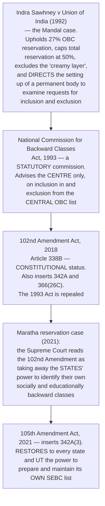

# Chapter 48 — National Commission for Backward Classes

[← Chapter 47](47_National_Commission_STs.md) · [Part Index](00_INDEX.md) · [Master](../00_INDEX.md) · [Chapter 49 →](49_Linguistic_Minorities.md)

**Read time ~8 min** · **Article 338B (102nd Amendment Act, 2018)** · 🟠 ⚠️ **Prelims: 2023 — asked directly on its constitutional status** · **Mains: 2022 — asked directly on its transformation**

> 📌 **Of the three commissions, this is the one that gets asked.** ⭐ **Because it is the only body in the Constitution that was STATUTORY first and CONSTITUTIONAL second — and because Parliament had to amend the Constitution TWICE in three years to get it right.** ⚠️ **Learn the 102nd and the 105th as a pair; the second exists only to repair the first.**

---

## 🎯 The one-line point

> ⭐ **The NCBC's history is the history of OBC reservation itself** — a court judgment created it, a statute gave it life, a constitutional amendment elevated it, ⚠️ **and that amendment accidentally stripped the states of a power they had exercised since 1950, which a second amendment had to hand back.**

---

## PART A — ⭐⭐ The four-step history

> ⭐⭐ **The examinable core in one line:** ⭐ **102nd (2018) made it constitutional; 105th (2021) gave the states their lists back.** ⚠️ **A Prelims trap in waiting: after 2021 there are TWO lists — a CENTRAL list, for which the NCBC and Parliament are responsible, and a STATE list, which each state maintains for itself.**

### ⭐ The three articles the 102nd Amendment inserted

| Article | What it says |
|---|---|
| ⭐ **338B** | ⭐ **Creates the National Commission for Backward Classes** as a constitutional body |
| ⭐⭐ **342A** | ⭐ **The PRESIDENT, in consultation with the Governor, specifies the socially and educationally backward classes for a state or UT; thereafter only PARLIAMENT may include or exclude a class from the CENTRAL list.** ⭐ **342A(3), added by the 105th Amendment, preserves each state's power to maintain its OWN list** |
| ⭐ **366(26C)** | Defines ⭐ **"socially and educationally backward classes"** as those so deemed under **Article 342A** |

> ⭐ **Note the symmetry, and use it as a memory device:** ⭐ **341 → SCs · 342 → STs · 342A → SEBCs**, and ⭐ **338 → NCSC · 338A → NCST · 338B → NCBC.** ⚠️ **The Constitution built the OBC machinery as a deliberate mirror of the SC/ST machinery — 26 years later.**

---

## PART B — Composition, powers and functions

**Structurally identical to the NCSC and NCST:**

| Element | Detail |
|---|---|
| ⭐ **Composition** | ⭐ **Chairperson, Vice-Chairperson and THREE other members** |
| **Appointment** | ⭐ By the **PRESIDENT**, by warrant under his hand and seal |
| **Tenure and conditions** | ⚠️ Determined by the **President** — **3 years**, not more than two terms |
| ⭐ **Powers** | ⭐ **The powers of a CIVIL COURT** trying a suit, when investigating or inquiring |
| ⭐ **Reporting** | ⭐ **Annual report to the President → laid before both Houses with a memorandum on ACTION TAKEN and REASONS FOR NON-ACCEPTANCE**; state reports → **Governor → state legislature** |
| ⭐ **Consultation** | ⭐ **The Union and every state SHALL consult the Commission on all major policy matters affecting socially and educationally backward classes** |

### ⭐⭐ What actually changed when it became constitutional

| | ⭐ **Statutory NCBC (1993–2018)** | ⭐ **Constitutional NCBC (2018–)** |
|---|---|---|
| **Source of authority** | An **Act of Parliament** — amendable or repealable by **simple majority** | ⭐ **Article 338B** — alterable only by **constitutional amendment** |
| ⭐⭐ **Mandate** | ⚠️ ⭐ **ONLY advice on INCLUSION IN and EXCLUSION FROM the central OBC list** | ⭐ **The full 338B mandate — investigate and monitor ALL constitutional and legal SAFEGUARDS, inquire into specific complaints, advise on socio-economic development and evaluate it, and report** |
| ⭐ **Grievance jurisdiction** | ⚠️ **None** — an OBC complainant had to go to the **NCSC**, which then held OBCs in its remit under Article 338(10) | ⭐ **Its own, with civil-court powers** |
| **Reporting** | To the **central government** | ⭐ **To the PRESIDENT, and thence to PARLIAMENT** |
| **Advice on inclusion** | ⭐ **Binding in practice under the 1993 Act** *(ordinarily binding on the government)* | ⚠️ ⭐ **Inclusion or exclusion is now done by PARLIAMENT under Article 342A** — the Commission advises |

> ⭐⭐ **The one-sentence answer to [Mains 2022 Q5](../../04_PYQ_Mains/2022.md):** ⚠️ **the NCBC changed from a LIST-KEEPING body into a RIGHTS-MONITORING body.** ⭐ **It gained a grievance jurisdiction, civil-court powers, a direct line to Parliament and permanence — and it lost the one power that was effectively binding, because the list now moves through Parliament.**
>
> ⭐ **That trade-off — more status, less operational bite — is the sophisticated point most answers miss.**

---

## PART C — ⚠️ The live issues

1. ⭐⭐ **Two lists, two authorities.** After the **105th Amendment**, the **central list** is amended by **Parliament** on the NCBC's advice, while **each state** maintains its own **SEBC list** through its own state commission. ⚠️ **A community may be OBC in a state and not in the central list — a genuinely confusing situation the exam likes.**
2. ⭐ **The 50% ceiling.** ***Indra Sawhney* (1992)** capped total reservation at **50%**, subject to extraordinary circumstances. ⚠️ **The Maratha judgment (2021) refused to revisit the cap; the EWS judgment (2022) upheld 10% EWS reservation on the reasoning that the cap applies to the caste-based reservations under Articles 15(4)/16(4), and EWS stands on the separate Articles 15(6)/16(6) inserted by the 103rd Amendment.**
3. ⭐ **Sub-categorisation of OBCs.** The **Rohini Commission**, appointed in **2017** under **Article 340**, examined the uneven distribution of the 27% quota among OBC communities and submitted its report; ⚠️ **implementation is pending.**
4. ⭐ **The creamy layer.** Defined by income and status criteria and revised periodically; ⚠️ **the Supreme Court has held the principle applies to promotions in the SC/ST context too (*Jarnail Singh*, 2018), which is a separate line of cases.**
5. ⭐ **Caste data.** ⚠️ **The absence of reliable caste enumeration since 1931 is the recurring evidentiary problem behind every OBC dispute** — the SECC 2011 caste data was never released in usable form, and a caste census has been announced for the next decennial exercise.

⭐ **Article 340 — the mother article.** ⭐ **The President may appoint a Commission to investigate the conditions of socially and educationally backward classes.** ⚠️ **This is the article under which the KALELKAR Commission (1953) and the MANDAL Commission (1979) were appointed — and, more recently, the Rohini Commission.** ⭐ **Do not confuse Article 340 (an ad hoc investigating Commission) with Article 338B (the permanent NCBC).**

---

## 🧠 Memory hooks

### The two amendments
> ⭐⭐ **102nd (2018) — constitutional status, Articles 338B + 342A + 366(26C).** ⭐⭐ **105th (2021) — Article 342A(3), the states get their own SEBC lists back** *(after the Maratha judgment)*.

### The mirror
> ⭐ **338 / 338A / 338B → NCSC / NCST / NCBC.** ⭐ **341 / 342 / 342A → SC list / ST list / SEBC list.**

### 340 vs 338B
> ⭐ **Article 340 = an AD HOC Commission the President may appoint** *(Kalelkar 1953, Mandal 1979, Rohini 2017)*. ⭐ **Article 338B = the PERMANENT NCBC.**

### What it gained and lost in 2018
> ⭐ **Gained: grievance jurisdiction, civil-court powers, safeguards monitoring, reports to Parliament, permanence.** ⚠️ ⭐ **Lost: the effectively binding power over the list, which moved to Parliament under Article 342A.**

### The cases
> ⭐ ***Indra Sawhney* (1992)** — 27%, **50% cap**, **creamy layer**, ⭐ **and the direction to create a permanent body** *(which is why the 1993 Act exists)*.

---

## ❓ Expected Mains questions

**1. "Discuss the role of the National Commission for Backward Classes in the wake of its transformation from a statutory body to a constitutional body." (250 words)**
> *Actually asked — [Mains 2022 Q5](../../04_PYQ_Mains/2022.md).*
> *Skeleton:* (i) **The transformation** — the **1993 Act** *(a consequence of ***Indra Sawhney***)* → the ⭐ **102nd Amendment, 2018**, inserting **338B, 342A and 366(26C)** and repealing the Act. (ii) ⭐ **What the role became** — from **advising on inclusion in the central list alone** to **investigating and monitoring all constitutional and legal safeguards**, **inquiring into specific complaints with civil-court powers**, **advising on and evaluating socio-economic development**, and **reporting to the President for Parliament**; ⭐ **mandatory consultation by the Union and the states on major policy**. (iii) ⚠️ ⭐ **What it lost** — the list power moved to **Parliament** under Article 342A, so its advice on inclusion is no longer effectively binding. (iv) ⭐ **The 105th Amendment, 2021** — after the Maratha judgment, the states recovered their own SEBC lists, so the NCBC's list role is now confined to the **central** list. (v) ⚠️ **Continuing limits** — non-binding recommendations, vacancies, no charged expenditure, the **absence of caste data**, and the **pending Rohini Commission report** on sub-categorisation. **Conclude:** constitutional status gave the NCBC **permanence and parity with the NCSC and NCST**; ⭐ **effectiveness now depends on data and on the government's willingness to act on its reports.**

**2. "The 102nd Amendment solved one problem and created another." Examine with reference to federalism and reservation policy. (250 words)**
> *Skeleton:* **The problem solved** — parity for OBCs with SCs and STs; a permanent constitutional monitor; a grievance forum. ⚠️ **The problem created** — Article **342A** as originally worded was read in the **Maratha reservation case (2021)** to mean that ⭐ **only the President and Parliament could identify SEBCs, displacing a state power exercised since 1950** and rendering **state OBC commissions and state lists doubtful**. **The federal stakes** — reservation is administered largely through **state services and state educational institutions**, so a central monopoly over identification would have been unworkable. ⭐ **The repair** — the **105th Amendment, 2021** inserted **342A(3)**, expressly preserving state lists. **Conclude:** a drafting choice in a welfare amendment produced a **federal crisis within three years** — ⭐ **a good illustration that constitutional amendments must be tested against the federal structure, not only against the policy goal.**

---

## ⚡ 60-second revision

- ⭐ ***Indra Sawhney* (1992)** → ⭐ **NCBC Act, 1993** *(statutory, central list only)* → ⭐⭐ **102nd Amendment Act, 2018 → Article 338B** *(constitutional)*, with **342A** and **366(26C)** → ⚠️ **Maratha judgment (2021)** → ⭐⭐ **105th Amendment Act, 2021 → Article 342A(3)**, restoring **state SEBC lists**.
- ⭐ **Chairperson + Vice-Chairperson + 3 members**, appointed by the **President**; **3-year** term; ⭐ **powers of a CIVIL COURT**; ⭐ **annual report → President → both Houses with an action-taken memorandum**; ⭐ **mandatory consultation on major policy**.
- ⭐⭐ **Gained in 2018:** safeguards monitoring, complaint inquiry, development evaluation, reports to Parliament, permanence. ⚠️ ⭐ **Lost:** the effectively binding list power, now with **Parliament under Article 342A**.
- ⭐ **Two lists after 2021 — a CENTRAL list (Parliament, on NCBC advice) and a STATE list (each state).**
- ⭐ **Article 340 — ad hoc Commissions: KALELKAR (1953), MANDAL (1979), ROHINI (2017, on sub-categorisation; report submitted, implementation pending).** ⚠️ **Not to be confused with Article 338B.**
- ⭐ **The 50% ceiling** *(Indra Sawhney)*; ⭐ **EWS 10% upheld in 2022 on Articles 15(6)/16(6) inserted by the 103rd Amendment**; ⭐ **creamy layer**; ⚠️ **no reliable caste data since 1931.**

---

## 🔗 Practice this chapter

**Prelims:** [2023 Q5](../../03_PYQ_Prelims/2023.md) — which bodies are constitutional *(the NCBC is the point of the question)* · [2023 Q9](../../03_PYQ_Prelims/2023.md) — Article 16(4) and Article 335 · [2025 Q3](../../03_PYQ_Prelims/2025.md) — constitutional bodies

**Mains:** [2022 Q5](../../04_PYQ_Mains/2022.md) — the NCBC's transformation from statutory to constitutional · [2018 Q16](../../04_PYQ_Mains/2018.md) — merging the vulnerable-sections commissions

**Cross-links:** [Ch 7 Fundamental Rights](../Part_I_Constitutional_Framework/07_Fundamental_Rights.md) — Articles 15(4), 15(5), 15(6), 16(4), 16(6) · [Ch 67 Special Provisions Relating to Certain Classes](../Part_IX_Other_Constitutional_Dimensions/67_Special_Provisions_Certain_Classes.md) — Articles 330–342A in one place · [Ch 46 NCSC](46_National_Commission_SCs.md) — the structural template

**Next:** [Chapter 49 — Special Officer for Linguistic Minorities](49_Linguistic_Minorities.md) — the shortest chapter in the book.

---

[← Chapter 47](47_National_Commission_STs.md) · [Part Index](00_INDEX.md) · [Master](../00_INDEX.md) · [Chapter 49 →](49_Linguistic_Minorities.md)
