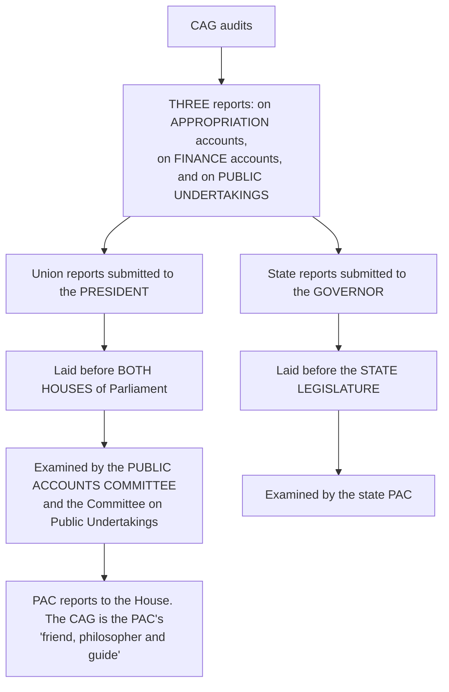

# Chapter 50 — Comptroller and Auditor General of India

[← Chapter 49](49_Linguistic_Minorities.md) · [Part Index](00_INDEX.md) · [Master](../00_INDEX.md) · [Chapter 51 →](51_Attorney_General.md)

**Read time ~15 min** · **Articles 148–151** · 🔴 Prelims: recurring · ⚠️ **Mains: 2016, 2018, 2024** — the most frequently asked constitutional body after the ECI

> 📌 ⭐ **Ambedkar called the CAG "the most important officer under the Constitution of India" — more important, he said, than even the judiciary.** ⚠️ **And yet the "Comptroller" in his title is a misnomer, and everything he produces is a report nobody is bound to act on.** ⭐ **That gap between constitutional stature and practical power IS this chapter.**

---

## 🎯 The one-line point

> ⭐⭐ **Parliament votes the money; the CAG checks where it went.** ⚠️ **Without him, legislative control over the purse would end the moment the Appropriation Act is passed** — ⭐ **he is the instrument that makes the executive's spending answerable AFTER the fact, and the Public Accounts Committee is the forum where that answering happens.**

---

## PART A — The office

| Element | Detail |
|---|---|
| **Articles** | ⭐ **148–151** *(Part V, Chapter V)* — he is the **head of the Indian Audit and Accounts Department** |
| ⭐ **Appointment** | ⭐ **By the PRESIDENT, by warrant under his hand and seal** |
| **Oath** | Before the **President** |
| ⭐ **Term** | ⭐⭐ **6 years or until the age of 65, whichever is EARLIER** |
| **Resignation** | To the **President** |
| ⭐⭐ **Removal** | ⭐ **Same manner and same grounds as a JUDGE OF THE SUPREME COURT** — by the President, on an **address of both Houses** passed by the **special majority**, on **proved misbehaviour or incapacity** |
| ⭐⭐ **After demitting office** | ⚠️ ⭐ **NOT eligible for any further office under the Government of India or of any state** |
| ⭐ **Salary** | ⭐ **Equal to a JUDGE OF THE SUPREME COURT**; fixed by Parliament; ⚠️ **cannot be varied to his disadvantage after appointment** |
| ⭐⭐ **Expenditure** | ⭐ **The salaries, allowances and pensions of the CAG and his staff, and the administrative expenses of his office, are CHARGED upon the CONSOLIDATED FUND OF INDIA — NOT VOTABLE by Parliament** |

> ⭐⭐ **Those last three rows are the independence design, and they are the answer to "how is the CAG made independent?"** ⚠️ **Add one more that people forget:** ⭐ **no minister can represent the CAG in Parliament, and no minister may take responsibility for any of his actions.** ⭐ **He is answerable to Parliament directly, not through the executive.**

### ⭐ Compare the three "judge-grade" offices in one glance

| | ⭐ **CAG** | ⭐ **CEC** | ⭐ **UPSC Chairman** |
|---|---|---|---|
| **Removal** | ⭐ Like a **Supreme Court judge** | ⭐ Like a **Supreme Court judge** | ⭐ **On a BINDING Supreme Court finding** *(Art 317)* |
| **Retirement age** | ⭐ **65** | ⭐ **65** | ⭐ **65** |
| **Term** | ⭐ **6 years** | ⭐ **6 years** | ⭐ **6 years** |
| ⭐ **Post-retirement office** | ⚠️ ⭐ **BARRED entirely** | ⚠️ **No bar** | ⚠️ ⭐ **BARRED entirely** |
| **Expenditure charged?** | ⭐ **Yes** | ⚠️ **No — voted** | ⭐ **Yes** |

> ⭐ **This table is worth memorising as a unit** — it answers comparison questions across the whole of Part VII, and it hands you the standing criticism of the ECI *(see [Ch 41](41_Election_Commission.md))* in a single row.

---

## PART B — ⭐⭐ Duties and powers

⭐ **Article 149** — the CAG performs such duties and exercises such powers **as Parliament may by law prescribe**. ⭐ **Parliament enacted the *CAG's (Duties, Powers and Conditions of Service) Act, 1971*** *(amended in 1976 to separate accounts from audit)*.

### ⭐ What he audits

| Category | Detail |
|---|---|
| ⭐ **Consolidated Fund** | ⭐ **All EXPENDITURE from the Consolidated Fund of India, of each STATE, and of each UT having a legislature** |
| ⭐ **Contingency Fund and Public Account** | ⭐ **All expenditure from the Contingency Fund and the Public Account of India and of the states** |
| ⭐ **Trading and manufacturing accounts** | All **trading, manufacturing, profit and loss accounts and balance sheets** kept by any department of the Union or a state |
| ⭐ **Receipts** | ⭐ **The RECEIPTS and expenditure of the Centre and of each state** — ⚠️ **so he audits revenue collection too, not only spending** |
| ⭐ **Bodies substantially financed** | ⭐ **The receipts and expenditure of BODIES AND AUTHORITIES SUBSTANTIALLY FINANCED from Union or state revenues** |
| ⭐ **Government companies and corporations** | ⭐ **Government companies** *(under the Companies Act — he advises on the appointment of auditors and conducts a **SUPPLEMENTARY audit**)* and ⭐ **corporations**, as their governing Acts provide |
| ⭐ **On request** | ⭐ **Any other authority, when requested by the PRESIDENT or a GOVERNOR** |
| ⭐ **Article 150** | ⭐ **Advises the PRESIDENT on the FORM in which the accounts of the Union and of the states shall be kept** |

### ⭐⭐ The three types of audit — the heart of [Mains 2024 Q4](../../04_PYQ_Mains/2024.md)

| Type | What it asks | Status |
|---|---|---|
| ⭐ **Legal / regulatory audit** | ⭐ **Was the expenditure AUTHORISED?** Did the money go where the Appropriation Act said, within the sum voted, under a lawful sanction? | ⭐ **Obligatory** |
| ⭐⭐ **PROPRIETY audit** | ⭐⭐ **Was the expenditure WISE, FAITHFUL AND ECONOMICAL?** Was there waste, extravagance, or an advantage conferred on a private party? | ⚠️ ⭐ **DISCRETIONARY — not expressly required by statute** |
| ⭐ **Performance / efficiency audit** | ⭐ **Did the programme achieve its objectives at reasonable cost?** *(Value for money.)* | Developed by practice |

> ⭐⭐ **The distinction to write out in full:** ⚠️ **legality asks whether a rule was broken; PROPRIETY asks whether public money was spent as a prudent person would spend his own.** ⭐ **Propriety audit is what allows the CAG to say that an expenditure was perfectly legal and still indefensible** — and it is exactly why the office is powerful and controversial at the same time.

### ⭐ The reports, and where they go — Article 151

> ⭐⭐ **The CAG is NOT the chairman of the Public Accounts Committee** — ⚠️ **the PAC is chaired by a member of the OPPOSITION** *(by convention, since 1967)*. ⭐ **The CAG assists it.** *(See [Ch 23](../Part_III_Central_Government/23_Parliamentary_Committees.md).)*

---

## PART C — ⚠️⚠️ The limitations, and the "C" that isn't there

### ⭐⭐ The famous misnomer

| | ⭐ **The BRITISH CAG** | ⭐ **The INDIAN CAG** |
|---|---|---|
| ⭐ **Control over issue of money** | ⭐⭐ **Yes — no money may be drawn from the public exchequer WITHOUT HIS APPROVAL.** He is genuinely a **Comptroller** | ⚠️ ⭐⭐ **NO. The executive draws money from the Consolidated Fund without any reference to him** |
| **When he acts** | **Before** and after | ⚠️ ⭐ **ONLY AFTER the expenditure has been incurred** |
| **Effective role** | Comptroller **and** Auditor General | ⚠️ ⭐ **Auditor General only** |

> ⭐⭐ **Say this crisply in an answer:** ⚠️ ⭐ **"In India the CAG exercises no control at the stage of issue; his is a post-mortem examination. The 'Comptroller' in the title is historical, not functional."** ⭐ **Ambedkar's own hope that the office would combine both roles was not carried into the design.**

### ⚠️ The other limitations

1. ⚠️ ⭐ **Secret service expenditure** — the CAG **cannot call for particulars**; he must accept a **certificate from the competent administrative authority** that the expenditure was incurred under its authority;
2. ⚠️ ⭐ **His reports are post-facto and non-binding** — the executive acts only if the **PAC** presses and the House takes it up; ⚠️ **there is no statutory time-limit for the government to act on a PAC recommendation**;
3. ⚠️ **Delay** — reports have often reached Parliament years after the events audited, blunting their effect;
4. ⚠️ ⭐ **A single-member office.** The CAG decides alone, which makes both his independence and his errors personal. ⭐ **The standard reform proposal is to make it a MULTI-MEMBER body like the ECI**;
5. ⚠️ **Appointment is by the executive alone** — no collegium, no prescribed qualifications. ⭐ **Reform proposals mirror *Anoop Baranwal*'s logic for the ECI**;
6. ⚠️ **Coverage gaps** — **public-private partnerships**, **panchayats and urban local bodies**, and **bodies below the "substantially financed" threshold** fall outside or into contested territory;
7. ⚠️ **The 1976 separation of accounts from audit** removed the Union's account-compiling function from the CAG, narrowing the office.

### ⚠️⚠️ The overstepping debate — [Mains 2016 Q4](../../04_PYQ_Mains/2016.md)

⭐ **The trigger:** the CAG's **performance audits of 2G spectrum allocation (2010)** and **coal block allocation (2012)**, which computed a **"presumptive loss"** to the exchequer from the *method* of allocation rather than from any illegal payment.

| ⭐ The case that this was overstepping | ⭐ The case that it was not |
|---|---|
| ⚠️ **Policy choice belongs to the executive**, which is answerable to Parliament and the electorate, not to an auditor | ⭐ **Article 149 lets Parliament prescribe his duties, and the 1971 Act does not confine him to legality** |
| ⚠️ **"Presumptive loss" rests on a counterfactual** — an auction that never happened | ⭐ **PROPRIETY audit is an accepted part of the function**, and comparing an actual method with an available alternative is how value for money is measured |
| ⚠️ Auditing **implementation** shades into auditing the **policy itself** | ⭐ ***The CAG audited IMPLEMENTATION of a policy, not the policy*** — first-come-first-served was itself the government's stated procedure, and it was applied inconsistently |
| ⚠️ Risk of an **unelected officer** shaping political outcomes | ⭐ **The Supreme Court cancelled the 2G licences in 2012**, which is independent vindication that something had gone wrong |

> ⭐⭐ **The balanced conclusion to write:** ⭐ **the CAG may legitimately audit the IMPLEMENTATION of a policy — its economy, efficiency and effectiveness — but should not pronounce on the MERITS of the policy choice itself.** ⚠️ **The 2G and coal reports sat close to that line; the answer is not to narrow the mandate but to tighten the methodology** — publish assumptions, avoid single headline numbers, and let the **PAC**, not the press conference, be the forum.

---

## 🧠 Memory hooks

### The four articles
> ⭐ **148 — the office and its independence · 149 — duties and powers as PARLIAMENT prescribes · 150 — the FORM of accounts, on the CAG's advice · 151 — REPORTS to the President/Governor, laid before the legislature.**

### 6 and 65, and the bar
> ⭐ **6 years or 65.** ⭐ **Removed like a Supreme Court judge.** ⭐⭐ **Barred from ANY further office under the Union or a state.** ⭐ **Expenditure CHARGED on the Consolidated Fund.** ⭐ **No minister may represent him in Parliament.**

### The three audits
> ⭐ **LEGALITY (was it authorised?) — obligatory.** ⭐⭐ **PROPRIETY (was it wise and economical?) — discretionary.** ⭐ **PERFORMANCE (did it work?) — by practice.**

### The misnomer
> ⚠️ ⭐⭐ **"Comptroller" is a misnomer. The Indian CAG has NO control over the issue of money — he audits only AFTER expenditure.** *(The British CAG does control issue.)*

### The chain
> ⭐ **CAG → President → both Houses → PUBLIC ACCOUNTS COMMITTEE.** ⚠️ **The CAG is the PAC's "friend, philosopher and guide" — NOT its chairman** *(the PAC is chaired by an Opposition member by convention)*.

### The one thing he cannot see
> ⚠️ ⭐ **SECRET SERVICE expenditure** — he takes a **certificate** from the competent authority and asks no further.

---

## ❓ Expected Mains questions

**1. "The Comptroller and Auditor General has a very vital role to play." Explain how this is reflected in the method and terms of his appointment as well as the range of powers he can exercise. (250 words)**
> *Actually asked — [Mains 2018 Q5](../../04_PYQ_Mains/2018.md).*
> *Skeleton:* (i) ⭐ **Why the role is vital** — Ambedkar's assessment; legislative control of the purse is incomplete without post-audit; the CAG is the **agent of Parliament**. (ii) ⭐ **Appointment and terms as a reflection of that role** — appointed by the **President by warrant**; **6 years or 65**; ⭐ **removable only like a Supreme Court judge**; ⭐ **salary of a Supreme Court judge, unalterable to his disadvantage**; ⭐ **expenditure CHARGED on the Consolidated Fund**; ⭐ **total bar on further government office**; ⭐ **no minister may represent him**. ⚠️ **Each safeguard exists because he audits the government that appointed him.** (iii) ⭐ **The range of powers** — Consolidated Fund, Contingency Fund and Public Account; **receipts as well as expenditure**; trading and manufacturing accounts; **bodies substantially financed**; **government companies (supplementary audit) and corporations**; **Article 150** advice on the form of accounts; **legality, propriety and performance** audit. (iv) ⚠️ **Balance it** — ⭐ **no control over issue of money; secret service expenditure closed to him; reports post-facto and non-binding; a single-member office appointed by the executive alone.** **Conclude:** vital in design and dependent, in practice, on the **PAC and Parliament** taking his findings seriously.

**2. "Exercise of the CAG's powers in relation to the accounts of the Union and the States is derived from Article 149. Discuss whether audit of the Government's policy implementation could amount to overstepping its own jurisdiction." (250 words)**
> *Actually asked — [Mains 2016 Q4](../../04_PYQ_Mains/2016.md).*
> *Skeleton:* (i) ⭐ **Source of power** — Article 149 makes the duties **whatever Parliament prescribes**, and the **1971 Act** casts them widely; nothing confines the CAG to legality. (ii) ⭐ **The three audits**, and the fact that **propriety audit is an established, if discretionary, part of the function**. (iii) **The controversy** — **2G (2010)** and **coal blocks (2012)**, and the **presumptive loss** method. (iv) ⭐ **The distinction that resolves it — POLICY vs IMPLEMENTATION.** ⚠️ **Auditing whether a policy was the right choice is outside his remit; auditing whether the chosen policy was implemented economically, efficiently and consistently is squarely inside it.** (v) **Both sides**, as in the table above. (vi) ⭐ **Conclude:** the answer is **methodological discipline, not jurisdictional retreat** — state assumptions, present ranges rather than headline numbers, route findings through the **PAC**, and let Parliament, not the media cycle, draw the political conclusion.

**3. "The duty of the Comptroller and Auditor General is not merely to ensure the legality of expenditure but also its propriety." Comment. (150 words)**
> *Actually asked — [Mains 2024 Q4](../../04_PYQ_Mains/2024.md).*
> *Skeleton:* Define ⭐ **legal/regulatory audit** *(authorisation, appropriation, sanction — obligatory)* and ⭐ **propriety audit** *(wisdom, faithfulness and economy — discretionary, testing waste, extravagance and undue advantage to any person)*. ⭐ **Why propriety matters:** an expenditure may be **wholly legal and wholly indefensible** — the Appropriation Act authorises a sum, not a judgment. **Illustrate** with performance audits of **welfare schemes, infrastructure contracts and spectrum/coal allocation**. ⚠️ **The limits** — propriety audit rests on judgment, is not statutorily mandated, and must not slide into second-guessing **policy**. **Conclude:** propriety audit is what turns the CAG from a bookkeeper into a **guardian of the public purse.**

**4. "Should the CAG be made a multi-member body?" (150 words)**
> *Skeleton:* **For** — the ⭐ **ECI precedent** *(single-member until 1993, made three-member for exactly this reason)*; decisions of such consequence should not rest on one person; collective deliberation would reduce the risk of a headline number driving a report; it would spread the political pressure. **Against** — clear individual responsibility; speed; ⭐ ***T.N. Seshan*'s* warning that a multi-member body can become paralysed** if the relationship among members breaks down. ⭐ **The stronger reform** — keep the office single-member but ⭐ **change the APPOINTMENT to a broad-based committee**, prescribe qualifications, and give **statutory timelines** for government replies to PAC recommendations.

---

## ⚡ 60-second revision

- ⭐ **Articles 148–151.** Head of the **Indian Audit and Accounts Department**. ⭐ Ambedkar: **"the most important officer under the Constitution."**
- ⭐ **Appointed by the President by warrant; 6 years or 65, whichever earlier; resignation to the President.**
- ⭐⭐ **Removed like a SUPREME COURT JUDGE** — address of both Houses, special majority, proved misbehaviour or incapacity.
- ⭐⭐ **Independence:** salary of a **Supreme Court judge**, not variable to disadvantage · ⭐ **expenditure CHARGED on the Consolidated Fund of India** · ⭐ **barred from ALL further government office** · ⭐ **no minister may represent him in Parliament.**
- ⭐ **Article 149** — duties as **Parliament** prescribes → the ⭐ **CAG's (DPC) Act, 1971** *(1976: accounts separated from audit)*.
- ⭐ **Audits:** Consolidated Fund of India, of every state and of UTs with legislatures · **Contingency Fund and Public Account** · trading and manufacturing accounts · ⭐ **RECEIPTS as well as expenditure** · ⭐ **bodies SUBSTANTIALLY FINANCED** from government revenue · ⭐ **government companies (supplementary audit) and corporations** · anything else at the **President's or a Governor's request**.
- ⭐ **Article 150** — advises the **President on the FORM of accounts**. ⭐ **Article 151** — **three reports** *(appropriation accounts, finance accounts, public undertakings)* → **President/Governor** → **legislature** → ⭐ **PUBLIC ACCOUNTS COMMITTEE**.
- ⭐⭐ **Three audits: LEGALITY (obligatory) · PROPRIETY (discretionary — wisdom, faithfulness, economy) · PERFORMANCE (by practice).**
- ⚠️ ⭐⭐ **"Comptroller" is a misnomer — NO control over the issue of money; audit is entirely POST-FACTO.** *(The British CAG controls issue.)*
- ⚠️ **Limits:** secret service expenditure *(certificate only)* · non-binding, delayed reports · single-member office · executive-only appointment · gaps over **PPPs and local bodies**.
- ⭐ **The CAG is the PAC's "friend, philosopher and guide" — NOT its chairman.**

---

## 🔗 Practice this chapter

**Prelims:** [2013 Q11](../../03_PYQ_Prelims/2013.md) — the Public Accounts Committee · [2015 Q10](../../03_PYQ_Prelims/2015.md) — Union Government finance · [2020 Q5](../../03_PYQ_Prelims/2020.md) — the Macro Economic Framework Statement · [2023 Q5](../../03_PYQ_Prelims/2023.md) and [2025 Q3](../../03_PYQ_Prelims/2025.md) — constitutional bodies · [2024 Q16](../../03_PYQ_Prelims/2024.md) — the Union Budget

**Mains:** [2016 Q4](../../04_PYQ_Mains/2016.md) — does auditing policy implementation overstep the CAG's jurisdiction · [2018 Q5](../../04_PYQ_Mains/2018.md) — appointment, terms and the range of powers · [2024 Q4](../../04_PYQ_Mains/2024.md) — legality and propriety

**Cross-links:** [Ch 22 Parliament](../Part_III_Central_Government/22_Parliament.md) — the budget, the Consolidated Fund and charged expenditure · [Ch 23 Parliamentary Committees](../Part_III_Central_Government/23_Parliamentary_Committees.md) — the PAC and the Committee on Public Undertakings · [Ch 44 Finance Commission](44_Finance_Commission.md) — the other guardian of public finance · [Ch 58 CVC](../Part_VIII_Non_Constitutional_Bodies/58_Central_Vigilance_Commission.md) — the CAG's statutory counterpart on the vigilance side

**Next:** [Chapter 51 — Attorney General of India](51_Attorney_General.md).

---

[← Chapter 49](49_Linguistic_Minorities.md) · [Part Index](00_INDEX.md) · [Master](../00_INDEX.md) · [Chapter 51 →](51_Attorney_General.md)
