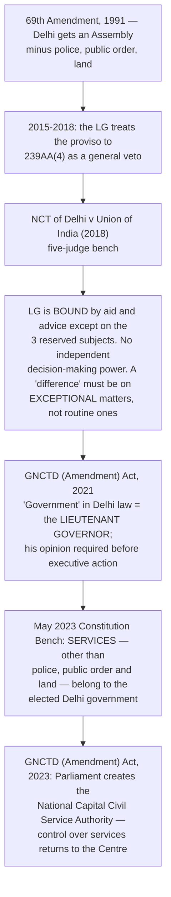

# Chapter 39 — Union Territories

[← Chapter 38](../Part_V_Local_Government/38_Municipalities.md) · [Part Index](00_INDEX.md) · [Master](../00_INDEX.md) · [Chapter 40 →](40_Scheduled_and_Tribal_Areas.md)

**Read time ~14 min** · **Part VIII, Articles 239–241** · 🟠 Prelims: rising since 2019 · ⚠️ **Mains: 2016 (×2), 2025** — all three on the *same fault line*

> 📌 **This chapter used to be a throwaway. It is not any more.** ⭐ Three of the biggest constitutional events of the last decade happened inside it — the **Delhi LG-vs-elected-government battle**, the **abrogation of Article 370**, and the **creation of two new Union Territories in 2019**. All three are live, all three have been asked, and all three turn on one question: **how much government does a Union Territory actually get?**

---

## 🎯 The one-line point

> A state has **its own** government. A Union Territory is **administered by the Centre** — and anything more than that (an assembly, a chief minister, a high court) is a **gift Parliament chooses to give and can take back**. ⭐ **Every conflict in this chapter is a fight over the size of that gift.**

---

## PART A — Why Union Territories exist at all

The Constitution began with a **four-fold classification** of territory *(see [Ch 5](../Part_I_Constitutional_Framework/05_Union_and_its_Territory.md))*. The **States Reorganisation Act, 1956** and the **7th Amendment** swept it away and left **two** categories: **states** and **union territories**.

⭐ **The four reasons a place is made a UT rather than a state** — this is the analytical frame examiners want:

| Reason | Examples |
|---|---|
| ⭐ **Strategic / security** | **Andaman and Nicobar Islands**, **Lakshadweep** — remote, thinly populated, militarily sensitive |
| ⭐ **Distinct culture, too small to be a state** | **Puducherry** *(French)*, **Dadra and Nagar Haveli and Daman and Diu** *(Portuguese)* |
| ⭐ **Special status of the capital** | **Delhi** — a national capital cannot belong to any one state |
| ⭐ **Protection of tribal / backward populations** | Historically **Mizoram, Manipur, Tripura, Arunachal Pradesh, Goa** — all of which were UTs first and became **states later** |

> ⭐ **The point that last row makes:** ⚠️ **UT status is not permanent.** Several of today's states were once Union Territories. ⭐ **The traffic also runs the other way** — **Jammu and Kashmir became a UT from a state in 2019**, the first time in Indian history that has happened.

### ⭐ The list today — 8 Union Territories

| # | Union Territory | Legislature? | High Court |
|---|---|---|---|
| 1 | ⭐ **Delhi (NCT)** | ⭐ **Yes** — 70 seats | **Its own** *(Delhi HC, 1966)* |
| 2 | ⭐ **Puducherry** | ⭐ **Yes** — 30 elected + 3 nominated | Madras |
| 3 | ⭐ **Jammu and Kashmir** | ⭐ **Yes** *(since 31 Oct 2019)* | Common **J&K and Ladakh HC** |
| 4 | ⭐ **Ladakh** | ⚠️ **No** | Common **J&K and Ladakh HC** |
| 5 | **Chandigarh** | No | Punjab and Haryana |
| 6 | **Andaman and Nicobar Islands** | No | Calcutta |
| 7 | **Lakshadweep** | No | Kerala |
| 8 | **Dadra and Nagar Haveli and Daman and Diu** | No | Bombay |

> ⚠️ **Two date traps — exactly the kind of thing 2026-style Prelims now punishes:**
> - ⭐ **J&K and Ladakh became UTs on 31 October 2019** *(Sardar Patel's birth anniversary)* — the **Act** is of **August 2019**, the **UTs** date from **October 2019**.
> - ⭐ **Dadra and Nagar Haveli** and **Daman and Diu** merged into **one** UT on **26 January 2020** — which is why the count went **9 → 8**, not up.

---

## PART B — The constitutional scheme *(Articles 239–241)*

### ⭐ Article 239 — the default rule

> **Every Union Territory is administered by the PRESIDENT, acting through an ADMINISTRATOR appointed by him.**

| Point | Detail |
|---|---|
| ⭐ **The administrator is an AGENT of the President** | ⚠️ **He is NOT a head of state like a Governor.** A Governor is a constitutional head holding an office of his own; an administrator is the President's *delegate* |
| **Designations** | ⭐ **Lieutenant Governor** *(Delhi, Puducherry, J&K, Ladakh, A&N)* · **Administrator** *(Chandigarh, Lakshadweep, DNH&DD)* |
| ⚠️ **The overlap provision** | ⭐ **The President may appoint the GOVERNOR OF A STATE as the administrator of an adjoining UT** — and when he does, the Governor acts ⭐ **independently of his own council of ministers**. *(This is how the **Governor of Punjab administers Chandigarh**.)* |

### ⭐ Article 239A — legislatures for UTs

Parliament may, **by ordinary law**, create for a Union Territory a **legislature**, a **council of ministers**, or **both** — and may decide their constitution, powers and functions.

> ⭐⭐ **Read that sentence twice — it is the whole chapter.** ⚠️ **A UT assembly is created by ORDINARY LAW, not by a constitutional amendment.** So:
> - Creating it needs only a **simple majority**;
> - ⚠️ **Abolishing it needs only a simple majority too**;
> - ⚠️ **Article 368 is not attracted, and no state ratification is needed.**
>
> ⭐ **That is exactly how Jammu and Kashmir — the state with the most entrenched special status in the Constitution — became a legislature-holding UT through an ordinary Act of Parliament in 2019.**

Article 239A was inserted by the **14th Amendment, 1962** and today underpins **Puducherry**.

### ⭐ Article 239AA — the special case of DELHI

Inserted by the ⭐ **69th Amendment Act, 1991** *(in force 1 February 1992)*, on the recommendation of the ⭐ **Balakrishnan Committee (1989)**.

| Element | Provision |
|---|---|
| **Name** | ⭐ **National Capital Territory of Delhi**; the administrator is styled ⭐ **Lieutenant Governor** |
| **Assembly** | ⭐ **70 members**, directly elected, **5-year** term |
| ⭐⭐ **Legislative competence** | The Assembly may legislate on the **State List and the Concurrent List** — ⚠️ **EXCEPT entries 1 (public order), 2 (police) and 18 (land)**, and entries 64, 65 and 66 so far as they relate to those three |
| **Council of Ministers** | ⭐ **Chief Minister + ministers not exceeding 10% of the Assembly's strength** *(so a maximum of **7**)*, to **aid and advise** the LG |
| ⭐ **The difference-of-opinion clause** | ⚠️ **Proviso to 239AA(4):** if the LG differs from his ministers on **any matter**, he **refers it to the PRESIDENT** and acts as the President decides. Pending that, in an **urgent** case he may act on his own |
| **Article 239AB** | ⭐ **President's rule for Delhi** — where administration cannot be carried on under 239AA, the President may **suspend** the provision and make incidental arrangements |

> ⭐⭐ **"Public order, police, land" is the single most examinable phrase in this chapter.** ⚠️ **Memory hook: the Delhi government does not control the POLICE, the LAND, or the STREETS.** Everything else it does control.

### 🕰️ The Delhi battle — the sequence you need

> ⭐⭐ **The lesson to carry into an answer:** ⚠️ **because Delhi's autonomy rests on an ordinary law read alongside Article 239AA, Parliament can legislatively reverse a Supreme Court judgment about it.** That is not possible for a state. ⭐ **It is the sharpest illustration in the Constitution of the difference between a state and a Union Territory.**

### ⭐ Article 239B and Article 240 — law-making without a legislature

| Article | Power | Applies to |
|---|---|---|
| ⭐ **239B** | The **administrator** may promulgate **ordinances** when the legislature is in recess — ⚠️ **only with the President's prior instructions** | UTs **with** legislatures *(Puducherry)* |
| ⭐⭐ **240** | The **PRESIDENT** may make **REGULATIONS for the peace, progress and good government** of the UT | ⭐ **Andaman and Nicobar Islands · Lakshadweep · Dadra and Nagar Haveli and Daman and Diu · Puducherry** *(Puducherry only when its Assembly is suspended or dissolved)* |

> ⭐⭐ **The killer fact about a regulation under Article 240:** ⚠️ **it has the SAME FORCE AND EFFECT as an Act of Parliament, and may REPEAL OR AMEND an Act of Parliament in its application to that UT.**
>
> ⭐ **Think about what that means:** the **executive** is making law that overrides the **legislature's** law. It is the widest law-making power the Constitution gives the President, and it exists only here.

### ⭐ Article 241 — High Courts

Parliament may **by law constitute a High Court for a Union Territory**, or declare any court in it to be a High Court.

⚠️ **Only Delhi has its own High Court** *(since 1966)*. **J&K and Ladakh share one.** The rest fall under the High Court of a neighbouring state.

---

## PART C — The two live cases

### ⭐ Puducherry — the quieter model

| Element | Detail |
|---|---|
| **Basis** | ⭐ **Article 239A** + the **Government of Union Territories Act, 1963** |
| **Assembly** | ⭐ **30 elected + 3 nominated by the Central Government** |
| ⭐ **Legislative competence** | **State List and Concurrent List — with NO subject excluded** *(unlike Delhi)* |
| ⚠️ **But** | A law of the Puducherry Assembly is **void to the extent it is repugnant to a law of Parliament** on the same subject; and ⭐ **Parliament retains full power to legislate for Puducherry on ANY subject** |
| **Ministers** | ⭐ Chief Minister + ministers **not exceeding 10%** of total members |
| **Territory** | ⚠️ Four **non-contiguous** districts — **Puducherry, Karaikal** *(in Tamil Nadu)*, **Yanam** *(Andhra Pradesh)*, **Mahe** *(Kerala)* |

> ⭐ **Puducherry's exam value is as a CONTRAST:** ⚠️ **Delhi is the one with subjects carved out; Puducherry has none carved out but is the smaller, weaker body.** Examiners swap the two.

### ⭐⭐ Jammu and Kashmir — the 2019 reorganisation

| Step | What happened |
|---|---|
| ⭐ **5 August 2019** | A **Presidential Order (C.O. 272)** with a **parliamentary resolution** → all provisions of the Constitution were applied to J&K, hollowing out **Article 370** |
| ⭐ **Article 35A** | Ceased to operate — it had been inserted by a **Presidential Order of 1954**, not by amendment, which is why it went with 370 |
| ⭐ **J&K Reorganisation Act, 2019** | Split the state into ⭐ **two Union Territories**: **J&K with a legislature**, **Ladakh without one** — effective **31 October 2019** |
| ⭐ ***In Re: Article 370* (Dec 2023)** | A five-judge bench ⭐ **upheld the abrogation**, holding that J&K retained **no internal sovereignty** after accession and that **Article 370 was a transitional provision**. ⚠️ It **directed the restoration of statehood "at the earliest"** and **elections by 30 September 2024** |
| ⭐ **Assembly elections** | Held **September–October 2024** — the first in **ten years** |

⭐ **The J&K Assembly's powers — precisely what [Mains 2025 Q4](../../04_PYQ_Mains/2025.md) asked:**

- It may legislate on the **State List** ⚠️ **except "public order" and "police"**, and on the **Concurrent List**;
- ⚠️ **Parliament retains concurrent power over all of it**, and a **central law prevails** over a repugnant J&K law;
- **114 seats** on paper, of which ⭐ **24 are reserved for Pakistan-occupied territory and remain vacant** — so the working strength is **90**;
- The **Lieutenant Governor** may also **nominate 5 members**;
- ⭐ **Reservation of Bills** for the President's consideration is wider than for a state.

> ⭐ **The one-line comparison worth memorising:** ⚠️ **Delhi loses police, public order AND land. J&K loses police and public order — but keeps LAND.**

---

## 🧠 Memory hooks

### The count and the two dates
> ⭐ **8 UTs.** ⭐ **31 October 2019** — J&K and Ladakh created *(Patel's birthday)*. ⭐ **26 January 2020** — DNH and DD merged, 9 became 8.

### The four articles
> ⭐ **239 — the President administers through an ADMINISTRATOR.** ⭐ **239A — Parliament may give a UT a legislature by ORDINARY LAW.** ⭐ **240 — the President makes REGULATIONS that can repeal an Act of Parliament.** ⭐ **241 — Parliament may constitute a HIGH COURT.** *(239AA and 239AB are Delhi's; 239B is the ordinance power.)*

### What Delhi cannot touch
> ⭐⭐ **POLICE · PUBLIC ORDER · LAND** — entries **2, 1 and 18** of the State List. ⚠️ **"The Delhi government runs the schools, not the streets."**

### Delhi vs Puducherry vs J&K
> ⭐ **Delhi — 70 seats, 3 subjects excluded, 69th Amendment, Article 239AA.**
> ⭐ **Puducherry — 30 + 3 nominated, NO subject excluded, Article 239A + the 1963 Act.**
> ⭐ **J&K — 90 working seats + 5 nominated, police and public order excluded, the 2019 Act.**

### The Delhi case-law chain
> ⭐ **2018 — the LG is bound by aid and advice except on the three subjects.** ⭐ **2023 — SERVICES belong to the elected government.** ⚠️ ⭐ **2023 Act — Parliament reverses it through the National Capital Civil Service Authority.**

---

## ❓ Expected Mains questions

**1. "Discuss the nature of the Jammu and Kashmir Legislative Assembly after the Jammu and Kashmir Reorganization Act, 2019. Briefly describe the powers and functions of the Assembly of the Union Territory of Jammu and Kashmir." (250 words)**
> *Actually asked — [Mains 2025 Q4](../../04_PYQ_Mains/2025.md).*
> *Skeleton:* (i) **The change of nature** — from the legislature of a state with its own constitution *(Articles 370, 35A)* to the legislature of a **Union Territory created by an ordinary Act of Parliament**, whose existence Parliament may alter at will. (ii) **Composition** — 114 seats, **24 vacant for PoK**, working strength **90**, plus **5 LG nominations**; five-year term. (iii) ⭐ **Competence** — State List **minus public order and police**, plus the Concurrent List; ⚠️ **Parliament legislates concurrently and prevails**. (iv) **Executive** — the CM and council **aid and advise the LG**, who retains discretion on reserved subjects and a wider power to **reserve Bills**. (v) ⭐ **Conclude with *In Re: Article 370* (2023)** — abrogation upheld, **statehood to be restored "at the earliest"**, elections directed and held in **2024**; so the Assembly's present form is best described as **transitional**.

**2. "Discuss the essentials of the 69th Constitutional Amendment Act and anomalies, if any, that have led to the recent reported conflicts between the elected representatives and the institution of the Lieutenant Governor in the administration of Delhi." (250 words)**
> *Actually asked — [Mains 2016 Q1](../../04_PYQ_Mains/2016.md).*
> *Skeleton:* **Essentials** — Article **239AA**; NCT; a **70-seat Assembly**; State + Concurrent List **minus entries 1, 2 and 18**; council of ministers capped at **10%**; Article **239AB** for President's rule. ⭐ **The anomalies** — (a) the **proviso to 239AA(4)** gives the LG a reference power with **no limiting words**, read by successive LGs as a general veto; (b) Delhi is **simultaneously** a UT under Article 239 *(the President administers)* and a quasi-state under 239AA *(an elected government)* — **two masters, one territory**; (c) **"services"** were left unallocated, producing the control-over-officers fight. **Resolution** — the **2018** bench confined the LG to aid and advice; the **2023** bench gave services to the elected government; ⚠️ **Parliament reversed that by statute the same year**. **Conclude:** the anomaly is structural — an elected government whose powers rest on **ordinary law** can always be legislated over, so the trend is **towards centralisation**, not away from it.

**3. "To what extent is Article 370, bearing the marginal note 'Temporary provision with respect to the State of Jammu and Kashmir', temporary?" (250 words)**
> *Actually asked — [Mains 2016 Q2](../../04_PYQ_Mains/2016.md) — and now answerable with the benefit of hindsight.*
> *Skeleton:* **The case for permanence** *(as argued until 2019)* — placed in **Part XXI** but operative for seventy years; **Article 370(3)** required the recommendation of the **Constituent Assembly of J&K**, which dissolved in **1957**, so the exit door appeared **welded shut**. **The case for temporariness** — the **marginal note**; its purpose was to manage an **incomplete accession**; and Article 370 was itself the **route** by which the rest of the Constitution was extended piece by piece. ⭐ **What happened** — 2019 used **Article 367** to read "Constituent Assembly" as "Legislative Assembly", and with the state under President's rule, **Parliament stood in for it**. ⭐ ***In Re: Article 370* (2023)** upheld the result: the provision was **temporary in character** and J&K had **no residual sovereignty**. **Conclude:** temporary in law, permanent in practice for seven decades — and the *manner* of its removal is now the constitutional controversy, not the fact of it.

**4. "A Union Territory with a legislature is a state in appearance and a Union Territory in law." Examine. (250 words)**
> *Skeleton:* **Appearance** — an elected assembly, a CM, a council of ministers, a budget, its own laws. ⭐ **Law** — created under **Article 239A by ordinary legislation**; **Article 239 survives**, so the President still administers through an administrator; **subjects are carved out** *(Delhi: police, public order, land)*; **Parliament legislates concurrently and prevails**; **no Article 368 protection** — the assembly can be abolished by simple majority. Illustrate with **Delhi 2021 and 2023** and with **J&K 2019**. **Conclude** with the federal implication: **a UT legislature enjoys delegated, not divided, sovereignty.**

---

## ⚡ 60-second revision

- ⭐ **8 Union Territories.** With legislatures: ⭐ **Delhi, Puducherry, J&K**. Without: ⭐ **Ladakh, Chandigarh, A&N, Lakshadweep, DNH&DD**.
- ⭐ **Article 239** — administered by the **President** through an **administrator** *(LG / Administrator)*; ⭐ the President may appoint a **state Governor** as administrator of an **adjoining** UT, who then acts **independently of his ministers** *(Punjab Governor → Chandigarh)*.
- ⭐⭐ **Article 239A** — Parliament may create a UT legislature **by ORDINARY LAW** ⇒ ⚠️ **it can be taken away by ordinary law too.**
- ⭐⭐ **Article 239AA (69th Amendment, 1991; Balakrishnan Committee)** — Delhi, **70 seats**, State + Concurrent List ⚠️ **minus public order, police and land**; ministers ≤ **10%** *(max 7)*; ⭐ **proviso to 239AA(4)** = the LG's reference to the President. **239AB** = President's rule for Delhi.
- ⭐ **Article 239B** — the administrator's **ordinance** power *(Puducherry)*, needing the **President's prior instructions**.
- ⭐⭐ **Article 240** — the President's **regulation** power for **A&N, Lakshadweep, DNH&DD, Puducherry**; ⚠️ **a regulation may REPEAL an Act of Parliament** for that UT.
- ⭐ **Article 241** — Parliament may constitute a **High Court**; ⚠️ **only Delhi has its own.**
- ⭐ **Puducherry** — Art 239A + the **1963 Act**; **30 elected + 3 nominated**; **no subject excluded**, but **central law prevails**.
- ⭐⭐ **J&K** — **Reorganisation Act 2019**, effective **31 Oct 2019**; **two UTs**, Ladakh **without** a legislature; the Assembly excludes ⚠️ **police and public order only**; **24 seats vacant for PoK**; **5 LG nominees**; ***In Re: Article 370* (2023)** upheld abrogation and ordered **elections by Sept 2024** *(held Oct 2024)*.
- ⭐ **Delhi chain: 2018 judgment → 2021 Act → 2023 judgment → 2023 Act.** ⚠️ **The statute keeps winning, because the autonomy is statutory.**

---

## 🔗 Practice this chapter

**Mains:** [2016 Q1](../../04_PYQ_Mains/2016.md) — the 69th Amendment and the Delhi LG conflict · [2016 Q2](../../04_PYQ_Mains/2016.md) — how temporary is Article 370 · [2025 Q4](../../04_PYQ_Mains/2025.md) — the J&K Assembly after the 2019 Act

**Cross-links:** [Ch 5 Union and its Territory](../Part_I_Constitutional_Framework/05_Union_and_its_Territory.md) — Articles 1–4 and how territory is altered · [Ch 13 Federal System](../Part_II_System_of_Government/13_Federal_System.md) — why India is "a Union of States" · [Ch 36 Special Provisions](../Part_IV_State_Government/36_Special_Provisions.md) — Articles 371–371J, the *state-side* counterpart of this chapter · [Ch 30 Governor](../Part_IV_State_Government/30_Governor.md) — contrast the Governor with an administrator

**Next:** [Chapter 40 — Scheduled and Tribal Areas](40_Scheduled_and_Tribal_Areas.md) — the other half of "special areas", and a far more heavily examined one.

---

[← Chapter 38](../Part_V_Local_Government/38_Municipalities.md) · [Part Index](00_INDEX.md) · [Master](../00_INDEX.md) · [Chapter 40 →](40_Scheduled_and_Tribal_Areas.md)
